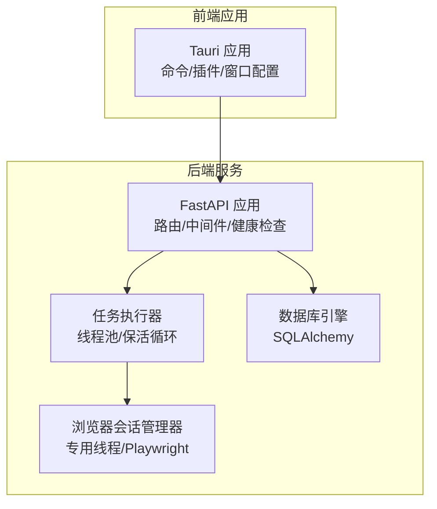
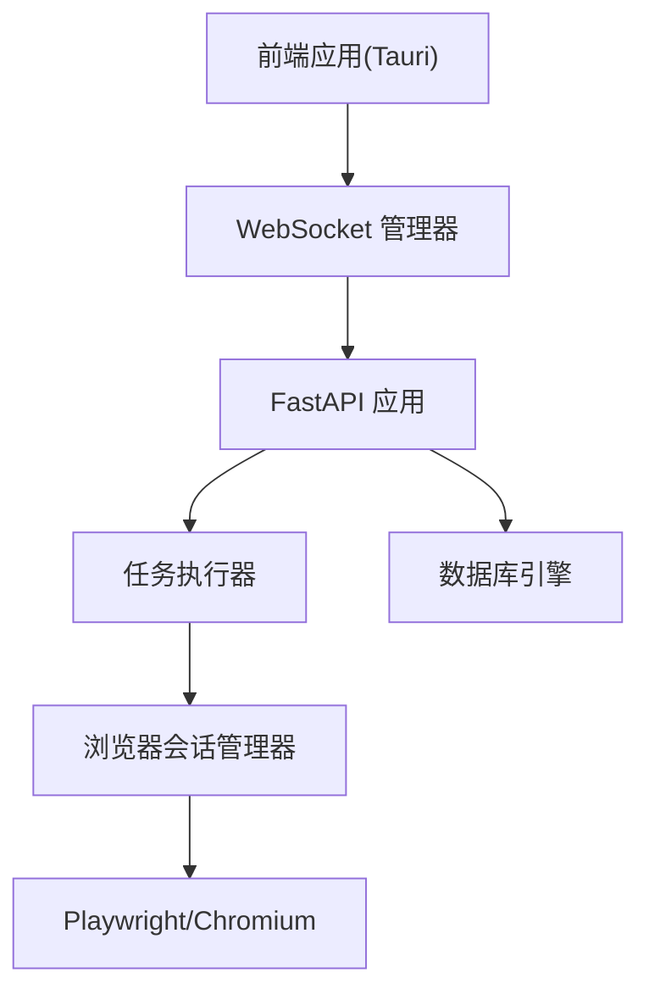
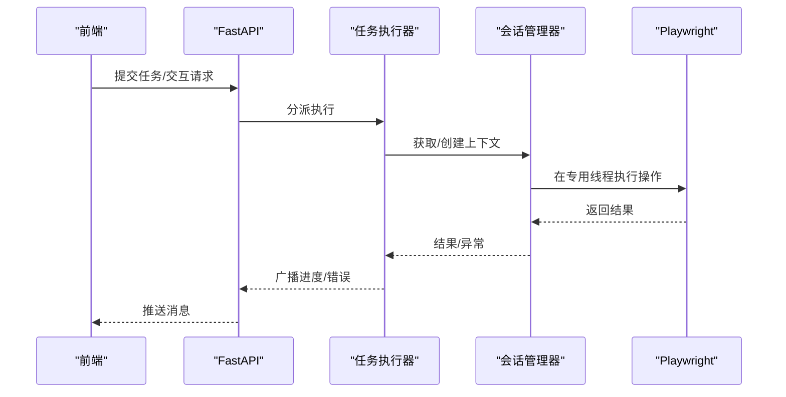
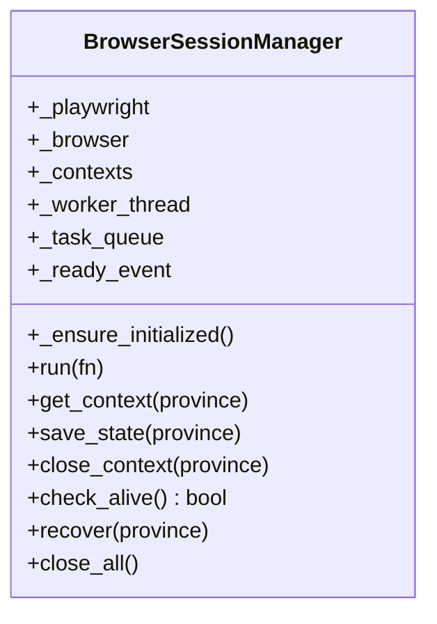
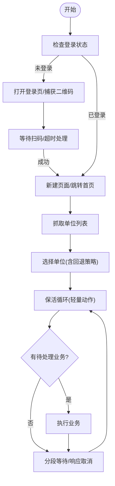
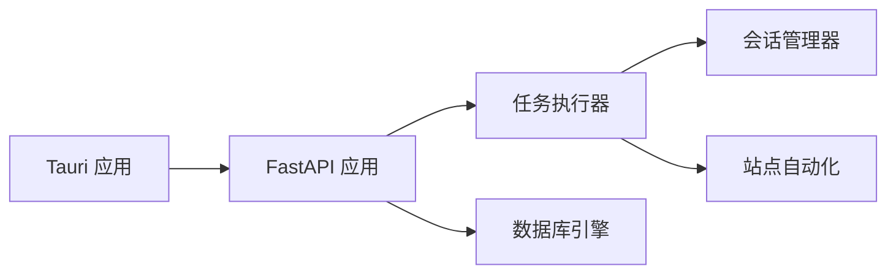

# 单机进程级沙箱部署

<cite>
**本文引用的文件**
- [main.py](file://CCC_RPA_API/app/main.py)
- [config.py](file://CCC_RPA_API/app/config.py)
- [executor.py](file://CCC_RPA_API/app/services/executor.py)
- [session_manager.py](file://CCC_RPA_API/app/browser/session_manager.py)
- [site_automation.py](file://CCC_RPA_API/app/browser/site_automation.py)
- [waiter.py](file://CCC_RPA_API/app/browser/waiter.py)
- [main.rs](file://CCC-BrowserV4/src-tauri/src/main.rs)
- [tauri.conf.json](file://CCC-BrowserV4/src-tauri/tauri.conf.json)
- [project.md](file://project.md)
</cite>

## 目录
1. [简介](#简介)
2. [项目结构](#项目结构)
3. [核心组件](#核心组件)
4. [架构总览](#架构总览)
5. [组件详解](#组件详解)
6. [依赖关系分析](#依赖关系分析)
7. [性能考量](#性能考量)
8. [故障排除指南](#故障排除指南)
9. [结论](#结论)
10. [附录](#附录)

## 简介
本技术文档面向“单机进程级沙箱部署”形态，聚焦于内部测试环境的部署架构与实现要点，覆盖 Linux 与 Windows 两大平台。Linux 平台通过 unshare 创建独立 mnt/net 命名空间与 cgroup v2 资源限制，Windows 平台通过 Win32 Job 对象进行进程资源管控，并以 NTFS ACL 隔离 UserData 目录访问权限。文档同时给出部署配置示例、最佳实践、调试技巧、性能优化建议以及与 Kubernetes Pod 沙箱在隔离级别、资源配置与生命周期管理上的差异对比。

## 项目结构
本仓库包含两套主要能力：
- 后端服务（Python/FastAPI）：提供任务编排、浏览器会话管理、WebSocket 推送与数据库交互。
- 前端应用（Tauri/Vue）：提供桌面端 GUI，承载登录回调、设备信息与交互控制。

图表来源
- [main.py:12-127](file://CCC_RPA_API/app/main.py#L12-L127)
- [executor.py:1-319](file://CCC_RPA_API/app/services/executor.py#L1-L319)
- [session_manager.py:10-186](file://CCC_RPA_API/app/browser/session_manager.py#L10-L186)
- [main.rs:7-28](file://CCC-BrowserV4/src-tauri/src/main.rs#L7-L28)
- [tauri.conf.json:1-29](file://CCC-BrowserV4/src-tauri/tauri.conf.json#L1-L29)

章节来源
- [main.py:12-127](file://CCC_RPA_API/app/main.py#L12-L127)
- [executor.py:1-319](file://CCC_RPA_API/app/services/executor.py#L1-L319)
- [session_manager.py:10-186](file://CCC_RPA_API/app/browser/session_manager.py#L10-L186)
- [main.rs:7-28](file://CCC-BrowserV4/src-tauri/src/main.rs#L7-L28)
- [tauri.conf.json:1-29](file://CCC-BrowserV4/src-tauri/tauri.conf.json#L1-L29)

## 核心组件
- FastAPI 应用与路由：CORS、健康检查、WebSocket 管理、数据库初始化与迁移。
- 任务执行器：线程池驱动的执行流程，包含扫码登录、单位选择、保活循环与业务触发。
- 浏览器会话管理器：专用线程承载 Playwright/Chromium，按省份维护上下文，持久化 storage_state。
- 等待器：基于 Event 的阻塞/取消/检查机制，支持扫码与单位选择等交互阶段。
- 前端 Tauri 应用：窗口、插件、命令注册与 CSP 安全策略。

章节来源
- [main.py:12-127](file://CCC_RPA_API/app/main.py#L12-L127)
- [executor.py:17-319](file://CCC_RPA_API/app/services/executor.py#L17-L319)
- [session_manager.py:10-186](file://CCC_RPA_API/app/browser/session_manager.py#L10-L186)
- [waiter.py:7-84](file://CCC_RPA_API/app/browser/waiter.py#L7-L84)
- [main.rs:7-28](file://CCC-BrowserV4/src-tauri/src/main.rs#L7-L28)
- [tauri.conf.json:24-26](file://CCC-BrowserV4/src-tauri/tauri.conf.json#L24-L26)

## 架构总览
下图展示单机进程级沙箱在内部测试环境中的运行时关系：后端服务作为任务编排与浏览器会话中枢，前端应用提供交互界面；浏览器会话管理器在专用线程中运行，确保与主线程事件循环解耦。

图表来源
- [main.py:12-127](file://CCC_RPA_API/app/main.py#L12-L127)
- [executor.py:78-319](file://CCC_RPA_API/app/services/executor.py#L78-L319)
- [session_manager.py:30-186](file://CCC_RPA_API/app/browser/session_manager.py#L30-L186)

## 组件详解

### 任务执行器（线程池与保活循环）
- 使用线程池执行耗时任务，避免阻塞 FastAPI 事件循环。
- 在扫码登录、单位选择、业务触发等阶段采用独立等待线程，避免阻塞浏览器工作线程。
- 保活循环在当前业务页面执行轻量级动作，维持会话活跃，支持取消信号与超时控制。

图表来源
- [executor.py:317-319](file://CCC_RPA_API/app/services/executor.py#L317-L319)
- [session_manager.py:80-96](file://CCC_RPA_API/app/browser/session_manager.py#L80-L96)

章节来源
- [executor.py:17-319](file://CCC_RPA_API/app/services/executor.py#L17-L319)
- [waiter.py:7-84](file://CCC_RPA_API/app/browser/waiter.py#L7-L84)

### 浏览器会话管理器（专用线程与上下文持久化）
- 专用工作线程承载 Playwright/Chromium，避免与主线程事件循环冲突。
- 按省份维护 BrowserContext，支持 storage_state 持久化与恢复。
- 提供检查存活、恢复、关闭等生命周期管理方法。

图表来源
- [session_manager.py:10-186](file://CCC_RPA_API/app/browser/session_manager.py#L10-L186)

章节来源
- [session_manager.py:10-186](file://CCC_RPA_API/app/browser/session_manager.py#L10-L186)

### 站点自动化（登录、单位选择、保活与业务检测）
- 登录状态检查、二维码捕获、扫码等待与登录成功确认。
- 单位列表抓取与单位选择，包含多种选择器与 JS 回退策略。
- 页面保活：随机滚动、点击刷新、随机点击链接、键盘 Tab 等，避免页面休眠。
- 待处理业务检测：基于徽标与关键词匹配，支持业务类型识别。

图表来源
- [site_automation.py:38-752](file://CCC_RPA_API/app/browser/site_automation.py#L38-L752)
- [executor.py:78-267](file://CCC_RPA_API/app/services/executor.py#L78-L267)

章节来源
- [site_automation.py:38-752](file://CCC_RPA_API/app/browser/site_automation.py#L38-L752)
- [executor.py:78-267](file://CCC_RPA_API/app/services/executor.py#L78-L267)

### 前端应用（Tauri）
- 注册命令与插件，设置窗口尺寸与最小尺寸，配置 CSP。
- 与后端通过 WebSocket 通信，接收任务进度与二维码推送。

章节来源
- [main.rs:7-28](file://CCC-BrowserV4/src-tauri/src/main.rs#L7-L28)
- [tauri.conf.json:1-29](file://CCC-BrowserV4/src-tauri/tauri.conf.json#L1-L29)

## 依赖关系分析
- 后端服务依赖 SQLAlchemy 进行数据库访问，依赖 WebSocket 管理器进行消息广播。
- 任务执行器依赖会话管理器与站点自动化模块，二者通过专用线程解耦。
- 前端应用通过命令与插件与系统能力集成，受 CSP 限制连接特定地址。

图表来源
- [main.py:24-27](file://CCC_RPA_API/app/main.py#L24-L27)
- [executor.py:12-15](file://CCC_RPA_API/app/services/executor.py#L12-L15)
- [session_manager.py:13](file://CCC_RPA_API/app/browser/session_manager.py#L13)
- [site_automation.py:5](file://CCC_RPA_API/app/browser/site_automation.py#L5)
- [main.rs:12-18](file://CCC-BrowserV4/src-tauri/src/main.rs#L12-L18)

章节来源
- [main.py:24-27](file://CCC_RPA_API/app/main.py#L24-L27)
- [executor.py:12-15](file://CCC_RPA_API/app/services/executor.py#L12-L15)
- [session_manager.py:13](file://CCC_RPA_API/app/browser/session_manager.py#L13)
- [site_automation.py:5](file://CCC_RPA_API/app/browser/site_automation.py#L5)
- [main.rs:12-18](file://CCC-BrowserV4/src-tauri/src/main.rs#L12-L18)

## 性能考量
- 线程模型：任务执行器与会话管理器分别使用线程池与专用线程，避免阻塞事件循环与浏览器工作线程。
- I/O 与等待：扫码与单位选择阶段使用独立等待线程，减少对浏览器线程的阻塞。
- 保活策略：在当前页面执行轻量级动作，降低页面跳转带来的开销。
- 数据持久化：storage_state 持久化减少重复登录成本，提升会话恢复效率。
- 资源限制：在 Linux 平台可通过 cgroup v2 限制 CPU/内存，Windows 平台通过 Job 对象限制资源。

## 故障排除指南
- 浏览器异常恢复：当检测到浏览器关闭或页面异常时，执行器会尝试恢复会话并重新打开页面。
- 二维码与登录：若二维码截图失败，采用整页截图降级；扫码等待超时需检查前端推送与后端等待器状态。
- 单位选择失败：若 CSS 选择器失败，采用 JS 回退策略；必要时保存失败截图辅助定位。
- 保活循环中断：支持取消信号与超时控制，分段等待便于快速响应。
- WebSocket 广播：若主事件循环不可用，广播将被忽略并记录警告。

章节来源
- [executor.py:42-70](file://CCC_RPA_API/app/services/executor.py#L42-L70)
- [site_automation.py:148-173](file://CCC_RPA_API/app/browser/site_automation.py#L148-L173)
- [site_automation.py:294-541](file://CCC_RPA_API/app/browser/site_automation.py#L294-L541)
- [executor.py:208-267](file://CCC_RPA_API/app/services/executor.py#L208-L267)
- [main.py:22-32](file://CCC_RPA_API/app/main.py#L22-L32)

## 结论
本单机进程级沙箱方案通过专用线程与线程池解耦后端服务与浏览器操作，结合 storage_state 持久化与保活策略，实现了稳定的自动化执行流程。Linux 平台可进一步引入 unshare 与 cgroup v2 实现更强的资源隔离，Windows 平台可利用 Win32 Job 对象与 NTFS ACL 实现进程与数据隔离。与 Kubernetes Pod 沙箱相比，单机进程级沙箱在隔离级别与资源控制上相对简化，但在部署与运维复杂度上具备优势。

## 附录

### Linux 平台：unshare 与 cgroup v2 资源隔离
- 命名空间隔离：使用 unshare 创建独立 mnt/net 命名空间，确保进程与网络隔离。
- 资源限制：通过 cgroup v2 控制 CPU、内存与 IO，防止单会话资源滥用。
- UserData 隔离：为每个会话分配独立目录，避免跨会话共享浏览器状态。

### Windows 平台：Win32 Job 对象与 NTFS ACL
- 进程管控：使用 Win32 Job 对象限制进程组的 CPU/内存/句柄等资源。
- 访问控制：通过 NTFS ACL 严格限制 UserData 目录的读写权限，仅允许当前会话用户访问。

### 配置示例与最佳实践
- 环境变量与数据库连接：通过配置类集中管理数据库连接参数。
- 日志与调试：在关键节点保存截图与页面状态，便于问题定位。
- 超时与取消：为长时间等待设置合理超时与取消信号，保障系统稳定性。
- 部署建议：Linux 平台启用 cgroup v2 并配置 systemd slice；Windows 平台为每个会话创建独立 Job 并设置 ACL。

章节来源
- [config.py:6-22](file://CCC_RPA_API/app/config.py#L6-L22)
- [site_automation.py:77-80](file://CCC_RPA_API/app/browser/site_automation.py#L77-L80)
- [site_automation.py:204-207](file://CCC_RPA_API/app/browser/site_automation.py#L204-L207)
- [site_automation.py:301-305](file://CCC_RPA_API/app/browser/site_automation.py#L301-L305)
- [site_automation.py:466-469](file://CCC_RPA_API/app/browser/site_automation.py#L466-L469)
- [project.md:263-291](file://project.md#L263-L291)