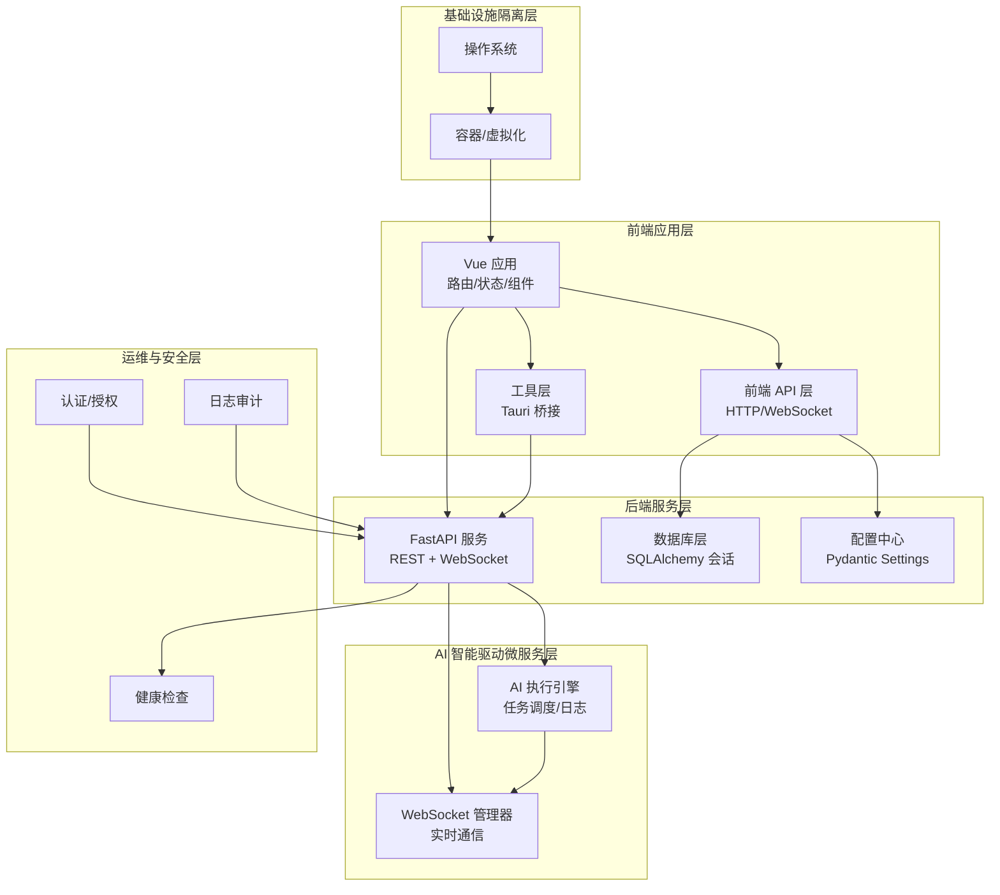
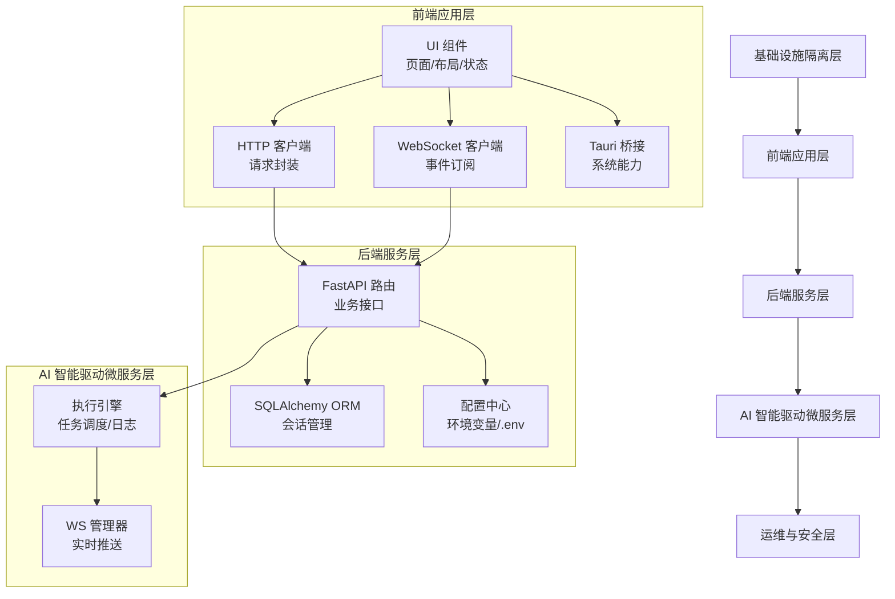
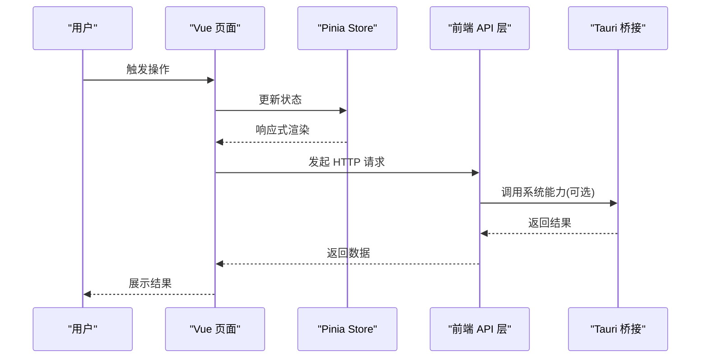
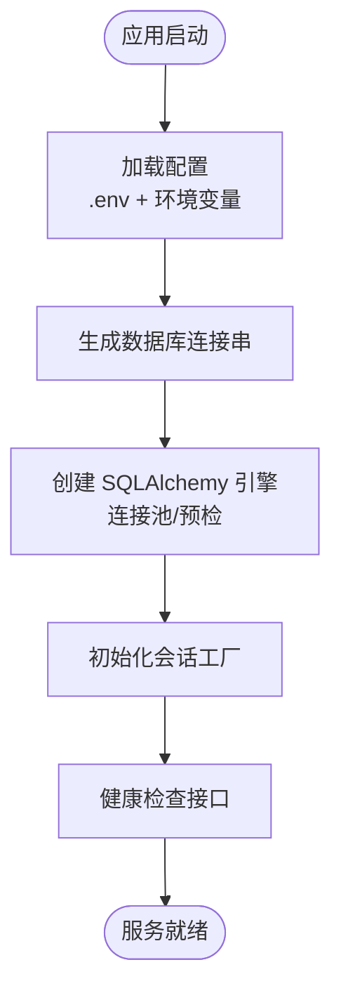
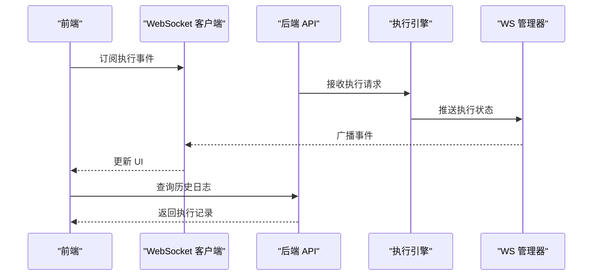
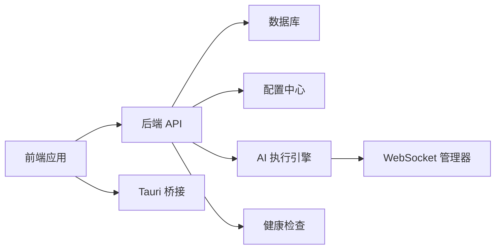

# 五层标准分层架构

<cite>
**本文档引用的文件**
- [backend/app/config.py](file://CCC-BrowserV4/backend/app/config.py)
- [backend/app/database.py](file://CCC-BrowserV4/backend/app/database.py)
- [backend/app/api/health.py](file://CCC-BrowserV4/backend/app/api/health.py)
- [src-tauri/src/main.rs](file://CCC-BrowserV4/src-tauri/src/main.rs)
- [frontend/src/main.ts](file://CCC-BrowserV4/frontend/src/main.ts)
- [src-tauri/src/commands.rs](file://CCC-BrowserV4/src-tauri/src/commands.rs)
- [src-tauri/src/device.rs](file://CCC-BrowserV4/src-tauri/src/device.rs)
- [frontend/src/router/index.ts](file://CCC-BrowserV4/frontend/src/router/index.ts)
- [frontend/src/stores/auth.ts](file://CCC-BrowserV4/frontend/src/stores/auth.ts)
- [frontend/src/stores/task.ts](file://CCC-BrowserV4/frontend/src/stores/task.ts)
- [frontend/src/stores/execution.ts](file://CCC-BrowserV4/frontend/src/stores/execution.ts)
- [frontend/src/api/auth.ts](file://CCC-BrowserV4/frontend/src/api/auth.ts)
- [frontend/src/api/tasks.ts](file://CCC-BrowserV4/frontend/src/api/tasks.ts)
- [frontend/src/api/execution.ts](file://CCC-BrowserV4/frontend/src/api/execution.ts)
- [frontend/src/api/ws.ts](file://CCC-BrowserV4/frontend/src/api/ws.ts)
- [frontend/src/utils/tauri-bridge.ts](file://CCC-BrowserV4/frontend/src/utils/tauri-bridge.ts)
</cite>

## 目录
1. [引言](#引言)
2. [项目结构](#项目结构)
3. [核心组件](#核心组件)
4. [架构总览](#架构总览)
5. [详细组件分析](#详细组件分析)
6. [依赖关系分析](#依赖关系分析)
7. [性能考虑](#性能考虑)
8. [故障排除指南](#故障排除指南)
9. [结论](#结论)

## 引言
本项目是一个商用级 AI 浏览器系统，采用五层标准分层架构设计，自下而上分别为：基础设施隔离层、前端应用层、后端服务层、AI 智能驱动微服务层、运维与安全层。该架构通过清晰的职责分离、稳定的接口契约和模块化的组件组织，确保系统具备良好的可扩展性、可维护性和安全性。

## 项目结构
系统采用前后端分离与原生桌面桥接相结合的混合架构：
- 前端使用 Vue 3 + TypeScript + Pinia + Element Plus 构建用户界面与状态管理
- 后端基于 FastAPI 提供 REST API 与 WebSocket 服务
- 原生层使用 Tauri + Rust 实现系统级能力（设备识别、本地存储、Shell/Open 等）
- 数据持久化支持 MySQL 与 SQLite 双模式，通过配置动态切换
- 健康检查与数据库连接状态统一暴露，便于容器化与云原生部署

**图表来源**
- [frontend/src/main.ts:1-23](file://CCC-BrowserV4/frontend/src/main.ts#L1-L23)
- [backend/app/api/health.py:1-18](file://CCC-BrowserV4/backend/app/api/health.py#L1-L18)
- [backend/app/config.py:1-52](file://CCC-BrowserV4/backend/app/config.py#L1-L52)
- [backend/app/database.py:1-45](file://CCC-BrowserV4/backend/app/database.py#L1-L45)
- [src-tauri/src/main.rs:1-29](file://CCC-BrowserV4/src-tauri/src/main.rs#L1-L29)

**章节来源**
- [frontend/src/main.ts:1-23](file://CCC-BrowserV4/frontend/src/main.ts#L1-L23)
- [backend/app/api/health.py:1-18](file://CCC-BrowserV4/backend/app/api/health.py#L1-L18)
- [backend/app/config.py:1-52](file://CCC-BrowserV4/backend/app/config.py#L1-L52)
- [backend/app/database.py:1-45](file://CCC-BrowserV4/backend/app/database.py#L1-L45)
- [src-tauri/src/main.rs:1-29](file://CCC-BrowserV4/src-tauri/src/main.rs#L1-L29)

## 核心组件
- 配置管理：集中式配置加载与数据库连接参数生成，支持运行时切换数据库类型
- 数据库访问：SQLAlchemy 引擎与会话工厂，提供连接池与健康检查
- 健康检查：统一的服务与数据库状态上报接口
- 前端应用：Vue 应用初始化、路由与状态管理集成
- 原生桥接：Tauri 插件与命令注册，提供设备识别与系统能力调用
- 前端 API 层：HTTP 与 WebSocket 客户端封装，统一请求与事件处理

**章节来源**
- [backend/app/config.py:1-52](file://CCC-BrowserV4/backend/app/config.py#L1-L52)
- [backend/app/database.py:1-45](file://CCC-BrowserV4/backend/app/database.py#L1-L45)
- [backend/app/api/health.py:1-18](file://CCC-BrowserV4/backend/app/api/health.py#L1-L18)
- [frontend/src/main.ts:1-23](file://CCC-BrowserV4/frontend/src/main.ts#L1-L23)
- [src-tauri/src/main.rs:1-29](file://CCC-BrowserV4/src-tauri/src/main.rs#L1-L29)

## 架构总览
五层架构设计理念：
- 基础设施隔离层：操作系统与容器化平台，提供资源隔离与弹性伸缩
- 前端应用层：用户交互与业务展示，通过 API 层与后端解耦
- 后端服务层：统一的 REST 与 WebSocket 服务，负责业务编排与数据持久化
- AI 智能驱动微服务层：执行引擎与实时通信，支撑 AI 驱动的任务自动化
- 运维与安全层：健康监控、认证授权与日志审计，保障系统稳定与安全

**图表来源**
- [frontend/src/main.ts:1-23](file://CCC-BrowserV4/frontend/src/main.ts#L1-L23)
- [frontend/src/api/auth.ts](file://CCC-BrowserV4/frontend/src/api/auth.ts)
- [frontend/src/api/tasks.ts](file://CCC-BrowserV4/frontend/src/api/tasks.ts)
- [frontend/src/api/execution.ts](file://CCC-BrowserV4/frontend/src/api/execution.ts)
- [frontend/src/api/ws.ts](file://CCC-BrowserV4/frontend/src/api/ws.ts)
- [frontend/src/utils/tauri-bridge.ts](file://CCC-BrowserV4/frontend/src/utils/tauri-bridge.ts)
- [backend/app/api/health.py:1-18](file://CCC-BrowserV4/backend/app/api/health.py#L1-L18)
- [backend/app/config.py:1-52](file://CCC-BrowserV4/backend/app/config.py#L1-L52)
- [backend/app/database.py:1-45](file://CCC-BrowserV4/backend/app/database.py#L1-L45)

## 详细组件分析

### 基础设施隔离层
- 容器化与平台抽象：通过 Docker Compose 与环境变量实现跨平台部署
- 资源隔离：操作系统层面的 CPU/内存/网络隔离，结合容器编排实现弹性扩缩容
- 安全边界：最小权限原则与网络策略，限制横向移动风险

### 前端应用层
- 应用初始化：Vue 应用挂载、路由与状态管理集成，Element Plus UI 组件库引入
- 页面与布局：主页、登录页、任务编辑页等页面组件与侧边栏、状态栏等布局组件
- 状态管理：Pinia Store 封装认证、设备、任务与执行状态，支持响应式更新
- 工具层：Tauri 桥接封装，提供系统能力调用与事件监听

**图表来源**
- [frontend/src/main.ts:1-23](file://CCC-BrowserV4/frontend/src/main.ts#L1-L23)
- [frontend/src/stores/auth.ts](file://CCC-BrowserV4/frontend/src/stores/auth.ts)
- [frontend/src/stores/task.ts](file://CCC-BrowserV4/frontend/src/stores/task.ts)
- [frontend/src/stores/execution.ts](file://CCC-BrowserV4/frontend/src/stores/execution.ts)
- [frontend/src/api/auth.ts](file://CCC-BrowserV4/frontend/src/api/auth.ts)
- [frontend/src/api/tasks.ts](file://CCC-BrowserV4/frontend/src/api/tasks.ts)
- [frontend/src/api/execution.ts](file://CCC-BrowserV4/frontend/src/api/execution.ts)
- [frontend/src/utils/tauri-bridge.ts](file://CCC-BrowserV4/frontend/src/utils/tauri-bridge.ts)

**章节来源**
- [frontend/src/main.ts:1-23](file://CCC-BrowserV4/frontend/src/main.ts#L1-L23)
- [frontend/src/router/index.ts](file://CCC-BrowserV4/frontend/src/router/index.ts)
- [frontend/src/stores/auth.ts](file://CCC-BrowserV4/frontend/src/stores/auth.ts)
- [frontend/src/stores/task.ts](file://CCC-BrowserV4/frontend/src/stores/task.ts)
- [frontend/src/stores/execution.ts](file://CCC-BrowserV4/frontend/src/stores/execution.ts)
- [frontend/src/api/auth.ts](file://CCC-BrowserV4/frontend/src/api/auth.ts)
- [frontend/src/api/tasks.ts](file://CCC-BrowserV4/frontend/src/api/tasks.ts)
- [frontend/src/api/execution.ts](file://CCC-BrowserV4/frontend/src/api/execution.ts)
- [frontend/src/api/ws.ts](file://CCC-BrowserV4/frontend/src/api/ws.ts)
- [frontend/src/utils/tauri-bridge.ts](file://CCC-BrowserV4/frontend/src/utils/tauri-bridge.ts)

### 后端服务层
- 配置管理：集中式配置加载，支持 .env 与环境变量覆盖，动态生成数据库连接串
- 数据库访问：SQLAlchemy 引擎与会话工厂，MySQL/SQLite 双模式支持，连接池与预检
- 健康检查：统一健康检查接口，返回服务与数据库连接状态
- API 设计：按功能模块划分路由，标签化组织接口，便于维护与测试

**图表来源**
- [backend/app/config.py:1-52](file://CCC-BrowserV4/backend/app/config.py#L1-L52)
- [backend/app/database.py:1-45](file://CCC-BrowserV4/backend/app/database.py#L1-L45)
- [backend/app/api/health.py:1-18](file://CCC-BrowserV4/backend/app/api/health.py#L1-L18)

**章节来源**
- [backend/app/config.py:1-52](file://CCC-BrowserV4/backend/app/config.py#L1-L52)
- [backend/app/database.py:1-45](file://CCC-BrowserV4/backend/app/database.py#L1-L45)
- [backend/app/api/health.py:1-18](file://CCC-BrowserV4/backend/app/api/health.py#L1-L18)

### AI 智能驱动微服务层
- 执行引擎：负责任务调度、执行日志记录与状态跟踪，支持异步执行与回滚机制
- WebSocket 管理器：统一的实时通信通道，向前端推送执行进度与异常信息
- 事件驱动：通过消息队列或事件总线实现跨模块解耦与可观测性

**图表来源**
- [frontend/src/api/ws.ts](file://CCC-BrowserV4/frontend/src/api/ws.ts)
- [frontend/src/api/execution.ts](file://CCC-BrowserV4/frontend/src/api/execution.ts)
- [backend/app/api/health.py:1-18](file://CCC-BrowserV4/backend/app/api/health.py#L1-L18)

**章节来源**
- [frontend/src/api/ws.ts](file://CCC-BrowserV4/frontend/src/api/ws.ts)
- [frontend/src/api/execution.ts](file://CCC-BrowserV4/frontend/src/api/execution.ts)
- [backend/app/api/health.py:1-18](file://CCC-BrowserV4/backend/app/api/health.py#L1-L18)

### 运维与安全层
- 健康检查：统一的健康检查接口，包含服务与数据库连接状态
- 认证授权：前端 Store 管理登录态，后端 API 层进行权限校验
- 日志审计：前端与后端分别记录操作日志，支持问题定位与合规审计

**章节来源**
- [backend/app/api/health.py:1-18](file://CCC-BrowserV4/backend/app/api/health.py#L1-L18)
- [frontend/src/stores/auth.ts](file://CCC-BrowserV4/frontend/src/stores/auth.ts)

## 依赖关系分析
- 前端对后端：通过 HTTP 与 WebSocket 通信，依赖统一的 API 规范
- 前端对原生：通过 Tauri 桥接调用系统能力，避免直接跨语言耦合
- 后端对数据库：通过 SQLAlchemy ORM 与会话管理，支持多数据库切换
- 微服务间：通过事件与消息实现松耦合，降低复杂度与故障传播

**图表来源**
- [frontend/src/main.ts:1-23](file://CCC-BrowserV4/frontend/src/main.ts#L1-L23)
- [src-tauri/src/main.rs:1-29](file://CCC-BrowserV4/src-tauri/src/main.rs#L1-L29)
- [backend/app/config.py:1-52](file://CCC-BrowserV4/backend/app/config.py#L1-L52)
- [backend/app/database.py:1-45](file://CCC-BrowserV4/backend/app/database.py#L1-L45)
- [backend/app/api/health.py:1-18](file://CCC-BrowserV4/backend/app/api/health.py#L1-L18)

**章节来源**
- [frontend/src/main.ts:1-23](file://CCC-BrowserV4/frontend/src/main.ts#L1-L23)
- [src-tauri/src/main.rs:1-29](file://CCC-BrowserV4/src-tauri/src/main.rs#L1-L29)
- [backend/app/config.py:1-52](file://CCC-BrowserV4/backend/app/config.py#L1-L52)
- [backend/app/database.py:1-45](file://CCC-BrowserV4/backend/app/database.py#L1-L45)
- [backend/app/api/health.py:1-18](file://CCC-BrowserV4/backend/app/api/health.py#L1-L18)

## 性能考虑
- 连接池优化：后端使用 SQLAlchemy 连接池，合理设置 pool_size 与 max_overflow，减少连接开销
- 缓存策略：前端 Pinia Store 缓存常用数据，减少重复请求；后端可引入 Redis 缓存热点数据
- 异步处理：WebSocket 实时推送执行状态，避免轮询带来的延迟与带宽浪费
- 数据库选择：生产环境优先使用 MySQL，开发环境可使用 SQLite，通过配置动态切换
- 前端懒加载：路由与组件懒加载，提升首屏性能

## 故障排除指南
- 健康检查：通过健康检查接口快速判断服务与数据库状态，定位连接问题
- 日志查看：前端与后端分别记录操作日志，结合错误码与堆栈信息定位问题
- 配置核对：确认 .env 与环境变量配置正确，特别是数据库连接参数
- 网络连通：检查后端 API 与数据库之间的网络连通性，防火墙与端口开放情况

**章节来源**
- [backend/app/api/health.py:1-18](file://CCC-BrowserV4/backend/app/api/health.py#L1-L18)
- [backend/app/config.py:1-52](file://CCC-BrowserV4/backend/app/config.py#L1-L52)
- [backend/app/database.py:1-45](file://CCC-BrowserV4/backend/app/database.py#L1-L45)

## 结论
本项目的五层分层架构通过明确的职责划分与稳定的接口契约，实现了从前端交互到后端服务、从数据库访问到 AI 执行的全链路解耦。该架构在保证可扩展性与可维护性的同时，兼顾了安全性与可观测性，适合商用级 AI 浏览器系统的长期演进与规模化部署。