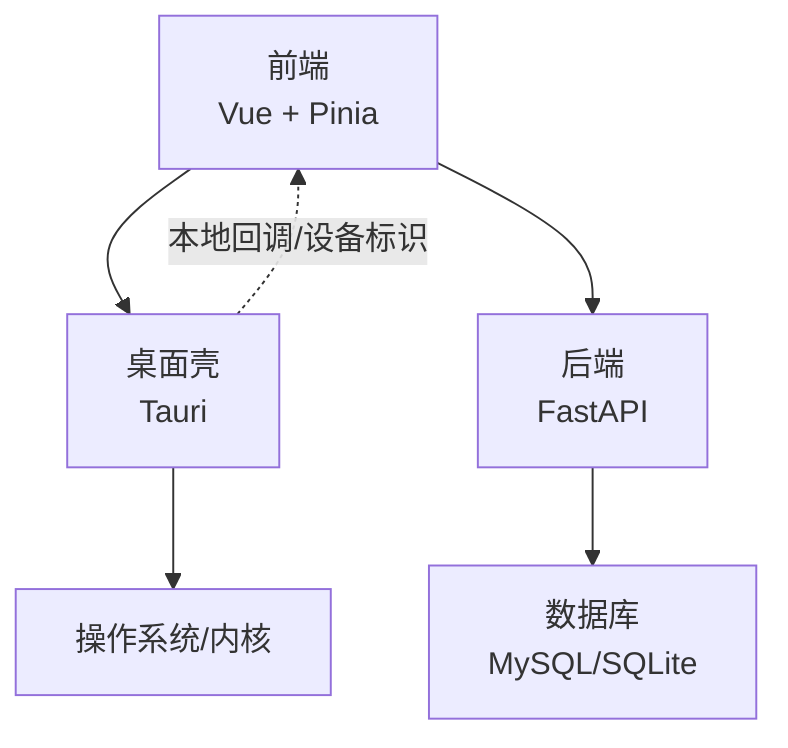
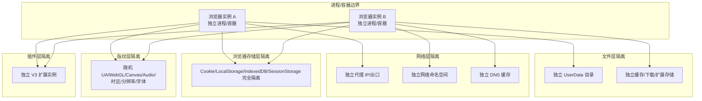
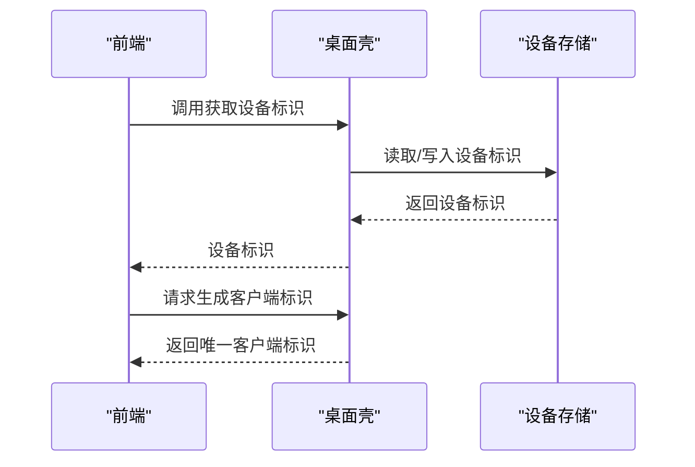
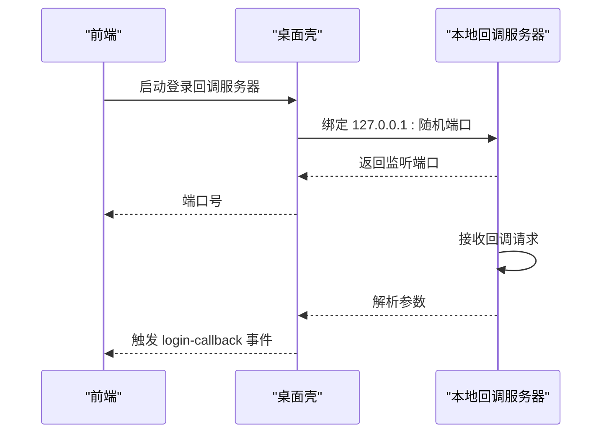
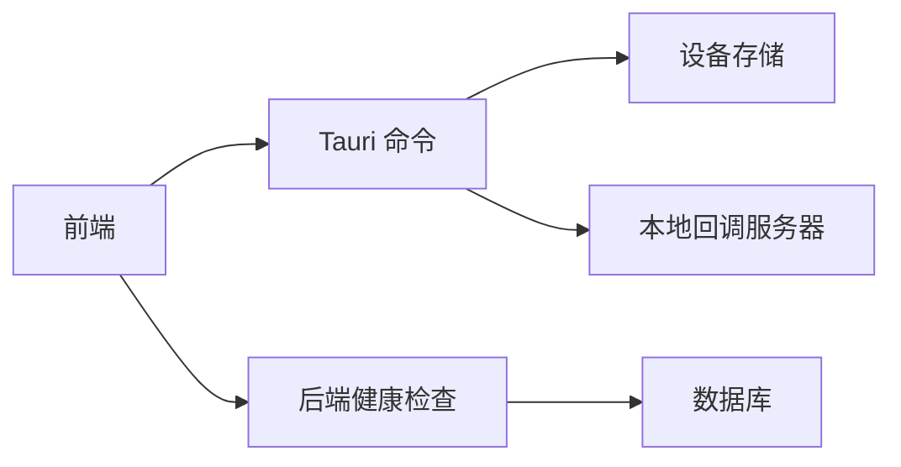

# 多维度强隔离设计

<cite>
**本文引用的文件**
- [tauri.conf.json](file://CCC-BrowserV4/src-tauri/tauri.conf.json)
- [main.rs](file://CCC-BrowserV4/src-tauri/src/main.rs)
- [commands.rs](file://CCC-BrowserV4/src-tauri/src/commands.rs)
- [device.rs](file://CCC-BrowserV4/src-tauri/src/device.rs)
- [device.ts](file://CCC-BrowserV4/frontend/src/stores/device.ts)
- [index.ts](file://CCC-BrowserV4/frontend/src/types/index.ts)
- [config.py](file://CCC-BrowserV4/backend/app/config.py)
- [docker-compose.yml](file://CCC-BrowserV4/docker-compose.yml)
- [health.py](file://CCC-BrowserV4/backend/app/api/health.py)
</cite>

## 目录
1. [引言](#引言)
2. [项目结构](#项目结构)
3. [核心组件](#核心组件)
4. [架构总览](#架构总览)
5. [详细组件分析](#详细组件分析)
6. [依赖分析](#依赖分析)
7. [性能考虑](#性能考虑)
8. [故障排查指南](#故障排查指南)
9. [结论](#结论)
10. [附录](#附录)

## 引言
本文件面向商用级 AI 浏览器系统的“多维度强隔离设计”，围绕六大隔离维度进行系统性技术说明与落地建议：文件层、网络层、进程层、浏览器存储层、指纹层、插件层。结合当前仓库中已实现的设备标识、本地回调服务、CSP 等能力，给出可操作的隔离策略、技术方案、配置参数、验证方法与风险规避建议。需要特别说明的是：当前仓库未直接包含完整的浏览器内核隔离实现细节（如独立用户数据目录、独立进程/容器、独立网络命名空间、独立 DNS 缓存、独立 WebGL/Canvas/Audio 等），因此以下内容以“基于现有能力的工程化落地”为前提，提供可扩展的架构蓝图与实施清单。

## 项目结构
本项目由三部分组成：
- 前端（Vue + Pinia）：负责用户交互、设备信息获取与状态管理。
- 桌面壳（Tauri）：提供命令桥接、本地回调服务、设备标识持久化、安全策略（CSP）。
- 后端（FastAPI）：提供健康检查、数据库连接等基础能力。

图表来源
- [main.rs:1-29](file://CCC-BrowserV4/src-tauri/src/main.rs#L1-L29)
- [tauri.conf.json:1-29](file://CCC-BrowserV4/src-tauri/tauri.conf.json#L1-L29)
- [docker-compose.yml:1-21](file://CCC-BrowserV4/docker-compose.yml#L1-L21)

章节来源
- [main.rs:1-29](file://CCC-BrowserV4/src-tauri/src/main.rs#L1-L29)
- [tauri.conf.json:1-29](file://CCC-BrowserV4/src-tauri/tauri.conf.json#L1-L29)
- [docker-compose.yml:1-21](file://CCC-BrowserV4/docker-compose.yml#L1-L21)

## 核心组件
- 设备标识与会话令牌
  - 桌面壳侧通过持久化存储生成并维护设备唯一标识；同时提供生成客户端标识与随机 token 的命令，用于登录态与防关联。
- 本地回调服务
  - 在本地 127.0.0.1 上随机端口启动一次性回调服务器，接收登录成功后的参数并通过事件通知前端。
- 安全策略（CSP）
  - 限定脚本、样式、连接源，减少跨站与注入风险。
- 健康检查与数据库连接
  - 提供后端健康检查接口，确保数据库可用性。

章节来源
- [device.rs:1-32](file://CCC-BrowserV4/src-tauri/src/device.rs#L1-L32)
- [commands.rs:1-92](file://CCC-BrowserV4/src-tauri/src/commands.rs#L1-L92)
- [tauri.conf.json:24-26](file://CCC-BrowserV4/src-tauri/tauri.conf.json#L24-L26)
- [health.py:1-18](file://CCC-BrowserV4/backend/app/api/health.py#L1-L18)

## 架构总览
下图展示“多维度强隔离”的整体思路：以“进程/容器隔离”为边界，配合“文件系统隔离、网络命名空间、DNS 独立、浏览器存储隔离、指纹随机化、扩展实例隔离”等手段，实现六个维度的强隔离。

说明
- 当前仓库未直接体现上述所有隔离细节，但可通过容器编排、进程隔离、网络命名空间、文件系统挂载等手段在部署层面实现。
- 前端与桌面壳之间的通信、设备标识与会话令牌的生成，为后续“强隔离 + 防关联”提供了基础能力。

## 详细组件分析

### 组件一：设备标识与会话令牌（桌面壳侧）
- 功能要点
  - 设备标识持久化：首次运行生成 UUID 并写入本地存储，后续复用。
  - 会话令牌生成：每次登录会话生成唯一客户端标识与随机 token，降低关联风险。
- 关键实现位置
  - 设备标识初始化与读取：[device.rs:1-32](file://CCC-BrowserV4/src-tauri/src/device.rs#L1-L32)
  - 会话令牌生成命令：[commands.rs:16-30](file://CCC-BrowserV4/src-tauri/src/commands.rs#L16-L30)
  - 桌面壳注册与调用入口：[main.rs:12-18](file://CCC-BrowserV4/src-tauri/src/main.rs#L12-L18)

图表来源
- [device.rs:1-32](file://CCC-BrowserV4/src-tauri/src/device.rs#L1-L32)
- [main.rs:12-18](file://CCC-BrowserV4/src-tauri/src/main.rs#L12-L18)

章节来源
- [device.rs:1-32](file://CCC-BrowserV4/src-tauri/src/device.rs#L1-L32)
- [commands.rs:16-30](file://CCC-BrowserV4/src-tauri/src/commands.rs#L16-L30)
- [main.rs:12-18](file://CCC-BrowserV4/src-tauri/src/main.rs#L12-L18)

### 组件二：本地回调服务（登录态回传）
- 功能要点
  - 在本地 127.0.0.1 分配随机端口，监听一次性的登录回调请求。
  - 解析回调参数并通过事件通知前端，随后关闭服务。
- 关键实现位置
  - 回调服务器启动与事件派发：[commands.rs:41-92](file://CCC-BrowserV4/src-tauri/src/commands.rs#L41-L92)

图表来源
- [commands.rs:41-92](file://CCC-BrowserV4/src-tauri/src/commands.rs#L41-L92)

章节来源
- [commands.rs:41-92](file://CCC-BrowserV4/src-tauri/src/commands.rs#L41-L92)

### 组件三：安全策略（CSP）
- 功能要点
  - 通过 CSP 限制脚本、样式与连接源，降低 XSS 与跨站风险。
- 关键实现位置
  - CSP 配置项：[tauri.conf.json:24-26](file://CCC-BrowserV4/src-tauri/tauri.conf.json#L24-L26)

章节来源
- [tauri.conf.json:24-26](file://CCC-BrowserV4/src-tauri/tauri.conf.json#L24-L26)

### 组件四：健康检查与数据库连接
- 功能要点
  - 提供健康检查接口，返回服务状态与数据库连接状态。
- 关键实现位置
  - 健康检查路由：[health.py:10-17](file://CCC-BrowserV4/backend/app/api/health.py#L10-L17)

章节来源
- [health.py:10-17](file://CCC-BrowserV4/backend/app/api/health.py#L10-L17)

## 依赖分析
- 前端到桌面壳：通过 Tauri 桥接命令与事件，实现设备标识读取、会话令牌生成、登录回调接收。
- 桌面壳到系统：使用本地回调服务器、系统外壳打开 URL、持久化存储。
- 后端到数据库：通过配置管理模块选择 MySQL 或 SQLite，提供健康检查。

图表来源
- [main.rs:12-18](file://CCC-BrowserV4/src-tauri/src/main.rs#L12-L18)
- [commands.rs:41-92](file://CCC-BrowserV4/src-tauri/src/commands.rs#L41-L92)
- [health.py:10-17](file://CCC-BrowserV4/backend/app/api/health.py#L10-L17)

章节来源
- [main.rs:12-18](file://CCC-BrowserV4/src-tauri/src/main.rs#L12-L18)
- [commands.rs:41-92](file://CCC-BrowserV4/src-tauri/src/commands.rs#L41-L92)
- [health.py:10-17](file://CCC-BrowserV4/backend/app/api/health.py#L10-L17)

## 性能考虑
- 进程/容器数量与资源占用：隔离粒度越细，进程/容器越多，内存/CPU 占用越高。建议按任务并发度动态扩缩容。
- 网络命名空间与代理：独立出口可能增加网络延迟，建议在容器层启用连接池与缓存。
- 存储隔离：独立 UserData 与缓存目录带来 IO 放大，需评估磁盘配额与清理策略。
- 前端渲染与事件频率：避免高频事件导致主线程阻塞，必要时采用节流/去抖。

## 故障排查指南
- 设备标识为空或重复
  - 检查设备存储初始化逻辑与持久化文件是否存在。
  - 参考：[device.rs:6-20](file://CCC-BrowserV4/src-tauri/src/device.rs#L6-L20)
- 登录回调无法到达前端
  - 检查本地回调服务器是否成功绑定端口、事件是否正确派发。
  - 参考：[commands.rs:44-91](file://CCC-BrowserV4/src-tauri/src/commands.rs#L44-L91)
- 健康检查失败
  - 检查数据库连接配置与网络连通性。
  - 参考：[health.py:10-17](file://CCC-BrowserV4/backend/app/api/health.py#L10-L17)，[config.py:42-47](file://CCC-BrowserV4/backend/app/config.py#L42-L47)

章节来源
- [device.rs:6-20](file://CCC-BrowserV4/src-tauri/src/device.rs#L6-L20)
- [commands.rs:44-91](file://CCC-BrowserV4/src-tauri/src/commands.rs#L44-L91)
- [health.py:10-17](file://CCC-BrowserV4/backend/app/api/health.py#L10-L17)
- [config.py:42-47](file://CCC-BrowserV4/backend/app/config.py#L42-L47)

## 结论
当前仓库已具备“设备标识持久化、会话令牌生成、本地回调服务、CSP 安全策略、健康检查”等关键能力，为“多维度强隔离”提供了良好基础。要实现六大隔离维度的完整落地，建议在部署层引入容器编排与进程隔离、网络命名空间与独立 DNS、文件系统隔离与独立 UserData、浏览器存储隔离、指纹随机化与扩展实例隔离等技术方案，并配套严格的配置参数与验证流程，以有效规避网站风控检测、防止账号关联与数据泄露。

## 附录

### 六大隔离维度实施清单（基于现有能力的工程化落地）
- 文件层
  - 独立 UserData：为每个实例分配独立用户数据目录，避免 Cookie/LocalStorage/IndexedDB 共享。
  - 独立缓存/下载/扩展存储：分别挂载独立卷，定期清理。
- 网络层
  - 独立代理 IP：通过容器网络或出口网关实现不同出口。
  - 独立网络命名空间：容器网络隔离，限制主机访问。
  - 独立 DNS 缓存：容器内自定义 DNS 或独立缓存服务。
- 进程层
  - 独立 Chromium 进程/容器：每个实例独立进程/容器，避免共享内存。
- 浏览器存储层
  - Cookie/LocalStorage/IndexedDB/SessionStorage 完全隔离：通过独立 UserData 与存储卷实现。
- 指纹层
  - 随机 UA/WebGL/Canvas/Audio/时区/分辨率/字体：在启动参数与运行时注入随机化策略。
- 插件层
  - 独立 V3 扩展实例：为每个实例加载独立扩展集合与运行时。

### 配置参数与验证方法（示例）
- 设备标识与会话令牌
  - 生成设备标识：参考 [device.rs:12-17](file://CCC-BrowserV4/src-tauri/src/device.rs#L12-L17)
  - 生成客户端标识与 token：参考 [commands.rs:18-29](file://CCC-BrowserV4/src-tauri/src/commands.rs#L18-L29)
- 本地回调服务
  - 启动与端口监听：参考 [commands.rs:44-48](file://CCC-BrowserV4/src-tauri/src/commands.rs#L44-L48)
  - 回调参数解析与事件派发：参考 [commands.rs:54-87](file://CCC-BrowserV4/src-tauri/src/commands.rs#L54-L87)
- CSP 安全策略
  - 配置项位置：参考 [tauri.conf.json:24-26](file://CCC-BrowserV4/src-tauri/tauri.conf.json#L24-L26)
- 健康检查与数据库
  - 健康检查接口：参考 [health.py:10-17](file://CCC-BrowserV4/backend/app/api/health.py#L10-L17)
  - 数据库连接 URL 切换：参考 [config.py:42-47](file://CCC-BrowserV4/backend/app/config.py#L42-L47)
- Docker Compose（数据库）
  - MySQL 服务与卷：参考 [docker-compose.yml:4-21](file://CCC-BrowserV4/docker-compose.yml#L4-L21)

### 隔离效果测试建议
- 进程/容器隔离
  - 使用系统监控工具确认进程 PID 与容器 ID 独立。
- 存储隔离
  - 断开实例间 Cookie/LocalStorage/IndexedDB 访问，验证互不可见。
- 网络隔离
  - 校验不同实例的出口 IP、DNS 解析结果与网络命名空间。
- 指纹隔离
  - 采集 UA/WebGL/Canvas/Audio/时区/分辨率/字体，确保各实例差异显著。
- 插件隔离
  - 加载不同扩展集，验证实例间扩展状态隔离。