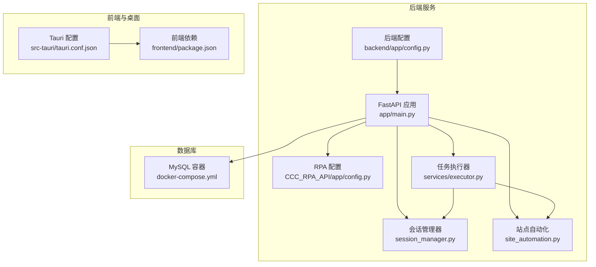
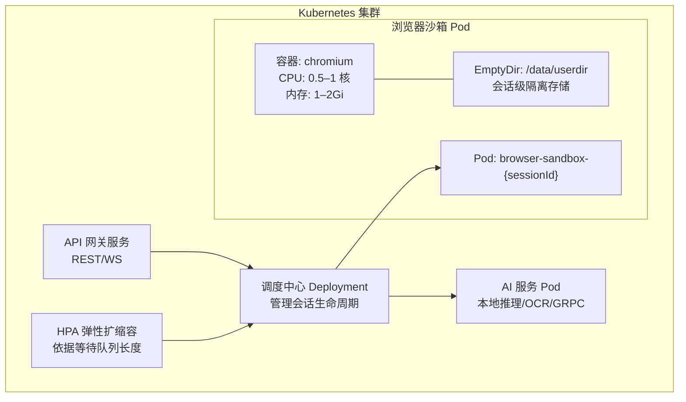
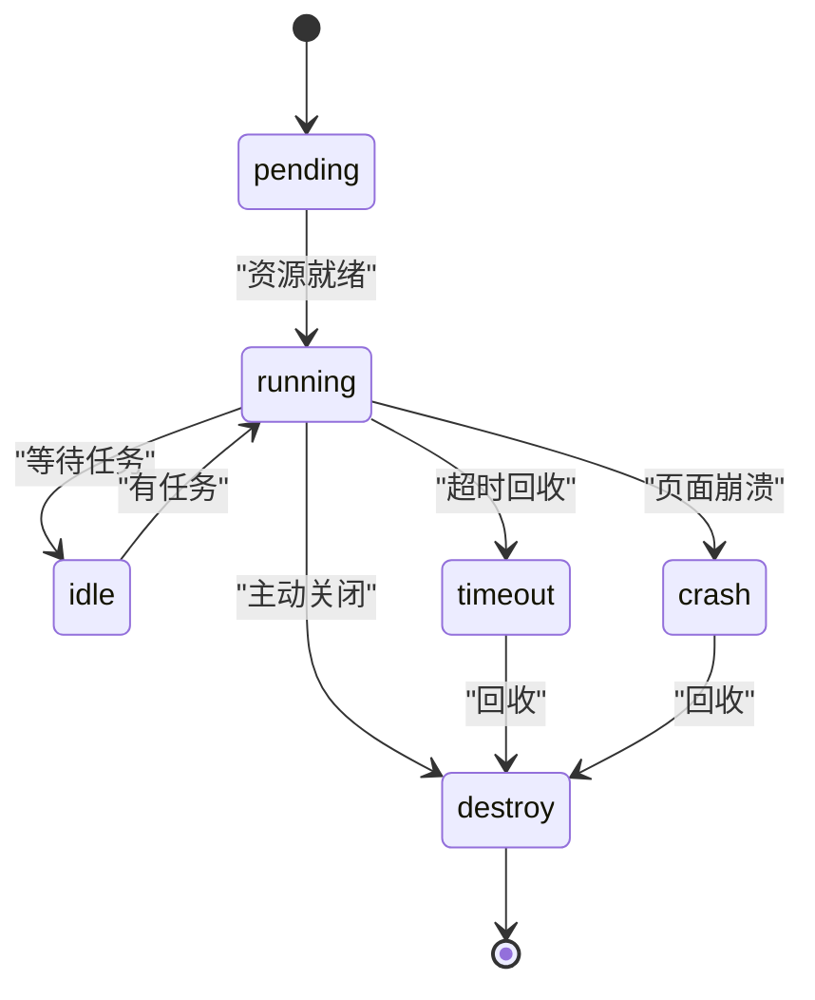
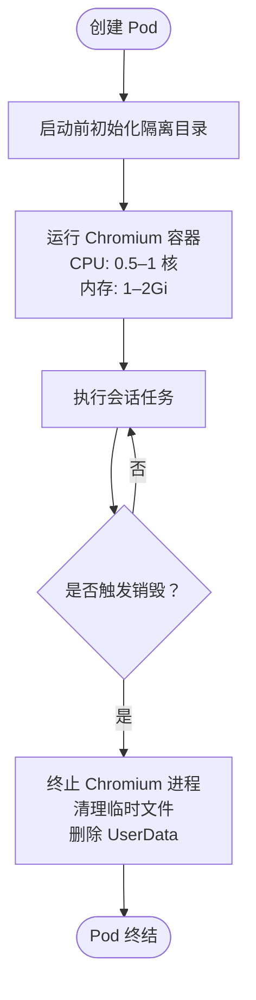
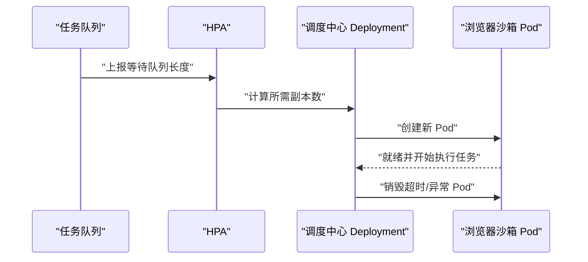
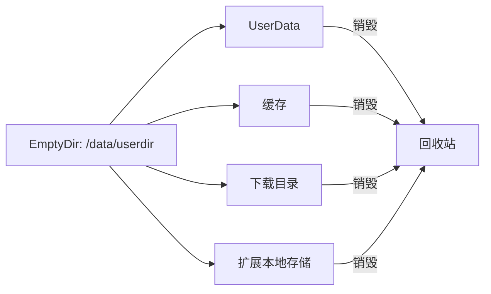
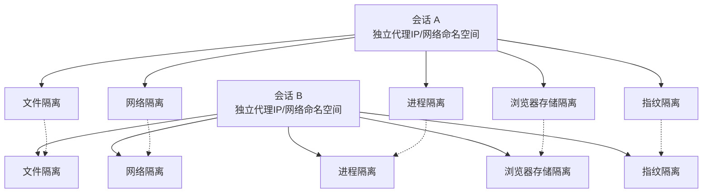
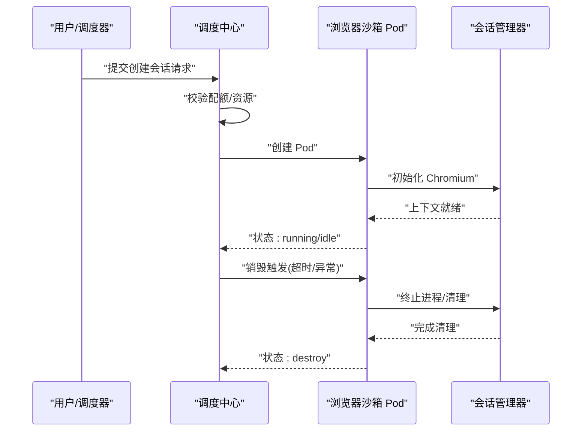
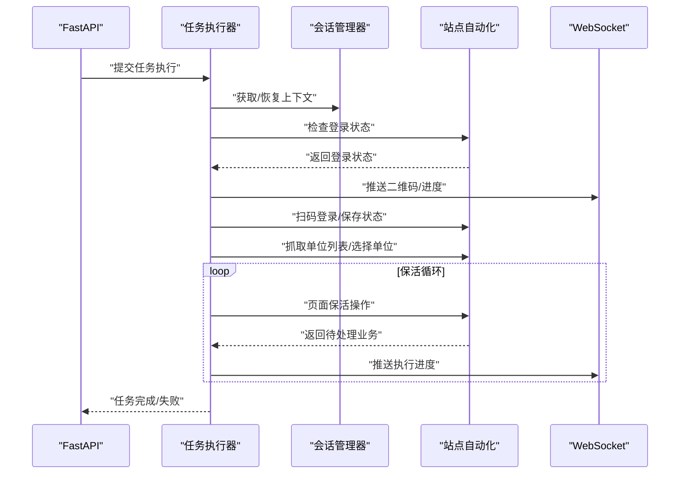
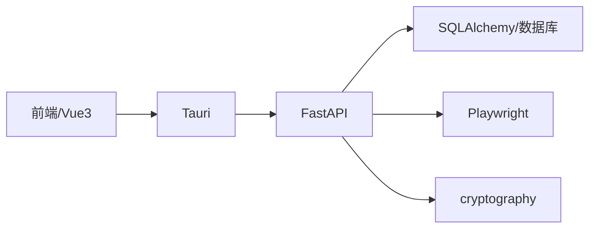

# 容器化部署架构

<cite>
**本文引用的文件**
- [project.md](file://project.md)
- [docker-compose.yml](file://CCC-BrowserV4/docker-compose.yml)
- [backend/README.md](file://CCC-BrowserV4/backend/README.md)
- [backend/app/config.py](file://CCC-BrowserV4/backend/app/config.py)
- [CCC_RPA_API/app/config.py](file://CCC_RPA_API/app/config.py)
- [CCC_RPA_API/app/main.py](file://CCC_RPA_API/app/main.py)
- [CCC_RPA_API/app/browser/session_manager.py](file://CCC_RPA_API/app/browser/session_manager.py)
- [CCC_RPA_API/app/browser/site_automation.py](file://CCC_RPA_API/app/browser/site_automation.py)
- [CCC_RPA_API/app/services/executor.py](file://CCC_RPA_API/app/services/executor.py)
- [src-tauri/tauri.conf.json](file://CCC-BrowserV4/src-tauri/tauri.conf.json)
- [frontend/package.json](file://CCC-BrowserV4/frontend/package.json)
- [requirements.txt](file://CCC_RPA_API/requirements.txt)
</cite>

## 目录
1. [简介](#简介)
2. [项目结构](#项目结构)
3. [核心组件](#核心组件)
4. [架构总览](#架构总览)
5. [组件详细分析](#组件详细分析)
6. [依赖关系分析](#依赖关系分析)
7. [性能考量](#性能考量)
8. [故障排查指南](#故障排查指南)
9. [结论](#结论)
10. [附录](#附录)

## 简介
本文件面向商用级 AI 浏览器系统，围绕基于 Kubernetes 的容器编排进行系统化技术说明。重点覆盖以下主题：
- Pod 资源限制与硬性约束：CPU 0.5–1 核、内存 1–2Gi 的配置参数与实现原理
- HPA 弹性扩缩容机制：以等待任务队列长度为触发条件的动态扩缩策略
- EmptyDir 临时存储隔离策略：会话级数据与生命周期管理
- K8s 浏览器沙箱 Pod 的完整生命周期：调度中心 Deployment、会话 Pod 模板、AI 服务 Pod 的编排规范
- 会话间完全隔离的设计与实现：文件、网络、进程、浏览器存储、指纹、插件等维度
- 具体的 K8s YAML 模板示例、资源配额配置、网络策略建议
- 容器编排如何确保会话间无跨 Pod 数据泄露与资源共享

## 项目结构
本仓库包含两套核心后端与前端工程，以及浏览器桌面应用：
- CCC_RPA_API：基于 FastAPI 的后端服务，负责任务编排、Playwright 会话管理、WebSocket 推送、数据库交互
- CCC-BrowserV4：前端 Vue3 + Tauri 桌面应用，提供管理后台与本地自动化体验
- requirements.txt：后端依赖清单，包含 FastAPI、Uvicorn、SQLAlchemy、Pydantic-Settings、Playwright 等

图表来源
- [CCC_RPA_API/app/main.py:1-127](file://CCC_RPA_API/app/main.py#L1-L127)
- [CCC_RPA_API/app/browser/session_manager.py:1-186](file://CCC_RPA_API/app/browser/session_manager.py#L1-L186)
- [CCC_RPA_API/app/browser/site_automation.py:1-743](file://CCC_RPA_API/app/browser/site_automation.py#L1-L743)
- [CCC_RPA_API/app/services/executor.py:1-319](file://CCC_RPA_API/app/services/executor.py#L1-L319)
- [backend/app/config.py:1-52](file://backend/app/config.py#L1-L52)
- [CCC_RPA_API/app/config.py:1-22](file://CCC_RPA_API/app/config.py#L1-L22)
- [docker-compose.yml:1-21](file://CCC-BrowserV4/docker-compose.yml#L1-L21)
- [src-tauri/tauri.conf.json:1-29](file://src-tauri/tauri.conf.json#L1-L29)
- [frontend/package.json:1-29](file://frontend/package.json#L1-L29)

章节来源
- [project.md:237-290](file://project.md#L237-L290)
- [docker-compose.yml:1-21](file://CCC-BrowserV4/docker-compose.yml#L1-L21)
- [backend/README.md:1-66](file://CCC-BrowserV4/backend/README.md#L1-L66)
- [requirements.txt:1-11](file://CCC_RPA_API/requirements.txt#L1-L11)

## 核心组件
- 调度与 API 网关：基于 FastAPI 的 REST/WS 服务，负责任务编排、鉴权、CORS、数据库初始化与健康检查
- 会话管理器：按省份管理 Playwright 浏览器上下文，提供专用工作线程、storage_state 持久化、上下文恢复与关闭
- 站点自动化：针对目标站点的扫码登录、单位选择、页面保活、业务检测与执行等流程
- 任务执行器：线程池驱动的任务执行流水线，负责状态广播、等待用户交互、保活循环与日志记录
- 数据库：MySQL（本地开发）与 SQLAlchemy ORM；生产环境可替换为 PostgreSQL
- 前端与桌面：Vue3 + Element Plus + Tauri，提供管理后台与本地自动化体验

章节来源
- [CCC_RPA_API/app/main.py:1-127](file://CCC_RPA_API/app/main.py#L1-L127)
- [CCC_RPA_API/app/browser/session_manager.py:1-186](file://CCC_RPA_API/app/browser/session_manager.py#L1-L186)
- [CCC_RPA_API/app/browser/site_automation.py:1-743](file://CCC_RPA_API/app/browser/site_automation.py#L1-L743)
- [CCC_RPA_API/app/services/executor.py:1-319](file://CCC_RPA_API/app/services/executor.py#L1-L319)
- [backend/app/config.py:1-52](file://backend/app/config.py#L1-L52)
- [CCC_RPA_API/app/config.py:1-22](file://CCC_RPA_API/app/config.py#L1-L22)
- [src-tauri/tauri.conf.json:1-29](file://src-tauri/tauri.conf.json#L1-L29)
- [frontend/package.json:1-29](file://frontend/package.json#L1-L29)

## 架构总览
下图展示了商用级 AI 浏览器系统的容器化部署架构要点：调度中心 Deployment、浏览器沙箱 Pod 模板、AI 服务 Pod、API 网关服务、HPA 弹性扩缩容与 EmptyDir 隔离。

图表来源
- [project.md:251-262](file://project.md#L251-L262)
- [project.md:734-765](file://project.md#L734-L765)

章节来源
- [project.md:237-290](file://project.md#L237-L290)
- [project.md:734-765](file://project.md#L734-L765)

## 组件详细分析

### 调度中心 Deployment 与会话生命周期
- 调度中心负责：
  - 分配唯一 sessionId、分配 CDP 调试端口范围
  - 校验租户并发配额、代理 IP 可用性、集群剩余资源
  - 管理会话状态机：pending → running → idle → timeout/crash → destroy
  - 触发销毁：主动关闭、达到最大存活时长、内存超阈、页面连续崩溃
- 生命周期钩子：
  - 启动前：初始化隔离目录
  - 销毁前：终止 Chromium 进程、清理临时文件、回收代理 IP 与 CDP 端口、删除 UserData

图表来源
- [project.md:263-275](file://project.md#L263-L275)

章节来源
- [project.md:263-275](file://project.md#L263-L275)

### 浏览器沙箱 Pod 模板与资源限制
- Pod 名称：browser-sandbox-{sessionId}
- 容器：chromium
- 资源限制：
  - CPU：limits 1，requests 0.5
  - Memory：limits 2Gi，requests 1Gi
- 环境变量注入：SESSION_ID、PROXY_URL、TENANT_ID、内存/CPU 上限、最大存活时长
- EmptyDir：挂载 /data/userdir，Pod 删除即销毁全部会话数据
- 生命周期钩子：启动前初始化隔离目录、销毁前终止 Chromium、清理临时文件

图表来源
- [project.md:255-262](file://project.md#L255-L262)
- [project.md:734-765](file://project.md#L734-L765)

章节来源
- [project.md:251-262](file://project.md#L251-L262)
- [project.md:734-765](file://project.md#L734-L765)

### HPA 弹性扩缩容机制
- 触发条件：等待任务队列长度
- 动态策略：依据队列长度自动新建/销毁浏览器 Pod，保障吞吐与延迟
- 与调度中心协作：Deployment 控制副本数，HPA 根据指标调整副本数

图表来源
- [project.md:259](file://project.md#L259)

章节来源
- [project.md:259](file://project.md#L259)

### EmptyDir 临时存储隔离策略
- 每个会话 Pod 使用独立 EmptyDir 挂载 /data/userdir
- Pod 删除即销毁全部会话数据，确保文件层完全隔离
- 配合销毁钩子彻底清理 UserData、缓存、下载目录、扩展本地存储

图表来源
- [project.md:257](file://project.md#L257)

章节来源
- [project.md:257](file://project.md#L257)

### 会话间完全隔离设计
- 文件层：独立 UserData、磁盘缓存、下载目录、扩展本地存储
- 网络层：独立代理 IP、独立网络命名空间、独立 DNS 缓存
- 进程层：独立 Chromium 进程/Pod，单会话崩溃不影响集群其他会话
- 浏览器存储：Cookie、LocalStorage、IndexedDB、SessionStorage 完全隔离
- 指纹层：随机独立 UA、WebGL、Canvas、Audio、时区、分辨率、字体列表
- 插件层：每个会话加载独立 V3 扩展实例，扩展存储互不互通

图表来源
- [project.md:277-290](file://project.md#L277-L290)

章节来源
- [project.md:277-290](file://project.md#L277-L290)

### K8s YAML 模板示例与资源配额
- Pod 模板示例：见附录 C（浏览器沙箱 Pod 基础模板）
- 资源配额建议：
  - Requests/Limits：CPU 0.5/1 核，Memory 1Gi/2Gi
  - PodDisruptionBudget：保证最小可用副本
  - Liveness/Readiness 探针：结合健康检查端点
- 网络策略建议：
  - 限制出站流量至代理池 IP 段
  - 仅开放必要端口（API/WS、CDP 调试端口范围）
  - 通过 NetworkPolicy 实现命名空间级隔离

章节来源
- [project.md:734-765](file://project.md#L734-L765)

### 容器资源硬限制实现原理
- CPU 0.5–1 核、内存 1–2Gi 通过 Kubernetes Pod 的 resources.limits/requests 设置
- 通过 kubelet 的 Cgroups 与 QoS 机制，确保容器在资源竞争中获得承诺份额
- 超过 Limits 的资源使用会被内核抑制，避免影响宿主机与其他 Pod
- 结合 HPA 与 Pod 级别资源限制，形成“上限保护 + 动态扩容”的双层保障

章节来源
- [project.md:255](file://project.md#L255)

### 会话生命周期管理与状态机
- 状态流转：pending → running → idle → timeout/crash → destroy
- 创建前置校验：租户并发配额、代理 IP 可用性、集群剩余资源
- 销毁执行：关闭页面标签、终止 Chromium 进程、归还代理 IP、释放 CDP 端口、删除 UserData
- 自愈重试：CDP 断开、代理网络超时自动重试 2 次，失败销毁并上报

图表来源
- [project.md:263-275](file://project.md#L263-L275)
- [CCC_RPA_API/app/browser/session_manager.py:1-186](file://CCC_RPA_API/app/browser/session_manager.py#L1-L186)

章节来源
- [project.md:263-275](file://project.md#L263-L275)
- [CCC_RPA_API/app/browser/session_manager.py:1-186](file://CCC_RPA_API/app/browser/session_manager.py#L1-L186)

### 任务执行流水线与保活机制
- 线程池驱动：ThreadPoolExecutor 执行任务逻辑，避免阻塞 Playwright 工作线程
- 保活循环：在业务页面执行轻量级随机操作，不跳转、不触发业务按钮
- 状态广播：通过 WebSocket 推送执行进度、二维码、错误信息与任务状态更新

图表来源
- [CCC_RPA_API/app/services/executor.py:1-319](file://CCC_RPA_API/app/services/executor.py#L1-L319)
- [CCC_RPA_API/app/browser/session_manager.py:1-186](file://CCC_RPA_API/app/browser/session_manager.py#L1-L186)
- [CCC_RPA_API/app/browser/site_automation.py:1-743](file://CCC_RPA_API/app/browser/site_automation.py#L1-L743)
- [CCC_RPA_API/app/main.py:114-127](file://CCC_RPA_API/app/main.py#L114-L127)

章节来源
- [CCC_RPA_API/app/services/executor.py:1-319](file://CCC_RPA_API/app/services/executor.py#L1-L319)
- [CCC_RPA_API/app/browser/session_manager.py:1-186](file://CCC_RPA_API/app/browser/session_manager.py#L1-L186)
- [CCC_RPA_API/app/browser/site_automation.py:1-743](file://CCC_RPA_API/app/browser/site_automation.py#L1-L743)
- [CCC_RPA_API/app/main.py:114-127](file://CCC_RPA_API/app/main.py#L114-L127)

## 依赖关系分析
- 后端服务依赖：
  - FastAPI + Uvicorn：提供 REST/WS 服务
  - SQLAlchemy + Pydantic-Settings：数据库连接与配置管理
  - Playwright：浏览器自动化与上下文管理
  - cryptography：加密存储与安全通信
- 前端与桌面：
  - Vue3 + Element Plus：管理后台界面
  - Tauri：本地窗口与系统集成
- 数据库：
  - 本地开发使用 MySQL（docker-compose）
  - 生产环境可替换为 PostgreSQL

图表来源
- [requirements.txt:1-11](file://CCC_RPA_API/requirements.txt#L1-L11)
- [frontend/package.json:1-29](file://frontend/package.json#L1-L29)
- [src-tauri/tauri.conf.json:1-29](file://src-tauri/tauri.conf.json#L1-L29)
- [docker-compose.yml:1-21](file://CCC-BrowserV4/docker-compose.yml#L1-L21)

章节来源
- [requirements.txt:1-11](file://CCC_RPA_API/requirements.txt#L1-L11)
- [frontend/package.json:1-29](file://frontend/package.json#L1-L29)
- [src-tauri/tauri.conf.json:1-29](file://src-tauri/tauri.conf.json#L1-L29)
- [docker-compose.yml:1-21](file://CCC-BrowserV4/docker-compose.yml#L1-L21)

## 性能考量
- 会话创建耗时：集群 K8s 环境 ≤3s，单机进程模式 ≤1s
- AI 单条自然语言指令推理响应：7B 本地模型 ≤1.5s
- 并发支持：单集群稳定并发会话最低支持 200 个，长期运行无持续内存泄漏
- API 网关：单接口 QPS≥100，WebSocket 在线≥1000 路
- CDP 操作延迟：≤200ms
- 资源预留：CPU 0.5/1 核，内存 1Gi/2Gi，结合 HPA 动态扩容
- 磁盘缓存：禁用全局共享磁盘缓存与预连接池，防止跨会话指纹与数据泄露

章节来源
- [project.md:506-516](file://project.md#L506-L516)
- [project.md:235](file://project.md#L235)

## 故障排查指南
- 浏览器会话异常：
  - 检查会话管理器是否存活，必要时触发恢复流程
  - 查看会话上下文状态与页面截图，定位登录/选择单位失败原因
- 任务执行失败：
  - 关注 WebSocket 广播的错误信息与任务状态更新
  - 检查代理 IP 可用性、CDP 端口占用与磁盘空间
- 资源不足：
  - 查看 Pod 资源限制与节点可用资源，确认 HPA 是否正确扩容
  - 检查内存泄漏与缓存清理策略
- 网络问题：
  - 校验 NetworkPolicy 出站策略与代理池连通性
  - 确认独立代理 IP 与网络命名空间隔离生效

章节来源
- [CCC_RPA_API/app/browser/session_manager.py:147-186](file://CCC_RPA_API/app/browser/session_manager.py#L147-L186)
- [CCC_RPA_API/app/services/executor.py:286-314](file://CCC_RPA_API/app/services/executor.py#L286-L314)
- [project.md:641-656](file://project.md#L641-L656)

## 结论
本容器化部署架构以 Kubernetes 为核心，结合浏览器沙箱 Pod 的资源硬限制、EmptyDir 隔离与 HPA 弹性扩缩容，实现了商用级 AI 浏览器系统的高隔离、高性能与高可用。通过完善的会话生命周期管理与多维隔离策略，确保会话间无数据泄露与资源共享，满足生产环境的安全与合规要求。

## 附录
- K8s 浏览器沙箱 Pod 基础模板（YAML 示例）：参见项目文档附录 C
- 资源配额与网络策略建议：参见本文件“架构总览”与“性能考量”
- 数据库与本地开发：参见 docker-compose 与后端配置文件

章节来源
- [project.md:734-765](file://project.md#L734-L765)
- [docker-compose.yml:1-21](file://CCC-BrowserV4/docker-compose.yml#L1-L21)
- [backend/app/config.py:1-52](file://backend/app/config.py#L1-L52)
- [CCC_RPA_API/app/config.py:1-22](file://CCC_RPA_API/app/config.py#L1-L22)