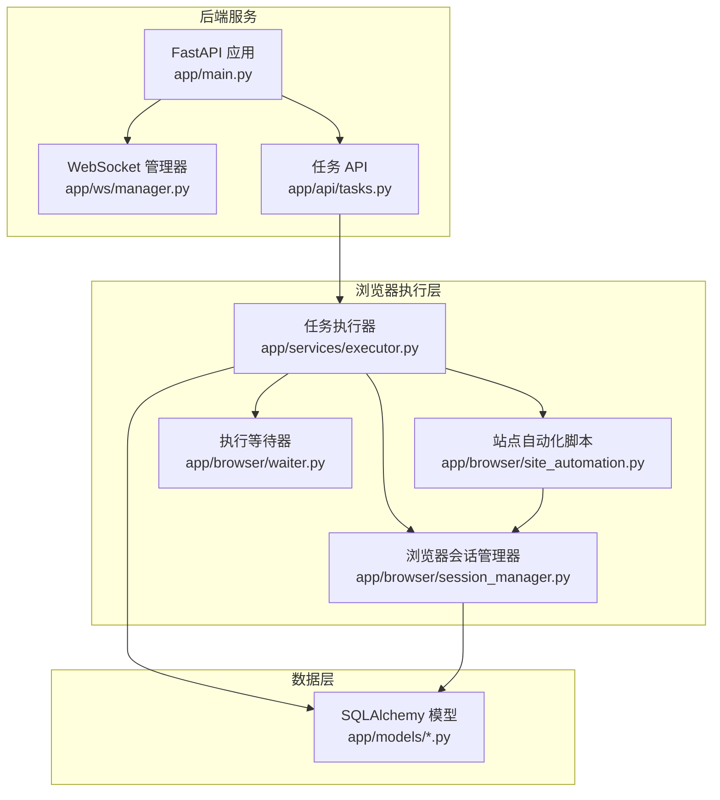
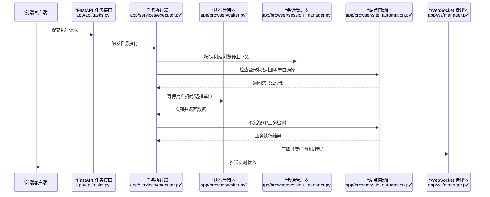
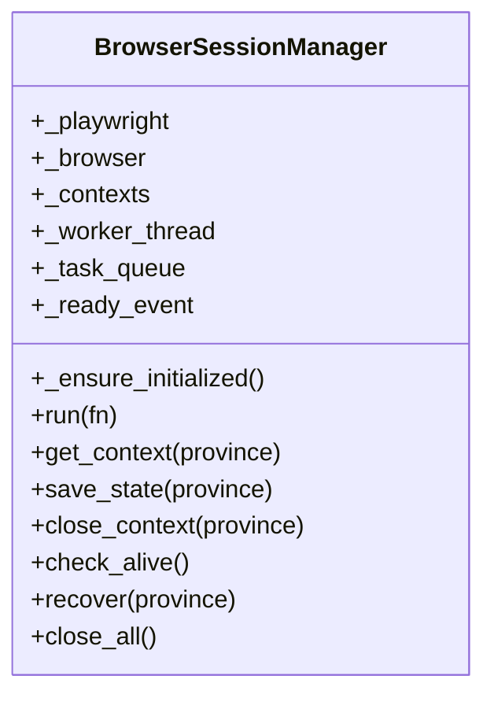
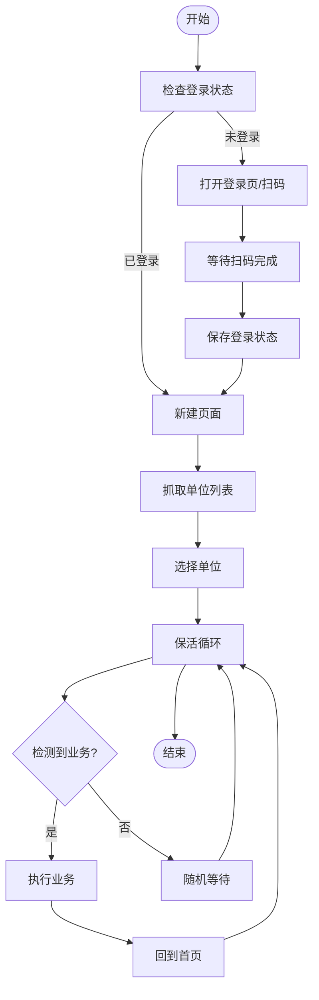
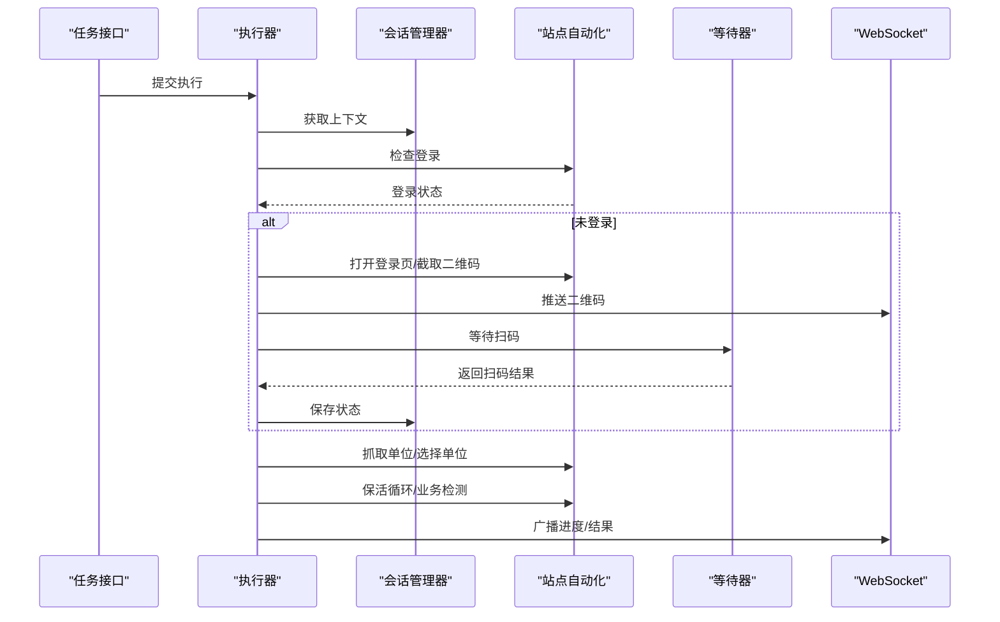
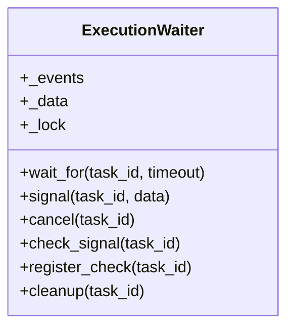
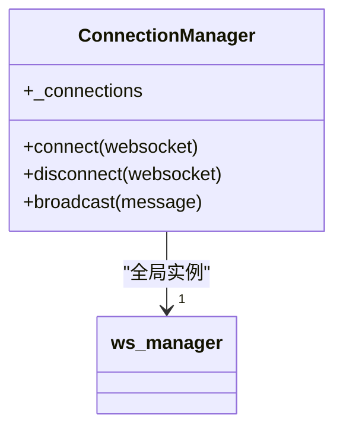
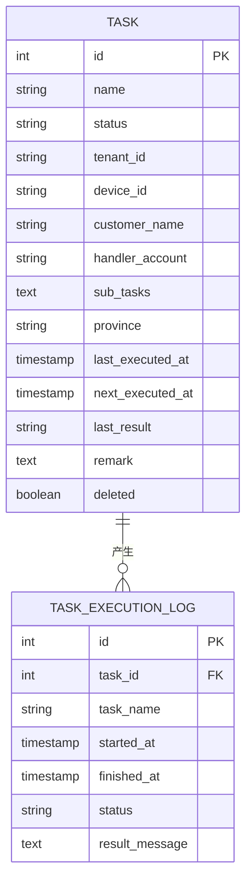
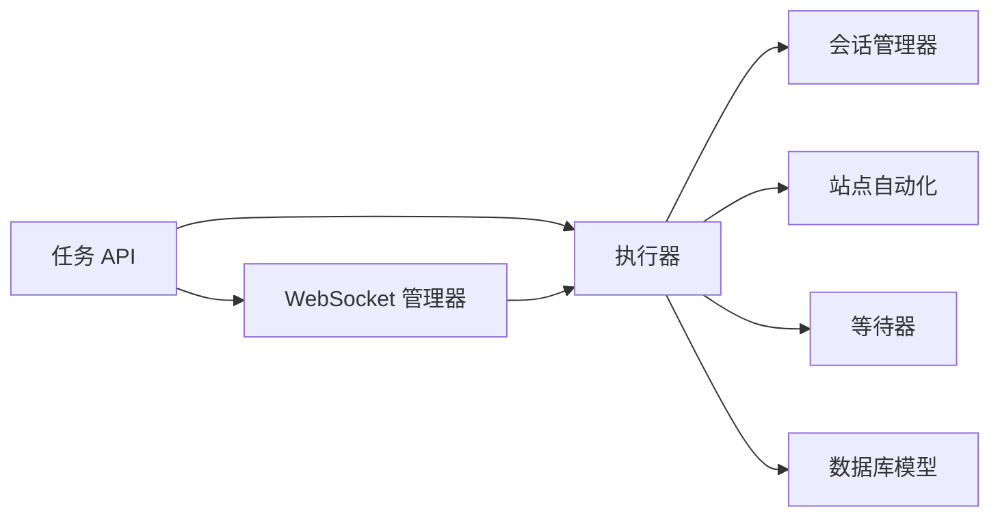

# 层1：基础设施隔离层

<cite>
**本文档引用的文件**
- [main.py](file://CCC_RPA_API/app/main.py)
- [session_manager.py](file://CCC_RPA_API/app/browser/session_manager.py)
- [site_automation.py](file://CCC_RPA_API/app/browser/site_automation.py)
- [executor.py](file://CCC_RPA_API/app/services/executor.py)
- [waiter.py](file://CCC_RPA_API/app/browser/waiter.py)
- [manager.py](file://CCC_RPA_API/app/ws/manager.py)
- [models/task.py](file://CCC_RPA_API/app/models/task.py)
- [models/execution_log.py](file://CCC_RPA_API/app/models/execution_log.py)
- [api/tasks.py](file://CCC_RPA_API/app/api/tasks.py)
</cite>

## 目录
1. [简介](#简介)
2. [项目结构](#项目结构)
3. [核心组件](#核心组件)
4. [架构总览](#架构总览)
5. [详细组件分析](#详细组件分析)
6. [依赖分析](#依赖分析)
7. [性能考虑](#性能考虑)
8. [故障排查指南](#故障排查指南)
9. [结论](#结论)
10. [附录](#附录)

## 简介
本文件面向商用级 AI 浏览器系统的“层1：基础设施隔离层”，聚焦于为上层提供强隔离的运行环境，确保会话间的完全独立性。当前仓库代码以单机进程形态运行，采用专用线程承载的 Chromium/Playwright 会话池，结合线程内同步 API 与跨线程任务队列，形成“单机进程沙箱”式的隔离边界；同时通过 WebSocket 广播与数据库持久化保障任务生命周期管理与可观测性。

本层不涉及容器编排与 Kubernetes Pod 级别的隔离，也不包含 Linux Namespace/Cgroup 或 Windows Job 对象的直接实现。若需扩展至容器/K8s 环境，可在现有单机沙箱之上增加镜像构建与编排模板，复用本层的设计理念（专用线程、会话池、资源限制、强隔离）。

## 项目结构
- 后端服务基于 FastAPI，提供任务管理、执行控制与 WebSocket 推送。
- 浏览器自动化逻辑集中在浏览器会话管理器与站点自动化脚本中，统一在专用线程中执行，避免与异步事件循环冲突。
- 任务执行器协调浏览器会话、用户交互等待、保活循环与日志记录。
- 数据模型与 API 路由定义任务与执行日志的数据结构与接口。

图表来源
- [main.py:1-127](file://CCC_RPA_API/app/main.py#L1-L127)
- [manager.py:1-29](file://CCC_RPA_API/app/ws/manager.py#L1-L29)
- [api/tasks.py:1-76](file://CCC_RPA_API/app/api/tasks.py#L1-L76)
- [session_manager.py:1-186](file://CCC_RPA_API/app/browser/session_manager.py#L1-L186)
- [site_automation.py:1-683](file://CCC_RPA_API/app/browser/site_automation.py#L1-L683)
- [executor.py:1-318](file://CCC_RPA_API/app/services/executor.py#L1-L318)
- [waiter.py:1-84](file://CCC_RPA_API/app/browser/waiter.py#L1-L84)
- [models/task.py:1-25](file://CCC_RPA_API/app/models/task.py#L1-L25)
- [models/execution_log.py:1-17](file://CCC_RPA_API/app/models/execution_log.py#L1-L17)

章节来源
- [main.py:1-127](file://CCC_RPA_API/app/main.py#L1-L127)
- [api/tasks.py:1-76](file://CCC_RPA_API/app/api/tasks.py#L1-L76)

## 核心组件
- 浏览器会话管理器：维护专用工作线程与 Chromium 实例，提供按“省份”维度的浏览器上下文池，持久化 storage_state，支持恢复与关闭。
- 站点自动化脚本：封装目标站点的登录、扫码、单位选择、保活与业务检测等流程，具备多策略降级与截图调试能力。
- 任务执行器：协调浏览器操作、用户交互等待、保活循环与日志记录，通过线程池与专用线程解耦阻塞等待。
- 执行等待器：基于 threading.Event 的轻量级等待/唤醒机制，支持取消与非阻塞检查。
- WebSocket 管理器：向客户端广播执行进度、二维码与错误信息。
- 数据模型与 API：定义任务与执行日志的数据结构，提供任务提交、取消与状态查询接口。

章节来源
- [session_manager.py:10-186](file://CCC_RPA_API/app/browser/session_manager.py#L10-L186)
- [site_automation.py:16-683](file://CCC_RPA_API/app/browser/site_automation.py#L16-L683)
- [executor.py:1-318](file://CCC_RPA_API/app/services/executor.py#L1-L318)
- [waiter.py:7-84](file://CCC_RPA_API/app/browser/waiter.py#L7-L84)
- [manager.py:1-29](file://CCC_RPA_API/app/ws/manager.py#L1-L29)
- [models/task.py:8-25](file://CCC_RPA_API/app/models/task.py#L8-L25)
- [models/execution_log.py:7-17](file://CCC_RPA_API/app/models/execution_log.py#L7-L17)
- [api/tasks.py:1-76](file://CCC_RPA_API/app/api/tasks.py#L1-L76)

## 架构总览
下图展示从 API 触发到浏览器执行再到前端反馈的完整链路，体现“单机进程沙箱”的隔离边界与职责划分。

图表来源
- [api/tasks.py:47-76](file://CCC_RPA_API/app/api/tasks.py#L47-L76)
- [executor.py:78-314](file://CCC_RPA_API/app/services/executor.py#L78-L314)
- [session_manager.py:98-126](file://CCC_RPA_API/app/browser/session_manager.py#L98-L126)
- [site_automation.py:38-540](file://CCC_RPA_API/app/browser/site_automation.py#L38-L540)
- [waiter.py:14-32](file://CCC_RPA_API/app/browser/waiter.py#L14-L32)
- [manager.py:17-26](file://CCC_RPA_API/app/ws/manager.py#L17-L26)

## 详细组件分析

### 组件A：浏览器会话管理器（单机进程沙箱）
- 设计要点
  - 专用线程承载 Playwright/Chromium，避免与异步事件循环冲突。
  - 按“省份”维度维护 BrowserContext 池，支持 storage_state 持久化与恢复。
  - 通过队列与 Event 实现跨线程安全调用，避免死锁与竞态。
- 关键流程
  - 初始化：启动专用线程，延迟初始化 Chromium，设置必要启动参数。
  - 会话获取：按省份创建或复用上下文，注入去自动化特征与 UA/Viewport。
  - 状态保存：将 storage_state 写入本地文件，便于重启恢复。
  - 恢复与关闭：检测连接状态，异常时重建浏览器实例与上下文。

图表来源
- [session_manager.py:10-186](file://CCC_RPA_API/app/browser/session_manager.py#L10-L186)

章节来源
- [session_manager.py:30-78](file://CCC_RPA_API/app/browser/session_manager.py#L30-L78)
- [session_manager.py:98-126](file://CCC_RPA_API/app/browser/session_manager.py#L98-L126)
- [session_manager.py:128-170](file://CCC_RPA_API/app/browser/session_manager.py#L128-L170)

### 组件B：站点自动化脚本（流程编排与容错）
- 设计要点
  - 多策略导航与元素定位，包含 CSS 与 JS 回退方案。
  - 截图与日志辅助调试，失败时降级为整页截图。
  - 保活循环与业务检测，支持长时间挂机与自动触发。
- 关键流程
  - 登录检查与扫码流程：导航到登录页、截取二维码、等待用户扫码。
  - 单位选择：多策略匹配与点击，失败时回退到 JS 匹配。
  - 保活与业务：随机滚动/点击/等待，检测待处理业务并执行。

图表来源
- [site_automation.py:38-540](file://CCC_RPA_API/app/browser/site_automation.py#L38-L540)

章节来源
- [site_automation.py:38-192](file://CCC_RPA_API/app/browser/site_automation.py#L38-L192)
- [site_automation.py:294-540](file://CCC_RPA_API/app/browser/site_automation.py#L294-L540)

### 组件C：任务执行器（调度与可观测性）
- 设计要点
  - 使用线程池与专用线程分离阻塞等待，避免阻塞 Playwright 工作线程。
  - 通过 WebSocket 广播执行进度、二维码与错误信息，保证前端实时反馈。
  - 在关键节点进行浏览器存活检查与自动恢复，提升鲁棒性。
- 关键流程
  - 初始化浏览器上下文与页面。
  - 登录检查与扫码等待（独立线程阻塞）。
  - 单位选择与保活循环，周期性检测业务并执行。
  - 记录执行日志与更新任务状态。

图表来源
- [executor.py:78-314](file://CCC_RPA_API/app/services/executor.py#L78-L314)
- [session_manager.py:98-126](file://CCC_RPA_API/app/browser/session_manager.py#L98-L126)
- [site_automation.py:38-540](file://CCC_RPA_API/app/browser/site_automation.py#L38-L540)
- [waiter.py:14-32](file://CCC_RPA_API/app/browser/waiter.py#L14-L32)
- [manager.py:17-26](file://CCC_RPA_API/app/ws/manager.py#L17-L26)

章节来源
- [executor.py:18-33](file://CCC_RPA_API/app/services/executor.py#L18-L33)
- [executor.py:42-69](file://CCC_RPA_API/app/services/executor.py#L42-L69)
- [executor.py:208-266](file://CCC_RPA_API/app/services/executor.py#L208-L266)

### 组件D：执行等待器（用户交互编排）
- 设计要点
  - 基于 threading.Event 的阻塞等待与唤醒，支持超时与取消。
  - 非阻塞检查用于保活循环等场景，降低等待成本。
  - 清理机制避免资源泄漏。

图表来源
- [waiter.py:7-84](file://CCC_RPA_API/app/browser/waiter.py#L7-L84)

章节来源
- [waiter.py:14-32](file://CCC_RPA_API/app/browser/waiter.py#L14-L32)
- [waiter.py:56-69](file://CCC_RPA_API/app/browser/waiter.py#L56-L69)

### 组件E：WebSocket 管理器（实时通信）
- 设计要点
  - 维护连接集合，支持广播消息。
  - 自动清理断连连接，保证广播稳定性。

图表来源
- [manager.py:5-29](file://CCC_RPA_API/app/ws/manager.py#L5-L29)

章节来源
- [manager.py:17-26](file://CCC_RPA_API/app/ws/manager.py#L17-L26)

### 组件F：数据模型与 API（任务生命周期）
- 设计要点
  - 任务模型包含状态、租户/设备/省份等字段，支持定时重试与备注。
  - 执行日志模型记录每次执行的起止时间与结果。
  - 任务 API 提供创建、执行、取消与日志查询接口。

图表来源
- [models/task.py:8-25](file://CCC_RPA_API/app/models/task.py#L8-L25)
- [models/execution_log.py:7-17](file://CCC_RPA_API/app/models/execution_log.py#L7-L17)

章节来源
- [models/task.py:8-25](file://CCC_RPA_API/app/models/task.py#L8-L25)
- [models/execution_log.py:7-17](file://CCC_RPA_API/app/models/execution_log.py#L7-L17)
- [api/tasks.py:13-76](file://CCC_RPA_API/app/api/tasks.py#L13-L76)

## 依赖分析
- 组件耦合
  - 任务执行器依赖会话管理器与站点自动化脚本，通过专用线程与队列解耦。
  - API 层仅暴露执行控制接口，不直接操作浏览器，降低耦合度。
  - WebSocket 管理器与执行器通过广播接口解耦，便于扩展。
- 外部依赖
  - Playwright/Chromium 作为浏览器引擎，启动参数包含无沙箱模式与去自动化标志。
  - SQLAlchemy 作为 ORM，提供任务与日志的持久化。
  - FastAPI 提供 REST 接口与 WebSocket 支持。

图表来源
- [api/tasks.py:1-76](file://CCC_RPA_API/app/api/tasks.py#L1-L76)
- [executor.py:1-318](file://CCC_RPA_API/app/services/executor.py#L1-L318)
- [session_manager.py:1-186](file://CCC_RPA_API/app/browser/session_manager.py#L1-L186)
- [site_automation.py:1-683](file://CCC_RPA_API/app/browser/site_automation.py#L1-L683)
- [waiter.py:1-84](file://CCC_RPA_API/app/browser/waiter.py#L1-L84)
- [manager.py:1-29](file://CCC_RPA_API/app/ws/manager.py#L1-L29)
- [models/task.py:1-25](file://CCC_RPA_API/app/models/task.py#L1-L25)
- [models/execution_log.py:1-17](file://CCC_RPA_API/app/models/execution_log.py#L1-L17)

章节来源
- [executor.py:13-15](file://CCC_RPA_API/app/services/executor.py#L13-L15)
- [session_manager.py:4-6](file://CCC_RPA_API/app/browser/session_manager.py#L4-L6)

## 性能考虑
- 线程模型
  - 专用线程承载浏览器操作，避免与异步事件循环竞争，减少阻塞风险。
  - 独立等待线程池用于阻塞等待，避免占用浏览器工作线程。
- 资源限制
  - 当前未显式设置 CPU/内存硬限制；建议在容器/K8s 场景中引入资源配额与限额。
- I/O 与网络
  - 截图与日志输出可能产生磁盘 I/O；建议在容器内挂载临时卷并限制大小。
- 可观测性
  - 通过 WebSocket 广播与数据库日志记录，便于追踪执行状态与问题定位。

## 故障排查指南
- 浏览器异常
  - 现象：页面报错或会话关闭。
  - 处理：执行器内置存活检查与自动恢复，会重建上下文并重新打开页面。
- 扫码超时
  - 现象：等待扫码超时或用户取消。
  - 处理：等待器支持超时与取消，执行器根据返回值抛出异常并记录日志。
- 保活无效
  - 现象：长时间无业务触发。
  - 处理：保活循环支持分段等待与取消检查，确保及时响应用户中断。
- 日志与截图
  - 建议开启调试日志与截图，定位页面结构变化导致的选择器失效问题。

章节来源
- [executor.py:42-69](file://CCC_RPA_API/app/services/executor.py#L42-L69)
- [executor.py:172-181](file://CCC_RPA_API/app/services/executor.py#L172-L181)
- [executor.py:252-266](file://CCC_RPA_API/app/services/executor.py#L252-L266)
- [site_automation.py:148-173](file://CCC_RPA_API/app/browser/site_automation.py#L148-L173)

## 结论
本层通过“单机进程沙箱”实现了强隔离的运行环境：专用线程承载浏览器、按会话维度隔离、持久化状态与自动恢复、以及完善的可观测性与容错机制。对于商用部署，建议在此基础上扩展容器镜像与 K8s 编排，沿用本层的隔离理念与资源限制策略，以满足多租户与高可用需求。

## 附录
- 单机进程沙箱要点
  - 专用线程 + 队列：避免与异步事件循环冲突。
  - 会话池 + storage_state：按省份隔离，支持恢复。
  - 等待器 + 线程池：阻塞等待不阻塞浏览器线程。
  - WebSocket + 日志：实时反馈与持久化追踪。
- 容器/K8s 扩展建议（概念性）
  - 镜像构建：基于官方 Chromium/Playwright 基础镜像，安装依赖与自定义启动参数。
  - Pod 编排：为每个会话分配独立 Pod，设置资源硬限制与健康探针。
  - 资源限制：CPU/内存/磁盘配额，命名空间隔离与只读根文件系统。
  - Windows 资源管控：使用 Job 对象限制 CPU/内存与进程数，结合容器资源限制。