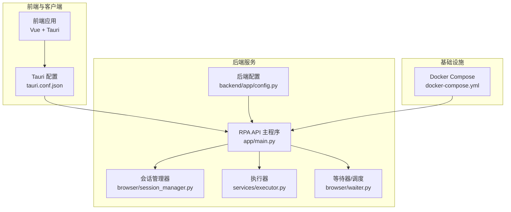
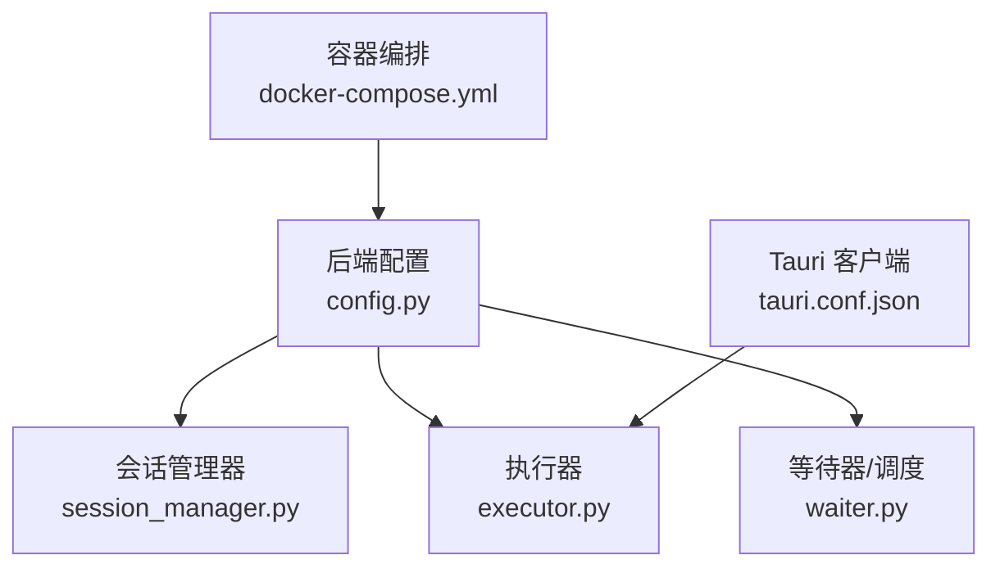
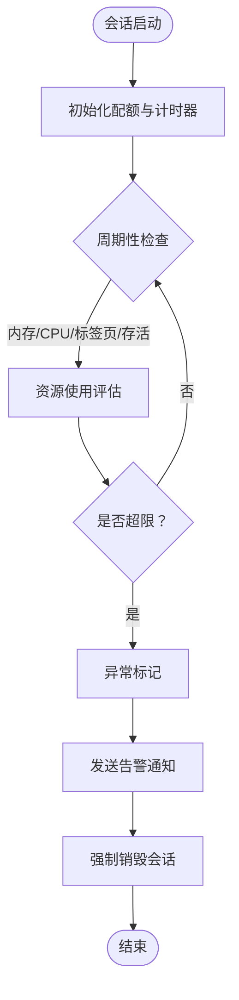
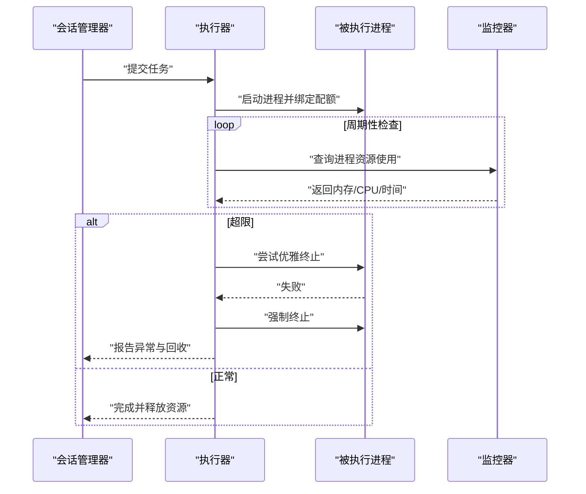
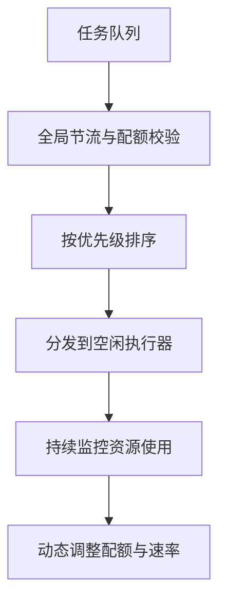
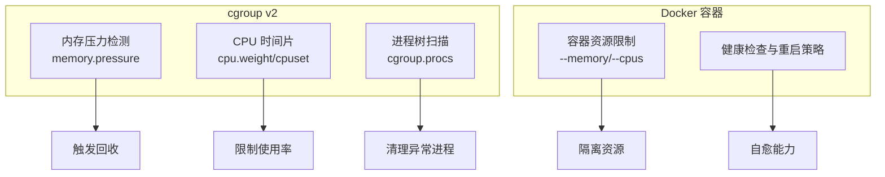
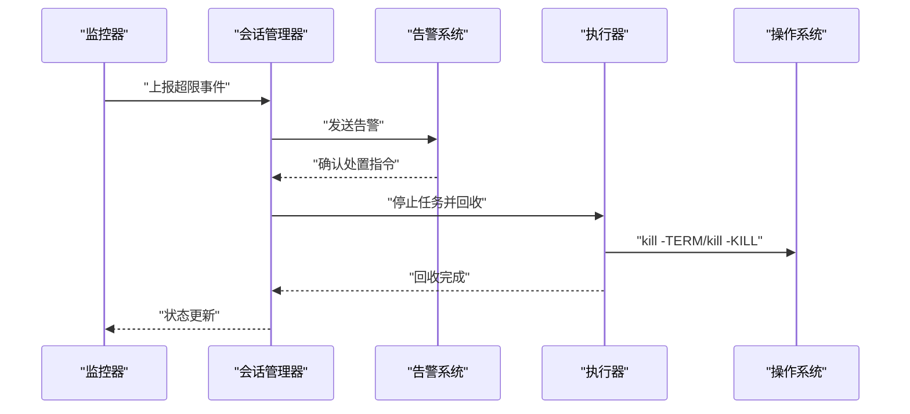
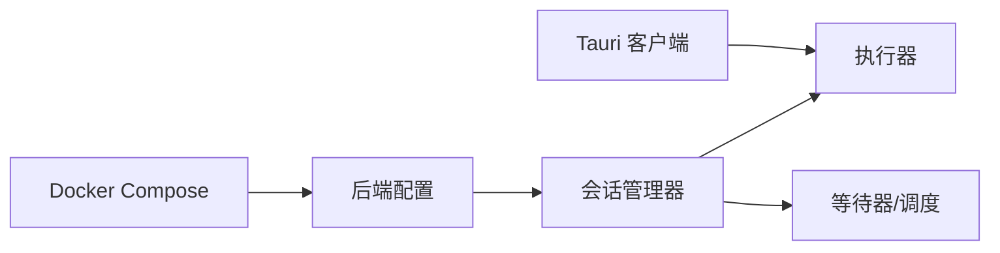

# 资源限制与管控

<cite>
**本文引用的文件**
- [config.py](file://CCC-BrowserV4/backend/app/config.py)
- [tauri.conf.json](file://CCC-BrowserV4/src-tauri/tauri.conf.json)
- [docker-compose.yml](file://CCC-BrowserV4/docker-compose.yml)
- [session_manager.py](file://CCC_RPA_API/app/browser/session_manager.py)
- [executor.py](file://CCC_RPA_API/app/services/executor.py)
- [waiter.py](file://CCC_RPA_API/app/browser/waiter.py)
- [main.py](file://CCC_RPA_API/app/main.py)
</cite>

## 目录
1. [引言](#引言)
2. [项目结构](#项目结构)
3. [核心组件](#核心组件)
4. [架构总览](#架构总览)
5. [详细组件分析](#详细组件分析)
6. [依赖分析](#依赖分析)
7. [性能考虑](#性能考虑)
8. [故障排查指南](#故障排查指南)
9. [结论](#结论)
10. [附录](#附录)

## 引言
本技术文档围绕商用级 AI 浏览器系统的“资源限制与管控”主题展开，目标是建立一套可落地、可观测、可恢复的资源治理方案。文档聚焦以下关键目标：
- 明确单会话资源硬限制：内存 1–2 GiB、CPU 单核上限、最大标签页 10 个、最长存活时间 30 分钟至 24 小时。
- 设计进程级与容器级双重资源限制机制：利用 cgroup v2 内存压力检测、CPU 时间片分配、进程树监控等手段。
- 建立资源超限时的自动处理流程：异常标记、警告通知、强制销毁会话。
- 提供资源限制配置示例、监控指标设置与自动处理脚本思路。
- 解释资源管控如何保障集群稳定性，避免资源饥饿与雪崩效应，并实现公平的资源分配。

## 项目结构
本仓库包含前端、后端与 Tauri 客户端三部分，以及一个独立的 RPA API 后端服务。与资源限制直接相关的关键位置如下：
- 后端配置与数据库连接：用于集中化配置与持久化会话状态。
- Tauri 客户端配置：定义窗口尺寸、安全策略等，间接影响资源占用。
- Docker Compose：定义数据库容器运行参数，便于统一资源约束。
- RPA 会话管理与执行器：会话生命周期与资源使用的核心落点。

图表来源
- [tauri.conf.json:1-29](file://CCC-BrowserV4/src-tauri/tauri.conf.json#L1-L29)
- [config.py:1-52](file://CCC-BrowserV4/backend/app/config.py#L1-L52)
- [docker-compose.yml:1-21](file://CCC-BrowserV4/docker-compose.yml#L1-L21)
- [main.py](file://CCC_RPA_API/app/main.py)
- [session_manager.py](file://CCC_RPA_API/app/browser/session_manager.py)
- [executor.py](file://CCC_RPA_API/app/services/executor.py)
- [waiter.py](file://CCC_RPA_API/app/browser/waiter.py)

章节来源
- [tauri.conf.json:1-29](file://CCC-BrowserV4/src-tauri/tauri.conf.json#L1-L29)
- [config.py:1-52](file://CCC-BrowserV4/backend/app/config.py#L1-L52)
- [docker-compose.yml:1-21](file://CCC-BrowserV4/docker-compose.yml#L1-L21)

## 核心组件
- 后端配置模块：集中管理数据库连接与环境变量，为资源策略提供统一入口。
- 会话管理器：负责会话生命周期、并发控制与资源使用统计。
- 执行器：承载具体任务执行，需要在执行过程中受资源限制。
- 等待器/调度：协调任务队列与资源分配，避免过载。
- Tauri 客户端：通过窗口大小、最小尺寸等参数间接影响内存与 CPU 使用。
- Docker Compose：为数据库等服务提供容器级资源约束基础。

章节来源
- [config.py:18-47](file://CCC-BrowserV4/backend/app/config.py#L18-L47)
- [session_manager.py](file://CCC_RPA_API/app/browser/session_manager.py)
- [executor.py](file://CCC_RPA_API/app/services/executor.py)
- [waiter.py](file://CCC_RPA_API/app/browser/waiter.py)
- [tauri.conf.json:13-22](file://CCC-BrowserV4/src-tauri/tauri.conf.json#L13-L22)

## 架构总览
下图展示资源限制与管控在系统中的分布与交互关系：后端配置提供策略入口；会话管理器与执行器在业务层落实限制；Tauri 客户端与 Docker Compose 在运行时层面提供进程级与容器级约束；等待器/调度在全局维度进行资源协调。

图表来源
- [config.py:18-47](file://CCC-BrowserV4/backend/app/config.py#L18-L47)
- [session_manager.py](file://CCC_RPA_API/app/browser/session_manager.py)
- [executor.py](file://CCC_RPA_API/app/services/executor.py)
- [waiter.py](file://CCC_RPA_API/app/browser/waiter.py)
- [tauri.conf.json:1-29](file://CCC-BrowserV4/src-tauri/tauri.conf.json#L1-L29)
- [docker-compose.yml:1-21](file://CCC-BrowserV4/docker-compose.yml#L1-L21)

## 详细组件分析

### 会话管理器与资源硬限制设计
- 单会话内存上限：建议在会话启动时记录初始 RSS/常驻集大小，周期性采样并对比阈值（例如 1–2 GiB）。若超过阈值，触发异常标记与回收流程。
- 单会话 CPU 上限：以单核为基准，累计 CPU 时间片超过阈值（如 30–60 分钟）则判定超限，阻断后续操作并进入回收。
- 最大标签页数：在会话初始化时设定标签页配额（如 10），超出即拒绝新建标签页请求。
- 最长存活时间：记录会话创建时间，超过 30 分钟至 24 小时则触发回收。
- 进程树监控：对会话关联的子进程集合进行周期性扫描，发现僵尸或异常进程立即清理。

图表来源
- [session_manager.py](file://CCC_RPA_API/app/browser/session_manager.py)

章节来源
- [session_manager.py](file://CCC_RPA_API/app/browser/session_manager.py)

### 执行器与任务级资源控制
- 任务粒度的资源限制：在执行器中为每个任务分配独立的资源配额，结合会话级限制形成“双层保护”。
- 超时与中断：当任务执行时间接近会话上限时，提前发出预警并尝试优雅终止，失败则强制 kill。
- 资源统计：在执行前后采集进程的内存与 CPU 指标，用于审计与优化。

图表来源
- [executor.py](file://CCC_RPA_API/app/services/executor.py)
- [session_manager.py](file://CCC_RPA_API/app/browser/session_manager.py)

章节来源
- [executor.py](file://CCC_RPA_API/app/services/executor.py)

### 等待器/调度与全局资源协调
- 队列节流：基于当前系统可用资源动态调整任务入队速率，避免瞬时过载。
- 优先级与配额：为不同类型任务设置不同资源权重，确保关键任务优先获得 CPU 与内存配额。
- 跨会话公平性：采用轮询或令牌桶算法，确保各会话在长时间内平均分配到资源。

图表来源
- [waiter.py](file://CCC_RPA_API/app/browser/waiter.py)

章节来源
- [waiter.py](file://CCC_RPA_API/app/browser/waiter.py)

### 进程级与容器级双重资源限制
- 进程级（cgroup v2）：
  - 内存压力检测：通过 cgroup v2 memory.events 或 memory.pressure 接口监测压力事件，结合内存使用阈值触发回收。
  - CPU 时间片分配：通过 cpuset 或 cpu.weight 设置 CPU 权重，限制单会话 CPU 使用率。
  - 进程树监控：遍历 cgroup 下所有子进程，清理僵尸与异常进程。
- 容器级（Docker）：
  - 为浏览器与 API 服务分别设置内存与 CPU 限制，避免相互干扰。
  - 使用健康检查与重启策略，提升系统自愈能力。

图表来源
- [docker-compose.yml:1-21](file://CCC-BrowserV4/docker-compose.yml#L1-L21)

章节来源
- [docker-compose.yml:1-21](file://CCC-BrowserV4/docker-compose.yml#L1-L21)

### 自动处理流程：异常标记、告警与销毁
- 异常标记：在会话管理器中标记“超限”状态，写入会话元数据以便审计。
- 告警通知：通过统一告警通道（如邮件、IM 或日志）推送超限事件，包含会话 ID、资源类型、阈值与当前值。
- 强制销毁：调用执行器终止进程树，释放内存与 CPU；清理临时文件与数据库记录。

图表来源
- [session_manager.py](file://CCC_RPA_API/app/browser/session_manager.py)
- [executor.py](file://CCC_RPA_API/app/services/executor.py)

章节来源
- [session_manager.py](file://CCC_RPA_API/app/browser/session_manager.py)
- [executor.py](file://CCC_RPA_API/app/services/executor.py)

### 资源限制配置示例与监控指标
- 配置示例（后端配置模块）：可在配置模块中新增资源限制字段，如内存上限、CPU 配额、最大标签页数、最长存活时间等，统一由 Settings 类加载。
- 监控指标：
  - 内存：RSS、常驻集、水位线、回收次数。
  - CPU：用户态/内核态时间、使用率、时间片耗尽次数。
  - 标签页：当前数量、峰值、创建/销毁速率。
  - 存活：会话创建时间、持续时长、超时次数。
- 自动处理脚本思路：基于 cgroup v2 接口编写监控脚本，达到阈值时调用会话管理器的回收接口。

章节来源
- [config.py:9-47](file://CCC-BrowserV4/backend/app/config.py#L9-L47)

### 集群稳定性与公平资源分配
- 防止资源饥饿：通过全局节流与优先级队列，确保低优先级任务不会长期占用资源。
- 防雪崩效应：设置软/硬阈值与分级告警，超限时快速降载而非逐步崩溃。
- 公平分配：采用配额轮转或令牌桶算法，使各会话在长期内获得相对均衡的资源份额。

## 依赖分析
- 组件耦合：
  - 会话管理器依赖后端配置模块提供的策略参数。
  - 执行器与等待器共同依赖会话管理器的状态与配额信息。
  - Tauri 客户端与 Docker Compose 为运行时提供进程级与容器级约束。
- 外部依赖：
  - cgroup v2 与 Docker API 为资源限制与回收提供底层支持。
  - 数据库用于持久化会话状态与审计日志。

图表来源
- [config.py:18-47](file://CCC-BrowserV4/backend/app/config.py#L18-L47)
- [session_manager.py](file://CCC_RPA_API/app/browser/session_manager.py)
- [executor.py](file://CCC_RPA_API/app/services/executor.py)
- [waiter.py](file://CCC_RPA_API/app/browser/waiter.py)
- [tauri.conf.json:1-29](file://CCC-BrowserV4/src-tauri/tauri.conf.json#L1-L29)
- [docker-compose.yml:1-21](file://CCC-BrowserV4/docker-compose.yml#L1-L21)

章节来源
- [config.py:18-47](file://CCC-BrowserV4/backend/app/config.py#L18-L47)
- [tauri.conf.json:1-29](file://CCC-BrowserV4/src-tauri/tauri.conf.json#L1-L29)
- [docker-compose.yml:1-21](file://CCC-BrowserV4/docker-compose.yml#L1-L21)

## 性能考虑
- 采样频率：内存与 CPU 采样间隔应平衡精度与开销，建议每秒一次。
- 回收策略：先 TERM 后 KILL，避免孤儿进程；回收完成后延迟清理缓存，降低抖动。
- 队列与批处理：批量提交任务，减少上下文切换与系统调用次数。
- 缓存与预热：对热点会话进行预热，降低首次高峰负载。

## 故障排查指南
- 常见问题：
  - 会话频繁超限：检查是否存在内存泄漏或未释放的标签页；适当降低内存阈值或增加回收频率。
  - CPU 使用率过高：检查任务是否长时间占用 CPU；启用更严格的 CPU 时间片限制。
  - 标签页过多：限制最大标签页数并在前端提示用户关闭多余标签页。
  - 存活时间过长：缩短最长存活时间并增加告警阈值。
- 排查步骤：
  - 查看会话管理器日志，定位超限类型与发生时间。
  - 通过 cgroup v2 接口导出内存与 CPU 使用曲线，确认是否出现尖峰。
  - 检查执行器的终止记录，确认回收是否成功。
  - 对比 Docker 容器资源限制，确保未被宿主覆盖。

章节来源
- [session_manager.py](file://CCC_RPA_API/app/browser/session_manager.py)
- [executor.py](file://CCC_RPA_API/app/services/executor.py)

## 结论
通过“后端配置 + 会话管理器 + 执行器 + 等待器”的多层协同，配合 cgroup v2 与 Docker 的进程/容器级限制，本方案能够有效实现商用级 AI 浏览器的资源硬限制与自动回收。该体系在保障系统稳定性的同时，兼顾了公平性与可观测性，为大规模部署提供了坚实基础。

## 附录
- 参考实现位置：
  - 后端配置入口：[config.py:9-47](file://CCC-BrowserV4/backend/app/config.py#L9-L47)
  - 会话管理器：[session_manager.py](file://CCC_RPA_API/app/browser/session_manager.py)
  - 执行器：[executor.py](file://CCC_RPA_API/app/services/executor.py)
  - 等待器/调度：[waiter.py](file://CCC_RPA_API/app/browser/waiter.py)
  - Tauri 客户端：[tauri.conf.json:1-29](file://CCC-BrowserV4/src-tauri/tauri.conf.json#L1-L29)
  - Docker 编排：[docker-compose.yml:1-21](file://CCC-BrowserV4/docker-compose.yml#L1-L21)