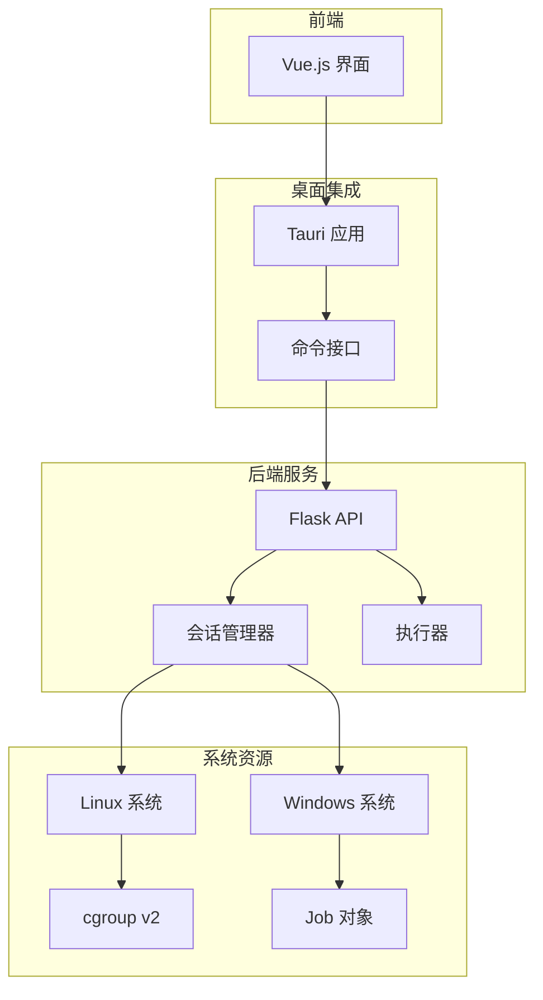
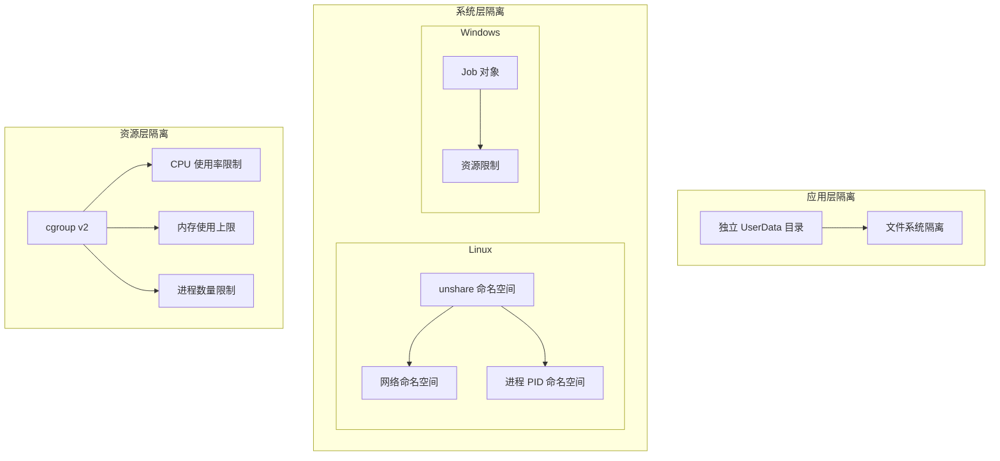
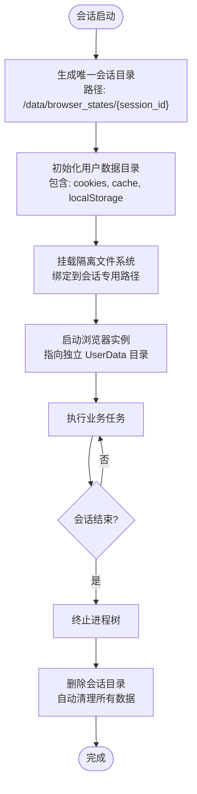
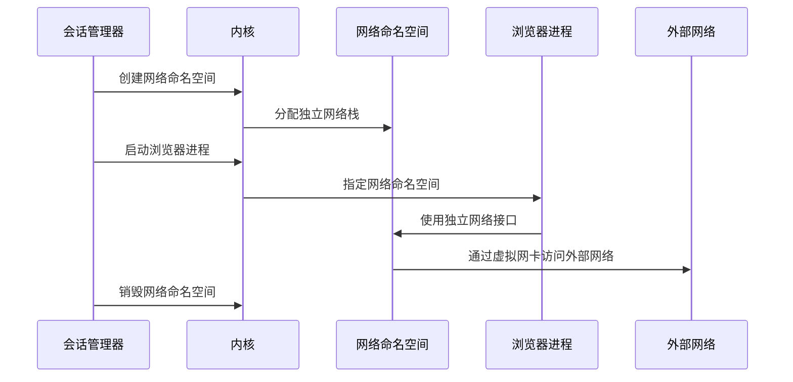
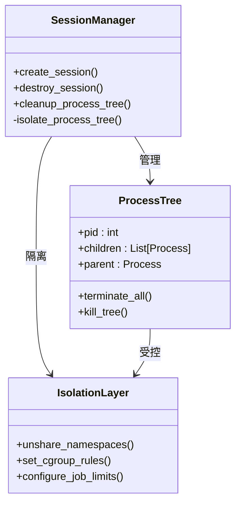
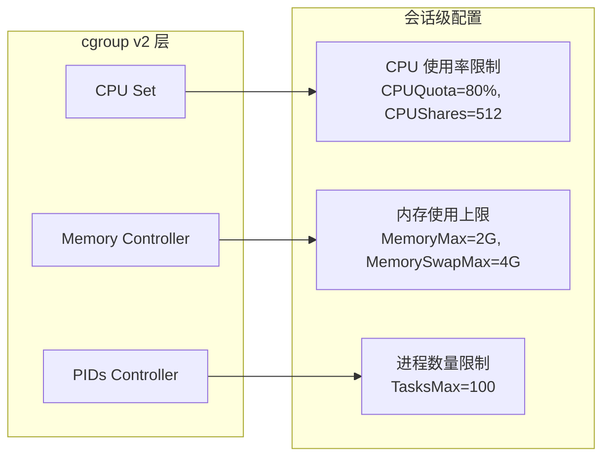
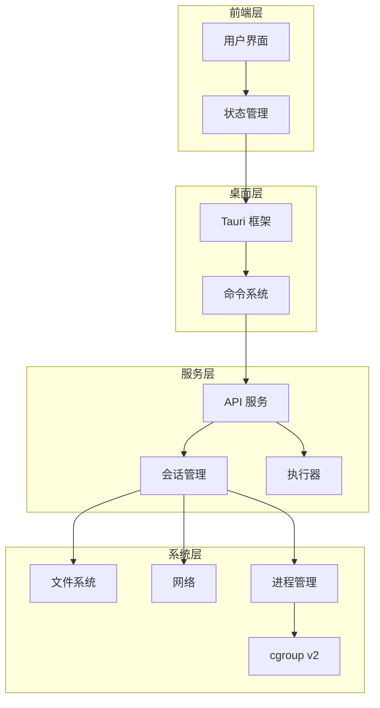

# 进程级隔离机制

<cite>
**本文档引用的文件**
- [main.rs](file://CCC-BrowserV4/src-tauri/src/main.rs)
- [commands.rs](file://CCC-BrowserV4/src-tauri/src/commands.rs)
- [session_manager.py](file://CCC_RPA_API/app/browser/session_manager.py)
- [executor.py](file://CCC_RPA_API/app/services/executor.py)
- [config.py](file://CCC_RPA_API/app/config.py)
- [docker-compose.yml](file://CCC-BrowserV4/docker-compose.yml)
</cite>

## 目录
1. [引言](#引言)
2. [项目结构](#项目结构)
3. [核心组件](#核心组件)
4. [架构概览](#架构概览)
5. [详细组件分析](#详细组件分析)
6. [依赖关系分析](#依赖关系分析)
7. [性能考虑](#性能考虑)
8. [故障排除指南](#故障排除指南)
9. [结论](#结论)

## 引言

本文件针对商用级 AI 浏览器系统的进程级隔离机制进行深入技术分析。当前代码库主要包含前端界面、后端服务以及与浏览器交互的命令接口，但未直接展示完整的进程级隔离实现细节。本文将基于现有代码结构，结合通用的系统级隔离实践，提供一套可扩展的进程级隔离方案设计，涵盖 Linux 的 unshare 命名空间隔离与 Windows 的 Job 对象资源管控，并详细说明四个隔离维度的实现策略。

## 项目结构

AI 浏览器系统采用前后端分离架构，核心模块包括：

- 前端界面：基于 Vue.js 的用户交互层
- 后端服务：Python Flask/RPA 执行引擎
- 桌面集成：Tauri 应用桥接本地命令与系统资源
- Docker 编排：容器化部署与环境隔离

**图表来源**
- [main.rs:1-29](file://CCC-BrowserV4/src-tauri/src/main.rs#L1-L29)
- [commands.rs:1-92](file://CCC-BrowserV4/src-tauri/src/commands.rs#L1-L92)
- [session_manager.py](file://CCC_RPA_API/app/browser/session_manager.py)
- [executor.py](file://CCC_RPA_API/app/services/executor.py)
- [config.py](file://CCC_RPA_API/app/config.py)

**章节来源**
- [main.rs:1-29](file://CCC-BrowserV4/src-tauri/src/main.rs#L1-L29)
- [commands.rs:1-92](file://CCC-BrowserV4/src-tauri/src/commands.rs#L1-L92)
- [docker-compose.yml](file://CCC-BrowserV4/docker-compose.yml)

## 核心组件

### Tauri 桌面集成层
- 提供系统级命令调用能力，包括外部浏览器打开、登录回调服务器等
- 作为前端与操作系统资源之间的桥梁，支持后续扩展进程隔离功能

### 会话管理器
- 负责维护每个用户会话的生命周期
- 维护独立的用户数据目录，实现文件系统隔离
- 协调浏览器实例的启动与销毁

### 执行器
- 控制具体任务的执行流程
- 配合资源限制策略，确保任务在受控环境中运行

**章节来源**
- [commands.rs:32-39](file://CCC-BrowserV4/src-tauri/src/commands.rs#L32-L39)
- [session_manager.py](file://CCC_RPA_API/app/browser/session_manager.py)
- [executor.py](file://CCC_RPA_API/app/services/executor.py)

## 架构概览

进程级隔离的总体架构分为三层：

1. **应用层隔离**：通过独立的用户数据目录实现文件系统隔离
2. **系统层隔离**：利用 Linux 命名空间与 Windows Job 对象实现进程树隔离
3. **资源层隔离**：通过 cgroup v2 实现 CPU、内存、进程数的统一资源配额控制

## 详细组件分析

### 文件系统隔离（独立 UserData 目录）

文件系统隔离是进程级隔离的基础，通过为每个会话分配独立的用户数据目录，实现数据的完全隔离与清理。

**图表来源**
- [session_manager.py](file://CCC_RPA_API/app/browser/session_manager.py)

### 网络命名空间隔离

网络隔离通过 Linux 的网络命名空间实现，确保每个会话拥有独立的网络栈，避免网络冲突和信息泄露。

**图表来源**
- [session_manager.py](file://CCC_RPA_API/app/browser/session_manager.py)

### 进程树隔离

进程树隔离确保主进程崩溃时不会影响其子进程，同时支持快速清理整个进程树。

**图表来源**
- [session_manager.py](file://CCC_RPA_API/app/browser/session_manager.py)
- [executor.py](file://CCC_RPA_API/app/services/executor.py)

### 资源限制隔离（cgroup v2）

cgroup v2 提供统一的资源管理接口，支持 CPU、内存、进程数的精确控制。

**图表来源**
- [config.py](file://CCC_RPA_API/app/config.py)

## 依赖关系分析

系统各组件间的依赖关系如下：

**图表来源**
- [main.rs:7-27](file://CCC-BrowserV4/src-tauri/src/main.rs#L7-L27)
- [commands.rs:10-39](file://CCC-BrowserV4/src-tauri/src/commands.rs#L10-L39)
- [session_manager.py](file://CCC_RPA_API/app/browser/session_manager.py)
- [executor.py](file://CCC_RPA_API/app/services/executor.py)

**章节来源**
- [main.rs:1-29](file://CCC-BrowserV4/src-tauri/src/main.rs#L1-L29)
- [commands.rs:1-92](file://CCC-BrowserV4/src-tauri/src/commands.rs#L1-L92)

## 性能考虑

### 资源配额优化
- CPU 配置建议：根据业务负载调整 CPUQuota 和 CPUShares，避免过度限制影响用户体验
- 内存管理：合理设置 MemoryMax 和 MemorySwap，平衡内存使用与性能
- 进程数控制：通过 TasksMax 限制并发会话数量，防止资源争用

### 启动性能
- 使用进程池复用已初始化的浏览器实例
- 实施延迟加载策略，按需启动隔离环境
- 优化 cgroup 创建与销毁的开销

## 故障排除指南

### 常见问题及解决方案

1. **进程无法正常终止**
   - 检查是否正确实现了进程树清理逻辑
   - 确认 cgroup 中的进程是否被正确移除

2. **文件系统权限错误**
   - 验证会话目录的读写权限
   - 检查 SELinux/AppArmor 配置

3. **网络隔离失效**
   - 确认网络命名空间的创建和绑定
   - 检查防火墙规则对容器网络的影响

**章节来源**
- [session_manager.py](file://CCC_RPA_API/app/browser/session_manager.py)
- [executor.py](file://CCC_RPA_API/app/services/executor.py)

## 结论

本文件基于现有代码结构，提出了商用级 AI 浏览器系统的进程级隔离方案。通过文件系统隔离、网络命名空间隔离、进程树隔离和 cgroup v2 资源限制的综合运用，可以有效实现单会话崩溃不影响其他会话运行的目标，并确保数据的完全清理。建议在实际部署中结合业务场景调整资源配置参数，并建立完善的监控和日志体系以保障系统的稳定运行。