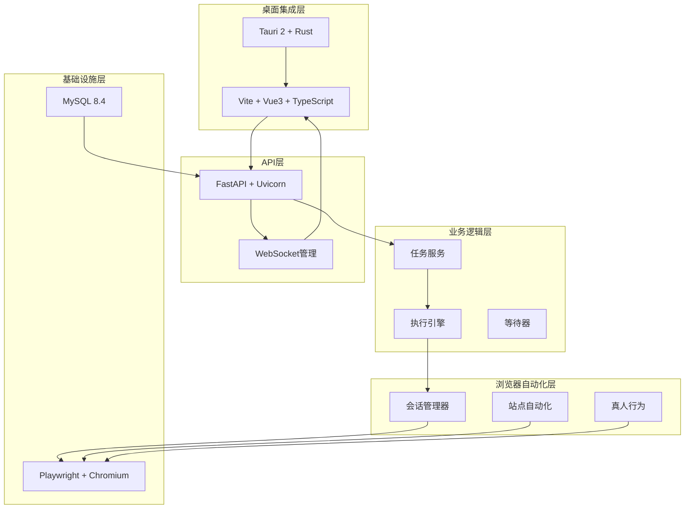
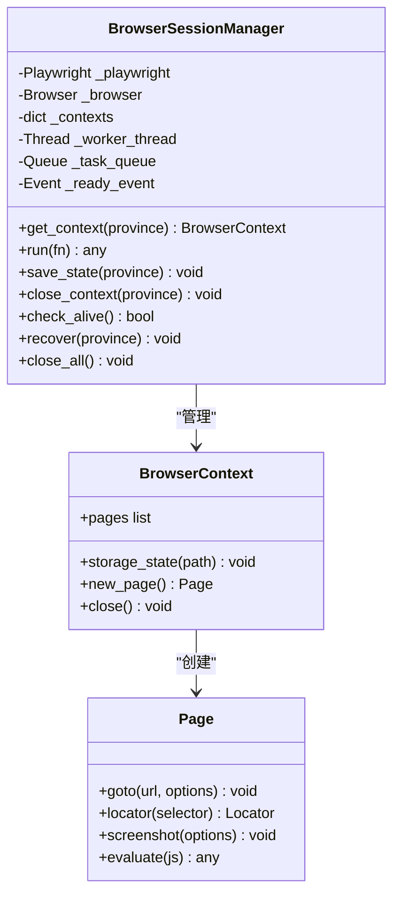
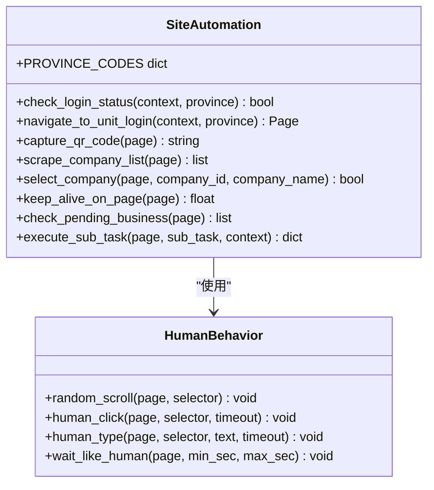
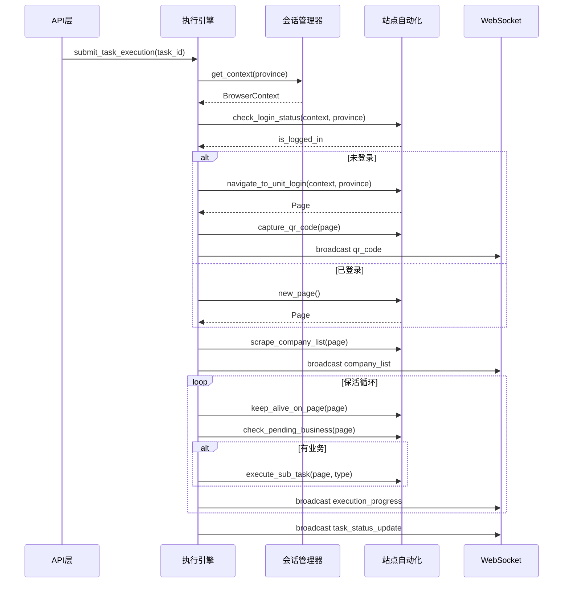
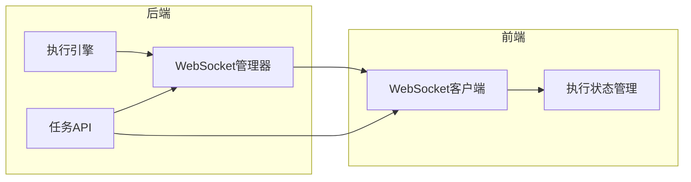
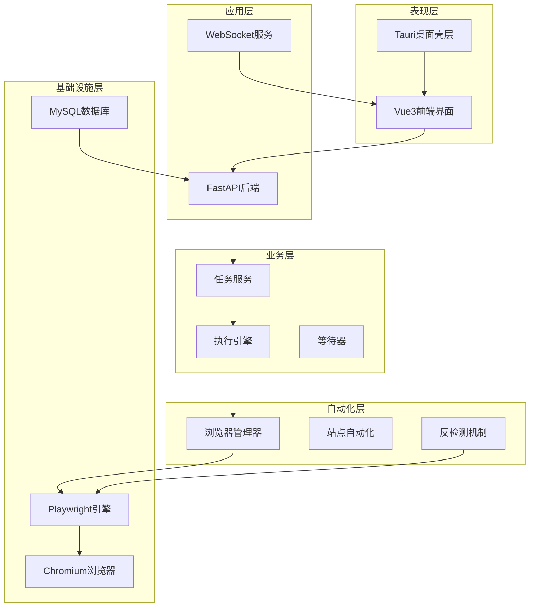
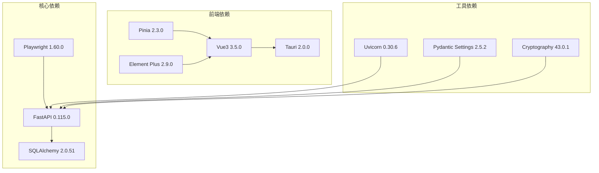

# Playwright Core CDP 轻量化封装

<cite>
**本文档引用的文件**
- [project.md](file://project.md)
- [session_manager.py](file://CCC_RPA_API/app/browser/session_manager.py)
- [site_automation.py](file://CCC_RPA_API/app/browser/site_automation.py)
- [human_behavior.py](file://CCC_RPA_API/app/browser/human_behavior.py)
- [waiter.py](file://CCC_RPA_API/app/browser/waiter.py)
- [executor.py](file://CCC_RPA_API/app/services/executor.py)
- [manager.py](file://CCC_RPA_API/app/ws/manager.py)
- [main.py](file://CCC_RPA_API/app/main.py)
- [tasks.py](file://CCC_RPA_API/app/api/tasks.py)
- [task.py](file://CCC_RPA_API/app/services/task.py)
- [ws.ts](file://CCC-BrowserV4/frontend/src/api/ws.ts)
- [execution.ts](file://CCC-BrowserV4/frontend/src/stores/execution.ts)
- [execution.ts](file://CCC-BrowserV4/frontend/src/api/execution.ts)
</cite>

## 目录
1. [简介](#简介)
2. [项目结构](#项目结构)
3. [核心组件](#核心组件)
4. [架构概览](#架构概览)
5. [详细组件分析](#详细组件分析)
6. [依赖关系分析](#依赖关系分析)
7. [性能考虑](#性能考虑)
8. [故障排除指南](#故障排除指南)
9. [结论](#结论)

## 简介

本项目是一个专注于政府交通管理网站（122.gov.cn）的RPA自动化平台。该项目采用Playwright浏览器引擎，通过轻量化的CDP（Chrome DevTools Protocol）封装实现浏览器自动化，具备以下核心特性：

- **轻量化设计理念**：不内置浏览器二进制，仅封装CDP长连接通信
- **按省份隔离会话**：为每个省份维护独立的BrowserContext，支持storage_state持久化
- **反检测机制**：使用playwright-stealth库和真人行为模拟
- **异步执行引擎**：基于ThreadPoolExecutor的并行任务执行
- **实时通信**：WebSocket实现实时状态同步

## 项目结构

项目采用五层架构设计，从基础设施到桌面集成层形成完整的自动化解决方案：

**图表来源**
- [project.md:34-66](file://project.md#L34-L66)
- [main.py:12-27](file://main.py#L12-L27)

**章节来源**
- [project.md:103-156](file://project.md#L103-L156)
- [project.md:159-260](file://project.md#L159-L260)

## 核心组件

### 浏览器会话管理器（BrowserSessionManager）

BrowserSessionManager是整个系统的核心组件，负责管理Playwright浏览器实例和会话状态：

**图表来源**
- [session_manager.py:10-186](file://session_manager.py#L10-L186)

该组件实现了以下关键功能：
- **专用工作线程**：确保所有Playwright操作在单一工作线程中执行，避免线程冲突
- **按省份隔离**：为每个省份维护独立的BrowserContext
- **状态持久化**：支持storage_state的自动保存和恢复
- **会话恢复**：浏览器崩溃时自动恢复会话状态

**章节来源**
- [session_manager.py:10-186](file://session_manager.py#L10-L186)

### 站点自动化引擎（SiteAutomation）

SiteAutomation封装了针对122.gov.cn网站的所有自动化操作：

**图表来源**
- [site_automation.py:16-743](file://site_automation.py#L16-L743)
- [human_behavior.py:12-86](file://human_behavior.py#L12-L86)

主要功能包括：
- **登录状态检测**：检查用户是否已登录
- **二维码截取**：获取登录二维码并转换为base64格式
- **单位列表抓取**：支持多种选择器的降级策略
- **页面保活**：执行随机滚动、鼠标移动等非侵入式操作
- **业务检测**：自动检测待处理的业务类型

**章节来源**
- [site_automation.py:16-743](file://site_automation.py#L16-L743)

### 执行引擎（Executor）

执行引擎是任务执行的核心协调者：

**图表来源**
- [executor.py:78-315](file://executor.py#L78-L315)
- [session_manager.py:98-126](file://session_manager.py#L98-L126)
- [site_automation.py:38-541](file://site_automation.py#L38-L541)

**章节来源**
- [executor.py:78-315](file://executor.py#L78-L315)

### 实时通信系统

系统采用WebSocket实现前后端实时通信：

**图表来源**
- [manager.py:5-29](file://manager.py#L5-L29)
- [ws.ts:8-88](file://CCC-BrowserV4/frontend/src/api/ws.ts#L8-L88)
- [execution.ts:6-229](file://CCC-BrowserV4/frontend/src/stores/execution.ts#L6-L229)

**章节来源**
- [manager.py:5-29](file://manager.py#L5-L29)
- [ws.ts:8-88](file://CCC-BrowserV4/frontend/src/api/ws.ts#L8-L88)
- [execution.ts:6-229](file://CCC-BrowserV4/frontend/src/stores/execution.ts#L6-L229)

## 架构概览

系统采用分层架构设计，每层都有明确的职责分工：

**图表来源**
- [project.md:34-66](file://project.md#L34-L66)
- [project.md:68-100](file://project.md#L68-L100)

## 详细组件分析

### CDP指令封装实现

系统通过Playwright的Sync API实现对CDP指令的封装，主要包括以下核心操作：

#### 页面操作封装
- **页面创建与销毁**：通过`context.new_page()`和`page.close()`管理页面生命周期
- **导航控制**：支持`page.goto()`的多种等待条件（networkidle、domcontentloaded）
- **元素定位**：使用`page.locator()`进行元素选择，支持多种选择器策略

#### DOM元素操作
- **元素交互**：封装`click()`、`fill()`、`input()`等操作
- **属性获取**：支持`bounding_box()`、`inner_text()`等属性查询
- **滚动控制**：通过`mouse.wheel()`实现页面滚动

#### 截图功能
- **全页截图**：支持完整页面截图
- **元素截图**：仅截取特定元素
- **Base64编码**：自动将截图转换为Base64格式

**章节来源**
- [site_automation.py:148-173](file://site_automation.py#L148-L173)
- [site_automation.py:294-541](file://site_automation.py#L294-L541)

### 动态配置会话参数

系统支持运行时动态调整浏览器会话参数：

#### 指纹伪装配置
- **User-Agent定制**：每个会话使用特定的User-Agent字符串
- **Viewport设置**：固定1280x800的视口尺寸
- **navigator.webdriver覆写**：通过注入脚本隐藏自动化特征

#### 代理设置
- **HTTP代理**：支持通过命令行参数配置代理服务器
- **SOCKS代理**：支持SOCKS4/SOCKS5代理协议

#### 存储隔离
- **storage_state持久化**：每个省份的会话状态独立存储
- **Cookie管理**：自动处理跨页面的Cookie共享
- **本地存储**：支持localStorage和sessionStorage的隔离

**章节来源**
- [session_manager.py:98-126](file://session_manager.py#L98-L126)
- [session_manager.py:128-135](file://session_manager.py#L128-L135)

### 异常捕获和回调上报机制

系统实现了完善的异常处理和状态上报机制：

#### 进程崩溃检测
- **浏览器存活检查**：通过`browser.is_connected()`检测浏览器状态
- **页面状态监控**：监控页面对象的有效性
- **自动恢复机制**：检测到异常时自动重启浏览器实例

#### CDP连接断开监控
- **心跳检测**：定期检查CDP连接状态
- **重连策略**：连接断开时自动尝试重新建立连接
- **状态同步**：恢复后重新同步页面状态

#### 回调函数注册和执行
- **信号等待机制**：使用`threading.Event`实现异步等待
- **回调注册**：支持多类型的回调函数注册
- **执行策略**：采用线程池模式确保回调执行的线程安全

**章节来源**
- [executor.py:42-70](file://executor.py#L42-L70)
- [waiter.py:7-84](file://waiter.py#L7-L84)

## 依赖关系分析

系统各组件之间的依赖关系如下：

**图表来源**
- [project.md:104-149](file://project.md#L104-L149)

**章节来源**
- [project.md:104-149](file://project.md#L104-L149)

## 性能考虑

系统在设计时充分考虑了性能优化：

### 线程模型优化
- **专用工作线程**：Playwright操作集中在单一工作线程中执行
- **线程池管理**：任务执行使用ThreadPoolExecutor，支持并发控制
- **等待线程分离**：用户交互等待使用独立的等待线程池

### 内存管理
- **会话复用**：按省份复用BrowserContext，减少内存占用
- **状态清理**：及时清理不再使用的页面和上下文
- **资源回收**：系统关闭时自动清理所有资源

### 网络优化
- **CDP连接复用**：单个浏览器实例复用CDP连接
- **请求缓存**：合理使用浏览器缓存机制
- **并发控制**：限制同时执行的任务数量

## 故障排除指南

### 常见问题及解决方案

#### 浏览器启动失败
**症状**：Playwright初始化超时或失败
**原因**：Chromium启动参数配置不当
**解决方案**：
1. 检查`--no-sandbox`和`--disable-blink-features`参数
2. 确认系统环境满足Chromium运行要求
3. 查看浏览器启动日志获取详细错误信息

#### 会话状态丢失
**症状**：任务执行过程中会话状态异常
**原因**：storage_state文件损坏或权限问题
**解决方案**：
1. 检查`data/browser_states/`目录权限
2. 删除对应省份的状态文件重新开始
3. 确认磁盘空间充足

#### WebSocket连接中断
**症状**：前端无法接收实时状态更新
**原因**：网络波动或服务器负载过高
**解决方案**：
1. 检查网络连接稳定性
2. 查看服务器CPU和内存使用情况
3. 调整WebSocket重连参数

**章节来源**
- [executor.py:286-315](file://executor.py#L286-L315)
- [manager.py:17-26](file://manager.py#L17-L26)

## 结论

本项目通过轻量化的Playwright CDP封装，成功实现了针对政府交通管理网站的自动化解决方案。系统的主要优势包括：

1. **轻量化设计**：不内置浏览器二进制，降低部署复杂度
2. **高可靠性**：完善的异常处理和自动恢复机制
3. **可扩展性**：模块化设计支持功能扩展和定制
4. **用户体验**：实时状态反馈和直观的操作界面

通过合理的架构设计和优化策略，系统能够在保证稳定性的前提下提供高效的自动化服务，为后续的功能扩展奠定了良好的基础。