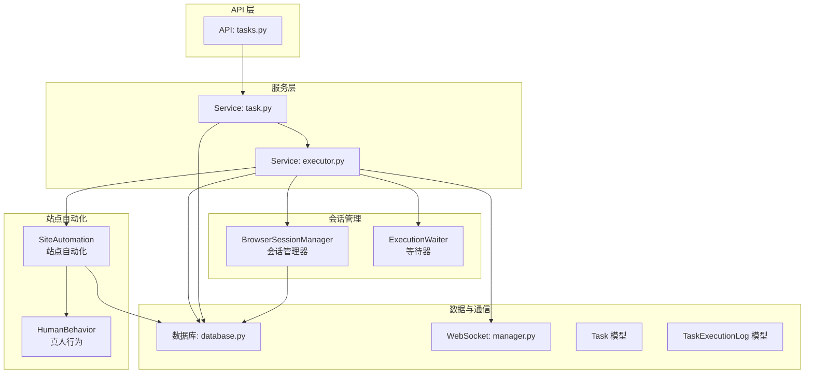
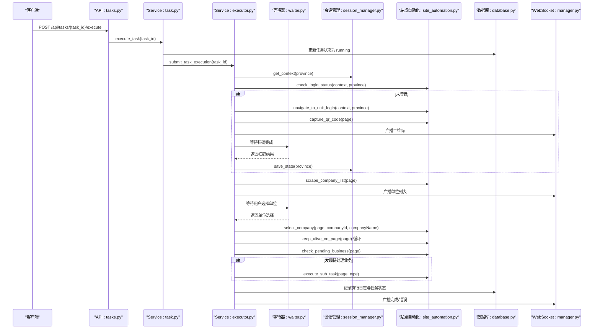
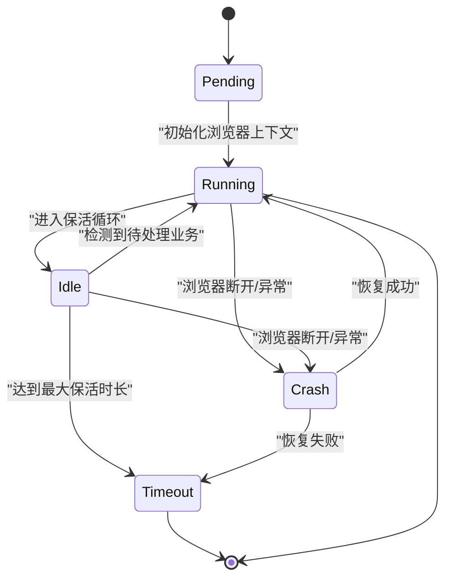
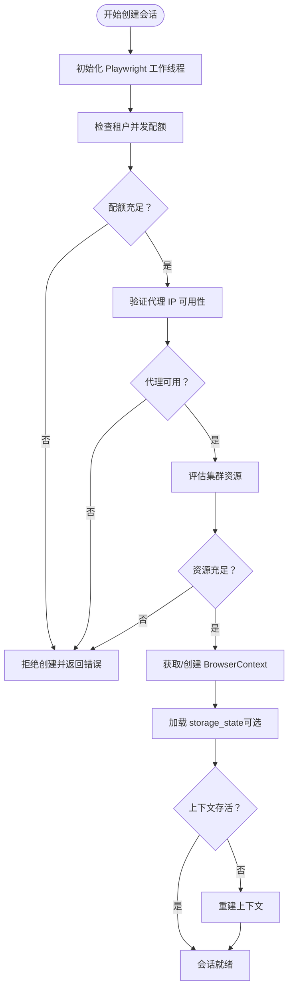
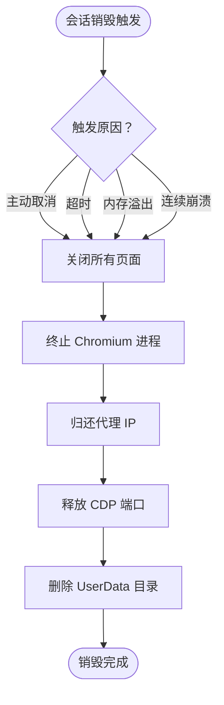
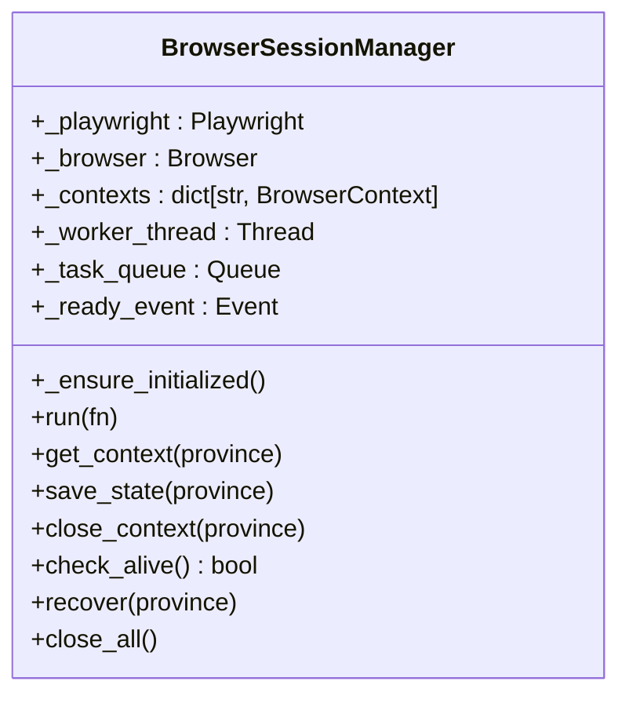
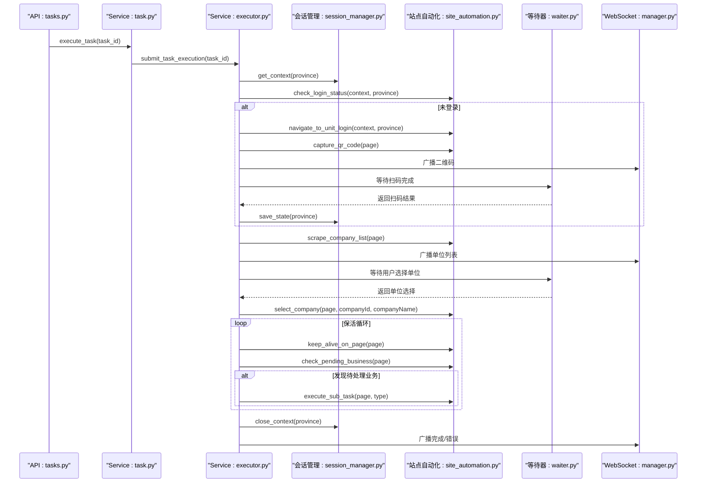
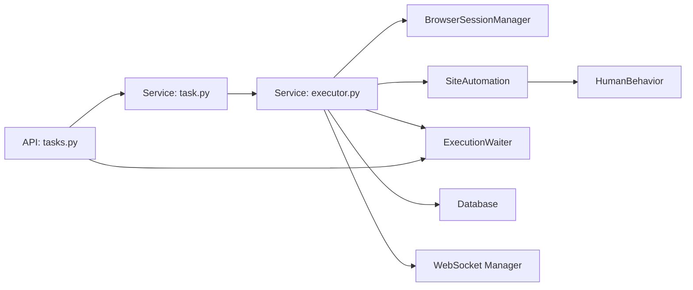

# 会话生命周期管理

<cite>
**本文档引用的文件**
- [session_manager.py](file://CCC_RPA_API/app/browser/session_manager.py)
- [executor.py](file://CCC_RPA_API/app/services/executor.py)
- [site_automation.py](file://CCC_RPA_API/app/browser/site_automation.py)
- [waiter.py](file://CCC_RPA_API/app/browser/waiter.py)
- [tasks.py](file://CCC_RPA_API/app/api/tasks.py)
- [task.py](file://CCC_RPA_API/app/models/task.py)
- [execution_log.py](file://CCC_RPA_API/app/models/execution_log.py)
- [user.py](file://CCC_RPA_API/app/models/user.py)
- [config.py](file://CCC_RPA_API/app/config.py)
- [database.py](file://CCC_RPA_API/app/database.py)
- [manager.py](file://CCC_RPA_API/app/ws/manager.py)
- [project.md](file://project.md)
</cite>

## 目录
1. [简介](#简介)
2. [项目结构](#项目结构)
3. [核心组件](#核心组件)
4. [架构总览](#架构总览)
5. [详细组件分析](#详细组件分析)
6. [依赖关系分析](#依赖关系分析)
7. [性能考虑](#性能考虑)
8. [故障排查指南](#故障排查指南)
9. [结论](#结论)

## 简介
本文件面向会话生命周期管理子系统，围绕浏览器会话的创建、运行、保活、销毁等环节进行技术说明。根据项目文档要求，系统采用“pending → running → idle → timeout/crash”状态机模型，并在会话创建前进行租户并发配额、代理 IP 可用性、集群资源评估等前置校验；在会话销毁时支持主动关闭、超时回收、内存溢出保护、页面连续崩溃处理等策略。同时提供会话资源回收的完整清单，包括 UserData 目录清理、CDP 端口释放、代理 IP 归还等关键步骤。

## 项目结构
会话生命周期管理涉及以下关键模块：
- 会话管理器：负责 Playwright 浏览器实例、上下文、存储状态的生命周期管理
- 任务执行器：协调任务执行流程，包含登录态检查、扫码登录、业务执行、保活循环
- 站点自动化：封装 122.gov.cn 的具体页面交互逻辑
- 等待器：提供用户交互阻塞/唤醒机制
- API 层：对外暴露任务执行、取消、选择单位等接口
- 数据模型：任务、执行日志、用户等 ORM 映射
- WebSocket 管理：向客户端推送执行进度与状态

图表来源
- [tasks.py:1-76](file://CCC_RPA_API/app/api/tasks.py#L1-L76)
- [executor.py:1-319](file://CCC_RPA_API/app/services/executor.py#L1-L319)
- [session_manager.py:1-186](file://CCC_RPA_API/app/browser/session_manager.py#L1-L186)
- [site_automation.py:1-743](file://CCC_RPA_API/app/browser/site_automation.py#L1-L743)
- [waiter.py:1-84](file://CCC_RPA_API/app/browser/waiter.py#L1-L84)
- [database.py:1-19](file://CCC_RPA_API/app/database.py#L1-L19)
- [manager.py:1-29](file://CCC_RPA_API/app/ws/manager.py#L1-L29)

章节来源
- [tasks.py:1-76](file://CCC_RPA_API/app/api/tasks.py#L1-L76)
- [executor.py:1-319](file://CCC_RPA_API/app/services/executor.py#L1-L319)
- [session_manager.py:1-186](file://CCC_RPA_API/app/browser/session_manager.py#L1-L186)
- [site_automation.py:1-743](file://CCC_RPA_API/app/browser/site_automation.py#L1-L743)
- [waiter.py:1-84](file://CCC_RPA_API/app/browser/waiter.py#L1-L84)
- [database.py:1-19](file://CCC_RPA_API/app/database.py#L1-L19)
- [manager.py:1-29](file://CCC_RPA_API/app/ws/manager.py#L1-L29)

## 核心组件
- 会话管理器（BrowserSessionManager）
  - 提供 Playwright 工作线程、专用队列与事件机制，确保所有 Playwright 操作在单一工作线程中执行，避免线程冲突
  - 支持按省份维护 BrowserContext，持久化 storage_state，实现跨进程会话恢复
  - 提供 get_context/save_state/close_context/check_alive/recover/close_all 等方法
- 任务执行器（executor）
  - 负责任务执行全流程编排：初始化浏览器、检查登录态、扫码登录、抓取单位列表、等待用户选择、选择单位、进入保活循环、业务执行、完成收尾
  - 在关键节点进行浏览器存活检查与自动恢复
  - 使用线程池与等待器分离阻塞等待，避免阻塞 Playwright 工作线程
- 站点自动化（SiteAutomation）
  - 封装登录页导航、二维码捕获、单位列表抓取、单位选择、页面保活、待处理业务检测、子任务执行等
  - 提供多种降级策略与错误检测，增强鲁棒性
- 等待器（ExecutionWaiter）
  - 基于 threading.Event 实现阻塞等待与唤醒，支持取消信号与非阻塞检查
- API 层（tasks.py）
  - 对外提供任务执行、取消、选择单位、扫码完成等接口，配合等待器实现用户交互
- 数据模型与数据库（task.py, execution_log.py, user.py, database.py, config.py）
  - 任务状态字段包含 pending/running/completed/failed
  - 执行日志记录任务开始、结束、状态与结果信息
  - 数据库连接配置与会话工厂

章节来源
- [session_manager.py:10-186](file://CCC_RPA_API/app/browser/session_manager.py#L10-L186)
- [executor.py:1-319](file://CCC_RPA_API/app/services/executor.py#L1-L319)
- [site_automation.py:1-743](file://CCC_RPA_API/app/browser/site_automation.py#L1-L743)
- [waiter.py:1-84](file://CCC_RPA_API/app/browser/waiter.py#L1-L84)
- [tasks.py:1-76](file://CCC_RPA_API/app/api/tasks.py#L1-L76)
- [task.py:1-25](file://CCC_RPA_API/app/models/task.py#L1-L25)
- [execution_log.py:1-17](file://CCC_RPA_API/app/models/execution_log.py#L1-L17)
- [user.py:1-17](file://CCC_RPA_API/app/models/user.py#L1-L17)
- [database.py:1-19](file://CCC_RPA_API/app/database.py#L1-L19)
- [config.py:1-22](file://CCC_RPA_API/app/config.py#L1-L22)

## 架构总览
会话生命周期管理采用“工作线程 + 线程池 + 等待器”的异步协作模式：
- 工作线程：承载 Playwright 启动、浏览器实例、上下文与页面操作
- 线程池：执行阻塞等待与业务逻辑，避免阻塞工作线程
- 等待器：在保活循环中轮询取消信号与业务触发
- WebSocket：向客户端推送执行进度与状态

图表来源
- [tasks.py:47-76](file://CCC_RPA_API/app/api/tasks.py#L47-L76)
- [executor.py:78-315](file://CCC_RPA_API/app/services/executor.py#L78-L315)
- [session_manager.py:98-144](file://CCC_RPA_API/app/browser/session_manager.py#L98-L144)
- [site_automation.py:38-743](file://CCC_RPA_API/app/browser/site_automation.py#L38-L743)
- [waiter.py:14-84](file://CCC_RPA_API/app/browser/waiter.py#L14-L84)
- [database.py:1-19](file://CCC_RPA_API/app/database.py#L1-L19)
- [manager.py:1-29](file://CCC_RPA_API/app/ws/manager.py#L1-L29)

## 详细组件分析

### 会话状态机设计
- 状态定义
  - pending：任务被提交，等待执行准备
  - running：会话已创建并处于活跃执行中
  - idle：会话保活中，等待业务触发
  - timeout：达到最大保活时长，自动销毁
  - crash：浏览器崩溃，自动恢复或销毁
- 状态转换
  - pending → running：任务执行器提交任务后，初始化浏览器上下文并进入执行
  - running → idle：进入保活循环，等待业务触发
  - idle → running：检测到待处理业务，执行业务处理
  - idle → timeout：超过最大保活时长（默认8小时）自动完成
  - running/idle → crash：检测到浏览器断开或异常，触发恢复或销毁
  - crash → running：恢复成功后重新进入执行
  - 任意状态 → timeout：超时回收策略
  - 任意状态 → crash：页面连续崩溃处理（项目文档要求）

图表来源
- [executor.py:204-216](file://CCC_RPA_API/app/services/executor.py#L204-L216)
- [site_automation.py:542-555](file://CCC_RPA_API/app/browser/site_automation.py#L542-L555)
- [session_manager.py:147-170](file://CCC_RPA_API/app/browser/session_manager.py#L147-L170)

章节来源
- [executor.py:204-216](file://CCC_RPA_API/app/services/executor.py#L204-L216)
- [site_automation.py:542-555](file://CCC_RPA_API/app/browser/site_automation.py#L542-L555)
- [session_manager.py:147-170](file://CCC_RPA_API/app/browser/session_manager.py#L147-L170)

### 会话创建流程与前置校验
- 创建前置校验
  - 租户剩余并发配额：需在任务提交前进行配额检查（项目文档要求）
  - 代理 IP 可用性验证：需在会话启动前验证代理可用性（项目文档要求）
  - 集群资源评估：需评估可用 CPU/内存/端口等资源（项目文档要求）
- 创建流程
  - 初始化 Playwright 工作线程，启动 Chromium
  - 获取或创建指定省份的 BrowserContext
  - 加载 storage_state（若存在），设置 UA、视口等参数
  - 验证上下文存活状态，必要时重建
- 会话恢复
  - 检测到浏览器断开时，关闭所有上下文并重启浏览器
  - 重新获取指定省份上下文并导航到目标页面

图表来源
- [session_manager.py:30-126](file://CCC_RPA_API/app/browser/session_manager.py#L30-L126)
- [executor.py:35-69](file://CCC_RPA_API/app/services/executor.py#L35-L69)

章节来源
- [session_manager.py:30-126](file://CCC_RPA_API/app/browser/session_manager.py#L30-L126)
- [executor.py:35-69](file://CCC_RPA_API/app/services/executor.py#L35-L69)

### 会话销毁策略与触发条件
- 触发条件
  - 主动关闭：用户调用取消接口
  - 超时回收：达到最大保活时长（默认8小时）
  - 内存溢出保护：项目文档要求，需结合监控指标实现
  - 页面连续崩溃：项目文档要求，需统计崩溃次数并触发销毁
- 执行策略
  - 关闭所有页面标签
  - 终止 Chromium 进程
  - 归还代理 IP 至代理池
  - 释放 CDP 端口
  - 全量删除 UserData 目录

图表来源
- [project.md:263-291](file://project.md#L263-L291)
- [session_manager.py:173-186](file://CCC_RPA_API/app/browser/session_manager.py#L173-L186)

章节来源
- [project.md:263-291](file://project.md#L263-L291)
- [session_manager.py:173-186](file://CCC_RPA_API/app/browser/session_manager.py#L173-L186)

### 会话资源回收清单
- UserData 目录清理：删除对应省份的状态文件与缓存
- CDP 端口释放：工作线程停止后自动释放
- 代理 IP 归还：在代理池中更新可用状态
- 浏览器进程终止：关闭所有上下文并停止 Playwright
- 执行日志清理：数据库中保留执行历史以便审计

章节来源
- [session_manager.py:173-186](file://CCC_RPA_API/app/browser/session_manager.py#L173-L186)
- [site_automation.py:542-555](file://CCC_RPA_API/app/browser/site_automation.py#L542-L555)

### 会话管理器类图

图表来源
- [session_manager.py:10-186](file://CCC_RPA_API/app/browser/session_manager.py#L10-L186)

章节来源
- [session_manager.py:10-186](file://CCC_RPA_API/app/browser/session_manager.py#L10-L186)

### 任务执行序列图

图表来源
- [tasks.py:47-76](file://CCC_RPA_API/app/api/tasks.py#L47-L76)
- [executor.py:78-315](file://CCC_RPA_API/app/services/executor.py#L78-L315)
- [session_manager.py:98-144](file://CCC_RPA_API/app/browser/session_manager.py#L98-L144)
- [site_automation.py:38-743](file://CCC_RPA_API/app/browser/site_automation.py#L38-L743)
- [waiter.py:14-84](file://CCC_RPA_API/app/browser/waiter.py#L14-L84)
- [manager.py:1-29](file://CCC_RPA_API/app/ws/manager.py#L1-L29)

章节来源
- [tasks.py:47-76](file://CCC_RPA_API/app/api/tasks.py#L47-L76)
- [executor.py:78-315](file://CCC_RPA_API/app/services/executor.py#L78-L315)

## 依赖关系分析
- 组件耦合
  - 任务执行器依赖会话管理器、站点自动化、等待器与数据库
  - API 层依赖服务层与等待器
  - 会话管理器与站点自动化依赖 Playwright
- 外部依赖
  - 数据库：MySQL（通过 SQLAlchemy）
  - WebSocket：FastAPI WebSocket 管理
  - 文件系统：UserData 目录与截图文件

图表来源
- [tasks.py:1-76](file://CCC_RPA_API/app/api/tasks.py#L1-L76)
- [executor.py:1-319](file://CCC_RPA_API/app/services/executor.py#L1-L319)
- [session_manager.py:1-186](file://CCC_RPA_API/app/browser/session_manager.py#L1-L186)
- [site_automation.py:1-743](file://CCC_RPA_API/app/browser/site_automation.py#L1-L743)
- [waiter.py:1-84](file://CCC_RPA_API/app/browser/waiter.py#L1-L84)
- [database.py:1-19](file://CCC_RPA_API/app/database.py#L1-L19)
- [manager.py:1-29](file://CCC_RPA_API/app/ws/manager.py#L1-L29)

章节来源
- [tasks.py:1-76](file://CCC_RPA_API/app/api/tasks.py#L1-L76)
- [executor.py:1-319](file://CCC_RPA_API/app/services/executor.py#L1-L319)
- [session_manager.py:1-186](file://CCC_RPA_API/app/browser/session_manager.py#L1-L186)
- [site_automation.py:1-743](file://CCC_RPA_API/app/browser/site_automation.py#L1-L743)
- [waiter.py:1-84](file://CCC_RPA_API/app/browser/waiter.py#L1-L84)
- [database.py:1-19](file://CCC_RPA_API/app/database.py#L1-L19)
- [manager.py:1-29](file://CCC_RPA_API/app/ws/manager.py#L1-L29)

## 性能考虑
- 工作线程与线程池分离：避免阻塞 Playwright 工作线程，提升并发能力
- 保活策略：随机滚动、鼠标移动、键盘 Tab 等轻量操作，降低页面跳转带来的开销
- 存储状态持久化：复用 storage_state 减少重复登录成本
- 超时控制：操作超时与等待超时双重保障，防止长时间阻塞

## 故障排查指南
- 浏览器断开/异常
  - 现象：页面报错包含“已关闭”、“目标页面”等关键词
  - 处理：检测错误类型并触发恢复流程，重新创建上下文与页面
- 扫码超时
  - 现象：等待扫码完成超时
  - 处理：返回超时错误并提示用户重新扫码
- 选择单位失败
  - 现象：CSS 选择器与 JS 回退均未命中目标元素
  - 处理：记录失败截图并返回失败，提示用户检查页面结构
- 保活循环卡住
  - 现象：长时间无待处理业务，等待超时
  - 处理：检查取消信号与业务检测逻辑，必要时缩短等待间隔

章节来源
- [site_automation.py:10-14](file://CCC_RPA_API/app/browser/site_automation.py#L10-L14)
- [executor.py:133-140](file://CCC_RPA_API/app/services/executor.py#L133-L140)
- [executor.py:42-69](file://CCC_RPA_API/app/services/executor.py#L42-L69)
- [site_automation.py:426-470](file://CCC_RPA_API/app/browser/site_automation.py#L426-L470)

## 结论
会话生命周期管理子系统通过“工作线程 + 线程池 + 等待器”的架构实现了稳定的浏览器会话管理与任务执行。系统具备完善的会话状态机、健壮的错误恢复机制以及清晰的资源回收流程。建议在现有基础上补充租户并发配额检查、代理 IP 可用性验证与集群资源评估的前置校验逻辑，并在项目文档要求的“内存溢出保护”和“页面连续崩溃处理”方面增加监控与阈值配置，以进一步提升系统的稳定性与可运维性。