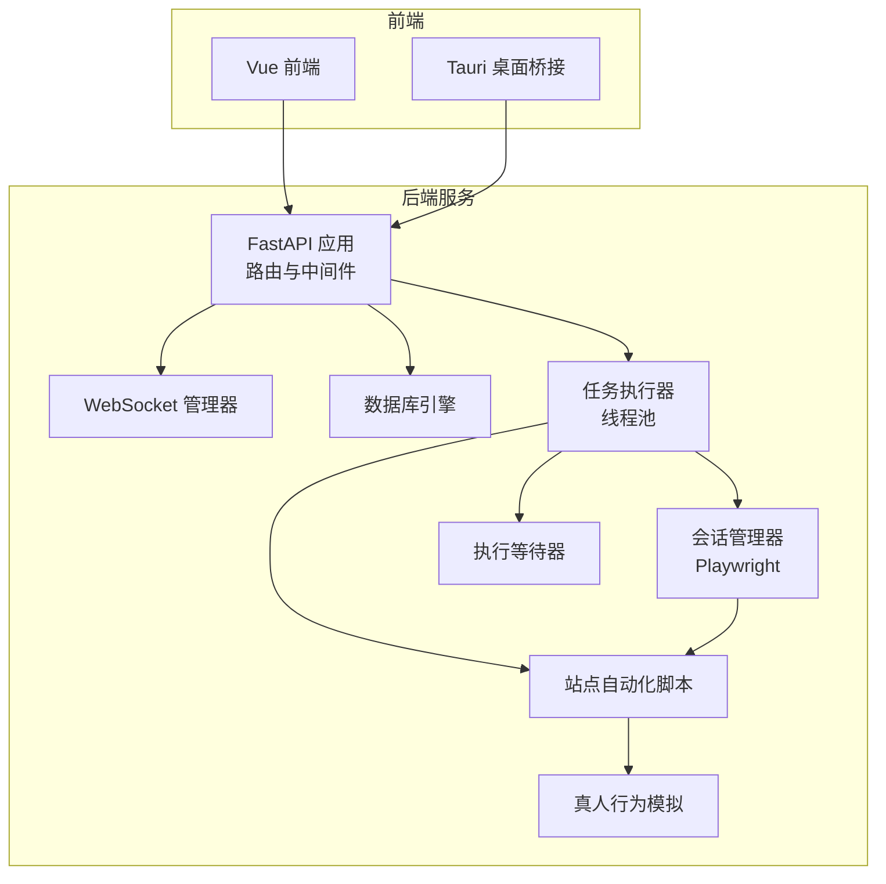
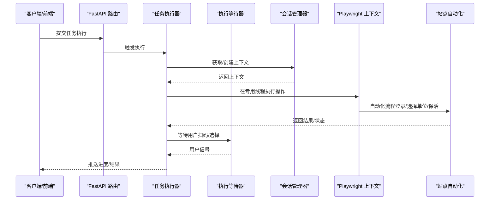
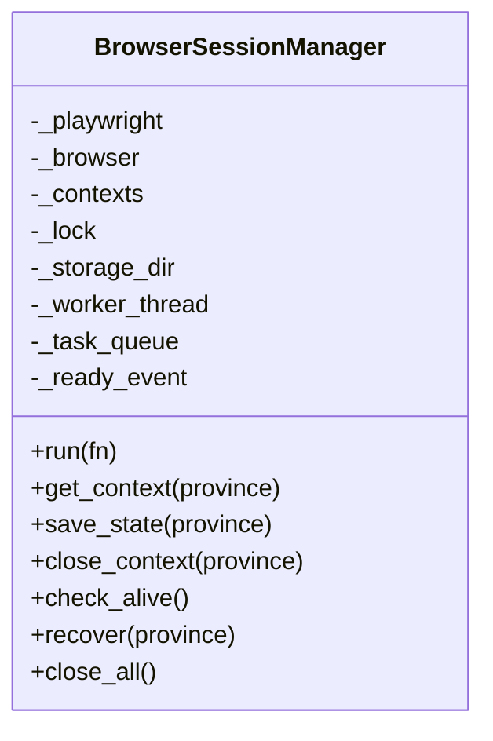
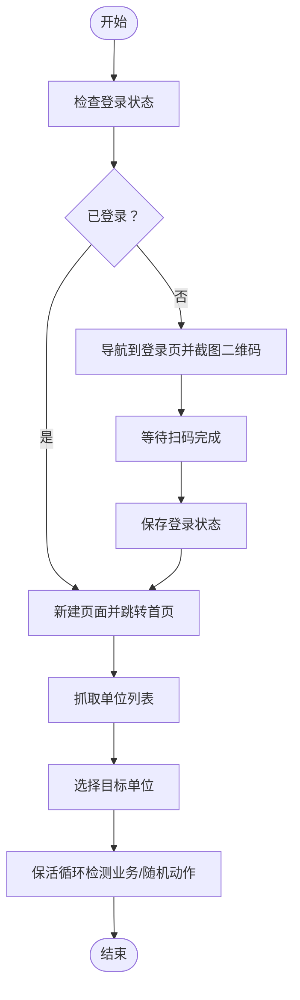
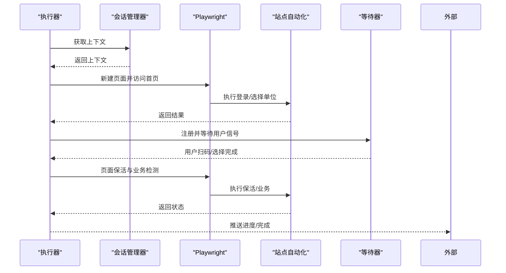
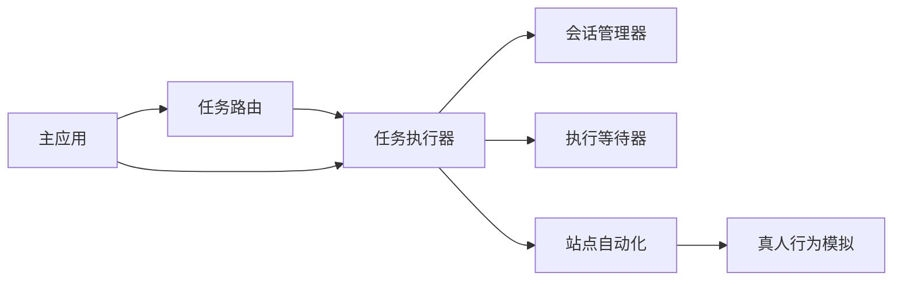

# 多维度强隔离机制

<cite>
**本文档引用的文件**
- [session_manager.py](file://CCC_RPA_API/app/browser/session_manager.py)
- [site_automation.py](file://CCC_RPA_API/app/browser/site_automation.py)
- [human_behavior.py](file://CCC_RPA_API/app/browser/human_behavior.py)
- [waiter.py](file://CCC_RPA_API/app/browser/waiter.py)
- [executor.py](file://CCC_RPA_API/app/services/executor.py)
- [tasks.py](file://CCC_RPA_API/app/api/tasks.py)
- [main.py](file://CCC_RPA_API/app/main.py)
</cite>

## 目录
1. [简介](#简介)
2. [项目结构](#项目结构)
3. [核心组件](#核心组件)
4. [架构总览](#架构总览)
5. [详细组件分析](#详细组件分析)
6. [依赖分析](#依赖分析)
7. [性能考虑](#性能考虑)
8. [故障排查指南](#故障排查指南)
9. [结论](#结论)

## 简介
本项目围绕“多维度强隔离机制”构建，目标是在同一宿主机上为不同会话提供高度隔离的浏览器运行环境，确保：
- 文件系统隔离：独立的用户数据目录、磁盘缓存、下载目录、扩展本地存储物理隔离
- 网络隔离：独立代理 IP 分配、网络命名空间隔离、DNS 缓存隔离
- 进程隔离：单会话独立 Chromium 进程、Pod 级别隔离、进程崩溃不影响其他会话
- 浏览器存储隔离：Cookie、LocalStorage、IndexedDB、SessionStorage 完全隔离
- 指纹伪装：随机 UA 生成、Canvas/WebGL 防检测、Audio 时区模拟、字体列表随机化

当前仓库代码主要实现了基于 Playwright 的浏览器会话管理与自动化流程控制，具备强隔离能力的基础设施与执行框架。网络与进程层面的隔离可通过外部容器/网络栈配置进一步强化。

## 项目结构
整体采用前后端分离架构：
- 后端服务（FastAPI）：提供任务调度、会话管理、WebSocket 推送、数据库交互
- 前端（Vue + Tauri）：负责用户界面与与后端通信
- 浏览器自动化层：基于 Playwright 的会话管理与站点自动化脚本

图表来源
- [main.py:12-127](file://CCC_RPA_API/app/main.py#L12-L127)
- [executor.py:1-319](file://CCC_RPA_API/app/services/executor.py#L1-L319)
- [session_manager.py:10-186](file://CCC_RPA_API/app/browser/session_manager.py#L10-L186)
- [site_automation.py:16-743](file://CCC_RPA_API/app/browser/site_automation.py#L16-L743)
- [human_behavior.py:12-86](file://CCC_RPA_API/app/browser/human_behavior.py#L12-L86)
- [waiter.py:7-84](file://CCC_RPA_API/app/browser/waiter.py#L7-L84)

章节来源
- [main.py:12-127](file://CCC_RPA_API/app/main.py#L12-L127)
- [executor.py:18-319](file://CCC_RPA_API/app/services/executor.py#L18-L319)

## 核心组件
- 会话管理器（BrowserSessionManager）：集中管理 Playwright 浏览器实例与上下文，按省份隔离存储状态，提供线程安全的任务执行与恢复能力
- 站点自动化（SiteAutomation）：针对目标站点的完整自动化流程封装，包含登录、单位选择、业务保活等
- 真人行为模拟（HumanBehavior）：模拟人类点击、输入、滚动与等待，降低被检测概率
- 执行等待器（ExecutionWaiter）：基于线程事件的用户交互与取消信号机制
- 任务执行器（executor）：协调会话、等待器与自动化脚本，实现跨线程安全调用与异常恢复
- API 路由（tasks.py）：对外暴露任务执行、扫码完成、单位选择、取消执行等接口

章节来源
- [session_manager.py:10-186](file://CCC_RPA_API/app/browser/session_manager.py#L10-L186)
- [site_automation.py:16-743](file://CCC_RPA_API/app/browser/site_automation.py#L16-L743)
- [human_behavior.py:12-86](file://CCC_RPA_API/app/browser/human_behavior.py#L12-L86)
- [waiter.py:7-84](file://CCC_RPA_API/app/browser/waiter.py#L7-L84)
- [executor.py:18-319](file://CCC_RPA_API/app/services/executor.py#L18-L319)
- [tasks.py:10-76](file://CCC_RPA_API/app/api/tasks.py#L10-L76)

## 架构总览
系统以“后端服务 + Playwright 专用线程”的双层隔离为核心：
- 后端服务通过线程池与专用工作线程解耦，避免与 Playwright 同步 API 的事件循环冲突
- 每个省份对应独立的浏览器上下文与存储状态，实现会话级隔离
- 通过 WebSocket 实时推送执行进度与二维码，支持用户交互与取消

图表来源
- [executor.py:78-319](file://CCC_RPA_API/app/services/executor.py#L78-L319)
- [session_manager.py:79-126](file://CCC_RPA_API/app/browser/session_manager.py#L79-L126)
- [site_automation.py:38-541](file://CCC_RPA_API/app/browser/site_automation.py#L38-L541)
- [waiter.py:14-44](file://CCC_RPA_API/app/browser/waiter.py#L14-L44)

## 详细组件分析

### 会话管理器（BrowserSessionManager）
职责与特性：
- 专用线程承载 Playwright 实例，避免与异步事件循环冲突
- 按省份维护独立的浏览器上下文，自动加载/保存 storage_state，实现会话持久化与隔离
- 提供线程安全的任务提交、结果获取、上下文恢复与关闭

图表来源
- [session_manager.py:10-186](file://CCC_RPA_API/app/browser/session_manager.py#L10-L186)

章节来源
- [session_manager.py:10-186](file://CCC_RPA_API/app/browser/session_manager.py#L10-L186)

### 站点自动化（SiteAutomation）
职责与特性：
- 登录状态检查、统一登录页导航、二维码截图与等待扫码
- 单位列表抓取与选择，包含多级降级策略与 JS 回退
- 页面保活：随机滚动、点击刷新、随机移动、等待，维持会话活跃
- 待处理业务检测与触发执行

图表来源
- [site_automation.py:38-541](file://CCC_RPA_API/app/browser/site_automation.py#L38-L541)

章节来源
- [site_automation.py:16-743](file://CCC_RPA_API/app/browser/site_automation.py#L16-L743)

### 真人行为模拟（HumanBehavior）
职责与特性：
- 模拟真实点击（鼠标移动、随机偏移）、逐字符输入、随机滚动、人类等待时间
- 保证页面操作符合人类行为特征，降低被风控识别概率

章节来源
- [human_behavior.py:12-86](file://CCC_RPA_API/app/browser/human_behavior.py#L12-L86)

### 执行等待器（ExecutionWaiter）
职责与特性：
- 基于线程事件的阻塞/非阻塞等待与信号传递
- 支持取消、清理与保活循环中的轮询检查
- 与任务执行器配合，实现用户交互与任务中断

章节来源
- [waiter.py:7-84](file://CCC_RPA_API/app/browser/waiter.py#L7-L84)

### 任务执行器（executor）
职责与特性：
- 统一编排会话、等待器与自动化脚本，跨线程安全调用
- 浏览器存活检查与异常恢复，自动重建上下文与页面
- 业务保活循环与待处理业务检测，支持长时间挂机

图表来源
- [executor.py:78-319](file://CCC_RPA_API/app/services/executor.py#L78-L319)
- [session_manager.py:79-126](file://CCC_RPA_API/app/browser/session_manager.py#L79-L126)
- [site_automation.py:557-681](file://CCC_RPA_API/app/browser/site_automation.py#L557-L681)
- [waiter.py:71-84](file://CCC_RPA_API/app/browser/waiter.py#L71-L84)

章节来源
- [executor.py:18-319](file://CCC_RPA_API/app/services/executor.py#L18-L319)

### API 路由（tasks.py）
职责与特性：
- 对外提供任务执行、日志查询、扫码完成、单位选择、取消执行等接口
- 与等待器协作，实现用户交互闭环

章节来源
- [tasks.py:10-76](file://CCC_RPA_API/app/api/tasks.py#L10-L76)

## 依赖分析
组件之间的依赖关系如下：
- 任务执行器依赖会话管理器、站点自动化与等待器
- API 路由依赖任务服务与等待器
- 会话管理器依赖 Playwright 启动专用线程
- 站点自动化依赖真人行为模拟

图表来源
- [executor.py:13-319](file://CCC_RPA_API/app/services/executor.py#L13-L319)
- [session_manager.py:15-186](file://CCC_RPA_API/app/browser/session_manager.py#L15-L186)
- [site_automation.py:5-743](file://CCC_RPA_API/app/browser/site_automation.py#L5-L743)
- [human_behavior.py:5-86](file://CCC_RPA_API/app/browser/human_behavior.py#L5-L86)
- [main.py:12-127](file://CCC_RPA_API/app/main.py#L12-L127)

章节来源
- [executor.py:13-319](file://CCC_RPA_API/app/services/executor.py#L13-L319)
- [main.py:12-127](file://CCC_RPA_API/app/main.py#L12-L127)

## 性能考虑
- 线程隔离：专用 Playwright 工作线程避免与后端异步事件循环竞争，减少阻塞
- 任务队列：通过队列与事件机制实现任务并发与有序执行
- 存储状态复用：按省份持久化 storage_state，减少重复登录成本
- 保活策略：随机化保活动作与间隔，兼顾稳定性与防检测
- 资源回收：任务完成后及时关闭页面与上下文，释放内存与句柄

## 故障排查指南
常见问题与定位要点：
- 浏览器异常或崩溃
  - 现象：页面操作报错或浏览器断开
  - 处理：执行器内置存活检查与自动恢复，会重建上下文与页面并重新打开目标页面
  - 参考路径：[executor.py:42-70](file://CCC_RPA_API/app/services/executor.py#L42-L70)
- 任务超时
  - 现象：扫码等待、单位选择等待超时
  - 处理：检查前端交互是否正常触发信号；适当延长等待时间
  - 参考路径：[executor.py:133-140](file://CCC_RPA_API/app/services/executor.py#L133-L140)，[waiter.py:14-33](file://CCC_RPA_API/app/browser/waiter.py#L14-L33)
- 二维码截图失败
  - 现象：二维码为空或截图异常
  - 处理：确认页面已加载二维码元素；启用降级截图策略
  - 参考路径：[site_automation.py:148-173](file://CCC_RPA_API/app/browser/site_automation.py#L148-L173)
- 登录状态丢失
  - 现象：重启后需重新扫码
  - 处理：确认 storage_state 文件存在且未被清理；检查存储目录权限
  - 参考路径：[session_manager.py:19-23](file://CCC_RPA_API/app/browser/session_manager.py#L19-L23)，[session_manager.py:129-135](file://CCC_RPA_API/app/browser/session_manager.py#L129-L135)

章节来源
- [executor.py:42-70](file://CCC_RPA_API/app/services/executor.py#L42-L70)
- [waiter.py:14-33](file://CCC_RPA_API/app/browser/waiter.py#L14-L33)
- [site_automation.py:148-173](file://CCC_RPA_API/app/browser/site_automation.py#L148-L173)
- [session_manager.py:19-23](file://CCC_RPA_API/app/browser/session_manager.py#L19-L23)
- [session_manager.py:129-135](file://CCC_RPA_API/app/browser/session_manager.py#L129-L135)

## 结论
本项目通过“专用线程 + 上下文隔离 + 存储状态持久化 + 真人行为模拟 + 保活机制”的组合，构建了面向多会话的强隔离自动化体系。结合外部容器与网络栈配置，可进一步实现独立代理 IP、网络命名空间与 DNS 缓存隔离，满足更严格的合规与安全要求。建议在生产环境中配合容器编排与网络策略，完善进程级与网络级隔离能力。