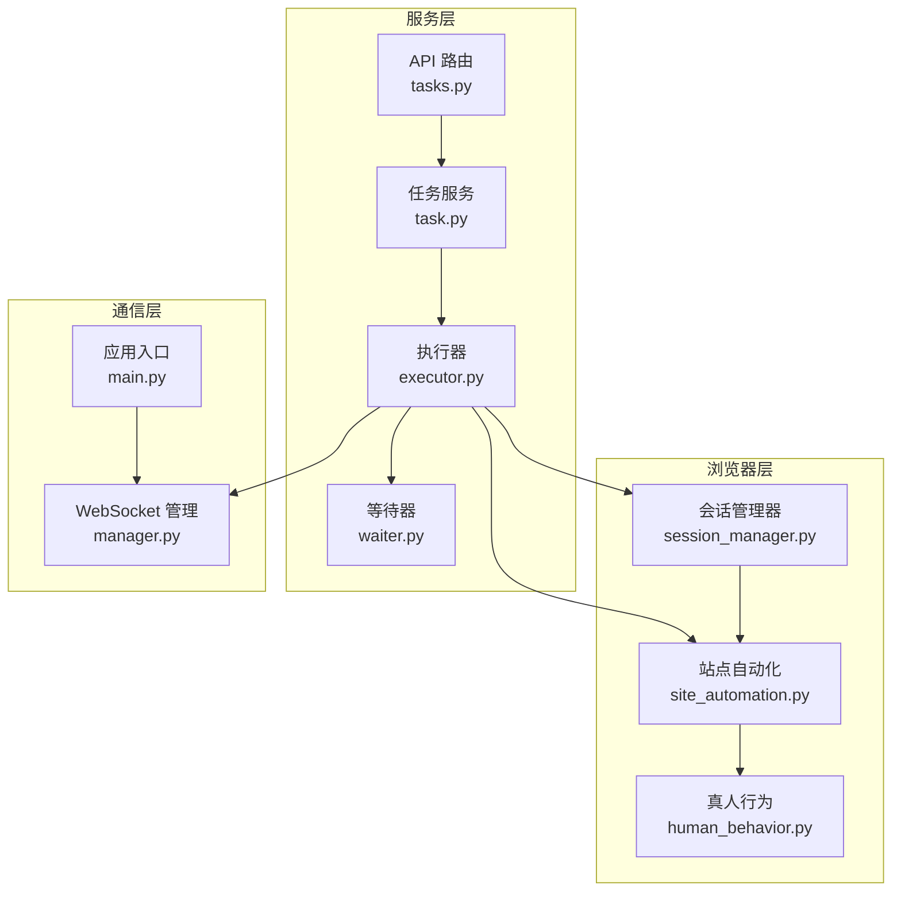
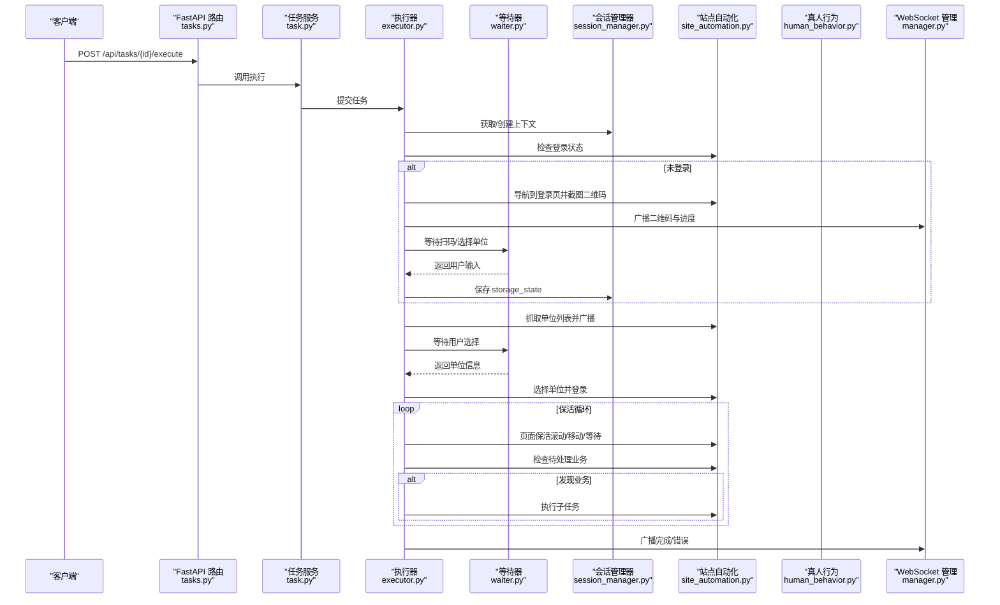
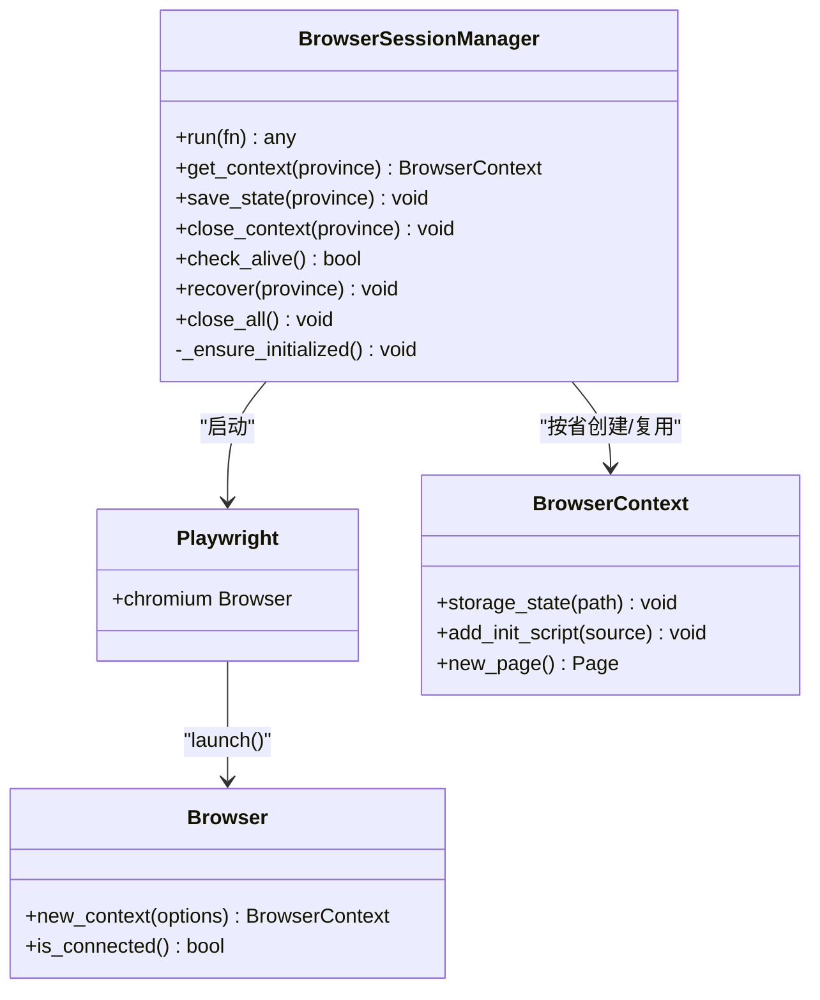
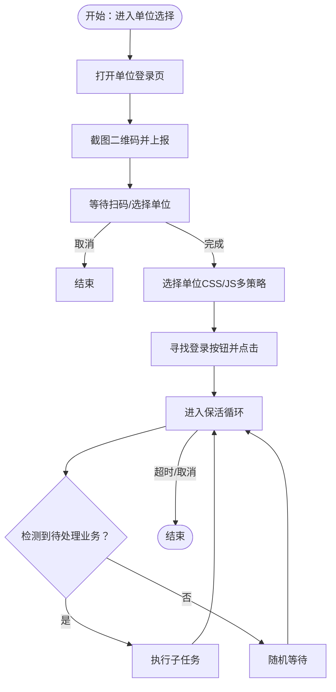
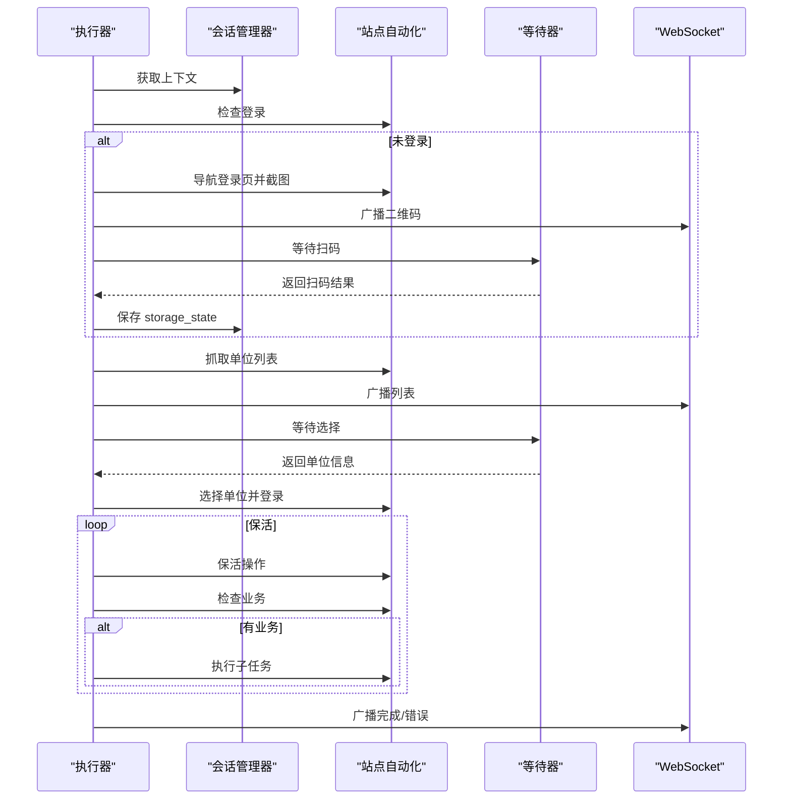
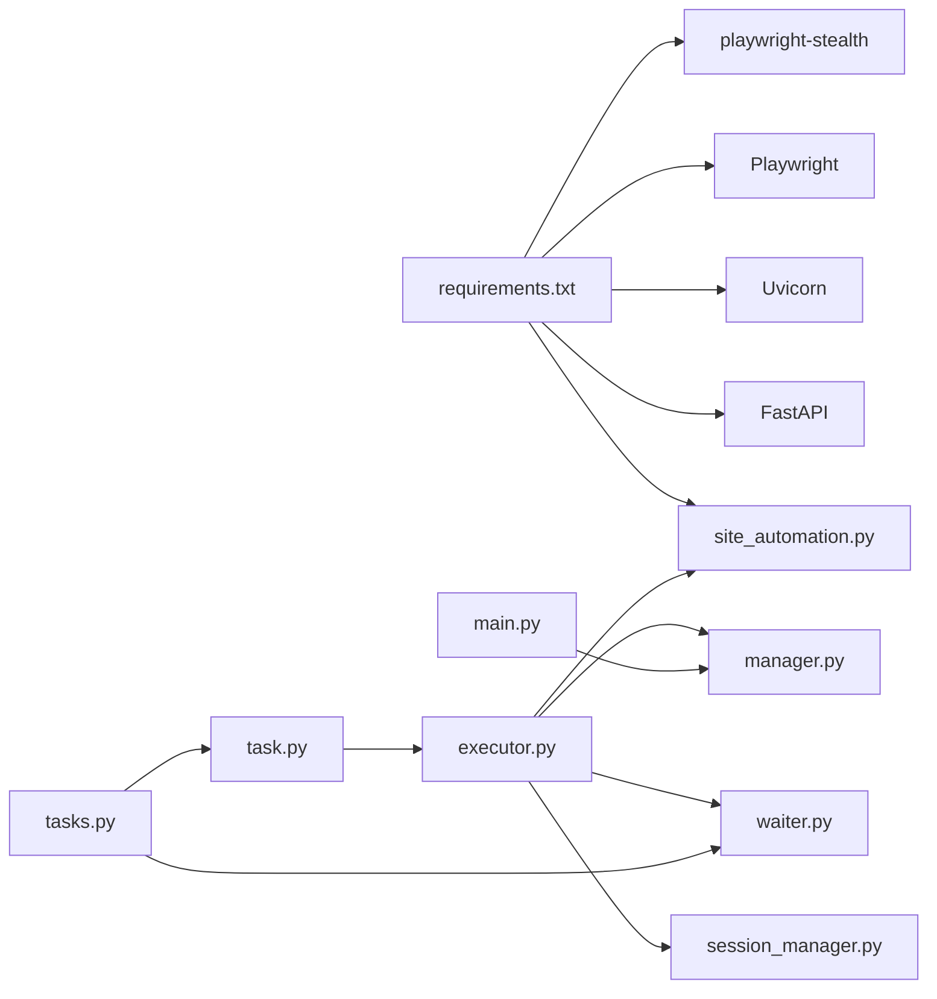

# 层2：Chromium 沙箱会话集群层

<cite>
**本文档引用的文件**
- [session_manager.py](file://CCC_RPA_API/app/browser/session_manager.py)
- [site_automation.py](file://CCC_RPA_API/app/browser/site_automation.py)
- [human_behavior.py](file://CCC_RPA_API/app/browser/human_behavior.py)
- [waiter.py](file://CCC_RPA_API/app/browser/waiter.py)
- [executor.py](file://CCC_RPA_API/app/services/executor.py)
- [tasks.py](file://CCC_RPA_API/app/api/tasks.py)
- [main.py](file://CCC_RPA_API/app/main.py)
- [manager.py](file://CCC_RPA_API/app/ws/manager.py)
- [config.py](file://CCC_RPA_API/app/config.py)
- [requirements.txt](file://CCC_RPA_API/requirements.txt)
- [docker-compose.yml](file://CCC-BrowserV4/docker-compose.yml)
</cite>

## 目录
1. [简介](#简介)
2. [项目结构](#项目结构)
3. [核心组件](#核心组件)
4. [架构总览](#架构总览)
5. [详细组件分析](#详细组件分析)
6. [依赖分析](#依赖分析)
7. [性能考虑](#性能考虑)
8. [故障排查指南](#故障排查指南)
9. [结论](#结论)
10. [附录](#附录)

## 简介
本文件面向商用级 AI 浏览器系统，聚焦“Chromium 沙箱会话集群层”的设计与实现，涵盖：
- 会话调度中心：基于 Playwright Core CDP 的轻量化封装与线程隔离执行
- 会话生命周期管理：状态机与恢复策略
- 会话创建与销毁：资源分配与回收
- 多维度强隔离：文件系统、网络、进程、浏览器存储与指纹伪装
- 会话调度算法与资源监控：线程池、事件等待与广播
- 异常处理与健壮性：断线恢复、超时控制、日志追踪
- 部署模式：K8s Pod 编排与单机进程沙箱

## 项目结构
本层围绕“浏览器会话”为中心，采用“服务层-浏览器层-通信层”三层组织：
- 服务层：任务编排、状态广播、用户交互等待
- 浏览器层：Playwright 会话管理、站点自动化、真人行为模拟
- 通信层：WebSocket 广播、API 控制接口

**图表来源**
- [tasks.py:1-76](file://CCC_RPA_API/app/api/tasks.py#L1-L76)
- [executor.py:1-319](file://CCC_RPA_API/app/services/executor.py#L1-L319)
- [session_manager.py:1-186](file://CCC_RPA_API/app/browser/session_manager.py#L1-L186)
- [site_automation.py:1-743](file://CCC_RPA_API/app/browser/site_automation.py#L1-L743)
- [human_behavior.py:1-86](file://CCC_RPA_API/app/browser/human_behavior.py#L1-L86)
- [waiter.py:1-84](file://CCC_RPA_API/app/browser/waiter.py#L1-L84)
- [manager.py:1-29](file://CCC_RPA_API/app/ws/manager.py#L1-L29)
- [main.py:1-127](file://CCC_RPA_API/app/main.py#L1-L127)

**章节来源**
- [main.py:1-127](file://CCC_RPA_API/app/main.py#L1-L127)
- [tasks.py:1-76](file://CCC_RPA_API/app/api/tasks.py#L1-L76)
- [executor.py:1-319](file://CCC_RPA_API/app/services/executor.py#L1-L319)
- [session_manager.py:1-186](file://CCC_RPA_API/app/browser/session_manager.py#L1-L186)
- [site_automation.py:1-743](file://CCC_RPA_API/app/browser/site_automation.py#L1-L743)
- [human_behavior.py:1-86](file://CCC_RPA_API/app/browser/human_behavior.py#L1-L86)
- [waiter.py:1-84](file://CCC_RPA_API/app/browser/waiter.py#L1-L84)
- [manager.py:1-29](file://CCC_RPA_API/app/ws/manager.py#L1-L29)

## 核心组件
- 会话管理器（BrowserSessionManager）
  - 单例化、线程安全的 Chromium 会话池，按“省份”维度隔离上下文
  - 专用工作线程承载 Playwright 同步 API，避免与 asyncio 冲突
  - storage_state 持久化，UA/Viewport 设置，navigator.webdriver 隐藏
- 站点自动化（SiteAutomation）
  - 针对特定站点的登录、扫码、单位选择、业务保活等流程封装
  - 多策略降级与异常检测，保证鲁棒性
- 真人行为（HumanBehavior）
  - 鼠标移动、点击、输入、滚动、等待等行为学模拟
- 等待器（ExecutionWaiter）
  - 基于 threading.Event 的用户交互阻塞/唤醒机制
- 执行器（executor）
  - 任务编排、步骤广播、断线恢复、保活循环、超时控制
- WebSocket 管理（ConnectionManager）
  - 广播执行进度、二维码、错误等事件给前端

**章节来源**
- [session_manager.py:10-186](file://CCC_RPA_API/app/browser/session_manager.py#L10-L186)
- [site_automation.py:16-743](file://CCC_RPA_API/app/browser/site_automation.py#L16-L743)
- [human_behavior.py:12-86](file://CCC_RPA_API/app/browser/human_behavior.py#L12-L86)
- [waiter.py:7-84](file://CCC_RPA_API/app/browser/waiter.py#L7-L84)
- [executor.py:78-315](file://CCC_RPA_API/app/services/executor.py#L78-L315)
- [manager.py:5-29](file://CCC_RPA_API/app/ws/manager.py#L5-L29)

## 架构总览
下图展示从 API 触发到浏览器执行再到前端反馈的完整链路。

**图表来源**
- [tasks.py:47-75](file://CCC_RPA_API/app/api/tasks.py#L47-L75)
- [executor.py:78-315](file://CCC_RPA_API/app/services/executor.py#L78-L315)
- [session_manager.py:98-144](file://CCC_RPA_API/app/browser/session_manager.py#L98-L144)
- [site_automation.py:38-145](file://CCC_RPA_API/app/browser/site_automation.py#L38-L145)
- [waiter.py:14-44](file://CCC_RPA_API/app/browser/waiter.py#L14-L44)
- [manager.py:17-26](file://CCC_RPA_API/app/ws/manager.py#L17-L26)

## 详细组件分析

### 会话管理器（BrowserSessionManager）
- 设计要点
  - 单实例、线程安全：使用锁与专用工作线程，确保 Playwright 同步 API 在固定线程执行
  - 按省份隔离：以 province 为键维护 BrowserContext 映射，支持 storage_state 持久化
  - 断线恢复：check_alive + recover，自动重建浏览器与上下文
- 生命周期
  - 初始化：首次调用时启动工作线程，launch Chromium，设置 UA/Viewport/反检测脚本
  - 上下文获取：若上下文失效则重建；按需加载 storage_state
  - 关闭：支持按上下文关闭、全部关闭、停止 Playwright
- 资源与隔离
  - 文件系统：storage_state 存储在 data/browser_states，按 province 分离
  - 进程隔离：专用线程承载 Chromium，避免主线程事件循环干扰
  - 浏览器存储：通过 storage_state 控制 Cookie/LocalStorage/IndexedDB 等
  - 指纹伪装：隐藏 navigator.webdriver，设置常见 UA/Viewport

**图表来源**
- [session_manager.py:10-186](file://CCC_RPA_API/app/browser/session_manager.py#L10-L186)

**章节来源**
- [session_manager.py:10-186](file://CCC_RPA_API/app/browser/session_manager.py#L10-L186)

### 站点自动化（SiteAutomation）
- 功能范围
  - 登录状态检查、单位登录页导航、二维码截图、扫码等待
  - 单位列表抓取（多选择器降级策略）、单位选择（多策略匹配+JS回退）
  - 页面保活（滚动/点击刷新/随机移动/等待）、业务检测与执行
- 异常与健壮性
  - 统一的“浏览器已关闭”错误识别，保障恢复流程
  - 多级降级与截图存盘，便于问题定位
- 与真人行为协作
  - 与 HumanBehavior 协同，提升反检测能力

**图表来源**
- [site_automation.py:61-540](file://CCC_RPA_API/app/browser/site_automation.py#L61-L540)
- [executor.py:196-267](file://CCC_RPA_API/app/services/executor.py#L196-L267)

**章节来源**
- [site_automation.py:16-743](file://CCC_RPA_API/app/browser/site_automation.py#L16-L743)

### 真人行为（HumanBehavior）
- 行为学模拟
  - human_click：鼠标移动到元素中心附近再点击，带随机步数与延迟
  - human_type：逐字符输入，字符间随机延迟
  - random_scroll：滚动到元素或随机滚动，多次小幅滚动
  - wait_like_human：随机等待时间
- 与站点自动化配合
  - 作为底层动作库，提升自动化稳定性与反检测效果

**章节来源**
- [human_behavior.py:12-86](file://CCC_RPA_API/app/browser/human_behavior.py#L12-L86)

### 等待器（ExecutionWaiter）
- 作用
  - 在独立线程中阻塞等待用户操作（扫码/选择单位），避免阻塞 Playwright 工作线程
  - 支持取消、检查信号、清理资源
- 与执行器协作
  - 执行器在关键节点调用 signal/cancel，等待器返回数据

**章节来源**
- [waiter.py:7-84](file://CCC_RPA_API/app/browser/waiter.py#L7-L84)
- [executor.py:72-76](file://CCC_RPA_API/app/services/executor.py#L72-L76)

### 执行器（executor）
- 任务编排
  - 初始化浏览器、检查登录、扫码/选择单位、抓取单位列表、选择单位、保活循环
  - 每一步通过 WebSocket 广播进度与结果
- 断线恢复
  - 定期检查浏览器存活，异常时自动 recover 并重开页面
- 超时与取消
  - 扫码等待、选择单位等待均有超时控制；支持用户取消

**图表来源**
- [executor.py:78-315](file://CCC_RPA_API/app/services/executor.py#L78-L315)
- [session_manager.py:98-144](file://CCC_RPA_API/app/browser/session_manager.py#L98-L144)
- [site_automation.py:38-540](file://CCC_RPA_API/app/browser/site_automation.py#L38-L540)
- [waiter.py:14-44](file://CCC_RPA_API/app/browser/waiter.py#L14-L44)
- [manager.py:17-26](file://CCC_RPA_API/app/ws/manager.py#L17-L26)

**章节来源**
- [executor.py:78-315](file://CCC_RPA_API/app/services/executor.py#L78-L315)

### 通信与 API（API、WebSocket、Main）
- API 路由
  - 任务 CRUD、执行、日志查询、扫码完成、选择单位、取消执行
- WebSocket
  - 广播执行进度、二维码、错误、任务状态更新
- 应用入口
  - 启动数据库、迁移字段、健康检查、关闭时清理浏览器

**章节来源**
- [tasks.py:1-76](file://CCC_RPA_API/app/api/tasks.py#L1-L76)
- [manager.py:1-29](file://CCC_RPA_API/app/ws/manager.py#L1-L29)
- [main.py:1-127](file://CCC_RPA_API/app/main.py#L1-L127)

## 依赖分析
- 外部依赖
  - FastAPI/uvicorn：Web 服务与异步运行时
  - SQLAlchemy：ORM 与数据库连接
  - Playwright：Chromium 自动化与 CDP
  - playwright-stealth：指纹伪装
- 内部模块耦合
  - 服务层依赖浏览器层与通信层
  - 执行器依赖会话管理器与站点自动化
  - API 路由依赖任务服务与等待器

**图表来源**
- [requirements.txt:1-11](file://CCC_RPA_API/requirements.txt#L1-L11)
- [tasks.py:1-76](file://CCC_RPA_API/app/api/tasks.py#L1-L76)
- [executor.py:1-319](file://CCC_RPA_API/app/services/executor.py#L1-L319)
- [session_manager.py:1-186](file://CCC_RPA_API/app/browser/session_manager.py#L1-L186)
- [site_automation.py:1-743](file://CCC_RPA_API/app/browser/site_automation.py#L1-L743)
- [waiter.py:1-84](file://CCC_RPA_API/app/browser/waiter.py#L1-L84)
- [manager.py:1-29](file://CCC_RPA_API/app/ws/manager.py#L1-L29)
- [main.py:1-127](file://CCC_RPA_API/app/main.py#L1-L127)

**章节来源**
- [requirements.txt:1-11](file://CCC_RPA_API/requirements.txt#L1-L11)

## 性能考虑
- 线程模型
  - 专用 Playwright 工作线程避免与 asyncio 事件循环竞争，降低锁争用
  - 独立等待线程池避免阻塞浏览器线程
- 资源复用
  - 按省份复用 BrowserContext，减少启动成本
  - storage_state 持久化减少重复登录开销
- I/O 与网络
  - 二维码截图与页面截图仅在必要时生成，避免频繁 IO
  - 等待与保活采用分段等待，便于快速响应取消
- 监控与可观测性
  - WebSocket 广播执行进度，便于前端实时反馈
  - 截图与日志记录辅助问题定位

## 故障排查指南
- 浏览器异常/断线
  - 现象：页面报错“已关闭”
  - 处理：执行器内部会检测并调用 recover，重建浏览器与上下文
  - 建议：检查 Chromium 启动参数与系统资源
- 扫码/选择超时
  - 现象：等待超时或用户取消
  - 处理：执行器抛出超时异常并回滚状态
  - 建议：延长等待时间或优化前端交互
- 选择单位失败
  - 现象：单位选择 CSS/JS 均未命中
  - 处理：系统记录失败截图，建议人工介入
  - 建议：检查页面结构变化与选择器策略
- 数据库迁移
  - 现象：字段缺失导致初始化失败
  - 处理：应用启动时自动迁移字段
  - 建议：确认数据库权限与字符集配置

**章节来源**
- [executor.py:42-70](file://CCC_RPA_API/app/services/executor.py#L42-L70)
- [site_automation.py:10-14](file://CCC_RPA_API/app/browser/site_automation.py#L10-L14)
- [main.py:41-86](file://CCC_RPA_API/app/main.py#L41-L86)

## 结论
本层通过“专用线程 + 上下文隔离 + 断线恢复 + 多策略降级”的组合，构建了稳定可靠的 Chromium 沙箱会话集群。结合 WebSocket 广播与 API 控制，实现了从任务编排到页面执行的全链路可观测与可控。在商用场景下，建议进一步引入：
- 会话池容量与回收策略的动态调节
- 多实例横向扩展与负载均衡
- 更细粒度的资源监控与告警
- K8s 资源配额与亲和性调度

## 附录

### 部署与环境
- 单机部署
  - 使用 docker-compose 启动 MySQL，应用通过 requirements.txt 安装依赖
- K8s 编排建议
  - 将应用与 MySQL 分别部署为 Deployment/StatefulSet
  - 为浏览器进程设置合适的 CPU/内存请求与限制
  - 使用 ConfigMap/Secret 管理数据库连接与环境变量

**章节来源**
- [docker-compose.yml:1-21](file://CCC-BrowserV4/docker-compose.yml#L1-L21)
- [requirements.txt:1-11](file://CCC_RPA_API/requirements.txt#L1-L11)
- [config.py:6-22](file://CCC_RPA_API/app/config.py#L6-L22)