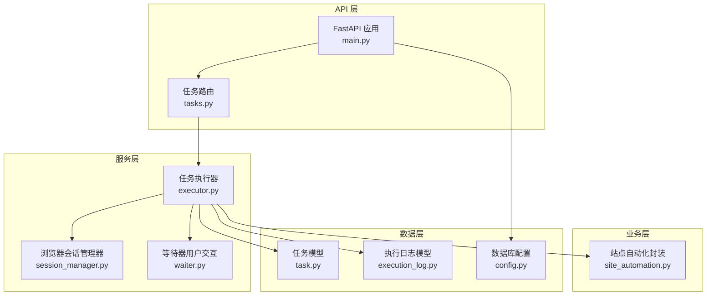
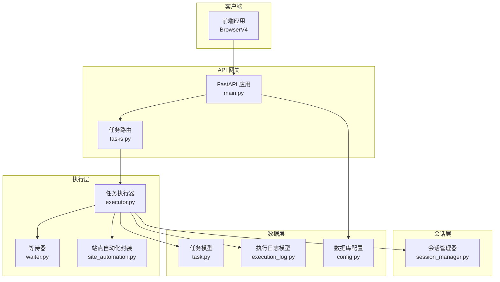
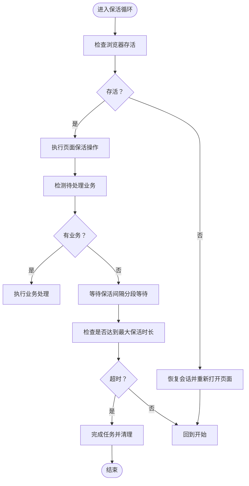
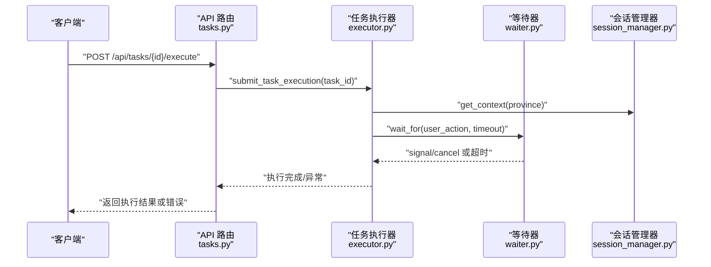
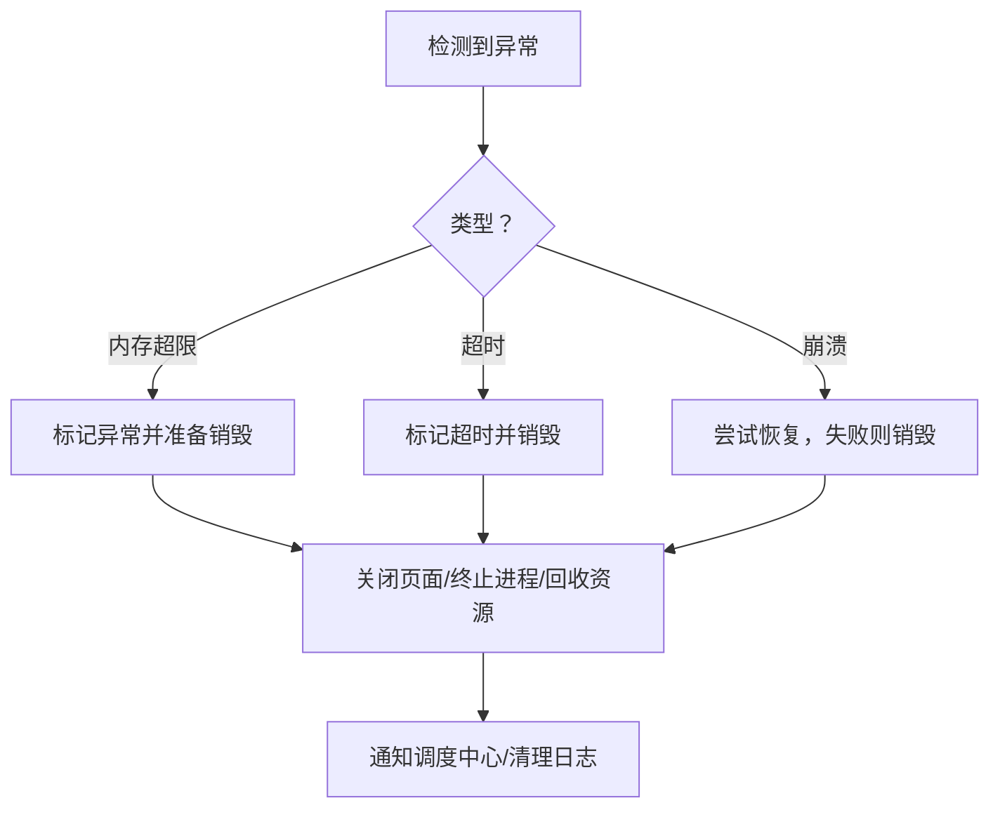
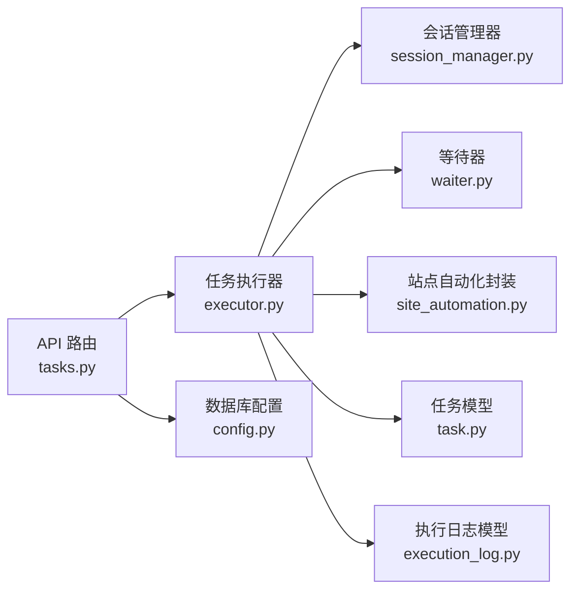

# 资源控制与配额管理

<cite>
**本文引用的文件**
- [main.py](file://CCC_RPA_API/app/main.py)
- [session_manager.py](file://CCC_RPA_API/app/browser/session_manager.py)
- [executor.py](file://CCC_RPA_API/app/services/executor.py)
- [site_automation.py](file://CCC_RPA_API/app/browser/site_automation.py)
- [waiter.py](file://CCC_RPA_API/app/browser/waiter.py)
- [tasks.py](file://CCC_RPA_API/app/api/tasks.py)
- [task.py](file://CCC_RPA_API/app/models/task.py)
- [execution_log.py](file://CCC_RPA_API/app/models/execution_log.py)
- [config.py](file://CCC_RPA_API/app/config.py)
- [project.md](file://project.md)
</cite>

## 目录
1. [简介](#简介)
2. [项目结构](#项目结构)
3. [核心组件](#核心组件)
4. [架构总览](#架构总览)
5. [详细组件分析](#详细组件分析)
6. [依赖分析](#依赖分析)
7. [性能考量](#性能考量)
8. [故障排查指南](#故障排查指南)
9. [结论](#结论)
10. [附录](#附录)

## 简介
本技术文档聚焦“资源控制与配额管理”子系统，围绕单会话资源硬上限配置（内存 1-2Gi、CPU 单核上限、最大打开标签 10 个、会话最长存活 30min-24h）、进程/Pod 资源监控与阈值检测、集群全局并发会话上限管控策略、以及资源超限异常处理流程进行系统化梳理。文档以代码为依据，辅以架构图与时序图，帮助读者快速理解实现要点与落地方案。

## 项目结构
本仓库包含前端、后端与 Rust 原生桥接层。与资源控制与配额管理直接相关的后端模块主要位于 CCC_RPA_API，涵盖：
- API 层：FastAPI 路由与任务执行接口
- 服务层：任务执行器、浏览器会话管理器
- 模型层：任务与执行日志数据模型
- 配置层：数据库连接配置

图表来源
- [main.py:1-127](file://CCC_RPA_API/app/main.py#L1-L127)
- [tasks.py:1-76](file://CCC_RPA_API/app/api/tasks.py#L1-L76)
- [executor.py:1-319](file://CCC_RPA_API/app/services/executor.py#L1-L319)
- [session_manager.py:1-186](file://CCC_RPA_API/app/browser/session_manager.py#L1-L186)
- [waiter.py:1-84](file://CCC_RPA_API/app/browser/waiter.py#L1-L84)
- [site_automation.py:1-743](file://CCC_RPA_API/app/browser/site_automation.py#L1-L743)
- [task.py:1-25](file://CCC_RPA_API/app/models/task.py#L1-L25)
- [execution_log.py:1-17](file://CCC_RPA_API/app/models/execution_log.py#L1-L17)
- [config.py:1-22](file://CCC_RPA_API/app/config.py#L1-L22)

章节来源
- [main.py:1-127](file://CCC_RPA_API/app/main.py#L1-L127)
- [tasks.py:1-76](file://CCC_RPA_API/app/api/tasks.py#L1-L76)

## 核心组件
- 浏览器会话管理器：负责 Playwright 工作线程的启动、上下文创建与持久化、存活检查与恢复。
- 任务执行器：封装任务执行全流程，包含扫码登录、单位选择、保活循环、业务处理与收尾。
- 等待器：基于线程事件实现的用户交互阻塞/唤醒机制，支撑扫码与单位选择阶段。
- 站点自动化封装：对 122.gov.cn 的登录、扫码、单位列表抓取、单位选择、保活与业务检测等动作进行封装。
- API 路由：提供任务执行、扫码完成、单位选择、取消执行等接口，并与等待器协作。
- 数据模型：任务与执行日志模型，记录任务状态、执行结果与时间戳。

章节来源
- [session_manager.py:10-186](file://CCC_RPA_API/app/browser/session_manager.py#L10-L186)
- [executor.py:1-319](file://CCC_RPA_API/app/services/executor.py#L1-L319)
- [waiter.py:7-84](file://CCC_RPA_API/app/browser/waiter.py#L7-L84)
- [site_automation.py:16-743](file://CCC_RPA_API/app/browser/site_automation.py#L16-L743)
- [tasks.py:13-76](file://CCC_RPA_API/app/api/tasks.py#L13-L76)
- [task.py:8-25](file://CCC_RPA_API/app/models/task.py#L8-L25)
- [execution_log.py:7-17](file://CCC_RPA_API/app/models/execution_log.py#L7-L17)

## 架构总览
下图展示了资源控制与配额管理在系统中的位置与交互关系。注意：本仓库后端代码未直接体现 Pod 级别的资源限制与队列排队逻辑，这些能力在项目文档中明确为“调度中心”的职责范畴。

图表来源
- [main.py:1-127](file://CCC_RPA_API/app/main.py#L1-L127)
- [tasks.py:1-76](file://CCC_RPA_API/app/api/tasks.py#L1-L76)
- [executor.py:1-319](file://CCC_RPA_API/app/services/executor.py#L1-L319)
- [session_manager.py:1-186](file://CCC_RPA_API/app/browser/session_manager.py#L1-L186)
- [waiter.py:1-84](file://CCC_RPA_API/app/browser/waiter.py#L1-L84)
- [site_automation.py:1-743](file://CCC_RPA_API/app/browser/site_automation.py#L1-L743)
- [task.py:1-25](file://CCC_RPA_API/app/models/task.py#L1-L25)
- [execution_log.py:1-17](file://CCC_RPA_API/app/models/execution_log.py#L1-L17)
- [config.py:1-22](file://CCC_RPA_API/app/config.py#L1-L22)

## 详细组件分析

### 单会话资源硬上限配置
- 内存上限：1-2Gi（项目文档明确为“单会话可配置硬上限：内存 1/2Gi、CPU 单核上限、最大打开标签 10 个、会话最长存活 30min/24h”）
- CPU 单核上限：项目文档明确为“CPU 单核上限”
- 最大打开标签：项目文档明确为“最大打开标签 10 个”
- 会话最长存活：项目文档明确为“会话最长存活 30min/24h”

上述硬上限在本仓库后端代码中未直接体现为具体的数值常量或配置项。它们属于“调度中心”在 Pod/进程层面的资源注入与限制职责，确保单会话资源不越界。

章节来源
- [project.md:1009-1016](file://project.md#L1009-L1016)

### 进程与 Pod 资源监控与阈值检测
- 进程存活检测：会话管理器提供浏览器存活检查与恢复能力，保障任务执行过程中的稳定性。
- 保活与超时控制：执行器在保活循环中周期性执行页面保活操作，并设置最大保活时长（项目文档为“最大保活时长（小时）”）。
- 资源阈值检测：项目文档指出“进程/Pod 资源超出阈值标记异常，超时强制销毁会话”，但本仓库后端未直接实现具体的 CPU/内存阈值检测逻辑。

图表来源
- [executor.py:196-267](file://CCC_RPA_API/app/services/executor.py#L196-L267)
- [site_automation.py:614-680](file://CCC_RPA_API/app/browser/site_automation.py#L614-L680)

章节来源
- [session_manager.py:147-170](file://CCC_RPA_API/app/browser/session_manager.py#L147-L170)
- [executor.py:196-267](file://CCC_RPA_API/app/services/executor.py#L196-L267)
- [site_automation.py:614-680](file://CCC_RPA_API/app/browser/site_automation.py#L614-L680)

### 集群全局并发会话上限管控策略
- 会话创建前置校验：项目文档要求“创建前置校验：租户剩余并发配额、代理 IP 可用性、集群剩余资源”，这属于调度中心的职责。
- 排队与拒绝策略：项目文档指出“集群全局并发会话上限管控，达到上限拒绝新会话创建请求并返回标准化错误”，但本仓库后端未实现排队与拒绝逻辑。
- 标准化错误码：项目文档要求“统一标准化错误码返回”，本仓库后端在任务执行接口中通过 HTTP 异常返回错误信息，但未体现统一错误码体系。

图表来源
- [tasks.py:47-52](file://CCC_RPA_API/app/api/tasks.py#L47-L52)
- [executor.py:317-319](file://CCC_RPA_API/app/services/executor.py#L317-L319)
- [waiter.py:14-32](file://CCC_RPA_API/app/browser/waiter.py#L14-L32)
- [session_manager.py:99-126](file://CCC_RPA_API/app/browser/session_manager.py#L99-L126)

章节来源
- [tasks.py:47-76](file://CCC_RPA_API/app/api/tasks.py#L47-L76)
- [executor.py:317-319](file://CCC_RPA_API/app/services/executor.py#L317-L319)
- [waiter.py:7-84](file://CCC_RPA_API/app/browser/waiter.py#L7-L84)
- [session_manager.py:10-186](file://CCC_RPA_API/app/browser/session_manager.py#L10-L186)

### 资源超限异常处理流程
- 自动标记异常：项目文档指出“进程/Pod 资源超出阈值标记异常”，但本仓库后端未实现具体的阈值检测与标记逻辑。
- 超时强制销毁：项目文档指出“会话达到最大存活时长、内存超出硬阈值、页面连续崩溃 3 次”时销毁会话；本仓库后端实现了最大保活时长与浏览器存活检查，但未体现内存阈值触发的销毁。
- 资源回收清理：项目文档要求“销毁执行逻辑：关闭所有页面标签、终止 Chromium 进程、归还代理 IP 至代理池、释放 CDP 端口、全量删除 UserData 目录”，本仓库后端在会话恢复与关闭时具备部分清理能力，但未覆盖“内存超限销毁”的完整流程。

图表来源
- [project.md:985-991](file://project.md#L985-L991)
- [session_manager.py:157-186](file://CCC_RPA_API/app/browser/session_manager.py#L157-L186)
- [executor.py:42-69](file://CCC_RPA_API/app/services/executor.py#L42-L69)

章节来源
- [project.md:985-991](file://project.md#L985-L991)
- [session_manager.py:157-186](file://CCC_RPA_API/app/browser/session_manager.py#L157-L186)
- [executor.py:42-69](file://CCC_RPA_API/app/services/executor.py#L42-L69)

## 依赖分析
- 组件耦合关系
  - API 路由依赖任务执行器与等待器，任务执行器依赖会话管理器与站点自动化封装。
  - 数据模型贯穿执行器与 API 路由，用于任务状态与执行日志的持久化。
- 外部依赖
  - 数据库连接通过配置模块提供，任务执行器与 API 路由均依赖 SQLAlchemy 会话。
  - WebSocket 广播依赖主事件循环，确保工作线程中安全广播。

图表来源
- [tasks.py:1-76](file://CCC_RPA_API/app/api/tasks.py#L1-L76)
- [executor.py:1-319](file://CCC_RPA_API/app/services/executor.py#L1-L319)
- [session_manager.py:1-186](file://CCC_RPA_API/app/browser/session_manager.py#L1-L186)
- [waiter.py:1-84](file://CCC_RPA_API/app/browser/waiter.py#L1-L84)
- [site_automation.py:1-743](file://CCC_RPA_API/app/browser/site_automation.py#L1-L743)
- [task.py:1-25](file://CCC_RPA_API/app/models/task.py#L1-L25)
- [execution_log.py:1-17](file://CCC_RPA_API/app/models/execution_log.py#L1-L17)
- [config.py:1-22](file://CCC_RPA_API/app/config.py#L1-L22)

章节来源
- [tasks.py:1-76](file://CCC_RPA_API/app/api/tasks.py#L1-L76)
- [executor.py:1-319](file://CCC_RPA_API/app/services/executor.py#L1-L319)
- [session_manager.py:1-186](file://CCC_RPA_API/app/browser/session_manager.py#L1-L186)
- [waiter.py:1-84](file://CCC_RPA_API/app/browser/waiter.py#L1-L84)
- [site_automation.py:1-743](file://CCC_RPA_API/app/browser/site_automation.py#L1-L743)
- [task.py:1-25](file://CCC_RPA_API/app/models/task.py#L1-L25)
- [execution_log.py:1-17](file://CCC_RPA_API/app/models/execution_log.py#L1-L17)
- [config.py:1-22](file://CCC_RPA_API/app/config.py#L1-L22)

## 性能考量
- 线程池与阻塞等待：任务执行器使用线程池执行阻塞等待，避免阻塞 Playwright 工作线程。
- 保活间隔与分段等待：保活循环采用分段等待，便于及时响应取消信号，降低资源占用。
- 超时控制：扫码与单位选择阶段设置了超时时间，防止长时间阻塞。

章节来源
- [executor.py:18-19](file://CCC_RPA_API/app/services/executor.py#L18-L19)
- [executor.py:72-75](file://CCC_RPA_API/app/services/executor.py#L72-L75)
- [executor.py:253-266](file://CCC_RPA_API/app/services/executor.py#L253-L266)

## 故障排查指南
- 浏览器异常与恢复
  - 现象：浏览器断连或页面异常导致任务中断。
  - 处理：执行器在关键阶段检查浏览器存活，若异常则触发恢复流程，重新创建上下文与页面。
- 扫码与单位选择超时
  - 现象：扫码等待或单位选择等待超时。
  - 处理：等待器在超时后抛出异常，执行器捕获并记录错误，广播执行错误消息。
- 任务执行异常
  - 现象：任务执行过程中发生异常。
  - 处理：执行器捕获异常，更新任务状态与执行日志，广播错误消息，并清理等待器资源。

章节来源
- [executor.py:42-69](file://CCC_RPA_API/app/services/executor.py#L42-L69)
- [executor.py:286-314](file://CCC_RPA_API/app/services/executor.py#L286-L314)
- [waiter.py:14-32](file://CCC_RPA_API/app/browser/waiter.py#L14-L32)

## 结论
- 本仓库后端代码体现了“单会话资源硬上限”的概念与“保活循环/超时控制”的实现，但未直接实现“内存阈值检测”“全局并发会话上限排队与拒绝”“标准化错误码返回”等细节。
- “调度中心”负责 Pod/进程级别的资源注入、队列与拒绝策略、异常标记与销毁等职责，本仓库后端未包含相应实现。
- 建议在调度中心补充资源阈值检测、全局并发配额与排队、标准化错误码返回等能力，以完善资源控制与配额管理体系。

## 附录
- 术语说明
  - 会话：指单个浏览器上下文，承载一次任务执行。
  - 保活：在页面上执行轻量级随机操作，维持会话活跃状态。
  - 调度中心：负责会话生命周期管理、资源分配与销毁的中心化组件（项目文档定义）。