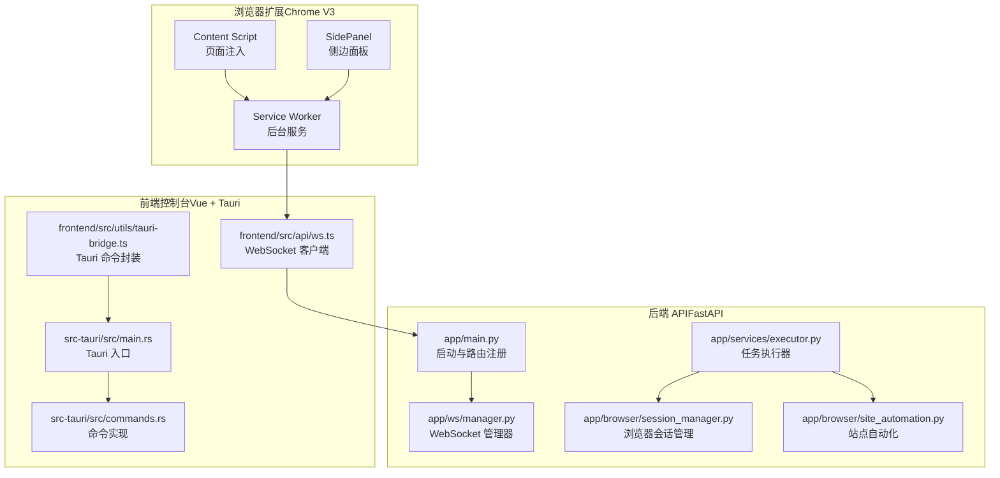
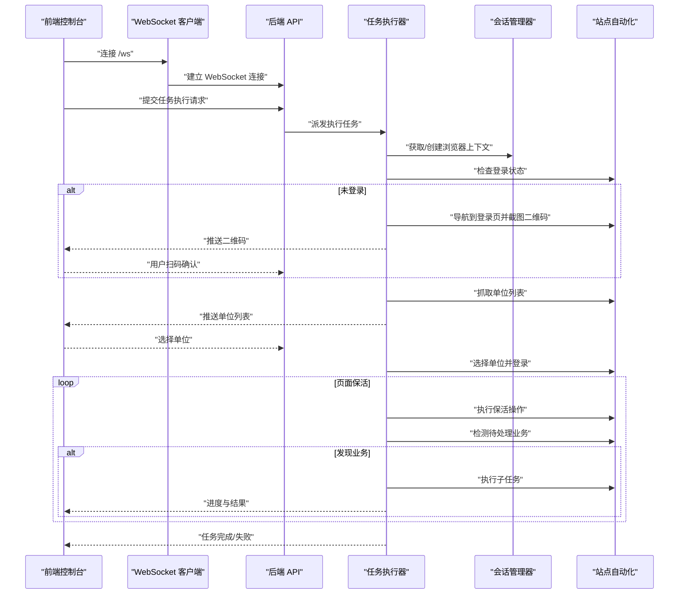
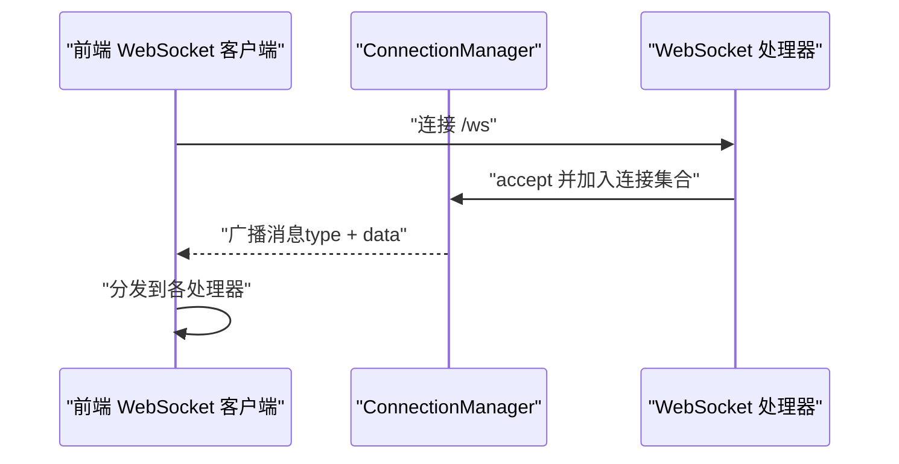
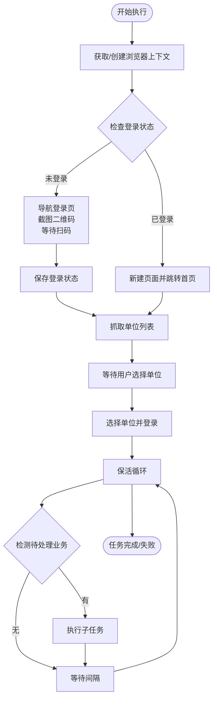
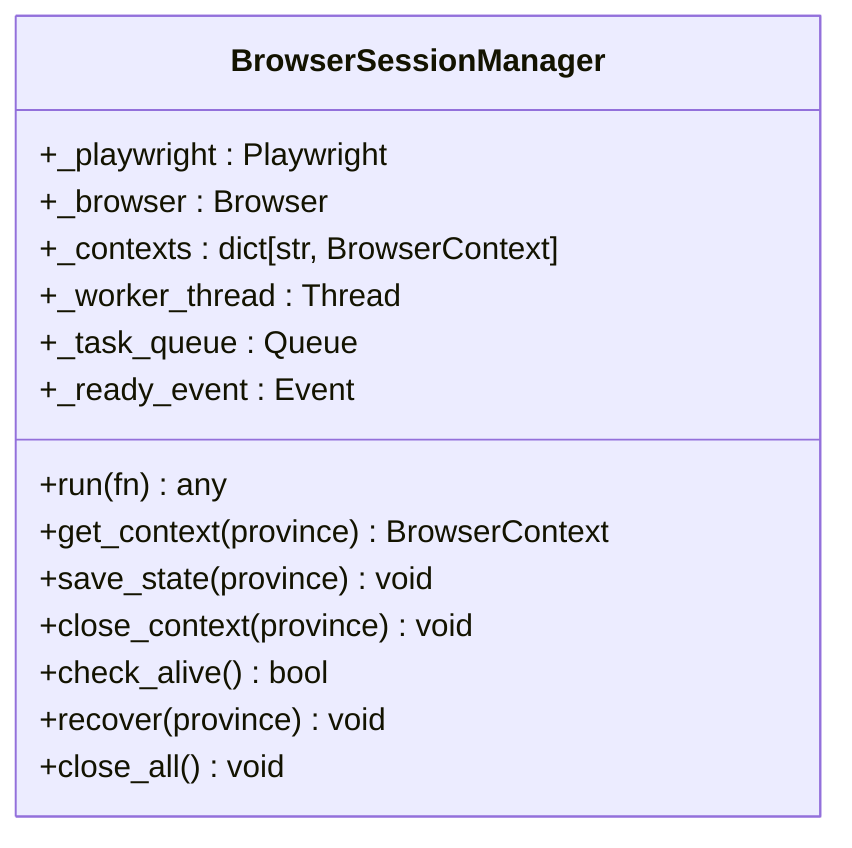
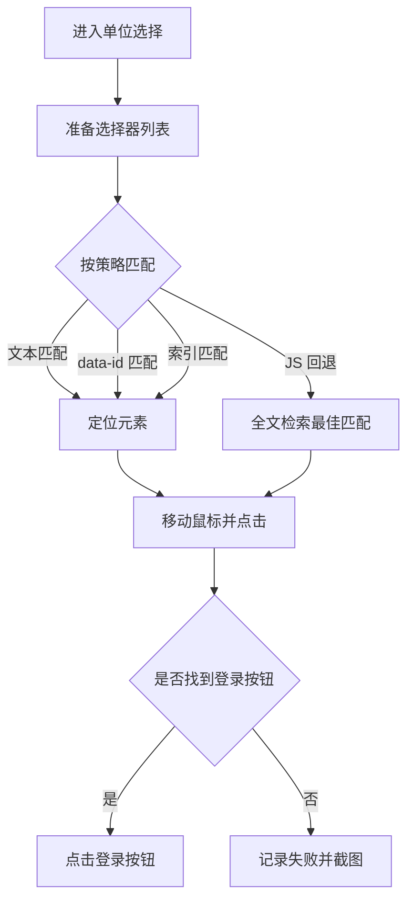
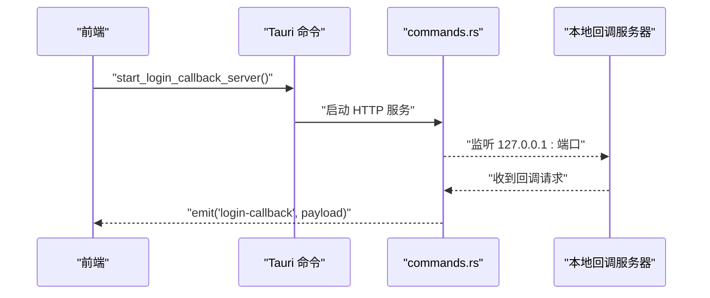
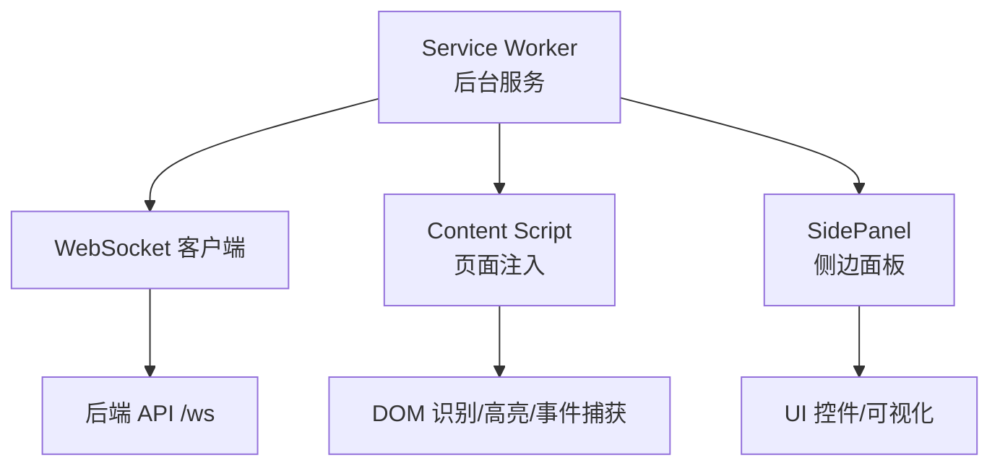
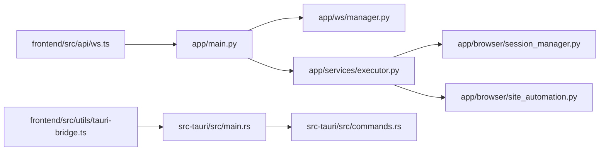

# Chrome V3 可视化扩展系统

<cite>
**本文档引用的文件**
- [app/main.py](file://CCC_RPA_API/app/main.py)
- [app/ws/manager.py](file://CCC_RPA_API/app/ws/manager.py)
- [app/browser/session_manager.py](file://CCC_RPA_API/app/browser/session_manager.py)
- [app/browser/site_automation.py](file://CCC_RPA_API/app/browser/site_automation.py)
- [app/services/executor.py](file://CCC_RPA_API/app/services/executor.py)
- [frontend/src/api/ws.ts](file://CCC-BrowserV4/frontend/src/api/ws.ts)
- [frontend/src/utils/tauri-bridge.ts](file://CCC-BrowserV4/frontend/src/utils/tauri-bridge.ts)
- [src-tauri/src/main.rs](file://CCC-BrowserV4/src-tauri/src/main.rs)
- [src-tauri/src/commands.rs](file://CCC-BrowserV4/src-tauri/src/commands.rs)
</cite>

## 目录
1. [简介](#简介)
2. [项目结构](#项目结构)
3. [核心组件](#核心组件)
4. [架构总览](#架构总览)
5. [详细组件分析](#详细组件分析)
6. [依赖分析](#依赖分析)
7. [性能考虑](#性能考虑)
8. [故障排查指南](#故障排查指南)
9. [结论](#结论)
10. [附录](#附录)

## 简介
本项目是一个面向 Chrome V3 的可视化扩展系统，围绕“调度网关 + 自动化引擎 + 前端控制台”的三层架构设计，实现以下能力：
- Service Worker 后台服务：维护 WebSocket 连接、广播执行进度与事件、协调任务生命周期。
- Content Script 页面注入：在目标站点注入脚本以识别 DOM、高亮元素、捕获交互事件。
- SidePanel 侧边面板：基于 Vue + Tauri 的桌面应用，提供设备管理、登录回调、任务执行控制与可视化展示。
- 与调度网关的 WebSocket 通信：定义消息类型与事件流，支撑扫码登录、单位选择、业务保活等流程。
- 页面自动化：登录态检查、二维码截图、单位列表抓取、单位选择、页面保活与业务触发。
- 安全与合规：设备标识持久化、会话令牌生成、登录回调安全通道、Playwright 会话状态持久化。

## 项目结构
系统分为三个主要部分：
- 后端 API（FastAPI）：提供 WebSocket 服务、任务执行编排、浏览器会话管理与站点自动化。
- 前端控制台（Vue + Tauri）：通过 WebSocket 与后端通信，提供设备管理、登录回调、任务执行界面。
- 浏览器扩展（Chrome Extension V3）：在目标页面注入脚本，实现 DOM 识别、元素高亮、事件捕获与广告拦截等能力。

图表来源
- [app/main.py:12-28](file://CCC_RPA_API/app/main.py#L12-L28)
- [app/ws/manager.py:5-28](file://CCC_RPA_API/app/ws/manager.py#L5-L28)
- [app/services/executor.py:17-33](file://CCC_RPA_API/app/services/executor.py#L17-L33)
- [app/browser/session_manager.py:10-186](file://CCC_RPA_API/app/browser/session_manager.py#L10-L186)
- [app/browser/site_automation.py:16-743](file://CCC_RPA_API/app/browser/site_automation.py#L16-L743)
- [frontend/src/api/ws.ts:8-88](file://CCC-BrowserV4/frontend/src/api/ws.ts#L8-L88)
- [frontend/src/utils/tauri-bridge.ts:6-33](file://CCC-BrowserV4/frontend/src/utils/tauri-bridge.ts#L6-L33)
- [src-tauri/src/main.rs:7-28](file://CCC-BrowserV4/src-tauri/src/main.rs#L7-L28)
- [src-tauri/src/commands.rs:10-92](file://CCC-BrowserV4/src-tauri/src/commands.rs#L10-L92)

章节来源
- [app/main.py:12-28](file://CCC_RPA_API/app/main.py#L12-L28)
- [frontend/src/api/ws.ts:8-88](file://CCC-BrowserV4/frontend/src/api/ws.ts#L8-L88)
- [src-tauri/src/main.rs:7-28](file://CCC-BrowserV4/src-tauri/src/main.rs#L7-L28)

## 核心组件
- WebSocket 通信层：后端通过 FastAPI 提供 /ws 端点，前端通过 WebSocket 客户端订阅消息；消息类型包括执行进度、二维码、错误与任务状态更新。
- 任务执行器：在独立线程池中编排 Playwright 会话，执行登录检查、扫码登录、单位列表抓取、单位选择、页面保活与业务触发。
- 浏览器会话管理：按省份隔离 Playwright 上下文，持久化 storage_state，确保跨进程/重启后的登录状态延续。
- 站点自动化：针对特定站点的登录流程、二维码识别、单位列表提取、单位选择与保活策略。
- 前端控制台：通过 Tauri 暴露设备与登录回调能力，WebSocket 订阅后端推送的消息，驱动 UI 更新。

章节来源
- [app/ws/manager.py:5-28](file://CCC_RPA_API/app/ws/manager.py#L5-L28)
- [app/services/executor.py:17-33](file://CCC_RPA_API/app/services/executor.py#L17-L33)
- [app/browser/session_manager.py:10-186](file://CCC_RPA_API/app/browser/session_manager.py#L10-L186)
- [app/browser/site_automation.py:16-743](file://CCC_RPA_API/app/browser/site_automation.py#L16-L743)
- [frontend/src/api/ws.ts:8-88](file://CCC-BrowserV4/frontend/src/api/ws.ts#L8-L88)
- [frontend/src/utils/tauri-bridge.ts:6-33](file://CCC-BrowserV4/frontend/src/utils/tauri-bridge.ts#L6-L33)
- [src-tauri/src/commands.rs:10-92](file://CCC-BrowserV4/src-tauri/src/commands.rs#L10-L92)

## 架构总览
系统采用“后端编排 + 前端控制 + 扩展注入”的分层设计。后端负责任务生命周期与浏览器自动化，前端负责设备与登录回调，扩展负责页面级 DOM 识别与交互。

图表来源
- [app/main.py:119-127](file://CCC_RPA_API/app/main.py#L119-L127)
- [app/ws/manager.py:17-26](file://CCC_RPA_API/app/ws/manager.py#L17-L26)
- [app/services/executor.py:78-315](file://CCC_RPA_API/app/services/executor.py#L78-L315)
- [app/browser/session_manager.py:98-126](file://CCC_RPA_API/app/browser/session_manager.py#L98-L126)
- [app/browser/site_automation.py:38-58](file://CCC_RPA_API/app/browser/site_automation.py#L38-L58)
- [frontend/src/api/ws.ts:20-56](file://CCC-BrowserV4/frontend/src/api/ws.ts#L20-L56)

## 详细组件分析

### WebSocket 通信协议与消息格式
- 连接地址：根据页面协议自动选择 ws/wss，连接 /ws。
- 消息结构：包含 type 与 data 字段，后端通过 ConnectionManager 广播。
- 典型消息类型：
  - execution_progress：执行进度更新（步骤、消息）。
  - qr_code：推送二维码（base64 数据）。
  - login_result：登录结果。
  - company_list：推送单位列表。
  - execution_error：执行错误。
  - task_status_update：任务状态更新。

图表来源
- [app/ws/manager.py:10-26](file://CCC_RPA_API/app/ws/manager.py#L10-L26)
- [app/main.py:119-127](file://CCC_RPA_API/app/main.py#L119-L127)
- [frontend/src/api/ws.ts:35-41](file://CCC-BrowserV4/frontend/src/api/ws.ts#L35-L41)

章节来源
- [app/ws/manager.py:5-28](file://CCC_RPA_API/app/ws/manager.py#L5-L28)
- [app/main.py:119-127](file://CCC_RPA_API/app/main.py#L119-L127)
- [frontend/src/api/ws.ts:8-88](file://CCC-BrowserV4/frontend/src/api/ws.ts#L8-L88)

### 任务执行器（Executor）
- 线程模型：使用线程池执行任务逻辑，阻塞等待（扫码、单位选择）在独立线程中执行，避免阻塞 Playwright 工作线程。
- 生命周期：
  - 初始化浏览器上下文（按省份隔离）。
  - 检查登录状态，未登录则推送二维码并等待用户扫码。
  - 抓取单位列表并推送至前端，等待用户选择。
  - 选择单位并登录，进入保活循环，检测待处理业务并执行。
  - 统一记录日志与任务状态，广播完成/失败事件。
- 恢复机制：检测浏览器存活，异常时恢复会话并重置页面。

图表来源
- [app/services/executor.py:78-315](file://CCC_RPA_API/app/services/executor.py#L78-L315)
- [app/browser/session_manager.py:98-126](file://CCC_RPA_API/app/browser/session_manager.py#L98-L126)
- [app/browser/site_automation.py:38-58](file://CCC_RPA_API/app/browser/site_automation.py#L38-L58)

章节来源
- [app/services/executor.py:17-33](file://CCC_RPA_API/app/services/executor.py#L17-L33)
- [app/services/executor.py:78-315](file://CCC_RPA_API/app/services/executor.py#L78-L315)

### 浏览器会话管理（BrowserSessionManager）
- 专用工作线程：启动 Playwright 与 Chromium，所有 Playwright 操作通过队列投递并在工作线程中执行，避免线程冲突。
- 上下文隔离：按省份维护 BrowserContext，支持 storage_state 持久化与恢复。
- 安全参数：禁用 webdriver 标记、设置合理 UA 与视口大小。
- 恢复与关闭：提供恢复会话与关闭所有上下文的能力，保证资源释放。

图表来源
- [app/browser/session_manager.py:10-186](file://CCC_RPA_API/app/browser/session_manager.py#L10-L186)

章节来源
- [app/browser/session_manager.py:10-186](file://CCC_RPA_API/app/browser/session_manager.py#L10-L186)

### 站点自动化（SiteAutomation）
- 登录流程：支持直接导航与首页点击两种策略，二维码加载校验与截图回退。
- 单位选择：多选择器降级策略、JS 回退匹配、坐标点击与随机延时，提升稳定性。
- 页面保活：随机滚动、点击刷新、鼠标移动、键盘 Tab 等动作，避免被判定为休眠。
- 待处理业务检测：通过徽标计数与关键词匹配，识别业务类型并触发执行。

图表来源
- [app/browser/site_automation.py:294-541](file://CCC_RPA_API/app/browser/site_automation.py#L294-L541)

章节来源
- [app/browser/site_automation.py:16-743](file://CCC_RPA_API/app/browser/site_automation.py#L16-L743)

### 前端控制台（Vue + Tauri）
- WebSocket 客户端：自动重连、消息分发、错误处理。
- Tauri 命令封装：设备 ID、客户端 ID、随机 Token 生成；打开外部浏览器；启动本地回调服务器。
- 登录回调：本地 HTTP 服务器接收回调参数，通过 Tauri 事件通知前端。

图表来源
- [frontend/src/utils/tauri-bridge.ts:31-32](file://CCC-BrowserV4/frontend/src/utils/tauri-bridge.ts#L31-L32)
- [src-tauri/src/commands.rs:41-92](file://CCC-BrowserV4/src-tauri/src/commands.rs#L41-L92)

章节来源
- [frontend/src/api/ws.ts:8-88](file://CCC-BrowserV4/frontend/src/api/ws.ts#L8-L88)
- [frontend/src/utils/tauri-bridge.ts:6-33](file://CCC-BrowserV4/frontend/src/utils/tauri-bridge.ts#L6-L33)
- [src-tauri/src/main.rs:7-28](file://CCC-BrowserV4/src-tauri/src/main.rs#L7-L28)
- [src-tauri/src/commands.rs:10-92](file://CCC-BrowserV4/src-tauri/src/commands.rs#L10-L92)

### Service Worker 后台服务、Content Script 页面注入、SidePanel 侧边面板
- Service Worker：作为扩展后台，负责与后端 WebSocket 建立连接、转发消息、维护扩展状态。
- Content Script：在目标页面注入，负责 DOM 识别、元素高亮、交互事件捕获、广告拦截等。
- SidePanel：扩展侧边面板，承载 UI 控件与可视化展示，与 Service Worker 通信以控制自动化流程。

图表来源
- [frontend/src/api/ws.ts:8-88](file://CCC-BrowserV4/frontend/src/api/ws.ts#L8-L88)
- [app/main.py:119-127](file://CCC_RPA_API/app/main.py#L119-L127)

## 依赖分析
- 后端依赖关系：
  - app/main.py 依赖 app.ws.manager 与数据库初始化。
  - app.services.executor 依赖会话管理器与站点自动化模块。
  - app.browser.session_manager 依赖 Playwright，提供线程安全的浏览器操作。
  - app.browser.site_automation 依赖人类行为模拟模块（HumanBehavior）。
- 前端依赖关系：
  - frontend/src/api/ws.ts 依赖浏览器原生 WebSocket。
  - frontend/src/utils/tauri-bridge.ts 依赖 @tauri-apps/api。
  - src-tauri/src/main.rs 注册命令处理器与插件。
  - src-tauri/src/commands.rs 实现设备与登录回调命令。

图表来源
- [app/main.py:12-28](file://CCC_RPA_API/app/main.py#L12-L28)
- [app/services/executor.py:12-15](file://CCC_RPA_API/app/services/executor.py#L12-L15)
- [frontend/src/api/ws.ts:8-88](file://CCC-BrowserV4/frontend/src/api/ws.ts#L8-L88)
- [src-tauri/src/main.rs:7-28](file://CCC-BrowserV4/src-tauri/src/main.rs#L7-L28)
- [src-tauri/src/commands.rs:10-92](file://CCC-BrowserV4/src-tauri/src/commands.rs#L10-L92)

章节来源
- [app/main.py:12-28](file://CCC_RPA_API/app/main.py#L12-L28)
- [app/services/executor.py:12-15](file://CCC_RPA_API/app/services/executor.py#L12-L15)
- [frontend/src/api/ws.ts:8-88](file://CCC-BrowserV4/frontend/src/api/ws.ts#L8-L88)
- [src-tauri/src/main.rs:7-28](file://CCC-BrowserV4/src-tauri/src/main.rs#L7-L28)
- [src-tauri/src/commands.rs:10-92](file://CCC-BrowserV4/src-tauri/src/commands.rs#L10-L92)

## 性能考虑
- 线程隔离：Playwright 操作在专用工作线程执行，避免阻塞主线程与事件循环。
- 保活策略：随机滚动、鼠标移动、键盘 Tab 等轻量操作，降低被检测风险同时维持页面活跃。
- 选择器降级：多选择器与 JS 回退策略，提升在复杂页面结构下的稳定性。
- 存储状态：按省份持久化 storage_state，减少重复登录成本。
- WebSocket 广播：ConnectionManager 对异常连接进行清理，避免广播风暴。

## 故障排查指南
- WebSocket 连接失败：
  - 检查 /ws 端点是否可达，确认 CORS 配置。
  - 前端 WebSocket 客户端是否正确处理 onclose/onerror 并进行重连。
- 任务执行异常：
  - 查看 execution_error 消息，定位具体步骤。
  - 检查浏览器存活状态与恢复日志。
- 登录问题：
  - 确认二维码截图是否成功，页面是否跳转。
  - 检查扫码等待超时与用户取消逻辑。
- 会话状态：
  - storage_state 是否存在与可读。
  - 恢复会话后是否重新打开目标页面。

章节来源
- [app/main.py:119-127](file://CCC_RPA_API/app/main.py#L119-L127)
- [app/services/executor.py:286-311](file://CCC_RPA_API/app/services/executor.py#L286-L311)
- [app/browser/session_manager.py:147-170](file://CCC_RPA_API/app/browser/session_manager.py#L147-L170)

## 结论
该系统通过清晰的分层设计与稳健的线程模型，实现了从任务编排到页面自动化的完整链路。后端以 WebSocket 为核心与前端及扩展进行实时通信，前端通过 Tauri 提供设备与登录回调能力，扩展在页面级实现 DOM 识别与交互控制。整体具备良好的可维护性与扩展性，适合进一步完善页面注入与 SidePanel 的可视化能力。

## 附录
- 开发与调试要点：
  - 使用前端 WebSocket 客户端的日志与重连机制快速定位网络问题。
  - 在后端开启详细日志，关注浏览器存活检查与恢复流程。
  - 使用 Tauri 的命令调试登录回调服务器与设备标识。
- 性能优化建议：
  - 合理设置保活间隔与随机范围，平衡稳定性与资源消耗。
  - 对高频选择器进行缓存与去抖，减少重复查询。
  - 将耗时操作放入独立线程，避免阻塞事件循环。