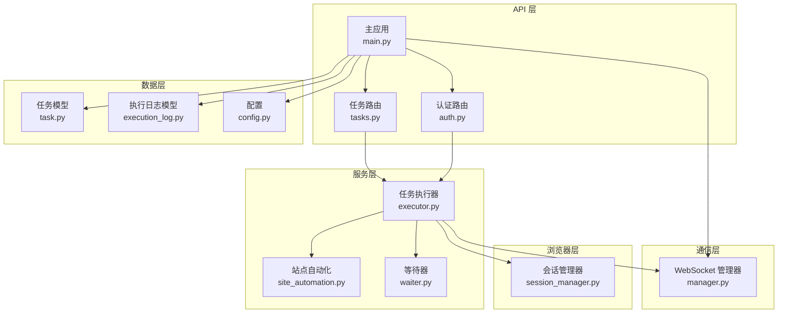
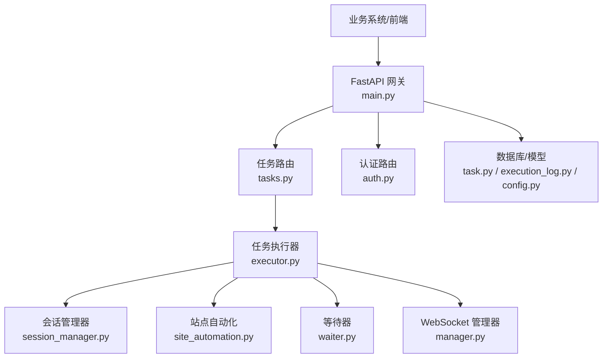
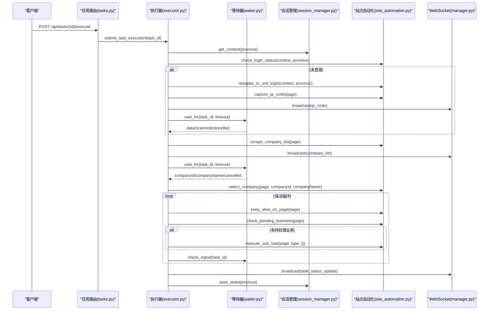
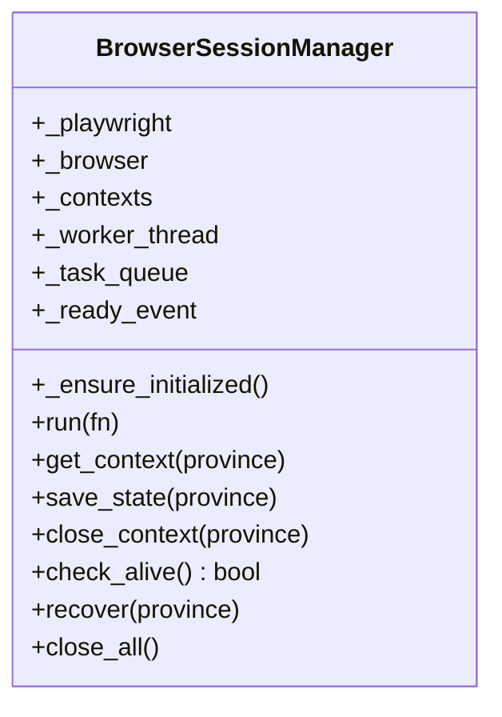
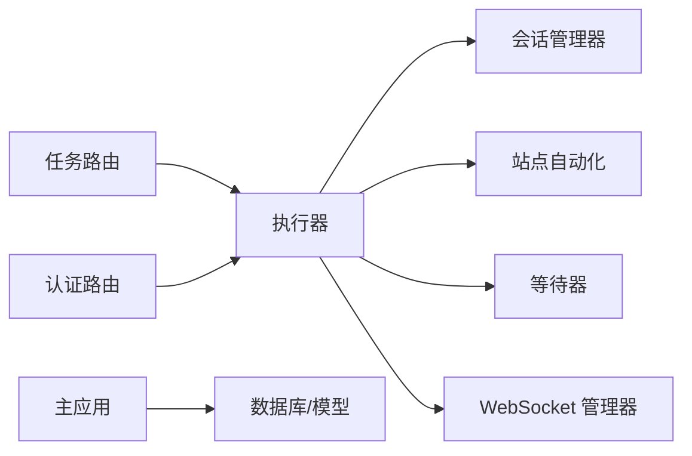

# Playwright 自动化脚本系统

<cite>
**本文档引用的文件**
- [project.md](file://project.md)
- [main.py](file://CCC_RPA_API/app/main.py)
- [config.py](file://CCC_RPA_API/app/config.py)
- [task.py](file://CCC_RPA_API/app/models/task.py)
- [execution_log.py](file://CCC_RPA_API/app/models/execution_log.py)
- [executor.py](file://CCC_RPA_API/app/services/executor.py)
- [tasks.py](file://CCC_RPA_API/app/api/tasks.py)
- [session_manager.py](file://CCC_RPA_API/app/browser/session_manager.py)
- [site_automation.py](file://CCC_RPA_API/app/browser/site_automation.py)
- [waiter.py](file://CCC_RPA_API/app/browser/waiter.py)
- [manager.py](file://CCC_RPA_API/app/ws/manager.py)
- [task.py](file://CCC_RPA_API/app/schemas/task.py)
- [auth.py](file://CCC_RPA_API/app/api/auth.py)
</cite>

## 目录
1. [引言](#引言)
2. [项目结构](#项目结构)
3. [核心组件](#核心组件)
4. [架构总览](#架构总览)
5. [详细组件分析](#详细组件分析)
6. [依赖分析](#依赖分析)
7. [性能考虑](#性能考虑)
8. [故障排查指南](#故障排查指南)
9. [结论](#结论)
10. [附录](#附录)

## 引言
本文件面向 Playwright 自动化脚本系统，聚焦于：
- NodeJS 与 Python 两套标准化 SDK 的实现架构与集成方式
- BullMQ 任务队列引擎的工作原理与使用要点
- 自定义脚本 DSL 的语法规则与执行机制
- 脚本编译、执行、重试、回滚的完整生命周期管理
- 远程 REST/WS API 网关的设计架构、接口规范、鉴权机制与错误处理策略
- SDK 使用示例、任务队列配置、消息协议格式
- 如何通过脚本系统实现自动化批量控制（页面操作、数据抓取、文件处理）

本系统以 FastAPI 为基础后端，结合 Playwright 在专用工作线程中执行浏览器操作，通过 WebSocket 实时推送执行日志与截图，配合任务队列实现异步批量执行。

章节来源
- [project.md: 447-462:447-462](file://project.md#L447-L462)
- [project.md: 313-324:313-324](file://project.md#L313-L324)

## 项目结构
后端采用分层架构：
- API 层：FastAPI 路由与认证、任务管理、设备与租户接口
- 服务层：任务执行器、会话管理、站点自动化、等待器
- 浏览器层：Playwright 专用工作线程、上下文持久化、状态恢复
- 通信层：WebSocket 管理器、消息广播
- 数据层：SQLAlchemy 模型与数据库配置

图表来源
- [main.py: 12-28:12-28](file://CCC_RPA_API/app/main.py#L12-L28)
- [auth.py: 1-24:1-24](file://CCC_RPA_API/app/api/auth.py#L1-L24)
- [tasks.py: 1-76:1-76](file://CCC_RPA_API/app/api/tasks.py#L1-L76)
- [executor.py: 1-319:1-319](file://CCC_RPA_API/app/services/executor.py#L1-L319)
- [session_manager.py: 1-186:1-186](file://CCC_RPA_API/app/browser/session_manager.py#L1-L186)
- [site_automation.py: 1-743:1-743](file://CCC_RPA_API/app/browser/site_automation.py#L1-L743)
- [waiter.py: 1-84:1-84](file://CCC_RPA_API/app/browser/waiter.py#L1-L84)
- [manager.py: 1-29:1-29](file://CCC_RPA_API/app/ws/manager.py#L1-L29)
- [task.py: 1-25:1-25](file://CCC_RPA_API/app/models/task.py#L1-L25)
- [execution_log.py: 1-17:1-17](file://CCC_RPA_API/app/models/execution_log.py#L1-L17)
- [config.py: 1-22:1-22](file://CCC_RPA_API/app/config.py#L1-L22)

章节来源
- [main.py: 12-28:12-28](file://CCC_RPA_API/app/main.py#L12-L28)
- [config.py: 1-22:1-22](file://CCC_RPA_API/app/config.py#L1-L22)
- [task.py: 1-25:1-25](file://CCC_RPA_API/app/models/task.py#L1-L25)
- [execution_log.py: 1-17:1-17](file://CCC_RPA_API/app/models/execution_log.py#L1-L17)
- [executor.py: 1-319:1-319](file://CCC_RPA_API/app/services/executor.py#L1-L319)
- [tasks.py: 1-76:1-76](file://CCC_RPA_API/app/api/tasks.py#L1-L76)
- [session_manager.py: 1-186:1-186](file://CCC_RPA_API/app/browser/session_manager.py#L1-L186)
- [site_automation.py: 1-743:1-743](file://CCC_RPA_API/app/browser/site_automation.py#L1-L743)
- [waiter.py: 1-84:1-84](file://CCC_RPA_API/app/browser/waiter.py#L1-L84)
- [manager.py: 1-29:1-29](file://CCC_RPA_API/app/ws/manager.py#L1-L29)
- [auth.py: 1-24:1-24](file://CCC_RPA_API/app/api/auth.py#L1-L24)

## 核心组件
- API 网关与路由
  - 认证路由：登录、登出、校验
  - 任务路由：任务列表、创建、查询、更新、删除、执行、日志、扫码完成、选择单位、取消执行
  - 主应用：CORS、数据库初始化、WebSocket 路由、健康检查
- 任务执行器
  - 线程池执行任务逻辑，广播执行进度、二维码、错误、状态更新
  - 与站点自动化、等待器、会话管理器协作
- 会话管理器
  - Playwright 专用工作线程，上下文按省份管理，持久化 storage_state
  - 提供运行、检查存活、恢复、关闭等能力
- 站点自动化
  - 登录状态检查、单位登录页导航、二维码截图、单位列表抓取、单位选择、保活、待处理业务检测
- 等待器
  - 基于 Event 的阻塞/唤醒机制，支持取消、检查信号、清理
- WebSocket 管理器
  - 维护连接、广播消息，处理断开清理

章节来源
- [auth.py: 1-24:1-24](file://CCC_RPA_API/app/api/auth.py#L1-L24)
- [tasks.py: 1-76:1-76](file://CCC_RPA_API/app/api/tasks.py#L1-L76)
- [main.py: 12-28:12-28](file://CCC_RPA_API/app/main.py#L12-L28)
- [executor.py: 1-319:1-319](file://CCC_RPA_API/app/services/executor.py#L1-L319)
- [session_manager.py: 1-186:1-186](file://CCC_RPA_API/app/browser/session_manager.py#L1-L186)
- [site_automation.py: 1-743:1-743](file://CCC_RPA_API/app/browser/site_automation.py#L1-L743)
- [waiter.py: 1-84:1-84](file://CCC_RPA_API/app/browser/waiter.py#L1-L84)
- [manager.py: 1-29:1-29](file://CCC_RPA_API/app/ws/manager.py#L1-L29)

## 架构总览
系统采用“API 网关 + 任务执行器 + Playwright 浏览器层 + WebSocket 实时通信”的分层设计。任务通过 API 触发，进入执行器，执行器在专用线程中调用会话管理器与站点自动化，期间通过 WebSocket 推送执行状态、截图与错误信息。

图表来源
- [main.py: 12-28:12-28](file://CCC_RPA_API/app/main.py#L12-L28)
- [tasks.py: 1-76:1-76](file://CCC_RPA_API/app/api/tasks.py#L1-L76)
- [auth.py: 1-24:1-24](file://CCC_RPA_API/app/api/auth.py#L1-L24)
- [executor.py: 1-319:1-319](file://CCC_RPA_API/app/services/executor.py#L1-L319)
- [session_manager.py: 1-186:1-186](file://CCC_RPA_API/app/browser/session_manager.py#L1-L186)
- [site_automation.py: 1-743:1-743](file://CCC_RPA_API/app/browser/site_automation.py#L1-L743)
- [waiter.py: 1-84:1-84](file://CCC_RPA_API/app/browser/waiter.py#L1-L84)
- [manager.py: 1-29:1-29](file://CCC_RPA_API/app/ws/manager.py#L1-L29)
- [task.py: 1-25:1-25](file://CCC_RPA_API/app/models/task.py#L1-L25)
- [execution_log.py: 1-17:1-17](file://CCC_RPA_API/app/models/execution_log.py#L1-L17)
- [config.py: 1-22:1-22](file://CCC_RPA_API/app/config.py#L1-L22)

## 详细组件分析

### 任务执行器（executor.py）
- 职责
  - 在线程池中执行任务逻辑，记录执行日志，广播执行进度、二维码、错误与状态更新
  - 与站点自动化协作完成登录、单位选择、保活与业务处理
  - 与等待器协作实现扫码与单位选择的人机交互等待
  - 与会话管理器协作确保浏览器存活与恢复
- 关键流程
  - 初始化浏览器上下文、检查登录状态
  - 未登录时推送二维码，等待扫码完成
  - 登录成功后抓取单位列表，等待用户选择
  - 选择单位后进入保活循环，检测待处理业务并执行
  - 任务完成后更新状态与日志
- 错误处理
  - 捕获异常，更新任务状态与日志，广播错误消息
  - 浏览器异常时恢复会话并重新打开页面

图表来源
- [executor.py: 78-315:78-315](file://CCC_RPA_API/app/services/executor.py#L78-L315)
- [site_automation.py: 38-53:38-53](file://CCC_RPA_API/app/browser/site_automation.py#L38-L53)
- [site_automation.py: 61-146:61-146](file://CCC_RPA_API/app/browser/site_automation.py#L61-L146)
- [site_automation.py: 148-173:148-173](file://CCC_RPA_API/app/browser/site_automation.py#L148-L173)
- [site_automation.py: 194-291:194-291](file://CCC_RPA_API/app/browser/site_automation.py#L194-L291)
- [site_automation.py: 294-540:294-540](file://CCC_RPA_API/app/browser/site_automation.py#L294-L540)
- [site_automation.py: 614-680:614-680](file://CCC_RPA_API/app/browser/site_automation.py#L614-L680)
- [site_automation.py: 683-735:683-735](file://CCC_RPA_API/app/browser/site_automation.py#L683-L735)
- [waiter.py: 14-32:14-32](file://CCC_RPA_API/app/browser/waiter.py#L14-L32)
- [waiter.py: 56-69:56-69](file://CCC_RPA_API/app/browser/waiter.py#L56-L69)
- [session_manager.py: 99-126:99-126](file://CCC_RPA_API/app/browser/session_manager.py#L99-L126)
- [manager.py: 17-26:17-26](file://CCC_RPA_API/app/ws/manager.py#L17-L26)

章节来源
- [executor.py: 1-319:1-319](file://CCC_RPA_API/app/services/executor.py#L1-L319)

### 会话管理器（session_manager.py）
- 职责
  - 在专用线程中启动 Playwright 与 Chromium，避免与 asyncio 事件循环冲突
  - 按省份维护 BrowserContext，持久化 storage_state
  - 提供 run 方法在工作线程中安全执行 Playwright 操作
  - 提供 check_alive、recover、close_all 等生命周期管理方法
- 关键点
  - 专用工作线程 + 队列执行，避免线程冲突
  - storage_state 持久化目录统一管理
  - 恢复时关闭旧上下文并重新初始化

图表来源
- [session_manager.py: 10-186:10-186](file://CCC_RPA_API/app/browser/session_manager.py#L10-L186)

章节来源
- [session_manager.py: 1-186:1-186](file://CCC_RPA_API/app/browser/session_manager.py#L1-L186)

### 站点自动化（site_automation.py）
- 职责
  - 封装特定站点的自动化流程：登录状态检查、登录页导航、二维码截图、单位列表抓取、单位选择、保活、待处理业务检测
- 关键点
  - 多策略降级与回退（CSS 选择器、JS 回退、文本匹配）
  - 保活策略多样化，避免页面跳转与业务触发
  - 错误检测与恢复（浏览器关闭类错误快速传播）

章节来源
- [site_automation.py: 1-743:1-743](file://CCC_RPA_API/app/browser/site_automation.py#L1-L743)

### 等待器（waiter.py）
- 职责
  - 基于 threading.Event 的阻塞/唤醒机制，支持超时、取消、非阻塞检查
  - 用于扫码完成、单位选择、任务取消等场景
- 关键点
  - 线程安全的数据结构与锁保护
  - 清理资源，避免内存泄漏

章节来源
- [waiter.py: 1-84:1-84](file://CCC_RPA_API/app/browser/waiter.py#L1-L84)

### WebSocket 管理器（manager.py）
- 职责
  - 维护 WebSocket 连接集合，支持广播消息
  - 断开清理失效连接
- 关键点
  - 广播时处理发送异常并清理断连

章节来源
- [manager.py: 1-29:1-29](file://CCC_RPA_API/app/ws/manager.py#L1-L29)

### API 网关与路由（main.py, tasks.py, auth.py）
- 职责
  - 提供认证、任务管理、设备与租户接口
  - 启动时初始化数据库与迁移，关闭时清理会话
  - WebSocket 路由用于实时推送
- 关键点
  - CORS 配置
  - 健康检查接口

章节来源
- [main.py: 12-28:12-28](file://CCC_RPA_API/app/main.py#L12-L28)
- [main.py: 30-87:30-87](file://CCC_RPA_API/app/main.py#L30-L87)
- [main.py: 108-127:108-127](file://CCC_RPA_API/app/main.py#L108-L127)
- [tasks.py: 1-76:1-76](file://CCC_RPA_API/app/api/tasks.py#L1-L76)
- [auth.py: 1-24:1-24](file://CCC_RPA_API/app/api/auth.py#L1-L24)

### 数据模型与配置（config.py, task.py, execution_log.py）
- 职责
  - 定义任务与执行日志的数据结构
  - 提供数据库连接配置
- 关键点
  - 任务模型包含状态、时间、备注、租户与设备等字段
  - 执行日志模型记录开始/结束时间、状态与结果消息

章节来源
- [config.py: 1-22:1-22](file://CCC_RPA_API/app/config.py#L1-L22)
- [task.py: 1-25:1-25](file://CCC_RPA_API/app/models/task.py#L1-L25)
- [execution_log.py: 1-17:1-17](file://CCC_RPA_API/app/models/execution_log.py#L1-L17)

## 依赖分析
- 组件耦合
  - 执行器依赖会话管理器、站点自动化、等待器与 WebSocket 管理器
  - API 路由依赖服务层与数据库模型
  - 会话管理器与站点自动化通过执行器间接耦合
- 外部依赖
  - FastAPI、SQLAlchemy、Playwright、WebSocket
- 潜在风险
  - 线程安全与事件循环冲突
  - 浏览器异常导致的状态不一致
  - WebSocket 连接断开未及时清理

图表来源
- [tasks.py: 1-76:1-76](file://CCC_RPA_API/app/api/tasks.py#L1-L76)
- [auth.py: 1-24:1-24](file://CCC_RPA_API/app/api/auth.py#L1-L24)
- [executor.py: 1-319:1-319](file://CCC_RPA_API/app/services/executor.py#L1-L319)
- [session_manager.py: 1-186:1-186](file://CCC_RPA_API/app/browser/session_manager.py#L1-L186)
- [site_automation.py: 1-743:1-743](file://CCC_RPA_API/app/browser/site_automation.py#L1-L743)
- [waiter.py: 1-84:1-84](file://CCC_RPA_API/app/browser/waiter.py#L1-L84)
- [manager.py: 1-29:1-29](file://CCC_RPA_API/app/ws/manager.py#L1-L29)
- [main.py: 12-28:12-28](file://CCC_RPA_API/app/main.py#L12-L28)

章节来源
- [tasks.py: 1-76:1-76](file://CCC_RPA_API/app/api/tasks.py#L1-L76)
- [auth.py: 1-24:1-24](file://CCC_RPA_API/app/api/auth.py#L1-L24)
- [executor.py: 1-319:1-319](file://CCC_RPA_API/app/services/executor.py#L1-L319)
- [session_manager.py: 1-186:1-186](file://CCC_RPA_API/app/browser/session_manager.py#L1-L186)
- [site_automation.py: 1-743:1-743](file://CCC_RPA_API/app/browser/site_automation.py#L1-L743)
- [waiter.py: 1-84:1-84](file://CCC_RPA_API/app/browser/waiter.py#L1-L84)
- [manager.py: 1-29:1-29](file://CCC_RPA_API/app/ws/manager.py#L1-L29)
- [main.py: 12-28:12-28](file://CCC_RPA_API/app/main.py#L12-L28)

## 性能考虑
- 线程模型
  - 专用 Playwright 工作线程避免与 asyncio 冲突
  - 线程池执行任务逻辑，避免阻塞主线程
- 浏览器资源
  - 按省份管理上下文，减少跨会话干扰
  - storage_state 持久化降低重复登录成本
- 通信效率
  - WebSocket 广播消息，断连自动清理
- 可靠性
  - 保活策略避免页面超时与会话失效
  - 异常时恢复会话并重新打开页面

## 故障排查指南
- 浏览器异常
  - 现象：页面跳转、浏览器关闭、CDP 断连
  - 处理：执行器检测并恢复会话，重新打开页面
- 扫码/选择超时
  - 现象：等待超时或用户取消
  - 处理：等待器超时抛出异常，执行器记录失败并广播错误
- WebSocket 断连
  - 现象：消息无法推送
  - 处理：管理器自动清理断连，重新连接后继续推送
- 数据库迁移
  - 现象：新增字段导致迁移失败
  - 处理：捕获异常并忽略，保证服务启动

章节来源
- [executor.py: 42-70:42-70](file://CCC_RPA_API/app/services/executor.py#L42-L70)
- [executor.py: 133-140:133-140](file://CCC_RPA_API/app/services/executor.py#L133-L140)
- [executor.py: 173-180:173-180](file://CCC_RPA_API/app/services/executor.py#L173-L180)
- [waiter.py: 29-32:29-32](file://CCC_RPA_API/app/browser/waiter.py#L29-L32)
- [manager.py: 19-26:19-26](file://CCC_RPA_API/app/ws/manager.py#L19-L26)
- [main.py: 46-82:46-82](file://CCC_RPA_API/app/main.py#L46-L82)

## 结论
本系统通过明确的分层与职责划分，实现了可靠的 Playwright 自动化执行与实时通信。执行器协调会话管理、站点自动化与等待器，结合 WebSocket 实时反馈，满足批量控制与人机交互的需求。建议在生产环境中进一步完善任务队列（BullMQ）接入、SDK 对接与 DSL 编译执行机制，以支撑更复杂的脚本场景。

## 附录

### API 接口规范（REST/WS）
- REST 基础路径：/api/v1
- 鉴权：Bearer Token
- 核心接口
  - POST /session/create：创建隔离沙箱会话
  - POST /session/{sessionId}/close：销毁指定会话
  - POST /session/{sessionId}/script/run：执行 Playwright 自动化脚本
  - POST /session/{sessionId}/ai/command：下发自然语言 AI 浏览指令
  - GET /session/{sessionId}/screenshot：获取页面截图
  - GET /ws/session/{sessionId}：实时推送会话日志、截图、AI 执行状态

章节来源
- [project.md: 447-462:447-462](file://project.md#L447-L462)

### 消息协议（WebSocket）
- 统一 JSON 消息结构
  - 字段：msgType、sessionId、data、timestamp
  - 类型：页面操作请求、AI 指令回调、截图推送、脚本录制数据、异常告警

章节来源
- [project.md: 481-495:481-495](file://project.md#L481-L495)

### 任务队列（BullMQ）配置要点
- 队列名称：queue:browser_task
- 任务类型：脚本执行、AI 指令、定时循环
- 优先级与重试：根据业务需求设置优先级与最大重试次数
- 监控：队列长度、积压任务、失败任务统计

章节来源
- [project.md: 319](file://project.md#L319)
- [project.md: 578](file://project.md#L578)

### SDK 使用示例（概念性说明）
- NodeJS SDK
  - 初始化客户端，设置 Bearer Token
  - 创建会话、执行脚本、订阅 WebSocket 实时日志
- Python SDK
  - 使用 requests 或 aiohttp 调用 REST 接口
  - 通过 WebSocket 监听执行状态与截图

章节来源
- [project.md: 315-318:315-318](file://project.md#L315-L318)

### 脚本 DSL 语法与执行机制（概念性说明）
- 语法要素：步骤块、条件判断、循环、异常捕获、步骤重试
- 执行机制：编译为可执行步骤序列，按序执行，异常时触发重试与回滚
- 与站点自动化集成：将 DSL 步骤映射为具体页面操作

章节来源
- [project.md: 321](file://project.md#L321)

### 生命周期管理（编译 → 执行 → 重试 → 回滚）
- 编译：解析 DSL，生成步骤序列
- 执行：按步骤执行，实时广播进度
- 重试：异常时按策略重试，超限失败
- 回滚：恢复会话状态，撤销已执行副作用

章节来源
- [project.md: 321](file://project.md#L321)
- [executor.py: 42-70:42-70](file://CCC_RPA_API/app/services/executor.py#L42-L70)

### 自动化批量控制示例（概念性说明）
- 页面操作：跳转、点击、输入、滑动、截图
- 数据抓取：单位列表、业务数据、结构化抽取
- 文件处理：上传下载、OCR 识别、结果导出
- 通过任务队列异步调度，WebSocket 实时反馈

章节来源
- [project.md: 317-318:317-318](file://project.md#L317-L318)
- [site_automation.py: 194-291:194-291](file://CCC_RPA_API/app/browser/site_automation.py#L194-L291)
- [site_automation.py: 614-680:614-680](file://CCC_RPA_API/app/browser/site_automation.py#L614-L680)