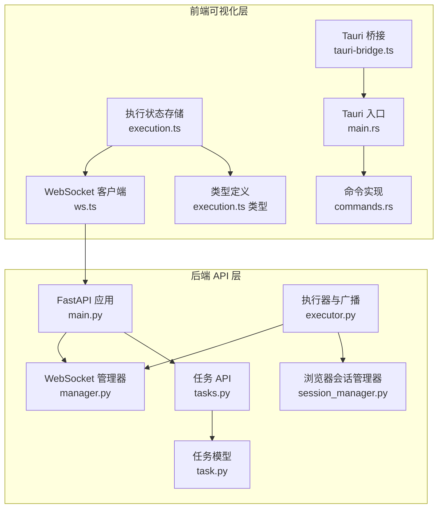
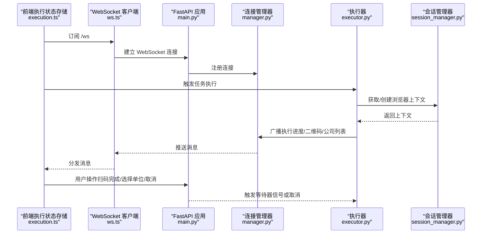
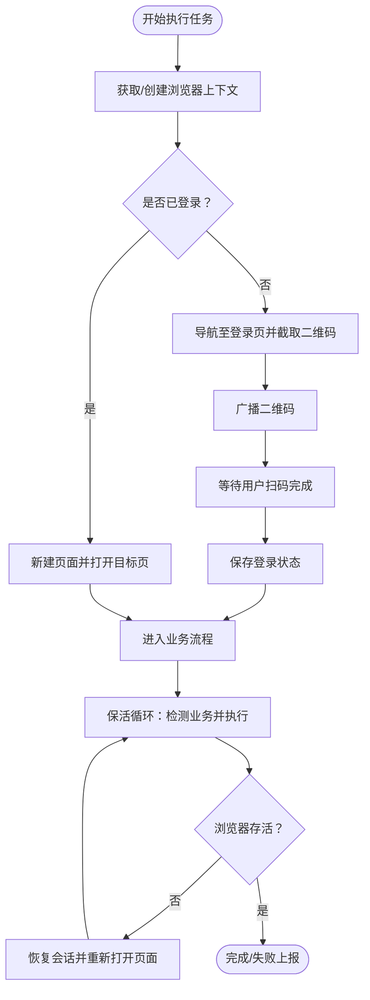
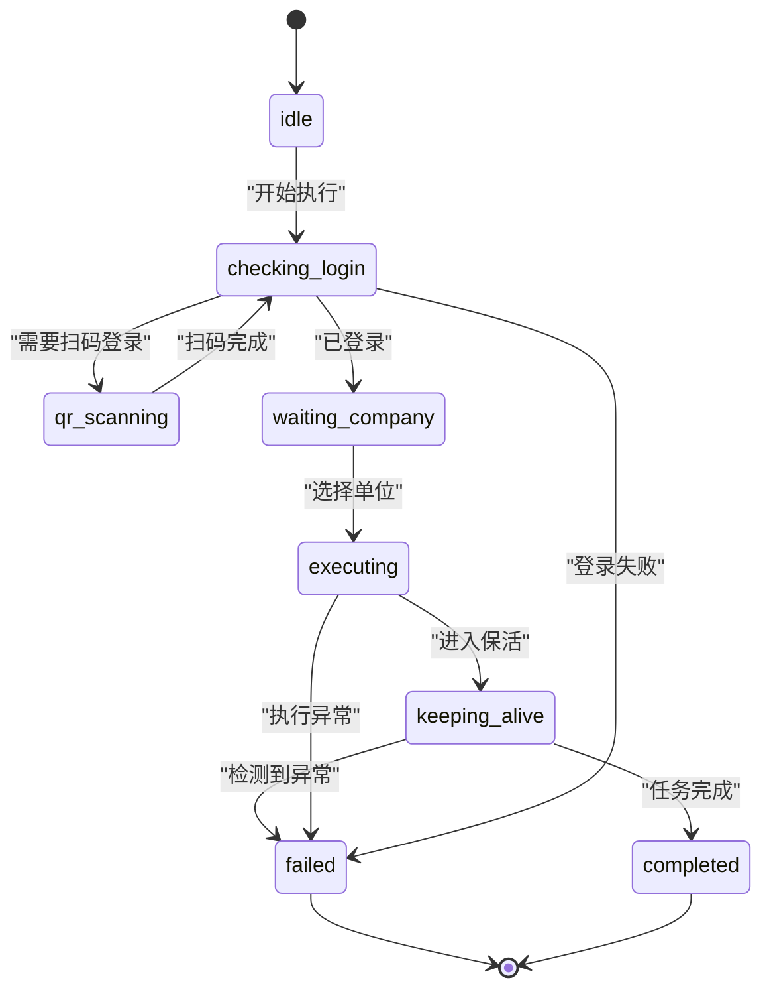
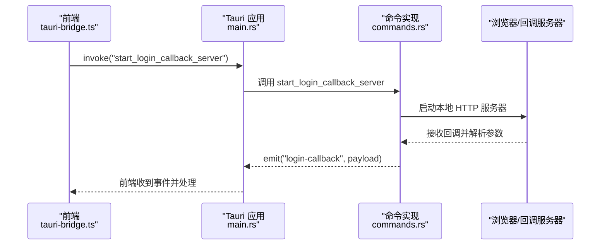
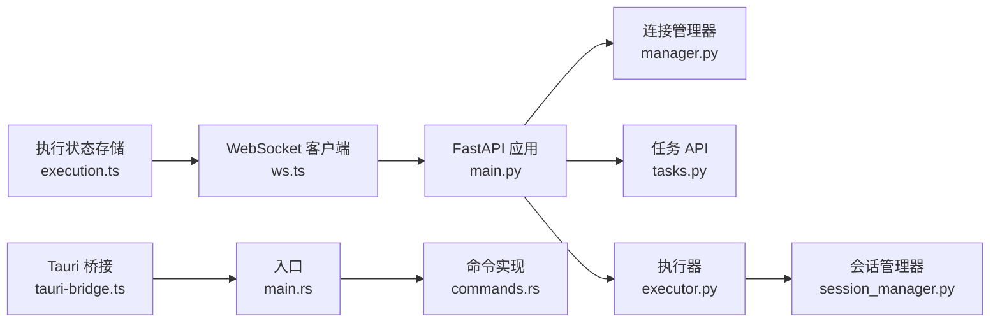

# 双通路消息桥接系统

<cite>
**本文档引用的文件**
- [main.py](file://CCC_RPA_API/app/main.py)
- [manager.py](file://CCC_RPA_API/app/ws/manager.py)
- [session_manager.py](file://CCC_RPA_API/app/browser/session_manager.py)
- [executor.py](file://CCC_RPA_API/app/services/executor.py)
- [tasks.py](file://CCC_RPA_API/app/api/tasks.py)
- [ws.ts](file://CCC-BrowserV4/frontend/src/api/ws.ts)
- [execution.ts](file://CCC-BrowserV4/frontend/src/stores/execution.ts)
- [execution.ts 类型定义](file://CCC-BrowserV4/frontend/src/types/execution.ts)
- [tauri-bridge.ts](file://CCC-BrowserV4/frontend/src/utils/tauri-bridge.ts)
- [main.rs](file://CCC-BrowserV4/src-tauri/src/main.rs)
- [commands.rs](file://CCC-BrowserV4/src-tauri/src/commands.rs)
- [task.py](file://CCC_RPA_API/app/models/task.py)
</cite>

## 目录
1. [引言](#引言)
2. [项目结构](#项目结构)
3. [核心组件](#核心组件)
4. [架构总览](#架构总览)
5. [详细组件分析](#详细组件分析)
6. [依赖关系分析](#依赖关系分析)
7. [性能考虑](#性能考虑)
8. [故障处理指南](#故障处理指南)
9. [结论](#结论)
10. [附录](#附录)

## 引言
本系统实现了“双通路消息桥接”，即通过 Playwright 自动化脚本通路与 Chrome V3 扩展/桌面应用可视化通路之间的双向消息桥接。其目标是：
- 将人工操作录制为脚本的技术实现与远程脚本执行的实时同步机制相融合；
- 支持 AI 指令执行结果的推送策略；
- 提供 WebSocket 实时通信协议设计、消息格式标准化与事件类型定义；
- 实现会话状态同步、页面截图传输、操作日志推送；
- 提供配置选项、性能优化策略与故障处理机制；
- 使自动化批量控制与人工可视化操作实现无缝结合。

## 项目结构
系统分为三层：
- 后端 API 层（FastAPI）：负责任务编排、Playwright 会话管理、WebSocket 广播与数据库交互。
- 前端可视化层（Vue + Pinia + Tauri）：负责用户交互、WebSocket 订阅、状态展示与部分原生能力调用。
- 消息桥接层：统一的 WebSocket 协议与事件类型，贯穿前后端。

**图表来源**
- [main.py:119-127](file://CCC_RPA_API/app/main.py#L119-L127)
- [manager.py:5-29](file://CCC_RPA_API/app/ws/manager.py#L5-L29)
- [session_manager.py:10-186](file://CCC_RPA_API/app/browser/session_manager.py#L10-L186)
- [executor.py:22-33](file://CCC_RPA_API/app/services/executor.py#L22-L33)
- [tasks.py:10-76](file://CCC_RPA_API/app/api/tasks.py#L10-L76)
- [task.py:8-25](file://CCC_RPA_API/app/models/task.py#L8-L25)
- [ws.ts:8-88](file://CCC-BrowserV4/frontend/src/api/ws.ts#L8-L88)
- [execution.ts:6-67](file://CCC-BrowserV4/frontend/src/stores/execution.ts#L6-L67)
- [execution.ts 类型定义:1-17](file://CCC-BrowserV4/frontend/src/types/execution.ts#L1-L17)
- [tauri-bridge.ts:6-32](file://CCC-BrowserV4/frontend/src/utils/tauri-bridge.ts#L6-L32)
- [main.rs:7-28](file://CCC-BrowserV4/src-tauri/src/main.rs#L7-L28)
- [commands.rs:10-92](file://CCC-BrowserV4/src-tauri/src/commands.rs#L10-L92)

**章节来源**
- [main.py:12-127](file://CCC_RPA_API/app/main.py#L12-L127)
- [ws.ts:8-88](file://CCC-BrowserV4/frontend/src/api/ws.ts#L8-L88)
- [execution.ts:6-67](file://CCC-BrowserV4/frontend/src/stores/execution.ts#L6-L67)

## 核心组件
- WebSocket 服务端与广播器：提供统一消息通道，支持多客户端订阅与广播。
- Playwright 会话管理器：在专用线程中运行，确保与 asyncio 事件循环隔离，支持上下文持久化与恢复。
- 执行器与消息广播：将执行进度、二维码、公司列表、错误与任务状态更新等事件推送到前端。
- 前端 WebSocket 客户端与状态存储：接收并解析消息，驱动 UI 状态机，同时提供演示模式与 API 回退。
- Tauri 原生桥接：提供设备标识、登录回调等原生能力，作为可视化通路的一部分。

**章节来源**
- [manager.py:5-29](file://CCC_RPA_API/app/ws/manager.py#L5-L29)
- [session_manager.py:10-186](file://CCC_RPA_API/app/browser/session_manager.py#L10-L186)
- [executor.py:22-33](file://CCC_RPA_API/app/services/executor.py#L22-L33)
- [ws.ts:8-88](file://CCC-BrowserV4/frontend/src/api/ws.ts#L8-L88)
- [execution.ts:6-67](file://CCC-BrowserV4/frontend/src/stores/execution.ts#L6-L67)
- [tauri-bridge.ts:6-32](file://CCC-BrowserV4/frontend/src/utils/tauri-bridge.ts#L6-L32)

## 架构总览
系统通过 WebSocket 实现实时双向通信，后端在工作线程中执行 Playwright 操作并通过广播器推送状态；前端根据消息类型更新 UI 状态机，并在必要时回传用户输入或取消信号。

**图表来源**
- [main.py:119-127](file://CCC_RPA_API/app/main.py#L119-L127)
- [manager.py:10-26](file://CCC_RPA_API/app/ws/manager.py#L10-L26)
- [executor.py:78-315](file://CCC_RPA_API/app/services/executor.py#L78-L315)
- [session_manager.py:99-126](file://CCC_RPA_API/app/browser/session_manager.py#L99-L126)
- [ws.ts:20-56](file://CCC-BrowserV4/frontend/src/api/ws.ts#L20-L56)
- [execution.ts:69-121](file://CCC-BrowserV4/frontend/src/stores/execution.ts#L69-L121)

## 详细组件分析

### WebSocket 协议与消息格式
- 协议：基于标准 WebSocket，URL 为 /ws，自动根据当前页面协议选择 ws/wss。
- 消息结构：包含 type 字段（事件类型）与 data 字段（负载），前端按类型分发处理。
- 事件类型：
  - execution_progress：执行进度更新，包含 taskId、step、message。
  - qr_code：推送二维码图片（Base64 或 URL），前端显示扫码界面。
  - company_list：推送可选单位列表，前端展示供用户选择。
  - login_result：登录结果反馈。
  - execution_error：执行异常，包含错误信息。
  - task_status_update：任务状态更新（completed/failed），包含时间戳与结果。
- 前端过滤：仅处理与当前 taskId 对应的消息，避免跨任务干扰。

**章节来源**
- [ws.ts:1-88](file://CCC-BrowserV4/frontend/src/api/ws.ts#L1-L88)
- [execution.ts:22-67](file://CCC-BrowserV4/frontend/src/stores/execution.ts#L22-L67)
- [executor.py:100-311](file://CCC_RPA_API/app/services/executor.py#L100-L311)

### Playwright 自动化执行与会话管理
- 专用工作线程：避免 Playwright 同步 API 与 asyncio 事件循环冲突，所有 PW 操作通过队列投递并在工作线程执行。
- 上下文持久化：按省份维护 BrowserContext，使用 storage_state 文件持久化登录态，减少重复扫码。
- 存活检查与恢复：执行过程中定期检查浏览器存活，异常时自动恢复并重新打开目标页面。
- 截图与调试：异常时保存检查点截图，辅助问题定位。

**图表来源**
- [session_manager.py:99-144](file://CCC_RPA_API/app/browser/session_manager.py#L99-L144)
- [executor.py:78-315](file://CCC_RPA_API/app/services/executor.py#L78-L315)

**章节来源**
- [session_manager.py:10-186](file://CCC_RPA_API/app/browser/session_manager.py#L10-L186)
- [executor.py:35-76](file://CCC_RPA_API/app/services/executor.py#L35-L76)

### 前端可视化通路与状态机
- 状态机：包含 idle/checking_login/qr_scanning/waiting_company/executing/keeping_alive/completed/failed/cancelled 等步骤。
- 事件驱动：根据后端推送的消息更新 step 与 message，渲染 UI。
- 演示模式：当后端不可用时，前端模拟扫码、选择单位与执行过程，保证可用性。
- 用户交互：扫码完成、选择单位、取消执行均通过 API 或 WebSocket 信号触发。

**图表来源**
- [execution.ts 类型定义:1-17](file://CCC-BrowserV4/frontend/src/types/execution.ts#L1-L17)
- [execution.ts:22-67](file://CCC-BrowserV4/frontend/src/stores/execution.ts#L22-L67)

**章节来源**
- [execution.ts:6-229](file://CCC-BrowserV4/frontend/src/stores/execution.ts#L6-L229)
- [execution.ts 类型定义:1-17](file://CCC-BrowserV4/frontend/src/types/execution.ts#L1-L17)

### Tauri 原生能力与登录回调
- 设备与会话标识：提供设备唯一 ID、会话级客户端 ID、随机 Token 等。
- 登录回调服务器：启动本地 HTTP 服务器监听登录回调，解析参数并通过 Tauri 事件通知前端。
- 前端桥接：通过 tauri-bridge.ts 统一封装 invoke 调用，简化前端集成。

**图表来源**
- [tauri-bridge.ts:6-32](file://CCC-BrowserV4/frontend/src/utils/tauri-bridge.ts#L6-L32)
- [main.rs:12-18](file://CCC-BrowserV4/src-tauri/src/main.rs#L12-L18)
- [commands.rs:44-92](file://CCC-BrowserV4/src-tauri/src/commands.rs#L44-L92)

**章节来源**
- [tauri-bridge.ts:6-32](file://CCC-BrowserV4/frontend/src/utils/tauri-bridge.ts#L6-L32)
- [main.rs:7-28](file://CCC-BrowserV4/src-tauri/src/main.rs#L7-L28)
- [commands.rs:10-92](file://CCC-BrowserV4/src-tauri/src/commands.rs#L10-L92)

### 任务 API 与等待器机制
- 任务执行入口：POST /api_tasks/{task_id}/execute 触发执行。
- 用户交互等待：扫码完成与选择单位通过 /scan-complete 与 /select-company 信号唤醒阻塞等待。
- 取消执行：/cancel-execution 发送取消信号，执行器在关键节点检查并优雅退出。
- 数据模型：任务表包含状态、省份、子任务、备注等字段，支持多租户与设备绑定。

**章节来源**
- [tasks.py:47-76](file://CCC_RPA_API/app/api/tasks.py#L47-L76)
- [task.py:8-25](file://CCC_RPA_API/app/models/task.py#L8-L25)

## 依赖关系分析
- 后端耦合度低：WebSocket 广播通过全局事件循环注入，避免直接耦合到业务逻辑。
- 前后端解耦：消息格式标准化，前端仅依赖事件类型与数据结构，不关心后端实现细节。
- Tauri 与前端：通过 invoke 与事件解耦，前端无需感知底层实现语言。

**图表来源**
- [ws.ts:8-88](file://CCC-BrowserV4/frontend/src/api/ws.ts#L8-L88)
- [main.py:119-127](file://CCC_RPA_API/app/main.py#L119-L127)
- [manager.py:5-29](file://CCC_RPA_API/app/ws/manager.py#L5-L29)
- [tasks.py:10-76](file://CCC_RPA_API/app/api/tasks.py#L10-L76)
- [executor.py:22-33](file://CCC_RPA_API/app/services/executor.py#L22-L33)
- [session_manager.py:10-186](file://CCC_RPA_API/app/browser/session_manager.py#L10-L186)
- [execution.ts:6-67](file://CCC-BrowserV4/frontend/src/stores/execution.ts#L6-L67)
- [tauri-bridge.ts:6-32](file://CCC-BrowserV4/frontend/src/utils/tauri-bridge.ts#L6-L32)
- [main.rs:7-28](file://CCC-BrowserV4/src-tauri/src/main.rs#L7-L28)
- [commands.rs:10-92](file://CCC-BrowserV4/src-tauri/src/commands.rs#L10-L92)

**章节来源**
- [main.py:12-127](file://CCC_RPA_API/app/main.py#L12-L127)
- [manager.py:5-29](file://CCC_RPA_API/app/ws/manager.py#L5-L29)
- [executor.py:22-33](file://CCC_RPA_API/app/services/executor.py#L22-L33)

## 性能考虑
- 线程隔离：Playwright 在专用线程执行，避免阻塞主事件循环与 WebSocket 广播。
- 连接复用：单个浏览器实例复用多个上下文，减少资源消耗。
- 分段等待：保活等待采用分段轮询，便于快速响应取消信号。
- 截图与日志：仅在异常或调试场景保存截图，避免频繁 IO。
- 广播去死连接：连接管理器自动清理异常断开的连接，降低广播成本。

[本节为通用性能建议，无需特定文件引用]

## 故障处理指南
- 连接异常：前端 WebSocket 客户端具备指数退避重连机制，断线自动恢复。
- 执行异常：后端捕获异常并广播 execution_error，同时更新任务状态为 failed。
- 浏览器崩溃：执行器定期检查存活，异常时自动恢复并重新打开页面，尽量减少人工干预。
- 登录失败：前端显示失败提示，后端广播 login_result，允许重新扫码。
- 取消执行：用户可在任意阶段取消，后端通过等待器信号及时终止流程。

**章节来源**
- [ws.ts:58-64](file://CCC-BrowserV4/frontend/src/api/ws.ts#L58-L64)
- [executor.py:286-311](file://CCC_RPA_API/app/services/executor.py#L286-L311)
- [session_manager.py:147-170](file://CCC_RPA_API/app/browser/session_manager.py#L147-L170)

## 结论
该双通路消息桥接系统通过标准化的 WebSocket 协议与清晰的状态机，将 Playwright 自动化与人工可视化操作有机整合。后端以线程隔离与会话持久化保障稳定性，前端以事件驱动与演示模式提升可用性。配合 Tauri 原生能力，系统在复杂业务场景下实现了高可靠、可扩展且易于维护的自动化执行平台。

[本节为总结性内容，无需特定文件引用]

## 附录

### 消息事件类型与数据结构
- execution_progress
  - 字段：taskId, step, message
  - 用途：实时进度与状态提示
- qr_code
  - 字段：taskId, qrImage
  - 用途：推送二维码图片
- company_list
  - 字段：taskId, companies[]
  - 用途：推送可选单位列表
- login_result
  - 字段：taskId, success, message
  - 用途：登录结果反馈
- execution_error
  - 字段：taskId, message
  - 用途：执行异常通知
- task_status_update
  - 字段：taskId, status, lastResult, lastExecutedAt
  - 用途：任务最终状态更新

**章节来源**
- [execution.ts:22-67](file://CCC-BrowserV4/frontend/src/stores/execution.ts#L22-L67)
- [executor.py:100-311](file://CCC_RPA_API/app/services/executor.py#L100-L311)

### 配置选项与最佳实践
- WebSocket
  - URL：/ws，自动 wss/ws 判定
  - 重连：指数退避，避免风暴
- Playwright
  - 专用线程：避免与 asyncio 冲突
  - 上下文持久化：按省份存储 storage_state
  - 存活检查：异常自动恢复
- 前端
  - 事件过滤：仅处理当前 taskId 消息
  - 演示模式：后端不可用时保证体验
  - 状态机：严格的状态流转与错误兜底

**章节来源**
- [ws.ts:15-18](file://CCC-BrowserV4/frontend/src/api/ws.ts#L15-L18)
- [session_manager.py:19-23](file://CCC_RPA_API/app/browser/session_manager.py#L19-L23)
- [execution.ts:22-67](file://CCC-BrowserV4/frontend/src/stores/execution.ts#L22-L67)