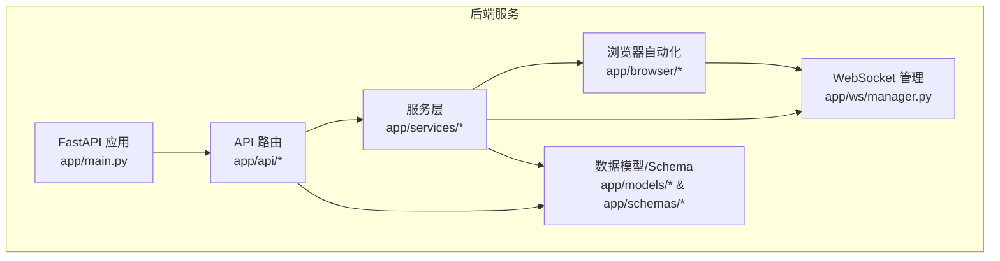
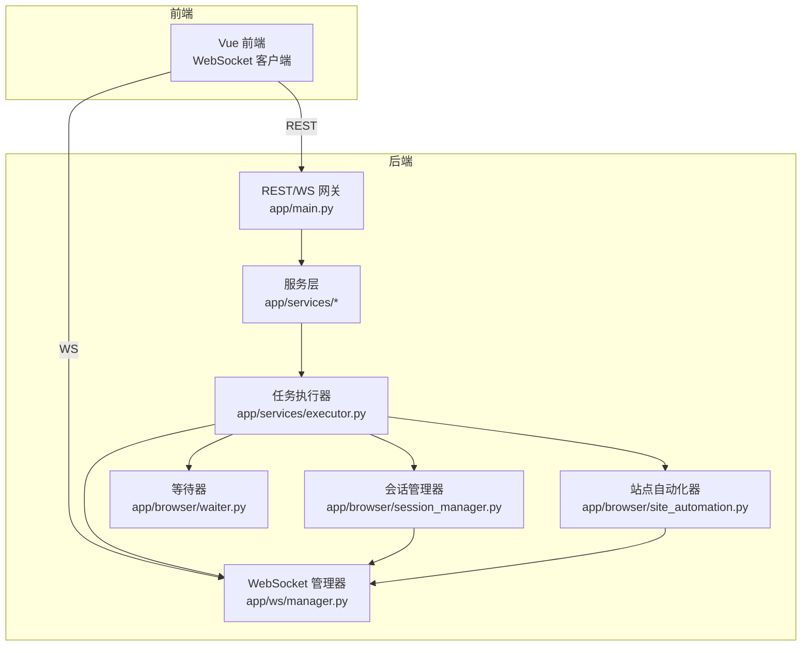
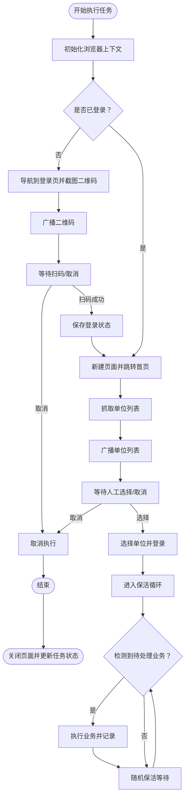
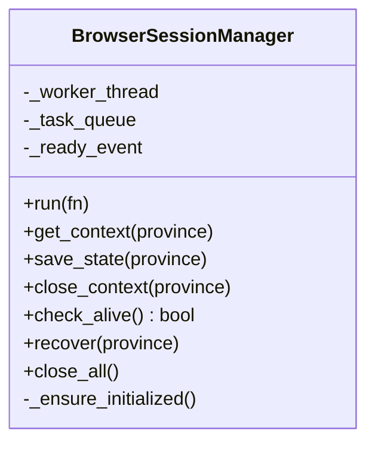
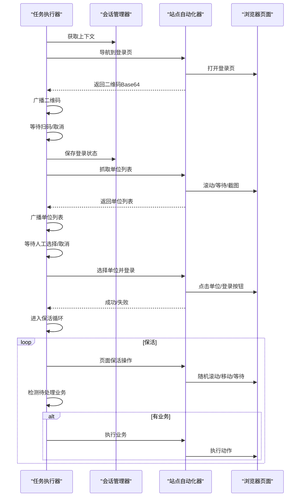
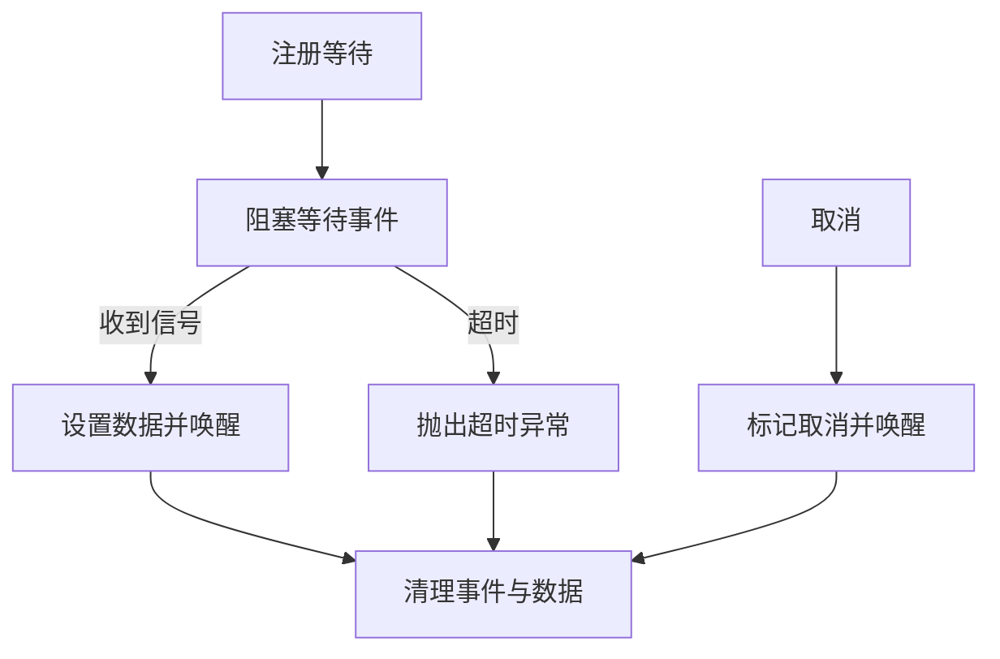
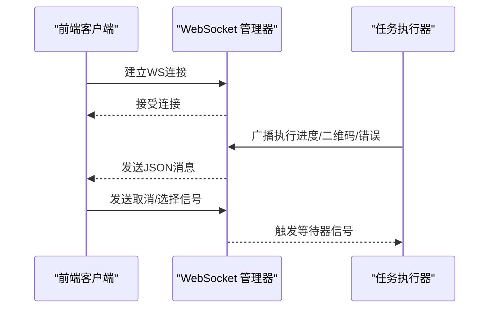
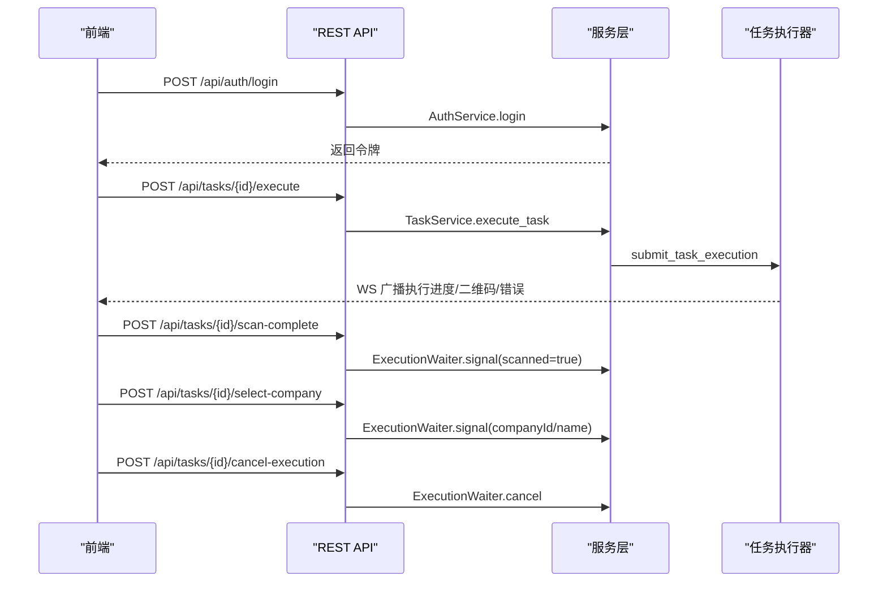
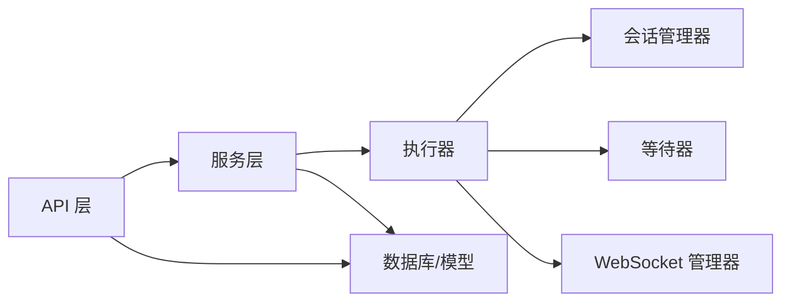

# 层3：双通路控制层

<cite>
**本文档引用的文件**
- [main.py](file://CCC_RPA_API/app/main.py)
- [manager.py](file://CCC_RPA_API/app/ws/manager.py)
- [tasks.py](file://CCC_RPA_API/app/api/tasks.py)
- [auth.py](file://CCC_RPA_API/app/api/auth.py)
- [executor.py](file://CCC_RPA_API/app/services/executor.py)
- [session_manager.py](file://CCC_RPA_API/app/browser/session_manager.py)
- [site_automation.py](file://CCC_RPA_API/app/browser/site_automation.py)
- [waiter.py](file://CCC_RPA_API/app/browser/waiter.py)
- [task.py](file://CCC_RPA_API/app/models/task.py)
- [task.py](file://CCC_RPA_API/app/schemas/task.py)
- [auth.py](file://CCC_RPA_API/app/schemas/auth.py)
- [execution.py](file://CCC_RPA_API/app/schemas/execution.py)
- [execution_log.py](file://CCC_RPA_API/app/models/execution_log.py)
- [auth.py](file://CCC_RPA_API/app/services/auth.py)
- [task.py](file://CCC_RPA_API/app/services/task.py)
- [executor.py](file://CCC_RPA_API/app/services/executor.py)
- [manager.py](file://CCC_RPA_API/app/ws/manager.py)
- [main.py](file://CCC_RPA_API/app/main.py)
</cite>

## 目录
1. [简介](#简介)
2. [项目结构](#项目结构)
3. [核心组件](#核心组件)
4. [架构总览](#架构总览)
5. [详细组件分析](#详细组件分析)
6. [依赖分析](#依赖分析)
7. [性能考量](#性能考量)
8. [故障排查指南](#故障排查指南)
9. [结论](#结论)
10. [附录](#附录)

## 简介
本文件面向商用级 AI 浏览器系统的“双通路控制层”，系统通过两条并行通道协同工作：  
- Playwright 自动化脚本通路：以浏览器自动化为核心，实现对目标站点的无人值守批量执行。  
- Chrome V3 扩展可视化通路：以可视化交互为核心，允许人工操作录制、实时预览与远程脚本执行的同步控制。

控制层围绕统一的 REST/WS API 网关，提供任务编排、状态广播、人工交互桥接与浏览器生命周期管理。同时，系统内置基于线程池的任务执行器与浏览器会话管理器，确保在异步事件循环与同步 Playwright API 之间建立稳定桥接；并通过 WebSocket 广播实现前后端实时联动。

## 项目结构
后端采用 FastAPI 构建，核心目录组织如下：  
- app/main.py：应用入口，注册路由、CORS、数据库初始化、WebSocket 管理器与健康检查。  
- app/api/*：REST API 路由模块，包括认证、任务、租户、设备等。  
- app/services/*：服务层，封装业务逻辑，调度浏览器执行器与等待器。  
- app/browser/*：浏览器自动化与会话管理，包含会话管理器、站点自动化、等待器。  
- app/ws/manager.py：WebSocket 连接管理与广播。  
- app/models/* 与 app/schemas/*：数据模型与请求/响应模型。  

图表来源
- [main.py:1-127](file://CCC_RPA_API/app/main.py#L1-L127)
- [manager.py:1-29](file://CCC_RPA_API/app/ws/manager.py#L1-L29)

章节来源
- [main.py:1-127](file://CCC_RPA_API/app/main.py#L1-L127)

## 核心组件
- 统一 REST/WS API 网关：提供认证、任务 CRUD、执行、日志、WebSocket 连接等能力。  
- 任务执行器：基于线程池的任务调度器，协调 Playwright 工作线程、浏览器会话、等待器与 WebSocket 广播。  
- 浏览器会话管理器：以专用线程承载 Playwright/Chromium，提供上下文隔离与持久化存储状态。  
- 站点自动化器：封装目标站点的登录、扫码、单位选择、保活与业务检测等流程。  
- 等待器：基于线程事件的阻塞/非阻塞等待机制，支撑人工交互与取消信号。  
- WebSocket 管理器：集中维护连接并进行消息广播，驱动前端可视化与状态同步。

章节来源
- [main.py:1-127](file://CCC_RPA_API/app/main.py#L1-L127)
- [executor.py:1-319](file://CCC_RPA_API/app/services/executor.py#L1-L319)
- [session_manager.py:1-186](file://CCC_RPA_API/app/browser/session_manager.py#L1-L186)
- [site_automation.py:1-743](file://CCC_RPA_API/app/browser/site_automation.py#L1-L743)
- [waiter.py:1-84](file://CCC_RPA_API/app/browser/waiter.py#L1-L84)
- [manager.py:1-29](file://CCC_RPA_API/app/ws/manager.py#L1-L29)

## 架构总览
双通路控制层通过“任务执行器”作为中枢，将 Playwright 自动化与人工可视化两条通路整合在同一运行时中。Playwright 通路在专用线程中执行浏览器操作，服务层通过 WebSocket 广播状态；人工通路通过前端与 WebSocket 交互，实现扫码登录、单位选择、业务触发与取消控制。

图表来源
- [main.py:119-127](file://CCC_RPA_API/app/main.py#L119-L127)
- [manager.py:1-29](file://CCC_RPA_API/app/ws/manager.py#L1-L29)
- [executor.py:1-319](file://CCC_RPA_API/app/services/executor.py#L1-L319)
- [session_manager.py:1-186](file://CCC_RPA_API/app/browser/session_manager.py#L1-L186)
- [site_automation.py:1-743](file://CCC_RPA_API/app/browser/site_automation.py#L1-L743)
- [waiter.py:1-84](file://CCC_RPA_API/app/browser/waiter.py#L1-L84)

## 详细组件分析

### 组件A：任务执行器（线程池 + 专用 Playwright 线程）
任务执行器负责将任务生命周期拆解为多个阶段：初始化浏览器、登录态检查、扫码登录、单位列表抓取、单位选择、保活循环与业务触发、完成收尾。执行过程中通过 WebSocket 广播进度、二维码、错误与状态更新，并在必要时恢复浏览器会话。

图表来源
- [executor.py:78-315](file://CCC_RPA_API/app/services/executor.py#L78-L315)
- [session_manager.py:98-126](file://CCC_RPA_API/app/browser/session_manager.py#L98-L126)
- [site_automation.py:194-291](file://CCC_RPA_API/app/browser/site_automation.py#L194-L291)
- [site_automation.py:294-540](file://CCC_RPA_API/app/browser/site_automation.py#L294-L540)
- [site_automation.py:557-680](file://CCC_RPA_API/app/browser/site_automation.py#L557-L680)
- [waiter.py:14-84](file://CCC_RPA_API/app/browser/waiter.py#L14-L84)

章节来源
- [executor.py:1-319](file://CCC_RPA_API/app/services/executor.py#L1-L319)

### 组件B：浏览器会话管理器（专用线程 + 上下文隔离）
会话管理器在专用线程中启动 Playwright/Chromium，提供按省份隔离的 BrowserContext，并持久化 storage_state。所有 Playwright 同步 API 在该专用线程中执行，避免与 FastAPI 的 asyncio 事件循环冲突。同时提供恢复机制，应对浏览器异常关闭。

图表来源
- [session_manager.py:10-186](file://CCC_RPA_API/app/browser/session_manager.py#L10-L186)

章节来源
- [session_manager.py:1-186](file://CCC_RPA_API/app/browser/session_manager.py#L1-L186)

### 组件C：站点自动化器（登录、扫码、单位选择、保活、业务检测）
站点自动化器封装目标站点的完整业务流程，包括登录态检测、统一登录页导航、二维码截图、单位列表抓取、单位选择与登录按钮点击、页面保活与业务检测等。为保证稳定性，提供多种降级策略与调试截图。

图表来源
- [site_automation.py:61-145](file://CCC_RPA_API/app/browser/site_automation.py#L61-L145)
- [site_automation.py:148-173](file://CCC_RPA_API/app/browser/site_automation.py#L148-L173)
- [site_automation.py:194-291](file://CCC_RPA_API/app/browser/site_automation.py#L194-L291)
- [site_automation.py:294-540](file://CCC_RPA_API/app/browser/site_automation.py#L294-L540)
- [site_automation.py:557-680](file://CCC_RPA_API/app/browser/site_automation.py#L557-L680)

章节来源
- [site_automation.py:1-743](file://CCC_RPA_API/app/browser/site_automation.py#L1-L743)

### 组件D：等待器（阻塞/非阻塞等待与取消）
等待器通过线程事件实现阻塞等待与非阻塞检查，支持扫码登录、单位选择等人工交互阶段的超时与取消控制，保活循环中可周期性检查取消信号。

图表来源
- [waiter.py:14-84](file://CCC_RPA_API/app/browser/waiter.py#L14-L84)

章节来源
- [waiter.py:1-84](file://CCC_RPA_API/app/browser/waiter.py#L1-L84)

### 组件E：WebSocket 管理器（广播与连接维护）
WebSocket 管理器负责接受连接、维护连接集合、向所有连接广播消息，并在异常时清理断连。消息类型包括执行进度、二维码、单位列表、错误与任务状态更新等。

图表来源
- [manager.py:1-29](file://CCC_RPA_API/app/ws/manager.py#L1-L29)
- [main.py:119-127](file://CCC_RPA_API/app/main.py#L119-L127)
- [executor.py:22-33](file://CCC_RPA_API/app/services/executor.py#L22-L33)

章节来源
- [manager.py:1-29](file://CCC_RPA_API/app/ws/manager.py#L1-L29)
- [main.py:119-127](file://CCC_RPA_API/app/main.py#L119-L127)

### 组件F：REST API 网关与接口规范
REST API 提供认证、任务管理、执行控制与日志查询等接口，配合 WebSocket 实现实时状态同步。认证采用登录/登出/校验接口；任务接口支持分页、创建、更新、删除、执行、日志查询以及人工交互信号（扫码完成、选择单位、取消执行）。

图表来源
- [auth.py:1-24](file://CCC_RPA_API/app/api/auth.py#L1-L24)
- [tasks.py:1-76](file://CCC_RPA_API/app/api/tasks.py#L1-L76)
- [executor.py:317-319](file://CCC_RPA_API/app/services/executor.py#L317-L319)
- [waiter.py:34-76](file://CCC_RPA_API/app/browser/waiter.py#L34-L76)

章节来源
- [auth.py:1-24](file://CCC_RPA_API/app/api/auth.py#L1-L24)
- [tasks.py:1-76](file://CCC_RPA_API/app/api/tasks.py#L1-L76)

## 依赖分析
- 控制层耦合关系：服务层依赖会话管理器与等待器，执行器依赖会话管理器、站点自动化器与 WebSocket 管理器；API 层依赖服务层与等待器；WebSocket 管理器被执行器与 API 调用。  
- 外部依赖：FastAPI、SQLAlchemy、Playwright/Chromium、BullMQ（任务队列，见附录）。  
- 循环依赖：未发现直接循环依赖，组件职责清晰，通过接口调用解耦。

图表来源
- [main.py:1-127](file://CCC_RPA_API/app/main.py#L1-L127)
- [executor.py:1-319](file://CCC_RPA_API/app/services/executor.py#L1-L319)
- [session_manager.py:1-186](file://CCC_RPA_API/app/browser/session_manager.py#L1-L186)
- [waiter.py:1-84](file://CCC_RPA_API/app/browser/waiter.py#L1-L84)
- [manager.py:1-29](file://CCC_RPA_API/app/ws/manager.py#L1-L29)

章节来源
- [main.py:1-127](file://CCC_RPA_API/app/main.py#L1-L127)

## 性能考量
- 线程模型：专用 Playwright 工作线程避免与 asyncio 冲突，线程池并发度可控，建议根据目标站点稳定性与资源限制调整线程数。  
- 浏览器上下文隔离：按省份隔离上下文，减少跨域与状态干扰，提高稳定性。  
- 保活策略：保活操作轻量且随机，避免触发业务动作，降低误操作风险。  
- WebSocket 广播：批量消息发送需注意连接数量与网络带宽，建议前端按需订阅与去重展示。  
- 数据库迁移：启动时动态添加列，避免生产环境停机迁移，但需关注事务一致性与回滚策略。

## 故障排查指南
- 浏览器异常关闭：执行器在保活循环中检测并自动恢复会话，同时广播进度提示；若持续失败，检查会话持久化文件与网络环境。  
- 扫码超时：前端应在超时时间内完成扫码，若超时，可在任务取消后重新发起执行。  
- 单位选择失败：站点自动化器提供多种降级策略与调试截图，建议检查页面结构变化与选择器匹配情况。  
- WebSocket 断连：管理器会清理断连，前端应具备重连与状态恢复逻辑。  
- 数据库异常：启动迁移失败时，检查权限与连接参数，必要时手动执行迁移。

章节来源
- [executor.py:42-69](file://CCC_RPA_API/app/services/executor.py#L42-L69)
- [site_automation.py:294-540](file://CCC_RPA_API/app/browser/site_automation.py#L294-L540)
- [manager.py:17-26](file://CCC_RPA_API/app/ws/manager.py#L17-L26)

## 结论
双通路控制层通过“线程池 + 专用 Playwright 线程”的架构，实现了自动化脚本通路与人工可视化通路的深度融合。REST/WS 网关提供统一入口，任务执行器协调浏览器生命周期与人工交互，确保在无人值守与人工干预之间平滑切换。该设计既满足批量自动化的需求，又保留了人工操作的灵活性与可观测性。

## 附录

### A. 统一 REST/WS API 网关与接口规范
- 认证
  - POST /api/auth/login：登录，返回令牌与用户信息。  
  - POST /api/auth/logout：登出，清除会话。  
  - GET /api/auth/verify：校验令牌有效性。  
- 任务
  - GET /api/tasks：分页查询任务列表。  
  - POST /api/tasks：创建任务。  
  - GET /api/tasks/{id}：获取任务详情。  
  - PUT /api/tasks/{id}：更新任务。  
  - DELETE /api/tasks/{id}：删除任务。  
  - POST /api/tasks/{id}/execute：执行任务。  
  - GET /api/tasks/{id}/logs：获取执行日志。  
  - POST /api/tasks/{id}/scan-complete：扫码完成信号。  
  - POST /api/tasks/{id}/select-company：选择单位信号。  
  - POST /api/tasks/{id}/cancel-execution：取消执行信号。  
- WebSocket
  - /ws：连接后接收执行进度、二维码、单位列表、错误与状态更新等消息。

章节来源
- [auth.py:1-24](file://CCC_RPA_API/app/api/auth.py#L1-L24)
- [tasks.py:1-76](file://CCC_RPA_API/app/api/tasks.py#L1-L76)
- [main.py:119-127](file://CCC_RPA_API/app/main.py#L119-L127)

### B. 任务模型与数据结构
- 任务模型字段：id、name、status、tenant_id、device_id、customer_name、handler_account、sub_tasks、province、last_executed_at、next_executed_at、last_result、remark、deleted。  
- 任务 Schema：创建/更新/响应模型与分页响应模型。  
- 执行日志模型：记录任务执行的起止时间、状态与结果消息。

章节来源
- [task.py:1-25](file://CCC_RPA_API/app/models/task.py#L1-L25)
- [task.py:1-58](file://CCC_RPA_API/app/schemas/task.py#L1-L58)
- [execution_log.py:1-200](file://CCC_RPA_API/app/models/execution_log.py#L1-L200)

### C. SDK 使用示例（概念性说明）
- Node.js SDK（概念性步骤）
  - 初始化客户端：创建 REST 客户端与 WebSocket 客户端实例。  
  - 登录认证：调用登录接口获取令牌并缓存。  
  - 创建任务：构造任务对象并调用创建接口。  
  - 执行任务：调用执行接口，监听 WS 消息并处理扫码/选择单位/错误等事件。  
  - 取消执行：在保活阶段调用取消接口。  
- Python SDK（概念性步骤）
  - 使用 requests 或 httpx 调用 REST 接口。  
  - 使用 websockets 库连接 /ws 并处理消息。  
  - 通过等待器封装扫码与选择单位的信号发送与等待逻辑。  

说明：以上为使用方法的概念性描述，具体 SDK 实现需参考各语言生态与接口规范。

### D. 任务队列配置（BullMQ）
- 任务队列作用：将任务提交至队列，由工作进程异步拉取执行，提升吞吐与可靠性。  
- 配置要点：队列名、作业类型、重试策略、并发度、失败处理与持久化。  
- 与执行器集成：服务层将任务提交到队列，工作进程调用执行器逻辑，完成后更新任务状态并广播结果。

说明：本仓库未包含 BullMQ 相关实现文件，此处为概念性说明与集成建议。

### E. 消息协议格式（WebSocket）
- 执行进度：包含 taskId、step、message 字段，用于前端展示执行阶段与提示。  
- 二维码：包含 taskId 与 qrImage（Base64），前端渲染扫码界面。  
- 单位列表：包含 taskId 与 companies 数组，前端展示并允许人工选择。  
- 错误：包含 taskId 与 message，前端提示并允许重试或取消。  
- 任务状态更新：包含 taskId、status、lastResult、lastExecutedAt，用于刷新任务卡片状态。

章节来源
- [executor.py:100-311](file://CCC_RPA_API/app/services/executor.py#L100-L311)
- [manager.py:17-26](file://CCC_RPA_API/app/ws/manager.py#L17-L26)

### F. 双通路设计要点
- Playwright 通路：适合无人值守批量执行，通过会话管理器与站点自动化器实现稳定执行。  
- 可视化通路：适合人工操作录制与实时同步，前端通过 WS 接收状态并发送交互信号。  
- 双向桥接：人工操作（扫码、选择单位、取消）通过 REST/WS 信号通知执行器，执行器通过广播将状态同步给前端。  
- 批量控制与可视化结合：通过统一任务模型与状态广播，实现自动化批量控制与人工可视化操作的无缝衔接。