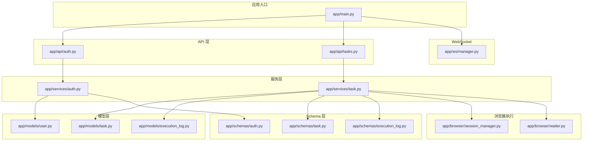
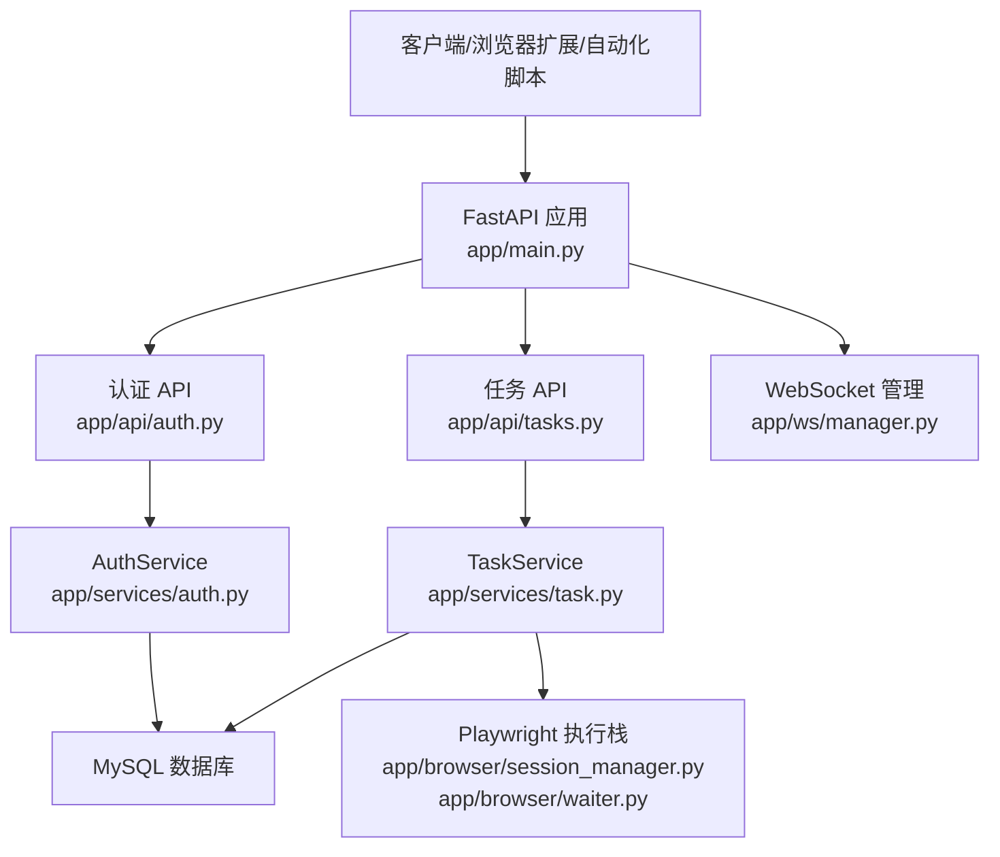
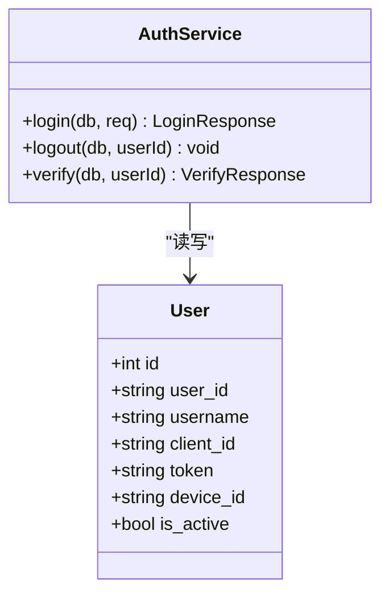
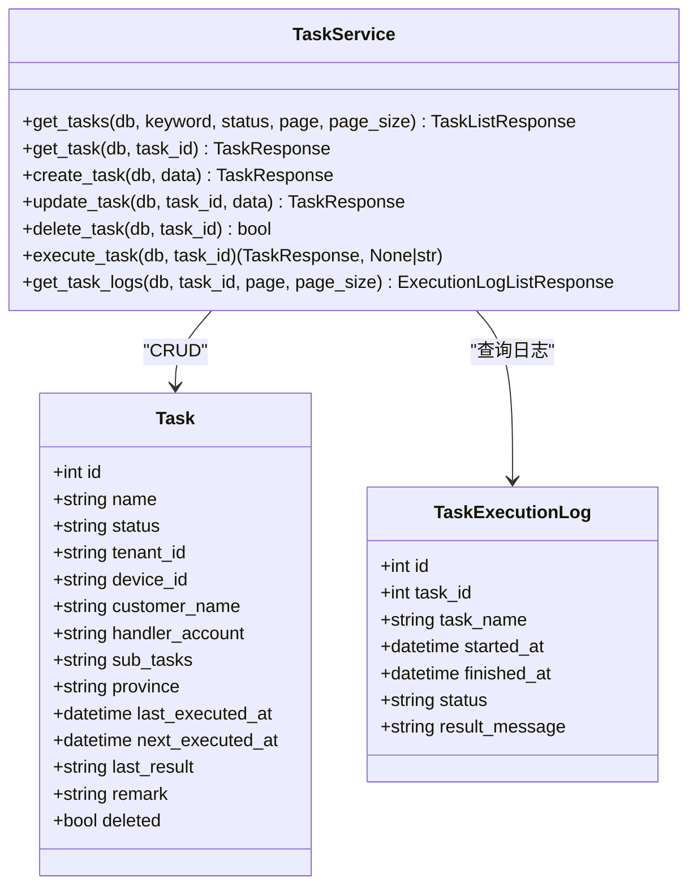
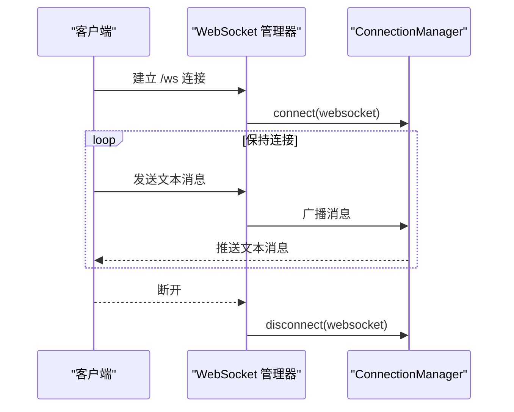
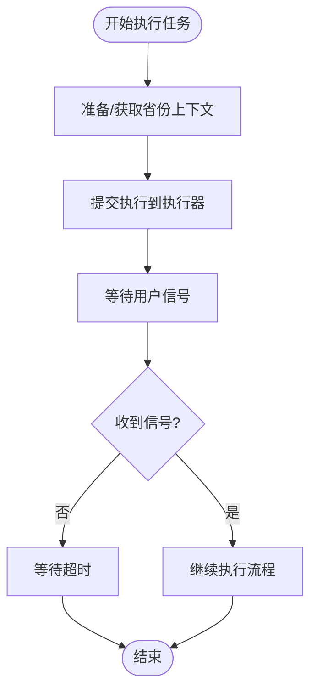
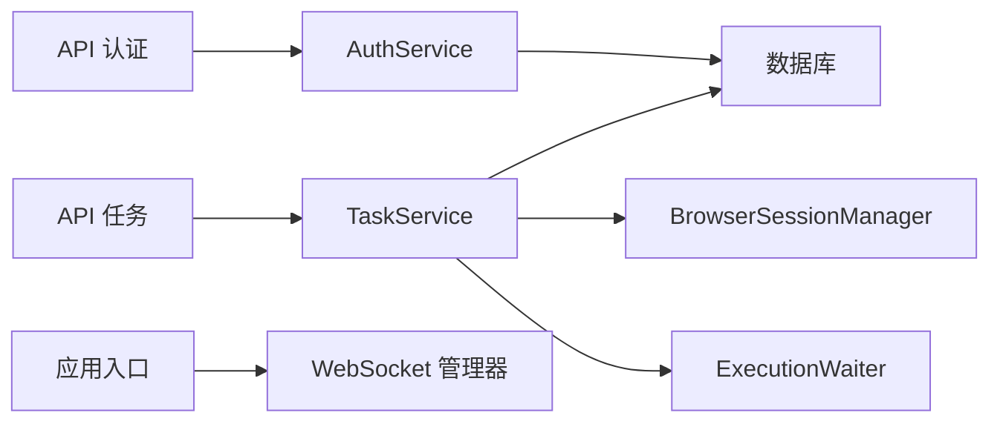

# 统一 REST/WS API 网关

<cite>
**本文引用的文件**
- [main.py](file://CCC_RPA_API/app/main.py)
- [config.py](file://CCC_RPA_API/app/config.py)
- [auth.py](file://CCC_RPA_API/app/api/auth.py)
- [tasks.py](file://CCC_RPA_API/app/api/tasks.py)
- [manager.py](file://CCC_RPA_API/app/ws/manager.py)
- [session_manager.py](file://CCC_RPA_API/app/browser/session_manager.py)
- [waiter.py](file://CCC_RPA_API/app/browser/waiter.py)
- [auth.py](file://CCC_RPA_API/app/schemas/auth.py)
- [task.py](file://CCC_RPA_API/app/schemas/task.py)
- [execution_log.py](file://CCC_RPA_API/app/schemas/execution_log.py)
- [auth.py](file://CCC_RPA_API/app/models/user.py)
- [task.py](file://CCC_RPA_API/app/models/task.py)
- [execution_log.py](file://CCC_RPA_API/app/models/execution_log.py)
</cite>

## 目录
1. [引言](#引言)
2. [项目结构](#项目结构)
3. [核心组件](#核心组件)
4. [架构总览](#架构总览)
5. [详细组件分析](#详细组件分析)
6. [依赖分析](#依赖分析)
7. [性能考虑](#性能考虑)
8. [故障排查指南](#故障排查指南)
9. [结论](#结论)
10. [附录](#附录)

## 引言
本项目为统一的 REST/WS API 网关，围绕“站点任务编排与执行”的业务域构建，提供：
- RESTful HTTP 接口：认证、任务管理、执行日志查询、执行控制等
- WebSocket 实时通道：连接管理与广播
- 多租户与设备维度的任务隔离
- 基于 Playwright 的自动化执行框架，配合“等待/信号”机制实现人机交互式流程编排
- 数据模型与服务层清晰分离，便于扩展与维护

## 项目结构
后端采用 FastAPI + SQLAlchemy 架构，模块划分如下：
- 应用入口与路由注册：app/main.py
- 配置中心：app/config.py
- API 层：app/api/{auth,tasks}.py
- 服务层：app/services/{auth,task}.py
- 模型层：app/models/{user,task,execution_log}.py
- Schema 层：app/schemas/{auth,task,execution_log}.py
- WebSocket 管理：app/ws/manager.py
- 浏览器会话与执行：app/browser/session_manager.py、app/browser/waiter.py

图示来源
- [main.py:1-127](file://CCC_RPA_API/app/main.py#L1-L127)
- [auth.py:1-24](file://CCC_RPA_API/app/api/auth.py#L1-L24)
- [tasks.py:1-76](file://CCC_RPA_API/app/api/tasks.py#L1-L76)
- [manager.py:1-29](file://CCC_RPA_API/app/ws/manager.py#L1-L29)
- [session_manager.py:1-186](file://CCC_RPA_API/app/browser/session_manager.py#L1-L186)
- [waiter.py:1-84](file://CCC_RPA_API/app/browser/waiter.py#L1-L84)
- [auth.py:1-26](file://CCC_RPA_API/app/schemas/auth.py#L1-L26)
- [task.py:1-58](file://CCC_RPA_API/app/schemas/task.py#L1-L58)
- [execution_log.py:1-19](file://CCC_RPA_API/app/schemas/execution_log.py#L1-L19)
- [auth.py:1-17](file://CCC_RPA_API/app/models/user.py#L1-L17)
- [task.py:1-25](file://CCC_RPA_API/app/models/task.py#L1-L25)
- [execution_log.py:1-17](file://CCC_RPA_API/app/models/execution_log.py#L1-L17)

章节来源
- [main.py:1-127](file://CCC_RPA_API/app/main.py#L1-L127)

## 核心组件
- 应用入口与生命周期
  - 启动事件：创建数据库表、迁移新增字段、注入初始任务数据、捕获主事件循环以供 WebSocket 广播
  - 关闭事件：关闭所有浏览器会话
  - 健康检查：/health
- 认证模块
  - 登录：根据 client_id 创建或更新用户记录，发放 token
  - 登出：标记用户为非活跃
  - 校验：校验用户是否有效
- 任务模块
  - 列表/详情/创建/更新/删除
  - 执行任务：异步提交到执行器，状态流转
  - 查询执行日志
  - 交互式控制：扫描完成、选择公司、取消执行
- WebSocket 管理
  - 连接接入、断开清理、广播消息
- 浏览器执行框架
  - 按省份管理 BrowserContext，持久化 storage_state
  - 专用线程执行 Playwright 操作，避免与 asyncio 冲突
  - “等待/信号”机制实现与前端交互式流程编排

章节来源
- [main.py:1-127](file://CCC_RPA_API/app/main.py#L1-L127)
- [auth.py:1-24](file://CCC_RPA_API/app/api/auth.py#L1-L24)
- [tasks.py:1-76](file://CCC_RPA_API/app/api/tasks.py#L1-L76)
- [manager.py:1-29](file://CCC_RPA_API/app/ws/manager.py#L1-L29)
- [session_manager.py:1-186](file://CCC_RPA_API/app/browser/session_manager.py#L1-L186)
- [waiter.py:1-84](file://CCC_RPA_API/app/browser/waiter.py#L1-L84)

## 架构总览
下图展示从客户端到服务端、数据库与浏览器执行子系统的整体交互。

图示来源
- [main.py:1-127](file://CCC_RPA_API/app/main.py#L1-L127)
- [auth.py:1-24](file://CCC_RPA_API/app/api/auth.py#L1-L24)
- [tasks.py:1-76](file://CCC_RPA_API/app/api/tasks.py#L1-L76)
- [manager.py:1-29](file://CCC_RPA_API/app/ws/manager.py#L1-L29)
- [session_manager.py:1-186](file://CCC_RPA_API/app/browser/session_manager.py#L1-L186)
- [waiter.py:1-84](file://CCC_RPA_API/app/browser/waiter.py#L1-L84)

## 详细组件分析

### 认证模块
- 路由
  - POST /api/auth/login：登录发放 token
  - POST /api/auth/logout：登出
  - GET /api/auth/verify：校验用户有效性
- 服务逻辑
  - 依据 client_id 查找或创建用户，更新 token、设备信息与活跃状态
  - 校验时返回用户状态与基本信息
- 数据模型
  - 用户表包含 user_id、client_id、username、token、device_id、is_active

图示来源
- [auth.py:1-26](file://CCC_RPA_API/app/schemas/auth.py#L1-L26)
- [auth.py:1-17](file://CCC_RPA_API/app/models/user.py#L1-L17)
- [services/auth.py:1-58](file://CCC_RPA_API/app/services/auth.py#L1-L58)

章节来源
- [auth.py:1-24](file://CCC_RPA_API/app/api/auth.py#L1-L24)
- [auth.py:1-26](file://CCC_RPA_API/app/schemas/auth.py#L1-L26)
- [auth.py:1-17](file://CCC_RPA_API/app/models/user.py#L1-L17)
- [services/auth.py:1-58](file://CCC_RPA_API/app/services/auth.py#L1-L58)

### 任务模块
- 路由
  - GET /api/tasks：分页列表，支持关键词与状态过滤
  - POST /api/tasks：创建任务
  - GET /api/tasks/{id}：获取任务详情
  - PUT /api/tasks/{id}：更新任务
  - DELETE /api/tasks/{id}：软删除
  - POST /api/tasks/{id}/execute：执行任务（异步提交）
  - GET /api/tasks/{id}/logs：查询执行日志
  - POST /api/tasks/{id}/scan-complete：扫描完成信号
  - POST /api/tasks/{id}/select-company：选择公司信号
  - POST /api/tasks/{id}/cancel-execution：取消执行
- 服务逻辑
  - 分页查询、JSON 字段处理、状态流转、日志查询
  - 执行任务时设置运行态并提交到执行器
- 数据模型
  - 任务表包含名称、状态、多租户与设备标识、省/地区、时间戳、备注、软删除标志等
  - 执行日志表包含任务 ID/名称、开始/结束时间、状态、结果信息

图示来源
- [task.py:1-25](file://CCC_RPA_API/app/models/task.py#L1-L25)
- [execution_log.py:1-17](file://CCC_RPA_API/app/models/execution_log.py#L1-L17)
- [services/task.py:1-157](file://CCC_RPA_API/app/services/task.py#L1-L157)

章节来源
- [tasks.py:1-76](file://CCC_RPA_API/app/api/tasks.py#L1-L76)
- [task.py:1-58](file://CCC_RPA_API/app/schemas/task.py#L1-L58)
- [execution_log.py:1-19](file://CCC_RPA_API/app/schemas/execution_log.py#L1-L19)
- [services/task.py:1-157](file://CCC_RPA_API/app/services/task.py#L1-L157)

### WebSocket 实时通道
- 连接管理
  - 接受连接、维护连接字典、断开清理
  - 广播消息：遍历连接并发送文本消息，自动剔除异常连接
- 端点
  - /ws：接收文本消息，异常时断开

图示来源
- [manager.py:1-29](file://CCC_RPA_API/app/ws/manager.py#L1-L29)
- [main.py:119-127](file://CCC_RPA_API/app/main.py#L119-L127)

章节来源
- [manager.py:1-29](file://CCC_RPA_API/app/ws/manager.py#L1-L29)
- [main.py:119-127](file://CCC_RPA_API/app/main.py#L119-L127)

### 浏览器执行与交互式流程
- 会话管理
  - 按省份维护 BrowserContext，持久化 storage_state，避免重复登录
  - 专用线程执行 Playwright 操作，避免与 asyncio 事件循环冲突
  - 提供恢复与关闭能力
- 等待/信号
  - 使用 threading.Event 实现“等待用户输入/确认”，支持超时与取消
  - 支持非阻塞检查与保活场景

图示来源
- [session_manager.py:1-186](file://CCC_RPA_API/app/browser/session_manager.py#L1-L186)
- [waiter.py:1-84](file://CCC_RPA_API/app/browser/waiter.py#L1-L84)

章节来源
- [session_manager.py:1-186](file://CCC_RPA_API/app/browser/session_manager.py#L1-L186)
- [waiter.py:1-84](file://CCC_RPA_API/app/browser/waiter.py#L1-L84)

## 依赖分析
- 组件耦合
  - API 层仅依赖服务层，服务层依赖模型层与数据库会话
  - WebSocket 管理器与应用入口强耦合，但职责单一
  - 执行器通过服务层间接依赖浏览器会话管理器
- 外部依赖
  - FastAPI、SQLAlchemy、Pydantic、Playwright
- 可能的改进
  - 引入中间件进行统一鉴权与限流
  - 将 WebSocket 广播抽象为事件总线，降低耦合
  - 对执行器增加重试与幂等控制

图示来源
- [main.py:1-127](file://CCC_RPA_API/app/main.py#L1-L127)
- [auth.py:1-24](file://CCC_RPA_API/app/api/auth.py#L1-L24)
- [tasks.py:1-76](file://CCC_RPA_API/app/api/tasks.py#L1-L76)
- [services/auth.py:1-58](file://CCC_RPA_API/app/services/auth.py#L1-L58)
- [services/task.py:1-157](file://CCC_RPA_API/app/services/task.py#L1-L157)
- [manager.py:1-29](file://CCC_RPA_API/app/ws/manager.py#L1-L29)
- [session_manager.py:1-186](file://CCC_RPA_API/app/browser/session_manager.py#L1-L186)
- [waiter.py:1-84](file://CCC_RPA_API/app/browser/waiter.py#L1-L84)

## 性能考虑
- I/O 密集与 CPU 密集分离
  - WebSocket 与 HTTP 请求在 FastAPI 上运行
  - Playwright 操作放入专用线程，避免阻塞事件循环
- 数据库连接
  - 使用依赖注入的 SessionLocal，确保连接复用与及时释放
- 缓存与索引
  - 任务表对常用查询字段建立索引（名称、状态、删除标志），提升分页与过滤性能
- 日志与可观测性
  - 在关键路径添加日志，便于定位性能瓶颈
- 并发与限流
  - 建议引入速率限制中间件，防止突发流量导致执行器过载

## 故障排查指南
- 认证问题
  - 登录失败：检查 client_id、token、设备信息是否正确
  - 校验失败：确认用户是否存在且 is_active 为真
- 任务执行问题
  - 执行无响应：检查执行器是否正常提交；查看日志表状态
  - 等待超时：确认前端是否发送扫描完成/选择公司信号
- WebSocket 问题
  - 连接断开：检查客户端网络与心跳；服务端会自动清理异常连接
- 浏览器会话问题
  - 无法启动：检查 Playwright 初始化日志；必要时调用恢复接口重建上下文

章节来源
- [services/auth.py:1-58](file://CCC_RPA_API/app/services/auth.py#L1-L58)
- [services/task.py:1-157](file://CCC_RPA_API/app/services/task.py#L1-L157)
- [manager.py:1-29](file://CCC_RPA_API/app/ws/manager.py#L1-L29)
- [session_manager.py:1-186](file://CCC_RPA_API/app/browser/session_manager.py#L1-L186)
- [waiter.py:1-84](file://CCC_RPA_API/app/browser/waiter.py#L1-L84)

## 结论
该网关以清晰的分层架构实现了 REST/WS 的统一接入，结合浏览器执行框架与交互式等待机制，满足多租户、多设备维度的任务编排需求。后续可在鉴权、限流、可观测性与扩展性方面进一步增强，以支撑更大规模的自动化场景。

## 附录

### 接口清单与规范
- 认证
  - POST /api/auth/login：登录，返回用户标识与 token
  - POST /api/auth/logout：登出，标记用户非活跃
  - GET /api/auth/verify：校验用户有效性
- 任务
  - GET /api/tasks：分页列表，支持 keyword 与 status 过滤
  - POST /api/tasks：创建任务
  - GET /api/tasks/{id}：获取任务详情
  - PUT /api/tasks/{id}：更新任务
  - DELETE /api/tasks/{id}：软删除
  - POST /api/tasks/{id}/execute：执行任务（异步）
  - GET /api/tasks/{id}/logs：查询执行日志
  - POST /api/tasks/{id}/scan-complete：扫描完成信号
  - POST /api/tasks/{id}/select-company：选择公司信号
  - POST /api/tasks/{id}/cancel-execution：取消执行
- WebSocket
  - /ws：文本消息推送与广播

章节来源
- [auth.py:1-24](file://CCC_RPA_API/app/api/auth.py#L1-L24)
- [tasks.py:1-76](file://CCC_RPA_API/app/api/tasks.py#L1-L76)
- [main.py:119-127](file://CCC_RPA_API/app/main.py#L119-L127)

### 请求/响应规范与错误码
- 成功响应
  - 一般返回标准对象或 {message: "..."} 结构
- 错误响应
  - 未找到：HTTP 404，detail 指示资源不存在
  - 参数错误/执行失败：HTTP 400，detail 包含错误信息
- 建议
  - 统一错误体结构，包含 code、message、details 字段
  - 明确区分业务错误与系统错误

章节来源
- [tasks.py:26-52](file://CCC_RPA_API/app/api/tasks.py#L26-L52)

### 限流策略
- 建议
  - 基于 IP/用户维度的令牌桶或漏桶算法
  - 对高频接口（如执行、日志查询）单独限流
  - 配置不同等级的配额与宽限期

### API 版本管理与 OpenAPI 文档
- 版本管理
  - 通过 URL 前缀或 Accept 头进行版本区分
- OpenAPI 3.0
  - 使用 FastAPI 自动生成文档，路径 /docs 与 /redoc
  - 建议补充 tags、描述、示例与安全方案

### 多租户与 RBAC
- 多租户
  - 任务模型包含 tenant_id 字段，可在查询与执行时按租户隔离
- RBAC
  - 建议在中间件中引入角色/权限校验，结合用户表扩展权限字段

### 审计日志
- 建议
  - 记录关键操作（登录、任务执行、日志查询）的时间、用户、IP、参数摘要与结果
  - 采用异步写入，避免阻塞主流程

### SDK 集成指南
- 建议
  - 生成 OpenAPI 客户端 SDK，封装认证、重试、超时与重定向
  - 提供 TypeScript/Python 示例，演示常见场景

### 性能优化建议
- 连接池与缓存
  - 数据库连接池参数调优
  - 对热点数据增加缓存（如用户信息）
- 并发与队列
  - 执行器使用队列与并发上限控制
- 监控与告警
  - 指标埋点：QPS、P95/P99 延迟、错误率、执行耗时分布

### Playwright 与 Chrome 扩展的统一管理
- 统一入口
  - 通过 /api/tasks/{id}/execute 触发执行，内部调度到浏览器执行栈
- 设备与会话
  - 按省份维护上下文，持久化 storage_state，减少登录成本
- 交互式流程
  - 使用 /api/tasks/{id}/scan-complete 与 /api/tasks/{id}/select-company 与前端/扩展协同

章节来源
- [session_manager.py:1-186](file://CCC_RPA_API/app/browser/session_manager.py#L1-L186)
- [waiter.py:1-84](file://CCC_RPA_API/app/browser/waiter.py#L1-L84)
- [tasks.py:60-75](file://CCC_RPA_API/app/api/tasks.py#L60-L75)