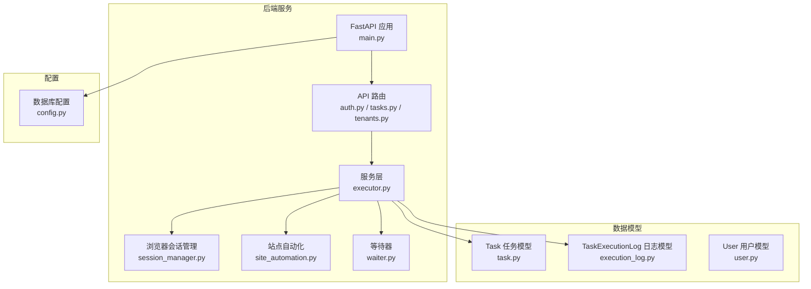
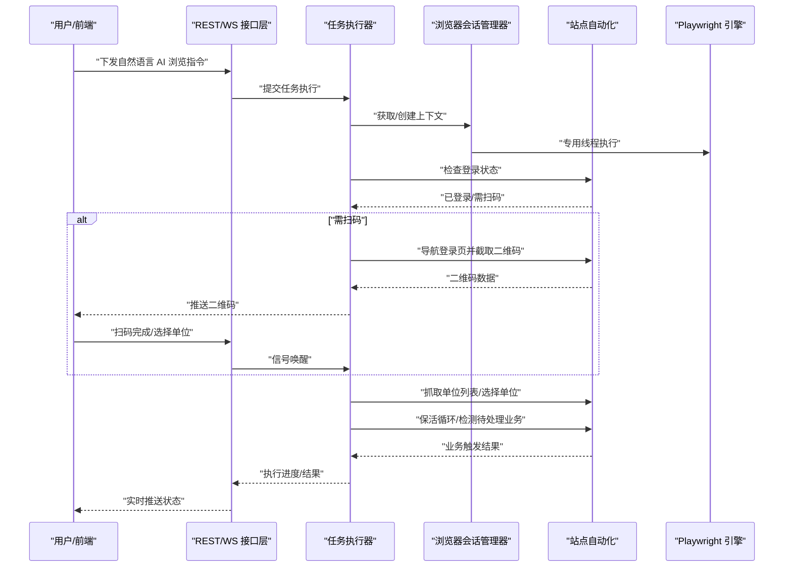
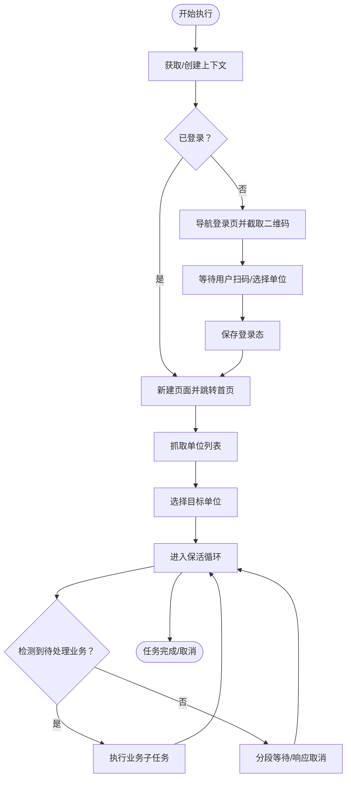
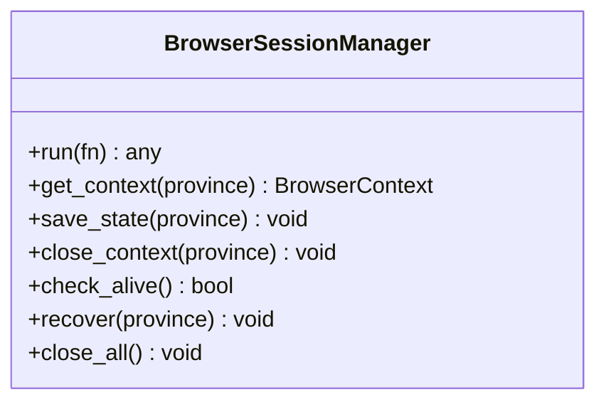
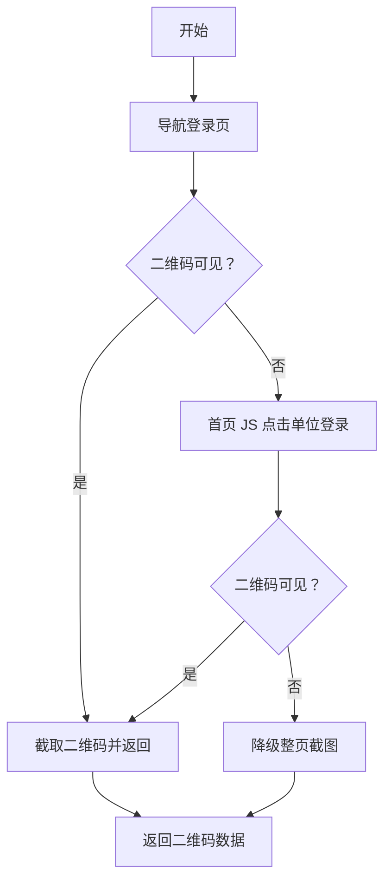
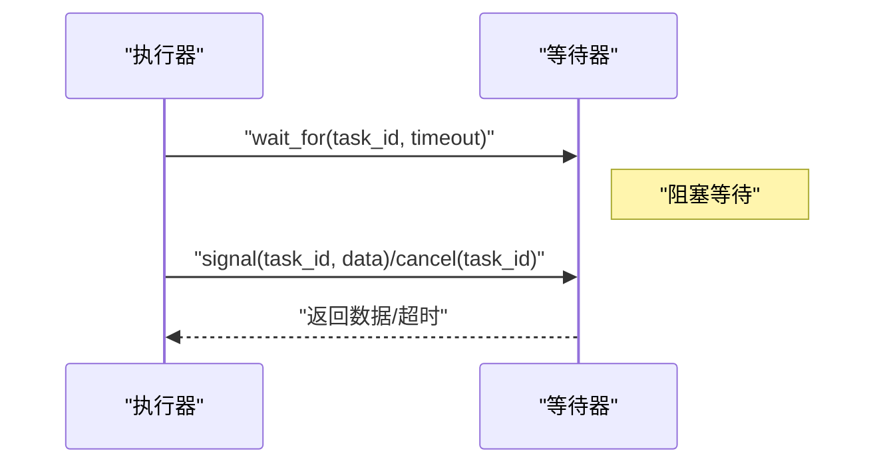
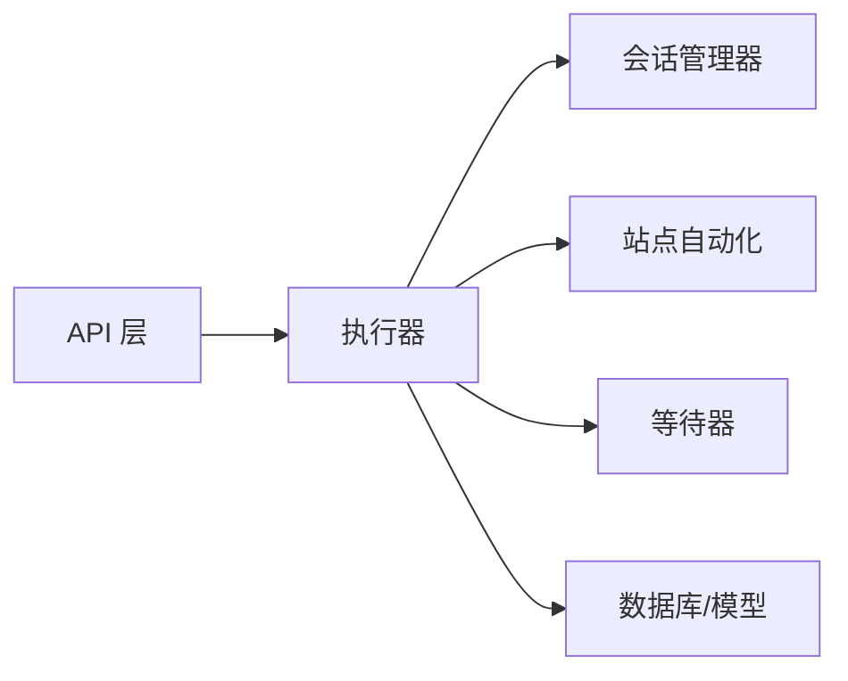

# LLM 推理服务

<cite>
**本文引用的文件**
- [main.py](file://CCC_RPA_API/app/main.py)
- [config.py](file://CCC_RPA_API/app/config.py)
- [task.py](file://CCC_RPA_API/app/models/task.py)
- [execution_log.py](file://CCC_RPA_API/app/models/execution_log.py)
- [user.py](file://CCC_RPA_API/app/models/user.py)
- [executor.py](file://CCC_RPA_API/app/services/executor.py)
- [site_automation.py](file://CCC_RPA_API/app/browser/site_automation.py)
- [session_manager.py](file://CCC_RPA_API/app/browser/session_manager.py)
- [waiter.py](file://CCC_RPA_API/app/browser/waiter.py)
- [tasks.py](file://CCC_RPA_API/app/api/tasks.py)
- [auth.py](file://CCC_RPA_API/app/api/auth.py)
- [tenants.py](file://CCC_RPA_API/app/api/tenants.py)
- [project.md](file://project.md)
</cite>

## 目录
1. [简介](#简介)
2. [项目结构](#项目结构)
3. [核心组件](#核心组件)
4. [架构总览](#架构总览)
5. [详细组件分析](#详细组件分析)
6. [依赖分析](#依赖分析)
7. [性能考虑](#性能考虑)
8. [故障排查指南](#故障排查指南)
9. [结论](#结论)
10. [附录](#附录)

## 简介
本文件面向 Ollama LLM Agent 的 GRPC 推理服务，结合现有代码库与统一接口契约，系统化梳理自然语言指令解析到 Playwright 操作步骤的转换机制、多步骤标准化操作序列生成、弹窗与验证码识别的自适应流程决策；并基于现有实现说明 NVIDIA GPU 加速配置、纯 CPU 离线双模式部署、推理超时处理与模型加载失败的容错机制；阐述租户独立 AI 记忆上下文的实现思路（含会话绑定与隔离策略），以及 GRPC 推理接口的完整规范（ParsePageTask、ExtractStructData、OCRImage 的参数与返回约定）。由于仓库未包含 GRPC 服务端实现，本文以“统一接口契约”为依据，给出可落地的实现建议与最佳实践。

## 项目结构
- 后端服务采用 FastAPI 提供 REST/WS 能力，Playwright 在专用线程中执行，确保与异步事件循环解耦。
- 数据模型覆盖任务、执行日志、用户等核心实体，数据库连接通过 SQLAlchemy 管理。
- 业务逻辑集中在执行器与站点自动化模块，围绕扫码登录、单位选择、保活循环与业务触发展开。
- 统一接口契约明确了 GRPC 推理服务方法与参数结构，作为本服务的对外规范。

图表来源
- [main.py:1-127](file://CCC_RPA_API/app/main.py#L1-L127)
- [auth.py:1-24](file://CCC_RPA_API/app/api/auth.py#L1-L24)
- [tasks.py:1-76](file://CCC_RPA_API/app/api/tasks.py#L1-L76)
- [executor.py:1-319](file://CCC_RPA_API/app/services/executor.py#L1-L319)
- [session_manager.py:1-186](file://CCC_RPA_API/app/browser/session_manager.py#L1-L186)
- [site_automation.py:1-743](file://CCC_RPA_API/app/browser/site_automation.py#L1-L743)
- [waiter.py:1-84](file://CCC_RPA_API/app/browser/waiter.py#L1-L84)
- [task.py:1-25](file://CCC_RPA_API/app/models/task.py#L1-L25)
- [execution_log.py:1-17](file://CCC_RPA_API/app/models/execution_log.py#L1-L17)
- [user.py:1-17](file://CCC_RPA_API/app/models/user.py#L1-L17)
- [config.py:1-22](file://CCC_RPA_API/app/config.py#L1-L22)

章节来源
- [main.py:1-127](file://CCC_RPA_API/app/main.py#L1-L127)
- [config.py:1-22](file://CCC_RPA_API/app/config.py#L1-L22)
- [task.py:1-25](file://CCC_RPA_API/app/models/task.py#L1-L25)
- [execution_log.py:1-17](file://CCC_RPA_API/app/models/execution_log.py#L1-L17)
- [user.py:1-17](file://CCC_RPA_API/app/models/user.py#L1-L17)
- [executor.py:1-319](file://CCC_RPA_API/app/services/executor.py#L1-L319)
- [site_automation.py:1-743](file://CCC_RPA_API/app/browser/site_automation.py#L1-L743)
- [session_manager.py:1-186](file://CCC_RPA_API/app/browser/session_manager.py#L1-L186)
- [waiter.py:1-84](file://CCC_RPA_API/app/browser/waiter.py#L1-L84)
- [tasks.py:1-76](file://CCC_RPA_API/app/api/tasks.py#L1-L76)
- [auth.py:1-24](file://CCC_RPA_API/app/api/auth.py#L1-L24)
- [tenants.py:1-24](file://CCC_RPA_API/app/api/tenants.py#L1-L24)

## 核心组件
- 任务执行器：负责任务生命周期管理、扫码登录、单位选择、保活循环与业务触发，统一通过浏览器会话管理器在专用线程中执行 Playwright 操作。
- 浏览器会话管理器：按省份维护独立上下文，持久化 storage_state，提供线程安全的执行队列与恢复能力。
- 站点自动化：封装登录、扫码、单位列表抓取、单位选择、保活与业务检测等动作，具备多策略降级与弹窗自愈能力。
- 等待器：基于 Event 的非阻塞等待/唤醒机制，支持取消与超时。
- API 层：REST/WS 提供认证、任务管理、扫码完成与单位选择等接口，驱动执行器流转。

章节来源
- [executor.py:1-319](file://CCC_RPA_API/app/services/executor.py#L1-L319)
- [session_manager.py:1-186](file://CCC_RPA_API/app/browser/session_manager.py#L1-L186)
- [site_automation.py:1-743](file://CCC_RPA_API/app/browser/site_automation.py#L1-L743)
- [waiter.py:1-84](file://CCC_RPA_API/app/browser/waiter.py#L1-L84)
- [tasks.py:1-76](file://CCC_RPA_API/app/api/tasks.py#L1-L76)
- [auth.py:1-24](file://CCC_RPA_API/app/api/auth.py#L1-L24)

## 架构总览
下图展示从自然语言指令到 Playwright 操作步骤的端到端流程，以及与 GRPC 推理服务的对接位置（统一接口契约定义）。

图表来源
- [executor.py:78-319](file://CCC_RPA_API/app/services/executor.py#L78-L319)
- [site_automation.py:38-541](file://CCC_RPA_API/app/browser/site_automation.py#L38-L541)
- [session_manager.py:80-126](file://CCC_RPA_API/app/browser/session_manager.py#L80-L126)
- [tasks.py:60-76](file://CCC_RPA_API/app/api/tasks.py#L60-L76)

## 详细组件分析

### 任务执行器（executor）
- 职责：任务生命周期管理、扫码登录、单位选择、保活循环、业务触发、错误处理与状态上报。
- 关键流程：
  - 初始化浏览器上下文与登录态检查。
  - 二维码截取与前端推送，等待用户扫码/选择单位。
  - 单位选择与登录按钮点击，保活循环维持页面活跃。
  - 检测待处理业务并执行对应子任务。
- 容错与恢复：浏览器异常自动恢复、检查点截图、超时与取消信号处理。

图表来源
- [executor.py:78-319](file://CCC_RPA_API/app/services/executor.py#L78-L319)

章节来源
- [executor.py:1-319](file://CCC_RPA_API/app/services/executor.py#L1-L319)

### 浏览器会话管理器（session_manager）
- 职责：按省份维护独立 BrowserContext，持久化 storage_state，提供专用线程执行队列与恢复能力。
- 特性：延迟初始化、线程安全、超时保护、异常恢复、关闭清理。

图表来源
- [session_manager.py:10-186](file://CCC_RPA_API/app/browser/session_manager.py#L10-L186)

章节来源
- [session_manager.py:1-186](file://CCC_RPA_API/app/browser/session_manager.py#L1-L186)

### 站点自动化（site_automation）
- 职责：封装登录、扫码、单位列表抓取、单位选择、保活与业务检测。
- 自适应策略：
  - 登录页导航：直连登录页失败时退回首页 JS 点击。
  - 二维码截取：优先元素截图，失败降级整页截图。
  - 单位选择：多选择器降级、JS 回退、登录按钮点击。
  - 保活：随机滚动/点击/等待，自动关闭意外弹窗。
  - 业务检测：徽章计数与关键词匹配。

图表来源
- [site_automation.py:61-173](file://CCC_RPA_API/app/browser/site_automation.py#L61-L173)

章节来源
- [site_automation.py:1-743](file://CCC_RPA_API/app/browser/site_automation.py#L1-L743)

### 等待器（waiter）
- 职责：非阻塞等待用户操作，支持超时、取消与数据传递。
- 场景：扫码等待、单位选择等待、保活循环中取消信号检查。

图表来源
- [waiter.py:14-84](file://CCC_RPA_API/app/browser/waiter.py#L14-L84)
- [tasks.py:60-76](file://CCC_RPA_API/app/api/tasks.py#L60-L76)

章节来源
- [waiter.py:1-84](file://CCC_RPA_API/app/browser/waiter.py#L1-L84)
- [tasks.py:1-76](file://CCC_RPA_API/app/api/tasks.py#L1-L76)

### GRPC 推理接口规范（基于统一接口契约）
以下为面向 Ollama LLM Agent 的 GRPC 推理服务方法规范，参数与返回结构遵循统一接口契约，便于与调度中心/浏览器扩展互通。

- ParsePageTask
  - 输入：DOM、screenshot、userCommand
  - 输出：Playwright 操作步骤列表（包含定位策略、动作类型、参数）
  - 用途：将自然语言指令转换为可执行的页面操作序列
- ExtractStructData
  - 输入：DOM、ruleJson
  - 输出：结构化 JSON 数据
  - 用途：从页面中抽取结构化信息
- OCRImage
  - 输入：imageBuffer
  - 输出：识别文本结果
  - 用途：对图像中的验证码/文字进行识别

章节来源
- [project.md:467-474](file://project.md#L467-L474)

## 依赖分析
- 组件耦合：
  - 执行器依赖会话管理器与站点自动化，保证 Playwright 操作的线程安全与稳定性。
  - API 层通过等待器与执行器解耦，实现用户交互与自动化流程的解耦。
- 外部依赖：
  - Playwright（Chromium）、MySQL（SQLAlchemy）、FastAPI（WebSocket/REST）。
- 潜在风险：
  - Playwright 与 asyncio 事件循环分离，避免同步 API 导致的死锁。
  - 数据库迁移与列扩展在启动时进行，需注意并发与回滚。

图表来源
- [main.py:1-127](file://CCC_RPA_API/app/main.py#L1-L127)
- [executor.py:1-319](file://CCC_RPA_API/app/services/executor.py#L1-L319)
- [session_manager.py:1-186](file://CCC_RPA_API/app/browser/session_manager.py#L1-L186)
- [site_automation.py:1-743](file://CCC_RPA_API/app/browser/site_automation.py#L1-L743)
- [waiter.py:1-84](file://CCC_RPA_API/app/browser/waiter.py#L1-L84)
- [task.py:1-25](file://CCC_RPA_API/app/models/task.py#L1-L25)
- [execution_log.py:1-17](file://CCC_RPA_API/app/models/execution_log.py#L1-L17)
- [user.py:1-17](file://CCC_RPA_API/app/models/user.py#L1-L17)

章节来源
- [main.py:1-127](file://CCC_RPA_API/app/main.py#L1-L127)
- [executor.py:1-319](file://CCC_RPA_API/app/services/executor.py#L1-L319)

## 性能考虑
- 会话创建与复用：按省份维护独立上下文，减少重复登录开销；storage_state 持久化降低初始化时间。
- 保活策略：随机滚动/点击/等待，避免固定模式被反爬检测；分段等待便于快速响应取消。
- 超时与恢复：Playwright 操作超时保护与浏览器异常恢复，保障长时间运行稳定性。
- 线程隔离：专用线程执行 Playwright，避免阻塞主事件循环与 API 请求。

## 故障排查指南
- 浏览器异常
  - 现象：页面定位失败、元素不可见、浏览器关闭。
  - 处理：检查会话存活状态，触发恢复流程并重建上下文与页面。
- 扫码/选择超时
  - 现象：用户未扫码或未选择单位。
  - 处理：等待器超时抛出异常，执行器记录失败并上报。
- 登录态丢失
  - 现象：页面跳转至登录页或未检测到登录元素。
  - 处理：重新执行扫码登录流程并保存状态。
- 业务检测误判
  - 现象：徽章计数或关键词匹配不准确。
  - 处理：站点自动化提供多策略降级与文本分析，必要时人工干预。

章节来源
- [executor.py:42-70](file://CCC_RPA_API/app/services/executor.py#L42-L70)
- [executor.py:133-140](file://CCC_RPA_API/app/services/executor.py#L133-L140)
- [site_automation.py:38-58](file://CCC_RPA_API/app/browser/site_automation.py#L38-L58)
- [site_automation.py:175-192](file://CCC_RPA_API/app/browser/site_automation.py#L175-L192)

## 结论
本服务以“统一接口契约”为规范，结合 Playwright 的专用线程执行模型与多策略降级机制，实现了从自然语言指令到页面操作步骤的稳健转换。通过按省份隔离的浏览器上下文与 storage_state 持久化，满足租户独立会话与状态隔离的需求。对于 GRPC 推理服务，建议在现有 API 基础上扩展 ParsePageTask、ExtractStructData、OCRImage 三个方法，严格遵循统一参数与返回结构，确保与调度中心与浏览器扩展的无缝互通。

## 附录

### 租户独立 AI 记忆上下文实现建议
- 会话绑定：以 tenant_id 与 province 维度绑定 BrowserContext，确保同一租户在同一省份的会话一致性。
- 记忆隔离：不同租户的 storage_state 文件独立存放，避免 Cookie/LocalStorage 泄露。
- SQLite 与 Milvus 差异化设计：
  - SQLite：适合轻量级、低并发的记忆检索与结构化数据存储。
  - Milvus：适合大规模向量检索与相似度匹配，支持多租户向量集合隔离。
- 容错与恢复：会话异常时按租户维度重建上下文，保证记忆与状态的连续性。

章节来源
- [session_manager.py:99-126](file://CCC_RPA_API/app/browser/session_manager.py#L99-L126)
- [project.md:467-474](file://project.md#L467-L474)

### NVIDIA GPU 加速与纯 CPU 离线双模式部署
- NVIDIA GPU 加速：在部署环境中启用 CUDA 支持，确保推理服务与 Ollama 本地模型运行在 GPU 上，缩短响应时间。
- 纯 CPU 离线双模式：在资源受限环境下，通过环境变量或配置项切换至纯 CPU 模式，保证服务可用性与稳定性。
- 模型加载失败容错：在启动阶段进行健康检查，若模型加载失败，回退至本地缓存或提示人工介入。

章节来源
- [project.md:500-530](file://project.md#L500-L530)

### GRPC 推理接口参数与返回规范（建议）
- ParsePageTask
  - 参数：DOM 字符串、screenshot 图像缓冲区、userCommand 字符串
  - 返回：操作步骤数组（包含定位器、动作类型、参数、延时等）
- ExtractStructData
  - 参数：DOM 字符串、ruleJson 规则对象
  - 返回：JSON 结构化数据
- OCRImage
  - 参数：imageBuffer 图像字节流
  - 返回：识别文本字符串

章节来源
- [project.md:467-474](file://project.md#L467-L474)