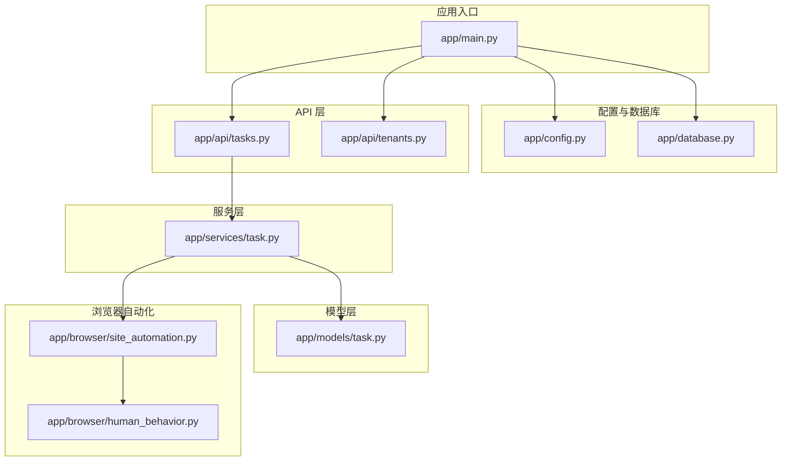
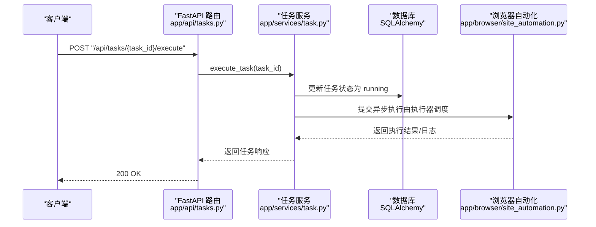
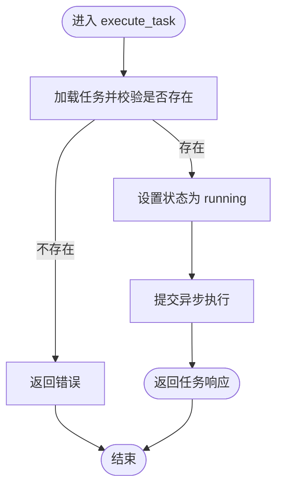
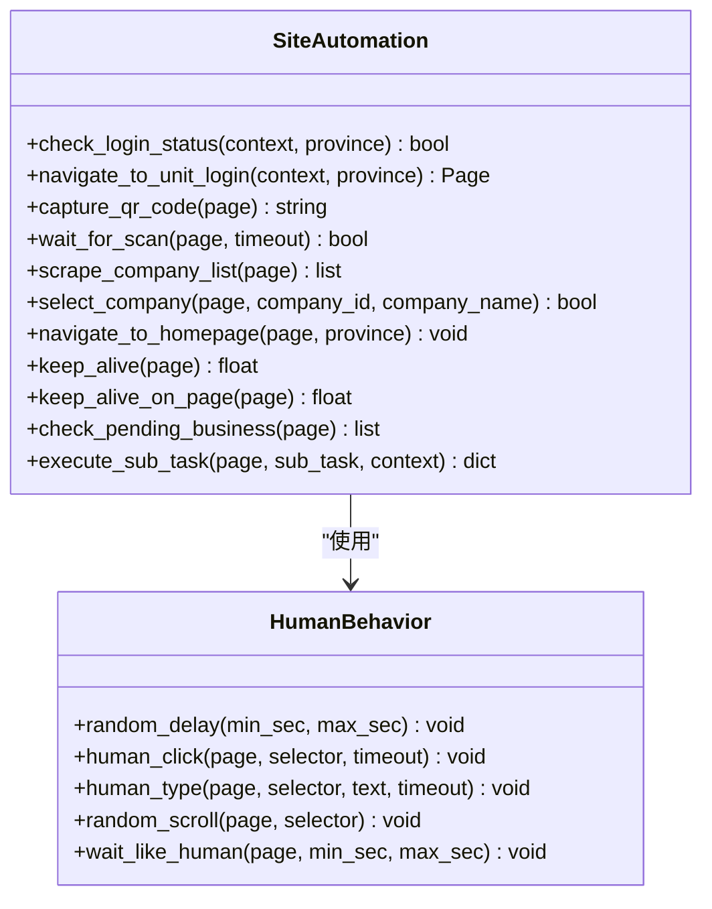
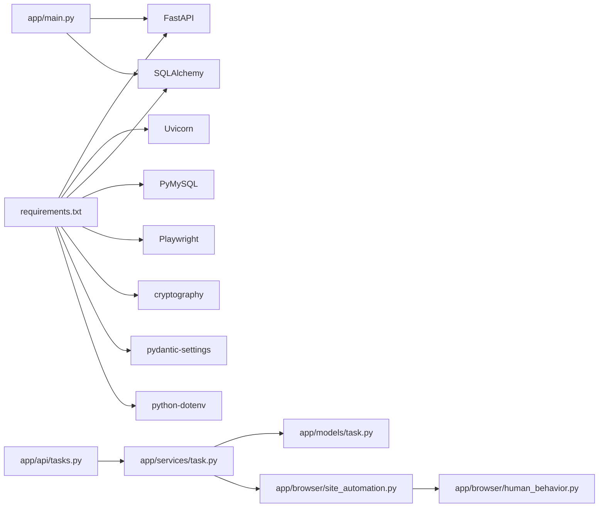

# 层4：AI 智能驱动微服务层

<cite>
**本文档引用的文件**
- [main.py](file://CCC_RPA_API/app/main.py)
- [config.py](file://CCC_RPA_API/app/config.py)
- [database.py](file://CCC_RPA_API/app/database.py)
- [requirements.txt](file://CCC_RPA_API/requirements.txt)
- [tasks.py](file://CCC_RPA_API/app/api/tasks.py)
- [task.py](file://CCC_RPA_API/app/services/task.py)
- [task.py](file://CCC_RPA_API/app/models/task.py)
- [site_automation.py](file://CCC_RPA_API/app/browser/site_automation.py)
- [human_behavior.py](file://CCC_RPA_API/app/browser/human_behavior.py)
- [tenants.py](file://CCC_RPA_API/app/api/tenants.py)
</cite>

## 目录
1. [简介](#简介)
2. [项目结构](#项目结构)
3. [核心组件](#核心组件)
4. [架构总览](#架构总览)
5. [详细组件分析](#详细组件分析)
6. [依赖分析](#依赖分析)
7. [性能考虑](#性能考虑)
8. [故障排查指南](#故障排查指南)
9. [结论](#结论)
10. [附录](#附录)

## 简介
本文件面向商用级 AI 浏览器系统的“AI 智能驱动微服务层”，聚焦以下能力与实现：
- 基于 Playwright 的页面智能驱动与自动化执行
- 页面视觉识别与交互（页面元素定位、点击、滚动、等待）
- 自然语言指令解析与任务编排（通过任务模型与服务层）
- 任务执行日志与状态管理
- 租户隔离与数据边界控制
- 微服务化架构下的可扩展性与可观测性

说明：当前仓库未包含 gRPC 推理服务、YOLOv8/PaddleOCR 集成、结构化抽取规则引擎、向量记忆库（SQLite/Milvus）等模块的具体实现。本文档基于现有代码进行准确解读，并对缺失部分给出概念性设计建议与落地路径。

## 项目结构
后端采用 FastAPI 提供 REST API，结合 SQLAlchemy ORM 访问 MySQL，Playwright 控制浏览器执行自动化任务。核心目录与职责如下：
- 应用入口与路由注册：app/main.py
- 配置与数据库连接：app/config.py、app/database.py
- API 层：app/api/*（任务、租户等接口）
- 服务层：app/services/*（业务逻辑）
- 模型层：app/models/*（数据库映射）
- 浏览器自动化：app/browser/*（页面操作、人类行为模拟）

**图表来源**
- [main.py:1-127](file://CCC_RPA_API/app/main.py#L1-L127)
- [config.py:1-22](file://CCC_RPA_API/app/config.py#L1-L22)
- [database.py:1-19](file://CCC_RPA_API/app/database.py#L1-L19)
- [tasks.py:1-76](file://CCC_RPA_API/app/api/tasks.py#L1-L76)
- [task.py:1-157](file://CCC_RPA_API/app/services/task.py#L1-L157)
- [task.py:1-25](file://CCC_RPA_API/app/models/task.py#L1-L25)
- [site_automation.py:1-743](file://CCC_RPA_API/app/browser/site_automation.py#L1-L743)
- [human_behavior.py:1-86](file://CCC_RPA_API/app/browser/human_behavior.py#L1-L86)
- [tenants.py:1-25](file://CCC_RPA_API/app/api/tenants.py#L1-L25)

**章节来源**
- [main.py:1-127](file://CCC_RPA_API/app/main.py#L1-L127)
- [config.py:1-22](file://CCC_RPA_API/app/config.py#L1-L22)
- [database.py:1-19](file://CCC_RPA_API/app/database.py#L1-L19)
- [requirements.txt:1-11](file://CCC_RPA_API/requirements.txt#L1-L11)

## 核心组件
- 应用入口与生命周期
  - 初始化 FastAPI 应用、CORS、WebSocket 管理器
  - 启动时创建数据库表结构、迁移附加列、插入示例任务
  - 关闭时清理浏览器会话
- 配置与数据库
  - 通过 pydantic-settings 读取环境变量，构造 MySQL 连接
  - 使用 SQLAlchemy 创建 engine、sessionmaker，提供 get_db 依赖注入
- API 层
  - 任务接口：分页查询、创建、更新、删除、执行、查看日志、扫描完成信号、公司选择信号、取消执行
  - 租户接口：租户列表（Mock 数据）
- 服务层
  - 任务服务：封装查询、创建、更新、删除、执行、日志查询；执行时设置状态并提交异步执行
- 模型层
  - 任务模型：包含名称、状态、租户 ID、设备 ID、客户名、经办账号、子任务 JSON、省、时间戳、备注、软删除等字段
- 浏览器自动化
  - SiteAutomation：针对特定站点的登录、扫码、单位列表抓取、单位选择、页面保活、待处理业务检查等
  - HumanBehavior：模拟人类点击、输入、滚动、等待等行为

**章节来源**
- [main.py:1-127](file://CCC_RPA_API/app/main.py#L1-L127)
- [config.py:1-22](file://CCC_RPA_API/app/config.py#L1-L22)
- [database.py:1-19](file://CCC_RPA_API/app/database.py#L1-L19)
- [tasks.py:1-76](file://CCC_RPA_API/app/api/tasks.py#L1-L76)
- [task.py:1-157](file://CCC_RPA_API/app/services/task.py#L1-L157)
- [task.py:1-25](file://CCC_RPA_API/app/models/task.py#L1-L25)
- [site_automation.py:1-743](file://CCC_RPA_API/app/browser/site_automation.py#L1-L743)
- [human_behavior.py:1-86](file://CCC_RPA_API/app/browser/human_behavior.py#L1-L86)
- [tenants.py:1-25](file://CCC_RPA_API/app/api/tenants.py#L1-L25)

## 架构总览
下图展示从 API 到服务层再到浏览器自动化的调用链路，以及数据库与配置的关系。

**图表来源**
- [tasks.py:47-52](file://CCC_RPA_API/app/api/tasks.py#L47-L52)
- [task.py:120-133](file://CCC_RPA_API/app/services/task.py#L120-L133)
- [site_automation.py:1-743](file://CCC_RPA_API/app/browser/site_automation.py#L1-L743)

## 详细组件分析

### 组件一：任务执行与状态管理
- 功能要点
  - 任务状态流转：pending → running → completed/failed
  - 任务日志：记录开始时间、结束时间、状态、结果消息
  - 信号机制：扫描完成、公司选择、取消执行
- 关键流程
  - 执行任务时设置状态并提交异步执行
  - 日志分页查询，支持按任务 ID 过滤
- 数据模型
  - 任务表包含租户 ID、设备 ID、客户名、经办账号、子任务 JSON、省、时间戳、备注、软删除等

**图表来源**
- [task.py:120-133](file://CCC_RPA_API/app/services/task.py#L120-L133)

**章节来源**
- [tasks.py:47-75](file://CCC_RPA_API/app/api/tasks.py#L47-L75)
- [task.py:119-157](file://CCC_RPA_API/app/services/task.py#L119-L157)
- [task.py:8-25](file://CCC_RPA_API/app/models/task.py#L8-L25)

### 组件二：页面智能驱动与人类行为模拟
- SiteAutomation
  - 登录状态检查、单位登录页导航、二维码截图、等待扫码成功
  - 单位列表抓取（多选择器降级策略）、单位选择（多种匹配策略+JS回退）、登录按钮点击
  - 页面保活（滚动、点击刷新、随机移动、等待）、待处理业务检查、子任务占位执行
- HumanBehavior
  - 点击：鼠标移动到元素中心附近（带随机偏移）再点击
  - 输入：逐字符输入，字符间随机延迟
  - 滚动：随机滚动页面，模拟浏览行为
  - 等待：随机等待，模拟人类阅读

**图表来源**
- [site_automation.py:16-743](file://CCC_RPA_API/app/browser/site_automation.py#L16-L743)
- [human_behavior.py:12-86](file://CCC_RPA_API/app/browser/human_behavior.py#L12-L86)

**章节来源**
- [site_automation.py:1-743](file://CCC_RPA_API/app/browser/site_automation.py#L1-L743)
- [human_behavior.py:1-86](file://CCC_RPA_API/app/browser/human_behavior.py#L1-L86)

### 组件三：租户管理与数据隔离
- 当前实现
  - 租户列表接口返回 Mock 数据
  - 任务模型包含 tenant_id 字段，便于后续实现租户隔离
- 设计建议
  - 在 API 层增加租户上下文校验
  - 在服务层与模型层强制按 tenant_id 过滤
  - 在数据库层面通过唯一索引与视图保障数据边界

**章节来源**
- [tenants.py:1-25](file://CCC_RPA_API/app/api/tenants.py#L1-L25)
- [task.py](file://CCC_RPA_API/app/models/task.py#L14)

### 组件四：自然语言指令解析与任务编排
- 当前实现
  - 任务模型支持 sub_tasks JSON 字段，可用于承载子任务编排
  - SiteAutomation 提供占位方法 execute_sub_task
- 设计建议
  - 引入 NLU 解析器（如本地 LLM 或规则引擎）将自然语言转换为结构化子任务序列
  - 在服务层实现子任务调度器，按依赖顺序执行
  - 结合租户维度的规则模板库，实现个性化编排

**章节来源**
- [task.py](file://CCC_RPA_API/app/models/task.py#L18)
- [site_automation.py:738-742](file://CCC_RPA_API/app/browser/site_automation.py#L738-L742)

### 组件五：页面元素识别与 OCR 文字识别
- 当前实现
  - 页面元素定位采用 Playwright 多选择器降级策略
  - 二维码截图采用元素截图与整页截图降级方案
- 设计建议
  - 集成 YOLOv8 进行页面元素检测（如按钮、输入框、表格单元）
  - 集成 PaddleOCR 进行文字识别，结合版面分析提升精度
  - 对 OCR 结果进行后处理（正则、词典、上下文消歧）

**章节来源**
- [site_automation.py:148-173](file://CCC_RPA_API/app/browser/site_automation.py#L148-L173)
- [site_automation.py:213-291](file://CCC_RPA_API/app/browser/site_automation.py#L213-L291)

### 组件六：结构化数据抽取与规则引擎
- 当前实现
  - 页面文本提取与正则匹配用于单位信息抽取
- 设计建议
  - 基于规则引擎（如 DRL、Drools 或自研规则 DSL）定义抽取规则
  - 支持正则、关键词、位置约束、上下文依赖等多维规则
  - 规则版本化与租户定制化

**章节来源**
- [site_automation.py:264-291](file://CCC_RPA_API/app/browser/site_automation.py#L264-L291)

### 组件七：向量记忆库与租户隔离
- 当前实现
  - 未发现 SQLite/Milvus 相关实现
- 设计建议
  - SQLite 单机存储：适合开发/测试/小规模场景，使用向量化嵌入与相似度检索
  - Milvus 集群：生产推荐，支持高并发、分布式、多租户命名空间隔离
  - 租户隔离：按租户 ID 分库/分集合/分命名空间，确保数据与向量完全隔离

**章节来源**
- [task.py](file://CCC_RPA_API/app/models/task.py#L14)

### 组件八：gRPC 推理服务与 GPU 加速
- 当前实现
  - 未发现 gRPC 推理服务实现
- 设计建议
  - 使用 TGI/TensorRT-LLM/OpenVINO 等后端，暴露 gRPC 接口
  - GPU 加速：启用 CUDA、分配显存池、批处理与流水线
  - 部署：容器化 + Kubernetes，HPA/HPA 策略，资源限制与亲和性

**章节来源**
- [requirements.txt:1-11](file://CCC_RPA_API/requirements.txt#L1-L11)

## 依赖分析
- 外部依赖
  - FastAPI、Uvicorn：Web 框架与 ASGI 服务器
  - SQLAlchemy、PyMySQL：ORM 与 MySQL 驱动
  - Playwright：浏览器自动化
  - cryptography、pydantic-settings、python-dotenv：安全与配置
- 内部耦合
  - API 层仅依赖服务层，服务层依赖模型层与浏览器自动化
  - 数据库连接通过 config 与 database 统一管理

**图表来源**
- [requirements.txt:1-11](file://CCC_RPA_API/requirements.txt#L1-L11)
- [main.py:1-127](file://CCC_RPA_API/app/main.py#L1-L127)
- [tasks.py:1-76](file://CCC_RPA_API/app/api/tasks.py#L1-L76)
- [task.py:1-157](file://CCC_RPA_API/app/services/task.py#L1-L157)
- [task.py:1-25](file://CCC_RPA_API/app/models/task.py#L1-L25)
- [site_automation.py:1-743](file://CCC_RPA_API/app/browser/site_automation.py#L1-L743)
- [human_behavior.py:1-86](file://CCC_RPA_API/app/browser/human_behavior.py#L1-L86)

**章节来源**
- [requirements.txt:1-11](file://CCC_RPA_API/requirements.txt#L1-L11)
- [main.py:1-127](file://CCC_RPA_API/app/main.py#L1-L127)

## 性能考虑
- 数据库
  - 连接池预热与回收策略，避免长事务与锁竞争
  - 为常用查询字段建立索引（名称、状态、租户 ID、创建时间等）
- 浏览器自动化
  - 使用延迟初始化，避免与 asyncio 事件循环冲突
  - 人类行为模拟降低被风控概率，同时增加执行时长，需权衡
- API
  - 分页查询与条件过滤，避免一次性加载大量数据
  - WebSocket 广播使用主事件循环引用，避免跨线程问题

**章节来源**
- [database.py:5-6](file://CCC_RPA_API/app/database.py#L5-L6)
- [main.py:30-106](file://CCC_RPA_API/app/main.py#L30-L106)
- [tasks.py:13-15](file://CCC_RPA_API/app/api/tasks.py#L13-L15)

## 故障排查指南
- 任务执行失败
  - 检查任务状态是否正确更新为 running
  - 查看任务日志分页接口返回
- 页面元素定位失败
  - 检查 SiteAutomation 的多选择器降级策略是否生效
  - 开启截图调试，定位页面结构变化
- 登录扫码异常
  - 确认二维码元素截图与等待超时配置
  - 检查浏览器上下文是否被关闭
- 数据库迁移告警
  - 注意附加列的重复执行保护

**章节来源**
- [main.py:41-86](file://CCC_RPA_API/app/main.py#L41-L86)
- [site_automation.py:10-13](file://CCC_RPA_API/app/browser/site_automation.py#L10-L13)
- [site_automation.py:175-191](file://CCC_RPA_API/app/browser/site_automation.py#L175-L191)

## 结论
本层以 FastAPI + SQLAlchemy + Playwright 构建了可扩展的 AI 智能驱动微服务基础，实现了任务编排、页面智能驱动与人类行为模拟。当前仓库未包含 gRPC 推理服务、视觉识别与 OCR、结构化抽取规则引擎、向量记忆库等高级 AI 能力。建议按“自然语言解析 → 规则引擎 → 视觉识别 → 结构化抽取 → 记忆与检索”的路径逐步引入，并在租户维度实现数据与计算资源的完全隔离。

## 附录
- 部署建议
  - 使用 Docker Compose 编排 API、数据库与浏览器节点
  - 生产环境建议分离 API 与浏览器执行节点，按租户划分命名空间
- 监控与日志
  - 集成 OpenTelemetry 采集 API 与浏览器自动化指标
  - 任务日志结构化输出，支持关键字检索与聚合