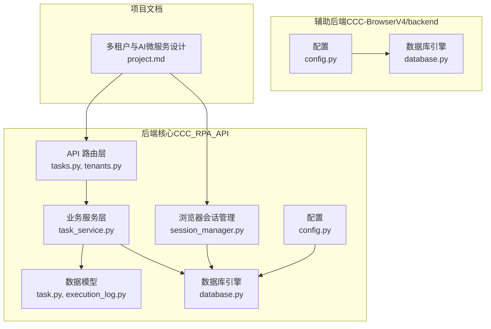
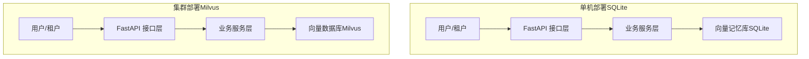
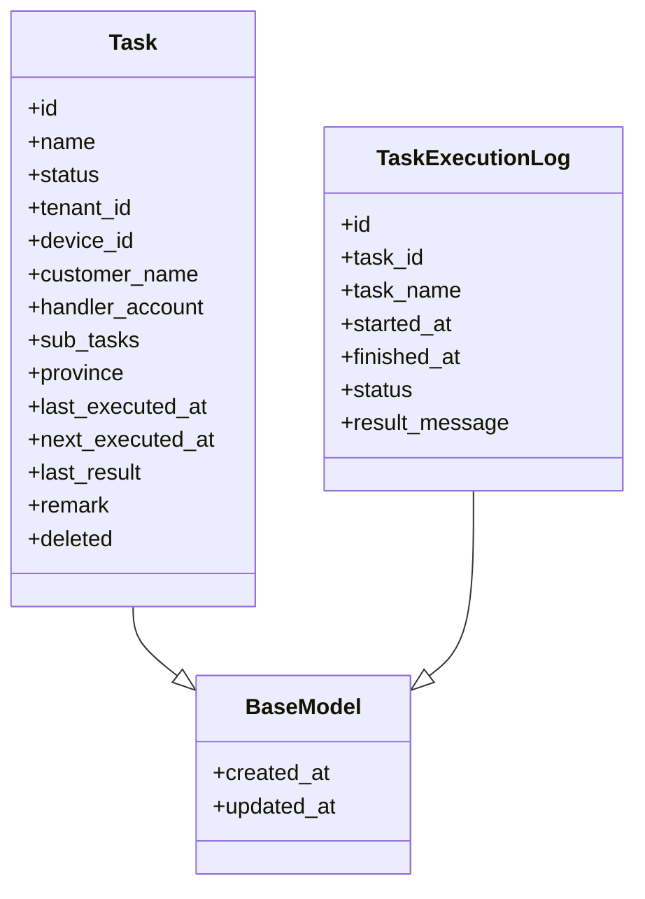
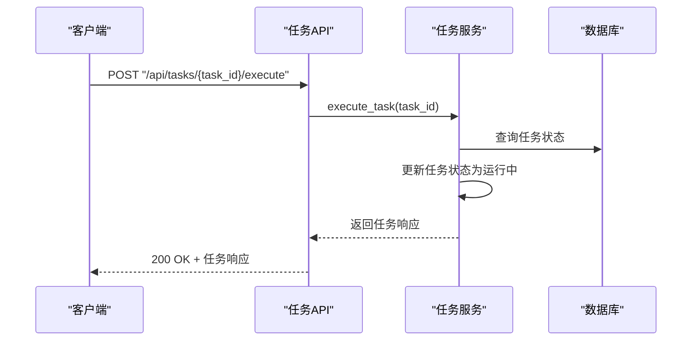
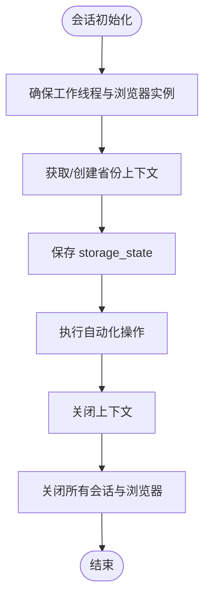
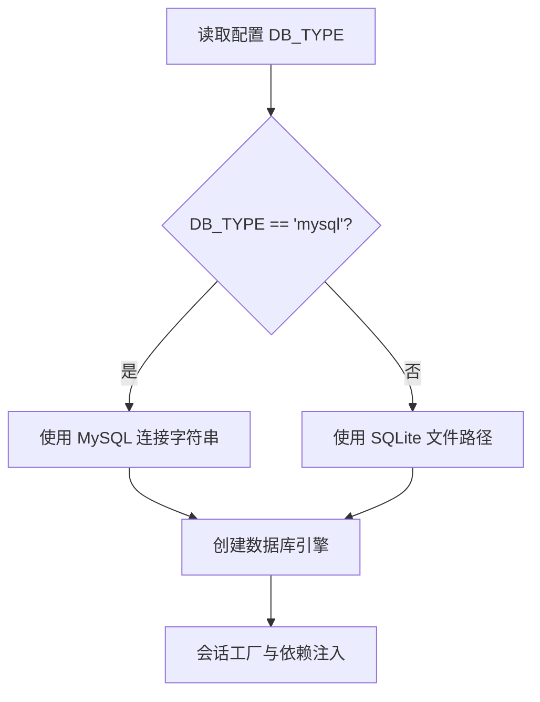
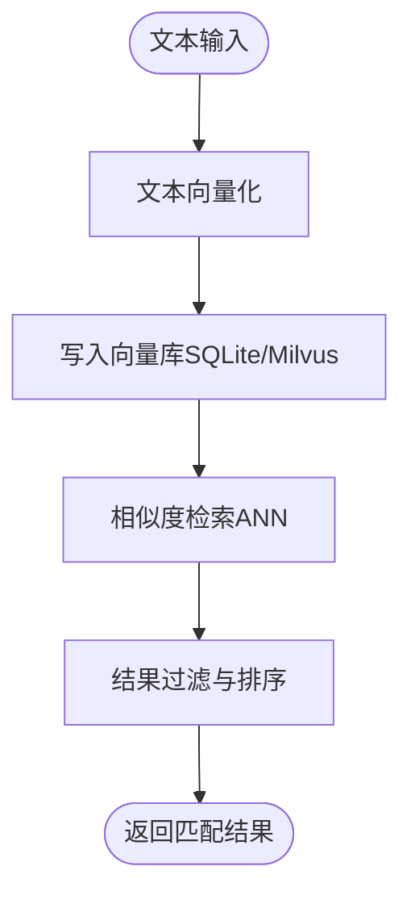
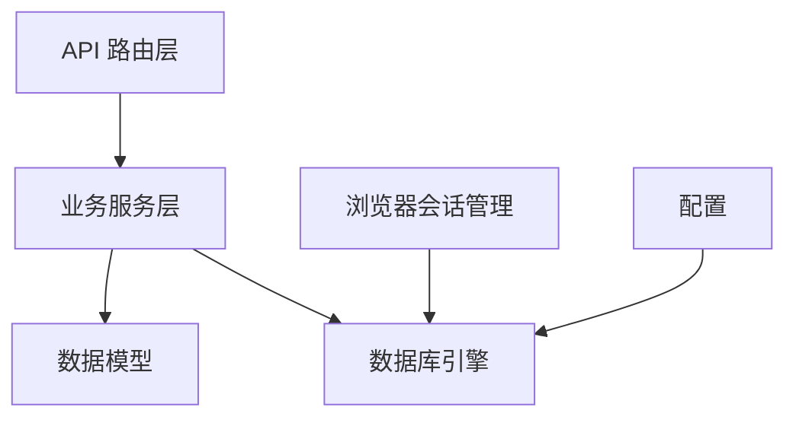

# 租户独立向量记忆库

<cite>
**本文档引用的文件**
- [main.py](file://CCC_RPA_API/app/main.py)
- [config.py](file://CCC_RPA_API/app/config.py)
- [database.py](file://CCC_RPA_API/app/database.py)
- [base.py](file://CCC_RPA_API/app/models/base.py)
- [task.py](file://CCC_RPA_API/app/models/task.py)
- [execution_log.py](file://CCC_RPA_API/app/models/execution_log.py)
- [tasks.py](file://CCC_RPA_API/app/api/tasks.py)
- [tenants.py](file://CCC_RPA_API/app/api/tenants.py)
- [task_service.py](file://CCC_RPA_API/app/services/task.py)
- [session_manager.py](file://CCC_RPA_API/app/browser/session_manager.py)
- [human_behavior.py](file://CCC_RPA_API/app/browser/human_behavior.py)
- [config.py](file://CCC-BrowserV4/backend/app/config.py)
- [database.py](file://CCC-BrowserV4/backend/app/database.py)
- [project.md](file://project.md)
</cite>

## 目录
1. [简介](#简介)
2. [项目结构](#项目结构)
3. [核心组件](#核心组件)
4. [架构总览](#架构总览)
5. [详细组件分析](#详细组件分析)
6. [依赖分析](#依赖分析)
7. [性能考虑](#性能考虑)
8. [故障排查指南](#故障排查指南)
9. [结论](#结论)
10. [附录](#附录)

## 简介
本文件面向“租户独立向量记忆库”的技术实现，结合现有代码库与项目文档，系统阐述两类部署形态下的向量记忆库设计与实现要点：
- 单机部署：以 SQLite 作为本地向量存储，适合开发测试与小规模场景
- 集群部署：以 Milvus 作为分布式向量数据库，满足多租户隔离与高并发检索需求

同时，文档覆盖以下主题：
- 租户数据隔离机制（租户 ID 绑定、会话上下文隔离）
- 向量嵌入生成与存储流程（文本向量化、相似度计算、索引构建优化）
- 会话销毁时的自动清理机制（临时记忆生命周期、持久化记忆加密存储）
- 向量检索优化（ANN 算法、批量查询、结果排序与过滤）
- 监控与维护（存储容量、查询性能、索引重建策略）

## 项目结构
本项目包含三层与两套系统：
- 后端核心（CCC_RPA_API）：FastAPI + Playwright，负责任务执行、会话管理与数据持久化
- 辅助后端（CCC-BrowserV4/backend）：提供配置与数据库适配（MySQL/SQLite）
- 项目文档（project.md）：定义了多租户、AI 微服务、数据层设计与部署形态

**图表来源**
- [tasks.py](file://CCC_RPA_API/app/api/tasks.py)
- [tenants.py](file://CCC_RPA_API/app/api/tenants.py)
- [task_service.py](file://CCC_RPA_API/app/services/task.py)
- [task.py](file://CCC_RPA_API/app/models/task.py)
- [execution_log.py](file://CCC_RPA_API/app/models/execution_log.py)
- [database.py](file://CCC_RPA_API/app/database.py)
- [config.py](file://CCC_RPA_API/app/config.py)
- [session_manager.py](file://CCC_RPA_API/app/browser/session_manager.py)
- [config.py](file://CCC-BrowserV4/backend/app/config.py)
- [database.py](file://CCC-BrowserV4/backend/app/database.py)
- [project.md](file://project.md)

**章节来源**
- [main.py](file://CCC_RPA_API/app/main.py)
- [config.py](file://CCC_RPA_API/app/config.py)
- [database.py](file://CCC_RPA_API/app/database.py)
- [config.py](file://CCC-BrowserV4/backend/app/config.py)
- [database.py](file://CCC-BrowserV4/backend/app/database.py)
- [project.md](file://project.md)

## 核心组件
- 数据模型与租户字段
  - 任务模型包含租户 ID 字段，用于区分不同租户的任务与会话
  - 执行日志模型记录任务执行状态与结果
- API 路由与服务层
  - 任务 CRUD 与执行控制接口
  - 任务服务封装查询、创建、更新、删除与执行逻辑
- 浏览器会话管理
  - 按省份隔离的会话上下文，持久化 storage_state
  - 专用工作线程执行 Playwright 操作，避免与 asyncio 冲突
- 配置与数据库适配
  - 支持 MySQL 与 SQLite 两种后端，便于单机与集群部署切换

**章节来源**
- [task.py](file://CCC_RPA_API/app/models/task.py)
- [execution_log.py](file://CCC_RPA_API/app/models/execution_log.py)
- [tasks.py](file://CCC_RPA_API/app/api/tasks.py)
- [task_service.py](file://CCC_RPA_API/app/services/task.py)
- [session_manager.py](file://CCC_RPA_API/app/browser/session_manager.py)
- [config.py](file://CCC-RPA_API/app/config.py)
- [database.py](file://CCC_RPA_API/app/database.py)
- [config.py](file://CCC-BrowserV4/backend/app/config.py)
- [database.py](file://CCC-BrowserV4/backend/app/database.py)

## 架构总览
下图展示了租户独立向量记忆库在两类部署形态下的整体架构与数据流：

**图表来源**
- [tasks.py](file://CCC_RPA_API/app/api/tasks.py)
- [task_service.py](file://CCC_RPA_API/app/services/task.py)
- [project.md](file://project.md)

## 详细组件分析

### 数据模型与租户隔离
- 任务模型包含租户 ID 字段，确保任务与会话仅归属特定租户
- 执行日志模型记录任务执行状态，便于审计与回溯
- 基类模型统一记录创建与更新时间，便于数据治理

**图表来源**
- [base.py](file://CCC_RPA_API/app/models/base.py)
- [task.py](file://CCC_RPA_API/app/models/task.py)
- [execution_log.py](file://CCC_RPA_API/app/models/execution_log.py)

**章节来源**
- [base.py](file://CCC_RPA_API/app/models/base.py)
- [task.py](file://CCC_RPA_API/app/models/task.py)
- [execution_log.py](file://CCC_RPA_API/app/models/execution_log.py)

### API 与服务层
- 任务 API 提供列表、创建、查询、更新、删除、执行与日志查询接口
- 任务服务封装业务逻辑，包括参数校验、JSON 字段处理、状态更新与执行提交

**图表来源**
- [tasks.py](file://CCC_RPA_API/app/api/tasks.py)
- [task_service.py](file://CCC_RPA_API/app/services/task.py)

**章节来源**
- [tasks.py](file://CCC_RPA_API/app/api/tasks.py)
- [task_service.py](file://CCC_RPA_API/app/services/task.py)

### 浏览器会话管理与租户上下文
- 按省份隔离的会话上下文，持久化 storage_state，支持恢复与清理
- 专用工作线程执行 Playwright 操作，避免与 asyncio 事件循环冲突
- 会话销毁时自动清理上下文与浏览器实例

**图表来源**
- [session_manager.py](file://CCC_RPA_API/app/browser/session_manager.py)

**章节来源**
- [session_manager.py](file://CCC_RPA_API/app/browser/session_manager.py)
- [human_behavior.py](file://CCC_RPA_API/app/browser/human_behavior.py)

### 配置与数据库适配
- 支持 MySQL 与 SQLite 两种后端，通过配置项切换
- 单机 SQLite 适合开发测试；集群 Milvus 适合生产多租户场景

**图表来源**
- [config.py](file://CCC-BrowserV4/backend/app/config.py)
- [database.py](file://CCC-BrowserV4/backend/app/database.py)

**章节来源**
- [config.py](file://CCC-BrowserV4/backend/app/config.py)
- [database.py](file://CCC-BrowserV4/backend/app/database.py)

### 向量嵌入生成与存储流程
- 文本向量化：在业务服务层或 AI 微服务中将文本转换为向量表示
- 相似度计算：在 Milvus 中使用 ANN 算法进行高效相似度检索
- 索引构建优化：根据数据分布与查询模式选择合适索引类型与参数

[此图为概念性流程，无需图表来源]

### 会话销毁与自动清理机制
- 临时记忆生命周期：会话销毁时清理临时向量缓存
- 持久化记忆加密存储：会话快照采用租户独立 AES 密钥加密
- 租户 ID 绑定：所有向量数据与会话关联租户 ID，确保物理隔离

**章节来源**
- [session_manager.py](file://CCC_RPA_API/app/browser/session_manager.py)
- [project.md](file://project.md)

### 向量检索优化
- ANN 算法应用：在 Milvus 中使用 HNSW/IVF 等索引类型加速检索
- 批量查询处理：支持批量向量查询与并发控制
- 结果排序与过滤：基于相似度阈值与元数据过滤返回高质量结果

**章节来源**
- [project.md](file://project.md)

### 监控与维护
- 存储容量监控：跟踪向量库大小与增长趋势
- 查询性能分析：分析检索延迟与命中率，优化索引参数
- 索引重建策略：根据数据分布变化与查询模式调整索引类型与参数

**章节来源**
- [project.md](file://project.md)

## 依赖分析
- 组件耦合与内聚
  - API 路由层与服务层职责清晰，服务层依赖数据模型与数据库
  - 浏览器会话管理与数据库解耦，通过配置与状态文件交互
- 外部依赖与集成点
  - 数据库：MySQL（生产）与 SQLite（单机）
  - 向量库：Milvus（集群）与 SQLite（单机）
  - 加密：AES-256-CBC（会话快照加密）

**图表来源**
- [tasks.py](file://CCC_RPA_API/app/api/tasks.py)
- [task_service.py](file://CCC_RPA_API/app/services/task.py)
- [task.py](file://CCC_RPA_API/app/models/task.py)
- [execution_log.py](file://CCC_RPA_API/app/models/execution_log.py)
- [database.py](file://CCC_RPA_API/app/database.py)
- [session_manager.py](file://CCC_RPA_API/app/browser/session_manager.py)
- [config.py](file://CCC_RPA_API/app/config.py)

**章节来源**
- [tasks.py](file://CCC_RPA_API/app/api/tasks.py)
- [task_service.py](file://CCC_RPA_API/app/services/task.py)
- [database.py](file://CCC_RPA_API/app/database.py)
- [session_manager.py](file://CCC_RPA_API/app/browser/session_manager.py)
- [config.py](file://CCC_RPA_API/app/config.py)

## 性能考虑
- 单机 SQLite 场景
  - 适用于低并发与小规模数据，注意 I/O 与锁竞争
  - 建议合理设置连接池与事务粒度
- 集群 Milvus 场景
  - 使用 ANN 算法与合适的索引类型提升检索性能
  - 控制批量查询大小与并发度，避免热点节点过载
  - 定期评估索引质量与查询延迟，动态调整索引参数

[本节为通用指导，无需章节来源]

## 故障排查指南
- 数据库连接问题
  - 检查数据库连接字符串与凭据
  - 验证数据库服务可达性与网络策略
- 会话初始化失败
  - 查看浏览器工作线程日志与超时信息
  - 确认 storage_state 文件完整性与权限
- 向量检索异常
  - 核对租户 ID 与数据隔离策略
  - 检查索引构建状态与查询参数

**章节来源**
- [session_manager.py](file://CCC_RPA_API/app/browser/session_manager.py)
- [database.py](file://CCC_RPA_API/app/database.py)

## 结论
本技术文档基于现有代码库与项目文档，梳理了租户独立向量记忆库在单机 SQLite 与集群 Milvus 两种部署形态下的设计要点与实现建议。通过租户 ID 绑定、会话上下文隔离与 AES 加密存储，确保数据安全与物理隔离；借助 ANN 算法与索引优化，保障检索性能与可扩展性。建议在生产环境中优先采用 Milvus 集群方案，并配套完善的监控与维护策略。

[本节为总结性内容，无需章节来源]

## 附录
- 术语
  - 租户：多租户系统中的独立组织或业务单元
  - ANN：近似最近邻算法，用于高效相似度检索
  - AES-256-CBC：对称加密算法，用于会话快照加密存储
- 参考
  - 项目文档中关于多租户、AI 微服务与数据层设计的详细描述

**章节来源**
- [project.md](file://project.md)