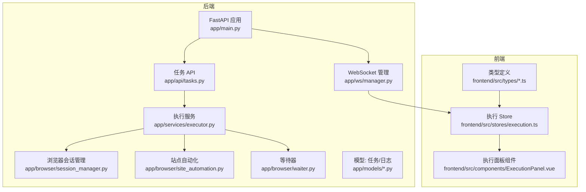
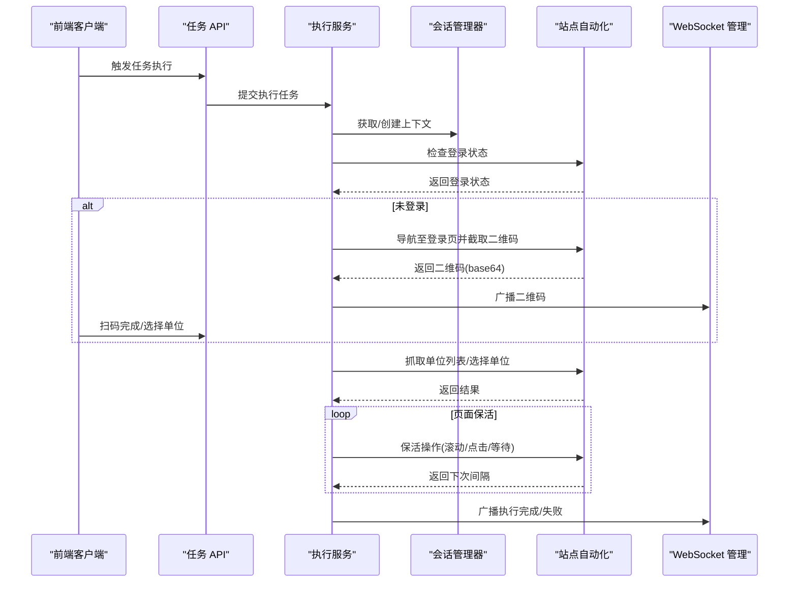
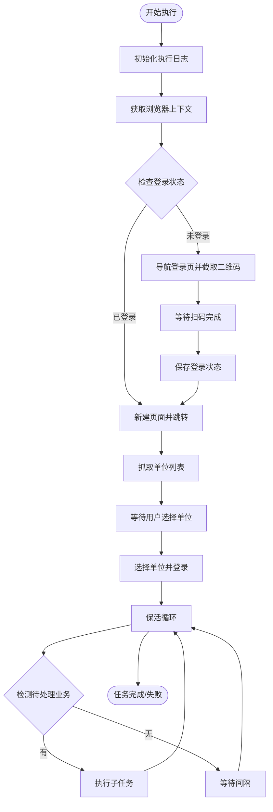
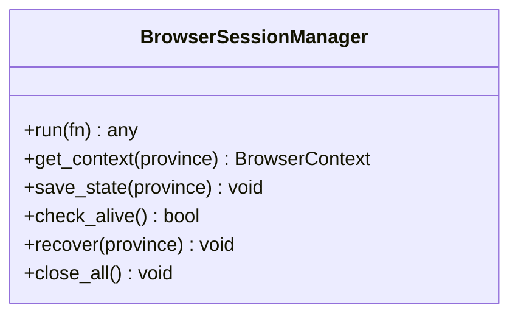
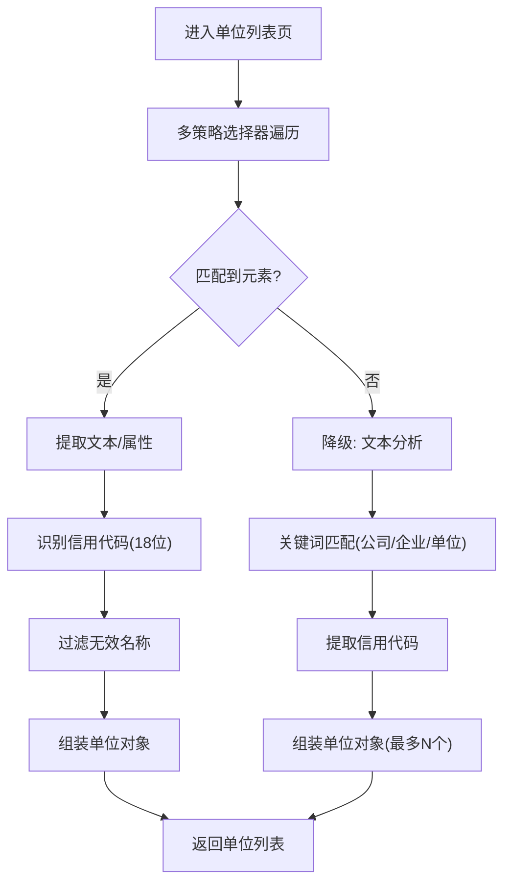
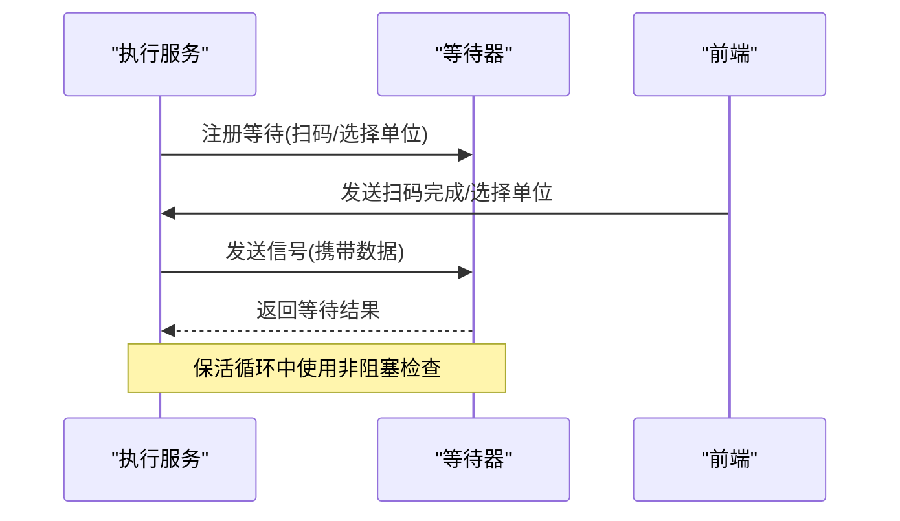
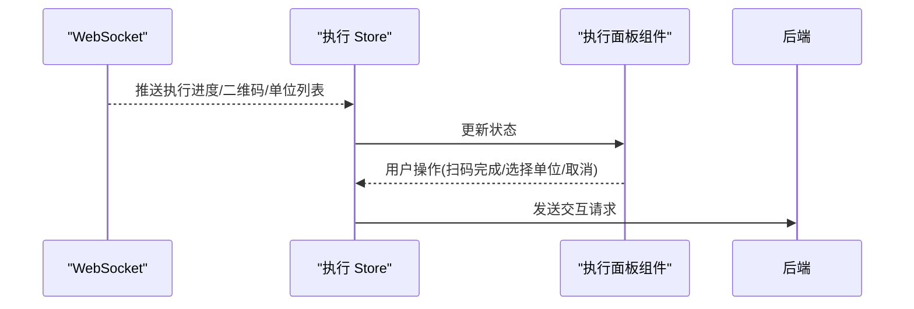
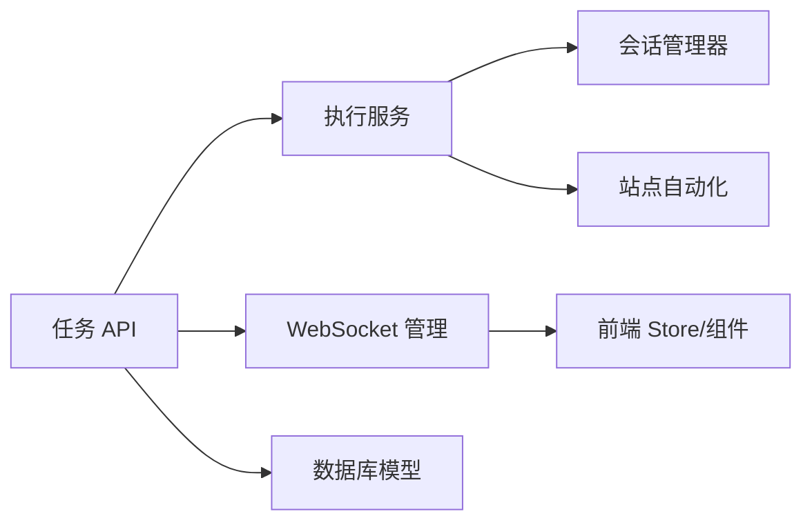
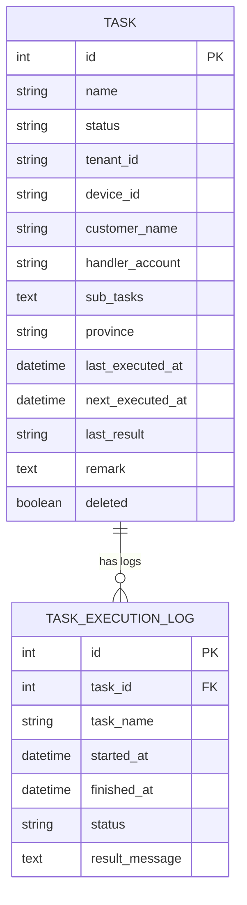

# 结构化数据抽取引擎

<cite>
**本文档引用的文件**
- [main.py](file://CCC_RPA_API/app/main.py)
- [tasks.py](file://CCC_RPA_API/app/api/tasks.py)
- [task.py](file://CCC_RPA_API/app/models/task.py)
- [execution_log.py](file://CCC_RPA_API/app/models/execution_log.py)
- [executor.py](file://CCC_RPA_API/app/services/executor.py)
- [site_automation.py](file://CCC_RPA_API/app/browser/site_automation.py)
- [session_manager.py](file://CCC_RPA_API/app/browser/session_manager.py)
- [human_behavior.py](file://CCC_RPA_API/app/browser/human_behavior.py)
- [waiter.py](file://CCC_RPA_API/app/browser/waiter.py)
- [manager.py](file://CCC_RPA_API/app/ws/manager.py)
- [execution.ts](file://CCC-RPA_API/app/schemas/execution.py)
- [execution.ts](file://CCC-BrowserV4/frontend/src/types/execution.ts)
- [index.ts](file://CCC-BrowserV4/frontend/src/types/index.ts)
- [execution.ts](file://CCC-BrowserV4/frontend/src/stores/execution.ts)
- [ExecutionPanel.vue](file://CCC-BrowserV4/frontend/src/components/ExecutionPanel.vue)
</cite>

## 目录
1. [简介](#简介)
2. [项目结构](#项目结构)
3. [核心组件](#核心组件)
4. [架构总览](#架构总览)
5. [详细组件分析](#详细组件分析)
6. [依赖分析](#依赖分析)
7. [性能考虑](#性能考虑)
8. [故障排查指南](#故障排查指南)
9. [结论](#结论)
10. [附录](#附录)

## 简介
本项目为“结构化数据抽取引擎”的后端与前端集成方案，围绕 RPA 自动化执行流程，提供网页 DOM 与截图数据的采集、解析与结构化输出能力。系统通过 Playwright 在专用工作线程中驱动浏览器，结合多策略选择器与真人行为模拟，实现对复杂页面结构的稳定抓取；同时提供任务编排、状态广播、交互等待与保活机制，确保在长时间运行场景下的稳定性与可靠性。

## 项目结构
后端采用 FastAPI 提供 REST API 与 WebSocket 通信，数据库使用 SQLAlchemy 模型持久化任务与执行日志；浏览器侧通过会话管理器统一调度 Playwright 上下文，保障跨省份、跨会话的状态一致性与恢复能力；前端基于 Vue + Pinia + Element Plus 构建执行面板，实现扫码登录、单位选择、执行状态展示与交互控制。

**图表来源**
- [main.py:12-127](file://CCC_RPA_API/app/main.py#L12-L127)
- [tasks.py:10-76](file://CCC_RPA_API/app/api/tasks.py#L10-L76)
- [executor.py:78-319](file://CCC_RPA_API/app/services/executor.py#L78-L319)
- [session_manager.py:10-186](file://CCC_RPA_API/app/browser/session_manager.py#L10-L186)
- [site_automation.py:16-743](file://CCC_RPA_API/app/browser/site_automation.py#L16-L743)
- [waiter.py:7-84](file://CCC_RPA_API/app/browser/waiter.py#L7-L84)
- [manager.py:1-29](file://CCC_RPA_API/app/ws/manager.py#L1-L29)
- [execution.ts:1-17](file://CCC-BrowserV4/frontend/src/types/execution.ts#L1-L17)
- [execution.ts:1-229](file://CCC-BrowserV4/frontend/src/stores/execution.ts#L1-L229)
- [ExecutionPanel.vue:1-322](file://CCC-BrowserV4/frontend/src/components/ExecutionPanel.vue#L1-L322)

**章节来源**
- [main.py:12-127](file://CCC_RPA_API/app/main.py#L12-L127)
- [tasks.py:10-76](file://CCC_RPA_API/app/api/tasks.py#L10-L76)
- [executor.py:78-319](file://CCC_RPA_API/app/services/executor.py#L78-L319)
- [session_manager.py:10-186](file://CCC_RPA_API/app/browser/session_manager.py#L10-L186)
- [site_automation.py:16-743](file://CCC_RPA_API/app/browser/site_automation.py#L16-L743)
- [waiter.py:7-84](file://CCC_RPA_API/app/browser/waiter.py#L7-L84)
- [manager.py:1-29](file://CCC_RPA_API/app/ws/manager.py#L1-L29)
- [execution.ts:1-17](file://CCC-BrowserV4/frontend/src/types/execution.ts#L1-L17)
- [execution.ts:1-229](file://CCC-BrowserV4/frontend/src/stores/execution.ts#L1-L229)
- [ExecutionPanel.vue:1-322](file://CCC-BrowserV4/frontend/src/components/ExecutionPanel.vue#L1-L322)

## 核心组件
- 任务与执行编排：REST API 负责任务 CRUD、执行触发与日志查询；执行服务在专用线程池中串行/并行调度浏览器操作与业务流程。
- 浏览器会话管理：按省份维护 Playwright 上下文，持久化 storage_state，支持异常恢复与多上下文并发。
- 站点自动化：封装登录、扫码、单位列表抓取、单位选择、保活与业务检测等步骤，采用多策略选择器与真人行为模拟。
- 状态广播与交互：WebSocket 广播执行进度、二维码、单位列表与错误信息；等待器在独立线程中阻塞等待用户扫码或单位选择。
- 前端执行面板：根据 WebSocket 消息动态渲染不同执行步骤，支持扫码完成、单位选择与取消执行。

**章节来源**
- [tasks.py:13-76](file://CCC_RPA_API/app/api/tasks.py#L13-L76)
- [executor.py:78-319](file://CCC_RPA_API/app/services/executor.py#L78-L319)
- [session_manager.py:99-126](file://CCC_RPA_API/app/browser/session_manager.py#L99-L126)
- [site_automation.py:38-540](file://CCC_RPA_API/app/browser/site_automation.py#L38-L540)
- [waiter.py:14-84](file://CCC_RPA_API/app/browser/waiter.py#L14-L84)
- [manager.py:17-29](file://CCC_RPA_API/app/ws/manager.py#L17-L29)
- [ExecutionPanel.vue:1-108](file://CCC-BrowserV4/frontend/src/components/ExecutionPanel.vue#L1-L108)

## 架构总览
系统采用“后端 API + 专用浏览器线程 + 前端交互”的三层架构。后端负责任务编排与状态管理；浏览器线程负责页面自动化与数据采集；前端负责用户交互与实时状态展示。

**图表来源**
- [tasks.py:47-76](file://CCC_RPA_API/app/api/tasks.py#L47-L76)
- [executor.py:78-319](file://CCC_RPA_API/app/services/executor.py#L78-L319)
- [session_manager.py:99-126](file://CCC_RPA_API/app/browser/session_manager.py#L99-L126)
- [site_automation.py:38-540](file://CCC_RPA_API/app/browser/site_automation.py#L38-L540)
- [manager.py:17-29](file://CCC_RPA_API/app/ws/manager.py#L17-L29)

## 详细组件分析

### 组件一：任务执行与状态编排
- 控制流：接收执行请求后，初始化执行日志，获取浏览器上下文，检查登录状态；若未登录则推送二维码并等待用户扫码；扫码完成后保存状态并继续；抓取单位列表并等待用户选择；选择单位后进入保活循环，检测待处理业务并执行相应子任务；最终更新任务状态与日志。
- 关键点：线程隔离（浏览器操作在专用线程）、异常恢复（浏览器崩溃自动恢复）、取消信号（非阻塞检查）。

**图表来源**
- [executor.py:78-319](file://CCC_RPA_API/app/services/executor.py#L78-L319)
- [site_automation.py:38-540](file://CCC_RPA_API/app/browser/site_automation.py#L38-L540)

**章节来源**
- [executor.py:78-319](file://CCC_RPA_API/app/services/executor.py#L78-L319)
- [tasks.py:47-76](file://CCC_RPA_API/app/api/tasks.py#L47-L76)

### 组件二：浏览器会话管理与恢复
- 功能：按省份维护 BrowserContext，持久化 storage_state；在专用线程中执行 Playwright 操作；提供检查存活、恢复会话、关闭上下文等能力。
- 设计要点：队列 + Event 的线程安全调用模型；异常时自动重建；多上下文并发管理。

**图表来源**
- [session_manager.py:10-186](file://CCC_RPA_API/app/browser/session_manager.py#L10-L186)

**章节来源**
- [session_manager.py:10-186](file://CCC_RPA_API/app/browser/session_manager.py#L10-L186)

### 组件三：站点自动化与页面解析
- 功能：登录状态检查、扫码登录、单位列表抓取、单位选择、保活、业务检测与子任务执行。
- 解析策略：多级选择器降级、文本正则提取、JS 回退匹配；真人行为模拟降低风控识别风险。
- 数据输出：单位列表标准化为包含名称与信用代码的对象集合。

**图表来源**
- [site_automation.py:194-291](file://CCC_RPA_API/app/browser/site_automation.py#L194-L291)

**章节来源**
- [site_automation.py:38-540](file://CCC_RPA_API/app/browser/site_automation.py#L38-L540)

### 组件四：等待器与交互编排
- 功能：在独立线程中阻塞等待用户扫码或选择单位；支持取消与超时；保活循环中非阻塞检查取消信号。
- 设计：线程安全字典存储事件与数据；非阻塞检查避免阻塞主流程。

**图表来源**
- [waiter.py:14-84](file://CCC_RPA_API/app/browser/waiter.py#L14-L84)
- [executor.py:72-76](file://CCC_RPA_API/app/services/executor.py#L72-L76)

**章节来源**
- [waiter.py:14-84](file://CCC_RPA_API/app/browser/waiter.py#L14-L84)
- [executor.py:72-76](file://CCC_RPA_API/app/services/executor.py#L72-L76)

### 组件五：前端执行面板与状态同步
- 功能：根据 WebSocket 消息切换执行步骤（检查登录、扫码、等待单位、执行中、保活、完成、失败、取消）；支持扫码完成、单位选择与取消执行。
- 状态：Pinia Store 维护 taskId、step、message、二维码、单位列表与选中单位；组件根据状态渲染 UI。

**图表来源**
- [manager.py:17-29](file://CCC_RPA_API/app/ws/manager.py#L17-L29)
- [execution.ts:22-67](file://CCC-BrowserV4/frontend/src/stores/execution.ts#L22-L67)
- [ExecutionPanel.vue:110-128](file://CCC-BrowserV4/frontend/src/components/ExecutionPanel.vue#L110-L128)

**章节来源**
- [execution.ts:1-229](file://CCC-BrowserV4/frontend/src/stores/execution.ts#L1-L229)
- [ExecutionPanel.vue:1-322](file://CCC-BrowserV4/frontend/src/components/ExecutionPanel.vue#L1-L322)

## 依赖分析
- 后端依赖：FastAPI、SQLAlchemy、Playwright、WebSocket 管理器；执行服务依赖会话管理器与站点自动化模块。
- 前后端通信：WebSocket 广播消息，前端 Store 订阅并更新 UI。
- 数据模型：任务与执行日志模型支撑任务生命周期与审计。

**图表来源**
- [tasks.py:10-76](file://CCC_RPA_API/app/api/tasks.py#L10-L76)
- [executor.py:78-319](file://CCC_RPA_API/app/services/executor.py#L78-L319)
- [session_manager.py:99-126](file://CCC_RPA_API/app/browser/session_manager.py#L99-L126)
- [site_automation.py:38-540](file://CCC_RPA_API/app/browser/site_automation.py#L38-L540)
- [manager.py:17-29](file://CCC_RPA_API/app/ws/manager.py#L17-L29)
- [task.py:8-25](file://CCC_RPA_API/app/models/task.py#L8-L25)
- [execution_log.py:7-17](file://CCC_RPA_API/app/models/execution_log.py#L7-L17)

**章节来源**
- [tasks.py:10-76](file://CCC_RPA_API/app/api/tasks.py#L10-L76)
- [executor.py:78-319](file://CCC_RPA_API/app/services/executor.py#L78-L319)
- [session_manager.py:99-126](file://CCC_RPA_API/app/browser/session_manager.py#L99-L126)
- [site_automation.py:38-540](file://CCC_RPA_API/app/browser/site_automation.py#L38-L540)
- [manager.py:17-29](file://CCC_RPA_API/app/ws/manager.py#L17-L29)
- [task.py:8-25](file://CCC_RPA_API/app/models/task.py#L8-L25)
- [execution_log.py:7-17](file://CCC_RPA_API/app/models/execution_log.py#L7-L17)

## 性能考虑
- 线程隔离：浏览器操作在专用线程中执行，避免与 asyncio 事件循环冲突；线程池大小与任务队列控制并发度。
- 选择器降级：多策略选择器与 JS 回退减少页面结构变化带来的脆弱性，提升成功率。
- 保活策略：随机滚动、随机点击与随机等待降低风控识别概率，同时缩短等待时间以提高吞吐。
- 日志与截图：关键节点保存截图与日志，便于问题定位与回放。

[本节为通用性能建议，无需特定文件引用]

## 故障排查指南
- 浏览器异常：检查会话管理器的存活状态与恢复流程；确认截图是否保存以便复盘。
- 登录失败：核对二维码截取与推送流程；检查扫码完成信号是否到达。
- 单位选择失败：确认选择器匹配策略与 JS 回退路径；检查合成 ID 与真实 ID 的区分逻辑。
- 执行中断：检查等待器的取消信号与保活循环的非阻塞检查；确认 WebSocket 广播是否正常。

**章节来源**
- [session_manager.py:147-170](file://CCC_RPA_API/app/browser/session_manager.py#L147-L170)
- [site_automation.py:148-173](file://CCC_RPA_API/app/browser/site_automation.py#L148-L173)
- [site_automation.py:294-540](file://CCC_RPA_API/app/browser/site_automation.py#L294-L540)
- [waiter.py:56-69](file://CCC_RPA_API/app/browser/waiter.py#L56-L69)
- [manager.py:17-29](file://CCC_RPA_API/app/ws/manager.py#L17-L29)

## 结论
本系统通过“专用浏览器线程 + 多策略页面解析 + 真人行为模拟”的组合，实现了对复杂网页结构的稳定抓取与结构化输出。配合任务编排、状态广播与交互等待机制，能够在长时间运行场景下保持高可用性。未来可在规则引擎与可视化配置方面进一步扩展，以支持更灵活的数据抽取与校验。

[本节为总结性内容，无需特定文件引用]

## 附录
- 数据模型概览（任务与执行日志）

**图表来源**
- [task.py:8-25](file://CCC_RPA_API/app/models/task.py#L8-L25)
- [execution_log.py:7-17](file://CCC_RPA_API/app/models/execution_log.py#L7-L17)