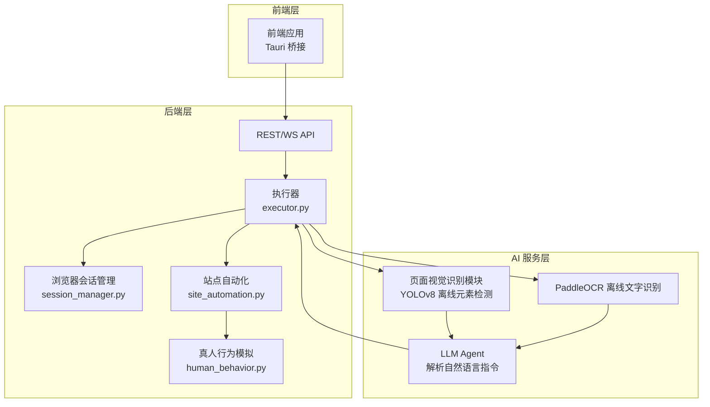
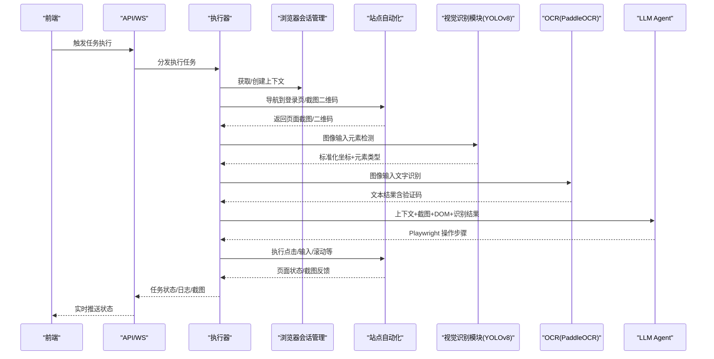
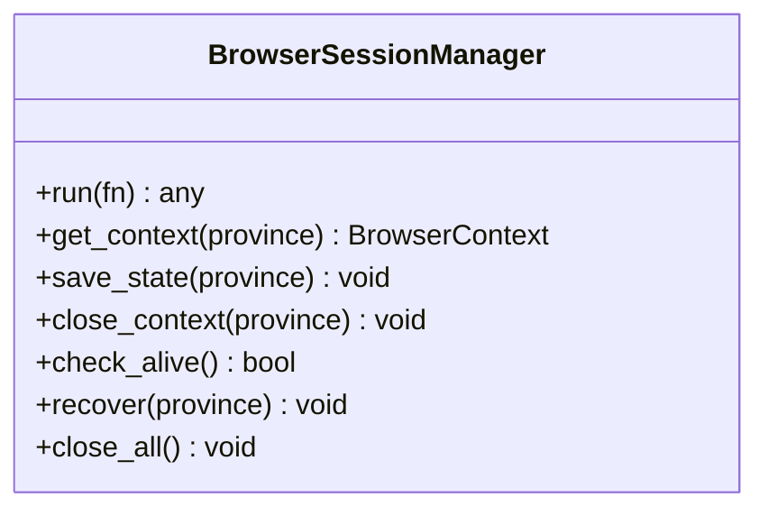
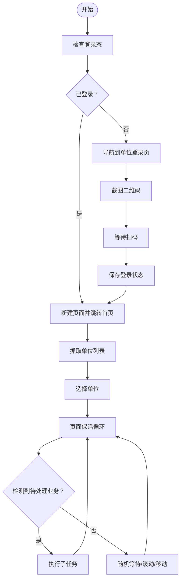
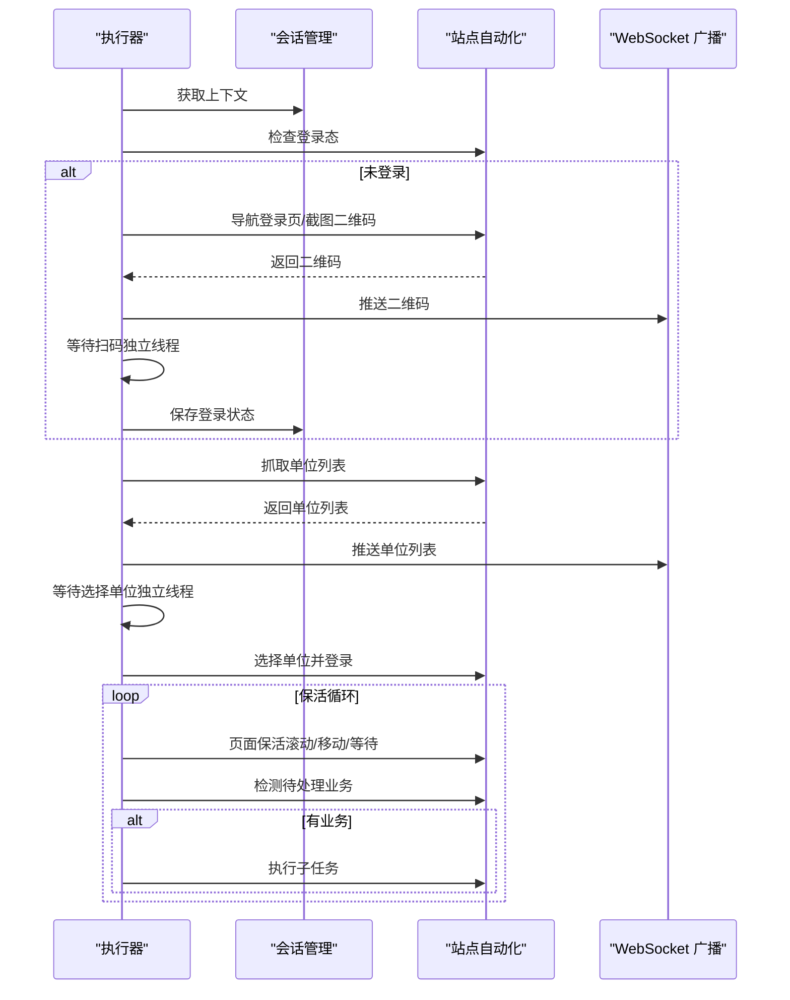
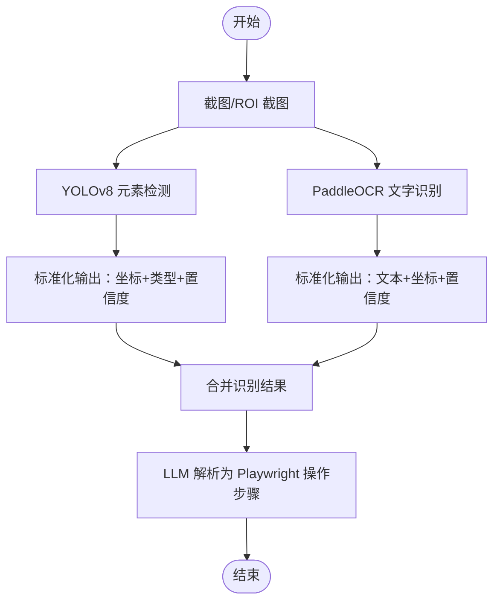
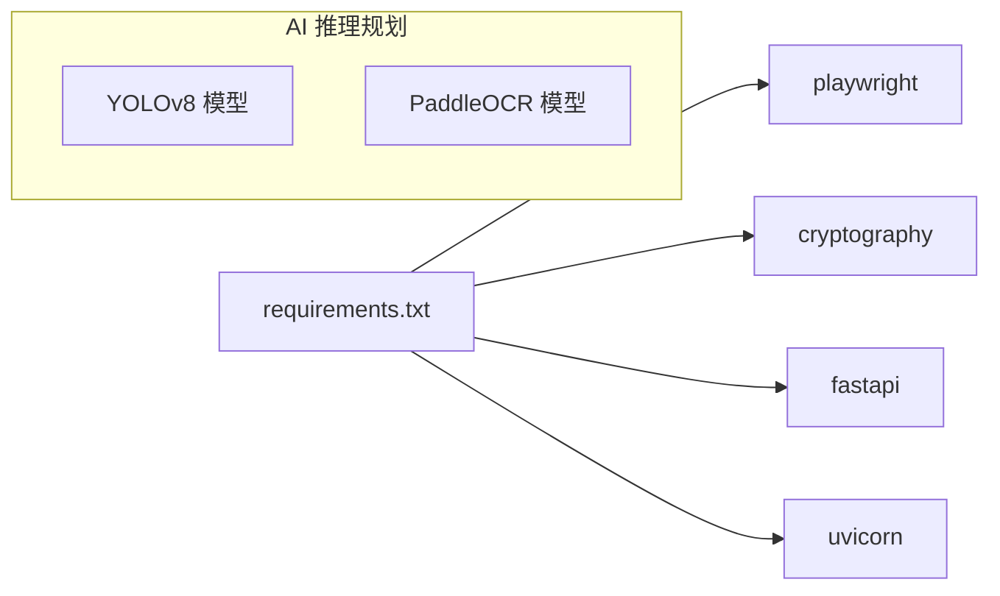

# 页面视觉识别模块

<cite>
**本文引用的文件**
- [site_automation.py](file://CCC_RPA_API/app/browser/site_automation.py)
- [human_behavior.py](file://CCC_RPA_API/app/browser/human_behavior.py)
- [session_manager.py](file://CCC_RPA_API/app/browser/session_manager.py)
- [executor.py](file://CCC_RPA_API/app/services/executor.py)
- [requirements.txt](file://CCC_RPA_API/requirements.txt)
- [project.md](file://project.md)
</cite>

## 目录
1. [简介](#简介)
2. [项目结构](#项目结构)
3. [核心组件](#核心组件)
4. [架构总览](#架构总览)
5. [详细组件分析](#详细组件分析)
6. [依赖关系分析](#依赖关系分析)
7. [性能考虑](#性能考虑)
8. [故障排查指南](#故障排查指南)
9. [结论](#结论)
10. [附录](#附录)

## 简介
本技术文档聚焦“页面视觉识别模块”，面向 YOLOv8 离线元素检测与 PaddleOCR 离线文字识别的实现与集成，覆盖以下要点：
- YOLOv8 离线元素检测：识别按钮、输入框、提交控件、弹窗、验证码区域，输出标准化坐标与元素类型
- PaddleOCR 离线文字识别：页面全文提取与验证码字符识别，全程离线
- 识别结果标准化输出：统一坐标系与元素类型，供 LLM 解析为 Playwright 操作指令
- 复杂页面布局与动态元素处理：通过截图与 DOM 辅助定位、降级策略与保活机制
- 模型训练与部署最佳实践：GPU 加速配置、推理性能优化、离线部署流程

注：根据仓库现有代码，页面视觉识别模块以“功能需求”形式明确规划，当前未包含 YOLOv8 与 PaddleOCR 的具体实现代码。本文在“实现现状”基础上，提供可落地的架构设计、数据流与部署建议，帮助工程团队在后续迭代中高效落地。

## 项目结构
页面视觉识别模块位于“AI 智能驱动微服务层”，与 LLM Agent、结构化抽取、向量记忆库共同构成智能浏览器系统的“感知—理解—行动”闭环。前端通过 Tauri 桥接与后端交互，后端通过 Playwright 控制浏览器，结合 OCR 与视觉检测能力，将识别结果标准化后传递给 LLM 生成操作指令。

图表来源
- [project.md: 896-903:896-903](file://project.md#L896-L903)
- [project.md: 1111-1117:1111-1117](file://project.md#L1111-L1117)
- [executor.py: 1-319:1-319](file://CCC_RPA_API/app/services/executor.py#L1-L319)
- [session_manager.py: 1-186:1-186](file://CCC_RPA_API/app/browser/session_manager.py#L1-L186)
- [site_automation.py: 1-743:1-743](file://CCC_RPA_API/app/browser/site_automation.py#L1-L743)
- [human_behavior.py: 1-86:1-86](file://CCC_RPA_API/app/browser/human_behavior.py#L1-L86)

章节来源
- [project.md: 896-903:896-903](file://project.md#L896-L903)
- [project.md: 1111-1117:1111-1117](file://project.md#L1111-L1117)

## 核心组件
- 浏览器会话管理（BrowserSessionManager）
  - 专用工作线程承载 Playwright，避免事件循环冲突
  - 按省份维护 BrowserContext，持久化 storage_state
- 站点自动化（SiteAutomation）
  - 提供登录态检查、单位登录页导航、二维码截图、单位列表抓取、单位选择、页面保活、待处理业务检测等
- 真人行为模拟（HumanBehavior）
  - 点击、输入、滚动、等待等行为模拟，降低被反爬/反检测概率
- 执行器（Executor）
  - 统筹任务生命周期：登录、选择单位、保活、业务触发、结果广播
- 视觉识别模块（规划中）
  - YOLOv8 离线元素检测：按钮、输入框、提交控件、弹窗、验证码区域
  - PaddleOCR 离线文字识别：页面全文与验证码字符
  - 标准化输出：统一坐标系与元素类型，供 LLM 生成 Playwright 操作指令

章节来源
- [session_manager.py: 10-186:10-186](file://CCC_RPA_API/app/browser/session_manager.py#L10-L186)
- [site_automation.py: 16-743:16-743](file://CCC_RPA_API/app/browser/site_automation.py#L16-L743)
- [human_behavior.py: 12-86:12-86](file://CCC_RPA_API/app/browser/human_behavior.py#L12-L86)
- [executor.py: 78-319:78-319](file://CCC_RPA_API/app/services/executor.py#L78-L319)

## 架构总览
视觉识别模块在“执行器”驱动下，基于浏览器截图与 DOM 信息，调用 YOLOv8 与 PaddleOCR 进行离线识别，并将结果标准化为统一的数据结构，供 LLM 解析为 Playwright 操作步骤。

图表来源
- [project.md: 1183-1189:1183-1189](file://project.md#L1183-L1189)
- [executor.py: 113-138:113-138](file://CCC_RPA_API/app/services/executor.py#L113-L138)
- [site_automation.py: 147-172:147-172](file://CCC_RPA_API/app/browser/site_automation.py#L147-L172)

## 详细组件分析

### 组件A：浏览器会话管理（BrowserSessionManager）
- 专用工作线程：避免与 asyncio 事件循环冲突，集中执行 Playwright 操作
- 上下文持久化：按省份存储 storage_state，提升会话复用效率
- 健康检查与恢复：检测浏览器存活，异常时自动恢复并重建上下文

图表来源
- [session_manager.py: 10-186:10-186](file://CCC_RPA_API/app/browser/session_manager.py#L10-L186)

章节来源
- [session_manager.py: 10-186:10-186](file://CCC_RPA_API/app/browser/session_manager.py#L10-L186)

### 组件B：站点自动化（SiteAutomation）
- 登录态检查、单位登录页导航、二维码截图、单位列表抓取、单位选择、页面保活、待处理业务检测
- 多级降级策略：CSS 选择器→JS 回退→文本分析，确保在页面结构变化时仍可稳定定位
- 截图辅助调试：关键步骤保存截图，便于问题定位

图表来源
- [site_automation.py: 38-192:38-192](file://CCC_RPA_API/app/browser/site_automation.py#L38-L192)
- [site_automation.py: 194-291:194-291](file://CCC_RPA_API/app/browser/site_automation.py#L194-L291)
- [site_automation.py: 294-540:294-540](file://CCC_RPA_API/app/browser/site_automation.py#L294-L540)
- [site_automation.py: 557-680:557-680](file://CCC_RPA_API/app/browser/site_automation.py#L557-L680)

章节来源
- [site_automation.py: 38-192:38-192](file://CCC_RPA_API/app/browser/site_automation.py#L38-L192)
- [site_automation.py: 194-291:194-291](file://CCC_RPA_API/app/browser/site_automation.py#L194-L291)
- [site_automation.py: 294-540:294-540](file://CCC_RPA_API/app/browser/site_automation.py#L294-L540)
- [site_automation.py: 557-680:557-680](file://CCC_RPA_API/app/browser/site_automation.py#L557-L680)

### 组件C：执行器（Executor）
- 任务生命周期管理：登录、选择单位、保活、业务触发、结果广播
- 线程池与阻塞等待：独立线程等待用户扫码/选择单位，避免阻塞 Playwright 工作线程
- 恢复检查点：浏览器异常时自动恢复并重新打开页面，保留调试截图

图表来源
- [executor.py: 78-319:78-319](file://CCC_RPA_API/app/services/executor.py#L78-L319)

章节来源
- [executor.py: 78-319:78-319](file://CCC_RPA_API/app/services/executor.py#L78-L319)

### 组件D：视觉识别模块（规划与实现建议）
- YOLOv8 离线元素检测
  - 输入：页面截图或 ROI 截图（如验证码区域）
  - 输出：标准化坐标（x_min, y_min, x_max, y_max）、元素类型（按钮/输入框/提交控件/弹窗/验证码区域）、置信度
  - 坐标系：相对坐标（0~1）或绝对像素坐标，需与 Playwright 操作统一
- PaddleOCR 离线文字识别
  - 输入：页面截图或 ROI 截图（验证码/文本区域）
  - 输出：文本行及其边界框（x_min, y_min, x_max, y_max）、置信度
- 标准化输出格式
  - 统一字段：元素ID、类型、边界框、置信度、父容器ID（可选）
  - 与 Playwright 的映射：边界框→鼠标移动/点击；文本→键盘输入
- 复杂布局与动态元素
  - 截图+DOM 双模态：优先 DOM 定位，DOM 不可用时回退截图
  - 降级策略：CSS 选择器→JS 回退→文本分析
  - 保活：滚动/移动/等待，避免页面弹窗遮挡或结构变化

图表来源
- [project.md: 1111-1117:1111-1117](file://project.md#L1111-L1117)

章节来源
- [project.md: 1111-1117:1111-1117](file://project.md#L1111-L1117)

## 依赖关系分析
- 运行时依赖
  - Playwright：浏览器控制与截图
  - cryptography：会话快照与敏感数据加密
  - fastapi/uvicorn：API 服务
- AI 推理依赖（规划）
  - YOLOv8：离线模型推理（GPU/CPU 双模式）
  - PaddleOCR：离线文字识别（GPU/CPU 双模式）

图表来源
- [requirements.txt: 1-11:1-11](file://CCC_RPA_API/requirements.txt#L1-L11)

章节来源
- [requirements.txt: 1-11:1-11](file://CCC_RPA_API/requirements.txt#L1-L11)

## 性能考虑
- GPU 加速配置
  - YOLOv8/PaddleOCR 支持 NVIDIA CUDA 12，优先启用 GPU 推理
  - CPU 回退：在无 GPU 或显存不足时自动切换 CPU 模式
- 推理性能优化
  - 批量化：对多 ROI 合理批处理
  - 模型量化/动态量化：减少内存占用与推理延迟
  - 预热：服务启动后预热模型，避免首次调用抖动
- 离线部署流程
  - 模型文件与配置打包进容器镜像
  - 启动参数控制 GPU/CPU 模式与线程数
  - 监控指标：推理耗时、吞吐、显存/内存使用率

## 故障排查指南
- 浏览器异常
  - 症状：浏览器断连、页面崩溃
  - 处理：执行器自动恢复会话，重新打开页面并保留调试截图
- 识别失败
  - 症状：元素未识别、坐标偏差、文字识别错误
  - 处理：检查截图质量、ROI 裁剪、降级策略是否生效；必要时增加模型微调数据
- 性能瓶颈
  - 症状：推理延迟高、内存/显存占用高
  - 处理：启用 GPU、调整批大小、开启模型量化、优化输入尺寸

章节来源
- [executor.py: 42-69:42-69](file://CCC_RPA_API/app/services/executor.py#L42-L69)
- [site_automation.py: 147-172:147-172](file://CCC_RPA_API/app/browser/site_automation.py#L147-L172)

## 结论
页面视觉识别模块作为“感知—理解—行动”闭环的关键一环，当前以功能需求形式明确规划。结合现有执行器、浏览器会话管理与站点自动化能力，可快速构建“截图+DOM”的双模态识别框架，并通过标准化输出与 LLM 协同，实现从页面理解到自动化操作的闭环。建议在后续迭代中优先完成 YOLOv8 与 PaddleOCR 的离线集成与性能优化，确保在复杂页面布局与动态元素场景下的稳定性与鲁棒性。

## 附录
- 统一接口契约（内部 GRPC 方法）
  - ParsePageTask(DOM、screenshot、userCommand) → Playwright 操作步骤列表
  - ExtractStructData(DOM、ruleJson) → 结构化 JSON 数据
  - OCRImage(imageBuffer) → 识别文本结果
- 兼容性与性能要求
  - Playwright SDK 兼容 NodeJS 18+、Python 3.9+
  - AI 推理兼容 NVIDIA CUDA 12 GPU、纯 CPU 离线双模式
  - 单条自然语言指令推理响应耗时：7B 本地模型≤1.5s

章节来源
- [project.md: 1183-1189:1183-1189](file://project.md#L1183-L1189)
- [project.md: 1262-1266:1262-1266](file://project.md#L1262-L1266)