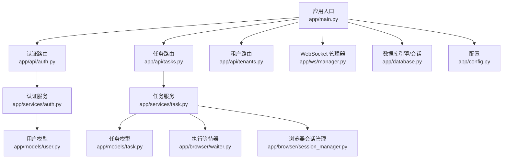
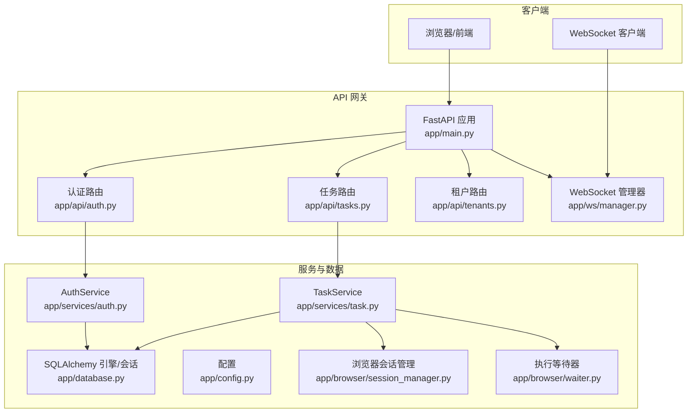
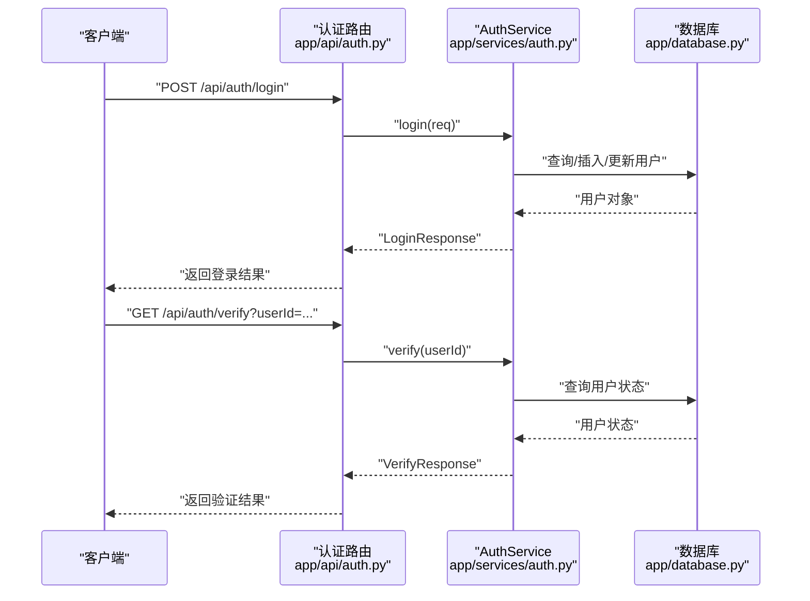
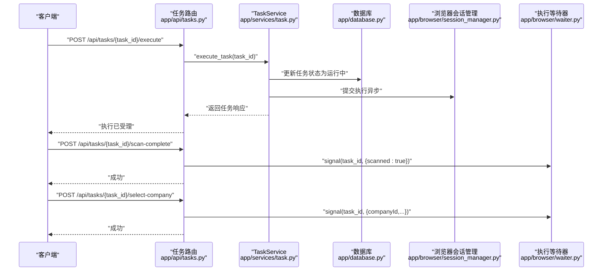
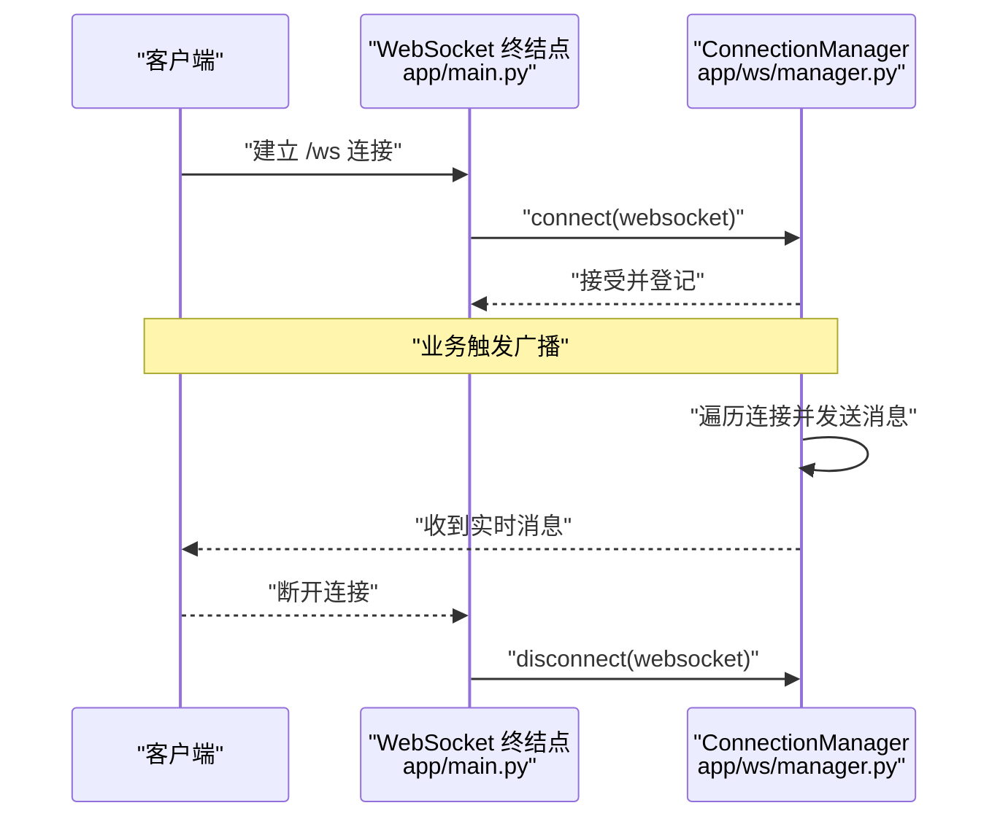
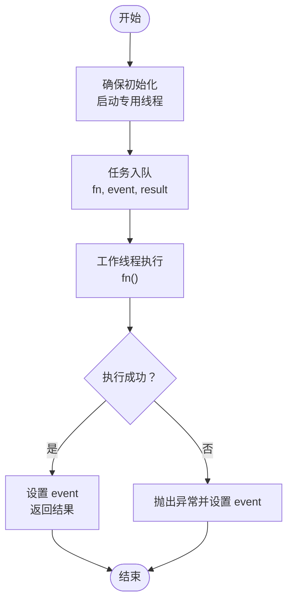
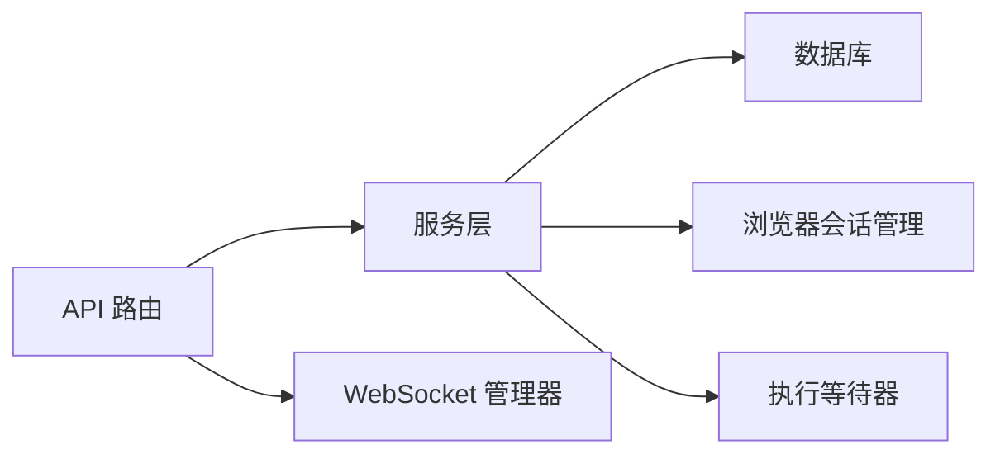

# API 网关设计

<cite>
**本文引用的文件**
- [main.py](file://CCC_RPA_API/app/main.py)
- [auth.py](file://CCC_RPA_API/app/api/auth.py)
- [tasks.py](file://CCC_RPA_API/app/api/tasks.py)
- [tenants.py](file://CCC_RPA_API/app/api/tenants.py)
- [manager.py](file://CCC_RPA_API/app/ws/manager.py)
- [config.py](file://CCC_RPA_API/app/config.py)
- [database.py](file://CCC_RPA_API/app/database.py)
- [models/user.py](file://CCC_RPA_API/app/models/user.py)
- [models/task.py](file://CCC_RPA_API/app/models/task.py)
- [schemas/auth.py](file://CCC_RPA_API/app/schemas/auth.py)
- [schemas/task.py](file://CCC_RPA_API/app/schemas/task.py)
- [services/auth.py](file://CCC_RPA_API/app/services/auth.py)
- [services/task.py](file://CCC_RPA_API/app/services/task.py)
- [browser/session_manager.py](file://CCC_RPA_API/app/browser/session_manager.py)
- [browser/waiter.py](file://CCC_RPA_API/app/browser/waiter.py)
</cite>

## 目录
1. [简介](#简介)
2. [项目结构](#项目结构)
3. [核心组件](#核心组件)
4. [架构总览](#架构总览)
5. [详细组件分析](#详细组件分析)
6. [依赖分析](#依赖分析)
7. [性能考虑](#性能考虑)
8. [故障排查指南](#故障排查指南)
9. [结论](#结论)
10. [附录](#附录)

## 简介
本文件面向商用级 AI 浏览器系统的 API 网关设计，围绕统一 RESTful API 网关的架构、路由分发、中间件处理、鉴权与参数校验、限流与错误码、WebSocket 实时通道与消息推送、以及跨模块服务聚合与可观测性进行系统化技术说明。文档以 FastAPI 应用为核心，结合数据库、浏览器自动化执行引擎与实时通信模块，给出端到端的设计与实现要点，并提供接口设计规范、请求响应格式、错误处理策略与性能优化建议。

## 项目结构
后端采用 Python + FastAPI 构建，核心目录组织如下：
- 应用入口与路由注册：app/main.py
- API 路由：app/api/{auth,tasks,tenants}.py
- 业务服务层：app/services/{auth,task}.py
- 数据模型与序列化：app/models/*、app/schemas/*
- 数据库与配置：app/database.py、app/config.py
- 实时通信：app/ws/manager.py
- 浏览器会话与执行：app/browser/session_manager.py、app/browser/waiter.py

图示来源
- [main.py:1-127](file://CCC_RPA_API/app/main.py#L1-L127)
- [auth.py:1-24](file://CCC_RPA_API/app/api/auth.py#L1-L24)
- [tasks.py:1-76](file://CCC_RPA_API/app/api/tasks.py#L1-L76)
- [tenants.py:1-25](file://CCC_RPA_API/app/api/tenants.py#L1-L25)
- [manager.py:1-29](file://CCC_RPA_API/app/ws/manager.py#L1-L29)
- [database.py:1-19](file://CCC_RPA_API/app/database.py#L1-L19)
- [config.py:1-22](file://CCC_RPA_API/app/config.py#L1-L22)
- [models/user.py:1-17](file://CCC_RPA_API/app/models/user.py#L1-L17)
- [models/task.py:1-25](file://CCC_RPA_API/app/models/task.py#L1-L25)
- [services/auth.py:1-58](file://CCC_RPA_API/app/services/auth.py#L1-L58)
- [services/task.py:1-157](file://CCC_RPA_API/app/services/task.py#L1-L157)
- [browser/waiter.py:1-84](file://CCC_RPA_API/app/browser/waiter.py#L1-L84)
- [browser/session_manager.py:1-186](file://CCC_RPA_API/app/browser/session_manager.py#L1-L186)

章节来源
- [main.py:1-127](file://CCC_RPA_API/app/main.py#L1-L127)
- [database.py:1-19](file://CCC_RPA_API/app/database.py#L1-L19)
- [config.py:1-22](file://CCC_RPA_API/app/config.py#L1-L22)

## 核心组件
- 应用入口与中间件
  - 启动事件：创建数据库表、迁移扩展字段、初始化 mock 数据、关闭事件回收浏览器资源
  - CORS 放通
  - 路由注册：认证、任务、租户、设备等模块
  - 健康检查端点
  - WebSocket 终结点与连接管理器
- 认证模块
  - 登录、登出、验证接口；基于客户端标识与令牌的用户状态维护
- 任务模块
  - 任务 CRUD、执行触发、日志查询、执行过程的人机交互信号
- 租户模块
  - Mock 租户列表接口（后续替换为真实查询）
- WebSocket 实时通道
  - 连接管理、广播消息、异常断连清理
- 数据层
  - SQLAlchemy 引擎与会话工厂、基础模型基类、数据库工具函数
- 浏览器执行引擎
  - Playwright 工作线程隔离、上下文按省域隔离、状态持久化、执行等待与信号

章节来源
- [main.py:1-127](file://CCC_RPA_API/app/main.py#L1-L127)
- [auth.py:1-24](file://CCC_RPA_API/app/api/auth.py#L1-L24)
- [tasks.py:1-76](file://CCC_RPA_API/app/api/tasks.py#L1-L76)
- [tenants.py:1-25](file://CCC_RPA_API/app/api/tenants.py#L1-L25)
- [manager.py:1-29](file://CCC_RPA_API/app/ws/manager.py#L1-L29)
- [database.py:1-19](file://CCC_RPA_API/app/database.py#L1-L19)
- [browser/session_manager.py:1-186](file://CCC_RPA_API/app/browser/session_manager.py#L1-L186)
- [browser/waiter.py:1-84](file://CCC_RPA_API/app/browser/waiter.py#L1-L84)

## 架构总览
下图展示 API 网关的整体交互：客户端通过 REST API 与 WebSocket 与网关交互；网关调用服务层，服务层读写数据库与浏览器执行引擎；WebSocket 管理器负责实时消息广播。

图示来源
- [main.py:1-127](file://CCC_RPA_API/app/main.py#L1-L127)
- [auth.py:1-24](file://CCC_RPA_API/app/api/auth.py#L1-L24)
- [tasks.py:1-76](file://CCC_RPA_API/app/api/tasks.py#L1-L76)
- [tenants.py:1-25](file://CCC_RPA_API/app/api/tenants.py#L1-L25)
- [manager.py:1-29](file://CCC_RPA_API/app/ws/manager.py#L1-L29)
- [services/auth.py:1-58](file://CCC_RPA_API/app/services/auth.py#L1-L58)
- [services/task.py:1-157](file://CCC_RPA_API/app/services/task.py#L1-L157)
- [database.py:1-19](file://CCC_RPA_API/app/database.py#L1-L19)
- [browser/session_manager.py:1-186](file://CCC_RPA_API/app/browser/session_manager.py#L1-L186)
- [browser/waiter.py:1-84](file://CCC_RPA_API/app/browser/waiter.py#L1-L84)

## 详细组件分析

### 认证与授权
- 设计要点
  - 使用客户端标识与令牌进行登录与验证，首次登录自动创建用户记录，更新 token 与设备信息
  - 登出将用户状态置为非活跃
  - 验证接口返回用户有效性及基本信息
- 请求参数校验
  - 登录请求体包含客户端标识、令牌、设备标识与用户名
  - 返回响应体包含用户标识、用户名与令牌
- 错误处理
  - 验证失败返回无效状态
  - 登出与验证均基于数据库查询，异常情况由服务层抛出 HTTP 异常

图示来源
- [auth.py:1-24](file://CCC_RPA_API/app/api/auth.py#L1-L24)
- [services/auth.py:1-58](file://CCC_RPA_API/app/services/auth.py#L1-L58)
- [database.py:1-19](file://CCC_RPA_API/app/database.py#L1-L19)

章节来源
- [auth.py:1-24](file://CCC_RPA_API/app/api/auth.py#L1-L24)
- [services/auth.py:1-58](file://CCC_RPA_API/app/services/auth.py#L1-L58)
- [schemas/auth.py:1-26](file://CCC_RPA_API/app/schemas/auth.py#L1-L26)
- [models/user.py:1-17](file://CCC_RPA_API/app/models/user.py#L1-L17)

### 任务管理与执行
- 设计要点
  - 提供任务列表、详情、创建、更新、删除、执行、日志查询等能力
  - 执行任务时将任务状态置为运行中，并异步提交执行
  - 支持扫描完成、选择公司、取消执行等交互信号
- 参数与响应
  - 创建/更新任务支持多字段，其中子任务列表以 JSON 字符串形式存储
  - 列表分页返回，包含总数、页码与每页大小
- 错误处理
  - 未找到任务时返回 404
  - 执行失败返回 400 及错误信息

图示来源
- [tasks.py:1-76](file://CCC_RPA_API/app/api/tasks.py#L1-L76)
- [services/task.py:1-157](file://CCC_RPA_API/app/services/task.py#L1-L157)
- [browser/session_manager.py:1-186](file://CCC_RPA_API/app/browser/session_manager.py#L1-L186)
- [browser/waiter.py:1-84](file://CCC_RPA_API/app/browser/waiter.py#L1-L84)

章节来源
- [tasks.py:1-76](file://CCC_RPA_API/app/api/tasks.py#L1-L76)
- [services/task.py:1-157](file://CCC_RPA_API/app/services/task.py#L1-L157)
- [schemas/task.py:1-58](file://CCC_RPA_API/app/schemas/task.py#L1-L58)
- [models/task.py:1-25](file://CCC_RPA_API/app/models/task.py#L1-L25)

### 租户管理
- 设计要点
  - 当前为 Mock 数据，返回固定租户列表，后续可替换为真实数据库查询
- 接口
  - GET /api/tenants 返回租户列表

章节来源
- [tenants.py:1-25](file://CCC_RPA_API/app/api/tenants.py#L1-L25)

### WebSocket 实时通信与消息推送
- 设计要点
  - WebSocket 终结点接受连接，交由连接管理器维护
  - 广播消息遍历连接并发送，异常连接自动清理
- 连接管理策略
  - 连接建立即接受
  - 断开时从集合移除
  - 广播时捕获异常并清理死亡连接

图示来源
- [main.py:119-127](file://CCC_RPA_API/app/main.py#L119-L127)
- [manager.py:1-29](file://CCC_RPA_API/app/ws/manager.py#L1-L29)

章节来源
- [main.py:119-127](file://CCC_RPA_API/app/main.py#L119-L127)
- [manager.py:1-29](file://CCC_RPA_API/app/ws/manager.py#L1-L29)

### 数据模型与序列化
- 用户模型
  - 包含用户标识、用户名、客户端标识、令牌、设备标识与激活状态
- 任务模型
  - 包含名称、状态、租户与设备标识、客户名、经办账号、子任务列表、省、时间戳、备注与软删除标志
- Pydantic 序列化
  - 登录/验证响应、任务列表与单条任务响应、任务创建/更新请求体

章节来源
- [models/user.py:1-17](file://CCC_RPA_API/app/models/user.py#L1-L17)
- [models/task.py:1-25](file://CCC_RPA_API/app/models/task.py#L1-L25)
- [schemas/auth.py:1-26](file://CCC_RPA_API/app/schemas/auth.py#L1-L26)
- [schemas/task.py:1-58](file://CCC_RPA_API/app/schemas/task.py#L1-L58)

### 浏览器会话与执行引擎
- 设计要点
  - 专用工作线程承载 Playwright，避免与 asyncio 事件循环冲突
  - 按省域隔离浏览器上下文，持久化 storage_state，提升复用效率
  - 提供上下文创建、状态保存、关闭与全量回收能力
- 执行等待与信号
  - 使用 Event 与共享字典实现等待/唤醒/取消
  - 支持保活检查与资源清理

图示来源
- [browser/session_manager.py:1-186](file://CCC_RPA_API/app/browser/session_manager.py#L1-L186)
- [browser/waiter.py:1-84](file://CCC_RPA_API/app/browser/waiter.py#L1-L84)

章节来源
- [browser/session_manager.py:1-186](file://CCC_RPA_API/app/browser/session_manager.py#L1-L186)
- [browser/waiter.py:1-84](file://CCC_RPA_API/app/browser/waiter.py#L1-L84)

## 依赖分析
- 组件耦合
  - 路由层仅依赖服务层与数据库会话工厂，职责清晰
  - 服务层依赖模型与序列化，封装业务逻辑
  - WebSocket 管理器独立于业务路由，便于扩展
- 外部依赖
  - FastAPI、SQLAlchemy、Pydantic、Playwright
- 潜在风险
  - WebSocket 广播未做权限校验，需在上层接入鉴权中间件
  - 限流与熔断策略尚未实现，需在路由层或中间件引入

图示来源
- [main.py:1-127](file://CCC_RPA_API/app/main.py#L1-L127)
- [auth.py:1-24](file://CCC_RPA_API/app/api/auth.py#L1-L24)
- [tasks.py:1-76](file://CCC_RPA_API/app/api/tasks.py#L1-L76)
- [services/auth.py:1-58](file://CCC_RPA_API/app/services/auth.py#L1-L58)
- [services/task.py:1-157](file://CCC_RPA_API/app/services/task.py#L1-L157)
- [database.py:1-19](file://CCC_RPA_API/app/database.py#L1-L19)
- [browser/session_manager.py:1-186](file://CCC_RPA_API/app/browser/session_manager.py#L1-L186)
- [browser/waiter.py:1-84](file://CCC_RPA_API/app/browser/waiter.py#L1-L84)

## 性能考虑
- 数据库连接池
  - 使用预热与回收策略，减少连接损耗
- 浏览器执行
  - 专用线程与上下文持久化降低启动成本；按省域隔离减少并发干扰
- WebSocket
  - 广播时捕获异常并清理，避免僵尸连接拖累性能
- 建议
  - 在路由层增加速率限制中间件
  - 对热点接口增加缓存层
  - 对长耗时任务采用异步执行与进度上报

## 故障排查指南
- 认证问题
  - 登录失败：检查客户端标识与令牌是否匹配
  - 验证失败：确认用户是否存在且处于活跃状态
- 任务执行问题
  - 执行返回 400：查看错误信息定位具体原因
  - 任务状态未更新：检查服务层状态更新逻辑
- WebSocket 问题
  - 无法接收消息：确认连接是否建立、异常连接是否被清理
- 浏览器执行问题
  - 初始化失败：检查专用线程是否就绪、超时时间是否合理
  - 上下文失效：触发恢复流程并重建指定省域上下文

章节来源
- [services/auth.py:1-58](file://CCC_RPA_API/app/services/auth.py#L1-L58)
- [services/task.py:1-157](file://CCC_RPA_API/app/services/task.py#L1-L157)
- [manager.py:1-29](file://CCC_RPA_API/app/ws/manager.py#L1-L29)
- [browser/session_manager.py:1-186](file://CCC_RPA_API/app/browser/session_manager.py#L1-L186)

## 结论
该 API 网关以 FastAPI 为基础，结合服务层与数据库，实现了统一的 RESTful 接口与 WebSocket 实时通道。通过浏览器会话管理与执行等待机制，支撑了复杂的 AI 浏览器自动化任务。建议在现有基础上补充鉴权中间件、限流与熔断、统一错误码与监控告警，以满足商用级生产环境的要求。

## 附录

### API 接口设计规范
- 统一响应
  - 成功：包含业务数据与标准元信息
  - 失败：包含错误码与错误描述
- 请求参数
  - 使用 Pydantic 校验，明确必填与可选字段
  - 分页接口统一 page/page_size
- 错误码
  - 400：参数错误/业务错误
  - 401：未认证/令牌无效
  - 403：权限不足
  - 404：资源不存在
  - 500：服务器内部错误

### 请求与响应格式示例
- 认证
  - 登录请求体：客户端标识、令牌、设备标识、用户名
  - 登录响应体：用户标识、用户名、令牌
  - 验证响应体：有效性、用户标识、用户名
- 任务
  - 列表响应体：items、total、page、page_size
  - 单条任务响应体：id、name、status、租户/设备标识、客户名、经办账号、子任务列表、省、时间戳、备注、软删除标志、创建/更新时间
  - 创建/更新请求体：同上字段，部分可选

章节来源
- [schemas/auth.py:1-26](file://CCC_RPA_API/app/schemas/auth.py#L1-L26)
- [schemas/task.py:1-58](file://CCC_RPA_API/app/schemas/task.py#L1-L58)