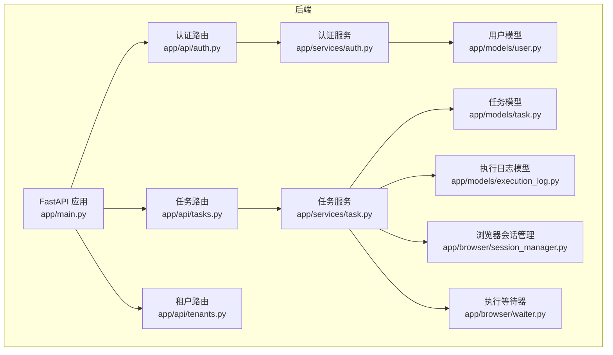
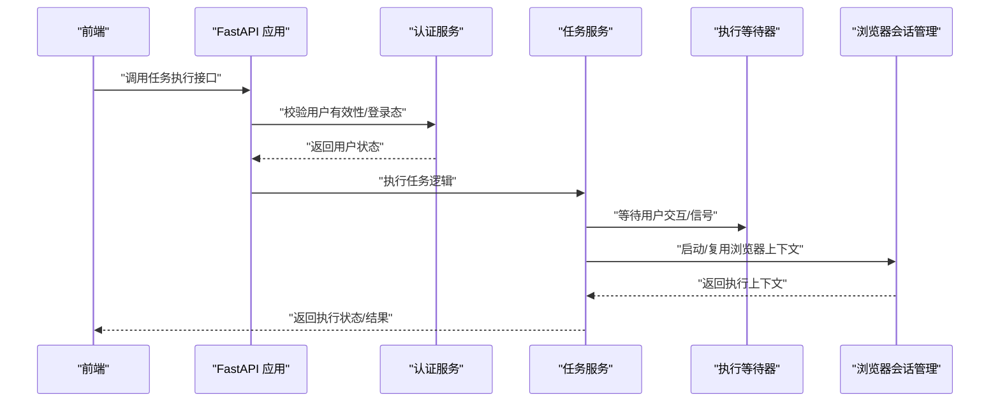
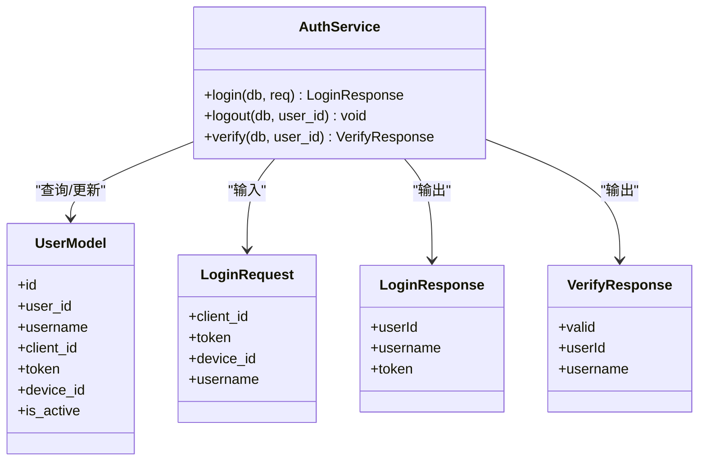
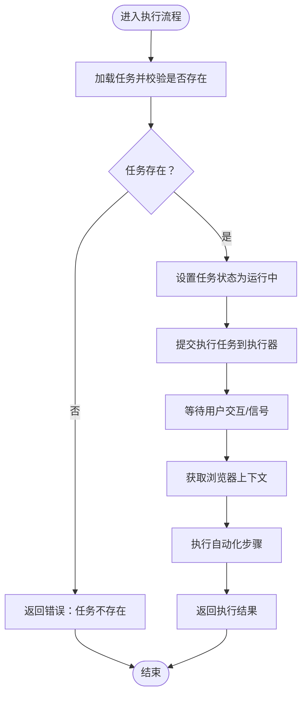
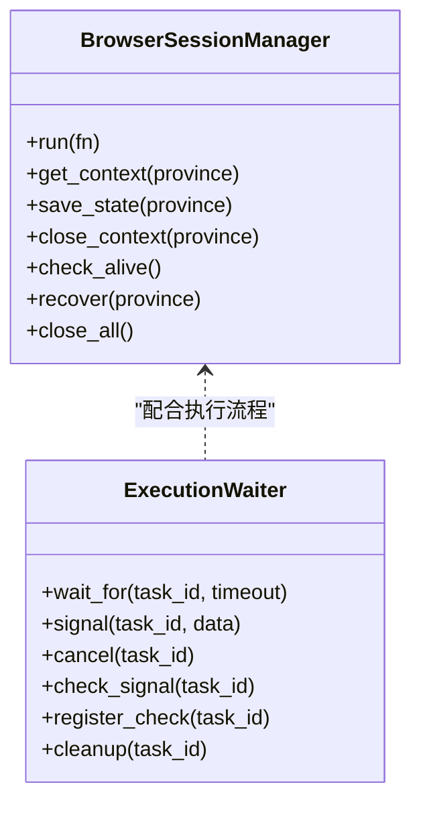
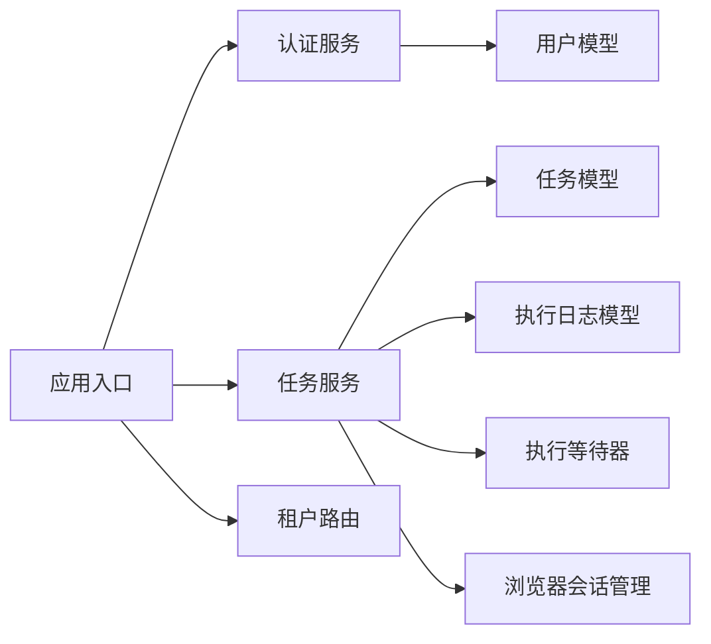

# RBAC 权限控制系统

<cite>
**本文引用的文件**
- [app/main.py](file://CCC_RPA_API/app/main.py)
- [app/api/auth.py](file://CCC_RPA_API/app/api/auth.py)
- [app/services/auth.py](file://CCC_RPA_API/app/services/auth.py)
- [app/models/user.py](file://CCC_RPA_API/app/models/user.py)
- [app/schemas/auth.py](file://CCC_RPA_API/app/schemas/auth.py)
- [app/api/tasks.py](file://CCC_RPA_API/app/api/tasks.py)
- [app/services/task.py](file://CCC_RPA_API/app/services/task.py)
- [app/models/task.py](file://CCC_RPA_API/app/models/task.py)
- [app/models/execution_log.py](file://CCC_RPA_API/app/models/execution_log.py)
- [app/schemas/task.py](file://CCC_RPA_API/app/schemas/task.py)
- [app/browser/session_manager.py](file://CCC_RPA_API/app/browser/session_manager.py)
- [app/browser/waiter.py](file://CCC_RPA_API/app/browser/waiter.py)
- [app/api/tenants.py](file://CCC_RPA_API/app/api/tenants.py)
</cite>

## 目录
1. [引言](#引言)
2. [项目结构](#项目结构)
3. [核心组件](#核心组件)
4. [架构总览](#架构总览)
5. [详细组件分析](#详细组件分析)
6. [依赖分析](#依赖分析)
7. [性能考虑](#性能考虑)
8. [故障排查指南](#故障排查指南)
9. [结论](#结论)
10. [附录](#附录)

## 引言
本文件面向商用级 AI 浏览器系统，围绕 RBAC 权限控制体系进行技术文档梳理。当前代码库未实现显式的“四级固定角色”与“权限矩阵”，但具备完善的用户认证、任务管理与浏览器自动化执行能力。本文基于现有实现，提出可在不破坏既有架构的前提下扩展 RBAC 的设计路径，包括角色定义、权限模型、中间件拦截、细粒度操作控制、审计与安全加固建议。

## 项目结构
后端采用 FastAPI + SQLAlchemy 架构，前端为 Tauri/Vue 应用。权限控制的关键入口位于后端 API 路由与服务层；浏览器自动化与执行等待机制位于独立模块中。

图表来源
- [app/main.py:12-27](file://CCC_RPA_API/app/main.py#L12-L27)
- [app/api/auth.py:7-23](file://CCC_RPA_API/app/api/auth.py#L7-L23)
- [app/api/tasks.py:10-75](file://CCC_RPA_API/app/api/tasks.py#L10-L75)
- [app/api/tenants.py:5-24](file://CCC_RPA_API/app/api/tenants.py#L5-L24)
- [app/services/auth.py:6-57](file://CCC_RPA_API/app/services/auth.py#L6-L57)
- [app/services/task.py:44-156](file://CCC_RPA_API/app/services/task.py#L44-L156)
- [app/models/user.py:7-16](file://CCC_RPA_API/app/models/user.py#L7-L16)
- [app/models/task.py:8-24](file://CCC_RPA_API/app/models/task.py#L8-L24)
- [app/models/execution_log.py:7-16](file://CCC_RPA_API/app/models/execution_log.py#L7-L16)
- [app/browser/session_manager.py:10-185](file://CCC_RPA_API/app/browser/session_manager.py#L10-L185)
- [app/browser/waiter.py:7-83](file://CCC_RPA_API/app/browser/waiter.py#L7-L83)

章节来源
- [app/main.py:12-27](file://CCC_RPA_API/app/main.py#L12-L27)
- [app/main.py:37-87](file://CCC_RPA_API/app/main.py#L37-L87)

## 核心组件
- 认证与用户模型
  - 用户模型包含用户标识、客户端标识、令牌、设备标识与激活状态等字段，支撑登录态与会话校验。
  - 认证接口提供登录、登出、校验能力，服务层负责用户记录的创建/更新与状态维护。
- 任务管理与执行
  - 任务模型支持多维筛选、状态流转与关联执行日志；服务层封装任务 CRUD、执行触发与日志查询。
  - 执行等待器与浏览器会话管理分别负责交互式等待与自动化执行环境的生命周期管理。
- 路由与应用入口
  - FastAPI 应用注册认证、任务、租户等路由；启动时完成数据库初始化与表结构兼容性处理。

章节来源
- [app/models/user.py:7-16](file://CCC_RPA_API/app/models/user.py#L7-L16)
- [app/schemas/auth.py:5-25](file://CCC_RPA_API/app/schemas/auth.py#L5-L25)
- [app/services/auth.py:8-57](file://CCC_RPA_API/app/services/auth.py#L8-L57)
- [app/models/task.py:8-24](file://CCC_RPA_API/app/models/task.py#L8-L24)
- [app/schemas/task.py:5-57](file://CCC_RPA_API/app/schemas/task.py#L5-L57)
- [app/services/task.py:47-156](file://CCC_RPA_API/app/services/task.py#L47-L156)
- [app/browser/waiter.py:14-83](file://CCC_RPA_API/app/browser/waiter.py#L14-L83)
- [app/browser/session_manager.py:30-185](file://CCC_RPA_API/app/browser/session_manager.py#L30-L185)
- [app/api/auth.py:10-23](file://CCC_RPA_API/app/api/auth.py#L10-L23)
- [app/api/tasks.py:13-75](file://CCC_RPA_API/app/api/tasks.py#L13-L75)
- [app/api/tenants.py:21-24](file://CCC_RPA_API/app/api/tenants.py#L21-L24)

## 架构总览
下图展示从请求到执行的关键链路，以及当前实现中尚未内置的权限控制扩展点。

图表来源
- [app/main.py:24-27](file://CCC_RPA_API/app/main.py#L24-L27)
- [app/api/tasks.py:47-52](file://CCC_RPA_API/app/api/tasks.py#L47-L52)
- [app/services/auth.py:48-57](file://CCC_RPA_API/app/services/auth.py#L48-L57)
- [app/services/task.py:120-133](file://CCC_RPA_API/app/services/task.py#L120-L133)
- [app/browser/waiter.py:14-43](file://CCC_RPA_API/app/browser/waiter.py#L14-L43)
- [app/browser/session_manager.py:99-126](file://CCC_RPA_API/app/browser/session_manager.py#L99-L126)

## 详细组件分析

### 认证与用户模型
- 用户模型字段覆盖用户标识、客户端标识、令牌、设备标识与激活状态，便于登录态与设备绑定。
- 认证服务提供登录、登出、校验三类方法，登录时若用户不存在则创建并写入令牌与设备信息；登出时将用户状态置为非激活；校验时返回用户有效性和基本信息。
- 登录接口路由与响应模型定义清晰，便于前端集成。

图表来源
- [app/models/user.py:7-16](file://CCC_RPA_API/app/models/user.py#L7-L16)
- [app/services/auth.py:8-57](file://CCC_RPA_API/app/services/auth.py#L8-L57)
- [app/schemas/auth.py:5-25](file://CCC_RPA_API/app/schemas/auth.py#L5-L25)

章节来源
- [app/models/user.py:7-16](file://CCC_RPA_API/app/models/user.py#L7-L16)
- [app/schemas/auth.py:5-25](file://CCC_RPA_API/app/schemas/auth.py#L5-L25)
- [app/services/auth.py:8-57](file://CCC_RPA_API/app/services/auth.py#L8-L57)
- [app/api/auth.py:10-23](file://CCC_RPA_API/app/api/auth.py#L10-L23)

### 任务管理与执行
- 任务模型支持名称、状态、租户、设备、客户、负责人、子任务、省分、时间戳与删除标记等字段，便于多租户与多设备场景下的任务治理。
- 任务服务提供任务列表、详情、创建、更新、删除、执行与日志查询等能力；执行流程将任务状态置为运行中并提交至执行器，随后通过等待器与会话管理协同完成自动化操作。
- 执行日志模型记录任务执行的起止时间、状态与结果消息，便于审计与回溯。

图表来源
- [app/services/task.py:120-133](file://CCC_RPA_API/app/services/task.py#L120-L133)
- [app/browser/waiter.py:14-43](file://CCC_RPA_API/app/browser/waiter.py#L14-L43)
- [app/browser/session_manager.py:99-126](file://CCC_RPA_API/app/browser/session_manager.py#L99-L126)

章节来源
- [app/models/task.py:8-24](file://CCC_RPA_API/app/models/task.py#L8-L24)
- [app/schemas/task.py:5-57](file://CCC_RPA_API/app/schemas/task.py#L5-L57)
- [app/services/task.py:47-156](file://CCC_RPA_API/app/services/task.py#L47-L156)
- [app/models/execution_log.py:7-16](file://CCC_RPA_API/app/models/execution_log.py#L7-L16)
- [app/api/tasks.py:13-75](file://CCC_RPA_API/app/api/tasks.py#L13-L75)

### 浏览器会话与执行等待
- 浏览器会话管理器以省份为维度管理 Playwright 上下文，支持持久化 storage_state、线程安全执行与异常恢复。
- 执行等待器通过事件与共享数据实现任务执行过程中的暂停/恢复/取消，保障人机协作与交互式流程可控。

图表来源
- [app/browser/session_manager.py:10-185](file://CCC_RPA_API/app/browser/session_manager.py#L10-L185)
- [app/browser/waiter.py:7-83](file://CCC_RPA_API/app/browser/waiter.py#L7-L83)

章节来源
- [app/browser/session_manager.py:30-185](file://CCC_RPA_API/app/browser/session_manager.py#L30-L185)
- [app/browser/waiter.py:14-83](file://CCC_RPA_API/app/browser/waiter.py#L14-L83)

### 租户管理
- 租户路由提供租户列表查询能力，当前为 Mock 数据，后续可替换为真实数据库查询。

章节来源
- [app/api/tenants.py:21-24](file://CCC_RPA_API/app/api/tenants.py#L21-L24)

## 依赖分析
- 组件耦合
  - 认证服务依赖用户模型与数据库会话；任务服务依赖任务模型、执行日志模型与浏览器执行组件。
  - 应用入口集中注册路由并完成数据库初始化，确保服务启动时具备基础能力。
- 外部依赖
  - FastAPI 提供路由与中间件能力；SQLAlchemy 提供 ORM；Playwright 提供浏览器自动化；WebSocket 支持实时通信。

图表来源
- [app/services/auth.py:1-57](file://CCC_RPA_API/app/services/auth.py#L1-L57)
- [app/models/user.py:1-16](file://CCC_RPA_API/app/models/user.py#L1-L16)
- [app/services/task.py:1-156](file://CCC_RPA_API/app/services/task.py#L1-L156)
- [app/models/task.py:1-24](file://CCC_RPA_API/app/models/task.py#L1-L24)
- [app/models/execution_log.py:1-16](file://CCC_RPA_API/app/models/execution_log.py#L1-L16)
- [app/browser/waiter.py:1-83](file://CCC_RPA_API/app/browser/waiter.py#L1-L83)
- [app/browser/session_manager.py:1-185](file://CCC_RPA_API/app/browser/session_manager.py#L1-L185)
- [app/main.py:24-27](file://CCC_RPA_API/app/main.py#L24-L27)

章节来源
- [app/main.py:24-27](file://CCC_RPA_API/app/main.py#L24-L27)
- [app/services/auth.py:1-57](file://CCC_RPA_API/app/services/auth.py#L1-L57)
- [app/services/task.py:1-156](file://CCC_RPA_API/app/services/task.py#L1-L156)

## 性能考虑
- 线程与异步
  - 浏览器操作在专用工作线程中执行，避免与主事件循环冲突；WebSocket 广播通过主事件循环引用实现。
- 数据库与查询
  - 任务列表与日志查询使用分页与索引字段，减少全表扫描；模型基类统一记录创建/更新时间，便于审计与排序。
- 执行效率
  - 通过上下文持久化与按省分管理，降低重复初始化成本；等待器采用事件机制，避免轮询开销。

章节来源
- [app/main.py:9-11](file://CCC_RPA_API/app/main.py#L9-L11)
- [app/main.py:119-126](file://CCC_RPA_API/app/main.py#L119-L126)
- [app/models/base.py:7-10](file://CCC_RPA_API/app/models/base.py#L7-L10)
- [app/browser/session_manager.py:42-77](file://CCC_RPA_API/app/browser/session_manager.py#L42-L77)
- [app/browser/waiter.py:14-32](file://CCC_RPA_API/app/browser/waiter.py#L14-L32)

## 故障排查指南
- 登录与校验
  - 若登录后无法校验，检查用户令牌与设备标识是否正确写入；确认用户状态是否被置为非激活。
- 任务执行
  - 任务不存在：确认任务 ID 与软删除状态；检查任务状态是否被置为运行中。
  - 执行超时：检查等待器超时阈值与浏览器会话是否存活；必要时触发恢复流程。
- 数据库初始化
  - 启动时自动迁移与补列，若异常需检查数据库连接与权限；关注迁移警告日志。

章节来源
- [app/services/auth.py:40-57](file://CCC_RPA_API/app/services/auth.py#L40-L57)
- [app/services/task.py:120-133](file://CCC_RPA_API/app/services/task.py#L120-L133)
- [app/browser/waiter.py:29-30](file://CCC_RPA_API/app/browser/waiter.py#L29-L30)
- [app/browser/session_manager.py:157-170](file://CCC_RPA_API/app/browser/session_manager.py#L157-L170)
- [app/main.py:41-86](file://CCC_RPA_API/app/main.py#L41-L86)

## 结论
当前系统具备完善的认证、任务管理与浏览器自动化能力，但尚未实现 RBAC 四级角色与权限矩阵。建议在不改变现有路由与服务结构的前提下，引入角色与权限模型、中间件拦截与细粒度授权判断，以满足商用级权限控制需求。后续章节将给出扩展设计与最佳实践。

## 附录

### RBAC 扩展设计（概念性方案）
- 角色与权限
  - 定义四级固定角色：超级管理员、租户管理员、操作员、只读用户；为每个角色建立权限集合与继承关系。
  - 将操作抽象为资源+动作（如任务:创建、任务:执行、日志:导出），形成权限矩阵。
- 授权与拦截
  - 在应用入口或路由前添加中间件，解析用户身份与令牌，结合角色与权限矩阵进行授权判定。
  - 对敏感操作（如执行、导出、编辑脚本）实施细粒度校验，确保最小权限原则。
- 审计与安全
  - 记录每次授权决策与关键操作的审计日志；对异常登录、高危操作进行告警与风控。
  - 建议启用 HTTPS、令牌刷新与过期策略、最小暴露面与参数校验。

[本节为概念性设计，不对应具体源码文件]