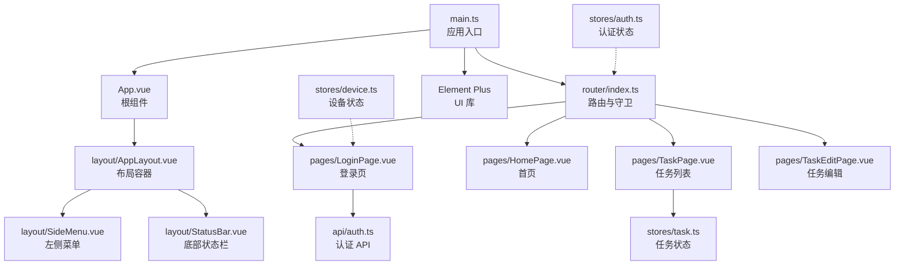
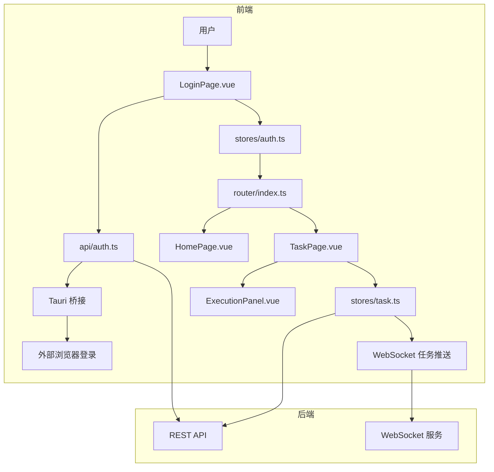
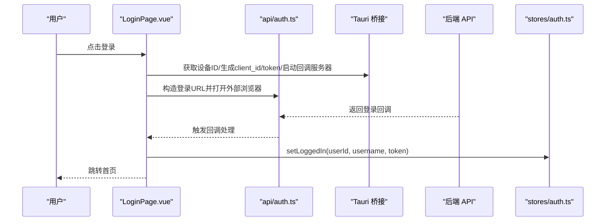
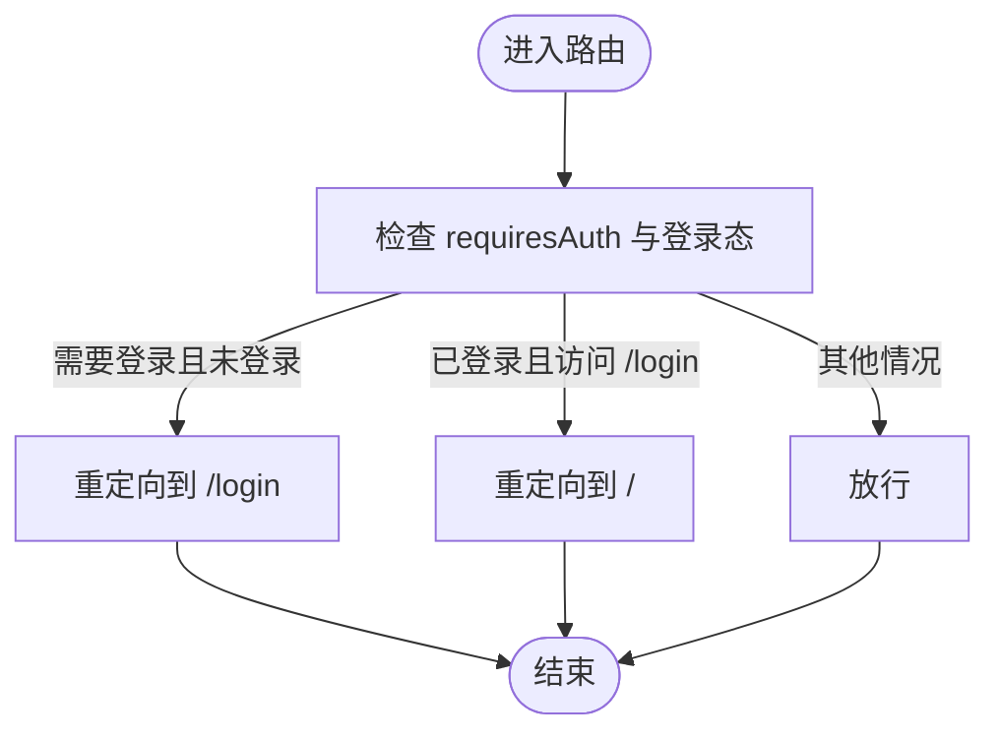
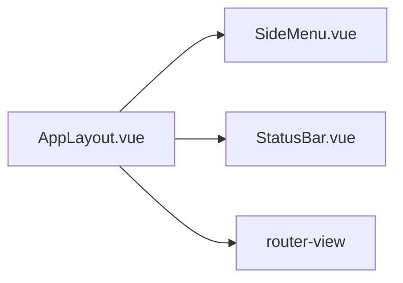
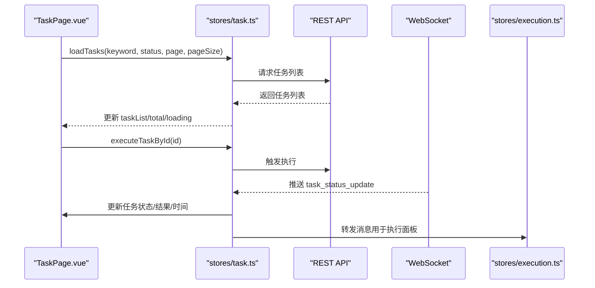
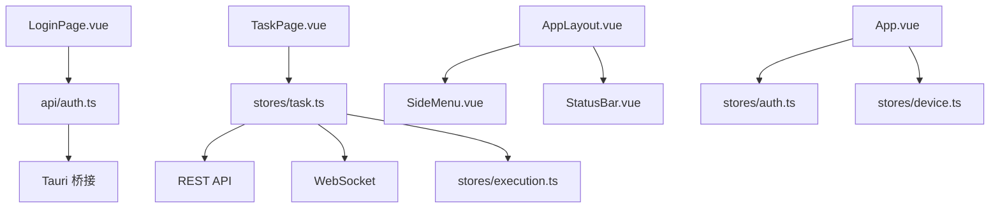

# Web 管理后台

<cite>
**本文引用的文件**
- [main.ts](file://CCC-BrowserV4/frontend/src/main.ts)
- [App.vue](file://CCC-BrowserV4/frontend/src/App.vue)
- [router/index.ts](file://CCC-BrowserV4/frontend/src/router/index.ts)
- [stores/auth.ts](file://CCC-BrowserV4/frontend/src/stores/auth.ts)
- [components/layout/AppLayout.vue](file://CCC-BrowserV4/frontend/src/components/layout/AppLayout.vue)
- [components/layout/SideMenu.vue](file://CCC-BrowserV4/frontend/src/components/layout/SideMenu.vue)
- [components/layout/StatusBar.vue](file://CCC-BrowserV4/frontend/src/components/layout/StatusBar.vue)
- [pages/LoginPage.vue](file://CCC-BrowserV4/frontend/src/pages/LoginPage.vue)
- [api/auth.ts](file://CCC-BrowserV4/frontend/src/api/auth.ts)
- [types/index.ts](file://CCC-BrowserV4/frontend/src/types/index.ts)
- [pages/HomePage.vue](file://CCC-BrowserV4/frontend/src/pages/HomePage.vue)
- [pages/TaskPage.vue](file://CCC-BrowserV4/frontend/src/pages/TaskPage.vue)
- [pages/TaskEditPage.vue](file://CCC-BrowserV4/frontend/src/pages/TaskEditPage.vue)
- [stores/task.ts](file://CCC-BrowserV4/frontend/src/stores/task.ts)
- [stores/device.ts](file://CCC-BrowserV4/frontend/src/stores/device.ts)
</cite>

## 目录
1. [简介](#简介)
2. [项目结构](#项目结构)
3. [核心组件](#核心组件)
4. [架构总览](#架构总览)
5. [详细组件分析](#详细组件分析)
6. [依赖关系分析](#依赖关系分析)
7. [性能考虑](#性能考虑)
8. [故障排查指南](#故障排查指南)
9. [结论](#结论)
10. [附录](#附录)

## 简介
本文件面向商用级 AI 浏览器系统的 Web 管理后台，基于 Vue3 + Pinia + Element Plus 技术栈构建。文档围绕前端应用的整体架构、组件层次、状态管理、认证与路由权限、页面布局、任务管理、以及与后端交互的 WebSocket 实时推送机制进行深入解析，并提供开发规范、组件复用策略、性能优化与用户体验设计建议。

## 项目结构
前端采用“按功能域分层 + 组件化”的组织方式：
- 入口与框架装配：main.ts、App.vue
- 路由与权限：router/index.ts
- 状态管理：stores/*（认证、设备、任务、执行）
- 页面与布局：pages/*、components/layout/*
- 类型定义：types/index.ts
- API 层：api/*（认证、任务、请求封装、WebSocket）
- 工具桥接：utils/tauri-bridge.ts（与原生侧通信）

图示来源
- [main.ts:1-23](file://CCC-BrowserV4/frontend/src/main.ts#L1-L23)
- [App.vue:1-21](file://CCC-BrowserV4/frontend/src/App.vue#L1-L21)
- [router/index.ts:1-63](file://CCC-BrowserV4/frontend/src/router/index.ts#L1-L63)
- [components/layout/AppLayout.vue:1-47](file://CCC-BrowserV4/frontend/src/components/layout/AppLayout.vue#L1-L47)
- [components/layout/SideMenu.vue:1-70](file://CCC-BrowserV4/frontend/src/components/layout/SideMenu.vue#L1-L70)
- [components/layout/StatusBar.vue:1-70](file://CCC-BrowserV4/frontend/src/components/layout/StatusBar.vue#L1-L70)
- [pages/LoginPage.vue:1-228](file://CCC-BrowserV4/frontend/src/pages/LoginPage.vue#L1-L228)
- [pages/HomePage.vue:1-62](file://CCC-BrowserV4/frontend/src/pages/HomePage.vue#L1-L62)
- [pages/TaskPage.vue:1-428](file://CCC-BrowserV4/frontend/src/pages/TaskPage.vue#L1-L428)
- [pages/TaskEditPage.vue:1-284](file://CCC-BrowserV4/frontend/src/pages/TaskEditPage.vue#L1-L284)
- [stores/task.ts:1-84](file://CCC-BrowserV4/frontend/src/stores/task.ts#L1-L84)
- [stores/auth.ts:1-79](file://CCC-BrowserV4/frontend/src/stores/auth.ts#L1-L79)
- [stores/device.ts:1-40](file://CCC-BrowserV4/frontend/src/stores/device.ts#L1-L40)
- [api/auth.ts:1-67](file://CCC-BrowserV4/frontend/src/api/auth.ts#L1-L67)

章节来源
- [main.ts:1-23](file://CCC-BrowserV4/frontend/src/main.ts#L1-L23)
- [router/index.ts:1-63](file://CCC-BrowserV4/frontend/src/router/index.ts#L1-L63)

## 核心组件
- 认证状态管理（Pinia）
  - 提供登录态、用户信息、token、clientToken 的读写与持久化；支持开发模式虚拟登录与从 localStorage 恢复登录态。
- 设备状态管理（Pinia）
  - 提供设备 ID、客户端 ID 的读写；初始化设备信息。
- 任务状态管理（Pinia）
  - 提供任务列表、总数、加载状态；封装任务 CRUD 与执行；订阅 WebSocket 推送并同步任务状态。
- 页面与布局
  - 登录页：支持开发模式与生产模式两种登录路径；集成设备信息展示与超时处理。
  - 首页：占位展示与用户/设备信息展示。
  - 任务页：任务卡片网格、搜索与筛选、分页、执行按钮、内联执行面板、WebSocket 实时更新。
  - 任务编辑页：表单驱动的新增/编辑，异步加载租户与设备列表，表单校验与保存。
- 路由与权限
  - 路由守卫根据 requiresAuth 控制访问；未登录跳转登录，已登录访问登录页则跳转首页。
- 布局组件
  - 侧边菜单：菜单项配置与高亮；支持点击导航。
  - 底部状态栏：显示设备、用户、版本与连接状态。

章节来源
- [stores/auth.ts:1-79](file://CCC-BrowserV4/frontend/src/stores/auth.ts#L1-L79)
- [stores/device.ts:1-40](file://CCC-BrowserV4/frontend/src/stores/device.ts#L1-L40)
- [stores/task.ts:1-84](file://CCC-BrowserV4/frontend/src/stores/task.ts#L1-L84)
- [pages/LoginPage.vue:1-228](file://CCC-BrowserV4/frontend/src/pages/LoginPage.vue#L1-L228)
- [pages/HomePage.vue:1-62](file://CCC-BrowserV4/frontend/src/pages/HomePage.vue#L1-L62)
- [pages/TaskPage.vue:1-428](file://CCC-BrowserV4/frontend/src/pages/TaskPage.vue#L1-L428)
- [pages/TaskEditPage.vue:1-284](file://CCC-BrowserV4/frontend/src/pages/TaskEditPage.vue#L1-L284)
- [router/index.ts:1-63](file://CCC-BrowserV4/frontend/src/router/index.ts#L1-L63)
- [components/layout/SideMenu.vue:1-70](file://CCC-BrowserV4/frontend/src/components/layout/SideMenu.vue#L1-L70)
- [components/layout/StatusBar.vue:1-70](file://CCC-BrowserV4/frontend/src/components/layout/StatusBar.vue#L1-L70)

## 架构总览
系统采用“前端 SPA + 原生桥接 + 后端 API + WebSocket 实时推送”的架构：
- 前端通过 Tauri 桥接获取设备信息、生成 client_id/token、启动本地回调服务器、打开外部浏览器进行登录。
- 登录成功后，前端通过 Pinia 管理登录态与设备信息，并在路由守卫下进行权限控制。
- 任务列表通过 REST API 获取，同时通过 WebSocket 接收任务状态变更，实现近实时更新。
- 页面组件通过组合式 API 与 Pinia Store 解耦，便于测试与维护。

图示来源
- [pages/LoginPage.vue:1-228](file://CCC-BrowserV4/frontend/src/pages/LoginPage.vue#L1-L228)
- [api/auth.ts:1-67](file://CCC-BrowserV4/frontend/src/api/auth.ts#L1-L67)
- [stores/auth.ts:1-79](file://CCC-BrowserV4/frontend/src/stores/auth.ts#L1-L79)
- [router/index.ts:1-63](file://CCC-BrowserV4/frontend/src/router/index.ts#L1-L63)
- [pages/TaskPage.vue:1-428](file://CCC-BrowserV4/frontend/src/pages/TaskPage.vue#L1-L428)
- [stores/task.ts:1-84](file://CCC-BrowserV4/frontend/src/stores/task.ts#L1-L84)

## 详细组件分析

### 登录认证流程
- 开发模式：直接调用后端登录接口，回退到本地虚拟登录，设置登录态并跳转首页。
- 生产模式：通过 Tauri 桥接生成设备 ID、client_id、token，启动本地回调服务器，构造登录 URL 打开外部浏览器；监听登录回调事件，成功后设置登录态并跳转首页；超时处理 5 分钟。
- 登录态持久化：登录成功后将关键状态写入 localStorage，应用挂载时恢复。

图示来源
- [pages/LoginPage.vue:93-169](file://CCC-BrowserV4/frontend/src/pages/LoginPage.vue#L93-L169)
- [api/auth.ts:25-66](file://CCC-BrowserV4/frontend/src/api/auth.ts#L25-L66)
- [stores/auth.ts:15-39](file://CCC-BrowserV4/frontend/src/stores/auth.ts#L15-L39)

章节来源
- [pages/LoginPage.vue:1-228](file://CCC-BrowserV4/frontend/src/pages/LoginPage.vue#L1-L228)
- [api/auth.ts:1-67](file://CCC-BrowserV4/frontend/src/api/auth.ts#L1-L67)
- [stores/auth.ts:1-79](file://CCC-BrowserV4/frontend/src/stores/auth.ts#L1-L79)

### 路由权限控制
- 路由元信息 requiresAuth 控制访问；
- 未登录访问受保护路由跳转登录；
- 已登录访问登录页跳转首页；
- 登录页组件在卸载时清理回调与定时器，避免内存泄漏。

图示来源
- [router/index.ts:48-60](file://CCC-BrowserV4/frontend/src/router/index.ts#L48-L60)

章节来源
- [router/index.ts:1-63](file://CCC-BrowserV4/frontend/src/router/index.ts#L1-L63)

### 页面布局组件设计
- AppLayout：左右布局，左侧侧边菜单，右侧主内容区与底部状态栏。
- SideMenu：菜单项配置与高亮，点击导航至对应路由。
- StatusBar：显示设备 ID、当前用户、版本与连接状态。

图示来源
- [components/layout/AppLayout.vue:1-47](file://CCC-BrowserV4/frontend/src/components/layout/AppLayout.vue#L1-L47)
- [components/layout/SideMenu.vue:1-70](file://CCC-BrowserV4/frontend/src/components/layout/SideMenu.vue#L1-L70)
- [components/layout/StatusBar.vue:1-70](file://CCC-BrowserV4/frontend/src/components/layout/StatusBar.vue#L1-L70)

章节来源
- [components/layout/AppLayout.vue:1-47](file://CCC-BrowserV4/frontend/src/components/layout/AppLayout.vue#L1-L47)
- [components/layout/SideMenu.vue:1-70](file://CCC-BrowserV4/frontend/src/components/layout/SideMenu.vue#L1-L70)
- [components/layout/StatusBar.vue:1-70](file://CCC-BrowserV4/frontend/src/components/layout/StatusBar.vue#L1-L70)

### 任务管理模块
- 任务列表：支持关键词搜索（防抖）、状态筛选、分页；卡片展示任务关键信息与状态标签；执行按钮触发任务执行并乐观更新状态。
- 任务编辑：表单驱动，异步加载租户与设备列表；保存时进行表单校验；新增/编辑分别调用不同接口。
- 实时更新：初始化时建立 WebSocket 连接，接收任务状态变更并同步到列表；同时转发消息给执行状态管理。

图示来源
- [pages/TaskPage.vue:158-190](file://CCC-BrowserV4/frontend/src/pages/TaskPage.vue#L158-L190)
- [stores/task.ts:13-24](file://CCC-BrowserV4/frontend/src/stores/task.ts#L13-L24)
- [stores/task.ts:57-80](file://CCC-BrowserV4/frontend/src/stores/task.ts#L57-L80)

章节来源
- [pages/TaskPage.vue:1-428](file://CCC-BrowserV4/frontend/src/pages/TaskPage.vue#L1-L428)
- [pages/TaskEditPage.vue:1-284](file://CCC-BrowserV4/frontend/src/pages/TaskEditPage.vue#L1-L284)
- [stores/task.ts:1-84](file://CCC-BrowserV4/frontend/src/stores/task.ts#L1-L84)

### 数据模型与类型
- 认证状态：包含登录态、用户 ID、用户名、服务端 token、客户端 token。
- 设备状态：包含设备 ID、客户端 ID。
- 任务信息：包含任务 ID、名称、状态、租户/设备/客户/经手人、子任务、省、下次执行时间、最近执行结果、备注、创建/更新时间等。

章节来源
- [types/index.ts:1-42](file://CCC-BrowserV4/frontend/src/types/index.ts#L1-L42)

## 依赖关系分析
- 组件耦合
  - 页面组件仅依赖对应的 Pinia Store，Store 依赖 API 层，API 层依赖请求封装与 WebSocket 封装。
  - 布局组件与页面解耦，通过路由装载。
- 外部依赖
  - Element Plus UI 组件库与图标注册。
  - Tauri 桥接提供设备信息、事件监听、浏览器打开能力。
- 循环依赖
  - 当前结构未见明显循环依赖；Store 间通过消息转发避免直接互相引用。

图示来源
- [pages/LoginPage.vue:1-228](file://CCC-BrowserV4/frontend/src/pages/LoginPage.vue#L1-L228)
- [api/auth.ts:1-67](file://CCC-BrowserV4/frontend/src/api/auth.ts#L1-L67)
- [pages/TaskPage.vue:1-428](file://CCC-BrowserV4/frontend/src/pages/TaskPage.vue#L1-L428)
- [stores/task.ts:1-84](file://CCC-BrowserV4/frontend/src/stores/task.ts#L1-L84)
- [components/layout/AppLayout.vue:1-47](file://CCC-BrowserV4/frontend/src/components/layout/AppLayout.vue#L1-L47)
- [components/layout/SideMenu.vue:1-70](file://CCC-BrowserV4/frontend/src/components/layout/SideMenu.vue#L1-L70)
- [components/layout/StatusBar.vue:1-70](file://CCC-BrowserV4/frontend/src/components/layout/StatusBar.vue#L1-L70)
- [App.vue:1-21](file://CCC-BrowserV4/frontend/src/App.vue#L1-L21)
- [stores/auth.ts:1-79](file://CCC-BrowserV4/frontend/src/stores/auth.ts#L1-L79)
- [stores/device.ts:1-40](file://CCC-BrowserV4/frontend/src/stores/device.ts#L1-L40)

章节来源
- [main.ts:1-23](file://CCC-BrowserV4/frontend/src/main.ts#L1-L23)
- [router/index.ts:1-63](file://CCC-BrowserV4/frontend/src/router/index.ts#L1-L63)

## 性能考虑
- 组件渲染
  - 使用 v-loading 在任务列表加载时提供骨架反馈；卡片网格使用 CSS Grid，减少复杂布局计算。
- 网络请求
  - 任务搜索使用防抖（300ms），降低频繁请求；分页参数化，避免一次性拉取过多数据。
- 状态更新
  - WebSocket 推送仅更新匹配的任务项字段，避免全量刷新；Store 内部聚合消息并统一处理。
- 资源加载
  - 页面组件按需动态导入，减少首屏体积；Element Plus 图标全局注册，避免重复引入。
- 事件清理
  - 登录页在卸载时清理事件监听与定时器，防止内存泄漏。

## 故障排查指南
- 登录超时
  - 现象：点击登录后长时间无响应。
  - 排查：检查本地回调服务器端口是否正确、外部浏览器是否正常打开、事件监听是否注册成功、5 分钟超时逻辑是否触发。
- 登录失败
  - 现象：登录回调返回失败或异常。
  - 排查：查看回调处理分支、错误提示与消息弹窗；确认后端登录接口可用性。
- 任务状态不更新
  - 现象：执行任务后状态未变化。
  - 排查：确认 WebSocket 是否连接成功、消息类型是否为任务状态更新、Store 是否正确处理消息并更新列表。
- 页面空白或样式异常
  - 现象：页面无法渲染或样式错乱。
  - 排查：检查 Element Plus 引入与主题样式、scoped 样式作用域、组件导入路径。

章节来源
- [pages/LoginPage.vue:130-169](file://CCC-BrowserV4/frontend/src/pages/LoginPage.vue#L130-L169)
- [stores/task.ts:57-80](file://CCC-BrowserV4/frontend/src/stores/task.ts#L57-L80)
- [main.ts:1-23](file://CCC-BrowserV4/frontend/src/main.ts#L1-L23)

## 结论
该管理后台以 Vue3 + Pinia 为核心，结合 Element Plus 与 Tauri 桥接，实现了安全的登录认证、灵活的路由权限控制、清晰的页面布局与强大的任务管理能力。通过 REST API 与 WebSocket 的协同，系统具备良好的实时性与可扩展性。后续可在监控大盘、租户管理、审计日志检索等方面进一步完善，提升运维与可视化能力。

## 附录
- 开发规范
  - 组件命名：语义化、PascalCase；页面组件以 Page 结尾，通用组件以组件名结尾。
  - 状态管理：单一职责，Store 仅负责状态与副作用；UI 仅负责渲染与调度。
  - 路由设计：meta 中明确 requiresAuth；路由懒加载；路径风格统一。
  - 样式：优先使用 Element Plus 组件样式；自定义样式使用 scoped，避免全局污染。
- 组件复用策略
  - 将通用布局与菜单抽离为独立组件；将业务无关的交互（如弹窗、确认框）抽象为工具函数或可复用的混入。
- 性能优化技巧
  - 虚拟滚动与分页结合；图片与大列表懒加载；缓存与去抖；合理拆分包与按需加载。
- 用户体验设计指南
  - 明确的加载反馈与错误提示；一致的交互节奏；键盘可访问性；暗色模式适配。