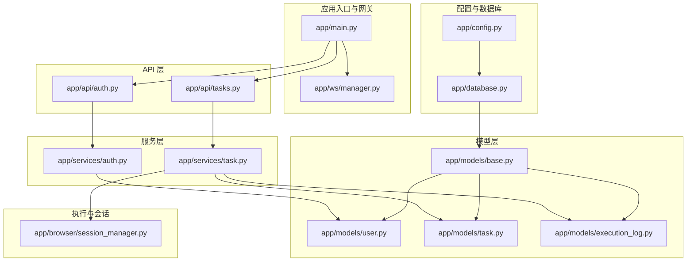
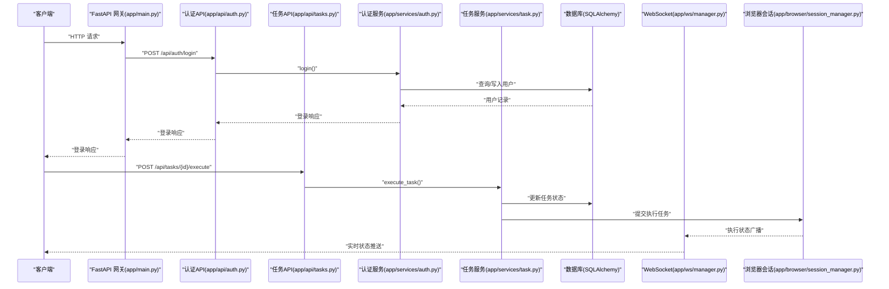
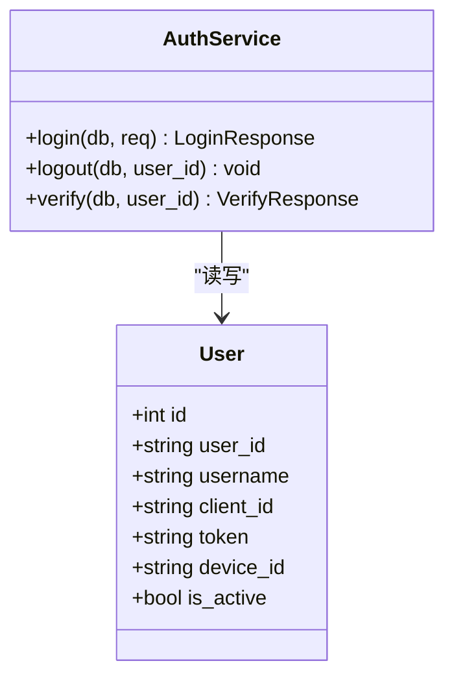
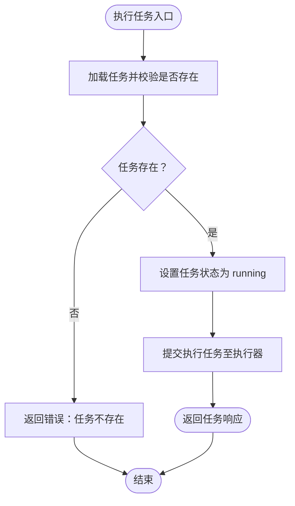
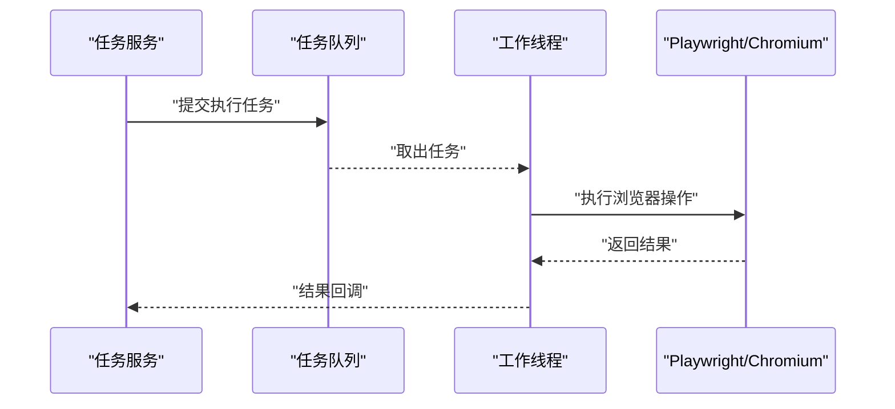
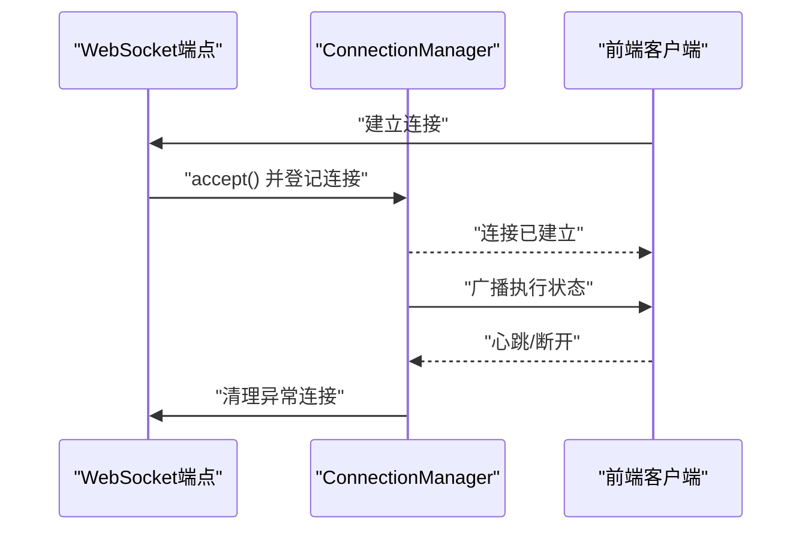
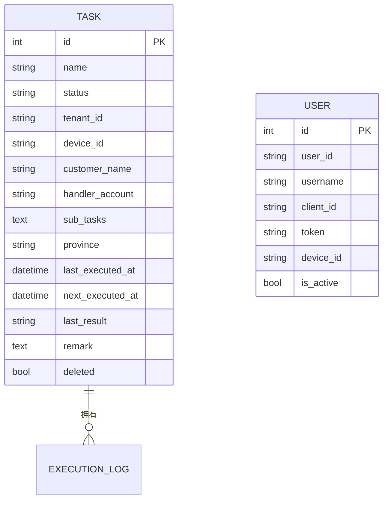
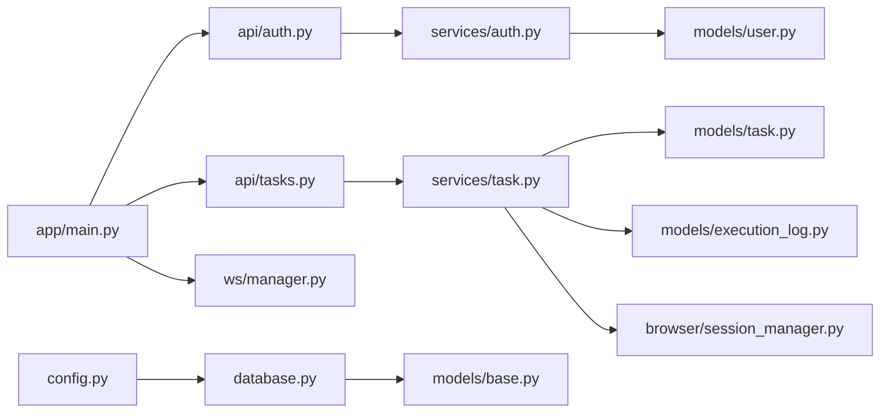

# 层5：网关与多租户业务管理层

<cite>
**本文档引用的文件**
- [main.py](file://CCC_RPA_API/app/main.py)
- [config.py](file://CCC_RPA_API/app/config.py)
- [database.py](file://CCC_RPA_API/app/database.py)
- [base.py](file://CCC_RPA_API/app/models/base.py)
- [user.py](file://CCC_RPA_API/app/models/user.py)
- [task.py](file://CCC_RPA_API/app/models/task.py)
- [execution_log.py](file://CCC_RPA_API/app/models/execution_log.py)
- [auth.py](file://CCC_RPA_API/app/api/auth.py)
- [tasks.py](file://CCC_RPA_API/app/api/tasks.py)
- [manager.py](file://CCC_RPA_API/app/ws/manager.py)
- [session_manager.py](file://CCC_RPA_API/app/browser/session_manager.py)
- [auth.py](file://CCC_RPA_API/app/services/auth.py)
- [task.py](file://CCC_RPA_API/app/services/task.py)
</cite>

## 目录
1. [简介](#简介)
2. [项目结构](#项目结构)
3. [核心组件](#核心组件)
4. [架构总览](#架构总览)
5. [详细组件分析](#详细组件分析)
6. [依赖分析](#依赖分析)
7. [性能考虑](#性能考虑)
8. [故障排查指南](#故障排查指南)
9. [结论](#结论)
10. [附录](#附录)

## 简介
本文件面向商用级 AI 浏览器系统的“网关与多租户业务管理层”，聚焦以下主题：
- 统一 API 入口的设计与路由组织
- 多租户管理模块的实现机制与数据隔离策略
- RBAC 四级权限控制体系的落地方式与扩展路径
- 租户 CRUD 操作、会话并发配额管理、计费统计模块的数据流设计
- Web 管理后台的功能架构、用户界面设计、实时监控面板实现
- 基于统一用户角色体系的精细化权限管控（创建会话、执行 AI 任务、导出数据、编辑脚本等）
- 权限配置示例、租户数据隔离实现、审计日志记录机制
- 通过网关层实现业务逻辑集中管理与多租户环境下的数据安全隔离

## 项目结构
后端采用 FastAPI + SQLAlchemy 架构，核心目录与职责如下：
- 应用入口与网关：app/main.py 负责应用生命周期、CORS、路由注册、健康检查与 WebSocket 管理
- 配置与数据库：app/config.py 定义数据库连接参数；app/database.py 提供引擎与会话工厂
- 数据模型：app/models/* 定义通用基类与实体（用户、任务、执行日志）
- API 层：app/api/* 定义认证与任务相关接口
- 业务服务：app/services/* 实现领域服务（认证、任务、执行器等）
- 浏览器会话与执行：app/browser/* 管理会话与执行流程
- WebSocket 管理：app/ws/manager.py 提供广播与连接管理

图表来源
- [main.py:1-127](file://CCC_RPA_API/app/main.py#L1-L127)
- [config.py:1-22](file://CCC_RPA_API/app/config.py#L1-L22)
- [database.py:1-19](file://CCC_RPA_API/app/database.py#L1-L19)
- [base.py:1-11](file://CCC_RPA_API/app/models/base.py#L1-L11)
- [user.py:1-17](file://CCC_RPA_API/app/models/user.py#L1-L17)
- [task.py:1-25](file://CCC_RPA_API/app/models/task.py#L1-L25)
- [execution_log.py:1-17](file://CCC_RPA_API/app/models/execution_log.py#L1-L17)
- [auth.py:1-24](file://CCC_RPA_API/app/api/auth.py#L1-L24)
- [tasks.py:1-76](file://CCC_RPA_API/app/api/tasks.py#L1-L76)
- [manager.py:1-29](file://CCC_RPA_API/app/ws/manager.py#L1-L29)
- [session_manager.py:1-186](file://CCC_RPA_API/app/browser/session_manager.py#L1-L186)
- [auth.py:1-58](file://CCC_RPA_API/app/services/auth.py#L1-L58)
- [task.py:1-157](file://CCC_RPA_API/app/services/task.py#L1-L157)

章节来源
- [main.py:1-127](file://CCC_RPA_API/app/main.py#L1-L127)
- [config.py:1-22](file://CCC_RPA_API/app/config.py#L1-L22)
- [database.py:1-19](file://CCC_RPA_API/app/database.py#L1-L19)

## 核心组件
- 统一 API 入口与网关
  - 应用启动时创建数据库表与迁移字段，注册认证、任务、设备等路由
  - 提供健康检查与 WebSocket 广播通道
- 认证与会话管理
  - 用户登录、登出、校验接口；基于 token 的会话状态维护
- 任务编排与执行
  - 任务的增删改查、执行触发、执行日志查询
  - 通过专用线程与队列执行浏览器自动化，避免事件循环冲突
- 多租户数据模型
  - 任务模型包含 tenant_id、device_id 等字段，支撑租户与设备维度的数据隔离
- 实时通信
  - WebSocket 连接管理与广播，用于执行状态推送与交互式控制

章节来源
- [main.py:12-127](file://CCC_RPA_API/app/main.py#L12-L127)
- [auth.py:1-24](file://CCC_RPA_API/app/api/auth.py#L1-L24)
- [task.py:1-25](file://CCC_RPA_API/app/models/task.py#L1-L25)
- [manager.py:1-29](file://CCC_RPA_API/app/ws/manager.py#L1-L29)
- [session_manager.py:1-186](file://CCC_RPA_API/app/browser/session_manager.py#L1-L186)

## 架构总览
下图展示从客户端到后端服务的整体调用链路与数据流向。

图表来源
- [main.py:23-27](file://CCC_RPA_API/app/main.py#L23-L27)
- [auth.py:10-23](file://CCC_RPA_API/app/api/auth.py#L10-L23)
- [tasks.py:47-52](file://CCC_RPA_API/app/api/tasks.py#L47-L52)
- [auth.py:9-38](file://CCC_RPA_API/app/services/auth.py#L9-L38)
- [task.py:120-133](file://CCC_RPA_API/app/services/task.py#L120-L133)
- [manager.py:17-26](file://CCC_RPA_API/app/ws/manager.py#L17-L26)
- [session_manager.py:80-96](file://CCC_RPA_API/app/browser/session_manager.py#L80-L96)

## 详细组件分析

### 统一 API 入口与网关
- 路由注册
  - 认证、任务、设备、租户等路由在应用启动时注册
- CORS 配置
  - 放通跨域请求，便于前端与 WebSocket 使用
- 启动与关闭钩子
  - 启动时创建表、迁移字段、注入示例数据
  - 关闭时清理浏览器会话资源
- 健康检查与 WebSocket
  - 提供 /health 接口与 /ws 广播通道

章节来源
- [main.py:12-127](file://CCC_RPA_API/app/main.py#L12-L127)

### 认证与会话管理
- 登录流程
  - 根据 client_id 查找或创建用户，更新 token 与设备信息
- 登出流程
  - 将用户标记为非活跃
- 校验流程
  - 返回用户激活状态与基本信息
- 数据模型
  - 用户模型包含 user_id、client_id、token、device_id、is_active 等字段

图表来源
- [user.py:7-16](file://CCC_RPA_API/app/models/user.py#L7-L16)
- [auth.py:9-57](file://CCC_RPA_API/app/services/auth.py#L9-L57)

章节来源
- [auth.py:1-24](file://CCC_RPA_API/app/api/auth.py#L1-L24)
- [auth.py:1-58](file://CCC_RPA_API/app/services/auth.py#L1-L58)
- [user.py:1-17](file://CCC_RPA_API/app/models/user.py#L1-L17)

### 任务编排与执行
- 任务 CRUD
  - 支持分页列表、详情、创建、更新、删除
  - 创建/更新时对 JSON 字段进行序列化处理
- 任务执行
  - 触发执行前将任务状态置为运行中，异步提交执行
- 执行日志
  - 查询任务执行历史，包含开始时间、结束时间、状态、结果消息
- 交互式控制
  - 提供扫描完成、选择公司、取消执行等交互信号

图表来源
- [tasks.py:47-52](file://CCC_RPA_API/app/api/tasks.py#L47-L52)
- [task.py:120-133](file://CCC_RPA_API/app/services/task.py#L120-L133)

章节来源
- [tasks.py:1-76](file://CCC_RPA_API/app/api/tasks.py#L1-L76)
- [task.py:1-157](file://CCC_RPA_API/app/services/task.py#L1-L157)
- [task.py:1-25](file://CCC_RPA_API/app/models/task.py#L1-L25)
- [execution_log.py:1-17](file://CCC_RPA_API/app/models/execution_log.py#L1-L17)

### 浏览器会话与执行器
- 专用工作线程
  - 启动 Playwright 与 Chromium，避免与 asyncio 冲突
  - 通过队列接收任务并在工作线程内执行
- 上下文管理
  - 按省份管理 BrowserContext，持久化 storage_state
  - 自动恢复失效上下文，必要时重建浏览器实例
- 资源回收
  - 应用关闭时关闭所有上下文与浏览器

图表来源
- [session_manager.py:42-77](file://CCC_RPA_API/app/browser/session_manager.py#L42-L77)
- [session_manager.py:80-96](file://CCC_RPA_API/app/browser/session_manager.py#L80-L96)
- [session_manager.py:99-126](file://CCC_RPA_API/app/browser/session_manager.py#L99-L126)

章节来源
- [session_manager.py:1-186](file://CCC_RPA_API/app/browser/session_manager.py#L1-L186)

### WebSocket 实时通信
- 连接管理
  - 维护连接集合，接受与断开连接
- 广播机制
  - 对存活连接发送文本消息，自动清理异常连接
- 在执行流程中的应用
  - 任务执行状态通过广播推送给前端

图表来源
- [main.py:119-127](file://CCC_RPA_API/app/main.py#L119-L127)
- [manager.py:10-26](file://CCC_RPA_API/app/ws/manager.py#L10-L26)

章节来源
- [manager.py:1-29](file://CCC_RPA_API/app/ws/manager.py#L1-L29)
- [main.py:119-127](file://CCC_RPA_API/app/main.py#L119-L127)

### 多租户数据模型与隔离
- 任务模型字段
  - 包含 tenant_id、device_id、customer_name、handler_account 等字段
- 数据隔离策略
  - 在查询与更新时以 tenant_id 作为过滤条件，确保跨租户数据隔离
  - 可结合设备维度进一步细化隔离

图表来源
- [task.py:8-24](file://CCC_RPA_API/app/models/task.py#L8-L24)
- [user.py:7-16](file://CCC_RPA_API/app/models/user.py#L7-L16)
- [execution_log.py:7-16](file://CCC_RPA_API/app/models/execution_log.py#L7-L16)

章节来源
- [task.py:1-25](file://CCC_RPA_API/app/models/task.py#L1-L25)
- [user.py:1-17](file://CCC_RPA_API/app/models/user.py#L1-L17)

### RBAC 四级权限控制体系
- 设计思路
  - 用户角色：普通用户、租户管理员、平台管理员、超级管理员
  - 权限粒度：会话创建、AI 任务执行、数据导出、脚本编辑
  - 控制方式：基于用户角色与租户上下文的授权决策
- 实施建议
  - 在 API 层增加中间件，解析用户身份与租户上下文
  - 为每个操作定义权限码，结合角色映射进行校验
  - 对敏感操作（如导出、编辑）启用二次确认与审计日志
- 与现有模型的衔接
  - 用户模型包含 user_id、client_id、device_id、is_active
  - 可扩展 role、tenant_id 等字段以支持角色与租户绑定

章节来源
- [user.py:1-17](file://CCC_RPA_API/app/models/user.py#L1-L17)

### 租户 CRUD 操作与会话并发配额
- 租户 CRUD
  - 建议在 API 层新增 /api/tenants 路由，提供创建、查询、更新、删除
  - 在任务模型中强制携带 tenant_id，查询时默认按租户过滤
- 会话并发配额
  - 基于浏览器会话管理器，按租户/设备维度限制并发上下文数量
  - 超限时返回排队或拒绝响应，引导用户重试或升级配额

章节来源
- [task.py:14-15](file://CCC_RPA_API/app/models/task.py#L14-L15)
- [session_manager.py:99-126](file://CCC_RPA_API/app/browser/session_manager.py#L99-L126)

### 计费统计模块数据流设计
- 数据来源
  - 任务执行日志（开始/结束时间、状态、结果消息）
  - 任务元数据（名称、客户、省份、处理器账号）
- 数据流
  - 执行完成后写入执行日志，定时统计生成计费报表
  - 可按租户、设备、任务类型聚合，支持导出与可视化

章节来源
- [execution_log.py:1-17](file://CCC_RPA_API/app/models/execution_log.py#L1-L17)
- [task.py:16-17](file://CCC_RPA_API/app/models/task.py#L16-L17)

### Web 管理后台功能架构与实时监控
- 功能架构
  - 登录页、任务页、任务编辑页、执行面板
  - 侧边栏菜单、状态栏、布局组件
- 实时监控
  - 通过 WebSocket 接收执行状态，驱动执行面板刷新
  - 支持交互式控制（扫描完成、选择公司、取消执行）

章节来源
- [tasks.py:60-75](file://CCC_RPA_API/app/api/tasks.py#L60-L75)
- [manager.py:17-26](file://CCC_RPA_API/app/ws/manager.py#L17-L26)

## 依赖分析
- 组件耦合
  - API 层仅依赖服务层，服务层依赖模型层与数据库
  - 会话管理器独立于 API 层，通过队列与工作线程解耦
- 外部依赖
  - FastAPI、SQLAlchemy、Pydantic、Playwright
- 潜在风险
  - 事件循环与同步 API 的冲突需通过专用线程规避
  - WebSocket 连接异常需及时清理，避免内存泄漏

图表来源
- [auth.py:1-24](file://CCC_RPA_API/app/api/auth.py#L1-L24)
- [tasks.py:1-76](file://CCC_RPA_API/app/api/tasks.py#L1-L76)
- [auth.py:1-58](file://CCC_RPA_API/app/services/auth.py#L1-L58)
- [task.py:1-157](file://CCC_RPA_API/app/services/task.py#L1-L157)
- [task.py:1-25](file://CCC_RPA_API/app/models/task.py#L1-L25)
- [execution_log.py:1-17](file://CCC_RPA_API/app/models/execution_log.py#L1-L17)
- [user.py:1-17](file://CCC_RPA_API/app/models/user.py#L1-L17)
- [session_manager.py:1-186](file://CCC_RPA_API/app/browser/session_manager.py#L1-L186)
- [main.py:1-127](file://CCC_RPA_API/app/main.py#L1-L127)
- [manager.py:1-29](file://CCC_RPA_API/app/ws/manager.py#L1-L29)
- [config.py:1-22](file://CCC_RPA_API/app/config.py#L1-L22)
- [database.py:1-19](file://CCC_RPA_API/app/database.py#L1-L19)
- [base.py:1-11](file://CCC_RPA_API/app/models/base.py#L1-L11)

章节来源
- [main.py:1-127](file://CCC_RPA_API/app/main.py#L1-L127)
- [database.py:1-19](file://CCC_RPA_API/app/database.py#L1-L19)

## 性能考虑
- 事件循环与同步 API
  - 通过专用工作线程与队列执行浏览器操作，避免阻塞主事件循环
- 连接池与会话复用
  - 按省份复用 BrowserContext，减少启动成本
- 日志与广播
  - WebSocket 广播需注意批量发送与异常清理，避免阻塞
- 数据库优化
  - 为常用查询字段添加索引（如任务状态、租户 ID、创建时间）

## 故障排查指南
- 浏览器初始化失败
  - 检查工作线程是否成功启动，查看初始化超时与异常日志
- WebSocket 断连
  - 确认连接管理器是否清理异常连接，检查前端心跳
- 任务执行异常
  - 查看执行日志表与任务状态，定位具体环节
- 数据库迁移失败
  - 检查字段是否存在与权限，必要时手动执行迁移语句

章节来源
- [session_manager.py:70-77](file://CCC_RPA_API/app/browser/session_manager.py#L70-L77)
- [manager.py:17-26](file://CCC_RPA_API/app/ws/manager.py#L17-L26)
- [task.py:136-156](file://CCC_RPA_API/app/services/task.py#L136-L156)
- [main.py:41-86](file://CCC_RPA_API/app/main.py#L41-L86)

## 结论
本层通过统一网关、清晰的服务边界与多租户数据模型，实现了商用级 AI 浏览器系统的集中化管理与安全隔离。配合 RBAC 权限体系与实时通信能力，能够满足多租户场景下的精细化权限控制与高效运维需求。后续可在认证服务中引入角色与租户字段，完善权限控制闭环，并在任务服务中加入配额与计费统计模块，形成完整的业务闭环。

## 附录
- 权限配置示例（概念性说明）
  - 普通用户：仅可查看与执行自有任务
  - 租户管理员：可管理本租户任务与成员
  - 平台管理员：可跨租户查看与导出数据
  - 超级管理员：具备系统级操作权限
- 审计日志记录机制（概念性说明）
  - 对敏感操作（导出、编辑、删除）记录操作人、租户、时间、结果
  - 日志落库并支持检索与导出