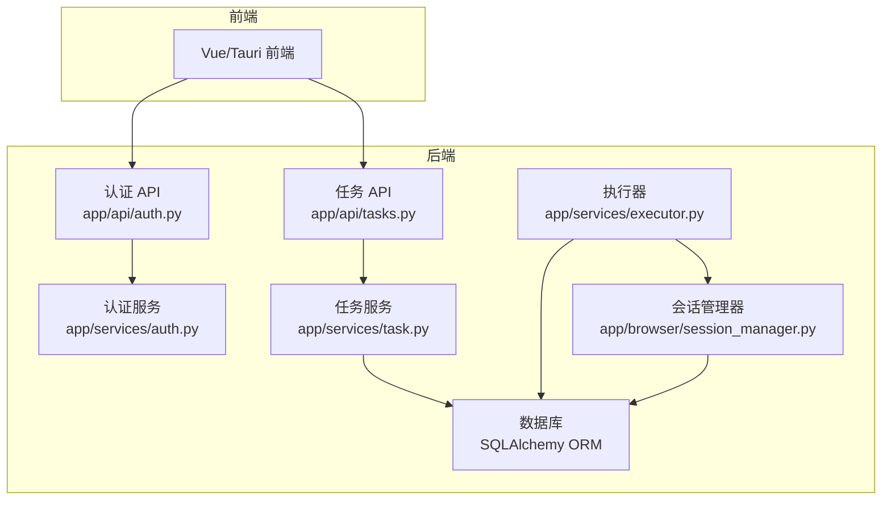
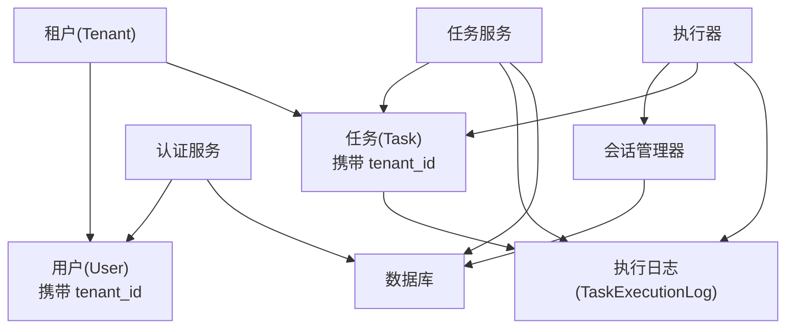
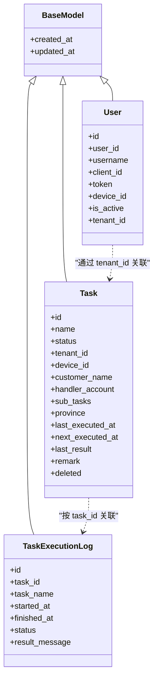
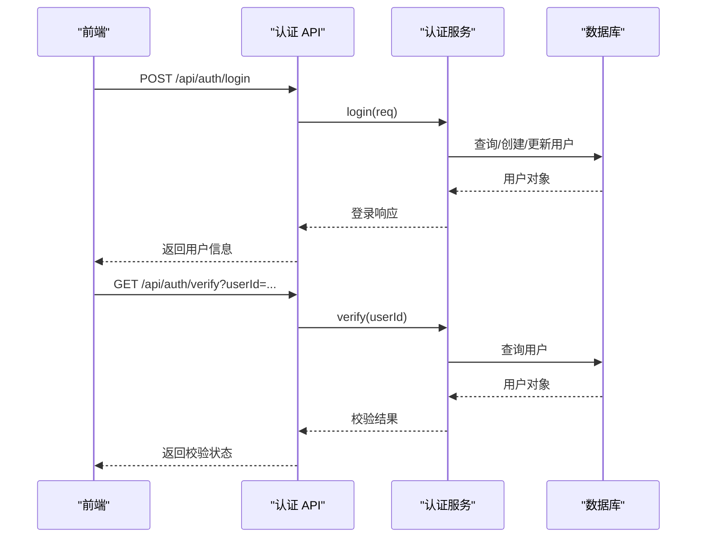
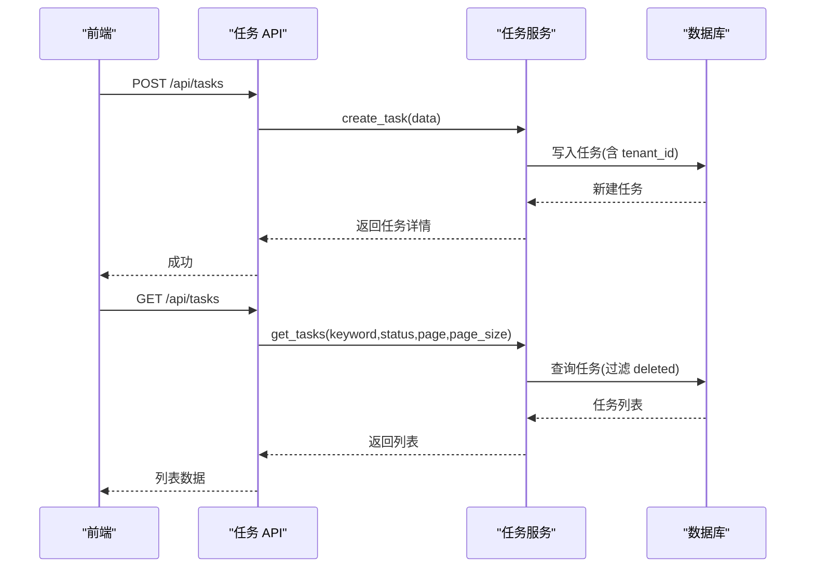
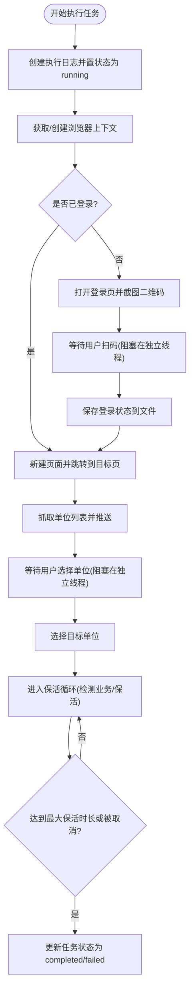
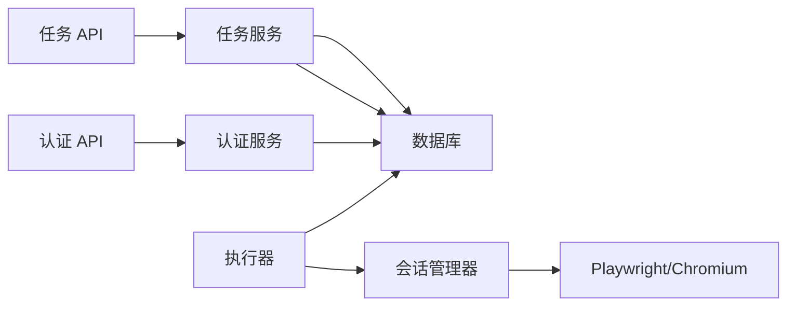

# 租户管理模块

<cite>
**本文引用的文件**
- [project.md](file://project.md)
- [app/models/base.py](file://app/models/base.py)
- [app/models/user.py](file://app/models/user.py)
- [app/models/task.py](file://app/models/task.py)
- [app/models/execution_log.py](file://app/models/execution_log.py)
- [app/config.py](file://app/config.py)
- [app/database.py](file://app/database.py)
- [app/services/auth.py](file://app/services/auth.py)
- [app/api/tasks.py](file://app/api/tasks.py)
- [app/api/auth.py](file://app/api/auth.py)
- [app/services/task.py](file://app/services/task.py)
- [app/browser/session_manager.py](file://app/browser/session_manager.py)
- [app/services/executor.py](file://app/services/executor.py)
- [app/schemas/task.py](file://app/schemas/task.py)
- [app/schemas/auth.py](file://app/schemas/auth.py)
</cite>

## 目录
1. [简介](#简介)
2. [项目结构](#项目结构)
3. [核心组件](#核心组件)
4. [架构总览](#架构总览)
5. [详细组件分析](#详细组件分析)
6. [依赖关系分析](#依赖关系分析)
7. [性能考量](#性能考量)
8. [故障排除指南](#故障排除指南)
9. [结论](#结论)
10. [附录](#附录)

## 简介
本技术文档聚焦于商用级 AI 浏览器系统的“租户管理模块”。根据项目需求文档，该模块需实现以下能力：
- 租户 CRUD：创建、启用/禁用、配置独立会话并发配额
- 租户数据物理隔离：确保租户间无法互相访问会话、任务、快照、脚本
- 会话并发配额管理：限制每个租户的并发会话数量
- 独立 AES 加密密钥：为每个租户分配独立密钥，仅其自身可解密会话快照
- 以租户 ID 强隔离：在数据层与执行层均以租户 ID 作为边界
- 超限处理策略与资源统计：对并发与执行进行统计与限制
- 安全与最佳实践：TLS、加密存储、会话销毁清理、网络出口隔离等

上述能力在本仓库中对应的数据模型、服务层、API 层与浏览器会话管理组件共同构成租户管理的基础实现。

## 项目结构
本项目采用前后端分离与多语言混合架构：
- 后端 API 使用 Python FastAPI，数据库 ORM 使用 SQLAlchemy，位于 CCC_RPA_API 目录
- 前端使用 Vue/Tauri，位于 CCC-BrowserV4/frontend
- 浏览器会话与自动化执行由 Python 后端负责，使用 Playwright

租户管理涉及的关键文件与职责如下：
- 数据模型层：用户、任务、执行日志等模型
- 服务层：认证、任务、执行器等服务
- API 层：认证与任务相关接口
- 浏览器会话管理：Playwright 会话生命周期与状态持久化
- 配置与数据库：数据库连接与环境配置

图表来源
- [app/api/auth.py:1-24](file://app/api/auth.py#L1-L24)
- [app/api/tasks.py:1-76](file://app/api/tasks.py#L1-L76)
- [app/services/auth.py:1-58](file://app/services/auth.py#L1-L58)
- [app/services/task.py:1-157](file://app/services/task.py#L1-L157)
- [app/services/executor.py:1-319](file://app/services/executor.py#L1-L319)
- [app/browser/session_manager.py:1-186](file://app/browser/session_manager.py#L1-L186)
- [app/database.py:1-19](file://app/database.py#L1-L19)

章节来源
- [app/config.py:1-22](file://app/config.py#L1-L22)
- [app/database.py:1-19](file://app/database.py#L1-L19)

## 核心组件
- 数据模型与隔离边界
  - 用户模型包含租户标识字段，用于将用户与租户关联
  - 任务模型包含租户 ID 字段，作为任务层面的隔离边界
  - 执行日志模型按任务维度记录，便于审计与追踪
- 服务层
  - 认证服务：登录、登出、校验用户有效性
  - 任务服务：任务的增删改查、执行与日志查询
  - 执行器：任务执行的编排、浏览器会话管理、保活与错误处理
- API 层
  - 认证接口：登录、登出、校验
  - 任务接口：列表、创建、查询、更新、删除、执行、日志查询、交互式选择公司等
- 浏览器会话管理
  - Playwright 工作线程与上下文管理
  - 存储状态持久化与恢复
  - 会话保活与异常恢复

章节来源
- [app/models/user.py:1-17](file://app/models/user.py#L1-L17)
- [app/models/task.py:1-25](file://app/models/task.py#L1-L25)
- [app/models/execution_log.py:1-17](file://app/models/execution_log.py#L1-L17)
- [app/services/auth.py:1-58](file://app/services/auth.py#L1-L58)
- [app/services/task.py:1-157](file://app/services/task.py#L1-L157)
- [app/services/executor.py:1-319](file://app/services/executor.py#L1-L319)
- [app/browser/session_manager.py:1-186](file://app/browser/session_manager.py#L1-L186)
- [app/api/auth.py:1-24](file://app/api/auth.py#L1-L24)
- [app/api/tasks.py:1-76](file://app/api/tasks.py#L1-L76)

## 架构总览
租户管理的总体架构围绕“以租户 ID 为边界”的数据与执行隔离展开：
- 数据层：所有实体均携带租户 ID 字段；查询与变更操作均以租户 ID 为过滤条件
- 执行层：任务执行在专用线程池中进行，浏览器上下文按省份隔离，状态持久化到独立文件
- 安全层：需求文档明确要求为每个租户分配独立 AES 密钥，仅其自身可解密会话快照；通信强制 TLS 加密

图表来源
- [app/models/user.py:1-17](file://app/models/user.py#L1-L17)
- [app/models/task.py:1-25](file://app/models/task.py#L1-L25)
- [app/models/execution_log.py:1-17](file://app/models/execution_log.py#L1-L17)
- [app/services/auth.py:1-58](file://app/services/auth.py#L1-L58)
- [app/services/task.py:1-157](file://app/services/task.py#L1-L157)
- [app/services/executor.py:1-319](file://app/services/executor.py#L1-L319)
- [app/browser/session_manager.py:1-186](file://app/browser/session_manager.py#L1-L186)

## 详细组件分析

### 数据模型与物理隔离
- 基类模型提供通用的时间戳字段，便于审计与追踪
- 用户模型包含租户标识字段，用于将用户归属到特定租户
- 任务模型包含租户 ID 字段，作为任务层面的隔离边界
- 执行日志模型按任务维度记录，便于审计与追踪

图表来源
- [app/models/base.py:1-11](file://app/models/base.py#L1-L11)
- [app/models/user.py:1-17](file://app/models/user.py#L1-L17)
- [app/models/task.py:1-25](file://app/models/task.py#L1-L25)
- [app/models/execution_log.py:1-17](file://app/models/execution_log.py#L1-L17)

章节来源
- [app/models/base.py:1-11](file://app/models/base.py#L1-L11)
- [app/models/user.py:1-17](file://app/models/user.py#L1-L17)
- [app/models/task.py:1-25](file://app/models/task.py#L1-L25)
- [app/models/execution_log.py:1-17](file://app/models/execution_log.py#L1-L17)

### 认证与租户关联
- 登录流程：根据客户端标识创建或更新用户记录，并设置活跃状态
- 登出流程：将用户标记为非活跃
- 校验流程：验证用户是否有效（活跃）

图表来源
- [app/api/auth.py:1-24](file://app/api/auth.py#L1-L24)
- [app/services/auth.py:1-58](file://app/services/auth.py#L1-L58)
- [app/models/user.py:1-17](file://app/models/user.py#L1-L17)

章节来源
- [app/api/auth.py:1-24](file://app/api/auth.py#L1-L24)
- [app/services/auth.py:1-58](file://app/services/auth.py#L1-L58)

### 任务 CRUD 与租户隔离
- 列表：支持关键词与状态过滤，默认排除已删除项
- 创建：接收租户 ID 参数，写入任务记录
- 更新：支持部分字段更新，JSON 字段序列化存储
- 删除：软删除（标记 deleted）
- 执行：将任务状态置为运行中并提交执行
- 日志：按任务 ID 查询执行日志

图表来源
- [app/api/tasks.py:1-76](file://app/api/tasks.py#L1-L76)
- [app/services/task.py:1-157](file://app/services/task.py#L1-L157)
- [app/models/task.py:1-25](file://app/models/task.py#L1-L25)
- [app/schemas/task.py:1-58](file://app/schemas/task.py#L1-L58)

章节来源
- [app/api/tasks.py:1-76](file://app/api/tasks.py#L1-L76)
- [app/services/task.py:1-157](file://app/services/task.py#L1-L157)
- [app/schemas/task.py:1-58](file://app/schemas/task.py#L1-L58)

### 会话并发配额与执行编排
- 执行器使用线程池执行任务逻辑，包含浏览器会话管理与保活循环
- 会话管理器维护 Playwright 工作线程与上下文，按省份隔离并持久化状态
- 任务执行过程中通过 WebSocket 广播进度与错误，支持扫码登录与单位选择等交互

图表来源
- [app/services/executor.py:1-319](file://app/services/executor.py#L1-L319)
- [app/browser/session_manager.py:1-186](file://app/browser/session_manager.py#L1-L186)

章节来源
- [app/services/executor.py:1-319](file://app/services/executor.py#L1-L319)
- [app/browser/session_manager.py:1-186](file://app/browser/session_manager.py#L1-L186)

### 数据强隔离与加密密钥
- 隔离策略：所有实体均携带租户 ID；查询与变更操作应以租户 ID 为边界
- 加密策略：需求文档要求为每个租户分配独立 AES-256-CBC 密钥，仅其自身可解密会话快照
- 传输安全：需求文档要求全部内外通信强制 TLS 加密

章节来源
- [project.md:925-1333](file://project.md#L925-L1333)

## 依赖关系分析
- 组件耦合
  - API 层依赖服务层；服务层依赖模型与数据库
  - 执行器依赖会话管理器与数据库；会话管理器依赖 Playwright 与文件系统
- 外部依赖
  - 数据库：MySQL（通过 SQLAlchemy 连接）
  - 浏览器：Playwright + Chromium
  - WebSocket：用于执行过程中的消息广播

图表来源
- [app/api/auth.py:1-24](file://app/api/auth.py#L1-L24)
- [app/api/tasks.py:1-76](file://app/api/tasks.py#L1-L76)
- [app/services/auth.py:1-58](file://app/services/auth.py#L1-L58)
- [app/services/task.py:1-157](file://app/services/task.py#L1-L157)
- [app/services/executor.py:1-319](file://app/services/executor.py#L1-L319)
- [app/browser/session_manager.py:1-186](file://app/browser/session_manager.py#L1-L186)

章节来源
- [app/config.py:1-22](file://app/config.py#L1-L22)
- [app/database.py:1-19](file://app/database.py#L1-L19)

## 性能考量
- 线程模型：执行器与会话管理器分别使用线程池与专用工作线程，避免阻塞与死锁
- I/O 优化：浏览器状态持久化到文件，减少重复登录成本
- 查询优化：模型字段建立索引（如名称、状态、删除标志），API 层支持分页与过滤
- 资源回收：任务完成后及时关闭页面与上下文，释放内存与句柄

## 故障排除指南
- 浏览器初始化失败
  - 现象：会话管理器初始化超时或抛出异常
  - 排查：确认 Chromium 可用、工作线程正常、存储目录存在且可写
- 扫码登录超时
  - 现象：等待用户扫码超时导致任务失败
  - 排查：检查前端二维码推送与交互流程、等待线程是否被正确唤醒
- 会话异常恢复
  - 现象：浏览器崩溃或断开导致执行中断
  - 排查：执行器会自动恢复会话并重新打开页面，确认恢复流程日志
- 数据库连接问题
  - 现象：会话结束或查询失败
  - 排查：检查数据库连接参数与连接池配置

章节来源
- [app/browser/session_manager.py:1-186](file://app/browser/session_manager.py#L1-L186)
- [app/services/executor.py:1-319](file://app/services/executor.py#L1-L319)
- [app/database.py:1-19](file://app/database.py#L1-L19)

## 结论
本租户管理模块以“租户 ID”为核心隔离边界，在数据层与执行层协同实现了强隔离与可审计性。结合需求文档中的加密与安全要求，建议后续补充：
- 在数据库中引入租户表与独立密钥字段，并完善密钥轮换与存储加密
- 在 API 层增加租户维度的配额校验与限流
- 在会话销毁时执行更严格的清理策略，确保无残留

## 附录
- 安全配置建议
  - 通信：强制 TLS（HTTPS/WS TLS）
  - 存储：会话快照 AES-256-CBC 加密，密钥按租户独立存储
  - 网络：每个会话绑定独立代理出站 IP，禁用共享缓存
- 最佳实践
  - 以租户 ID 作为所有查询与写入的默认过滤条件
  - 对高并发场景使用线程池与异步广播，避免阻塞
  - 对关键路径增加重试与超时控制，提升鲁棒性