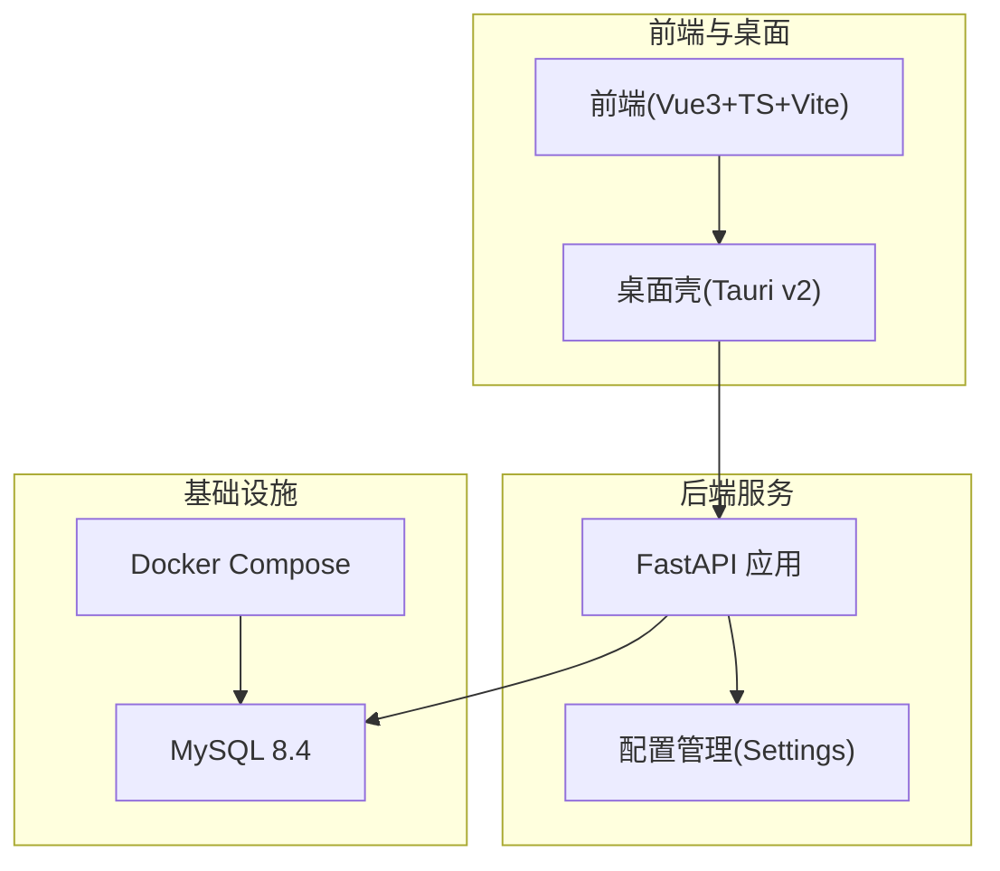
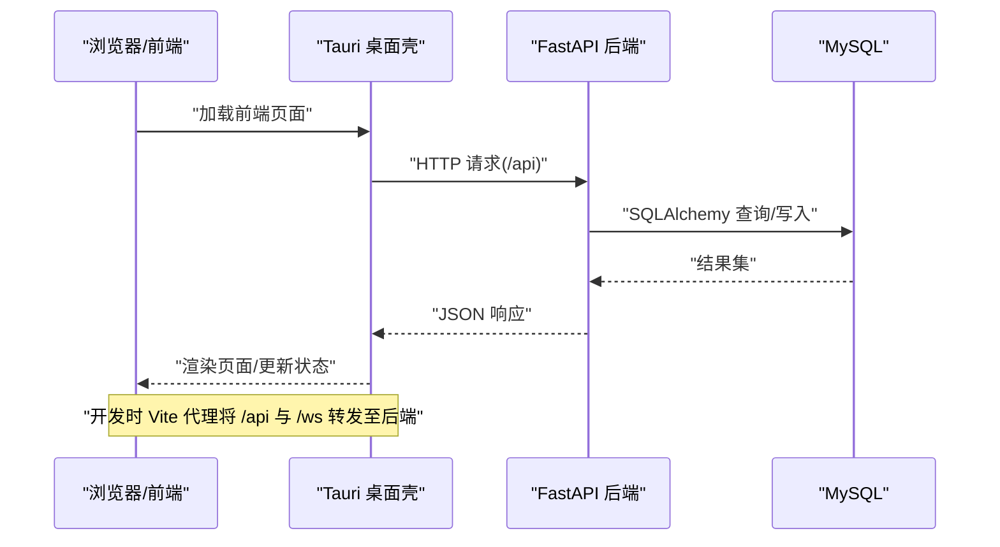
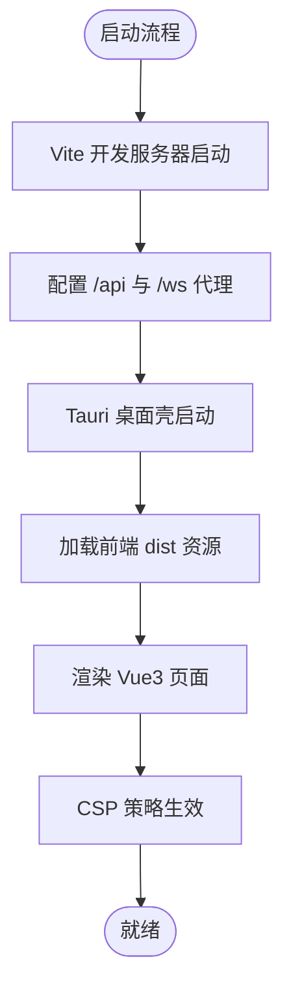
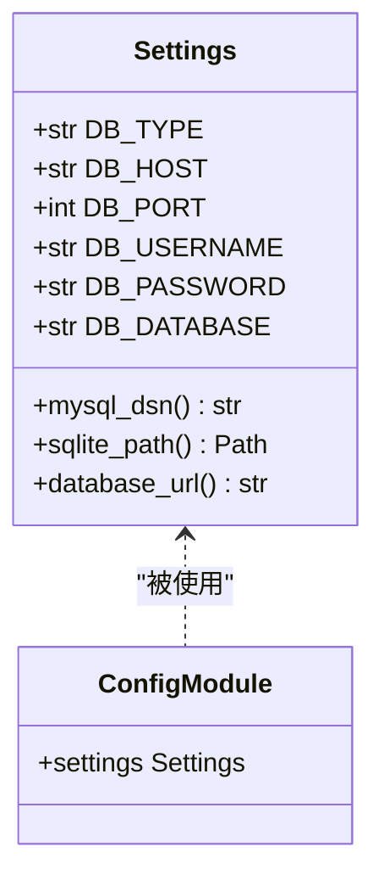
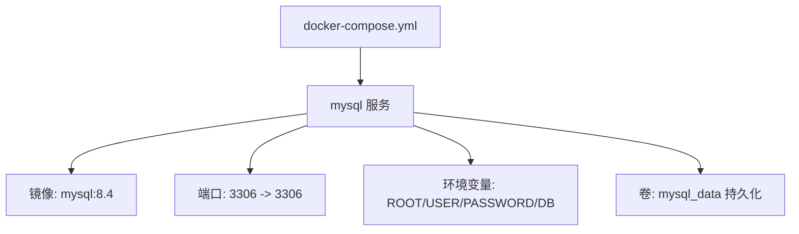
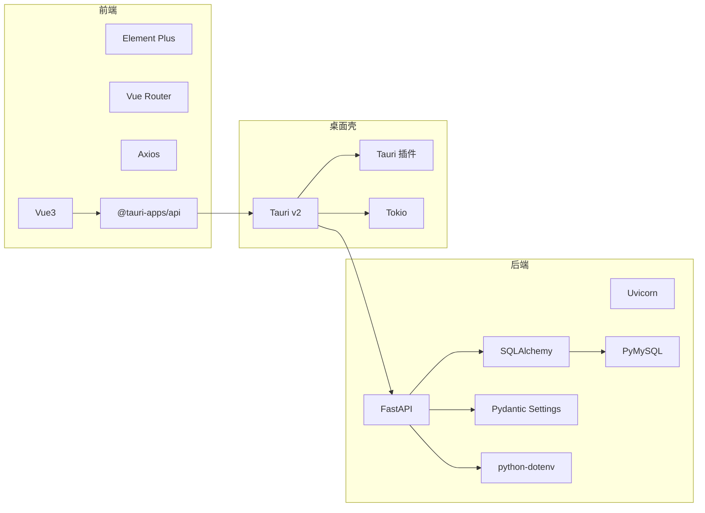

# 全局技术栈清单

<cite>
**本文引用的文件**
- [docker-compose.yml](file://CCC-BrowserV4/docker-compose.yml)
- [requirements.txt（BrowserV4 后端）](file://CCC-BrowserV4/backend/requirements.txt)
- [package.json（前端）](file://CCC-BrowserV4/frontend/package.json)
- [vite.config.ts（前端）](file://CCC-BrowserV4/frontend/vite.config.ts)
- [Cargo.toml（Tauri 应用）](file://CCC-BrowserV4/src-tauri/Cargo.toml)
- [tauri.conf.json（Tauri 配置）](file://CCC-BrowserV4/src-tauri/tauri.conf.json)
- [config.py（BrowserV4 后端配置）](file://CCC-BrowserV4/backend/app/config.py)
- [requirements.txt（RPA API）](file://CCC-RPA-API/requirements.txt)
- [main.py（RPA API 主入口）](file://CCC-RPA-API/app/main.py)
</cite>

## 目录
1. [引言](#引言)
2. [项目结构](#项目结构)
3. [核心组件](#核心组件)
4. [架构总览](#架构总览)
5. [详细组件分析](#详细组件分析)
6. [依赖分析](#依赖分析)
7. [性能考虑](#性能考虑)
8. [故障排查指南](#故障排查指南)
9. [结论](#结论)
10. [附录](#附录)

## 引言
本文件面向商用级 AI 浏览器系统，提供跨前后端、容器化与 AI 推理、数据存储、监控运维及安全通信等维度的技术栈全景说明。文档基于仓库中实际存在的配置与依赖文件进行归纳总结，重点阐述各技术选型原因以及它们在系统中的协作关系。

## 项目结构
该项目采用多模块分层组织：前端使用 Vue3 + TypeScript + Vite；桌面端通过 Tauri 封装；后端提供 API 服务；容器编排使用 Docker Compose；数据库采用 MySQL；同时保留了另一套 RPA API 的实现作为参考。

图表来源
- [docker-compose.yml:1-21](file://CCC-BrowserV4/docker-compose.yml#L1-L21)
- [package.json:1-29](file://CCC-BrowserV4/frontend/package.json#L1-L29)
- [vite.config.ts:1-35](file://CCC-BrowserV4/frontend/vite.config.ts#L1-L35)
- [Cargo.toml:1-22](file://CCC-BrowserV4/src-tauri/Cargo.toml#L1-L22)
- [tauri.conf.json:1-29](file://CCC-BrowserV4/src-tauri/tauri.conf.json#L1-L29)
- [config.py:1-52](file://CCC-BrowserV4/backend/app/config.py#L1-L52)

章节来源
- [docker-compose.yml:1-21](file://CCC-BrowserV4/docker-compose.yml#L1-L21)
- [package.json:1-29](file://CCC-BrowserV4/frontend/package.json#L1-L29)
- [vite.config.ts:1-35](file://CCC-BrowserV4/frontend/vite.config.ts#L1-L35)
- [Cargo.toml:1-22](file://CCC-BrowserV4/src-tauri/Cargo.toml#L1-L22)
- [tauri.conf.json:1-29](file://CCC-BrowserV4/src-tauri/tauri.conf.json#L1-L29)
- [config.py:1-52](file://CCC-BrowserV4/backend/app/config.py#L1-L52)

## 核心组件
- 容器编排：Docker Compose 管理 MySQL 服务，便于本地开发与部署一致性。
- 前端与扩展：Vue3 + TypeScript + Element Plus + Vue Router；Vite 提供开发与构建工具链；Tauri v2 作为桌面壳，提供原生窗口与系统能力。
- 后端服务：FastAPI + Uvicorn，结合 Pydantic Settings 实现配置管理；SQLAlchemy + PyMySQL 访问 MySQL。
- 数据存储：MySQL 8.4；同时支持 SQLite 路径生成（用于本地或简化场景）。
- 监控运维：未在当前仓库发现 Prometheus/Grafana/ELK 相关配置或依赖。
- 加密通信：未在当前仓库发现 TLS/SSL 或 AES-256-CBC 的显式配置或依赖。

章节来源
- [docker-compose.yml:1-21](file://CCC-BrowserV4/docker-compose.yml#L1-L21)
- [requirements.txt（BrowserV4 后端）:1-13](file://CCC-BrowserV4/backend/requirements.txt#L1-L13)
- [package.json:1-29](file://CCC-BrowserV4/frontend/package.json#L1-L29)
- [vite.config.ts:1-35](file://CCC-BrowserV4/frontend/vite.config.ts#L1-L35)
- [Cargo.toml:1-22](file://CCC-BrowserV4/src-tauri/Cargo.toml#L1-L22)
- [tauri.conf.json:1-29](file://CCC-BrowserV4/src-tauri/tauri.conf.json#L1-L29)
- [config.py:18-47](file://CCC-BrowserV4/backend/app/config.py#L18-L47)

## 架构总览
下图展示了从前端到桌面壳、后端 API 到数据库的整体交互流程，以及开发时的代理转发关系。

图表来源
- [vite.config.ts:16-26](file://CCC-BrowserV4/frontend/vite.config.ts#L16-L26)
- [tauri.conf.json:6-11](file://CCC-BrowserV4/src-tauri/tauri.conf.json#L6-L11)
- [config.py:28-47](file://CCC-BrowserV4/backend/app/config.py#L28-L47)

## 详细组件分析

### 前端与桌面壳（Vue3 + Tauri）
- 技术要点
  - 使用 Vue3 + TypeScript + Element Plus + Vue Router 构建用户界面。
  - Vite 提供开发服务器、代理与构建优化，支持 ES2021 目标与 Chrome 105。
  - Tauri v2 作为桌面壳，负责窗口、系统集成与安全策略（CSP）。
- 关键行为
  - 开发模式下，Vite 将 /api 与 /ws 代理到后端地址。
  - Tauri 配置包含产品名、窗口尺寸、最小尺寸、CSP 策略等。
- 适配性
  - CSP 中允许连接特定域名与本地回环地址，便于调试与登录回调。

图表来源
- [vite.config.ts:13-27](file://CCC-BrowserV4/frontend/vite.config.ts#L13-L27)
- [tauri.conf.json:6-26](file://CCC-BrowserV4/src-tauri/tauri.conf.json#L6-L26)

章节来源
- [package.json:12-27](file://CCC-BrowserV4/frontend/package.json#L12-L27)
- [vite.config.ts:1-35](file://CCC-BrowserV4/frontend/vite.config.ts#L1-L35)
- [tauri.conf.json:1-29](file://CCC-BrowserV4/src-tauri/tauri.conf.json#L1-L29)
- [Cargo.toml:9-22](file://CCC-BrowserV4/src-tauri/Cargo.toml#L9-L22)

### 后端服务（FastAPI + SQLAlchemy）
- 技术要点
  - FastAPI + Uvicorn 提供高性能异步 API。
  - Pydantic Settings 从 .env 与环境变量读取配置。
  - SQLAlchemy + PyMySQL 访问 MySQL；同时支持 SQLite 路径生成。
- 数据库选择
  - 支持通过 DB_TYPE 切换 MySQL 或 SQLite；默认使用 MySQL。
- 安全与配置
  - 通过 Settings 类集中管理数据库连接参数与 DSN 生成逻辑。

图表来源
- [config.py:9-52](file://CCC-BrowserV4/backend/app/config.py#L9-L52)

章节来源
- [requirements.txt（BrowserV4 后端）:1-13](file://CCC-BrowserV4/backend/requirements.txt#L1-L13)
- [config.py:18-47](file://CCC-BrowserV4/backend/app/config.py#L18-L47)

### 容器编排（Docker Compose）
- 技术要点
  - 使用 Compose v3.8 管理 MySQL 服务，映射 3306 端口，设置字符集与卷持久化。
- 适用场景
  - 本地开发与测试环境快速搭建，保证数据库可用性与数据持久化。

图表来源
- [docker-compose.yml:3-21](file://CCC-BrowserV4/docker-compose.yml#L3-L21)

章节来源
- [docker-compose.yml:1-21](file://CCC-BrowserV4/docker-compose.yml#L1-L21)

### AI 推理与 OCR（现状与建议）
- 现状
  - 当前仓库未发现 Ollama、YOLOv8、PaddleOCR 的直接依赖或调用示例。
- 建议
  - 若需集成 AI 推理，可在后端新增独立推理服务或使用 BullMQ 队列异步处理任务，避免阻塞主 API。
  - 对于 OCR，可引入 PaddleOCR Python 包并在后端以服务形式暴露接口。

[本节为概念性建议，不直接分析具体文件，故无“章节来源”]

### 监控运维（Prometheus/Grafana/ELK）
- 现状
  - 当前仓库未发现 Prometheus、Grafana、ELK Stack 的配置或依赖。
- 建议
  - 在后端增加 Prometheus metrics 导出端点，结合 Grafana 可视化。
  - 使用 ELK Stack 收集后端日志，前端错误可通过 Tauri 日志输出统一采集。

[本节为概念性建议，不直接分析具体文件，故无“章节来源”]

### 加密通信（TLS/SSL、AES-256-CBC）
- 现状
  - 当前仓库未发现 TLS/SSL 或 AES-256-CBC 的显式配置或依赖。
- 建议
  - 生产环境启用 HTTPS，后端通过反向代理或内置 SSL 配置提供 TLS。
  - 敏感数据传输与存储建议采用行业标准加密方案。

[本节为概念性建议，不直接分析具体文件，故无“章节来源”]

## 依赖分析
- 前端依赖
  - Vue3、Element Plus、Pinia、Vue Router、Axios、@tauri-apps/api 等。
- 后端依赖
  - FastAPI、Uvicorn、SQLAlchemy、PyMySQL、Pydantic Settings、python-dotenv。
- 桌面壳依赖
  - Tauri v2 及相关插件（shell、store、opener），Tokio 运行时，UUID、Rand、Log 等。

图表来源
- [package.json:12-27](file://CCC-BrowserV4/frontend/package.json#L12-L27)
- [requirements.txt（BrowserV4 后端）:1-13](file://CCC-BrowserV4/backend/requirements.txt#L1-L13)
- [Cargo.toml:9-22](file://CCC-BrowserV4/src-tauri/Cargo.toml#L9-L22)

章节来源
- [package.json:1-29](file://CCC-BrowserV4/frontend/package.json#L1-L29)
- [requirements.txt（BrowserV4 后端）:1-13](file://CCC-BrowserV4/backend/requirements.txt#L1-L13)
- [Cargo.toml:1-22](file://CCC-BrowserV4/src-tauri/Cargo.toml#L1-L22)

## 性能考虑
- 前端
  - Vite 构建目标为 ES2021，适配现代浏览器；生产环境启用压缩与 SourceMap 控制。
- 后端
  - FastAPI 异步特性与 Uvicorn 事件循环提升并发；SQLAlchemy 连接池与连接字符串优化有助于降低延迟。
- 桌面壳
  - Tauri v2 减少 WebView 负载，结合 Tokio 运行时提升 I/O 并发。

[本节提供通用指导，不直接分析具体文件，故无“章节来源”]

## 故障排查指南
- 前端
  - 开发代理：确认 /api 与 /ws 代理是否指向后端地址；检查 Vite 端口与严格端口配置。
  - CSP：若资源加载失败，检查 tauri.conf.json 中的 connect-src 规则。
- 后端
  - 配置优先级：确认 .env 与环境变量是否正确覆盖默认值；检查 DB_TYPE 与数据库连接参数。
  - 数据库连通性：确保 MySQL 已通过 Compose 启动且端口映射正常。
- 桌面壳
  - 构建与运行：确认构建命令与前端打包产物路径一致；检查窗口尺寸与最小尺寸限制。

章节来源
- [vite.config.ts:16-26](file://CCC-BrowserV4/frontend/vite.config.ts#L16-L26)
- [tauri.conf.json:24-26](file://CCC-BrowserV4/src-tauri/tauri.conf.json#L24-L26)
- [config.py:18-47](file://CCC-BrowserV4/backend/app/config.py#L18-L47)
- [docker-compose.yml:8-16](file://CCC-BrowserV4/docker-compose.yml#L8-L16)

## 结论
本项目已具备现代化前端与桌面壳、高性能后端与可靠数据库的基础能力。对于 AI 推理、监控运维与加密通信，当前仓库尚未包含相应实现，建议按需引入独立服务或中间件以满足商用级要求。整体技术栈清晰、模块边界明确，适合进一步扩展与演进。

## 附录
- RPA API 参考
  - 该目录存在另一套 RPA API 的实现，包含认证、设备、任务、执行日志等模块与 WebSocket 管理器，可作为功能扩展与业务逻辑参考。

章节来源
- [requirements.txt（RPA API）:1-50](file://CCC-RPA-API/requirements.txt#L1-L50)
- [main.py（RPA API 主入口）:1-100](file://CCC-RPA-API/app/main.py#L1-L100)