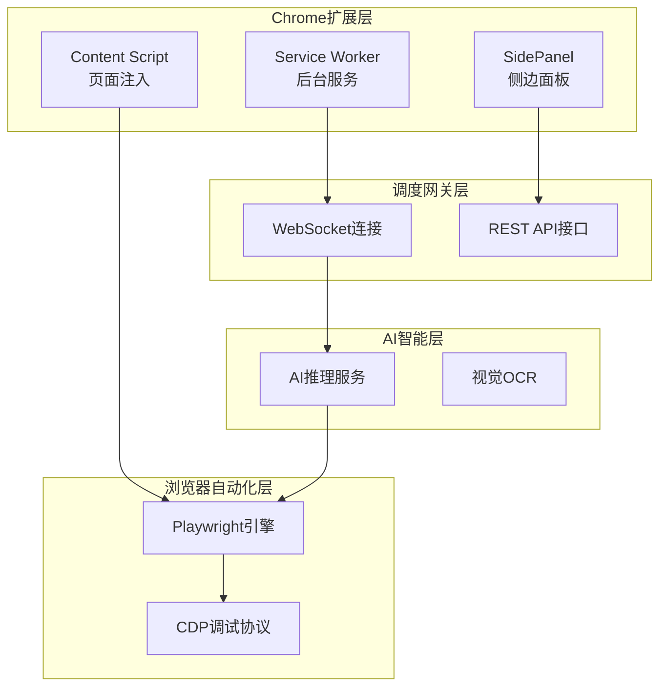
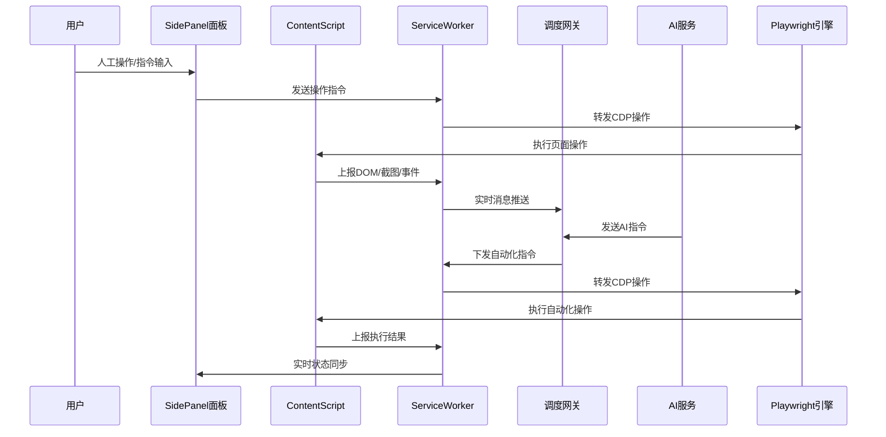
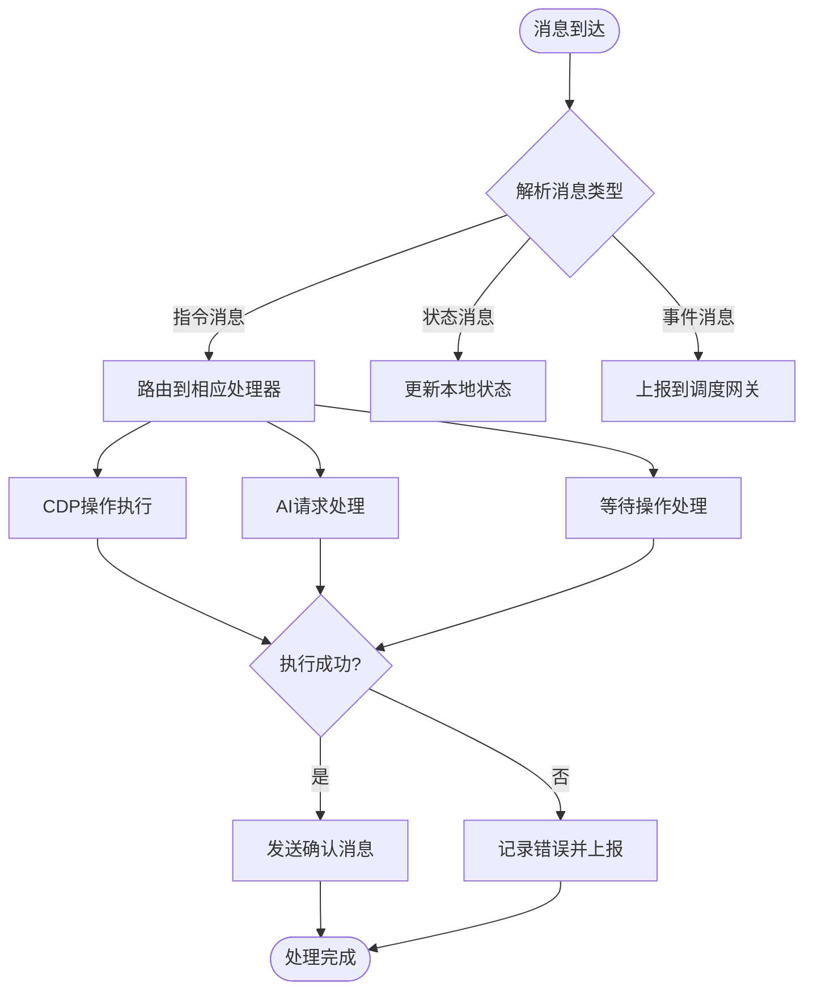
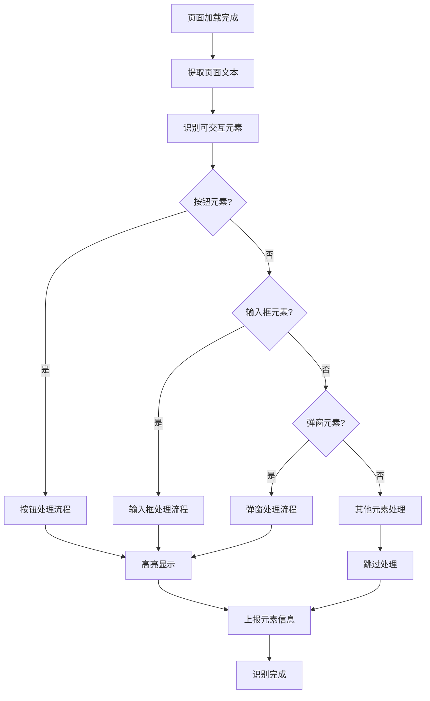
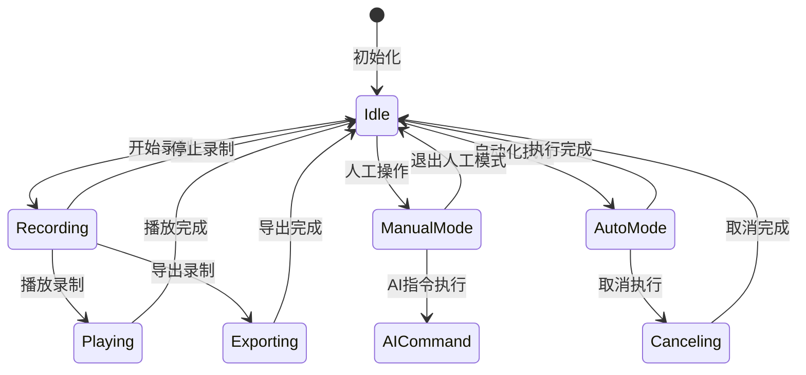
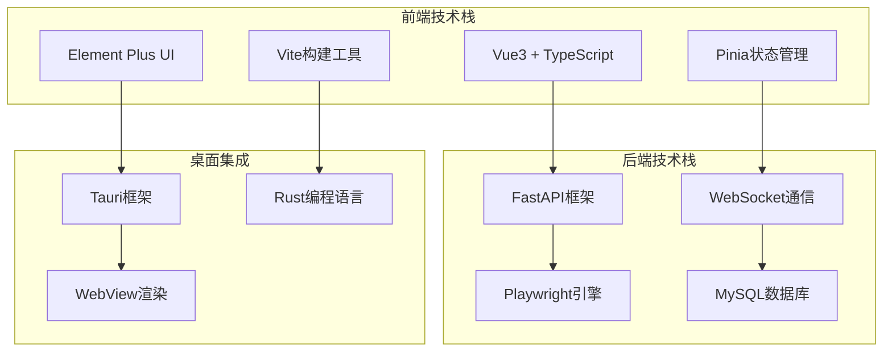

# Chrome扩展可视化通路

<cite>
**本文档引用的文件**
- [project.md](file://project.md)
- [ws.ts](file://CCC-BrowserV4/frontend/src/api/ws.ts)
- [session_manager.py](file://CCC_RPA_API/app/browser/session_manager.py)
- [site_automation.py](file://CCC_RPA_API/app/browser/site_automation.py)
- [human_behavior.py](file://CCC_RPA_API/app/browser/human_behavior.py)
- [Cargo.lock](file://CCC-BrowserV4/src-tauri/Cargo.lock)
- [desktop-schema.json](file://CCC-BrowserV4/src-tauri/gen/schemas/desktop-schema.json)
- [macOS-schema.json](file://CCC-BrowserV4/src-tauri/gen/schemas/macOS-schema.json)
</cite>

## 目录
1. [简介](#简介)
2. [项目结构](#项目结构)
3. [核心组件](#核心组件)
4. [架构概览](#架构概览)
5. [详细组件分析](#详细组件分析)
6. [依赖关系分析](#依赖关系分析)
7. [性能考虑](#性能考虑)
8. [故障排除指南](#故障排除指南)
9. [结论](#结论)

## 简介

Chrome扩展可视化通路是商用级AI浏览器系统的重要组成部分，专为Chrome V3扩展设计，实现了三大核心模块的深度集成：

- **Service Worker后台服务**：维持WS长连接至调度网关，接收AI/自动化指令，转发CDP操作，上报页面DOM/截图/交互事件
- **Content Script页面注入**：识别按钮、输入框、弹窗，高亮可交互元素，提取页面文本供给AI解析，拦截广告与第三方追踪脚本
- **SidePanel侧边可视化面板**：人工手动操作页面、自然语言AI指令输入、实时查看会话日志与截图、一键录制人工操作生成Playwright脚本、加密导出会话登录快照

该扩展采用双通路双向消息桥接互通机制，支持人工操作录制和远程SDK调用自动化脚本执行的双向同步。

## 项目结构

项目采用五层标准分层架构，Chrome扩展可视化通路由以下关键组件构成：

**图表来源**
- [project.md:1041-1067](file://project.md#L1041-L1067)
- [project.md:1027-1040](file://project.md#L1027-L1040)

**章节来源**
- [project.md:1041-1067](file://project.md#L1041-L1067)
- [project.md:1027-1040](file://project.md#L1027-L1040)

## 核心组件

### Service Worker后台服务

Service Worker作为扩展的核心协调者，负责：

- **长连接维护**：维持与调度网关的WebSocket长连接，确保实时通信
- **指令转发**：接收AI/自动化指令，转换为CDP操作并执行
- **事件上报**：收集页面DOM变化、截图、交互事件并上报
- **状态同步**：与Content Script和SidePanel保持状态同步

### Content Script页面注入

Content Script负责页面级别的智能识别：

- **元素识别**：自动识别按钮、输入框、弹窗等可交互元素
- **高亮显示**：对可交互元素进行视觉高亮标记
- **文本提取**：提取页面文本供AI解析使用
- **广告拦截**：拦截广告与第三方追踪脚本

### SidePanel侧边可视化面板

侧边面板提供完整的可视化操作界面：

- **人工操作**：支持手动页面操作和自然语言AI指令输入
- **实时监控**：查看会话日志与截图
- **脚本录制**：一键录制人工操作生成Playwright脚本
- **数据导出**：加密导出会话登录快照

**章节来源**
- [project.md:1041-1067](file://project.md#L1041-L1067)

## 架构概览

扩展系统采用双通路双向消息桥接互通架构：

**图表来源**
- [project.md:1051-1057](file://project.md#L1051-L1057)
- [ws.ts:8-87](file://CCC-BrowserV4/frontend/src/api/ws.ts#L8-L87)

**章节来源**
- [project.md:1051-1057](file://project.md#L1051-L1057)
- [ws.ts:8-87](file://CCC-BrowserV4/frontend/src/api/ws.ts#L8-L87)

## 详细组件分析

### Service Worker消息处理机制

Service Worker采用事件驱动的消息处理架构：

**图表来源**
- [ws.ts:35-42](file://CCC-BrowserV4/frontend/src/api/ws.ts#L35-L42)

### Content Script元素识别算法

Content Script采用多层识别策略：

**图表来源**
- [project.md:1047](file://project.md#L1047)

### SidePanel状态管理系统

SidePanel采用状态机管理模式：

**图表来源**
- [project.md:1049](file://project.md#L1049)

**章节来源**
- [ws.ts:8-87](file://CCC-BrowserV4/frontend/src/api/ws.ts#L8-L87)
- [project.md:1047-1049](file://project.md#L1047-L1049)

## 依赖关系分析

### 技术栈依赖

扩展系统依赖于以下核心技术栈：

**图表来源**
- [project.md:104-149](file://project.md#L104-L149)

### 扩展权限配置

扩展需要以下权限配置：

| 权限类型 | 权限名称 | 用途描述 |
|---------|---------|---------|
| 主页脚本 | activeTab | 访问当前标签页内容 |
| 内容脚本 | tabs | 获取标签页信息 |
| WebSocket | ws://*/* | 与调度网关通信 |
| 文件访问 | storage | 存储扩展数据 |
| 外部访问 | *://*.122.gov.cn/* | 访问目标网站 |

**章节来源**
- [project.md:104-149](file://project.md#L104-L149)

## 性能考虑

### 浏览器自动化性能优化

系统采用多线程并行处理机制：

- **Playwright线程**：专用工作线程执行所有浏览器操作，避免与asyncio事件循环冲突
- **任务执行线程池**：3个工作线程并行执行任务，另有3个等待线程处理用户交互阻塞
- **非侵入式保活**：保活操作仅允许小幅度滚动、鼠标随机移动，避免影响页面性能

### 内存管理策略

- **会话隔离**：每个沙箱会话独立UserData目录，防止内存泄漏扩散
- **资源限制**：单会话内存上限1.5Gi，CPU单核上限，最大打开标签10个
- **自动清理**：会话销毁时自动清理所有临时文件和缓存

## 故障排除指南

### 常见问题及解决方案

| 问题类型 | 症状表现 | 解决方案 |
|---------|---------|---------|
| WebSocket连接失败 | 扩展无法连接调度网关 | 检查网络连接，重启扩展服务 |
| 页面元素识别失败 | Content Script无法识别可交互元素 | 更新元素识别规则，检查页面结构变化 |
| 录制功能异常 | SidePanel录制功能失效 | 清除录制缓存，重新初始化录制器 |
| 性能问题 | 扩展运行缓慢 | 关闭不必要的标签页，检查内存使用情况 |

### 调试工具使用

- **开发者工具**：使用Chrome开发者工具调试Content Script
- **网络面板**：监控WebSocket连接状态
- **存储面板**：检查扩展数据存储情况
- **性能面板**：监控内存和CPU使用情况

**章节来源**
- [project.md:682-684](file://project.md#L682-L684)

## 结论

Chrome扩展可视化通路项目实现了商用级AI浏览器系统的完整功能架构。通过三大核心模块的深度集成和双通路双向消息桥接互通机制，系统能够：

1. **实现完整的自动化流程**：从页面识别到操作执行的全链路自动化
2. **提供可视化操作界面**：支持人工操作和AI指令的双重控制
3. **确保系统稳定性**：采用多层隔离和自动恢复机制
4. **保证性能效率**：通过并行处理和资源限制确保系统高效运行

该扩展为后续的功能扩展和性能优化奠定了坚实的技术基础，是商用AI浏览器系统的重要支撑组件。