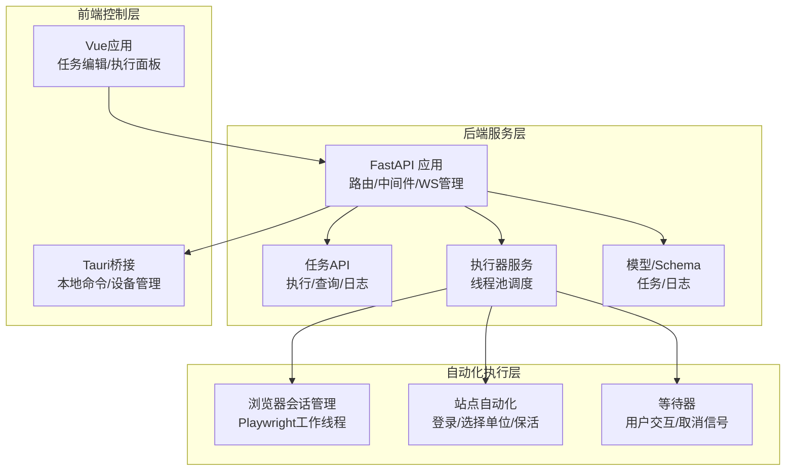
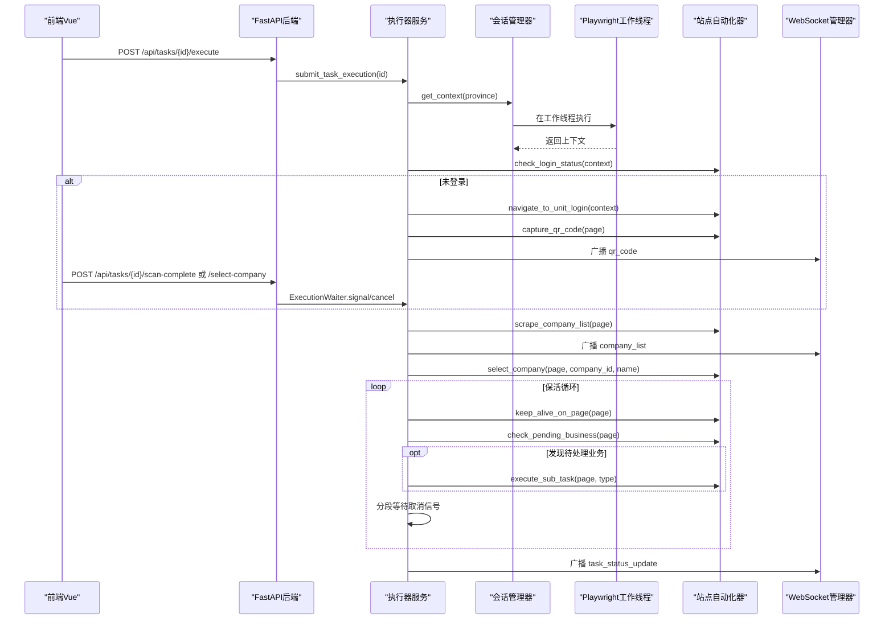
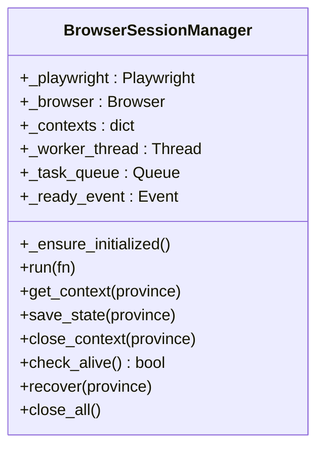
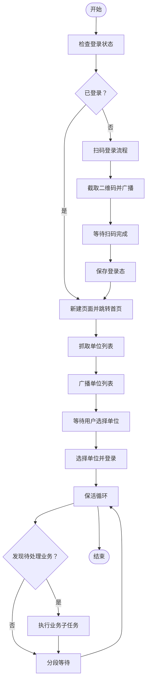
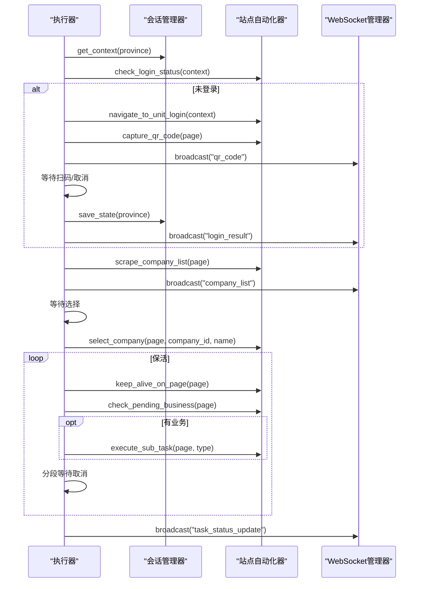
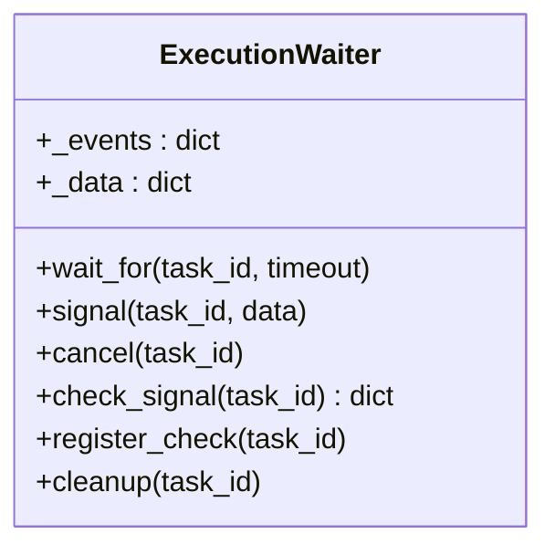
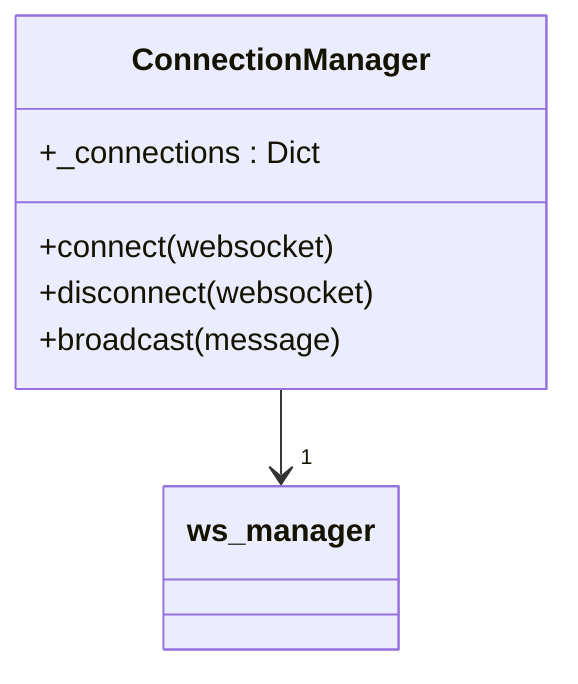
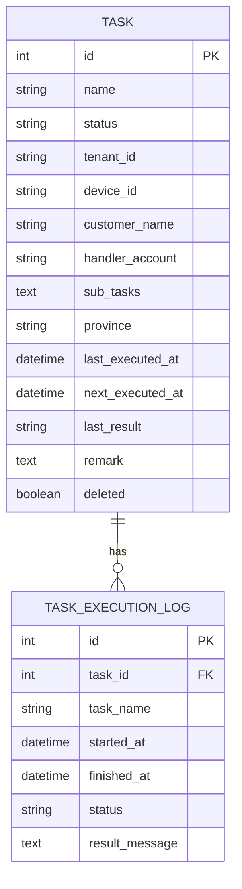
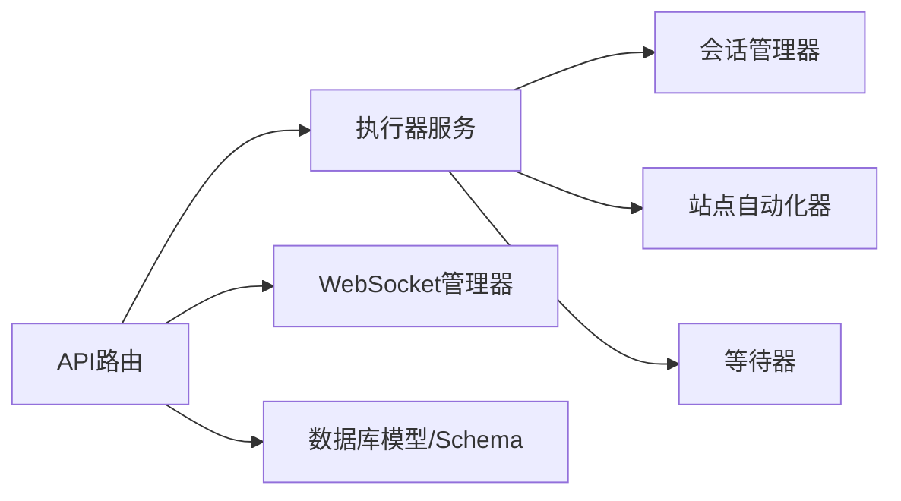

# Playwright自动化脚本通路

<cite>
**本文档引用的文件**
- [main.py](file://CCC_RPA_API/app/main.py)
- [tasks.py](file://CCC_RPA_API/app/api/tasks.py)
- [executor.py](file://CCC_RPA_API/app/services/executor.py)
- [session_manager.py](file://CCC_RPA_API/app/browser/session_manager.py)
- [site_automation.py](file://CCC_RPA_API/app/browser/site_automation.py)
- [waiter.py](file://CCC_RPA_API/app/browser/waiter.py)
- [manager.py](file://CCC_RPA_API/app/ws/manager.py)
- [task.py](file://CCC_RPA_API/app/models/task.py)
- [execution_log.py](file://CCC_RPA_API/app/models/execution_log.py)
- [task.py](file://CCC_RPA_API/app/schemas/task.py)
</cite>

## 目录
1. [简介](#简介)
2. [项目结构](#项目结构)
3. [核心组件](#核心组件)
4. [架构总览](#架构总览)
5. [详细组件分析](#详细组件分析)
6. [依赖关系分析](#依赖关系分析)
7. [性能考虑](#性能考虑)
8. [故障排除指南](#故障排除指南)
9. [结论](#结论)

## 简介
本项目围绕“122.gov.cn”交管综合服务平台构建了一套完整的自动化脚本通路，涵盖Node.js/Python双栈SDK设计理念与实现细节，屏蔽底层Pod/进程、端口、CDP等复杂性，向上提供统一的页面跳转、点击、输入、滑动、文件上传下载、请求头篡改、网络抓包、截图录屏等能力。系统采用FastAPI后端、Vue前端、Tauri桌面桥接，结合Playwright进行浏览器自动化，通过WebSocket实现实时日志推送与截图展示；同时内置基于线程池的任务执行器与等待器，支持扫码登录、人工干预、保活循环、异常恢复等关键能力。

## 项目结构
项目分为三层：
- 后端服务层（FastAPI）：提供REST接口、WebSocket、数据库模型与服务逻辑
- 自动化执行层（Playwright）：封装浏览器会话、页面操作、人类行为模拟
- 前端控制层（Vue + Tauri）：任务编辑、执行面板、日志与截图展示

**图表来源**
- [main.py:1-127](file://CCC_RPA_API/app/main.py#L1-L127)
- [tasks.py:1-76](file://CCC_RPA_API/app/api/tasks.py#L1-L76)
- [executor.py:1-319](file://CCC_RPA_API/app/services/executor.py#L1-L319)
- [session_manager.py:1-186](file://CCC_RPA_API/app/browser/session_manager.py#L1-L186)
- [site_automation.py:1-743](file://CCC_RPA_API/app/browser/site_automation.py#L1-L743)
- [waiter.py:1-84](file://CCC_RPA_API/app/browser/waiter.py#L1-L84)

**章节来源**
- [main.py:1-127](file://CCC_RPA_API/app/main.py#L1-L127)
- [tasks.py:1-76](file://CCC_RPA_API/app/api/tasks.py#L1-L76)

## 核心组件
- 浏览器会话管理器：按省份维护Playwright上下文，持久化storage_state，提供线程安全的执行通道
- 站点自动化器：封装登录、扫码、单位选择、保活、业务检测与执行等流程
- 执行器服务：线程池驱动的任务执行器，负责广播进度、异常处理、会话恢复
- 等待器：基于Event的阻塞/非阻塞等待机制，支持用户扫码、选择单位、取消执行
- WebSocket管理器：连接管理与广播，向前端推送二维码、进度、错误、状态更新与截图
- 数据模型与Schema：任务、执行日志的ORM模型与API序列化模型

**章节来源**
- [session_manager.py:10-186](file://CCC_RPA_API/app/browser/session_manager.py#L10-L186)
- [site_automation.py:16-743](file://CCC_RPA_API/app/browser/site_automation.py#L16-L743)
- [executor.py:1-319](file://CCC_RPA_API/app/services/executor.py#L1-L319)
- [waiter.py:7-84](file://CCC_RPA_API/app/browser/waiter.py#L7-L84)
- [manager.py:1-29](file://CCC_RPA_API/app/ws/manager.py#L1-L29)
- [task.py:8-25](file://CCC_RPA_API/app/models/task.py#L8-L25)
- [execution_log.py:7-17](file://CCC_RPA_API/app/models/execution_log.py#L7-L17)

## 架构总览
系统采用“后端API + Playwright工作线程 + 前端控制”的分层架构。后端通过线程池将Playwright操作隔离在专用工作线程中，避免与FastAPI事件循环冲突；前端通过WebSocket接收实时状态与截图，通过REST接口触发任务执行与人工干预。

**图表来源**
- [executor.py:78-315](file://CCC_RPA_API/app/services/executor.py#L78-L315)
- [session_manager.py:79-126](file://CCC_RPA_API/app/browser/session_manager.py#L79-L126)
- [site_automation.py:38-743](file://CCC_RPA_API/app/browser/site_automation.py#L38-L743)
- [manager.py:17-26](file://CCC_RPA_API/app/ws/manager.py#L17-L26)

## 详细组件分析

### 浏览器会话管理器（BrowserSessionManager）
- 设计要点
  - 专用工作线程承载Playwright实例，避免与主线程事件循环冲突
  - 按省份维护BrowserContext，支持storage_state持久化，减少重复登录成本
  - 提供线程安全的run方法，统一执行入口，支持超时与异常透传
  - 支持会话恢复与全局关闭，确保资源可控释放
- 关键能力
  - get_context：按省获取或创建上下文，自动注入UA与viewport，去除webdriver特征
  - save_state/close_context：持久化登录态与上下文管理
  - check_alive/recover：健康检查与异常恢复
  - close_all：优雅关闭所有资源

**图表来源**
- [session_manager.py:10-186](file://CCC_RPA_API/app/browser/session_manager.py#L10-L186)

**章节来源**
- [session_manager.py:10-186](file://CCC_RPA_API/app/browser/session_manager.py#L10-L186)

### 站点自动化器（SiteAutomation）
- 设计要点
  - 面向“122.gov.cn”特定站点的自动化封装，包含登录、扫码、单位选择、保活、业务检测与执行
  - 多策略降级与JS回退，提升在页面结构变化时的鲁棒性
  - 人类行为模拟（滚动、等待、随机点击），降低反爬风险
- 关键流程
  - 登录状态检查与扫码登录：优先直连登录页，失败则首页JS点击进入
  - 单位列表抓取：多选择器降级策略，必要时从页面文本提取
  - 单位选择：优先文本匹配，其次属性匹配，最后索引匹配，失败时JS回退
  - 保活：在当前页面执行轻量操作，避免导航与表单提交
  - 待处理业务检测：基于徽标与关键词匹配

**图表来源**
- [site_automation.py:38-743](file://CCC_RPA_API/app/browser/site_automation.py#L38-L743)

**章节来源**
- [site_automation.py:16-743](file://CCC_RPA_API/app/browser/site_automation.py#L16-L743)

### 执行器服务（Executor）
- 设计要点
  - 使用线程池与等待线程分离阻塞操作，避免阻塞Playwright工作线程
  - 通过WebSocket广播执行进度、错误与状态更新，支持前端实时交互
  - 内置会话恢复机制，检测浏览器异常时自动重建上下文并重定向首页
  - 保活循环支持取消信号与超时控制，保障长时间运行稳定性
- 关键流程
  - 初始化与登录检查
  - 扫码登录与状态保存
  - 单位列表抓取与广播
  - 用户选择单位后的登录与保活
  - 待处理业务检测与执行
  - 统一异常处理与状态更新

**图表来源**
- [executor.py:78-315](file://CCC_RPA_API/app/services/executor.py#L78-L315)
- [site_automation.py:38-743](file://CCC_RPA_API/app/browser/site_automation.py#L38-L743)
- [manager.py:17-26](file://CCC_RPA_API/app/ws/manager.py#L17-L26)

**章节来源**
- [executor.py:1-319](file://CCC_RPA_API/app/services/executor.py#L1-L319)

### 等待器（ExecutionWaiter）
- 设计要点
  - 基于threading.Event实现阻塞等待与非阻塞检查
  - 支持信号发送、取消、清理，适配扫码登录与单位选择等人工干预场景
- 关键能力
  - wait_for：阻塞等待，支持超时
  - signal/cancel：唤醒等待或标记取消
  - check_signal：保活循环等场景的非阻塞轮询
  - register_check/cleanup：生命周期管理

**图表来源**
- [waiter.py:7-84](file://CCC_RPA_API/app/browser/waiter.py#L7-L84)

**章节来源**
- [waiter.py:1-84](file://CCC_RPA_API/app/browser/waiter.py#L1-L84)

### WebSocket管理器（ConnectionManager）
- 设计要点
  - 维护活跃连接集合，支持广播消息
  - 自动清理断开连接，保证广播可靠性
- 关键能力
  - connect/disconnect：连接生命周期管理
  - broadcast：向所有连接发送JSON消息

**图表来源**
- [manager.py:5-29](file://CCC_RPA_API/app/ws/manager.py#L5-L29)

**章节来源**
- [manager.py:1-29](file://CCC_RPA_API/app/ws/manager.py#L1-L29)

### 数据模型与Schema
- 任务模型（Task）：包含任务元数据、状态、时间戳、省份、子任务等字段
- 执行日志模型（TaskExecutionLog）：记录每次执行的起止时间、状态与结果消息
- 任务Schema：Pydantic模型，用于API请求/响应的序列化与校验

**图表来源**
- [task.py:8-25](file://CCC_RPA_API/app/models/task.py#L8-L25)
- [execution_log.py:7-17](file://CCC_RPA_API/app/models/execution_log.py#L7-L17)

**章节来源**
- [task.py:8-25](file://CCC_RPA_API/app/models/task.py#L8-L25)
- [execution_log.py:7-17](file://CCC_RPA_API/app/models/execution_log.py#L7-L17)
- [task.py:5-58](file://CCC_RPA_API/app/schemas/task.py#L5-L58)

## 依赖关系分析
- 组件耦合
  - 执行器服务依赖会话管理器与站点自动化器，通过线程池隔离Playwright操作
  - API层通过服务层协调执行器与等待器，实现REST与WebSocket的统一编排
  - WebSocket管理器作为广播中枢，解耦前端与执行器
- 外部依赖
  - Playwright（Chromium）：浏览器自动化核心
  - FastAPI：Web框架与WebSocket支持
  - SQLAlchemy：ORM与数据库访问
  - Vue/Tauri：前端与桌面桥接

**图表来源**
- [main.py:24-27](file://CCC_RPA_API/app/main.py#L24-L27)
- [tasks.py:1-76](file://CCC_RPA_API/app/api/tasks.py#L1-L76)
- [executor.py:1-319](file://CCC_RPA_API/app/services/executor.py#L1-L319)
- [session_manager.py:1-186](file://CCC_RPA_API/app/browser/session_manager.py#L1-L186)
- [site_automation.py:1-743](file://CCC_RPA_API/app/browser/site_automation.py#L1-L743)
- [waiter.py:1-84](file://CCC_RPA_API/app/browser/waiter.py#L1-L84)
- [manager.py:1-29](file://CCC_RPA_API/app/ws/manager.py#L1-L29)

**章节来源**
- [main.py:1-127](file://CCC_RPA_API/app/main.py#L1-L127)
- [tasks.py:1-76](file://CCC_RPA_API/app/api/tasks.py#L1-L76)

## 性能考虑
- 线程隔离与并发
  - Playwright操作在专用工作线程执行，避免与FastAPI事件循环竞争
  - 线程池大小与等待线程分离阻塞操作，平衡吞吐与响应
- 会话复用与持久化
  - 按省份维护上下文，storage_state持久化减少重复登录
  - 会话恢复机制在异常时快速重建，降低整体失败率
- 网络与页面稳定性
  - 多策略降级与JS回退，提升页面结构变化的容错
  - 人类行为模拟降低检测概率，提高长期稳定性
- 日志与监控
  - WebSocket广播实时反馈执行状态，便于前端快速响应
  - 执行日志记录起止时间与结果，支撑审计与问题定位

## 故障排除指南
- 浏览器异常
  - 现象：页面报错或浏览器关闭
  - 处理：执行器内置恢复逻辑，自动重建上下文并重定向首页
  - 建议：检查会话管理器的健康检查与恢复流程
- 扫码登录超时
  - 现象：等待扫码超时或用户取消
  - 处理：等待器超时抛出异常，执行器记录失败并广播错误
  - 建议：延长等待时间或优化前端交互提示
- 单位选择失败
  - 现象：CSS选择器与JS回退均未命中
  - 处理：保存失败截图，记录调试信息
  - 建议：根据失败截图调整选择策略或升级页面解析
- 保活循环卡住
  - 现象：无法响应取消信号
  - 处理：分段等待与非阻塞检查，及时响应取消
  - 建议：缩短等待间隔，增强取消检测频率

**章节来源**
- [executor.py:42-70](file://CCC_RPA_API/app/services/executor.py#L42-L70)
- [executor.py:286-315](file://CCC_RPA_API/app/services/executor.py#L286-L315)
- [site_automation.py:462-470](file://CCC_RPA_API/app/browser/site_automation.py#L462-L470)
- [waiter.py:14-32](file://CCC_RPA_API/app/browser/waiter.py#L14-L32)

## 结论
本项目通过“后端API + Playwright工作线程 + 前端控制”的架构，实现了对122.gov.cn站点的稳定自动化。浏览器会话管理器与站点自动化器有效屏蔽底层复杂性，执行器服务提供可靠的调度与恢复能力，WebSocket管理器实现前端与后端的实时联动。整体方案具备良好的扩展性与可维护性，适合在复杂业务场景下持续演进。