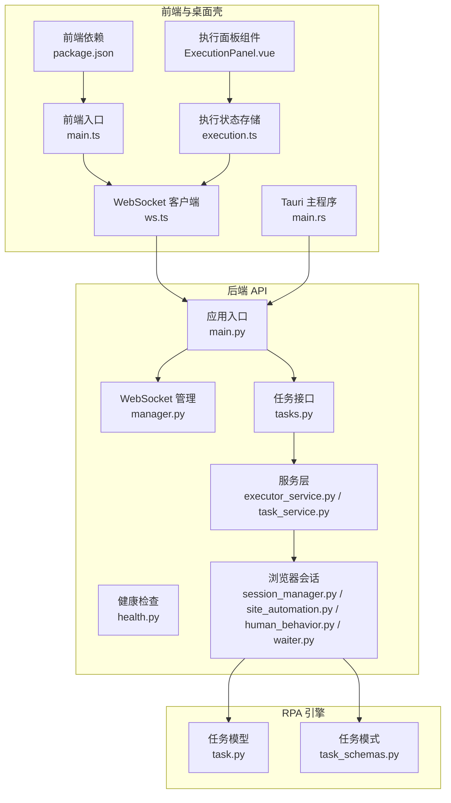
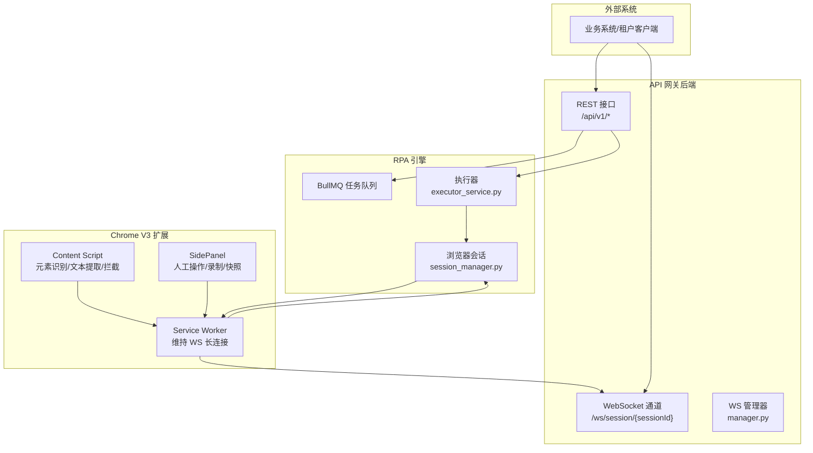
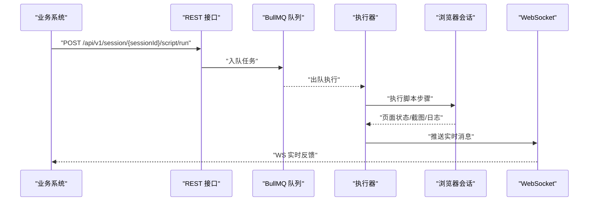
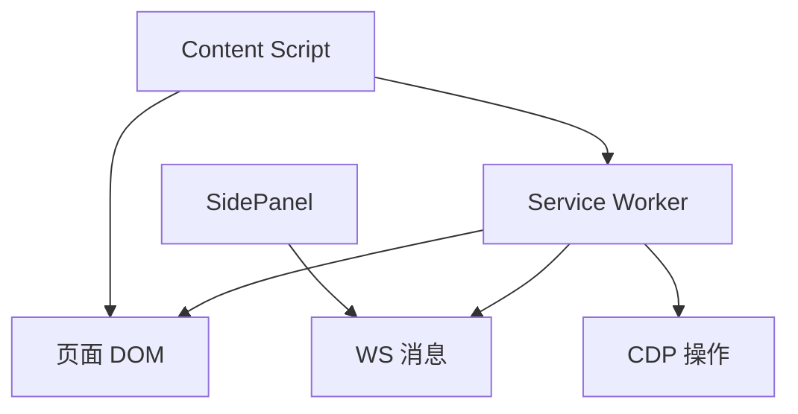
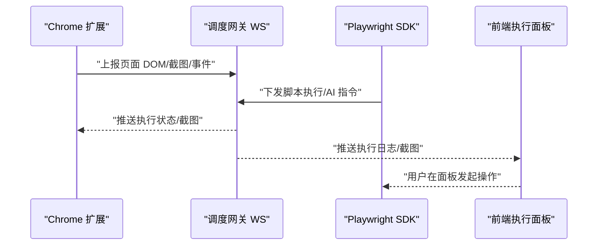
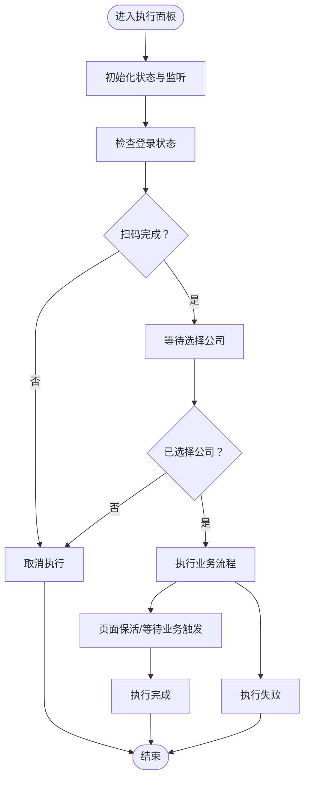
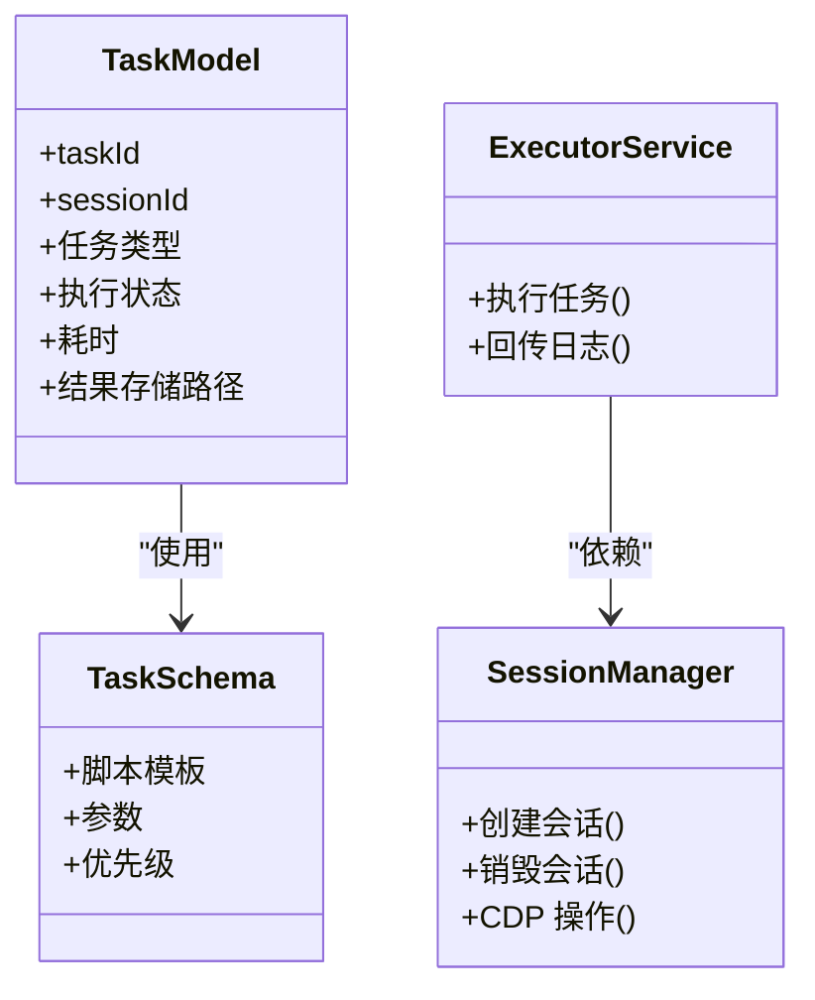
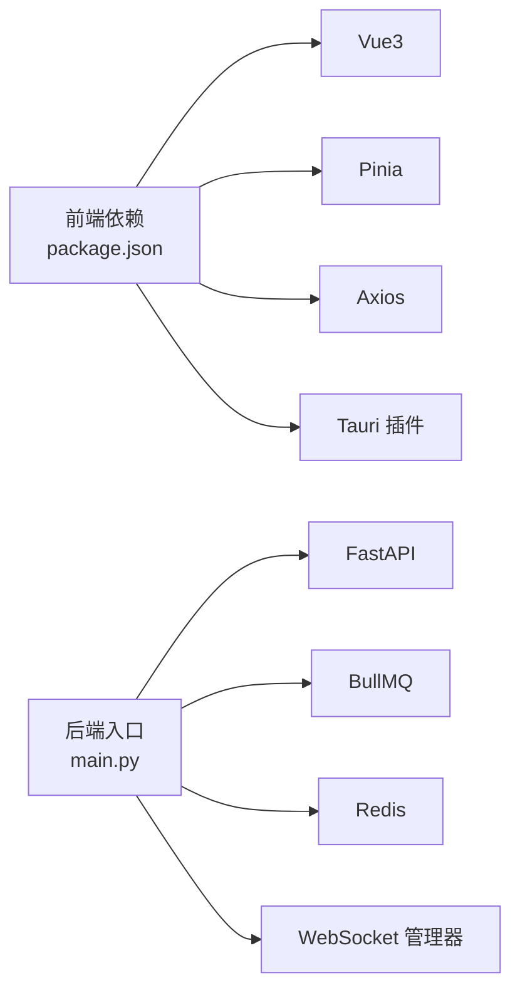

# 双通路操控体系

<cite>
**本文引用的文件**
- [project.md](file://project.md)
- [health.py](file://CCC-BrowserV4/backend/app/api/health.py)
- [main.ts](file://CCC-BrowserV4/frontend/src/main.ts)
- [ws.ts](file://CCC-BrowserV4/frontend/src/api/ws.ts)
- [execution.ts](file://CCC-BrowserV4/frontend/src/stores/execution.ts)
- [ExecutionPanel.vue](file://CCC-BrowserV4/frontend/src/components/ExecutionPanel.vue)
- [package.json](file://CCC-BrowserV4/frontend/package.json)
- [main.rs](file://CCC-BrowserV4/src-tauri/src/main.rs)
- [tasks.py](file://CCC_RPA_API/app/api/tasks.py)
- [task.py](file://CCC_RPA_API/app/models/task.py)
- [task_schemas.py](file://CCC_RPA_API/app/schemas/task.py)
- [task_service.py](file://CCC_RPA_API/app/services/task.py)
- [executor_service.py](file://CCC_RPA_API/app/services/executor.py)
- [session_manager.py](file://CCC_RPA_API/app/browser/session_manager.py)
- [site_automation.py](file://CCC_RPA_API/app/browser/site_automation.py)
- [human_behavior.py](file://CCC_RPA_API/app/browser/human_behavior.py)
- [waiter.py](file://CCC_RPA_API/app/browser/waiter.py)
- [manager.py](file://CCC_RPA_API/app/ws/manager.py)
- [main.py](file://CCC_RPA_API/app/main.py)
</cite>

## 目录
1. [引言](#引言)
2. [项目结构](#项目结构)
3. [核心组件](#核心组件)
4. [架构总览](#架构总览)
5. [详细组件分析](#详细组件分析)
6. [依赖分析](#依赖分析)
7. [性能考虑](#性能考虑)
8. [故障排除指南](#故障排除指南)
9. [结论](#结论)
10. [附录](#附录)

## 引言
本文件围绕“双通路操控体系”展开，系统性阐述两大操控通路的双向互通机制：  
- Playwright 远程脚本自动化批量控制通路（NodeJS/Python 双语言 SDK、BullMQ 任务队列、自定义脚本 DSL）  
- 内置 Chrome V3 扩展可视化人工操作通路（Service Worker 后台服务、Content Script 页面注入、SidePanel 侧边面板）

根据需求规格，两大通路需实现：  
- 人工在扩展面板操作页面 → 自动生成标准化 Playwright 脚本并入库  
- 远程 SDK 调用自动化脚本执行 → 扩展面板实时同步页面变化、截图与日志  
- AI 指令执行结果实时回推至扩展面板弹窗提示  

## 项目结构
仓库包含三层关键子系统：  
- 前端与桌面壳（Vue3 + Tauri）：租户管理后台、执行面板、WebSocket 客户端  
- 后端 API（FastAPI）：REST/WS 网关、任务执行、会话管理、WebSocket 管理  
- RPA 自动化引擎（Playwright Core + BullMQ）：任务队列、脚本执行、会话调度  

**图表来源**
- [main.ts:1-23](file://CCC-BrowserV4/frontend/src/main.ts#L1-L23)
- [ws.ts:1-88](file://CCC-BrowserV4/frontend/src/api/ws.ts#L1-L88)
- [execution.ts:1-229](file://CCC-BrowserV4/frontend/src/stores/execution.ts#L1-L229)
- [ExecutionPanel.vue:1-322](file://CCC-BrowserV4/frontend/src/components/ExecutionPanel.vue#L1-L322)
- [package.json:1-29](file://CCC-BrowserV4/frontend/package.json#L1-L29)
- [main.rs:1-29](file://CCC-BrowserV4/src-tauri/src/main.rs#L1-L29)
- [health.py:1-18](file://CCC-BrowserV4/backend/app/api/health.py#L1-L18)
- [main.py](file://CCC_RPA_API/app/main.py)
- [manager.py](file://CCC_RPA_API/app/ws/manager.py)
- [tasks.py](file://CCC_RPA_API/app/api/tasks.py)
- [executor_service.py](file://CCC_RPA_API/app/services/executor.py)
- [task_service.py](file://CCC_RPA_API/app/services/task.py)
- [session_manager.py](file://CCC_RPA_API/app/browser/session_manager.py)
- [site_automation.py](file://CCC_RPA_API/app/browser/site_automation.py)
- [human_behavior.py](file://CCC_RPA_API/app/browser/human_behavior.py)
- [waiter.py](file://CCC_RPA_API/app/browser/waiter.py)
- [task.py](file://CCC_RPA_API/app/models/task.py)
- [task_schemas.py](file://CCC_RPA_API/app/schemas/task.py)

**章节来源**
- [project.md:311-342](file://project.md#L311-L342)
- [main.ts:1-23](file://CCC-BrowserV4/frontend/src/main.ts#L1-L23)
- [ws.ts:1-88](file://CCC-BrowserV4/frontend/src/api/ws.ts#L1-L88)
- [execution.ts:1-229](file://CCC-BrowserV4/frontend/src/stores/execution.ts#L1-L229)
- [ExecutionPanel.vue:1-322](file://CCC-BrowserV4/frontend/src/components/ExecutionPanel.vue#L1-L322)
- [package.json:1-29](file://CCC-BrowserV4/frontend/package.json#L1-L29)
- [main.rs:1-29](file://CCC-BrowserV4/src-tauri/src/main.rs#L1-L29)
- [health.py:1-18](file://CCC-BrowserV4/backend/app/api/health.py#L1-L18)
- [main.py](file://CCC_RPA_API/app/main.py)
- [manager.py](file://CCC_RPA_API/app/ws/manager.py)
- [tasks.py](file://CCC_RPA_API/app/api/tasks.py)
- [executor_service.py](file://CCC_RPA_API/app/services/executor.py)
- [task_service.py](file://CCC_RPA_API/app/services/task.py)
- [session_manager.py](file://CCC_RPA_API/app/browser/session_manager.py)
- [site_automation.py](file://CCC_RPA_API/app/browser/site_automation.py)
- [human_behavior.py](file://CCC_RPA_API/app/browser/human_behavior.py)
- [waiter.py](file://CCC_RPA_API/app/browser/waiter.py)
- [task.py](file://CCC_RPA_API/app/models/task.py)
- [task_schemas.py](file://CCC_RPA_API/app/schemas/task.py)

## 核心组件
- Playwright SDK（NodeJS/Python）：提供远程脚本执行能力，封装页面跳转、点击、输入、截图、网络拦截等操作，并通过 REST/WS 接口对外提供统一调用入口。  
- BullMQ 任务队列：支持同步/异步批量任务、定时循环、优先级与重试策略，承载自动化脚本的调度与执行。  
- 自定义脚本 DSL：在线编辑、版本保存、条件判断、循环、异常捕获、步骤重试，形成可复用的脚本模板库。  
- Chrome V3 扩展：Service Worker 维持 WS 长连接、接收 AI/自动化指令、转发 CDP 操作、上报 DOM/截图/交互事件；Content Script 识别交互元素、提取文本、拦截广告与追踪；SidePanel 提供人工操作、自然语言输入、日志与截图查看、一键录制生成 Playwright 脚本、加密导出会话快照。  
- 双通路消息桥接：扩展面板与远程 SDK 的消息通过统一 WS 协议与后端 API 网关互通，实现状态同步与事件广播。

**章节来源**
- [project.md:311-342](file://project.md#L311-L342)

## 架构总览
双通路操控体系的总体架构如下：

**图表来源**
- [project.md:447-462](file://project.md#L447-L462)
- [manager.py](file://CCC_RPA_API/app/ws/manager.py)
- [executor_service.py](file://CCC_RPA_API/app/services/executor.py)
- [session_manager.py](file://CCC_RPA_API/app/browser/session_manager.py)
- [ws.ts:1-88](file://CCC-BrowserV4/frontend/src/api/ws.ts#L1-L88)

**章节来源**
- [project.md:447-462](file://project.md#L447-L462)
- [manager.py](file://CCC_RPA_API/app/ws/manager.py)
- [executor_service.py](file://CCC_RPA_API/app/services/executor.py)
- [session_manager.py](file://CCC_RPA_API/app/browser/session_manager.py)
- [ws.ts:1-88](file://CCC-BrowserV4/frontend/src/api/ws.ts#L1-L88)

## 详细组件分析

### Playwright SDK 与任务队列
- NodeJS/Python 双语言 SDK：封装底层 CDP 通信，屏蔽 Pod/进程/端口细节，提供统一的远程调用接口。  
- BullMQ 任务队列：支持任务优先级、重试、定时与批量执行，配合 Redis 存储任务状态与中间结果。  
- 自定义脚本 DSL：以 JSON/文本形式描述页面操作步骤，支持条件分支、循环与异常捕获，便于版本化与复用。  
- 远程执行流程：业务系统通过 REST 接口提交脚本任务，后端入队并由执行器驱动浏览器会话执行，WS 实时推送日志与截图。

**图表来源**
- [project.md:313-324](file://project.md#L313-L324)
- [tasks.py](file://CCC_RPA_API/app/api/tasks.py)
- [executor_service.py](file://CCC_RPA_API/app/services/executor.py)
- [session_manager.py](file://CCC_RPA_API/app/browser/session_manager.py)
- [ws.ts:1-88](file://CCC-BrowserV4/frontend/src/api/ws.ts#L1-L88)

**章节来源**
- [project.md:313-324](file://project.md#L313-L324)
- [tasks.py](file://CCC_RPA_API/app/api/tasks.py)
- [executor_service.py](file://CCC_RPA_API/app/services/executor.py)
- [session_manager.py](file://CCC_RPA_API/app/browser/session_manager.py)

### Chrome V3 扩展三大模块
- Service Worker：维持与调度网关的 WS 长连接，接收 AI/自动化指令，转发 CDP 操作，上报 DOM/截图/交互事件。  
- Content Script：识别按钮/输入框/弹窗，高亮可交互元素，提取页面文本供 AI 解析，拦截广告与第三方追踪脚本。  
- SidePanel：人工手动操作页面、自然语言 AI 指令输入、实时查看会话日志与截图、一键录制人工操作生成 Playwright 脚本、加密导出会话登录快照。

**图表来源**
- [project.md:325-334](file://project.md#L325-L334)

**章节来源**
- [project.md:325-334](file://project.md#L325-L334)

### 双通路消息桥接与互通
- 统一 WS 消息协议：固定字段包括消息类型、会话 ID、数据体、时间戳，确保扩展与后端 API 的消息一致性。  
- 互通机制：扩展面板的人工操作经录制生成脚本并入库；远程 SDK 的脚本执行通过 WS 推送页面变化、截图与日志；AI 指令执行结果实时回推至扩展面板弹窗提示。  
- 前端执行面板：基于 Pinia 状态管理与 WebSocket 客户端，接收并渲染执行进度、二维码、公司选择、登录结果与任务状态更新。

**图表来源**
- [project.md:481-494](file://project.md#L481-L494)
- [ws.ts:1-88](file://CCC-BrowserV4/frontend/src/api/ws.ts#L1-L88)
- [execution.ts:1-229](file://CCC-BrowserV4/frontend/src/stores/execution.ts#L1-L229)
- [ExecutionPanel.vue:1-322](file://CCC-BrowserV4/frontend/src/components/ExecutionPanel.vue#L1-L322)

**章节来源**
- [project.md:481-494](file://project.md#L481-L494)
- [ws.ts:1-88](file://CCC-BrowserV4/frontend/src/api/ws.ts#L1-L88)
- [execution.ts:1-229](file://CCC-BrowserV4/frontend/src/stores/execution.ts#L1-L229)
- [ExecutionPanel.vue:1-322](file://CCC-BrowserV4/frontend/src/components/ExecutionPanel.vue#L1-L322)

### 前端执行面板与 WebSocket 客户端
- WebSocket 客户端：自动重连、消息解析、事件派发，统一处理与后端的实时通信。  
- 执行状态存储：集中管理任务 ID、执行步骤、消息提示、二维码图片、公司列表与选中项，支持演示模式与真实后端 API 的无缝切换。  
- 执行面板组件：根据执行步骤渲染不同 UI 状态（扫码、选择公司、执行中、完成/失败/取消），并提供用户交互入口。

**图表来源**
- [execution.ts:1-229](file://CCC-BrowserV4/frontend/src/stores/execution.ts#L1-L229)
- [ExecutionPanel.vue:1-322](file://CCC-BrowserV4/frontend/src/components/ExecutionPanel.vue#L1-L322)
- [ws.ts:1-88](file://CCC-BrowserV4/frontend/src/api/ws.ts#L1-L88)

**章节来源**
- [execution.ts:1-229](file://CCC-BrowserV4/frontend/src/stores/execution.ts#L1-L229)
- [ExecutionPanel.vue:1-322](file://CCC-BrowserV4/frontend/src/components/ExecutionPanel.vue#L1-L322)
- [ws.ts:1-88](file://CCC-BrowserV4/frontend/src/api/ws.ts#L1-L88)

### 后端 API 与任务执行
- REST 接口：统一根路径 `/api/v1`，提供会话创建、脚本执行、AI 指令、截图获取与 WS 实时通道。  
- WebSocket 管理：集中维护会话级连接，广播执行日志、截图与状态更新。  
- 任务执行：任务模型与模式定义清晰，服务层负责执行器与任务编排，浏览器层负责会话管理与站点自动化。

**图表来源**
- [task.py](file://CCC_RPA_API/app/models/task.py)
- [task_schemas.py](file://CCC_RPA_API/app/schemas/task.py)
- [executor_service.py](file://CCC_RPA_API/app/services/executor.py)
- [session_manager.py](file://CCC_RPA_API/app/browser/session_manager.py)

**章节来源**
- [project.md:447-462](file://project.md#L447-L462)
- [task.py](file://CCC_RPA_API/app/models/task.py)
- [task_schemas.py](file://CCC_RPA_API/app/schemas/task.py)
- [executor_service.py](file://CCC_RPA_API/app/services/executor.py)
- [session_manager.py](file://CCC_RPA_API/app/browser/session_manager.py)

## 依赖分析
- 前端依赖：Vue3、Element Plus、Pinia、Vue Router、Axios、Tauri 插件等，支撑管理后台与执行面板。  
- 后端依赖：FastAPI、BullMQ、Redis、WebSocket 管理器、浏览器会话管理与自动化模块。  
- 通信依赖：统一 REST/WS 协议与消息格式，确保扩展与后端 API 的互通一致性。

**图表来源**
- [package.json:1-29](file://CCC-BrowserV4/frontend/package.json#L1-L29)
- [main.py](file://CCC_RPA_API/app/main.py)
- [manager.py](file://CCC_RPA_API/app/ws/manager.py)

**章节来源**
- [package.json:1-29](file://CCC-BrowserV4/frontend/package.json#L1-L29)
- [main.py](file://CCC_RPA_API/app/main.py)
- [manager.py](file://CCC_RPA_API/app/ws/manager.py)

## 性能考虑
- 会话创建与销毁：K8s 环境 ≤3s，单机进程模式 ≤1s；AI 单条自然语言指令推理响应 ≤1.5s；CDP 页面操作延迟 ≤200ms。  
- 并发与弹性：支持 200 并发会话稳定运行，HPA 根据队列积压自动扩容，闲置 Pod 自动销毁。  
- 传输与存储：全部通信 TLS 加密，会话快照 AES-256-CBC 加密存储，租户密钥隔离。  
- 资源限制：单会话内存上限 2Gi、CPU 单核、最多 10 个标签页、最长存活 30min~24h，超限强制销毁。

**章节来源**
- [project.md:506-551](file://project.md#L506-L551)

## 故障排除指南
- 健康检查：后端提供健康检查接口，返回服务状态与数据库连接状态，便于快速定位服务异常。  
- WebSocket 连接：前端 WebSocket 客户端具备自动重连机制，断线后定时重试，避免短暂网络波动导致的交互中断。  
- 任务执行：若执行失败，前端执行面板显示失败原因与任务状态更新；后端 WS 推送详细日志，便于定位问题。  
- 会话异常：若出现页面崩溃或 CDP 断连，调度中心自动重试 2 次，重试失败则销毁会话并上报异常。

**章节来源**
- [health.py:1-18](file://CCC-BrowserV4/backend/app/api/health.py#L1-L18)
- [ws.ts:1-88](file://CCC-BrowserV4/frontend/src/api/ws.ts#L1-L88)
- [execution.ts:1-229](file://CCC-BrowserV4/frontend/src/stores/execution.ts#L1-L229)
- [project.md:641-657](file://project.md#L641-L657)

## 结论
双通路操控体系通过 Playwright SDK 与 Chrome V3 扩展的双向互通，实现了“远程脚本自动化批量控制”与“可视化人工操作”的有机融合。统一的 REST/WS 接口、BullMQ 任务队列与自定义脚本 DSL，确保了可扩展、可观测、可复用的自动化能力；而扩展的三大模块则提供了强大的可视化与录制能力，满足复杂业务场景下的灵活操控需求。整体架构遵循统一接口契约与安全标准，具备商用级的隔离、性能与可靠性保障。

## 附录
- 统一接口契约：REST 接口根路径 `/api/v1`，WebSocket 路径 `/ws/session/{sessionId}`，统一 Bearer Token 鉴权与消息协议。  
- 数据层设计：PostgreSQL 核心表、Redis 缓存键规范、AES 加密存储策略。  
- 部署与运维：Docker/K8s 镜像、一键部署脚本、监控与告警模板、压力测试与安全加固文档。

**章节来源**
- [project.md:447-587](file://project.md#L447-L587)