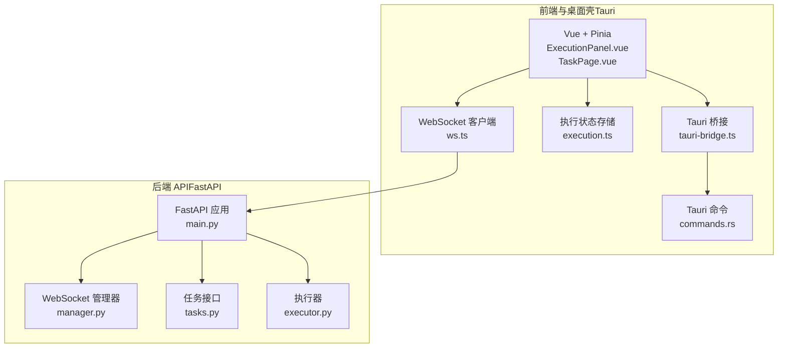
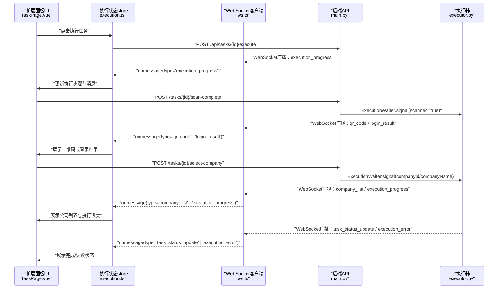
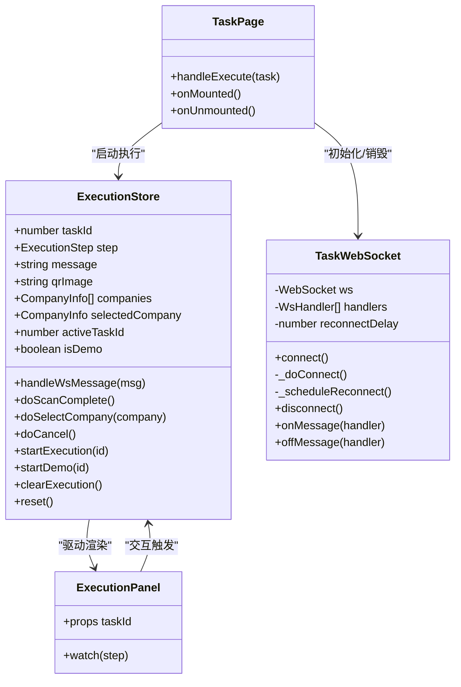
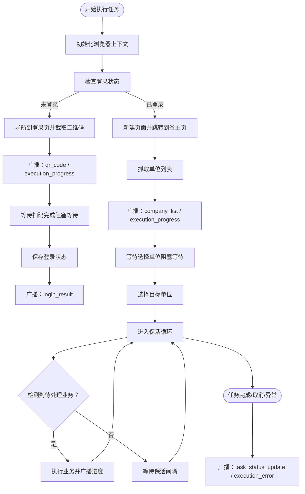
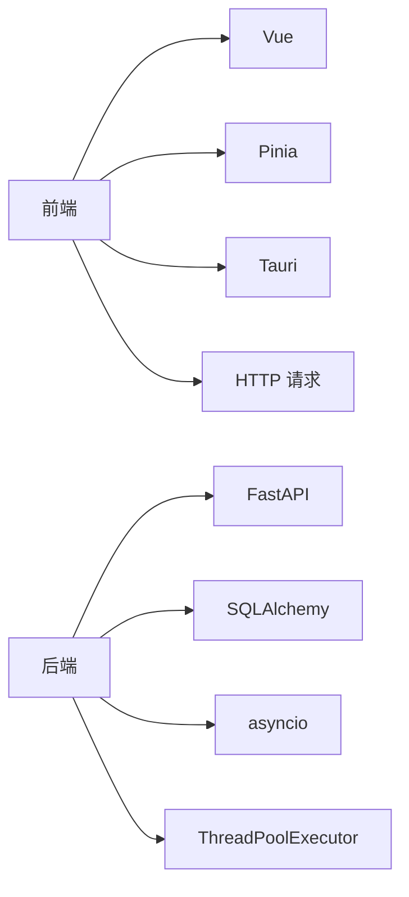

# 双通路消息桥接互通

<cite>
**本文档引用的文件**
- [main.rs](file://CCC-BrowserV4/src-tauri/src/main.rs)
- [commands.rs](file://CCC-BrowserV4/src-tauri/src/commands.rs)
- [tauri-bridge.ts](file://CCC-BrowserV4/frontend/src/utils/tauri-bridge.ts)
- [ws.ts](file://CCC-BrowserV4/frontend/src/api/ws.ts)
- [execution.ts](file://CCC-BrowserV4/frontend/src/stores/execution.ts)
- [ExecutionPanel.vue](file://CCC-BrowserV4/frontend/src/components/ExecutionPanel.vue)
- [TaskPage.vue](file://CCC-BrowserV4/frontend/src/pages/TaskPage.vue)
- [execution.ts](file://CCC-BrowserV4/frontend/src/types/execution.ts)
- [main.py](file://CCC_RPA_API/app/main.py)
- [manager.py](file://CCC_RPA_API/app/ws/manager.py)
- [tasks.py](file://CCC_RPA_API/app/api/tasks.py)
- [executor.py](file://CCC_RPA_API/app/services/executor.py)
</cite>

## 目录
1. [引言](#引言)
2. [项目结构](#项目结构)
3. [核心组件](#核心组件)
4. [架构总览](#架构总览)
5. [详细组件分析](#详细组件分析)
6. [依赖关系分析](#依赖关系分析)
7. [性能考虑](#性能考虑)
8. [故障排查指南](#故障排查指南)
9. [结论](#结论)
10. [附录](#附录)

## 引言
本文件围绕“双通路消息桥接互通”机制，系统阐述从扩展面板的人工操作页面到自动化脚本执行，再到远程 SDK 调用与扩展面板实时同步的技术闭环。重点包括：
- 人工在扩展面板操作页面到自动录制标准化 Playwright 脚本并存入租户脚本库的完整流程
- 远程 SDK 调用自动化脚本执行，扩展面板实时同步页面变化、执行步骤、截图的技术实现
- AI 指令执行成功/失败结果实时推送至扩展面板弹窗展示的消息传递机制
- WebSocket 长连接的建立、维护与断线重连策略
- 消息格式标准化、消息类型枚举、时间戳处理等技术细节
- 性能优化建议与故障排查方法

## 项目结构
本项目由两部分组成：
- 前端与桌面壳工程（Tauri）：负责 UI、交互、本地命令调用、WebSocket 客户端与状态管理
- 后端 API（FastAPI）：负责任务编排、Playwright 自动化执行、WebSocket 广播与数据库交互

图表来源
- [main.rs:1-29](file://CCC-BrowserV4/src-tauri/src/main.rs#L1-L29)
- [commands.rs:1-92](file://CCC-BrowserV4/src-tauri/src/commands.rs#L1-L92)
- [tauri-bridge.ts:1-33](file://CCC-BrowserV4/frontend/src/utils/tauri-bridge.ts#L1-L33)
- [ws.ts:1-88](file://CCC-BrowserV4/frontend/src/api/ws.ts#L1-L88)
- [execution.ts:1-229](file://CCC-BrowserV4/frontend/src/stores/execution.ts#L1-L229)
- [ExecutionPanel.vue:1-322](file://CCC-BrowserV4/frontend/src/components/ExecutionPanel.vue#L1-L322)
- [TaskPage.vue:1-428](file://CCC-BrowserV4/frontend/src/pages/TaskPage.vue#L1-L428)
- [main.py:1-127](file://CCC_RPA_API/app/main.py#L1-L127)
- [manager.py:1-29](file://CCC_RPA_API/app/ws/manager.py#L1-L29)
- [tasks.py:1-76](file://CCC_RPA_API/app/api/tasks.py#L1-L76)
- [executor.py:1-319](file://CCC_RPA_API/app/services/executor.py#L1-L319)

章节来源
- [main.rs:1-29](file://CCC-BrowserV4/src-tauri/src/main.rs#L1-L29)
- [main.py:1-127](file://CCC_RPA_API/app/main.py#L1-L127)

## 核心组件
- 扩展面板前端与状态管理
  - 执行状态存储与 UI 同步：通过 Pinia store 维护执行步骤、消息、二维码、公司列表等状态，并驱动 ExecutionPanel 展示
  - WebSocket 客户端：负责连接后端 WebSocket，接收消息并派发到 store
  - Tauri 桥接：封装本地命令（设备 ID、会话 ID、Token、打开浏览器、登录回调服务器）
- 后端 API 与执行引擎
  - FastAPI 应用：注册路由、CORS、WebSocket 端点，启动时初始化数据库与表结构
  - WebSocket 管理器：维护连接集合，广播消息
  - 任务接口：提供任务 CRUD、执行、日志、扫码完成、选择单位、取消执行等接口
  - 执行器：在独立线程池中运行 Playwright 自动化逻辑，按步骤广播消息，处理保活与业务执行

章节来源
- [execution.ts:1-229](file://CCC-BrowserV4/frontend/src/stores/execution.ts#L1-L229)
- [ws.ts:1-88](file://CCC-BrowserV4/frontend/src/api/ws.ts#L1-L88)
- [tauri-bridge.ts:1-33](file://CCC-BrowserV4/frontend/src/utils/tauri-bridge.ts#L1-L33)
- [main.py:1-127](file://CCC_RPA_API/app/main.py#L1-L127)
- [manager.py:1-29](file://CCC_RPA_API/app/ws/manager.py#L1-L29)
- [tasks.py:1-76](file://CCC_RPA_API/app/api/tasks.py#L1-L76)
- [executor.py:1-319](file://CCC_RPA_API/app/services/executor.py#L1-L319)

## 架构总览
双通路消息桥接的核心在于：
- 前端向后端发送控制消息（扫码完成、选择单位、取消执行）
- 后端通过 WebSocket 广播执行状态与结果（二维码、公司列表、进度、登录结果、错误、任务状态）

图表来源
- [TaskPage.vue:255-267](file://CCC-BrowserV4/frontend/src/pages/TaskPage.vue#L255-L267)
- [execution.ts:69-120](file://CCC-BrowserV4/frontend/src/stores/execution.ts#L69-L120)
- [ws.ts:20-84](file://CCC-BrowserV4/frontend/src/api/ws.ts#L20-L84)
- [main.py:119-127](file://CCC_RPA_API/app/main.py#L119-L127)
- [tasks.py:60-75](file://CCC_RPA_API/app/api/tasks.py#L60-L75)
- [executor.py:100-170](file://CCC_RPA_API/app/services/executor.py#L100-L170)

## 详细组件分析

### 扩展面板前端组件
- 执行状态存储（Pinia）
  - 维护 taskId、step、message、qrImage、companies、selectedCompany、activeTaskId、isDemo
  - 处理 WebSocket 消息，根据消息类型更新 UI 状态
- 执行面板组件（ExecutionPanel）
  - 根据 step 渲染不同 UI 片段（检查登录、二维码扫描、等待单位、执行/保活、完成/失败/取消）
  - 提供扫码完成、选择单位、取消执行等交互入口
- 任务页（TaskPage）
  - 触发任务执行、初始化/销毁 WebSocket、乐观更新任务状态
- WebSocket 客户端
  - 自动建立连接、解析消息、注册/注销处理器、断线重连
- Tauri 桥接与命令
  - 设备 ID、会话 ID、Token 生成
  - 打开外部浏览器、启动登录回调服务器并通过事件通知前端

图表来源
- [execution.ts:1-229](file://CCC-BrowserV4/frontend/src/stores/execution.ts#L1-L229)
- [ExecutionPanel.vue:1-322](file://CCC-BrowserV4/frontend/src/components/ExecutionPanel.vue#L1-L322)
- [TaskPage.vue:138-166](file://CCC-BrowserV4/frontend/src/pages/TaskPage.vue#L138-L166)
- [ws.ts:8-85](file://CCC-BrowserV4/frontend/src/api/ws.ts#L8-L85)

章节来源
- [execution.ts:1-229](file://CCC-BrowserV4/frontend/src/stores/execution.ts#L1-L229)
- [ExecutionPanel.vue:1-322](file://CCC-BrowserV4/frontend/src/components/ExecutionPanel.vue#L1-L322)
- [TaskPage.vue:138-166](file://CCC-BrowserV4/frontend/src/pages/TaskPage.vue#L138-L166)
- [ws.ts:1-88](file://CCC-BrowserV4/frontend/src/api/ws.ts#L1-L88)
- [tauri-bridge.ts:1-33](file://CCC-BrowserV4/frontend/src/utils/tauri-bridge.ts#L1-L33)
- [commands.rs:1-92](file://CCC-BrowserV4/src-tauri/src/commands.rs#L1-L92)

### 后端 API 与执行引擎
- FastAPI 应用
  - 注册路由、CORS、健康检查、WebSocket 端点
  - 启动时创建数据库表、插入初始任务数据、关闭时清理浏览器会话
- WebSocket 管理器
  - 维护连接集合，广播消息，清理无效连接
- 任务接口
  - 提供任务执行、扫码完成、选择单位、取消执行等接口，内部通过 ExecutionWaiter 协调执行器
- 执行器
  - 在线程池中运行 Playwright 自动化逻辑
  - 分阶段广播消息（检查登录、二维码、公司列表、执行进度、登录结果、错误、任务状态）
  - 实现保活循环与业务触发处理，支持浏览器异常恢复与截图检查点

图表来源
- [main.py:119-127](file://CCC_RPA_API/app/main.py#L119-L127)
- [manager.py:1-29](file://CCC_RPA_API/app/ws/manager.py#L1-L29)
- [tasks.py:47-75](file://CCC_RPA_API/app/api/tasks.py#L47-L75)
- [executor.py:78-315](file://CCC_RPA_API/app/services/executor.py#L78-L315)

章节来源
- [main.py:1-127](file://CCC_RPA_API/app/main.py#L1-L127)
- [manager.py:1-29](file://CCC_RPA_API/app/ws/manager.py#L1-L29)
- [tasks.py:1-76](file://CCC_RPA_API/app/api/tasks.py#L1-L76)
- [executor.py:1-319](file://CCC_RPA_API/app/services/executor.py#L1-L319)

### 消息格式与类型枚举
- 消息结构
  - 字段：type（字符串）、data（对象）
  - data 中包含 taskId（可选）、step、message、qrImage、companies、selectedCompany 等
- 消息类型（前端 store 处理）
  - qr_code：携带二维码图片数据
  - company_list：携带公司列表
  - execution_progress：携带执行步骤与消息
  - login_result：携带登录结果
  - execution_error：携带错误消息
  - task_status_update：携带任务最终状态
- 时间戳处理
  - 后端在任务日志与状态更新中使用 datetime；前端以本地时间格式化展示

章节来源
- [ws.ts:1-8](file://CCC-BrowserV4/frontend/src/api/ws.ts#L1-L8)
- [execution.ts:22-67](file://CCC-BrowserV4/frontend/src/stores/execution.ts#L22-L67)
- [execution.ts:1-17](file://CCC-BrowserV4/frontend/src/types/execution.ts#L1-L17)
- [executor.py:100-170](file://CCC_RPA_API/app/services/executor.py#L100-L170)

### WebSocket 长连接与断线重连
- 连接建立
  - 前端根据协议自动选择 ws/wss，连接 /ws 端点
- 消息处理
  - onmessage 解析 JSON，遍历处理器派发
- 断线重连
  - onclose 触发定时器重连，指数退避策略（当前固定延迟）
- 后端广播
  - 使用 ConnectionManager 广播消息，清理无效连接

章节来源
- [ws.ts:15-84](file://CCC-BrowserV4/frontend/src/api/ws.ts#L15-L84)
- [manager.py:1-29](file://CCC_RPA_API/app/ws/manager.py#L1-L29)
- [main.py:119-127](file://CCC_RPA_API/app/main.py#L119-L127)

### 人工操作到自动化脚本录制与入库
- 扩展面板操作页面
  - 用户在扩展面板进行扫码、选择单位等交互
- 远程 SDK 调用
  - 通过后端接口触发任务执行，执行器在 Playwright 线程中执行页面自动化
- 实时同步
  - 执行器按步骤广播消息，前端 store 更新 UI，展示页面变化、执行步骤、截图等
- 录制与入库
  - 本仓库未提供“录制标准化 Playwright 脚本并存入租户脚本库”的具体实现代码，建议在执行器中增加录制逻辑与脚本持久化流程，确保与现有消息广播机制协同工作

章节来源
- [tasks.py:47-52](file://CCC_RPA_API/app/api/tasks.py#L47-L52)
- [executor.py:78-315](file://CCC_RPA_API/app/services/executor.py#L78-L315)
- [execution.ts:22-67](file://CCC-BrowserV4/frontend/src/stores/execution.ts#L22-L67)

## 依赖关系分析
- 前端依赖
  - Vue/Pinia：状态管理与组件渲染
  - Element Plus：UI 组件库
  - Tauri：本地命令与事件通信
- 后端依赖
  - FastAPI：Web 框架与 WebSocket
  - SQLAlchemy：数据库 ORM
  - asyncio：异步事件循环与广播
  - ThreadPoolExecutor：并发执行 Playwright 任务

图表来源
- [execution.ts:1-229](file://CCC-BrowserV4/frontend/src/stores/execution.ts#L1-L229)
- [main.py:1-127](file://CCC_RPA_API/app/main.py#L1-L127)
- [executor.py:1-30](file://CCC_RPA_API/app/services/executor.py#L1-L30)

章节来源
- [execution.ts:1-229](file://CCC-BrowserV4/frontend/src/stores/execution.ts#L1-L229)
- [main.py:1-127](file://CCC_RPA_API/app/main.py#L1-L127)
- [executor.py:1-30](file://CCC_RPA_API/app/services/executor.py#L1-L30)

## 性能考虑
- 并发与线程池
  - 使用 ThreadPoolExecutor 控制执行器并发度，避免过多线程导致资源争用
- 消息广播
  - 在工作线程中通过主事件循环安全广播，减少阻塞
- 保活与等待
  - 保活循环分段等待，便于及时响应取消信号
- WebSocket
  - 前端固定重连延迟，建议引入指数退避与上限控制
- 数据库
  - 事务提交与异常处理，避免长时间持有连接

章节来源
- [executor.py:18-33](file://CCC_RPA_API/app/services/executor.py#L18-L33)
- [executor.py:208-266](file://CCC_RPA_API/app/services/executor.py#L208-L266)
- [ws.ts:58-64](file://CCC-BrowserV4/frontend/src/api/ws.ts#L58-L64)

## 故障排查指南
- WebSocket 连接问题
  - 检查协议与端点（ws/wss），确认后端 /ws 端点正常
  - 查看前端 onerror/onclose 日志，确认断线重连是否生效
- 消息解析失败
  - 确认消息格式为 JSON，字段完整
- 登录与单位选择
  - 检查扫码完成与选择单位接口调用是否成功
  - 确认 ExecutionWaiter 的信号与取消逻辑
- 执行异常
  - 查看后端日志与 execution_error 广播
  - 检查浏览器存活与恢复逻辑
- 前端状态不同步
  - 确认 store 的 handleWsMessage 是否正确过滤 taskId
  - 检查组件渲染逻辑与 watch 依赖

章节来源
- [ws.ts:35-55](file://CCC-BrowserV4/frontend/src/api/ws.ts#L35-L55)
- [execution.ts:22-67](file://CCC-BrowserV4/frontend/src/stores/execution.ts#L22-L67)
- [tasks.py:60-75](file://CCC_RPA_API/app/api/tasks.py#L60-L75)
- [executor.py:286-311](file://CCC_RPA_API/app/services/executor.py#L286-L311)

## 结论
本项目通过前后端双通路消息桥接，实现了从扩展面板的人工操作到自动化脚本执行的完整闭环。前端通过 WebSocket 实时接收后端广播，驱动 UI 展示与交互；后端通过执行器协调 Playwright 自动化与数据库状态更新。建议在现有基础上增强录制与脚本入库能力，并优化 WebSocket 重连策略与并发控制，以进一步提升稳定性与性能。

## 附录
- 关键流程路径参考
  - 任务执行入口：[TaskPage.vue:255-267](file://CCC-BrowserV4/frontend/src/pages/TaskPage.vue#L255-L267)
  - 执行状态处理：[execution.ts:22-67](file://CCC-BrowserV4/frontend/src/stores/execution.ts#L22-L67)
  - WebSocket 客户端：[ws.ts:20-84](file://CCC-BrowserV4/frontend/src/api/ws.ts#L20-L84)
  - 后端 WebSocket 端点：[main.py:119-127](file://CCC_RPA_API/app/main.py#L119-L127)
  - 执行器广播与保活：[executor.py:100-266](file://CCC_RPA_API/app/services/executor.py#L100-L266)
  - 登录回调与事件通知：[commands.rs:44-91](file://CCC-BrowserV4/src-tauri/src/commands.rs#L44-L91)