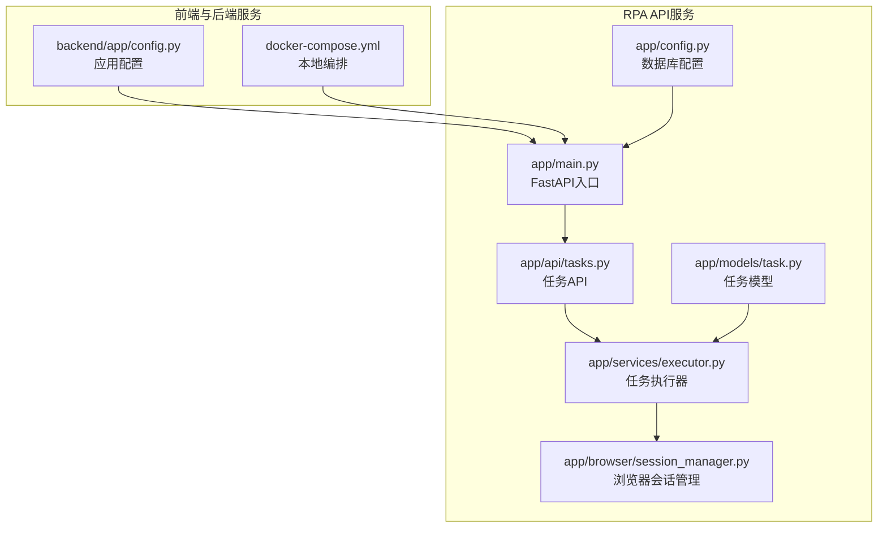
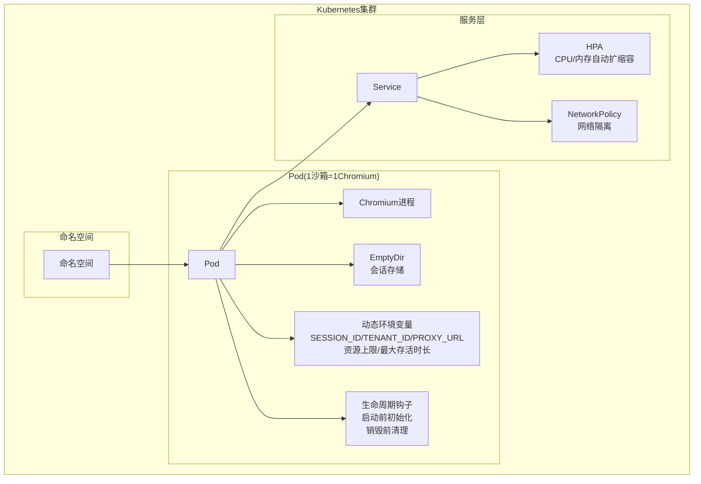
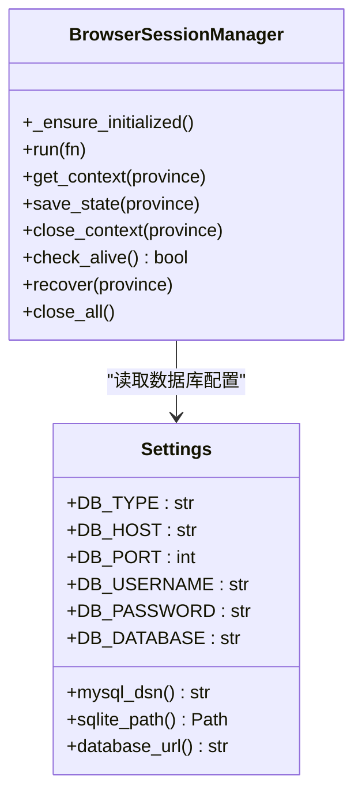
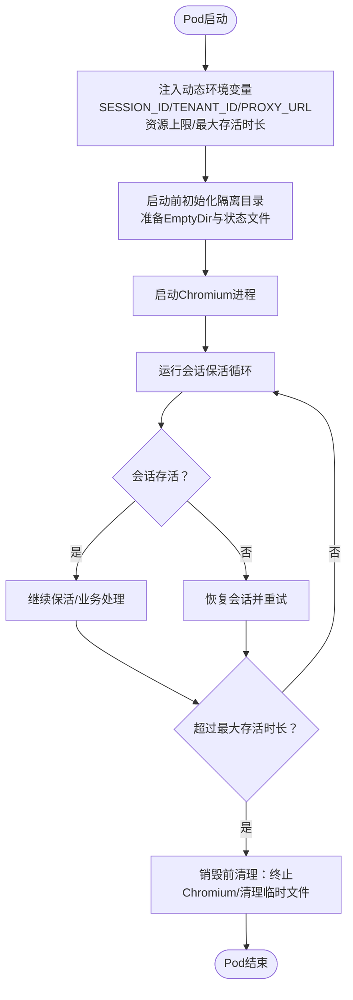
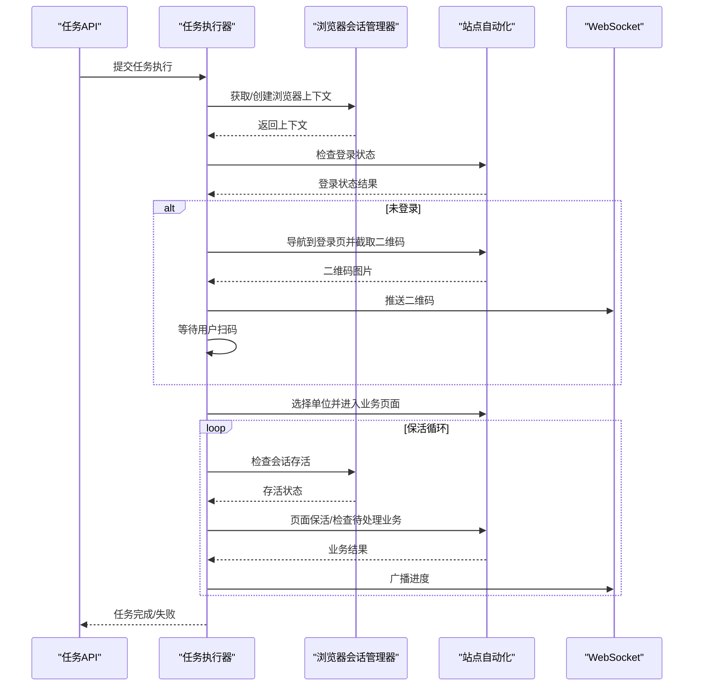
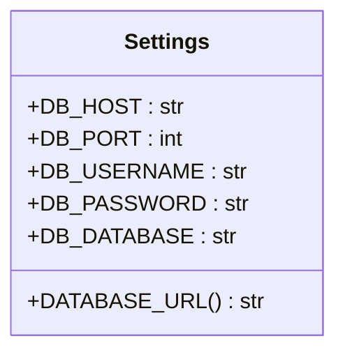
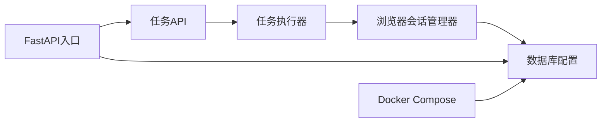

# K8s容器分布式集群部署

<cite>
**本文档引用的文件**
- [backend/app/config.py](file://CCC-BrowserV4/backend/app/config.py)
- [RPA_API/app/main.py](file://CCC_RPA_API/app/main.py)
- [RPA_API/app/config.py](file://CCC_RPA_API/app/config.py)
- [RPA_API/app/browser/session_manager.py](file://CCC_RPA_API/app/browser/session_manager.py)
- [RPA_API/app/api/tasks.py](file://CCC_RPA_API/app/api/tasks.py)
- [RPA_API/app/models/task.py](file://CCC_RPA_API/app/models/task.py)
- [RPA_API/app/services/executor.py](file://CCC_RPA_API/app/services/executor.py)
- [docker-compose.yml](file://CCC-BrowserV4/docker-compose.yml)
</cite>

## 目录
1. [简介](#简介)
2. [项目结构](#项目结构)
3. [核心组件](#核心组件)
4. [架构总览](#架构总览)
5. [详细组件分析](#详细组件分析)
6. [依赖关系分析](#依赖关系分析)
7. [性能考虑](#性能考虑)
8. [故障排查指南](#故障排查指南)
9. [结论](#结论)
10. [附录](#附录)

## 简介
本文件面向在Kubernetes集群中部署基于Chromium的分布式浏览器沙箱服务，目标是实现“1 Pod = 1独立浏览器沙箱会话”的最小单元设计，并通过HPA实现弹性扩缩容、通过NetworkPolicy实现网络隔离、通过EmptyDir提供独立会话存储。同时，文档深入解析Pod模板的动态环境变量注入（包含会话标识、代理地址、租户标识、资源上限、最大存活时长等），以及生命周期钩子（启动前初始化隔离目录、销毁前强制终止Chromium进程、清理临时文件）等实现细节，并给出K8s部署YAML、资源调度、监控告警和运维管理的最佳实践。

## 项目结构
该项目包含两个主要模块：
- 前端与后端服务：位于 CCC-BrowserV4，提供Web界面与基础配置。
- RPA API服务：位于 CCC_RPA_API，负责任务编排、浏览器会话管理、Playwright驱动的站点自动化执行。

**图表来源**
- [backend/app/config.py:1-52](file://CCC-BrowserV4/backend/app/config.py#L1-L52)
- [docker-compose.yml:1-21](file://CCC-BrowserV4/docker-compose.yml#L1-L21)
- [RPA_API/app/main.py:1-127](file://CCC_RPA_API/app/main.py#L1-L127)
- [RPA_API/app/config.py:1-22](file://CCC_RPA_API/app/config.py#L1-L22)
- [RPA_API/app/browser/session_manager.py:1-186](file://CCC_RPA_API/app/browser/session_manager.py#L1-L186)
- [RPA_API/app/api/tasks.py:1-76](file://CCC_RPA_API/app/api/tasks.py#L1-L76)
- [RPA_API/app/models/task.py:1-25](file://CCC_RPA_API/app/models/task.py#L1-L25)
- [RPA_API/app/services/executor.py:1-319](file://CCC_RPA_API/app/services/executor.py#L1-L319)

**章节来源**
- [backend/app/config.py:1-52](file://CCC-BrowserV4/backend/app/config.py#L1-L52)
- [docker-compose.yml:1-21](file://CCC-BrowserV4/docker-compose.yml#L1-L21)
- [RPA_API/app/main.py:1-127](file://CCC_RPA_API/app/main.py#L1-L127)
- [RPA_API/app/config.py:1-22](file://CCC_RPA_API/app/config.py#L1-L22)
- [RPA_API/app/browser/session_manager.py:1-186](file://CCC_RPA_API/app/browser/session_manager.py#L1-L186)
- [RPA_API/app/api/tasks.py:1-76](file://CCC_RPA_API/app/api/tasks.py#L1-L76)
- [RPA_API/app/models/task.py:1-25](file://CCC_RPA_API/app/models/task.py#L1-L25)
- [RPA_API/app/services/executor.py:1-319](file://CCC_RPA_API/app/services/executor.py#L1-L319)

## 核心组件
- 应用配置管理：集中管理数据库连接、环境变量读取与URL生成。
- FastAPI入口与路由：提供健康检查、WebSocket通信、任务API接口。
- 浏览器会话管理：以专用线程承载Playwright+Chromium，按省份维护上下文，持久化storage_state。
- 任务执行器：封装任务执行流程，包含扫码登录、单位选择、业务保活循环、错误恢复与广播通知。
- 任务模型：定义任务表结构及字段，支持多租户、设备、省分等维度。

**章节来源**
- [backend/app/config.py:1-52](file://CCC-BrowserV4/backend/app/config.py#L1-L52)
- [RPA_API/app/main.py:1-127](file://CCC_RPA_API/app/main.py#L1-L127)
- [RPA_API/app/browser/session_manager.py:1-186](file://CCC_RPA_API/app/browser/session_manager.py#L1-L186)
- [RPA_API/app/api/tasks.py:1-76](file://CCC_RPA_API/app/api/tasks.py#L1-L76)
- [RPA_API/app/models/task.py:1-25](file://CCC_RPA_API/app/models/task.py#L1-L25)
- [RPA_API/app/services/executor.py:1-319](file://CCC_RPA_API/app/services/executor.py#L1-L319)

## 架构总览
下图展示了K8s部署下的整体架构：每个Pod内运行一个独立的Chromium实例，通过EmptyDir提供会话状态存储；通过HPA根据CPU/内存指标弹性扩缩容；通过NetworkPolicy实现网络隔离；通过动态环境变量注入实现会话隔离与租户控制。

[此图为概念性架构示意，无需图表来源标注]

## 详细组件分析

### 组件A：Pod最小单元设计与资源限制
- 设计原则
  - 1 Pod = 1独立浏览器沙箱会话，Pod内仅运行单个Chromium进程，避免跨会话干扰。
  - 使用EmptyDir作为会话存储，确保会话状态与Pod生命周期绑定，提升隔离性与安全性。
  - 资源硬限制建议：CPU 0.5-1核，内存1-2Gi，满足Chromium稳定运行与多标签页场景。
- 实现要点
  - 在会话管理器中，通过专用线程启动Chromium，避免与主线程事件循环冲突。
  - 会话状态持久化至存储目录，结合EmptyDir实现会话隔离。
  - 通过环境变量注入控制会话标识、租户标识、代理地址等，实现多租户隔离。

**图表来源**
- [RPA_API/app/browser/session_manager.py:1-186](file://CCC_RPA_API/app/browser/session_manager.py#L1-L186)
- [RPA_API/app/config.py:1-22](file://CCC_RPA_API/app/config.py#L1-L22)

**章节来源**
- [RPA_API/app/browser/session_manager.py:1-186](file://CCC_RPA_API/app/browser/session_manager.py#L1-L186)
- [RPA_API/app/config.py:1-22](file://CCC_RPA_API/app/config.py#L1-L22)

### 组件B：动态环境变量注入与生命周期钩子
- 动态环境变量注入
  - SESSION_ID：唯一标识本次沙箱会话，便于日志追踪与会话定位。
  - TENANT_ID：租户标识，实现多租户隔离与资源配额控制。
  - PROXY_URL：代理地址，支持企业内网或出口代理访问。
  - 资源上限：通过环境变量传递CPU/内存上限，用于容器级资源约束与HPA决策依据。
  - 最大存活时长：控制会话保活周期，防止长时间占用资源。
- 生命周期钩子
  - 启动前：初始化隔离目录，准备EmptyDir挂载点与会话状态文件。
  - 运行中：保持Chromium进程稳定运行，定期检查会话存活状态。
  - 销毁前：强制终止Chromium进程，清理临时文件，释放会话资源。

[此图为概念性流程示意，无需图表来源标注]

**章节来源**
- [RPA_API/app/browser/session_manager.py:1-186](file://CCC_RPA_API/app/browser/session_manager.py#L1-L186)
- [RPA_API/app/services/executor.py:1-319](file://CCC_RPA_API/app/services/executor.py#L1-L319)

### 组件C：任务执行与保活循环
- 任务执行器封装了完整的执行流程：初始化浏览器、检查登录状态、扫码登录、保存状态、进入保活循环。
- 保活循环在业务页面内执行轻量操作，持续监听待处理业务，支持取消信号与超时控制。
- 执行过程中通过WebSocket广播进度与错误，便于前端实时反馈。

**图表来源**
- [RPA_API/app/api/tasks.py:1-76](file://CCC_RPA_API/app/api/tasks.py#L1-L76)
- [RPA_API/app/services/executor.py:1-319](file://CCC_RPA_API/app/services/executor.py#L1-L319)
- [RPA_API/app/browser/session_manager.py:1-186](file://CCC_RPA_API/app/browser/session_manager.py#L1-L186)

**章节来源**
- [RPA_API/app/api/tasks.py:1-76](file://CCC_RPA_API/app/api/tasks.py#L1-L76)
- [RPA_API/app/services/executor.py:1-319](file://CCC_RPA_API/app/services/executor.py#L1-L319)
- [RPA_API/app/browser/session_manager.py:1-186](file://CCC_RPA_API/app/browser/session_manager.py#L1-L186)

### 组件D：数据库配置与连接
- 应用配置类统一管理数据库主机、端口、用户名、密码与数据库名，并提供DSN与SQLite路径生成方法。
- FastAPI入口在启动时创建数据库表结构，确保服务可用性。

**图表来源**
- [RPA_API/app/config.py:1-22](file://CCC_RPA_API/app/config.py#L1-L22)
- [RPA_API/app/main.py:1-127](file://CCC_RPA_API/app/main.py#L1-L127)

**章节来源**
- [RPA_API/app/config.py:1-22](file://CCC_RPA_API/app/config.py#L1-L22)
- [RPA_API/app/main.py:1-127](file://CCC_RPA_API/app/main.py#L1-L127)

## 依赖关系分析
- 组件耦合
  - 任务API依赖任务执行器，执行器依赖浏览器会话管理器，会话管理器依赖专用线程与Chromium。
  - FastAPI入口负责启动与关闭阶段的数据库初始化与资源回收。
- 外部依赖
  - 数据库：MySQL或SQLite，通过配置类生成连接URL。
  - WebSocket：用于向客户端推送执行进度与状态。
  - Docker Compose：提供本地MySQL服务示例。

**图表来源**
- [RPA_API/app/api/tasks.py:1-76](file://CCC_RPA_API/app/api/tasks.py#L1-L76)
- [RPA_API/app/services/executor.py:1-319](file://CCC_RPA_API/app/services/executor.py#L1-L319)
- [RPA_API/app/browser/session_manager.py:1-186](file://CCC_RPA_API/app/browser/session_manager.py#L1-L186)
- [RPA_API/app/config.py:1-22](file://CCC_RPA_API/app/config.py#L1-L22)
- [RPA_API/app/main.py:1-127](file://CCC_RPA_API/app/main.py#L1-L127)
- [docker-compose.yml:1-21](file://CCC-BrowserV4/docker-compose.yml#L1-L21)

**章节来源**
- [RPA_API/app/api/tasks.py:1-76](file://CCC_RPA_API/app/api/tasks.py#L1-L76)
- [RPA_API/app/services/executor.py:1-319](file://CCC_RPA_API/app/services/executor.py#L1-L319)
- [RPA_API/app/browser/session_manager.py:1-186](file://CCC_RPA_API/app/browser/session_manager.py#L1-L186)
- [RPA_API/app/config.py:1-22](file://CCC_RPA_API/app/config.py#L1-L22)
- [RPA_API/app/main.py:1-127](file://CCC_RPA_API/app/main.py#L1-L127)
- [docker-compose.yml:1-21](file://CCC-BrowserV4/docker-compose.yml#L1-L21)

## 性能考虑
- 资源分配
  - CPU 0.5-1核，内存1-2Gi，满足Chromium稳定运行与多标签页场景。
  - 通过HPA根据CPU/内存使用率自动扩缩容，避免资源浪费与瓶颈。
- 存储策略
  - EmptyDir提供本地高性能存储，适合短期会话状态缓存。
  - 对于需要持久化的状态，建议结合外部存储或定期备份策略。
- 会话隔离
  - 每个Pod独立运行Chromium，避免跨会话资源共享导致的性能抖动。
  - 通过租户标识与代理地址实现网络与业务隔离。
- 执行效率
  - 保活循环采用分段等待与取消信号检测，降低阻塞开销。
  - 使用专用线程承载浏览器操作，避免与主线程事件循环冲突。

[本节为通用性能指导，无需章节来源标注]

## 故障排查指南
- 浏览器会话异常
  - 现象：Chromium崩溃或会话失效。
  - 处理：执行器内置恢复逻辑，自动检测并重建上下文，必要时重新打开目标页面。
- 登录流程问题
  - 现象：二维码无法显示或扫码超时。
  - 处理：检查会话管理器的页面导航与截图逻辑，确认网络连通性与代理设置。
- 资源不足
  - 现象：Pod频繁重启或扩缩容异常。
  - 处理：调整HPA阈值与资源请求/限制，确保Chromium稳定运行。
- 数据库连接失败
  - 现象：启动时报数据库连接错误。
  - 处理：检查配置类中的连接参数与网络可达性，确认数据库服务正常。

**章节来源**
- [RPA_API/app/services/executor.py:1-319](file://CCC_RPA_API/app/services/executor.py#L1-L319)
- [RPA_API/app/browser/session_manager.py:1-186](file://CCC_RPA_API/app/browser/session_manager.py#L1-L186)
- [RPA_API/app/config.py:1-22](file://CCC_RPA_API/app/config.py#L1-L22)

## 结论
通过将“1 Pod = 1独立浏览器沙箱会话”的理念落地，结合EmptyDir会话存储、HPA弹性扩缩容与NetworkPolicy网络隔离，可在Kubernetes上实现高可用、高隔离、易扩展的分布式浏览器服务。动态环境变量注入与生命周期钩子进一步增强了会话管理的可控性与可观测性。配合合理的资源分配与监控告警策略，可有效保障生产环境的稳定性与性能。

[本节为总结性内容，无需章节来源标注]

## 附录

### K8s部署最佳实践清单
- 资源与调度
  - 设置requests/limits：CPU 0.5-1核，内存1-2Gi；启用HPA基于CPU/内存指标自动扩缩容。
  - 使用亲和性与反亲和性策略，避免同租户会话过度集中在同一节点。
- 存储
  - 使用EmptyDir作为会话存储卷，确保会话状态与Pod生命周期一致。
  - 对关键状态进行定期备份或外部持久化。
- 网络
  - 通过NetworkPolicy限制出站流量，仅允许必要的代理与目标站点访问。
  - 为内部服务间通信配置最小权限的ServiceAccount与RBAC。
- 安全
  - 启用PodSecurity标准，限制特权模式与主机命名空间访问。
  - 使用Secret管理敏感配置（如数据库凭据、代理认证），避免明文注入。
- 可观测性
  - 部署Prometheus/Grafana监控CPU/内存/会话数/错误率等关键指标。
  - 配置日志聚合与链路追踪，便于定位会话异常与性能瓶颈。
- 运维
  - 制定滚动更新策略与回滚预案，确保升级过程平滑。
  - 建立告警规则：会话存活率下降、HPA频繁扩容、Chromium异常重启等。

[本节为通用运维指导，无需章节来源标注]