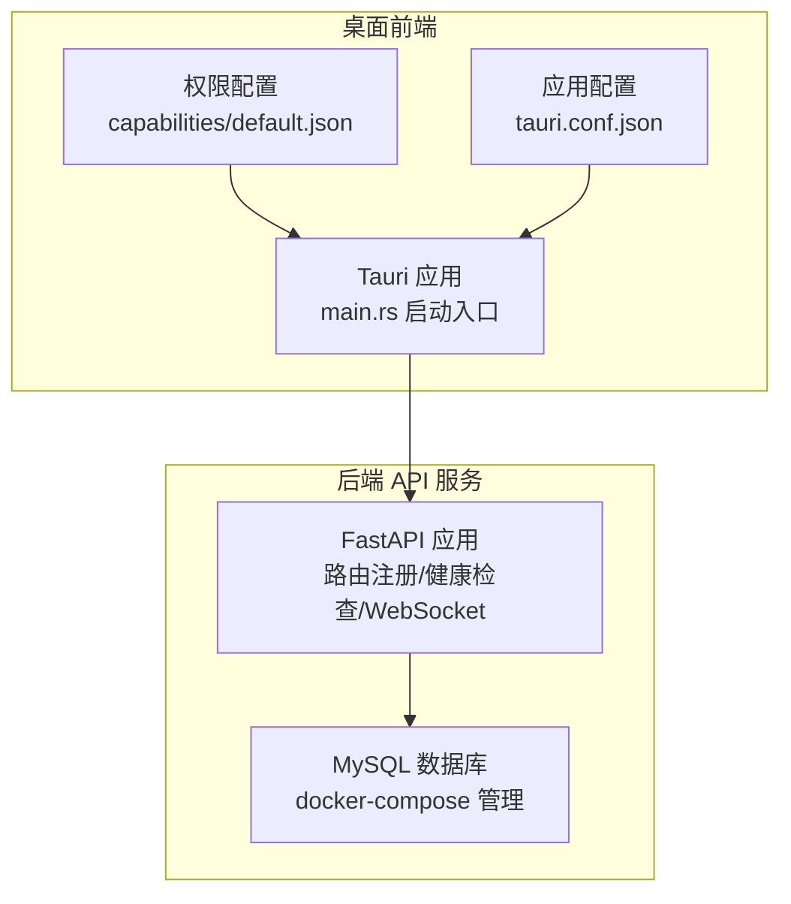
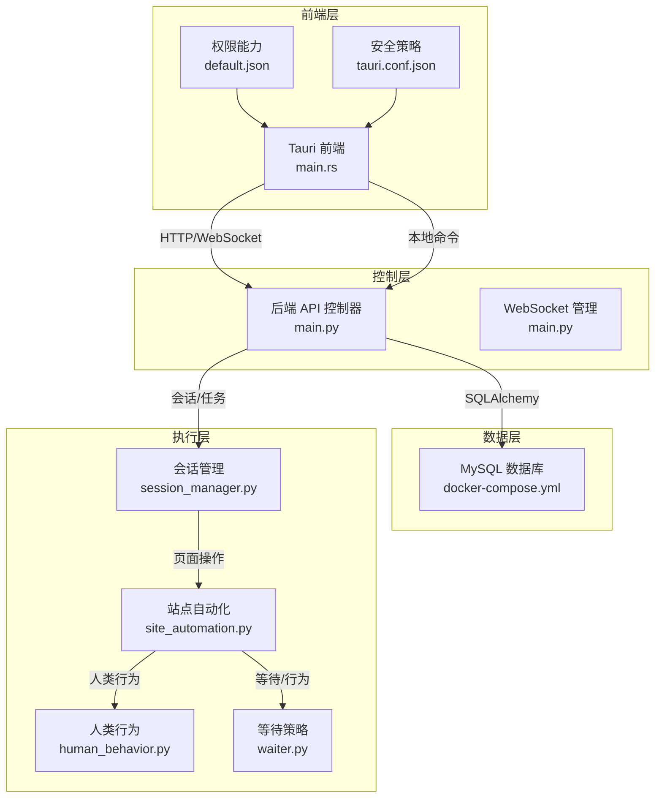
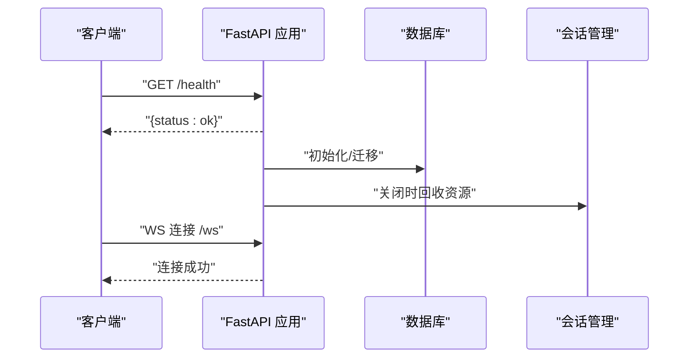
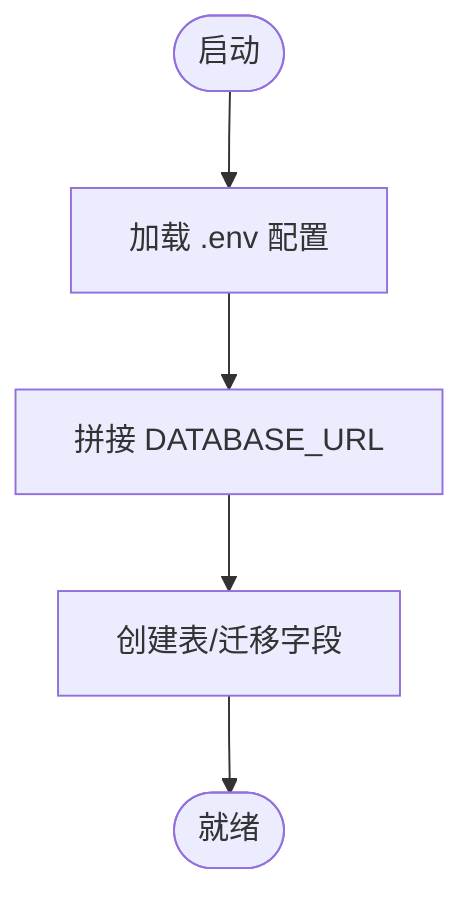
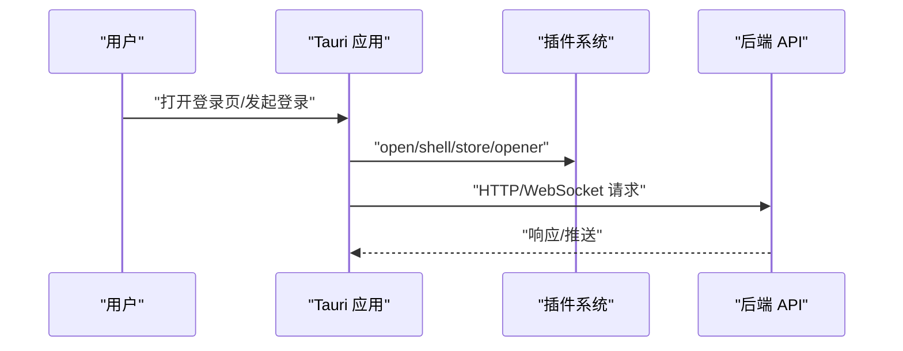
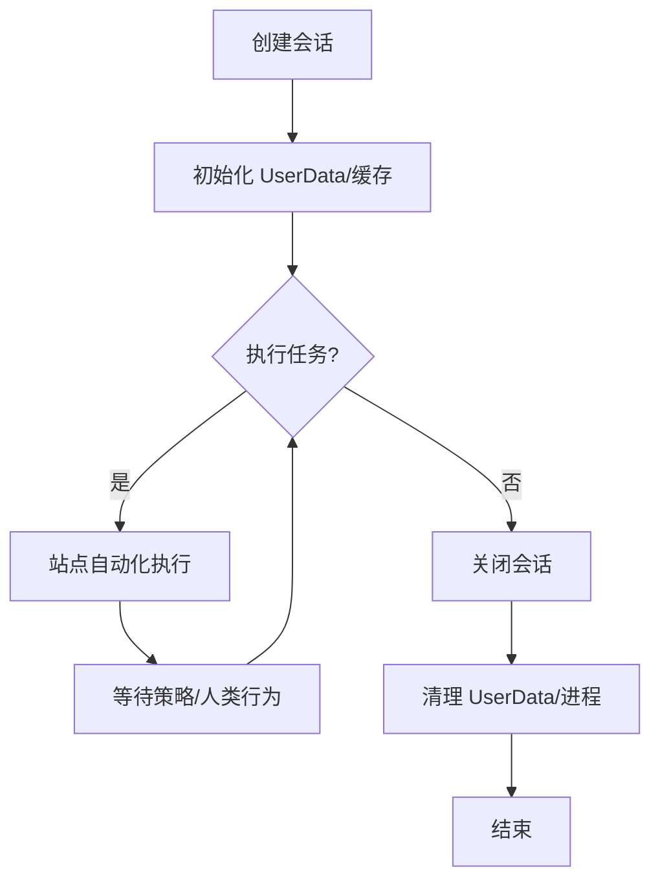
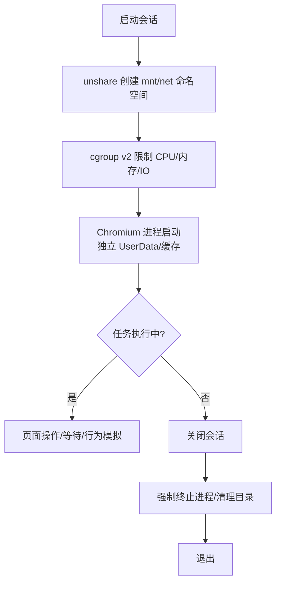
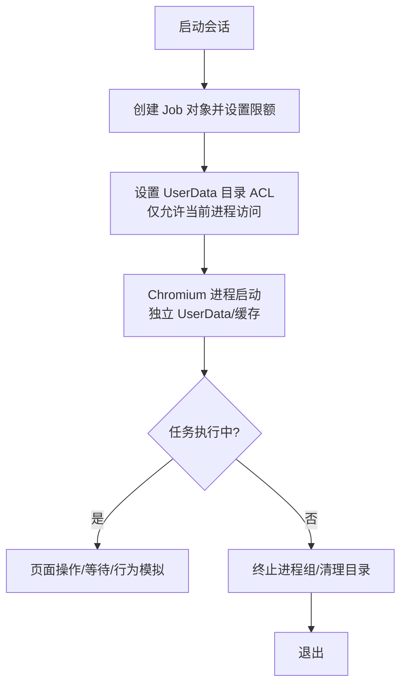
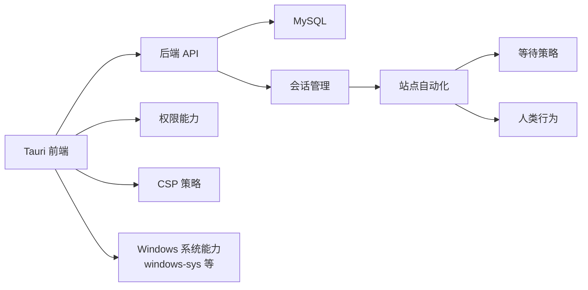

# 单机进程沙箱部署

<cite>
**本文档引用的文件**
- [main.py](file://CCC_RPA_API/app/main.py)
- [config.py](file://CCC_RPA_API/app/config.py)
- [docker-compose.yml](file://CCC_RPA_API/docker-compose.yml)
- [session_manager.py](file://CCC_RPA_API/app/browser/session_manager.py)
- [site_automation.py](file://CCC_RPA_API/app/browser/site_automation.py)
- [waiter.py](file://CCC_RPA_API/app/browser/waiter.py)
- [human_behavior.py](file://CCC_RPA_API/app/browser/human_behavior.py)
- [main.rs](file://CCC-BrowserV4/src-tauri/src/main.rs)
- [tauri.conf.json](file://CCC-BrowserV4/src-tauri/tauri.conf.json)
- [default.json](file://CCC-BrowserV4/src-tauri/capabilities/default.json)
- [Cargo.lock](file://CCC-BrowserV4/src-tauri/Cargo.lock)
- [project.md](file://project.md)
</cite>

## 目录
1. [引言](#引言)
2. [项目结构](#项目结构)
3. [核心组件](#核心组件)
4. [架构总览](#架构总览)
5. [详细组件分析](#详细组件分析)
6. [依赖分析](#依赖分析)
7. [性能考虑](#性能考虑)
8. [故障排查指南](#故障排查指南)
9. [结论](#结论)
10. [附录](#附录)

## 引言
本文件面向“单机进程沙箱部署”的落地实践，结合仓库现有实现，系统阐述在 Linux 与 Windows 两大平台上的资源限制与隔离策略、技术边界与性能特征，并给出环境准备、配置与启动脚本编写、以及常见问题排查建议。需要特别说明的是：当前仓库未包含直接使用 Linux unshare 创建 mnt/net 命名空间或 cgroup v2 的实现；Windows 端也未发现 Win32 Job 对象与 NTFS ACL 的直接调用代码。因此，本文在“Linux 沙箱”与“Windows 沙箱”部分以“基于现有能力的工程化落地建议”形式提供可实施的方案与流程图示，帮助读者在现有基础上扩展实现。

## 项目结构
本仓库包含两套主要子系统：
- 后端 API 服务（FastAPI）：负责任务编排、数据库交互、WebSocket 通信等。
- 桌面前端（Tauri + Vue）：提供图形化界面与本地命令桥接，用于设备初始化、登录回调、文件打开等。

图表来源
- [main.py:1-127](file://CCC_RPA_API/app/main.py#L1-L127)
- [docker-compose.yml:1-21](file://CCC_RPA_API/docker-compose.yml#L1-L21)
- [main.rs:1-29](file://CCC-BrowserV4/src-tauri/src/main.rs#L1-L29)
- [tauri.conf.json:1-29](file://CCC-BrowserV4/src-tauri/tauri.conf.json#L1-L29)
- [default.json:1-12](file://CCC-BrowserV4/src-tauri/capabilities/default.json#L1-L12)

章节来源
- [main.py:1-127](file://CCC_RPA_API/app/main.py#L1-L127)
- [docker-compose.yml:1-21](file://CCC_RPA_API/docker-compose.yml#L1-L21)
- [main.rs:1-29](file://CCC-BrowserV4/src-tauri/src/main.rs#L1-L29)
- [tauri.conf.json:1-29](file://CCC-BrowserV4/src-tauri/tauri.conf.json#L1-L29)
- [default.json:1-12](file://CCC-BrowserV4/src-tauri/capabilities/default.json#L1-L12)

## 核心组件
- 后端 API 服务
  - FastAPI 应用：CORS 中间件、路由注册、启动/关闭钩子、健康检查、WebSocket 管理。
  - 数据库：通过 SQLAlchemy 初始化表结构与迁移字段。
- 桌面前端
  - Tauri 应用：插件注册、命令处理器、设备信息初始化、窗口配置与 CSP。
  - 权限与能力：默认权限集合，限定 shell/open、store、opener 等能力范围。
- 浏览器自动化与会话管理
  - 会话管理：会话生命周期、资源回收、关闭流程。
  - 站点自动化：页面行为、等待策略、人类行为模拟。

章节来源
- [main.py:10-127](file://CCC_RPA_API/app/main.py#L10-L127)
- [config.py:1-22](file://CCC_RPA_API/app/config.py#L1-L22)
- [main.rs:7-28](file://CCC-BrowserV4/src-tauri/src/main.rs#L7-L28)
- [tauri.conf.json:24-26](file://CCC-BrowserV4/src-tauri/tauri.conf.json#L24-L26)
- [default.json:6-11](file://CCC-BrowserV4/src-tauri/capabilities/default.json#L6-L11)

## 架构总览
下图展示“单机进程沙箱部署”的整体架构：后端 API 作为控制中枢，桌面前端提供用户交互与本地能力桥接，二者通过 WebSocket 实时通信；数据库提供持久化支撑；浏览器自动化模块负责具体任务执行。

图表来源
- [main.py:1-127](file://CCC_RPA_API/app/main.py#L1-L127)
- [docker-compose.yml:1-21](file://CCC_RPA_API/docker-compose.yml#L1-L21)
- [main.rs:1-29](file://CCC-BrowserV4/src-tauri/src/main.rs#L1-L29)
- [tauri.conf.json:1-29](file://CCC-BrowserV4/src-tauri/tauri.conf.json#L1-L29)
- [default.json:1-12](file://CCC-BrowserV4/src-tauri/capabilities/default.json#L1-L12)
- [session_manager.py](file://CCC_RPA_API/app/browser/session_manager.py)
- [site_automation.py](file://CCC_RPA_API/app/browser/site_automation.py)
- [waiter.py](file://CCC_RPA_API/app/browser/waiter.py)
- [human_behavior.py](file://CCC_RPA_API/app/browser/human_behavior.py)

## 详细组件分析

### 后端 API 控制器与生命周期
- CORS 与路由：允许跨域访问，注册认证、任务、租户、设备等路由。
- 启动事件：捕获主事件循环用于异步广播；创建数据库表并进行字段迁移；插入初始任务数据。
- 关闭事件：关闭所有浏览器会话，确保资源回收。
- 健康检查与 WebSocket：提供 /health 接口与 /ws 通道。

图表来源
- [main.py:14-21](file://CCC_RPA_API/app/main.py#L14-L21)
- [main.py:30-102](file://CCC_RPA_API/app/main.py#L30-L102)
- [main.py:108-127](file://CCC_RPA_API/app/main.py#L108-L127)

章节来源
- [main.py:1-127](file://CCC_RPA_API/app/main.py#L1-L127)

### 数据库与配置
- 配置类 Settings：定义数据库主机、端口、用户名、密码、库名，并生成 DATABASE_URL。
- docker-compose：定义 MySQL 服务、环境变量、卷挂载与字符集配置。

图表来源
- [config.py:6-22](file://CCC_RPA_API/app/config.py#L6-L22)
- [docker-compose.yml:4-17](file://CCC_RPA_API/docker-compose.yml#L4-L17)

章节来源
- [config.py:1-22](file://CCC_RPA_API/app/config.py#L1-L22)
- [docker-compose.yml:1-21](file://CCC_RPA_API/docker-compose.yml#L1-L21)

### 桌面前端与安全策略
- 启动入口：注册插件（shell/store/opener）、命令处理器、设备初始化。
- 权限能力：默认权限集合，限定可执行的操作范围。
- 安全策略：CSP 仅允许特定来源的脚本与连接，降低 XSS 与不安全连接风险。

图表来源
- [main.rs:8-27](file://CCC-BrowserV4/src-tauri/src/main.rs#L8-L27)
- [default.json:6-11](file://CCC-BrowserV4/src-tauri/capabilities/default.json#L6-L11)
- [tauri.conf.json:24-26](file://CCC-BrowserV4/src-tauri/tauri.conf.json#L24-L26)

章节来源
- [main.rs:1-29](file://CCC-BrowserV4/src-tauri/src/main.rs#L1-L29)
- [tauri.conf.json:1-29](file://CCC-BrowserV4/src-tauri/tauri.conf.json#L1-L29)
- [default.json:1-12](file://CCC-BrowserV4/src-tauri/capabilities/default.json#L1-L12)

### 浏览器会话管理与自动化
- 会话管理：统一管理浏览器会话生命周期，确保在销毁时清理 UserData 目录与进程资源。
- 站点自动化：封装页面操作、等待策略与人类行为模拟，提升反检测能力。
- 等待策略与人类行为：通过等待器与行为模拟减少自动化痕迹。

图表来源
- [session_manager.py](file://CCC_RPA_API/app/browser/session_manager.py)
- [site_automation.py](file://CCC_RPA_API/app/browser/site_automation.py)
- [waiter.py](file://CCC_RPA_API/app/browser/waiter.py)
- [human_behavior.py](file://CCC_RPA_API/app/browser/human_behavior.py)

章节来源
- [session_manager.py](file://CCC_RPA_API/app/browser/session_manager.py)
- [site_automation.py](file://CCC_RPA_API/app/browser/site_automation.py)
- [waiter.py](file://CCC_RPA_API/app/browser/waiter.py)
- [human_behavior.py](file://CCC_RPA_API/app/browser/human_behavior.py)

### Linux 沙箱部署（基于现有能力的工程化建议）
说明：当前仓库未包含 Linux unshare 与 cgroup v2 的直接实现。以下为“如何在现有架构上落地”的工程化建议与流程图示。

- 资源限制与隔离边界
  - 进程级隔离：每个会话独立进程，避免共享内存与句柄。
  - 文件系统隔离：独立 UserData/缓存/下载目录，销毁时递归删除。
  - 网络隔离：独立代理 IP 与网络栈（如需），避免 Cookie/存储互通。
  - 浏览器存储隔离：每个会话独立 IndexedDB/LocalStorage/SessionStorage。
- 技术实现建议
  - 使用 unshare 创建独立 mnt/net 命名空间（在启动 Chromium 前）。
  - 使用 cgroup v2 限制 CPU/内存/IO，绑定到对应会话进程。
  - 在会话销毁阶段，强制终止进程并清理目录。
- 性能与稳定性
  - 合理设置 cgroup 限额，避免过低导致任务失败。
  - 使用只读根文件系统与最小挂载，减少攻击面。
  - 通过会话超时与硬内存阈值自动回收，防止资源泄漏。

图表来源
- [session_manager.py](file://CCC_RPA_API/app/browser/session_manager.py)
- [site_automation.py](file://CCC_RPA_API/app/browser/site_automation.py)
- [waiter.py](file://CCC_RPA_API/app/browser/waiter.py)
- [human_behavior.py](file://CCC_RPA_API/app/browser/human_behavior.py)

章节来源
- [session_manager.py](file://CCC_RPA_API/app/browser/session_manager.py)
- [site_automation.py](file://CCC_RPA_API/app/browser/site_automation.py)
- [waiter.py](file://CCC_RPA_API/app/browser/waiter.py)
- [human_behavior.py](file://CCC_RPA_API/app/browser/human_behavior.py)

### Windows 沙箱部署（基于现有能力的工程化建议）
说明：当前仓库未包含 Win32 Job 对象与 NTFS ACL 的直接实现。以下为“如何在现有架构上落地”的工程化建议与流程图示。

- 资源限制与隔离边界
  - 进程组限制：使用 Job 对象限制 CPU/内存/IO，绑定到会话进程组。
  - 文件系统隔离：独立 UserData/缓存/下载目录，销毁时递归删除。
  - 访问控制：对 UserData 目录设置 NTFS ACL，仅允许当前会话进程访问。
- 技术实现建议
  - 在会话启动前创建 Job 对象并设置限额。
  - 使用 SetNamedSecurityInfo 设置目录 ACL，拒绝其他主体访问。
  - 在会话销毁阶段，终止进程组并清理目录。
- 性能与稳定性
  - 合理设置 Job 限额，避免过低导致任务失败。
  - 通过会话超时与硬内存阈值自动回收，防止资源泄漏。

图表来源
- [session_manager.py](file://CCC_RPA_API/app/browser/session_manager.py)
- [site_automation.py](file://CCC_RPA_API/app/browser/site_automation.py)
- [waiter.py](file://CCC_RPA_API/app/browser/waiter.py)
- [human_behavior.py](file://CCC_RPA_API/app/browser/human_behavior.py)

章节来源
- [session_manager.py](file://CCC_RPA_API/app/browser/session_manager.py)
- [site_automation.py](file://CCC_RPA_API/app/browser/site_automation.py)
- [waiter.py](file://CCC_RPA_API/app/browser/waiter.py)
- [human_behavior.py](file://CCC_RPA_API/app/browser/human_behavior.py)

## 依赖分析
- 外部依赖
  - Rust 生态：windows-sys、windows-core 等，用于 Windows 平台能力调用。
  - Tauri 插件：shell/store/opener，受限于默认权限配置。
- 内部依赖
  - API 服务依赖数据库连接与会话管理模块。
  - 前端通过命令桥接与后端通信，受 CSP 与权限约束。

图表来源
- [main.py:1-127](file://CCC_RPA_API/app/main.py#L1-L127)
- [main.rs:1-29](file://CCC-BrowserV4/src-tauri/src/main.rs#L1-L29)
- [Cargo.lock:4645-4686](file://CCC-BrowserV4/src-tauri/Cargo.lock#L4645-L4686)
- [default.json:1-12](file://CCC-BrowserV4/src-tauri/capabilities/default.json#L1-L12)
- [tauri.conf.json:1-29](file://CCC-BrowserV4/src-tauri/tauri.conf.json#L1-L29)

章节来源
- [Cargo.lock:4645-4686](file://CCC-BrowserV4/src-tauri/Cargo.lock#L4645-L4686)
- [default.json:1-12](file://CCC-BrowserV4/src-tauri/capabilities/default.json#L1-L12)
- [tauri.conf.json:1-29](file://CCC-BrowserV4/src-tauri/tauri.conf.json#L1-L29)

## 性能考虑
- 资源限制
  - Linux：合理设置 cgroup v2 限额，避免过低导致任务失败；按会话粒度分配 CPU/内存/IO。
  - Windows：Job 对象限额应与硬件资源匹配，避免过度竞争。
- I/O 与磁盘
  - 将 UserData/缓存置于 SSD 或内存盘，减少 I/O 延迟。
  - 定期清理缓存与日志，防止磁盘占用过高。
- 网络
  - 为每个会话配置独立代理 IP，避免网络成为瓶颈。
- 反检测
  - 人类行为与等待策略可降低被识别概率，但会增加执行时间，需权衡吞吐与稳定性。

## 故障排查指南
- 启动与连接
  - 检查后端 API 是否正确加载 .env 并创建数据库表。
  - 确认 docker-compose 中 MySQL 端口映射与凭据一致。
- WebSocket 与权限
  - 若前端无法连接 /ws，检查 CORS 与 CSP 配置是否允许后端地址。
  - 若本地命令失败，确认 capabilities/default.json 中权限是否包含所需能力。
- 会话与资源
  - 若会话无法关闭或资源未释放，检查会话管理模块的关闭流程与异常处理。
  - 若页面崩溃影响其他会话，确认进程隔离与目录隔离是否生效。
- Windows 系统能力
  - 若调用 Windows 系统能力失败，检查 windows-sys 版本与链接配置。

章节来源
- [main.py:30-102](file://CCC_RPA_API/app/main.py#L30-L102)
- [docker-compose.yml:4-17](file://CCC_RPA_API/docker-compose.yml#L4-L17)
- [tauri.conf.json:24-26](file://CCC-BrowserV4/src-tauri/tauri.conf.json#L24-L26)
- [default.json:6-11](file://CCC-BrowserV4/src-tauri/capabilities/default.json#L6-L11)
- [Cargo.lock:4645-4686](file://CCC-BrowserV4/src-tauri/Cargo.lock#L4645-L4686)

## 结论
本仓库提供了完整的后端 API 与桌面前端基础能力，结合浏览器自动化模块，可作为“单机进程沙箱部署”的工程化基座。对于 Linux 与 Windows 的资源限制与隔离，当前仓库未直接实现相应系统调用，但可通过在现有启动流程中集成 unshare/cgroup v2 与 Job 对象/ACL 的方式落地。建议在生产环境中配合严格的 CSP、权限控制与资源限额策略，确保任务执行的稳定性与安全性。

## 附录
- 适用场景
  - 单机多租户任务执行、需要强隔离的自动化场景。
  - 对 Cookie/LocalStorage/IndexedDB 等浏览器存储隔离有明确要求。
- 不适用场景
  - 需要跨主机共享会话状态或全局缓存的场景。
  - 对 CPU/内存资源无上限且追求极致吞吐的场景。