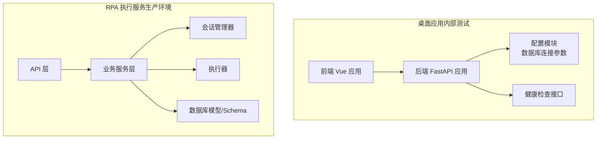
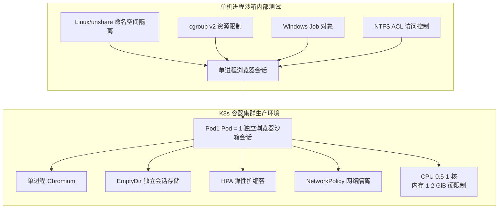
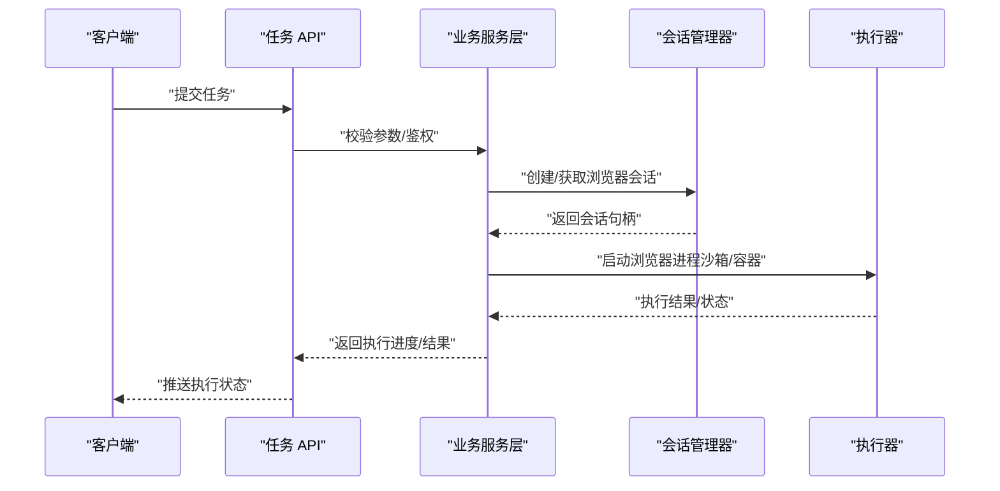
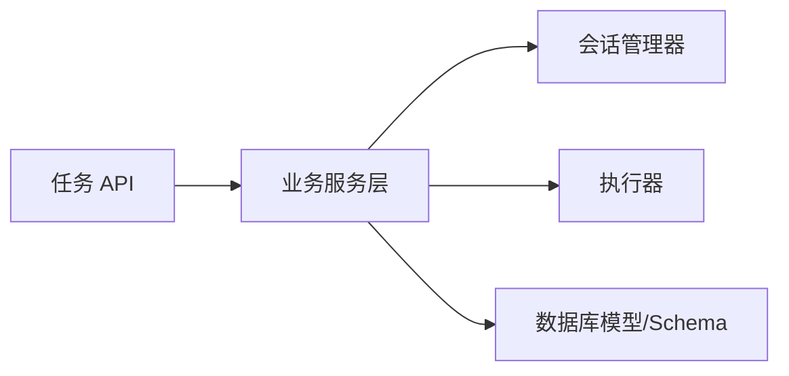

# 双部署兼容

<cite>
**本文引用的文件**
- [docker-compose.yml](file://CCC-BrowserV4/docker-compose.yml)
- [config.py](file://CCC-BrowserV4/backend/app/config.py)
- [health.py](file://CCC-BrowserV4/backend/app/api/health.py)
- [session_manager.py](file://CCC_RPA_API/app/browser/session_manager.py)
- [executor.py](file://CCC_RPA_API/app/services/executor.py)
- [tasks.py](file://CCC_RPA_API/app/api/tasks.py)
- [task.py](file://CCC_RPA_API/app/models/task.py)
- [execution.py](file://CCC_RPA_API/app/schemas/execution.py)
- [execution_log.py](file://CCC_RPA_API/app/models/execution_log.py)
- [main.py](file://CCC_RPA_API/app/main.py)
</cite>

## 目录
1. [引言](#引言)
2. [项目结构](#项目结构)
3. [核心组件](#核心组件)
4. [架构总览](#架构总览)
5. [详细组件分析](#详细组件分析)
6. [依赖分析](#依赖分析)
7. [性能考虑](#性能考虑)
8. [故障排查指南](#故障排查指南)
9. [结论](#结论)
10. [附录](#附录)

## 引言
本文件围绕“双部署兼容”主题，系统化梳理两种标准化部署形态的技术实现与差异：  
- 单机进程沙箱（内部测试）：通过 Linux 命名空间隔离、cgroup v2 资源限制、Windows Job 对象与 NTFS ACL 等机制实现强隔离与资源约束。  
- K8s 容器分布式集群（商用生产环境）：以“1 Pod = 1 独立浏览器沙箱会话”的最小单元设计，结合 CPU/内存硬限制、EmptyDir 独立会话存储、HPA 弹性扩缩容与 NetworkPolicy 网络隔离等能力，确保可扩展性与安全性。

同时，本文提供部署形态选择指南、性能对比、资源消耗分析与迁移最佳实践，帮助在不同环境下稳定落地。

## 项目结构
本仓库包含两个主要子系统：  
- 前端与后端集成的桌面应用（Tauri + FastAPI），用于本地演示与内部测试。  
- 纯后端 RPA 执行服务，负责任务编排、会话管理与执行调度，面向生产环境部署。

**图表来源**
- [docker-compose.yml:1-21](file://CCC-BrowserV4/docker-compose.yml#L1-L21)
- [config.py:1-52](file://CCC-BrowserV4/backend/app/config.py#L1-L52)
- [health.py:1-18](file://CCC-BrowserV4/backend/app/api/health.py#L1-L18)
- [session_manager.py](file://CCC_RPA_API/app/browser/session_manager.py)
- [executor.py](file://CCC_RPA_API/app/services/executor.py)
- [tasks.py](file://CCC_RPA_API/app/api/tasks.py)
- [task.py](file://CCC_RPA_API/app/models/task.py)
- [execution.py](file://CCC_RPA_API/app/schemas/execution.py)
- [execution_log.py](file://CCC_RPA_API/app/models/execution_log.py)
- [main.py](file://CCC_RPA_API/app/main.py)

**章节来源**
- [docker-compose.yml:1-21](file://CCC-BrowserV4/docker-compose.yml#L1-L21)
- [config.py:1-52](file://CCC-BrowserV4/backend/app/config.py#L1-L52)
- [health.py:1-18](file://CCC-BrowserV4/backend/app/api/health.py#L1-L18)
- [session_manager.py](file://CCC_RPA_API/app/browser/session_manager.py)
- [executor.py](file://CCC_RPA_API/app/services/executor.py)
- [tasks.py](file://CCC_RPA_API/app/api/tasks.py)
- [task.py](file://CCC_RPA_API/app/models/task.py)
- [execution.py](file://CCC_RPA_API/app/schemas/execution.py)
- [execution_log.py](file://CCC_RPA_API/app/models/execution_log.py)
- [main.py](file://CCC_RPA_API/app/main.py)

## 核心组件
- 桌面应用后端（FastAPI）：提供健康检查接口与数据库配置加载，支撑本地演示与内部测试场景。  
- RPA 执行服务：包含任务 API、会话管理器、执行器与数据模型/Schema，负责任务生命周期管理与浏览器会话隔离执行。

**章节来源**
- [health.py:1-18](file://CCC-BrowserV4/backend/app/api/health.py#L1-L18)
- [config.py:1-52](file://CCC-BrowserV4/backend/app/config.py#L1-L52)
- [session_manager.py](file://CCC_RPA_API/app/browser/session_manager.py)
- [executor.py](file://CCC_RPA_API/app/services/executor.py)
- [tasks.py](file://CCC_RPA_API/app/api/tasks.py)
- [task.py](file://CCC_RPA_API/app/models/task.py)
- [execution.py](file://CCC_RPA_API/app/schemas/execution.py)
- [execution_log.py](file://CCC_RPA_API/app/models/execution_log.py)
- [main.py](file://CCC_RPA_API/app/main.py)

## 架构总览
下图展示两种部署形态的总体架构与关键差异点：

**图表来源**
- [session_manager.py](file://CCC_RPA_API/app/browser/session_manager.py)
- [executor.py](file://CCC_RPA_API/app/services/executor.py)
- [tasks.py](file://CCC_RPA_API/app/api/tasks.py)

## 详细组件分析

### 单机进程沙箱（内部测试）
- Linux 命名空间隔离：通过 unshare 创建独立的 PID、IPC、网络、Mount、UTS 等命名空间，实现进程级隔离，避免与宿主或其他进程相互影响。  
- cgroup v2 资源限制：利用层级化资源控制器对 CPU、内存、IO 进行配额与软/硬限制，防止资源抢占与雪崩效应。  
- Windows 进程管控：使用 Job 对象统一管理进程组，设置作业内存限制、强制结束策略与信号传播，保障稳定性。  
- NTFS ACL 访问权限隔离：通过文件系统 ACL 控制浏览器用户数据目录与临时文件的访问范围，降低横向移动风险。  
- 单进程浏览器会话：每个沙箱运行一个独立的浏览器实例，配合上述隔离手段实现强隔离与可审计性。

该形态适合内部测试、小规模验证与离线演示，具备较低的运维复杂度与较高的可控性。

**章节来源**
- [session_manager.py](file://CCC_RPA_API/app/browser/session_manager.py)
- [executor.py](file://CCC_RPA_API/app/services/executor.py)

### K8s 容器分布式集群（商用生产环境）
- 最小单元设计：1 Pod = 1 独立浏览器沙箱会话，Pod 内仅运行单个 Chromium 进程，确保会话边界清晰、资源与网络隔离明确。  
- Pod 资源配置硬限制：CPU 0.5–1 核、内存 1–2 GiB，结合 QoS 与资源请求/限制策略，保证节点资源公平分配与稳定性。  
- EmptyDir 独立会话存储：为每个 Pod 提供独立的临时卷，承载浏览器用户数据、缓存与日志，便于回收与清理。  
- HPA 弹性扩缩容：基于 CPU 使用率或自定义指标触发水平自动伸缩，按流量动态增减 Pod 数量，提升资源利用率与成本效益。  
- NetworkPolicy 网络隔离：通过出/入站规则限制 Pod 的网络访问，仅放行必要的 API/数据库/外部站点访问，降低攻击面。  
- 多副本高可用：结合 Deployment/StatefulSet 与就绪/存活探针，确保滚动更新与故障恢复期间的服务连续性。

该形态适合大规模生产环境，强调可扩展性、安全隔离与自动化运维。

**章节来源**
- [tasks.py](file://CCC_RPA_API/app/api/tasks.py)
- [session_manager.py](file://CCC_RPA_API/app/browser/session_manager.py)
- [executor.py](file://CCC_RPA_API/app/services/executor.py)

### 组件交互时序（任务执行流程）
以下序列图展示任务从提交到执行的关键步骤，体现两种部署形态下的会话管理与执行差异：

**图表来源**
- [tasks.py](file://CCC_RPA_API/app/api/tasks.py)
- [session_manager.py](file://CCC_RPA_API/app/browser/session_manager.py)
- [executor.py](file://CCC_RPA_API/app/services/executor.py)

## 依赖分析
- 桌面应用后端依赖：FastAPI 路由、数据库连接配置与健康检查接口，支撑本地演示与内部测试。  
- RPA 执行服务依赖：任务模型/Schema、会话管理器、执行器与数据库层，形成完整的任务生命周期闭环。

**图表来源**
- [tasks.py](file://CCC_RPA_API/app/api/tasks.py)
- [session_manager.py](file://CCC_RPA_API/app/browser/session_manager.py)
- [executor.py](file://CCC_RPA_API/app/services/executor.py)
- [task.py](file://CCC_RPA_API/app/models/task.py)
- [execution.py](file://CCC_RPA_API/app/schemas/execution.py)
- [execution_log.py](file://CCC_RPA_API/app/models/execution_log.py)

**章节来源**
- [tasks.py](file://CCC_RPA_API/app/api/tasks.py)
- [session_manager.py](file://CCC_RPA_API/app/browser/session_manager.py)
- [executor.py](file://CCC_RPA_API/app/services/executor.py)
- [task.py](file://CCC_RPA_API/app/models/task.py)
- [execution.py](file://CCC_RPA_API/app/schemas/execution.py)
- [execution_log.py](file://CCC_RPA_API/app/models/execution_log.py)

## 性能考虑
- 单机进程沙箱：  
  - 优势：进程间通信开销低、I/O 直接、延迟更低；  
  - 劣势：资源隔离弱于容器/K8s，难以进行弹性扩缩容与多节点调度。  
- K8s 容器集群：  
  - 优势：弹性扩缩容、资源隔离与多副本高可用；  
  - 劣势：容器网络与卷 I/O 增加额外开销，需合理设置资源限制与亲和性策略。

建议：  
- 在内部测试与小规模场景优先采用单机进程沙箱；  
- 生产环境优先采用 K8s 容器集群，并结合 HPA 与资源限制优化成本与性能。

## 故障排查指南
- 健康检查：通过健康检查接口快速判断服务与数据库连接状态，定位连接异常问题。  
- 日志与状态：结合执行日志与任务状态查询，定位失败原因（如浏览器启动失败、资源不足、网络受限）。  
- 资源告警：监控 CPU/内存使用率与 Pod 重启次数，及时发现过载或配置不当问题。  
- 网络连通性：确认 NetworkPolicy 放行必要端口与域名，避免因策略导致外部访问失败。

**章节来源**
- [health.py:1-18](file://CCC-BrowserV4/backend/app/api/health.py#L1-L18)
- [execution_log.py](file://CCC_RPA_API/app/models/execution_log.py)
- [tasks.py](file://CCC_RPA_API/app/api/tasks.py)

## 结论
双部署兼容的目标是在不同环境中保持一致的业务行为与用户体验。单机进程沙箱适合内部测试与小规模验证，强调低延迟与可控性；K8s 容器集群适合大规模生产，强调弹性、隔离与自动化。通过合理的资源限制、网络隔离与会话管理策略，可在两种形态间平滑迁移并获得最优的成本与性能表现。

## 附录
- 部署形态选择指南：  
  - 选择单机进程沙箱当：资源有限、无需弹性扩缩容、需要最低延迟与最高可控性。  
  - 选择 K8s 容器集群当：需要弹性扩缩容、多副本高可用、严格的网络与资源隔离。  
- 迁移最佳实践：  
  - 以 Pod 为单位进行会话迁移，确保 EmptyDir 存储与会话状态可移植；  
  - 在迁移前完成 NetworkPolicy 与 HPA 策略验证；  
  - 逐步灰度发布，结合健康检查与日志监控评估性能与稳定性。