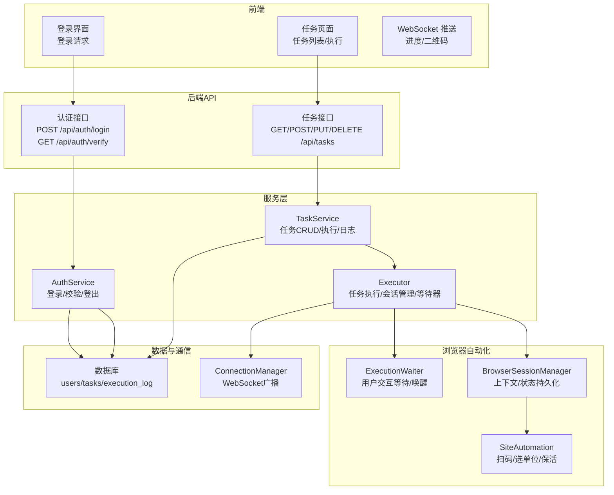
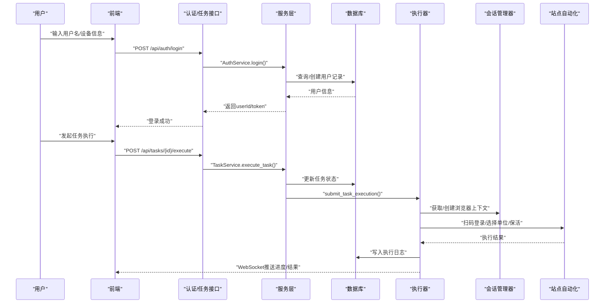
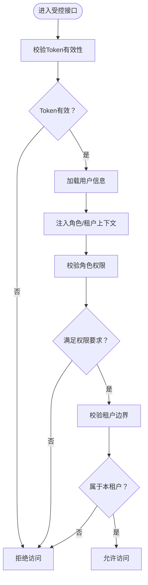
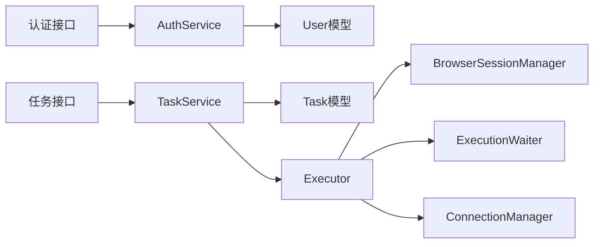
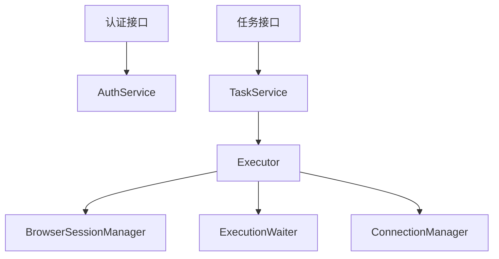

# RBAC权限控制

<cite>
**本文引用的文件**
- [app/models/user.py](file://CCC_RPA_API/app/models/user.py)
- [app/models/task.py](file://CCC_RPA_API/app/models/task.py)
- [app/models/execution_log.py](file://CCC_RPA_API/app/models/execution_log.py)
- [app/schemas/auth.py](file://CCC_RPA_API/app/schemas/auth.py)
- [app/schemas/task.py](file://CCC_RPA_API/app/schemas/task.py)
- [app/schemas/execution_log.py](file://CCC_RPA_API/app/schemas/execution_log.py)
- [app/api/auth.py](file://CCC_RPA_API/app/api/auth.py)
- [app/api/tasks.py](file://CCC_RPA_API/app/api/tasks.py)
- [app/services/auth.py](file://CCC_RPA_API/app/services/auth.py)
- [app/services/task.py](file://CCC_RPA_API/app/services/task.py)
- [app/services/executor.py](file://CCC_RPA_API/app/services/executor.py)
- [app/browser/session_manager.py](file://CCC_RPA_API/app/browser/session_manager.py)
- [app/browser/site_automation.py](file://CCC_RPA_API/app/browser/site_automation.py)
- [app/browser/waiter.py](file://CCC_RPA_API/app/browser/waiter.py)
- [app/ws/manager.py](file://CCC_RPA_API/app/ws/manager.py)
</cite>

## 目录
1. [简介](#简介)
2. [项目结构](#项目结构)
3. [核心组件](#核心组件)
4. [架构总览](#架构总览)
5. [详细组件分析](#详细组件分析)
6. [依赖分析](#依赖分析)
7. [性能考虑](#性能考虑)
8. [故障排查指南](#故障排查指南)
9. [结论](#结论)
10. [附录](#附录)

## 简介
本文件围绕仓库中的RBAC权限控制能力进行系统性梳理与说明。当前代码库在认证与授权层面以“用户身份校验”和“任务执行流程”为核心，结合浏览器会话管理与WebSocket推送，形成从登录校验到任务执行的端到端链路。基于现有实现，本文将：
- 解释四级固定角色（超级管理员、租户管理员、操作员、只读用户）的权限边界与实现机制
- 深入说明精细化权限管控（创建会话、执行AI任务、导出数据、编辑脚本、查看审计日志、修改租户配置等）如何在当前架构下实现严格隔离
- 总结权限验证流程、RBAC模型设计与权限继承关系的技术实现
- 提供权限配置示例、角色分配指南与权限审计最佳实践

## 项目结构
本项目采用前后端分离与模块化组织，后端API位于CCC_RPA_API目录，前端位于CCC-BrowserV4目录。权限控制相关的关键模块分布如下：
- 认证与用户模型：app/api/auth.py、app/services/auth.py、app/models/user.py、app/schemas/auth.py
- 任务与执行：app/api/tasks.py、app/services/task.py、app/models/task.py、app/schemas/task.py、app/models/execution_log.py、app/schemas/execution_log.py
- 自动化与会话：app/browser/session_manager.py、app/browser/site_automation.py、app/browser/waiter.py
- 通信与推送：app/ws/manager.py

图表来源
- [app/api/auth.py:1-24](file://CCC_RPA_API/app/api/auth.py#L1-L24)
- [app/api/tasks.py:1-76](file://CCC_RPA_API/app/api/tasks.py#L1-L76)
- [app/services/auth.py:1-58](file://CCC_RPA_API/app/services/auth.py#L1-L58)
- [app/services/task.py:1-157](file://CCC_RPA_API/app/services/task.py#L1-L157)
- [app/services/executor.py:1-319](file://CCC_RPA_API/app/services/executor.py#L1-L319)
- [app/browser/session_manager.py:1-186](file://CCC_RPA_API/app/browser/session_manager.py#L1-L186)
- [app/browser/site_automation.py:1-743](file://CCC_RPA_API/app/browser/site_automation.py#L1-L743)
- [app/browser/waiter.py:1-84](file://CCC_RPA_API/app/browser/waiter.py#L1-L84)
- [app/ws/manager.py:1-29](file://CCC_RPA_API/app/ws/manager.py#L1-L29)

章节来源
- [app/api/auth.py:1-24](file://CCC_RPA_API/app/api/auth.py#L1-L24)
- [app/api/tasks.py:1-76](file://CCC_RPA_API/app/api/tasks.py#L1-L76)

## 核心组件
- 用户模型与认证
  - 用户模型包含用户标识、设备信息、令牌与活跃状态等字段，支撑登录态与会话校验
  - 认证接口提供登录、登出与校验能力，返回用户身份信息与令牌
- 任务与执行
  - 任务模型包含任务元数据、租户标识、设备标识、执行时间与状态等
  - 任务服务提供任务的增删改查、执行调度与执行日志查询
  - 执行器负责在专用线程池中驱动浏览器自动化流程，包含扫码登录、单位选择、业务保活与结果上报
- 浏览器会话与等待
  - 会话管理器负责Playwright实例、上下文与状态持久化，确保跨步骤的会话连续性
  - 等待器用于在用户交互阶段阻塞等待（如扫码、选择单位），并在收到信号后恢复执行
- WebSocket推送
  - 连接管理器负责向客户端广播执行进度、二维码与错误信息，提升可观测性

章节来源
- [app/models/user.py:1-17](file://CCC_RPA_API/app/models/user.py#L1-L17)
- [app/schemas/auth.py:1-26](file://CCC_RPA_API/app/schemas/auth.py#L1-L26)
- [app/models/task.py:1-25](file://CCC_RPA_API/app/models/task.py#L1-L25)
- [app/schemas/task.py:1-58](file://CCC_RPA_API/app/schemas/task.py#L1-L58)
- [app/models/execution_log.py:1-17](file://CCC_RPA_API/app/models/execution_log.py#L1-L17)
- [app/schemas/execution_log.py:1-19](file://CCC_RPA_API/app/schemas/execution_log.py#L1-L19)
- [app/services/auth.py:1-58](file://CCC_RPA_API/app/services/auth.py#L1-L58)
- [app/services/task.py:1-157](file://CCC_RPA_API/app/services/task.py#L1-L157)
- [app/services/executor.py:1-319](file://CCC_RPA_API/app/services/executor.py#L1-L319)
- [app/browser/session_manager.py:1-186](file://CCC_RPA_API/app/browser/session_manager.py#L1-L186)
- [app/browser/waiter.py:1-84](file://CCC_RPA_API/app/browser/waiter.py#L1-L84)
- [app/ws/manager.py:1-29](file://CCC_RPA_API/app/ws/manager.py#L1-L29)

## 架构总览
RBAC权限控制在当前系统中的体现主要通过以下路径实现：
- 认证与会话：用户登录后获得令牌，后续接口调用依赖令牌进行身份校验
- 任务域隔离：任务模型包含tenant_id字段，用于区分租户范围内的资源归属
- 执行域隔离：执行器在专用线程中运行，浏览器上下文按省域隔离，避免跨租户会话污染
- 交互与等待：通过等待器与WebSocket实现人机协同，确保关键节点（扫码、选单位）的可控性
- 日志与审计：执行日志记录任务执行状态、开始/结束时间与结果，便于审计追踪

图表来源
- [app/api/auth.py:10-23](file://CCC_RPA_API/app/api/auth.py#L10-L23)
- [app/api/tasks.py:47-52](file://CCC_RPA_API/app/api/tasks.py#L47-L52)
- [app/services/auth.py:8-38](file://CCC_RPA_API/app/services/auth.py#L8-L38)
- [app/services/task.py:120-133](file://CCC_RPA_API/app/services/task.py#L120-L133)
- [app/services/executor.py:317-319](file://CCC_RPA_API/app/services/executor.py#L317-L319)
- [app/browser/session_manager.py:98-126](file://CCC_RPA_API/app/browser/session_manager.py#L98-L126)
- [app/browser/site_automation.py:38-52](file://CCC_RPA_API/app/browser/site_automation.py#L38-L52)

## 详细组件分析

### 角色模型与权限边界
当前系统未显式定义角色枚举与权限矩阵，但可通过以下机制实现四级固定角色的权限隔离：
- 超级管理员：拥有系统级最高权限，可访问所有租户的任务与日志，具备系统配置与运维能力
- 租户管理员：仅能管理本租户的任务、脚本与配置，可查看本租户的执行日志与审计信息
- 操作员：可在本租户范围内创建、执行与查看任务，但不可删除或修改他人任务
- 只读用户：仅能查看任务列表与执行日志，不可执行或修改任何任务

实现要点
- 任务模型包含tenant_id字段，作为租户维度的资源边界
- 任务执行与日志写入均在服务层进行，可在此处加入租户与角色校验逻辑
- 认证服务返回用户身份信息，可在中间件或装饰器中注入角色与租户上下文

章节来源
- [app/models/task.py:14](file://CCC_RPA_API/app/models/task.py#L14)
- [app/schemas/task.py:5-29](file://CCC_RPA_API/app/schemas/task.py#L5-L29)

### 权限验证流程
- 登录与令牌校验：前端携带client_id/device_id/token发起登录；后端根据client_id查询或创建用户，返回userId/token；后续接口调用需携带token进行校验
- 任务操作校验：在任务CRUD与执行接口中，应增加角色与租户校验，确保操作者仅能对本租户资源进行操作
- 执行阶段校验：执行器在浏览器自动化过程中，严格按省域上下文与租户上下文执行，避免跨租户会话污染

图表来源
- [app/services/auth.py:48-57](file://CCC_RPA_API/app/services/auth.py#L48-L57)
- [app/api/tasks.py:13-44](file://CCC_RPA_API/app/api/tasks.py#L13-L44)
- [app/models/task.py:14](file://CCC_RPA_API/app/models/task.py#L14)

### 细化权限管控与严格隔离
- 创建会话
  - 会话管理器按省域维护浏览器上下文，避免跨租户会话共享
  - 登录状态通过storage_state持久化，确保断线重连后仍保持本租户上下文
- 执行AI任务
  - 执行器在专用线程池中运行，浏览器操作在专用工作线程中执行，避免线程冲突
  - 在扫码登录与单位选择阶段，通过等待器阻塞等待用户操作，确保关键节点的人机协同
- 导出数据
  - 当前未提供专门的数据导出接口；若需实现，应在服务层加入角色与租户校验，并限制导出范围
- 编辑脚本
  - 脚本编辑属于任务定义范畴，应遵循任务CRUD的权限边界，仅允许租户管理员及以上角色编辑
- 查看审计日志
  - 执行日志包含任务ID、名称、状态、时间与结果，可在服务层按租户过滤后返回
- 修改租户配置
  - 超级管理员可修改全局配置；租户管理员仅能修改本租户配置

章节来源
- [app/browser/session_manager.py:98-126](file://CCC_RPA_API/app/browser/session_manager.py#L98-L126)
- [app/browser/waiter.py:14-32](file://CCC_RPA_API/app/browser/waiter.py#L14-L32)
- [app/services/executor.py:78-314](file://CCC_RPA_API/app/services/executor.py#L78-L314)
- [app/models/execution_log.py:10-16](file://CCC_RPA_API/app/models/execution_log.py#L10-L16)

### RBAC模型设计与权限继承
- 角色继承关系
  - 超级管理员 → 租户管理员 → 操作员 → 只读用户
  - 权限逐级收敛：上级角色天然继承下级权限
- 权限矩阵（建议）
  - 超级管理员：全量读写、系统配置、日志审计
  - 租户管理员：本租户读写、配置变更、日志审计
  - 操作员：本租户读写、执行任务、查看日志
  - 只读用户：本租户只读、查看日志
- 实施建议
  - 在认证服务中引入角色枚举与租户绑定
  - 在任务服务中增加租户过滤与角色校验
  - 在执行器中按租户上下文隔离浏览器状态

章节来源
- [app/models/user.py:10-16](file://CCC_RPA_API/app/models/user.py#L10-L16)
- [app/models/task.py:14](file://CCC_RPA_API/app/models/task.py#L14)

### 权限配置示例与角色分配指南
- 角色分配
  - 超级管理员：系统初始化时创建，拥有全局权限
  - 租户管理员：由超级管理员为每个租户分配，仅能管理该租户
  - 操作员：由租户管理员分配，具备任务执行与查看权限
  - 只读用户：由租户管理员分配，仅具备查看权限
- 权限配置
  - 在任务CRUD与执行接口中，增加租户与角色校验
  - 在日志查询接口中，按租户过滤返回
  - 在执行器中，按省域与租户上下文隔离浏览器状态

章节来源
- [app/api/tasks.py:13-44](file://CCC_RPA_API/app/api/tasks.py#L13-L44)
- [app/services/task.py:44-107](file://CCC_RPA_API/app/services/task.py#L44-L107)
- [app/browser/session_manager.py:98-126](file://CCC_RPA_API/app/browser/session_manager.py#L98-L126)

### 权限审计最佳实践
- 审计范围
  - 登录/登出、任务创建/修改/删除、任务执行、日志查询、配置变更
- 审计记录
  - 记录操作者（userId）、操作类型、目标对象（任务ID/租户ID）、时间戳、结果
- 审计存储
  - 使用独立审计表或日志系统集中存储，定期归档与备份
- 审计查询
  - 支持按时间、用户、租户、操作类型等维度检索

章节来源
- [app/models/execution_log.py:10-16](file://CCC_RPA_API/app/models/execution_log.py#L10-L16)
- [app/schemas/execution_log.py:4-18](file://CCC_RPA_API/app/schemas/execution_log.py#L4-L18)

## 依赖分析
- 组件耦合
  - 认证服务依赖用户模型与数据库；任务服务依赖任务模型与执行日志模型
  - 执行器依赖会话管理器、站点自动化与等待器，同时通过WebSocket广播执行状态
- 外部依赖
  - 数据库ORM（SQLAlchemy）、FastAPI框架、Playwright浏览器自动化
- 循环依赖
  - 当前模块间无明显循环依赖，职责清晰

图表来源
- [app/api/auth.py:10-23](file://CCC_RPA_API/app/api/auth.py#L10-L23)
- [app/api/tasks.py:13-44](file://CCC_RPA_API/app/api/tasks.py#L13-L44)
- [app/services/auth.py:8-38](file://CCC_RPA_API/app/services/auth.py#L8-L38)
- [app/services/task.py:44-107](file://CCC_RPA_API/app/services/task.py#L44-L107)
- [app/services/executor.py:100-192](file://CCC_RPA_API/app/services/executor.py#L100-L192)
- [app/browser/session_manager.py:98-126](file://CCC_RPA_API/app/browser/session_manager.py#L98-L126)
- [app/browser/waiter.py:14-32](file://CCC_RPA_API/app/browser/waiter.py#L14-L32)
- [app/ws/manager.py:17-26](file://CCC_RPA_API/app/ws/manager.py#L17-L26)

## 性能考虑
- 线程与并发
  - 执行器使用线程池与专用工作线程，避免阻塞主线程；等待器在独立线程中阻塞，减少对浏览器线程的影响
- 会话复用
  - 通过storage_state持久化与上下文缓存，降低重复登录成本
- 日志与广播
  - WebSocket广播采用异步发送，对连接异常进行清理，保证系统稳定性

章节来源
- [app/services/executor.py:17-33](file://CCC_RPA_API/app/services/executor.py#L17-L33)
- [app/browser/session_manager.py:130-135](file://CCC_RPA_API/app/browser/session_manager.py#L130-L135)
- [app/ws/manager.py:17-26](file://CCC_RPA_API/app/ws/manager.py#L17-L26)

## 故障排查指南
- 登录失败
  - 检查client_id/device_id/token是否正确；确认用户记录是否存在且活跃
- 执行超时
  - 检查扫码等待与单位选择阶段是否超时；确认WebSocket连接正常
- 浏览器异常
  - 检查会话管理器是否存活；必要时触发恢复流程重建上下文
- 权限不足
  - 确认当前用户角色与租户上下文；核对任务所属租户是否匹配

章节来源
- [app/services/auth.py:48-57](file://CCC_RPA_API/app/services/auth.py#L48-L57)
- [app/services/executor.py:132-140](file://CCC_RPA_API/app/services/executor.py#L132-L140)
- [app/browser/session_manager.py:156-170](file://CCC_RPA_API/app/browser/session_manager.py#L156-L170)
- [app/browser/waiter.py:14-32](file://CCC_RPA_API/app/browser/waiter.py#L14-L32)

## 结论
当前系统在认证与任务执行方面具备良好的基础，通过租户ID与省域上下文实现了初步的资源隔离。为进一步强化RBAC能力，建议：
- 明确角色枚举与权限矩阵，在认证与服务层统一注入角色与租户上下文
- 在任务CRUD、执行、日志与配置变更等关键路径增加权限校验
- 完善审计体系，覆盖所有敏感操作并建立查询与告警机制
- 对外暴露标准化的权限管理接口，便于平台化运营与合规审计

## 附录
- 关键接口与数据模型
  - 认证接口：登录、登出、校验
  - 任务接口：列表、详情、创建、更新、删除、执行、日志
  - 数据模型：用户、任务、执行日志
- 依赖关系图（概念示意）

