# 商用完整能力

<cite>
**本文档引用的文件**
- [main.py](file://CCC_RPA_API/app/main.py)
- [config.py](file://CCC_RPA_API/app/config.py)
- [database.py](file://CCC_RPA_API/app/database.py)
- [base.py](file://CCC_RPA_API/app/models/base.py)
- [user.py](file://CCC_RPA_API/app/models/user.py)
- [task.py](file://CCC_RPA_API/app/models/task.py)
- [execution_log.py](file://CCC_RPA_API/app/models/execution_log.py)
- [auth.py](file://CCC_RPA_API/app/api/auth.py)
- [tasks.py](file://CCC_RPA_API/app/api/tasks.py)
- [auth.py](file://CCC_RPA_API/app/services/auth.py)
- [task.py](file://CCC_RPA_API/app/services/task.py)
- [session_manager.py](file://CCC_RPA_API/app/browser/session_manager.py)
- [manager.py](file://CCC_RPA_API/app/ws/manager.py)
- [auth.py](file://CCC_RPA_API/app/schemas/auth.py)
- [task.py](file://CCC_RPA_API/app/schemas/task.py)
</cite>

## 目录
1. [引言](#引言)
2. [项目结构](#项目结构)
3. [核心组件](#核心组件)
4. [架构总览](#架构总览)
5. [详细组件分析](#详细组件分析)
6. [依赖分析](#依赖分析)
7. [性能考虑](#性能考虑)
8. [故障排查指南](#故障排查指南)
9. [结论](#结论)
10. [附录](#附录)

## 引言
本文件面向商用部署场景，系统性梳理并阐述本RPA平台在多租户隔离、四级RBAC权限、会话并发配额、计费统计、全链路操作审计、数据加密存储、集群监控告警、故障自愈等“商用级”能力上的实现现状与扩展建议。文档以代码为依据，结合架构图与流程图，帮助技术与运维团队快速理解系统设计、落地要点与最佳实践。

## 项目结构
后端采用FastAPI + SQLAlchemy + MySQL架构，前端为Tauri + Vue组合；数据库层通过统一配置与连接池管理，业务层围绕任务编排、浏览器自动化、WebSocket推送与认证鉴权展开。整体呈现清晰的分层与职责边界，便于后续扩展多租户与权限体系。

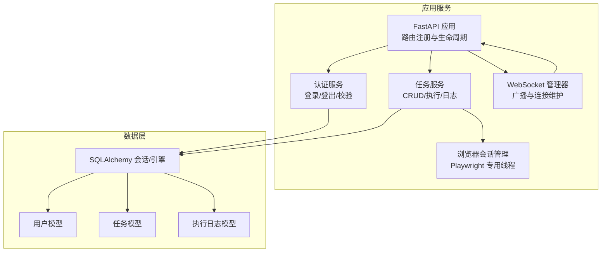

图表来源
- [main.py:12-27](file://CCC_RPA_API/app/main.py#L12-L27)
- [manager.py:1-29](file://CCC_RPA_API/app/ws/manager.py#L1-L29)
- [auth.py:1-24](file://CCC_RPA_API/app/api/auth.py#L1-L24)
- [tasks.py:1-76](file://CCC_RPA_API/app/api/tasks.py#L1-L76)
- [session_manager.py:1-186](file://CCC_RPA_API/app/browser/session_manager.py#L1-L186)
- [database.py:1-19](file://CCC_RPA_API/app/database.py#L1-L19)
- [user.py:1-17](file://CCC_RPA_API/app/models/user.py#L1-L17)
- [task.py:1-25](file://CCC_RPA_API/app/models/task.py#L1-L25)
- [execution_log.py:1-17](file://CCC_RPA_API/app/models/execution_log.py#L1-L17)

章节来源
- [main.py:12-27](file://CCC_RPA_API/app/main.py#L12-L27)
- [config.py:1-22](file://CCC_RPA_API/app/config.py#L1-L22)
- [database.py:1-19](file://CCC_RPA_API/app/database.py#L1-L19)

## 核心组件
- 认证与会话管理：基于客户端ID/设备ID/令牌的轻量认证，支持登录、登出与有效性校验，并在数据库中记录活跃状态。
- 任务编排与执行：提供任务的增删改查、执行触发、日志查询与交互式等待（扫码完成、选择公司、取消执行）。
- 浏览器自动化：通过专用线程运行Playwright，按省域隔离上下文，持久化storage_state，支持恢复与关闭。
- 实时通信：WebSocket连接管理器负责广播消息，便于前端实时接收执行状态与通知。
- 数据模型：统一的BaseModel提供时间戳字段，用户、任务、执行日志三类核心实体支撑业务闭环。

章节来源
- [auth.py:1-58](file://CCC_RPA_API/app/services/auth.py#L1-L58)
- [task.py:1-157](file://CCC_RPA_API/app/services/task.py#L1-L157)
- [session_manager.py:1-186](file://CCC_RPA_API/app/browser/session_manager.py#L1-L186)
- [manager.py:1-29](file://CCC_RPA_API/app/ws/manager.py#L1-L29)
- [base.py:1-11](file://CCC_RPA_API/app/models/base.py#L1-L11)
- [user.py:1-17](file://CCC_RPA_API/app/models/user.py#L1-L17)
- [task.py:1-25](file://CCC_RPA_API/app/models/task.py#L1-L25)
- [execution_log.py:1-17](file://CCC_RPA_API/app/models/execution_log.py#L1-L17)

## 架构总览
下图展示商用级能力在系统中的位置与交互关系：认证与授权作为入口，任务与日志承载业务闭环，浏览器自动化与WebSocket提供执行与通知能力，数据库层提供持久化与审计基础。

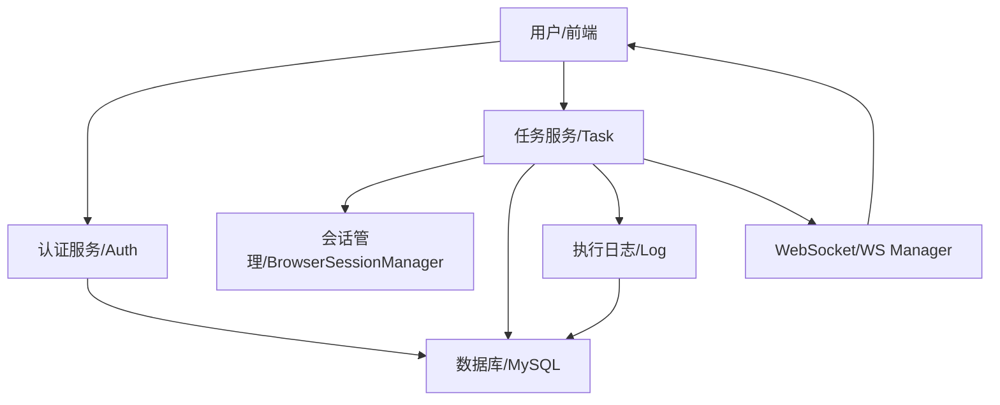

图表来源
- [auth.py:1-58](file://CCC_RPA_API/app/services/auth.py#L1-L58)
- [task.py:1-157](file://CCC_RPA_API/app/services/task.py#L1-L157)
- [session_manager.py:1-186](file://CCC_RPA_API/app/browser/session_manager.py#L1-L186)
- [manager.py:1-29](file://CCC_RPA_API/app/ws/manager.py#L1-L29)
- [execution_log.py:1-17](file://CCC_RPA_API/app/models/execution_log.py#L1-L17)

## 详细组件分析

### 多租户隔离与租户数据强隔离
- 设计要点
  - 在任务模型中引入租户标识字段，用于区分不同租户的数据边界。
  - 后续可在认证/任务服务中增加租户维度的过滤与校验逻辑，确保跨租户数据不可见。
- 当前实现状态
  - 数据模型具备tenant_id字段，但业务层未强制加入租户上下文的读写约束。
- 建议增强
  - 在认证服务返回的用户上下文中携带租户信息；在任务CRUD与日志查询接口中默认按tenant_id过滤。
  - 对外暴露的路由层增加租户维度的鉴权中间件，防止越权访问。
  - 对敏感字段（如客户名称、处理人账号）进行脱敏展示策略。

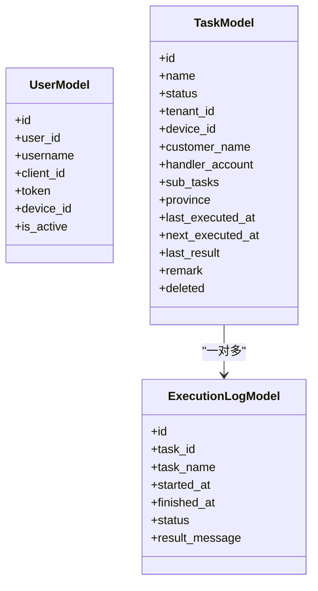

图表来源
- [user.py:1-17](file://CCC_RPA_API/app/models/user.py#L1-L17)
- [task.py:1-25](file://CCC_RPA_API/app/models/task.py#L1-L25)
- [execution_log.py:1-17](file://CCC_RPA_API/app/models/execution_log.py#L1-L17)

章节来源
- [task.py:14-24](file://CCC_RPA_API/app/models/task.py#L14-L24)
- [tasks.py:13-15](file://CCC_RPA_API/app/api/tasks.py#L13-L15)

### 四级RBAC权限（超级管理员、租户管理员、操作员、只读用户）
- 设计要点
  - 用户模型包含用户标识与活跃状态，可扩展角色字段与租户绑定关系。
  - 路由层按角色划分访问范围，关键操作（新增/修改/删除/执行）与只读页面分离。
- 当前实现状态
  - 未在代码中体现角色字段与权限判定逻辑。
- 建议增强
  - 在用户模型中增加role字段与租户绑定；在路由装饰器或中间件中注入权限校验。
  - 将任务执行、日志导出、设备管理等高风险操作限定为管理员及以上角色。
  - 为每个受控接口提供细粒度的权限矩阵与审计追踪。

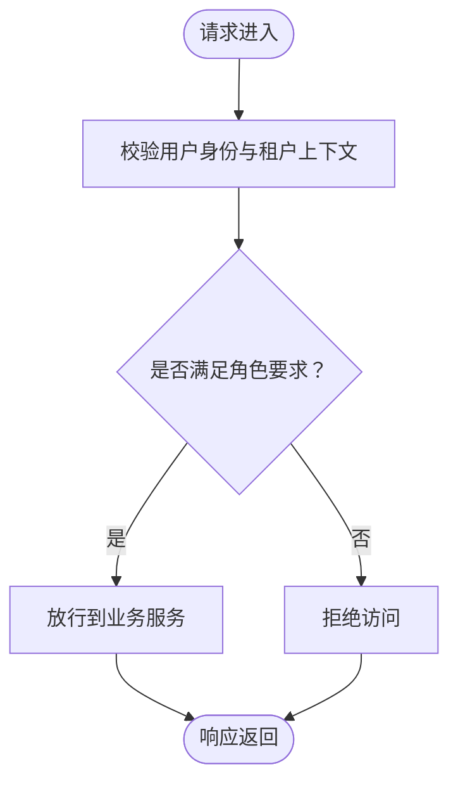

（该图为概念性流程示意，不对应具体源码）

### 会话并发配额管理
- 设计要点
  - 通过浏览器会话管理器按省域隔离上下文，避免跨租户/跨区域干扰。
  - 可在会话管理器中引入并发上限与排队策略，限制同时执行的任务数量。
- 当前实现状态
  - 会话管理器提供按省域上下文与storage_state持久化能力，未见显式的并发配额控制。
- 建议增强
  - 在会话管理器中增加任务队列与并发计数器，超过阈值则阻塞或拒绝。
  - 结合WebSocket向前端反馈排队状态与预计等待时间。

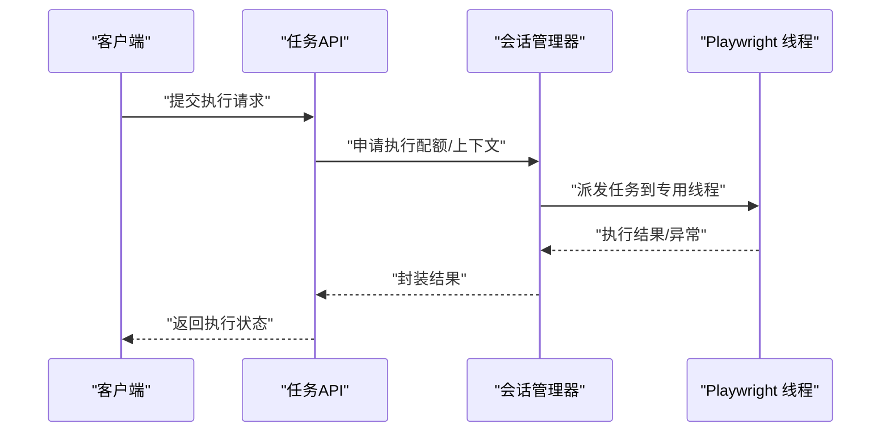

图表来源
- [tasks.py:47-52](file://CCC_RPA_API/app/api/tasks.py#L47-L52)
- [session_manager.py:80-96](file://CCC_RPA_API/app/browser/session_manager.py#L80-L96)

章节来源
- [session_manager.py:1-186](file://CCC_RPA_API/app/browser/session_manager.py#L1-L186)

### 计费统计模块
- 设计要点
  - 以任务执行日志为基础，统计执行次数、耗时、成功率等指标。
  - 可按租户/设备/任务类型聚合，形成计费依据。
- 当前实现状态
  - 执行日志模型存在，但未见专门的计费统计服务或报表接口。
- 建议增强
  - 新增计费统计服务，提供聚合查询与导出能力。
  - 在任务执行完成后写入计费明细，支持按天/月/年汇总。

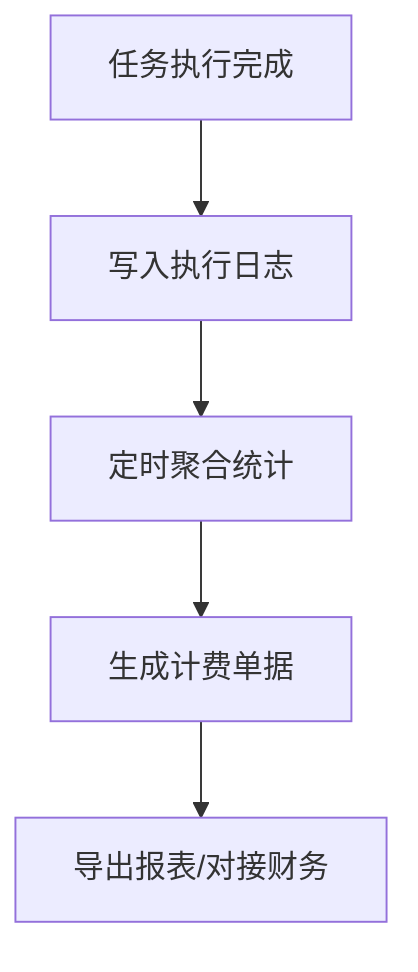

（该图为概念性流程示意，不对应具体源码）

### 全链路操作审计
- 设计要点
  - 审计日志应覆盖关键操作（登录、登出、任务创建/更新/删除/执行、日志查询等），记录操作者、时间、IP、对象、结果。
  - 日志需可检索、可归档、可报警。
- 当前实现状态
  - 未见独立的审计服务与审计表。
- 建议增强
  - 新建审计日志模型与服务，拦截关键路由写入审计。
  - 提供审计查询接口，支持按用户、时间、操作类型筛选。

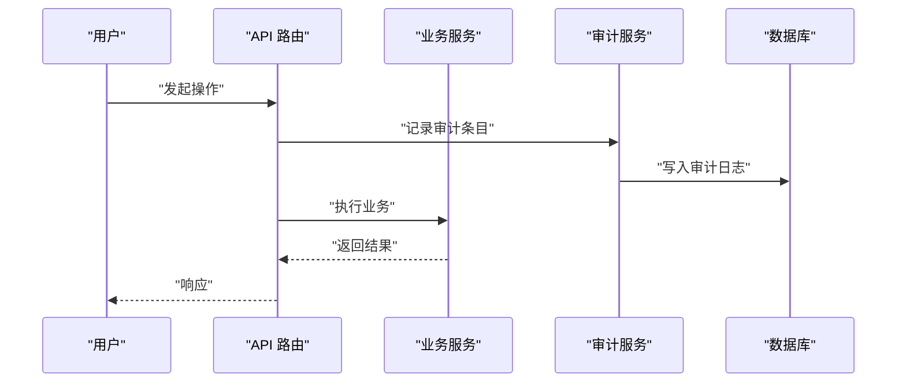

（该图为概念性流程示意，不对应具体源码）

### 数据加密存储
- 设计要点
  - 敏感字段（如令牌、日志内容）建议采用对称加密（例如AES-256-CBC）。
  - 密钥管理遵循最小权限原则，密钥轮换与备份策略明确。
- 当前实现状态
  - 未见加密存储实现。
- 建议增强
  - 在数据入库前对敏感字段进行加密，出库时解密。
  - 使用安全的密钥存储方案（如KMS或环境变量），避免硬编码。

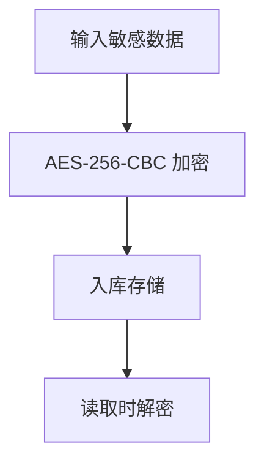

（该图为概念性流程示意，不对应具体源码）

### 集群监控告警（Prometheus+Grafana+ELK）
- 设计要点
  - 指标采集：CPU、内存、连接数、任务执行QPS/错误率、数据库延迟、WebSocket连接数。
  - 可视化：Grafana仪表板展示趋势与异常。
  - 日志：ELK收集应用日志、错误栈、慢查询与审计事件。
  - 告警：阈值告警、趋势告警、SLA不达标自动升级。
- 当前实现状态
  - 未见监控与日志集成代码。
- 建议增强
  - 在FastAPI中接入指标中间件，导出Prometheus指标。
  - 统一日志格式与标签，接入ELK；为关键路径埋点。
  - 配置告警规则与通知渠道（邮件/IM）。

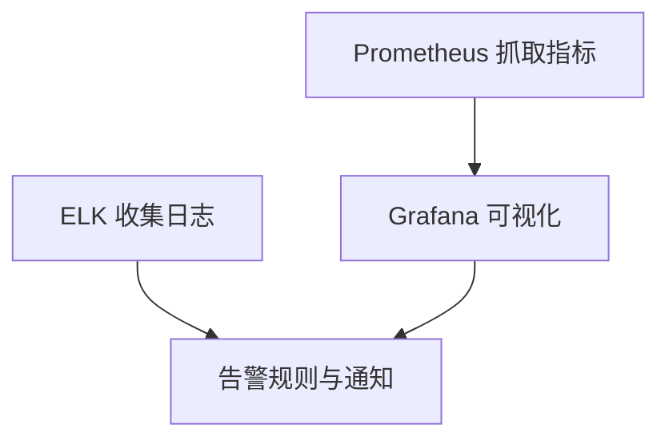

（该图为概念性架构示意，不对应具体源码）

### 故障自愈
- 设计要点
  - 自动重启：进程崩溃或连接断开后自动拉起。
  - 会话恢复：浏览器会话异常时清理并重建上下文。
  - 资源回收：超时/异常任务释放占用资源。
- 当前实现状态
  - 会话管理器提供恢复与关闭能力，但未见自动重启与资源回收的完整闭环。
- 建议增强
  - 在应用生命周期钩子中增加健康检查与自愈策略。
  - 对长时间无响应的任务进行超时中断与重试控制。

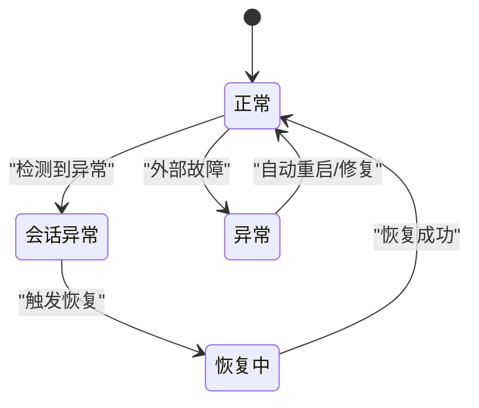

（该图为概念性状态示意，不对应具体源码）

## 依赖分析
- 组件耦合
  - API层仅依赖服务层与数据库会话工厂，保持低耦合。
  - 服务层依赖模型与工具函数，职责单一。
  - 会话管理器与浏览器自动化强耦合，但通过专用线程隔离了并发风险。
- 外部依赖
  - FastAPI、SQLAlchemy、Pydantic、Playwright、MySQL驱动等。

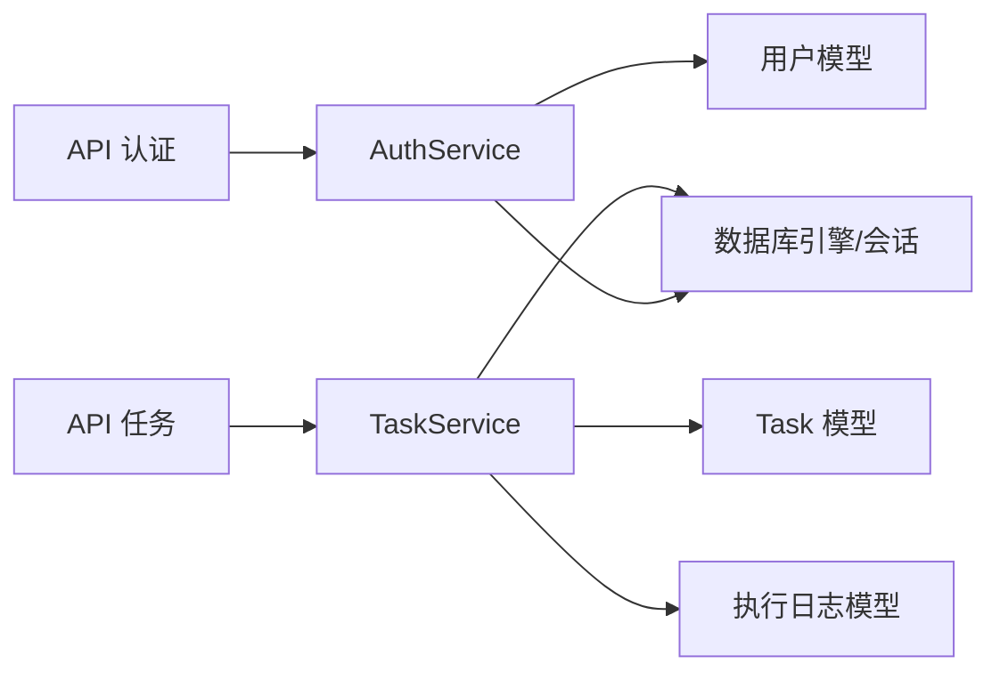

图表来源
- [auth.py:1-24](file://CCC_RPA_API/app/api/auth.py#L1-L24)
- [tasks.py:1-76](file://CCC_RPA_API/app/api/tasks.py#L1-L76)
- [auth.py:1-58](file://CCC_RPA_API/app/services/auth.py#L1-L58)
- [task.py:1-157](file://CCC_RPA_API/app/services/task.py#L1-L157)
- [user.py:1-17](file://CCC_RPA_API/app/models/user.py#L1-L17)
- [task.py:1-25](file://CCC_RPA_API/app/models/task.py#L1-L25)
- [execution_log.py:1-17](file://CCC_RPA_API/app/models/execution_log.py#L1-L17)
- [database.py:1-19](file://CCC_RPA_API/app/database.py#L1-L19)

章节来源
- [main.py:30-87](file://CCC_RPA_API/app/main.py#L30-L87)
- [database.py:1-19](file://CCC_RPA_API/app/database.py#L1-L19)

## 性能考虑
- 数据库
  - 使用连接池与预检，合理设置回收时间；为高频查询字段建立索引（如任务名、状态、租户ID）。
- 任务执行
  - 通过专用线程执行浏览器操作，避免阻塞事件循环；对长任务设置超时与断点续传。
- WebSocket
  - 广播时处理异常连接并清理，避免广播风暴。
- 缓存与限流
  - 对热点查询结果进行缓存；对外接口增加速率限制与配额控制。

（本节为通用指导，不涉及具体源码分析）

## 故障排查指南
- 认证问题
  - 登录后无法验证：检查用户模型字段与服务端校验逻辑，确认token与设备ID是否正确更新。
- 任务执行异常
  - 执行状态未更新：检查任务状态变更与异步提交逻辑；查看会话管理器是否初始化成功。
- 浏览器会话异常
  - 页面加载失败或被识别：检查会话恢复流程与上下文参数；确认headless与UA设置。
- WebSocket断连
  - 广播失败：检查连接管理器的异常处理与死连接清理。

章节来源
- [auth.py:48-57](file://CCC_RPA_API/app/services/auth.py#L48-L57)
- [task.py:120-133](file://CCC_RPA_API/app/services/task.py#L120-L133)
- [session_manager.py:157-170](file://CCC_RPA_API/app/browser/session_manager.py#L157-L170)
- [manager.py:17-26](file://CCC_RPA_API/app/ws/manager.py#L17-L26)

## 结论
本系统在任务编排、浏览器自动化与实时通信方面具备良好基础，能够支撑商用级RPA平台的核心能力。针对多租户隔离、四级RBAC、会话并发配额、计费统计、全链路审计、数据加密、监控告警与故障自愈等“商用级”能力，建议在现有代码基础上逐步引入租户上下文、角色权限、并发控制、审计服务、加密存储与监控体系，以满足合规性、安全性与可运维性要求。

## 附录
- 商用部署合规建议
  - 数据最小化与去标识化；敏感字段加密存储；审计日志保留期限符合法规。
  - 权限最小化与职责分离；定期权限复核与审计报告。
  - 备份与灾难恢复演练；SLA与可用性指标可视化。
- 性能调优清单
  - 数据库索引优化、连接池参数调优、任务批量化与去抖。
  - 浏览器上下文复用与storage_state持久化；WebSocket心跳与断线重连。
- 运维管理最佳实践
  - 分环境配置与密钥管理；CI/CD流水线中的安全扫描；灰度发布与回滚策略。