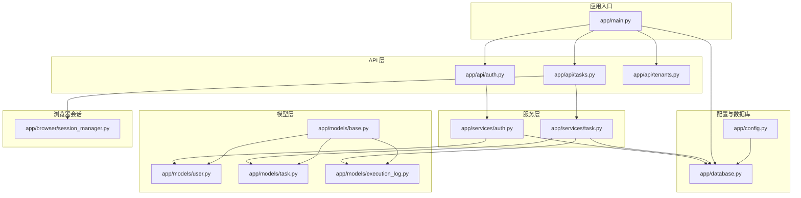
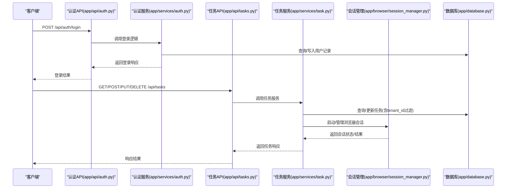
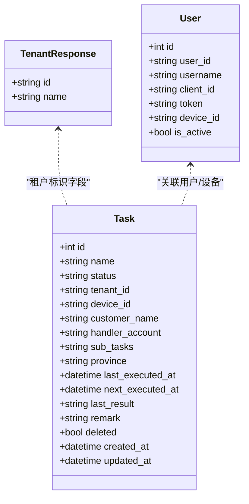
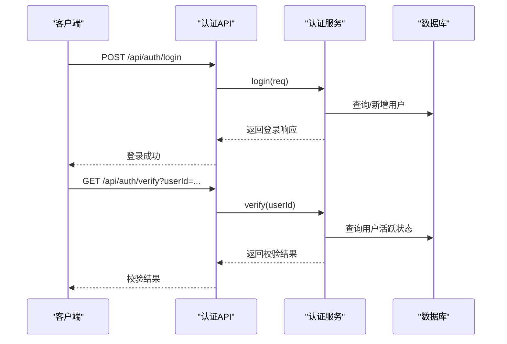
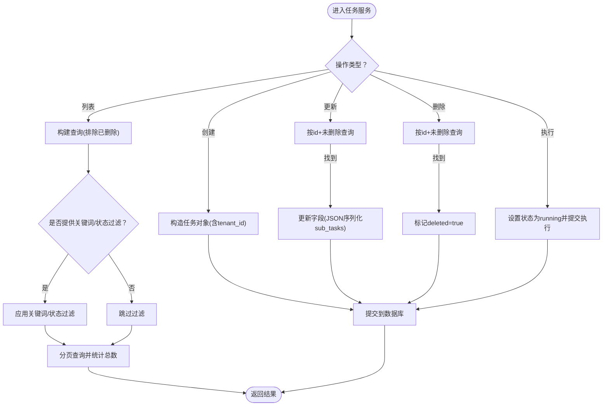
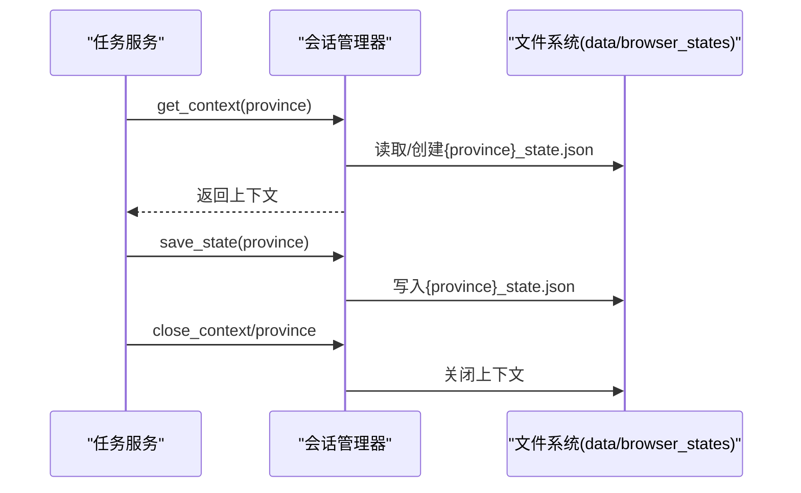
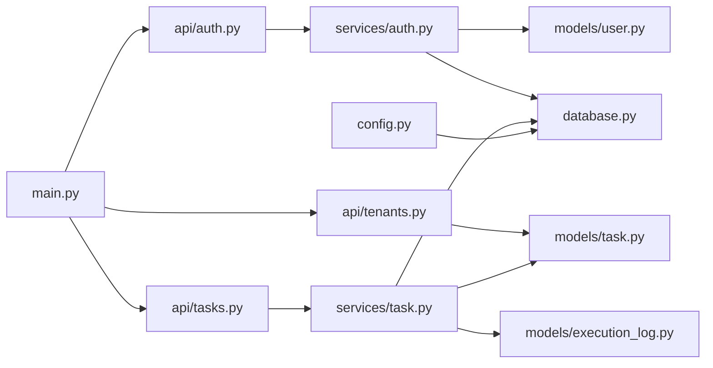

# 多租户管理

<cite>
**本文档引用的文件**
- [app/main.py](file://CCC_RPA_API/app/main.py)
- [app/config.py](file://CCC_RPA_API/app/config.py)
- [app/database.py](file://CCC_RPA_API/app/database.py)
- [app/models/base.py](file://CCC_RPA_API/app/models/base.py)
- [app/models/user.py](file://CCC_RPA_API/app/models/user.py)
- [app/models/task.py](file://CCC_RPA_API/app/models/task.py)
- [app/models/execution_log.py](file://CCC_RPA_API/app/models/execution_log.py)
- [app/api/auth.py](file://CCC_RPA_API/app/api/auth.py)
- [app/api/tasks.py](file://CCC_RPA_API/app/api/tasks.py)
- [app/api/tenants.py](file://CCC_RPA_API/app/api/tenants.py)
- [app/services/auth.py](file://CCC_RPA_API/app/services/auth.py)
- [app/services/task.py](file://CCC_RPA_API/app/services/task.py)
- [app/browser/session_manager.py](file://CCC_RPA_API/app/browser/session_manager.py)
</cite>

## 目录
1. [简介](#简介)
2. [项目结构](#项目结构)
3. [核心组件](#核心组件)
4. [架构总览](#架构总览)
5. [详细组件分析](#详细组件分析)
6. [依赖分析](#依赖分析)
7. [性能考虑](#性能考虑)
8. [故障排查指南](#故障排查指南)
9. [结论](#结论)
10. [附录](#附录)

## 简介
本文件面向多租户管理功能，围绕租户的完整 CRUD 操作（创建、启用/禁用、配置租户独立会话并发配额）进行系统化说明；深入解释租户数据物理隔离的设计理念与实现要点，确保“仅能查询/操作自身创建”的会话、任务、快照、脚本；并给出多租户配置示例、API 接口说明与安全最佳实践。当前仓库中租户列表接口为占位实现，后续需替换为真实数据库查询与鉴权控制。

## 项目结构
后端基于 FastAPI + SQLAlchemy 构建，数据库连接通过配置类集中管理，模型层统一继承抽象基类以获得通用时间戳字段。任务、用户、执行日志等模型均具备租户标识字段，便于后续扩展多租户隔离策略。

图示来源
- [app/main.py:1-127](file://CCC_RPA_API/app/main.py#L1-L127)
- [app/config.py:1-22](file://CCC_RPA_API/app/config.py#L1-L22)
- [app/database.py:1-19](file://CCC_RPA_API/app/database.py#L1-L19)
- [app/models/base.py:1-11](file://CCC_RPA_API/app/models/base.py#L1-L11)
- [app/models/user.py:1-17](file://CCC_RPA_API/app/models/user.py#L1-L17)
- [app/models/task.py:1-25](file://CCC_RPA_API/app/models/task.py#L1-L25)
- [app/models/execution_log.py:1-17](file://CCC_RPA_API/app/models/execution_log.py#L1-L17)
- [app/api/auth.py:1-24](file://CCC_RPA_API/app/api/auth.py#L1-L24)
- [app/api/tasks.py:1-76](file://CCC_RPA_API/app/api/tasks.py#L1-L76)
- [app/api/tenants.py:1-25](file://CCC_RPA_API/app/api/tenants.py#L1-L25)
- [app/services/auth.py:1-58](file://CCC_RPA_API/app/services/auth.py#L1-L58)
- [app/services/task.py:1-157](file://CCC_RPA_API/app/services/task.py#L1-L157)
- [app/browser/session_manager.py:1-186](file://CCC_RPA_API/app/browser/session_manager.py#L1-L186)

章节来源
- [app/main.py:1-127](file://CCC_RPA_API/app/main.py#L1-L127)
- [app/config.py:1-22](file://CCC_RPA_API/app/config.py#L1-L22)
- [app/database.py:1-19](file://CCC_RPA_API/app/database.py#L1-L19)

## 核心组件
- 应用入口与路由注册：负责启动事件、数据库初始化、WebSocket 连接与路由挂载。
- 配置与数据库：集中管理数据库连接参数与会话工厂。
- 模型层：统一时间戳基类，用户、任务、执行日志模型，其中任务模型包含租户标识字段。
- API 层：认证、任务、租户管理接口。
- 服务层：业务逻辑封装，如登录、任务增删改查、执行调度。
- 浏览器会话管理：Playwright 会话生命周期管理与状态持久化。

章节来源
- [app/main.py:1-127](file://CCC_RPA_API/app/main.py#L1-L127)
- [app/models/base.py:1-11](file://CCC_RPA_API/app/models/base.py#L1-L11)
- [app/models/user.py:1-17](file://CCC_RPA_API/app/models/user.py#L1-L17)
- [app/models/task.py:1-25](file://CCC_RPA_API/app/models/task.py#L1-L25)
- [app/models/execution_log.py:1-17](file://CCC_RPA_API/app/models/execution_log.py#L1-L17)
- [app/api/auth.py:1-24](file://CCC_RPA_API/app/api/auth.py#L1-L24)
- [app/api/tasks.py:1-76](file://CCC_RPA_API/app/api/tasks.py#L1-L76)
- [app/api/tenants.py:1-25](file://CCC_RPA_API/app/api/tenants.py#L1-L25)
- [app/services/auth.py:1-58](file://CCC_RPA_API/app/services/auth.py#L1-L58)
- [app/services/task.py:1-157](file://CCC_RPA_API/app/services/task.py#L1-L157)
- [app/browser/session_manager.py:1-186](file://CCC_RPA_API/app/browser/session_manager.py#L1-L186)

## 架构总览
下图展示多租户相关的关键交互路径：客户端通过认证接口获取令牌，随后在任务与租户管理接口中携带租户上下文；服务层在执行任务时调用浏览器会话管理器；数据库层通过统一的 SessionLocal 提供事务能力。

图示来源
- [app/api/auth.py:1-24](file://CCC_RPA_API/app/api/auth.py#L1-L24)
- [app/services/auth.py:1-58](file://CCC_RPA_API/app/services/auth.py#L1-L58)
- [app/api/tasks.py:1-76](file://CCC_RPA_API/app/api/tasks.py#L1-L76)
- [app/services/task.py:1-157](file://CCC_RPA_API/app/services/task.py#L1-L157)
- [app/browser/session_manager.py:1-186](file://CCC_RPA_API/app/browser/session_manager.py#L1-L186)
- [app/database.py:1-19](file://CCC_RPA_API/app/database.py#L1-L19)

## 详细组件分析

### 租户管理接口与数据模型
- 当前租户列表接口为占位实现，返回固定 MOCK 数据，尚未接入数据库查询与鉴权。
- 任务模型包含租户标识字段，便于后续在查询/更新/删除时加入租户过滤条件。
- 用户模型用于认证与设备绑定，为租户上下文提供基础。

图示来源
- [app/api/tenants.py:1-25](file://CCC_RPA_API/app/api/tenants.py#L1-L25)
- [app/models/task.py:1-25](file://CCC_RPA_API/app/models/task.py#L1-L25)
- [app/models/user.py:1-17](file://CCC_RPA_API/app/models/user.py#L1-L17)

章节来源
- [app/api/tenants.py:1-25](file://CCC_RPA_API/app/api/tenants.py#L1-L25)
- [app/models/task.py:1-25](file://CCC_RPA_API/app/models/task.py#L1-L25)
- [app/models/user.py:1-17](file://CCC_RPA_API/app/models/user.py#L1-L17)

### 认证与会话管理
- 认证服务支持登录、登出、校验，维护用户活跃状态与设备绑定。
- 会话管理器负责 Playwright 浏览器实例与上下文的生命周期管理，支持状态持久化与恢复。

图示来源
- [app/api/auth.py:1-24](file://CCC_RPA_API/app/api/auth.py#L1-L24)
- [app/services/auth.py:1-58](file://CCC_RPA_API/app/services/auth.py#L1-L58)
- [app/database.py:1-19](file://CCC_RPA_API/app/database.py#L1-L19)

章节来源
- [app/api/auth.py:1-24](file://CCC_RPA_API/app/api/auth.py#L1-L24)
- [app/services/auth.py:1-58](file://CCC_RPA_API/app/services/auth.py#L1-L58)
- [app/browser/session_manager.py:1-186](file://CCC_RPA_API/app/browser/session_manager.py#L1-L186)

### 任务管理与租户隔离
- 任务服务提供列表、详情、创建、更新、删除、执行与日志查询等能力。
- 任务模型包含租户标识字段，建议在服务层对每项操作增加租户过滤条件，确保“仅能操作自身创建”的资源。

图示来源
- [app/services/task.py:1-157](file://CCC_RPA_API/app/services/task.py#L1-L157)
- [app/models/task.py:1-25](file://CCC_RPA_API/app/models/task.py#L1-L25)

章节来源
- [app/api/tasks.py:1-76](file://CCC_RPA_API/app/api/tasks.py#L1-L76)
- [app/services/task.py:1-157](file://CCC_RPA_API/app/services/task.py#L1-L157)

### 浏览器会话与快照持久化
- 会话管理器按省份维护浏览器上下文，支持状态持久化与恢复，避免重复登录成本。
- 快照/状态文件位于 data/browser_states 目录，按省份命名，便于隔离不同租户的会话状态。

图示来源
- [app/browser/session_manager.py:1-186](file://CCC_RPA_API/app/browser/session_manager.py#L1-L186)

章节来源
- [app/browser/session_manager.py:1-186](file://CCC_RPA_API/app/browser/session_manager.py#L1-L186)

## 依赖分析
- 组件耦合：API 层仅作为薄薄的控制器，业务逻辑集中在服务层；服务层依赖模型与数据库会话工厂。
- 外部依赖：FastAPI、SQLAlchemy、Pydantic、Playwright；数据库连接通过配置类集中管理。
- 可能的循环依赖：当前模块间为单向依赖，未见循环导入迹象。

图示来源
- [app/main.py:1-127](file://CCC_RPA_API/app/main.py#L1-L127)
- [app/config.py:1-22](file://CCC_RPA_API/app/config.py#L1-L22)
- [app/database.py:1-19](file://CCC_RPA_API/app/database.py#L1-L19)
- [app/api/auth.py:1-24](file://CCC_RPA_API/app/api/auth.py#L1-L24)
- [app/api/tasks.py:1-76](file://CCC_RPA_API/app/api/tasks.py#L1-L76)
- [app/api/tenants.py:1-25](file://CCC_RPA_API/app/api/tenants.py#L1-L25)
- [app/services/auth.py:1-58](file://CCC_RPA_API/app/services/auth.py#L1-L58)
- [app/services/task.py:1-157](file://CCC_RPA_API/app/services/task.py#L1-L157)
- [app/models/user.py:1-17](file://CCC_RPA_API/app/models/user.py#L1-L17)
- [app/models/task.py:1-25](file://CCC_RPA_API/app/models/task.py#L1-L25)
- [app/models/execution_log.py:1-17](file://CCC_RPA_API/app/models/execution_log.py#L1-L17)

章节来源
- [app/main.py:1-127](file://CCC_RPA_API/app/main.py#L1-L127)
- [app/config.py:1-22](file://CCC_RPA_API/app/config.py#L1-L22)
- [app/database.py:1-19](file://CCC_RPA_API/app/database.py#L1-L19)

## 性能考虑
- 数据库连接池：通过预连接与回收参数优化连接复用，降低连接开销。
- 会话管理：浏览器会话复用与状态持久化减少重复初始化成本；按省份隔离避免上下文竞争。
- 分页与索引：任务列表查询使用分页与索引字段，避免全表扫描。
- 异步与线程：会话管理器采用专用工作线程执行 Playwright 操作，避免阻塞主线程。

## 故障排查指南
- 认证失败：确认用户是否存在且处于活跃状态；检查客户端 ID 与设备 ID 是否正确传入。
- 任务不存在：检查任务 ID 与删除标记；确认租户过滤是否生效。
- 会话异常：查看会话管理器初始化日志；确认状态文件路径权限；必要时触发恢复流程。
- 数据库迁移：启动时自动尝试添加缺失列，若失败请检查权限与现有列定义。

章节来源
- [app/services/auth.py:1-58](file://CCC_RPA_API/app/services/auth.py#L1-L58)
- [app/services/task.py:1-157](file://CCC_RPA_API/app/services/task.py#L1-L157)
- [app/browser/session_manager.py:1-186](file://CCC_RPA_API/app/browser/session_manager.py#L1-L186)
- [app/main.py:37-87](file://CCC_RPA_API/app/main.py#L37-L87)

## 结论
当前代码已具备多租户的基础数据模型与会话管理能力，但租户管理接口仍为占位实现。建议尽快完善以下事项：
- 将租户列表接口替换为数据库查询，并引入鉴权中间件。
- 在任务服务中为所有 CRUD 操作增加租户过滤条件，确保数据隔离。
- 引入会话并发配额控制与审计日志，保障资源使用合规。
- 完善会话快照的加密与访问控制，确保仅租户自身可解密。

## 附录

### 多租户配置示例
- 数据库连接：通过配置类集中管理主机、端口、用户名、密码与数据库名。
- 环境变量：使用 .env 文件加载敏感配置，避免硬编码。

章节来源
- [app/config.py:1-22](file://CCC_RPA_API/app/config.py#L1-L22)

### API 接口说明
- 认证
  - POST /api/auth/login：登录，返回用户标识、用户名与令牌。
  - GET /api/auth/verify：校验用户有效性。
  - POST /api/auth/logout：登出。
- 任务
  - GET /api/tasks：分页列出任务（支持关键词与状态过滤）。
  - POST /api/tasks：创建任务（需包含租户标识）。
  - GET /api/tasks/{task_id}：获取任务详情。
  - PUT /api/tasks/{task_id}：更新任务。
  - DELETE /api/tasks/{task_id}：软删除任务。
  - POST /api/tasks/{task_id}/execute：执行任务。
  - GET /api/tasks/{task_id}/logs：获取任务执行日志。
- 租户（占位）
  - GET /api/tenants：返回租户列表（mock 数据）。

章节来源
- [app/api/auth.py:1-24](file://CCC_RPA_API/app/api/auth.py#L1-L24)
- [app/api/tasks.py:1-76](file://CCC_RPA_API/app/api/tasks.py#L1-L76)
- [app/api/tenants.py:1-25](file://CCC_RPA_API/app/api/tenants.py#L1-L25)

### 安全最佳实践
- 数据隔离
  - 在服务层对所有涉及任务、日志、会话的操作增加租户过滤条件。
  - 对外暴露的查询接口必须强制要求租户上下文参数。
- 会话与快照
  - 会话状态文件按租户/省份隔离存储，限制访问权限。
  - 引入 AES 加密密钥管理，仅租户自身密钥可解密其快照。
- 认证与授权
  - 使用强令牌机制，结合设备绑定与活跃状态校验。
  - 在 API 中间件层统一注入当前租户上下文，避免业务层遗漏。
- 审计与监控
  - 记录关键操作（创建、修改、删除、执行）的审计日志。
  - 监控会话并发数与资源使用情况，设置阈值告警。