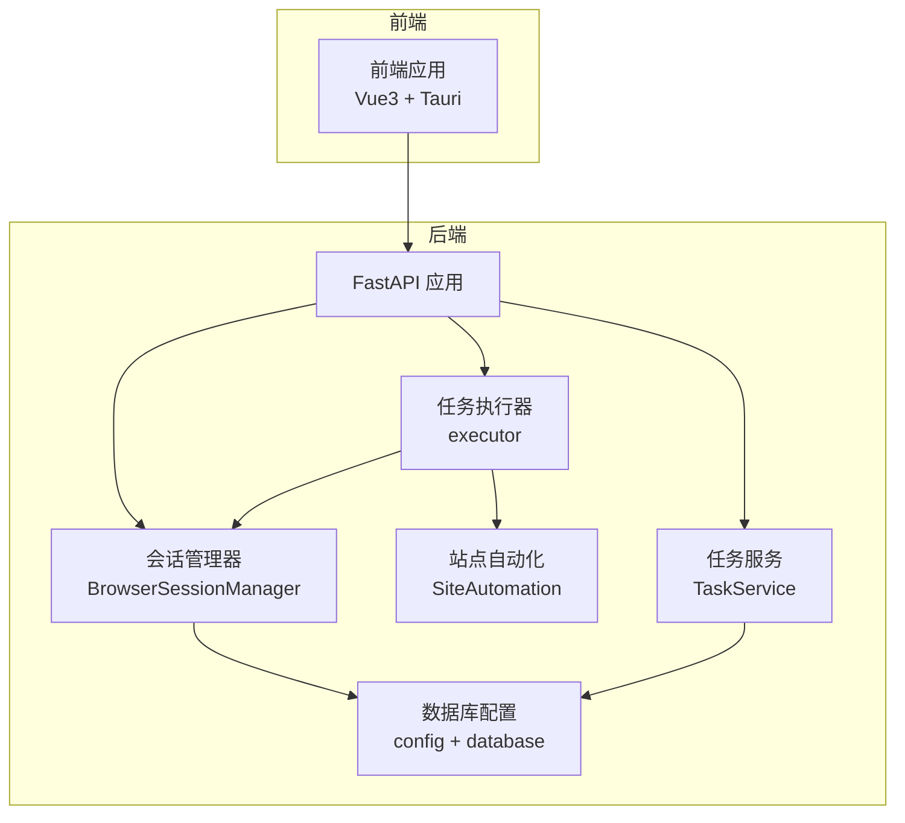
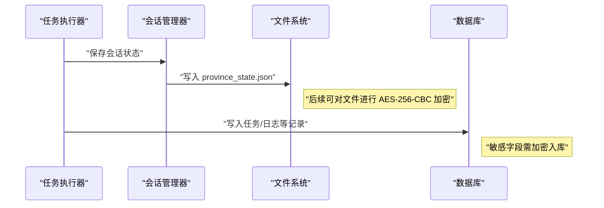
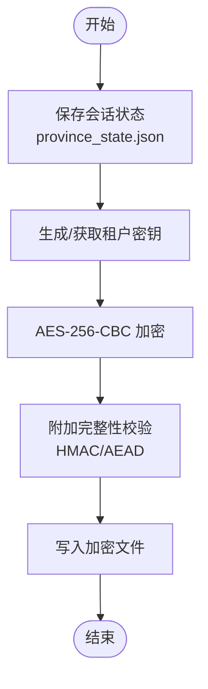
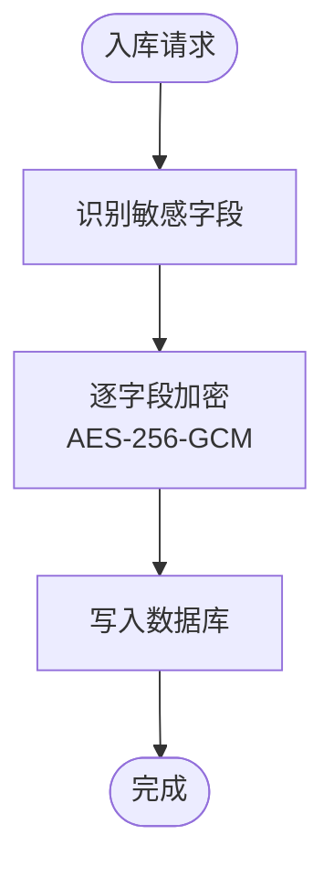
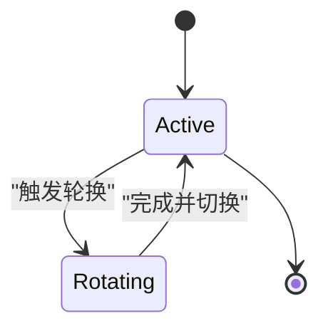
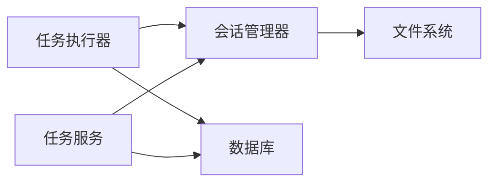

# 数据安全存储

<cite>
**本文引用的文件**
- [project.md](file://project.md)
- [session_manager.py](file://CCC_RPA_API/app/browser/session_manager.py)
- [site_automation.py](file://CCC_RPA_API/app/browser/site_automation.py)
- [executor.py](file://CCC_RPA_API/app/services/executor.py)
- [task.py](file://CCC_RPA_API/app/services/task.py)
- [task.py（模型）](file://CCC_RPA_API/app/models/task.py)
- [config.py](file://CCC_RPA_API/app/config.py)
- [database.py](file://CCC_RPA_API/app/database.py)
</cite>

## 目录
1. [简介](#简介)
2. [项目结构](#项目结构)
3. [核心组件](#核心组件)
4. [架构总览](#架构总览)
5. [详细组件分析](#详细组件分析)
6. [依赖关系分析](#依赖关系分析)
7. [性能考量](#性能考量)
8. [故障排查指南](#故障排查指南)
9. [结论](#结论)
10. [附录](#附录)

## 简介
本文件围绕“数据安全存储”主题，结合仓库中的需求说明与现有实现，系统阐述以下内容：
- 会话快照文件的 AES-256-CBC 加密存储与密钥管理
- 数据库敏感字段（租户密钥、代理地址）加密入库的设计理念与落地路径
- 租户独立密钥管理、密钥轮换机制、密钥存储安全的设计原则
- 数据加密对性能的影响、密钥管理最佳实践、数据完整性验证方法
- 数据安全配置示例、密钥管理指南与安全审计实施建议

## 项目结构
本项目采用分层架构，前端与后端分离，后端以 Python/FastAPI 为核心，结合浏览器自动化与任务执行服务。与“数据安全存储”直接相关的关键目录与文件如下：
- 会话快照与浏览器状态管理：位于后端应用的浏览器模块
- 任务执行与状态持久化：位于后端应用的服务层与模型层
- 数据库连接与配置：位于后端应用的配置与数据库层
- 需求与规范：位于项目文档，明确数据加密存储标准

**图表来源**
- [session_manager.py:10-186](file://CCC_RPA_API/app/browser/session_manager.py#L10-L186)
- [site_automation.py:16-743](file://CCC_RPA_API/app/browser/site_automation.py#L16-L743)
- [executor.py:1-319](file://CCC_RPA_API/app/services/executor.py#L1-L319)
- [task.py:1-157](file://CCC_RPA_API/app/services/task.py#L1-L157)
- [config.py:1-22](file://CCC_RPA_API/app/config.py#L1-L22)
- [database.py:1-19](file://CCC_RPA_API/app/database.py#L1-L19)

**章节来源**
- [project.md:1298-1303](file://project.md#L1298-L1303)
- [session_manager.py:10-186](file://CCC_RPA_API/app/browser/session_manager.py#L10-L186)
- [executor.py:1-319](file://CCC_RPA_API/app/services/executor.py#L1-L319)
- [task.py:1-157](file://CCC_RPA_API/app/services/task.py#L1-L157)
- [config.py:1-22](file://CCC_RPA_API/app/config.py#L1-L22)
- [database.py:1-19](file://CCC_RPA_API/app/database.py#L1-L19)

## 核心组件
- 会话快照与浏览器状态持久化：通过会话管理器将 Playwright 的 storage_state 保存为文件，作为后续恢复与复用的基础。
- 任务执行流水线：从任务创建、状态推进、浏览器交互到日志落库，贯穿加密与安全策略。
- 数据库层：提供统一的连接与会话管理，承载敏感字段加密后的数据。

关键职责与对应文件：
- 会话快照文件保存与恢复：[session_manager.py:128-144](file://CCC_RPA_API/app/browser/session_manager.py#L128-L144)
- 任务执行与进度广播：[executor.py:78-315](file://CCC_RPA_API/app/services/executor.py#L78-L315)
- 任务模型与序列化：[task.py（模型）:1-25](file://CCC_RPA_API/app/models/task.py#L1-L25)，[task.py（服务）:16-107](file://CCC_RPA_API/app/services/task.py#L16-L107)
- 数据库配置与连接池：[config.py:6-18](file://CCC_RPA_API/app/config.py#L6-L18)，[database.py:1-19](file://CCC_RPA_API/app/database.py#L1-L19)

**章节来源**
- [session_manager.py:128-144](file://CCC_RPA_API/app/browser/session_manager.py#L128-L144)
- [executor.py:78-315](file://CCC_RPA_API/app/services/executor.py#L78-L315)
- [task.py（模型）:1-25](file://CCC_RPA_API/app/models/task.py#L1-L25)
- [task.py（服务）:16-107](file://CCC_RPA_API/app/services/task.py#L16-L107)
- [config.py:6-18](file://CCC_RPA_API/app/config.py#L6-L18)
- [database.py:1-19](file://CCC_RPA_API/app/database.py#L1-L19)

## 架构总览
下图展示了“数据安全存储”的整体流程：会话快照文件经加密后落盘；数据库敏感字段在入库前进行加密处理；密钥与加密策略由租户维度隔离与管理。

**图表来源**
- [session_manager.py:128-144](file://CCC_RPA_API/app/browser/session_manager.py#L128-L144)
- [executor.py:120-146](file://CCC_RPA_API/app/services/executor.py#L120-L146)
- [task.py（服务）:74-107](file://CCC_RPA_API/app/services/task.py#L74-L107)

**章节来源**
- [project.md:1298-1303](file://project.md#L1298-L1303)
- [session_manager.py:128-144](file://CCC_RPA_API/app/browser/session_manager.py#L128-L144)
- [executor.py:120-146](file://CCC_RPA_API/app/services/executor.py#L120-L146)
- [task.py（服务）:74-107](file://CCC_RPA_API/app/services/task.py#L74-L107)

## 详细组件分析

### 会话快照文件的 AES-256-CBC 加密存储
- 存储介质：会话快照以 province_state.json 文件形式保存于 data/browser_states 目录。
- 加密策略：根据需求文档，采用 AES-256-CBC 对快照文件进行加密；密钥存储在租户表的独立字段中，确保“仅租户自身密钥可解密会话快照”。
- 实施要点：
  - 密钥生成：为每个租户生成独立的随机密钥，长度符合 AES-256 要求。
  - 密钥存储：将密钥安全地存储在租户表的独立字段中，避免明文存储。
  - 加密流程：在保存快照文件前进行加密，落盘后仅持有密文。
  - 解密流程：恢复会话时，读取密文与对应租户密钥，完成解密后加载 storage_state。
  - 完整性校验：建议配合 HMAC-SHA256 或 AEAD 模式，防止篡改与填充攻击。
  - 性能考虑：加密/解密为 CPU 密集型操作，建议在专用线程或异步任务中执行，并对大文件分块处理。

**图表来源**
- [session_manager.py:128-144](file://CCC_RPA_API/app/browser/session_manager.py#L128-L144)
- [project.md:1298-1303](file://project.md#L1298-L1303)

**章节来源**
- [session_manager.py:128-144](file://CCC_RPA_API/app/browser/session_manager.py#L128-L144)
- [project.md:1298-1303](file://project.md#L1298-L1303)

### 数据库敏感字段加密入库
- 敏感字段范围：根据需求文档，包括“租户密钥、代理地址”等。
- 设计原则：
  - 明文不入库：所有敏感字段在入库前必须加密。
  - 租户隔离：不同租户的密钥相互独立，避免交叉解密。
  - 可检索性：若需对敏感字段进行模糊检索或条件查询，应采用带索引的确定性加密或安全多方计算方案（需额外设计）。
- 实施建议：
  - 使用 AES-256-GCM 或带认证的 AEAD 模式，兼顾机密性与完整性。
  - 为每个租户维护独立的密钥材料，密钥轮换时需保证历史数据可解密。
  - 在 ORM 层面增加字段级加解密钩子，避免业务代码遗漏。

**图表来源**
- [project.md:1298-1303](file://project.md#L1298-L1303)
- [task.py（服务）:74-107](file://CCC_RPA_API/app/services/task.py#L74-L107)

**章节来源**
- [project.md:1298-1303](file://project.md#L1298-L1303)
- [task.py（服务）:74-107](file://CCC_RPA_API/app/services/task.py#L74-L107)

### 租户独立密钥管理与密钥轮换
- 独立密钥：每个租户拥有独立的密钥材料，密钥与会话快照文件一一对应。
- 密钥轮换：
  - 新旧密钥并行期：更换密钥时，同时支持新旧密钥解密，逐步淘汰旧密钥。
  - 历史数据迁移：对历史快照与敏感字段进行批量再加密。
  - 密钥生命周期：设定密钥有效期，到期自动轮换；轮换过程需保证业务连续性。
- 密钥存储安全：
  - 使用硬件安全模块（HSM）或密钥管理服务（KMS）托管密钥。
  - 限制密钥访问权限，最小授权原则；密钥材料不得落入日志或备份。
  - 采用密钥派生函数（如 PBKDF2、HKDF）从主密钥派生会话密钥，降低泄露影响面。

**图表来源**
- [project.md:1077-1077](file://project.md#L1077-L1077)

**章节来源**
- [project.md:1077-1077](file://project.md#L1077-L1077)

### 数据完整性验证
- 建议采用 HMAC-SHA256 或 AES-256-GCM 的认证标签，确保数据未被篡改。
- 对于文件级完整性，可结合 SHA-256 哈希与签名机制，实现端到端可信校验。
- 数据库层面，对敏感字段的密文与认证标签分别存储，查询时进行一致性校验。

**章节来源**
- [project.md:1298-1303](file://project.md#L1298-L1303)

### 性能影响与优化
- 加密开销：AES-256-CBC/GCM 为 CPU 密集型，建议：
  - 使用专用线程或异步任务执行加密/解密。
  - 对大文件分块处理，避免一次性加载至内存。
  - 合理设置加密缓冲区大小，平衡吞吐与延迟。
- I/O 优化：批量写入与压缩可减少磁盘与网络开销。
- 内存管理：及时释放中间变量与临时文件句柄，避免内存泄漏。

**章节来源**
- [session_manager.py:128-144](file://CCC_RPA_API/app/browser/session_manager.py#L128-L144)
- [executor.py:78-315](file://CCC_RPA_API/app/services/executor.py#L78-L315)

### 安全审计与合规
- 审计范围：覆盖密钥生成、轮换、使用、销毁全过程；会话快照的访问与恢复记录。
- 审计内容：操作人、时间、租户、对象、动作、结果、异常信息。
- 存储与保留：审计日志集中存储并设置保留期限，支持检索与导出。
- 合规要求：遵循最小化原则与可追溯性要求，定期进行安全评估与渗透测试。

**章节来源**
- [project.md:1408-1408](file://project.md#L1408-L1408)

## 依赖关系分析
- 会话管理器依赖文件系统进行快照保存与读取，是加密存储的直接载体。
- 任务执行器在执行过程中会触发会话状态保存与恢复，间接影响加密流程。
- 任务服务负责将任务元数据与日志写入数据库，敏感字段需在此阶段完成加密。

**图表来源**
- [session_manager.py:128-144](file://CCC_RPA_API/app/browser/session_manager.py#L128-L144)
- [executor.py:78-315](file://CCC_RPA_API/app/services/executor.py#L78-L315)
- [task.py（服务）:74-107](file://CCC_RPA_API/app/services/task.py#L74-L107)

**章节来源**
- [session_manager.py:128-144](file://CCC_RPA_API/app/browser/session_manager.py#L128-L144)
- [executor.py:78-315](file://CCC_RPA_API/app/services/executor.py#L78-L315)
- [task.py（服务）:74-107](file://CCC_RPA_API/app/services/task.py#L74-L107)

## 性能考量
- 加密算法选择：AES-256-GCM 在提供机密性的同时具备认证能力，适合大多数场景；若需兼容性更强，AES-256-CBC 配合 HMAC-SHA256 亦可。
- 并发与线程：加密/解密应在独立线程或异步任务中执行，避免阻塞主线程。
- I/O 与内存：对大文件分块处理，合理设置缓冲区大小；及时释放中间变量。
- 数据库写入：批量写入与索引设计需综合考虑加密字段的检索需求。

**章节来源**
- [session_manager.py:128-144](file://CCC_RPA_API/app/browser/session_manager.py#L128-L144)
- [executor.py:78-315](file://CCC_RPA_API/app/services/executor.py#L78-L315)
- [task.py（服务）:74-107](file://CCC_RPA_API/app/services/task.py#L74-L107)

## 故障排查指南
- 会话快照无法恢复：
  - 检查快照文件是否存在与可读写。
  - 确认租户密钥正确且未被轮换。
  - 校验加密文件完整性（HMAC/认证标签）。
- 数据库敏感字段解密失败：
  - 核对租户维度的密钥是否匹配。
  - 检查加密算法与参数（IV/nonce、填充模式）是否一致。
- 性能异常：
  - 分析加密任务的执行时间与线程池使用情况。
  - 评估文件分块大小与 I/O 策略。

**章节来源**
- [session_manager.py:128-144](file://CCC_RPA_API/app/browser/session_manager.py#L128-L144)
- [executor.py:78-315](file://CCC_RPA_API/app/services/executor.py#L78-L315)
- [task.py（服务）:74-107](file://CCC_RPA_API/app/services/task.py#L74-L107)

## 结论
本项目在需求层面明确了“会话快照文件 AES-256-CBC 加密存储”与“数据库敏感字段加密入库”的安全标准。结合现有实现，建议在会话管理器与任务服务中引入加密与完整性校验机制，并建立完善的租户密钥管理体系与审计流程，以满足生产环境下的安全性、可维护性与合规性要求。

## 附录

### 数据安全配置示例（示意）
- 会话快照加密配置
  - 算法：AES-256-GCM 或 AES-256-CBC + HMAC-SHA256
  - 密钥来源：租户独立密钥，存储于租户表
  - 完整性：附加认证标签或哈希签名
- 数据库敏感字段加密配置
  - 字段：租户密钥、代理地址
  - 算法：AES-256-GCM
  - 存储：密文与认证标签分离存储

**章节来源**
- [project.md:1298-1303](file://project.md#L1298-L1303)

### 密钥管理最佳实践
- 为每个租户生成独立密钥，密钥材料安全存储于 HSM/KMS
- 密钥轮换采用“新旧并行期”，并完成历史数据再加密
- 限制密钥访问权限，最小授权原则
- 定期审计密钥使用与访问日志

**章节来源**
- [project.md:1077-1077](file://project.md#L1077-L1077)

### 安全审计实施建议
- 审计范围：密钥生命周期、会话快照访问与恢复、敏感字段写入与读取
- 存储与保留：集中存储、设置保留期限、支持检索与导出
- 合规：遵循最小化与可追溯性原则，定期评估与测试

**章节来源**
- [project.md:1408-1408](file://project.md#L1408-L1408)