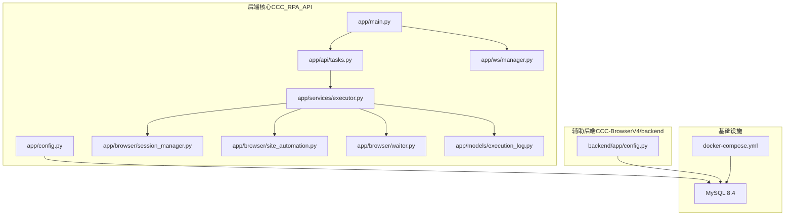
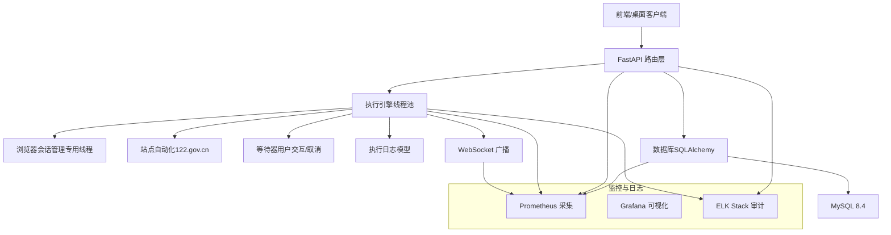
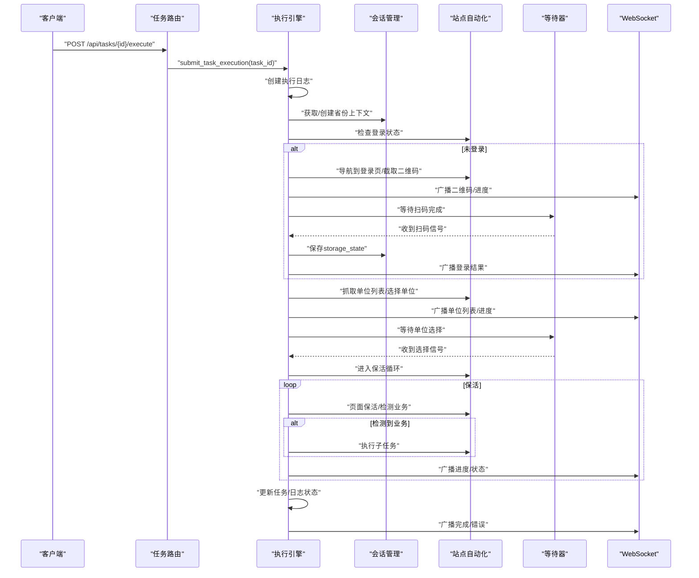
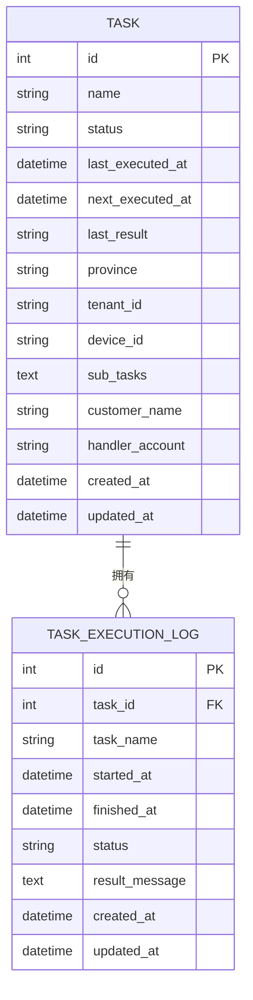
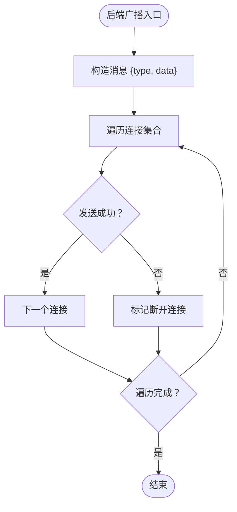
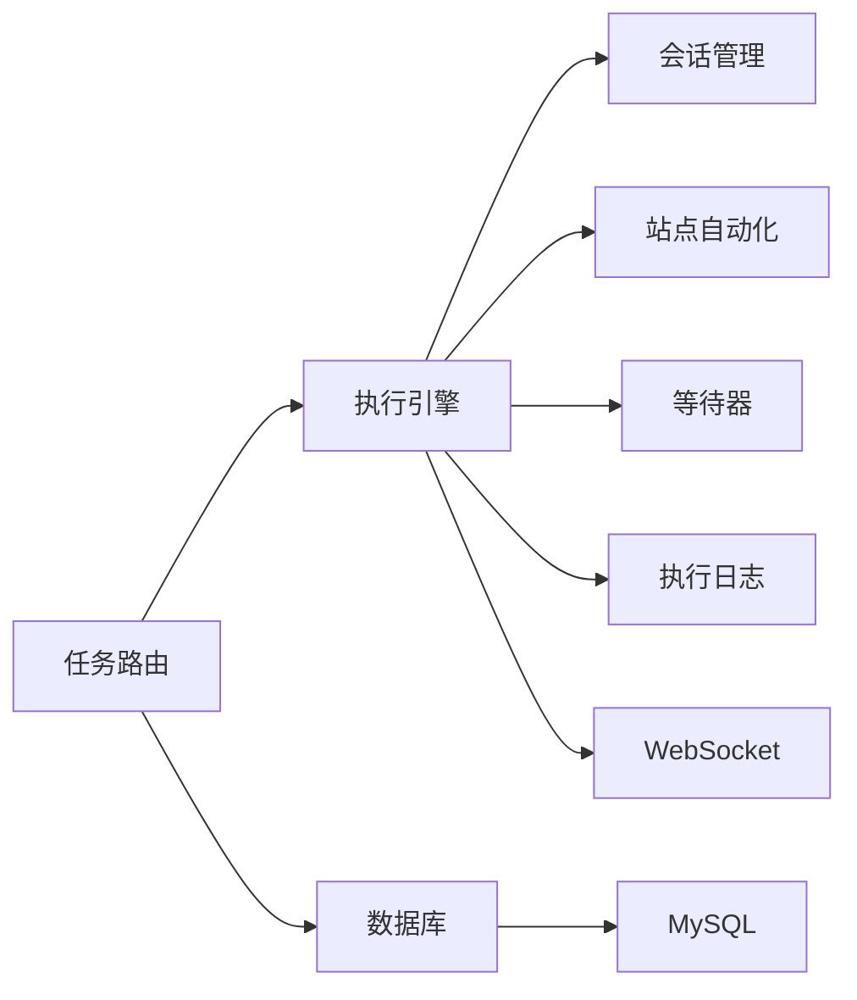

# 监控告警系统

<cite>
**本文引用的文件**   
- [project.md](file://project.md)
- [main.py](file://CCC_RPA_API/app/main.py)
- [config.py](file://CCC_RPA_API/app/config.py)
- [tasks.py](file://CCC_RPA_API/app/api/tasks.py)
- [executor.py](file://CCC_RPA_API/app/services/executor.py)
- [session_manager.py](file://CCC_RPA_API/app/browser/session_manager.py)
- [site_automation.py](file://CCC_RPA_API/app/browser/site_automation.py)
- [waiter.py](file://CCC_RPA_API/app/browser/waiter.py)
- [manager.py](file://CCC_RPA_API/app/ws/manager.py)
- [execution_log.py](file://CCC_RPA_API/app/models/execution_log.py)
- [config.py](file://CCC-BrowserV4/backend/app/config.py)
- [docker-compose.yml](file://CCC-BrowserV4/docker-compose.yml)
</cite>

## 目录
1. [简介](#简介)
2. [项目结构](#项目结构)
3. [核心组件](#核心组件)
4. [架构总览](#架构总览)
5. [组件详解](#组件详解)
6. [依赖关系分析](#依赖关系分析)
7. [性能考量](#性能考量)
8. [故障排查指南](#故障排查指南)
9. [结论](#结论)
10. [附录](#附录)

## 简介
本文件面向“监控告警系统”的落地实施，结合仓库现有代码，给出 Prometheus 统一采集指标、Grafana 可视化监控大盘、ELK Stack 全量操作审计日志收集的实现思路与配置要点；并围绕异常告警规则（会话批量崩溃、AI 推理超时、集群资源耗尽、代理 IP 批量失效）进行设计理念与配置方法说明，涵盖告警通知机制、告警级别划分、告警抑制策略等实现细节，同时提供指标配置、告警规则调优与故障排查的实用指南。

## 项目结构
- 后端核心（Python FastAPI + Playwright）位于 CCC_RPA_API，负责任务执行、浏览器会话管理、WebSocket 广播与数据库持久化。
- 前端与桌面壳层位于 CCC-BrowserV4，提供用户界面、设备标识与登录回调。
- MySQL 通过 docker-compose 提供持久化存储。

**图表来源**
- [main.py:1-127](file://CCC_RPA_API/app/main.py#L1-L127)
- [config.py:1-22](file://CCC_RPA_API/app/config.py#L1-L22)
- [tasks.py:1-76](file://CCC_RPA_API/app/api/tasks.py#L1-L76)
- [executor.py:1-319](file://CCC_RPA_API/app/services/executor.py#L1-L319)
- [session_manager.py:1-186](file://CCC_RPA_API/app/browser/session_manager.py#L1-L186)
- [site_automation.py:1-743](file://CCC_RPA_API/app/browser/site_automation.py#L1-L743)
- [waiter.py:1-84](file://CCC_RPA_API/app/browser/waiter.py#L1-L84)
- [manager.py:1-29](file://CCC_RPA_API/app/ws/manager.py#L1-L29)
- [execution_log.py:1-17](file://CCC_RPA_API/app/models/execution_log.py#L1-L17)
- [config.py:1-52](file://CCC-BrowserV4/backend/app/config.py#L1-L52)
- [docker-compose.yml:1-21](file://CCC-BrowserV4/docker-compose.yml#L1-L21)

**章节来源**
- [project.md:159-260](file://project.md#L159-L260)
- [main.py:1-127](file://CCC_RPA_API/app/main.py#L1-L127)
- [docker-compose.yml:1-21](file://CCC-BrowserV4/docker-compose.yml#L1-L21)

## 核心组件
- 任务执行引擎：线程池驱动，负责任务生命周期、浏览器上下文管理、保活循环、业务触发与状态广播。
- 浏览器会话管理：专用 Playwright 工作线程，按省份隔离上下文，持久化 storage_state，崩溃恢复。
- WebSocket 广播：后端向前端推送执行进度、二维码、单位列表、错误与任务状态变更。
- 数据模型：任务与执行日志持久化，支撑审计与统计。
- 健康检查：后端提供 /health 接口，可用于探活与服务发现。

**章节来源**
- [executor.py:1-319](file://CCC_RPA_API/app/services/executor.py#L1-L319)
- [session_manager.py:1-186](file://CCC_RPA_API/app/browser/session_manager.py#L1-L186)
- [manager.py:1-29](file://CCC_RPA_API/app/ws/manager.py#L1-L29)
- [execution_log.py:1-17](file://CCC_RPA_API/app/models/execution_log.py#L1-L17)
- [main.py:114-116](file://CCC_RPA_API/app/main.py#L114-L116)

## 架构总览
后端以 FastAPI 为核心，通过线程池与专用 Playwright 工作线程协同，完成任务执行与浏览器自动化；执行过程中的关键节点通过 WebSocket 广播到前端；数据库用于持久化任务与执行日志；MySQL 通过 docker-compose 提供。

**图表来源**
- [main.py:1-127](file://CCC_RPA_API/app/main.py#L1-L127)
- [executor.py:1-319](file://CCC_RPA_API/app/services/executor.py#L1-L319)
- [session_manager.py:1-186](file://CCC_RPA_API/app/browser/session_manager.py#L1-L186)
- [site_automation.py:1-743](file://CCC_RPA_API/app/browser/site_automation.py#L1-L743)
- [waiter.py:1-84](file://CCC_RPA_API/app/browser/waiter.py#L1-L84)
- [manager.py:1-29](file://CCC_RPA_API/app/ws/manager.py#L1-L29)
- [execution_log.py:1-17](file://CCC_RPA_API/app/models/execution_log.py#L1-L17)
- [docker-compose.yml:1-21](file://CCC-BrowserV4/docker-compose.yml#L1-L21)

## 组件详解

### 任务执行与会话管理
- 执行引擎通过线程池提交任务逻辑，使用专用 Playwright 工作线程执行浏览器操作，避免与 asyncio 事件循环冲突。
- 会话管理按省份隔离上下文，支持 storage_state 持久化与崩溃恢复。
- 保活循环在当前业务页面执行非侵入式操作，检测待处理业务并触发子任务执行。

**图表来源**
- [tasks.py:47-76](file://CCC_RPA_API/app/api/tasks.py#L47-L76)
- [executor.py:78-319](file://CCC_RPA_API/app/services/executor.py#L78-L319)
- [session_manager.py:79-126](file://CCC_RPA_API/app/browser/session_manager.py#L79-L126)
- [site_automation.py:38-146](file://CCC_RPA_API/app/browser/site_automation.py#L38-L146)
- [waiter.py:14-32](file://CCC_RPA_API/app/browser/waiter.py#L14-L32)
- [manager.py:17-26](file://CCC_RPA_API/app/ws/manager.py#L17-L26)

**章节来源**
- [executor.py:1-319](file://CCC_RPA_API/app/services/executor.py#L1-L319)
- [session_manager.py:1-186](file://CCC_RPA_API/app/browser/session_manager.py#L1-L186)
- [site_automation.py:1-743](file://CCC_RPA_API/app/browser/site_automation.py#L1-L743)
- [waiter.py:1-84](file://CCC_RPA_API/app/browser/waiter.py#L1-L84)
- [manager.py:1-29](file://CCC_RPA_API/app/ws/manager.py#L1-L29)

### 数据模型与审计
- 执行日志模型记录任务开始/结束、状态与结果消息，支持审计与统计。
- 任务模型包含状态、上次/下次执行时间、结果等字段，便于监控与告警。

**图表来源**
- [execution_log.py:1-17](file://CCC_RPA_API/app/models/execution_log.py#L1-L17)
- [project.md:437-471](file://project.md#L437-L471)

**章节来源**
- [execution_log.py:1-17](file://CCC_RPA_API/app/models/execution_log.py#L1-L17)
- [project.md:437-471](file://project.md#L437-L471)

### WebSocket 广播与前端交互
- 后端通过 ConnectionManager 管理连接并广播消息，前端通过单例 WS 客户端自动重连。
- 广播消息类型包括执行进度、二维码、单位列表、登录结果、执行错误与任务状态更新。

**图表来源**
- [manager.py:17-26](file://CCC_RPA_API/app/ws/manager.py#L17-L26)

**章节来源**
- [manager.py:1-29](file://CCC_RPA_API/app/ws/manager.py#L1-L29)
- [project.md:404-418](file://project.md#L404-L418)

## 依赖关系分析
- 执行引擎依赖会话管理与站点自动化，二者均依赖专用 Playwright 工作线程。
- 任务路由依赖执行引擎与等待器，等待器用于用户交互与取消。
- WebSocket 广播贯穿执行引擎与前端交互。
- 数据库通过 SQLAlchemy 连接 MySQL，执行引擎与日志模型共同使用。

**图表来源**
- [tasks.py:1-76](file://CCC_RPA_API/app/api/tasks.py#L1-L76)
- [executor.py:1-319](file://CCC_RPA_API/app/services/executor.py#L1-L319)
- [session_manager.py:1-186](file://CCC_RPA_API/app/browser/session_manager.py#L1-L186)
- [site_automation.py:1-743](file://CCC_RPA_API/app/browser/site_automation.py#L1-L743)
- [waiter.py:1-84](file://CCC_RPA_API/app/browser/waiter.py#L1-L84)
- [manager.py:1-29](file://CCC_RPA_API/app/ws/manager.py#L1-L29)
- [execution_log.py:1-17](file://CCC_RPA_API/app/models/execution_log.py#L1-L17)
- [config.py:1-22](file://CCC_RPA_API/app/config.py#L1-L22)
- [docker-compose.yml:1-21](file://CCC-BrowserV4/docker-compose.yml#L1-L21)

**章节来源**
- [tasks.py:1-76](file://CCC_RPA_API/app/api/tasks.py#L1-L76)
- [executor.py:1-319](file://CCC_RPA_API/app/services/executor.py#L1-L319)
- [session_manager.py:1-186](file://CCC_RPA_API/app/browser/session_manager.py#L1-L186)
- [site_automation.py:1-743](file://CCC_RPA_API/app/browser/site_automation.py#L1-L743)
- [waiter.py:1-84](file://CCC_RPA_API/app/browser/waiter.py#L1-L84)
- [manager.py:1-29](file://CCC_RPA_API/app/ws/manager.py#L1-L29)
- [execution_log.py:1-17](file://CCC_RPA_API/app/models/execution_log.py#L1-L17)
- [config.py:1-22](file://CCC_RPA_API/app/config.py#L1-L22)
- [docker-compose.yml:1-21](file://CCC-BrowserV4/docker-compose.yml#L1-L21)

## 性能考量
- 线程模型：主线程（asyncio 事件循环 + FastAPI + WebSocket），专用 Playwright 工作线程，任务执行线程池与等待线程池分离，避免阻塞。
- 浏览器保活：非侵入式随机滚动、鼠标移动、Tab、阅读等待，避免触发导航或表单提交。
- 等待策略：统一使用 domcontentloaded，登录状态检查使用 networkidle，降低超时风险。
- 反检测：禁用 AutomationControlled 特征，覆写 navigator.webdriver，模拟真人鼠标轨迹。

**章节来源**
- [project.md:661-684](file://project.md#L661-L684)
- [site_automation.py:614-680](file://CCC_RPA_API/app/browser/site_automation.py#L614-L680)

## 故障排查指南
- 浏览器崩溃恢复：执行引擎在保活循环中检查浏览器存活，若关闭则恢复会话并重新打开页面，同时广播进度提示。
- 执行异常处理：捕获异常并更新任务与日志状态，广播错误消息与任务状态更新。
- WebSocket 断连：前端自动重连（3 秒间隔），后端广播时清理无效连接。
- 数据库迁移：启动时尝试添加列并插入初始任务数据，注意迁移失败日志。

**章节来源**
- [executor.py:42-70](file://CCC_RPA_API/app/services/executor.py#L42-L70)
- [executor.py:286-314](file://CCC_RPA_API/app/services/executor.py#L286-L314)
- [manager.py:17-26](file://CCC_RPA_API/app/ws/manager.py#L17-L26)
- [main.py:37-102](file://CCC_RPA_API/app/main.py#L37-L102)

## 监控告警系统实施方案

### 一、Prometheus 统一采集指标
以下指标建议结合现有代码实现与日志输出进行采集与上报（指标命名与标签可根据实际需要调整）：

- Pod/进程 CPU、内存
  - 指标：container_cpu_usage_seconds_total、container_memory_usage_bytes、kube_pod_info 等
  - 来源：Kubernetes 节点与 kube-state-metrics、node_exporter
  - 用途：评估后端服务与浏览器进程资源占用

- CDP 长连接数量
  - 指标：chrome_devtools_sessions_count（自定义 exporter）
  - 来源：在会话管理中统计当前上下文数量与连接数，并通过 HTTP 指标端点暴露
  - 用途：监控浏览器会话并发与潜在泄漏

- AI 推理耗时
  - 指标：ai_inference_duration_seconds（自定义 exporter）
  - 来源：在站点自动化执行子任务处埋点，记录每次推理开始/结束时间
  - 用途：识别推理性能瓶颈与异常波动

- 会话崩溃次数
  - 指标：browser_session_crashes_total（自定义 exporter）
  - 来源：在会话恢复逻辑处计数并上报
  - 用途：监控浏览器稳定性与异常恢复频率

- 会话批量崩溃
  - 指标：browser_session_batch_crash_total（自定义 exporter）
  - 来源：在保活循环中检测连续崩溃并聚合上报
  - 用途：快速识别大规模会话异常

- 代理 IP 失效数量
  - 指标：proxy_ip_invalid_count（自定义 exporter）
  - 来源：在站点自动化登录/导航失败时统计代理 IP 失效并上报
  - 用途：监控代理池健康度

- 集群资源耗尽
  - 指标：cluster_resource_exhaustion{resource="cpu|memory|disk|net"}（自定义 exporter）
  - 来源：node_exporter 与自定义探测器
  - 用途：监控节点与 Pod 资源使用率阈值告警

- 任务执行失败率与耗时
  - 指标：task_execution_failures_total、task_execution_duration_seconds
  - 来源：执行日志模型与 WebSocket 广播状态
  - 用途：评估任务稳定性与性能

- WebSocket 连接异常
  - 指标：ws_connection_errors_total、ws_broadcast_failures_total
  - 来源：WebSocket 广播失败计数
  - 用途：监控前后端通信质量

- 数据库连接池与慢查询
  - 指标：db_pool_connections、db_slow_queries
  - 来源：数据库监控与慢查询日志
  - 用途：保障数据层稳定性

- 健康检查失败
  - 指标：service_health_checks_failed_total
  - 来源：/health 接口探活失败计数
  - 用途：快速定位服务不可用

**章节来源**
- [session_manager.py:147-170](file://CCC_RPA_API/app/browser/session_manager.py#L147-L170)
- [site_automation.py:738-743](file://CCC_RPA_API/app/browser/site_automation.py#L738-L743)
- [executor.py:286-314](file://CCC_RPA_API/app/services/executor.py#L286-L314)
- [manager.py:17-26](file://CCC_RPA_API/app/ws/manager.py#L17-L26)
- [main.py:114-116](file://CCC_RPA_API/app/main.py#L114-L116)

### 二、Grafana 可视化监控大盘
- 仪表盘建议分区：
  - 集群资源：CPU/内存/磁盘/网络使用率、Pod 重启次数、OOMKilled
  - 服务健康：后端服务存活、/health 响应时间、错误率
  - 业务指标：任务执行成功率/失败率、平均耗时、吞吐量
  - 浏览器会话：CDP 连接数、崩溃次数、保活间隔分布
  - 日志审计：ELK 入库速率、错误日志占比、审计事件趋势
- 面板联动：通过任务 ID/设备 ID/租户维度筛选，实现跨面板联动分析

### 三、ELK Stack 全量操作审计日志收集
- 日志采集：
  - 后端服务日志：stdout/stderr 输出，结合 filebeat 收集
  - 前端日志：浏览器控制台与网络日志，通过前端埋点上报至日志系统
  - 审计事件：任务执行、扫码完成、选择单位、取消执行等关键事件
- 日志结构化：
  - 事件类型、时间戳、任务 ID、设备 ID、租户 ID、省份、状态、耗时、错误信息
- 查询与告警：
  - 使用 KQL 进行审计检索，结合异常模式识别与阈值告警

### 四、异常告警规则设计与配置

- 会话批量崩溃
  - 规则：近 5 分钟内同一省份崩溃次数超过阈值（例如 N 次）
  - 动态阈值：按省份历史均值±2σ 自适应调整
  - 抑制策略：同一省份同一批次崩溃告警抑制，避免风暴
  - 通知：邮件/IM 通知运维与值班人员

- AI 推理超时
  - 规则：推理耗时 P95/P99 超过阈值（例如 30/60 秒）
  - 抑制策略：同服务实例短期重复告警抑制
  - 通知：分级通知，高优先级直达值班

- 集群资源耗尽
  - 规则：CPU/内存/磁盘使用率持续高于阈值（例如 85%）
  - 抑制策略：同节点短期重复告警抑制
  - 通知：分级通知，必要时触发扩缩容

- 代理 IP 批量失效
  - 规则：近 1 分钟内代理 IP 失效数量超过阈值（例如 M 个）
  - 抑制策略：同代理池短期重复告警抑制
  - 通知：自动拉黑与补充代理池

- 告警级别与通知机制
  - 级别：P0（业务中断）、P1（严重影响）、P2（一般问题）、P3（预警）
  - 通知：邮件、IM、电话（P0-P2），短信（P0）
  - 抑制：同实例/同租户/同省份短期重复告警抑制，支持静默窗口

- 告警规则调优
  - 基于历史数据计算动态阈值，结合滑动窗口与季节性调整
  - 定期回溯告警命中率与误报率，优化规则参数
  - 引入机器学习识别异常模式，减少误报

### 五、监控指标配置与告警规则调优实践
- 指标配置
  - 在执行引擎与会话管理中增加埋点，输出自定义指标端点
  - 在站点自动化中记录推理耗时与代理 IP 失效事件
  - 在 WebSocket 广播失败处增加计数器
- 告警规则调优
  - 以 30 天为周期评估告警效果，逐步收敛阈值
  - 引入相关性分析，减少误报与漏报
  - 建立告警工单闭环流程，追踪修复与回归验证

### 六、故障排查与应急响应
- 快速定位：结合 Grafana 面板与 ELK 审计日志，定位异常时间段与事件
- 应急处置：自动拉起备用实例、临时扩容、切换代理池
- 复盘总结：形成故障报告，更新告警规则与应急预案

## 结论
通过在现有系统中增加自定义指标导出、完善日志采集与审计、建立完善的告警规则与抑制策略，可以实现对会话稳定性、任务执行质量与集群资源的全面监控。建议先从关键指标与核心告警规则入手，逐步扩展到全量监控与智能告警，确保系统稳定运行与快速响应。

## 附录
- 健康检查接口：/health，返回服务状态
- WebSocket 地址：ws://host/ws，消息类型包括执行进度、二维码、单位列表、登录结果、执行错误、任务状态更新

**章节来源**
- [main.py:114-116](file://CCC_RPA_API/app/main.py#L114-L116)
- [project.md:404-418](file://project.md#L404-L418)