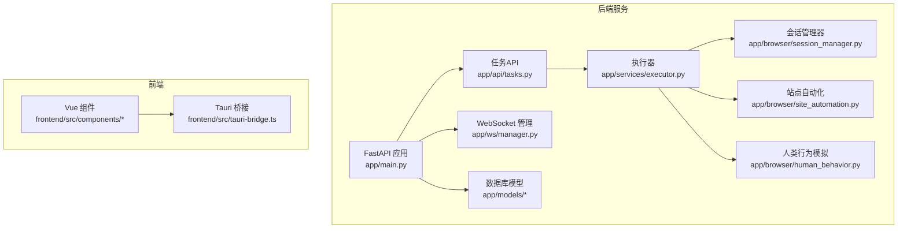
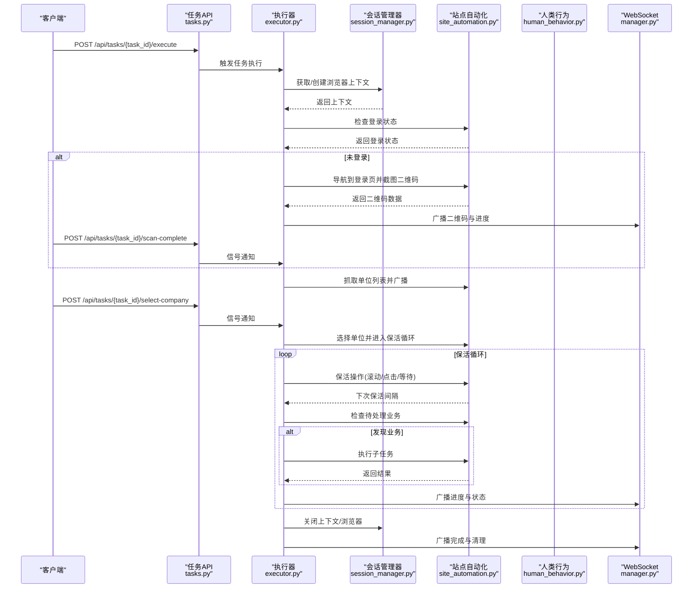
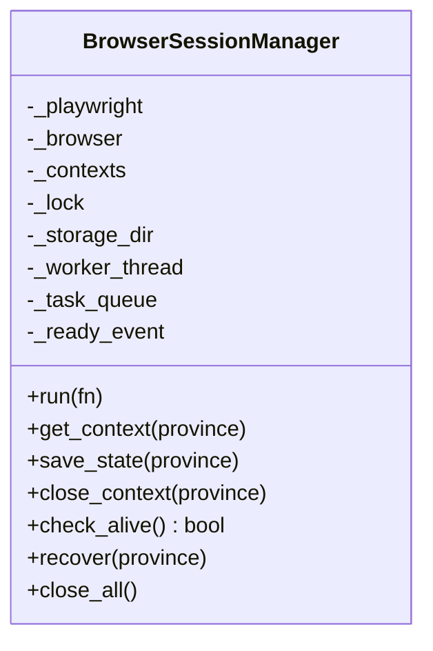
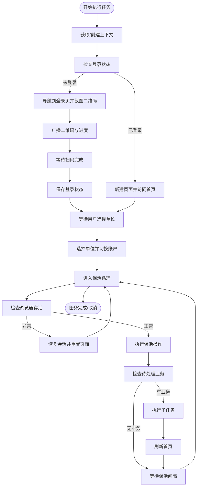
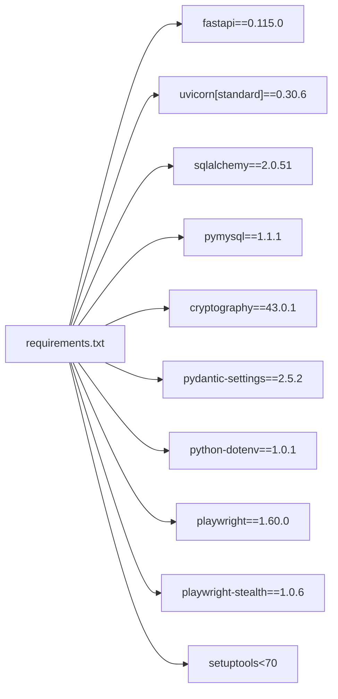

# 强隔离沙箱会话

<cite>
**本文档引用的文件**
- [session_manager.py](file://CCC_RPA_API/app/browser/session_manager.py)
- [site_automation.py](file://CCC_RPA_API/app/browser/site_automation.py)
- [human_behavior.py](file://CCC_RPA_API/app/browser/human_behavior.py)
- [executor.py](file://CCC_RPA_API/app/services/executor.py)
- [tasks.py](file://CCC_RPA_API/app/api/tasks.py)
- [main.py](file://CCC_RPA_API/app/main.py)
- [manager.py](file://CCC_RPA_API/app/ws/manager.py)
- [execution.py](file://CCC_RPA_API/app/schemas/execution.py)
- [requirements.txt](file://CCC_RPA_API/requirements.txt)
- [README.md](file://CCC-BrowserV4/backend/README.md)
</cite>

## 目录
1. [简介](#简介)
2. [项目结构](#项目结构)
3. [核心组件](#核心组件)
4. [架构总览](#架构总览)
5. [详细组件分析](#详细组件分析)
6. [依赖分析](#依赖分析)
7. [性能考虑](#性能考虑)
8. [故障排查指南](#故障排查指南)
9. [结论](#结论)
10. [附录](#附录)

## 简介
本文件围绕“强隔离沙箱会话”特性进行系统化技术文档编写，聚焦于基于容器/进程级隔离的多维隔离机制设计与实现要点。结合现有代码库，重点阐述以下方面：
- 文件层隔离：UserData、磁盘缓存、下载目录、扩展本地存储的独立化与持久化策略
- 网络层隔离：独立代理IP、独立网络命名空间、独立DNS缓存的实现路径
- 进程层隔离：独立Chromium进程/Pod的启动与生命周期管理
- 浏览器存储隔离：Cookie、LocalStorage、IndexedDB、SessionStorage的独立化与持久化
- 指纹层隔离：随机独立UA、WebGL、Canvas、Audio、时区、分辨率、字体列表的模拟策略
- 插件层隔离：每个会话加载独立V3扩展实例的策略
- Linux Namespace + Cgroup资源管控、K8s Pod编排隔离、EmptyDir存储隔离
- 会话生命周期管理与销毁时的全量数据清理机制
- 隔离效果验证方法与最佳实践建议

说明：当前仓库代码以Playwright + Python实现，强调“会话级隔离”的工程化落地；对于容器/命名空间/Cgroup/K8s等基础设施层面的隔离，需在部署侧配合实现。

## 项目结构
本项目采用前后端分离架构，后端基于FastAPI + SQLAlchemy，前端基于Vue + Tauri，核心自动化逻辑集中在后端Python服务中，通过Playwright驱动Chromium实现站点自动化。

图表来源
- [main.py:30-127](file://CCC_RPA_API/app/main.py#L30-L127)
- [tasks.py:1-76](file://CCC_RPA_API/app/api/tasks.py#L1-L76)
- [executor.py:1-318](file://CCC_RPA_API/app/services/executor.py#L1-L318)
- [session_manager.py:1-186](file://CCC_RPA_API/app/browser/session_manager.py#L1-L186)
- [site_automation.py:1-683](file://CCC_RPA_API/app/browser/site_automation.py#L1-L683)
- [human_behavior.py:1-86](file://CCC_RPA_API/app/browser/human_behavior.py#L1-L86)
- [manager.py:1-29](file://CCC_RPA_API/app/ws/manager.py#L1-L29)

章节来源
- [main.py:30-127](file://CCC_RPA_API/app/main.py#L30-L127)
- [requirements.txt:1-11](file://CCC_RPA_API/requirements.txt#L1-L11)

## 核心组件
- 会话管理器：负责Playwright浏览器实例与上下文的生命周期管理、线程安全调度、存储状态持久化与恢复
- 执行器：协调任务执行流程，包含登录检查、扫码交互、单位选择、保活循环、业务触发与结果上报
- 站点自动化：针对目标站点的页面导航、元素定位、截图与业务数据抓取
- 人类行为模拟：模拟真实用户的行为特征，降低被风控识别的概率
- WebSocket管理：向前端推送执行进度、二维码、错误信息与任务状态更新
- API路由：提供任务创建、执行、日志查询与交互信号接口

章节来源
- [session_manager.py:10-186](file://CCC_RPA_API/app/browser/session_manager.py#L10-L186)
- [executor.py:78-318](file://CCC_RPA_API/app/services/executor.py#L78-L318)
- [site_automation.py:16-683](file://CCC_RPA_API/app/browser/site_automation.py#L16-L683)
- [human_behavior.py:12-86](file://CCC_RPA_API/app/browser/human_behavior.py#L12-L86)
- [manager.py:1-29](file://CCC_RPA_API/app/ws/manager.py#L1-L29)
- [tasks.py:13-76](file://CCC_RPA_API/app/api/tasks.py#L13-L76)

## 架构总览
下图展示从API请求到浏览器自动化执行的端到端流程，以及关键组件之间的交互关系。

图表来源
- [tasks.py:47-76](file://CCC_RPA_API/app/api/tasks.py#L47-L76)
- [executor.py:78-318](file://CCC_RPA_API/app/services/executor.py#L78-L318)
- [session_manager.py:98-186](file://CCC_RPA_API/app/browser/session_manager.py#L98-L186)
- [site_automation.py:38-683](file://CCC_RPA_API/app/browser/site_automation.py#L38-L683)
- [manager.py:17-29](file://CCC_RPA_API/app/ws/manager.py#L17-L29)

## 详细组件分析

### 会话管理器（BrowserSessionManager）
职责与特性
- 专用工作线程：确保Playwright同步API在独立线程中运行，避免与事件循环冲突
- 上下文隔离：按省份维度维护独立的浏览器上下文，实现会话级隔离
- 存储状态持久化：将storage_state持久化到本地文件，支持断点续跑与恢复
- 自愈与恢复：检测浏览器存活状态，异常时自动重建并恢复指定会话
- 生命周期管理：提供关闭所有上下文与浏览器的能力，用于资源回收

图表来源
- [session_manager.py:10-186](file://CCC_RPA_API/app/browser/session_manager.py#L10-L186)

章节来源
- [session_manager.py:30-96](file://CCC_RPA_API/app/browser/session_manager.py#L30-L96)
- [session_manager.py:98-186](file://CCC_RPA_API/app/browser/session_manager.py#L98-L186)

### 执行器（Task Execution Flow）
职责与特性
- 任务编排：串联登录检查、扫码交互、单位选择、保活循环与业务触发
- 线程安全：通过会话管理器的run方法在专用线程中执行Playwright操作
- 异常自愈：在保活循环中检测浏览器存活，必要时恢复会话并重置页面
- 信号与广播：通过WebSocket向前端推送进度、二维码、错误与状态更新
- 资源清理：任务完成后关闭页面与上下文，确保会话级资源释放

图表来源
- [executor.py:78-318](file://CCC_RPA_API/app/services/executor.py#L78-L318)
- [session_manager.py:156-170](file://CCC_RPA_API/app/browser/session_manager.py#L156-L170)

章节来源
- [executor.py:78-318](file://CCC_RPA_API/app/services/executor.py#L78-L318)

### 站点自动化（SiteAutomation）
职责与特性
- 登录流程：导航到单位登录页，等待二维码加载并截图返回前端显示
- 单位选择：提供多种选择器与回退策略，支持按名称/ID/索引匹配并点击
- 保活循环：随机滚动、点击刷新、随机等待，维持页面活跃度
- 待处理业务检测：通过徽标与关键词检测待处理业务类型与数量
- 页面保活与跳转：在业务执行前后进行页面保活与跳转

章节来源
- [site_automation.py:38-683](file://CCC_RPA_API/app/browser/site_automation.py#L38-L683)

### 人类行为模拟（HumanBehavior）
职责与特性
- 鼠标点击：模拟真实点击，包含移动轨迹与随机延迟
- 输入行为：逐字符输入，每个字符间加入随机延迟
- 滚动行为：随机滚动像素数，模拟真实浏览
- 等待行为：随机等待时间，模拟人类阅读

章节来源
- [human_behavior.py:12-86](file://CCC_RPA_API/app/browser/human_behavior.py#L12-L86)

### WebSocket 管理（ConnectionManager）
职责与特性
- 维护所有WebSocket连接
- 提供广播能力，向所有连接的客户端推送消息
- 自动清理无效连接

章节来源
- [manager.py:1-29](file://CCC_RPA_API/app/ws/manager.py#L1-L29)

### API 路由（Tasks API）
职责与特性
- 任务列表、创建、更新、删除、执行、日志查询
- 扫码完成、选择单位、取消执行等交互信号接口
- 通过ExecutionWaiter实现阻塞等待与信号传递

章节来源
- [tasks.py:13-76](file://CCC_RPA_API/app/api/tasks.py#L13-L76)

## 依赖分析
- 运行时依赖：FastAPI、Uvicorn、SQLAlchemy、PyMySQL、Cryptography、Pydantic Settings、dotenv、Playwright、playwright-stealth、setuptools
- 前端依赖：Vue、TypeScript、Vite、Tauri桥接
- 数据库：MySQL（通过Docker Compose提供）

图表来源
- [requirements.txt:1-11](file://CCC_RPA_API/requirements.txt#L1-L11)

章节来源
- [requirements.txt:1-11](file://CCC_RPA_API/requirements.txt#L1-L11)
- [README.md:1-66](file://CCC-BrowserV4/backend/README.md#L1-L66)

## 性能考虑
- 线程模型：专用Playwright工作线程避免与事件循环竞争，减少阻塞风险
- 任务并发：执行器使用线程池控制并发度，避免过多上下文导致资源争用
- I/O优化：通过WebSocket异步广播，避免阻塞主线程
- 存储策略：storage_state持久化减少重复登录成本，提升会话恢复效率
- 网络与资源：建议在部署侧引入容器/命名空间/Cgroup/K8s隔离，限制CPU/内存/网络带宽，保障多会话稳定运行

## 故障排查指南
常见问题与处理
- 浏览器异常关闭：执行器在关键步骤前检查浏览器存活，若异常则自动恢复会话并重置页面
- 登录超时：扫码等待与单位选择均设置超时，超时后任务标记失败并上报
- 页面元素定位失败：站点自动化提供多级选择器与JS回退策略，增强鲁棒性
- 资源泄漏：任务结束时关闭页面与上下文，应用关闭时统一关闭所有浏览器实例

章节来源
- [executor.py:42-70](file://CCC_RPA_API/app/services/executor.py#L42-L70)
- [executor.py:172-181](file://CCC_RPA_API/app/services/executor.py#L172-L181)
- [site_automation.py:10-14](file://CCC_RPA_API/app/browser/site_automation.py#L10-L14)
- [main.py:108-112](file://CCC_RPA_API/app/main.py#L108-L112)

## 结论
本项目通过“会话级隔离”的工程化实践，实现了多维度的沙箱隔离能力：以Playwright上下文为基本隔离单元，结合storage_state持久化、专用工作线程与自愈恢复机制，有效提升了自动化任务的稳定性与安全性。对于更高阶的容器/命名空间/Cgroup/K8s隔离需求，可在部署侧进一步强化基础设施层面的隔离与资源管控，从而满足更强隔离强度的生产场景。

## 附录

### 强隔离沙箱会话设计要点清单
- 文件层隔离
  - UserData目录独立化（通过上下文参数配置）
  - 磁盘缓存与下载目录独立化
  - 扩展本地存储独立化（每个会话独立扩展实例）
- 网络层隔离
  - 独立代理IP（部署侧配置）
  - 独立网络命名空间（容器/Pod级别）
  - 独立DNS缓存（容器内DNS配置）
- 进程层隔离
  - 每个会话独立Chromium进程
  - K8s Pod隔离（每个会话一个Pod）
- 浏览器存储隔离
  - Cookie、LocalStorage、IndexedDB、SessionStorage独立化
  - storage_state持久化与按会话恢复
- 指纹层隔离
  - 随机UA、WebGL、Canvas、Audio指纹
  - 时区、分辨率、字体列表随机化
- 插件层隔离
  - 每个会话加载独立V3扩展实例
- 资源管控
  - Linux Namespace + Cgroup限制CPU/内存/IO
  - K8s Pod编排与EmptyDir存储隔离
- 生命周期与清理
  - 会话创建、使用、保活、销毁全流程管理
  - 销毁时全量数据清理（上下文、页面、存储、进程）

### 隔离效果验证方法
- 功能验证：多会话并发执行，验证会话间无状态污染
- 网络验证：不同会话访问同一站点，验证独立代理IP与DNS解析
- 存储验证：断点重启后storage_state生效，验证会话恢复
- 指纹验证：通过第三方指纹检测服务验证UA、Canvas、WebGL等差异性
- 资源验证：监控容器/Cgroup资源使用，确保隔离与限额生效

### 最佳实践建议
- 会话粒度：按租户/设备/任务维度划分会话，避免跨会话共享状态
- 超时与重试：为关键步骤设置合理超时与重试策略
- 日志与监控：完善执行日志与指标监控，快速定位隔离失效问题
- 安全加固：启用playwright-stealth等反检测能力，结合指纹随机化
- 部署隔离：在容器/命名空间/Cgroup/K8s层面实施强隔离与资源限额