# 核心功能特性概览

<cite>
**本文档引用的文件**
- [project.md](file://project.md)
- [main.py](file://CCC_RPA_API/app/main.py)
- [session_manager.py](file://CCC_RPA_API/app/browser/session_manager.py)
- [site_automation.py](file://CCC_RPA_API/app/browser/site_automation.py)
- [executor.py](file://CCC_RPA_API/app/services/executor.py)
- [manager.py](file://CCC_RPA_API/app/ws/manager.py)
- [docker-compose.yml](file://CCC-BrowserV4/docker-compose.yml)
- [main.rs](file://CCC-BrowserV4/src-tauri/src/main.rs)
- [commands.rs](file://CCC-BrowserV4/src-tauri/src/commands.rs)
- [main.ts](file://CCC-BrowserV4/frontend/src/main.ts)
- [task.ts](file://CCC-BrowserV4/frontend/src/stores/task.ts)
- [config.py](file://CCC-BrowserV4/backend/app/config.py)
</cite>

## 目录
1. [引言](#引言)
2. [项目结构](#项目结构)
3. [核心功能特性](#核心功能特性)
4. [架构概览](#架构概览)
5. [详细组件分析](#详细组件分析)
6. [依赖关系分析](#依赖关系分析)
7. [性能考虑](#性能考虑)
8. [故障排除指南](#故障排除指南)
9. [结论](#结论)

## 引言

商用级 AI 浏览器系统是一个基于 Chromium 内核的高级自动化平台，专为商业应用场景设计。该系统通过五个核心功能特性构建了完整的商用级 AI 浏览器解决方案：

- **强隔离沙箱会话**：容器/进程级隔离，确保多租户账号的完全独立
- **双通路操控体系**：Playwright 远程脚本自动化与 Chrome 扩展可视化操作双向互通
- **私有化本地 AI Agent**：支持自然语言指令执行和智能页面操作
- **双部署兼容**：单机进程沙箱与 Kubernetes 容器集群双重部署形态
- **商用完整能力**：多租户隔离、四级 RBAC 权限、会话并发配额等企业级功能

## 项目结构

系统采用五层标准分层架构，每层都有明确的功能定位和职责划分：

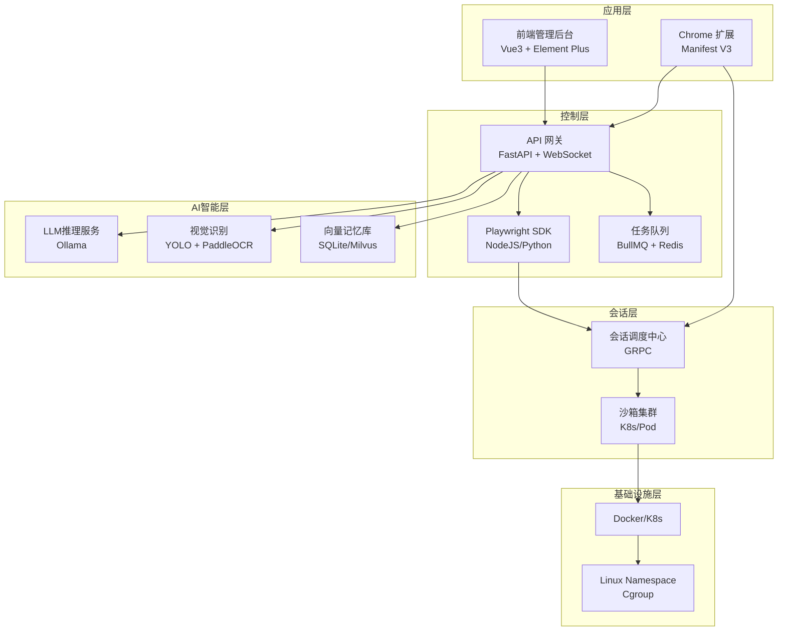

**图表来源**
- [project.md:175-187](file://project.md#L175-L187)
- [main.py:12-27](file://CCC_RPA_API/app/main.py#L12-L27)

**章节来源**
- [project.md:173-187](file://project.md#L173-L187)
- [main.py:12-27](file://CCC_RPA_API/app/main.py#L12-L27)

## 核心功能特性

### 强隔离沙箱会话

#### 技术实现

系统通过多维度隔离确保会话安全性和独立性：

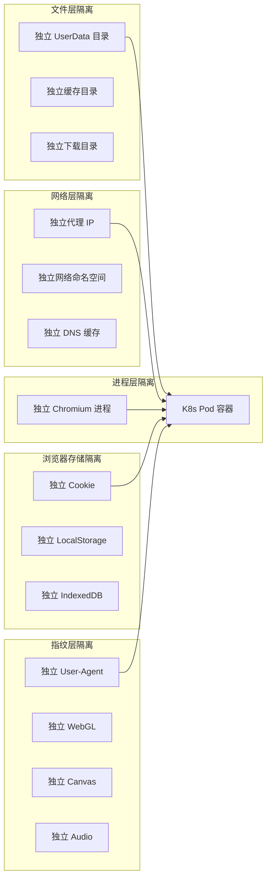

**图表来源**
- [project.md:277-292](file://project.md#L277-L292)

#### 业务价值

- **合规保障**：满足金融、政务等行业的严格隔离要求
- **风险控制**：防止账号关联和数据泄露
- **多租户支持**：确保不同客户数据完全独立

#### 应用场景

- 企业级 RPA 自动化
- 政务服务平台
- 金融数据采集
- 多账号运营场景

**章节来源**
- [project.md:88-96](file://project.md#L88-L96)
- [project.md:277-292](file://project.md#L277-L292)

### 双通路操控体系

#### 技术实现

系统提供两种操控方式，支持双向互通：

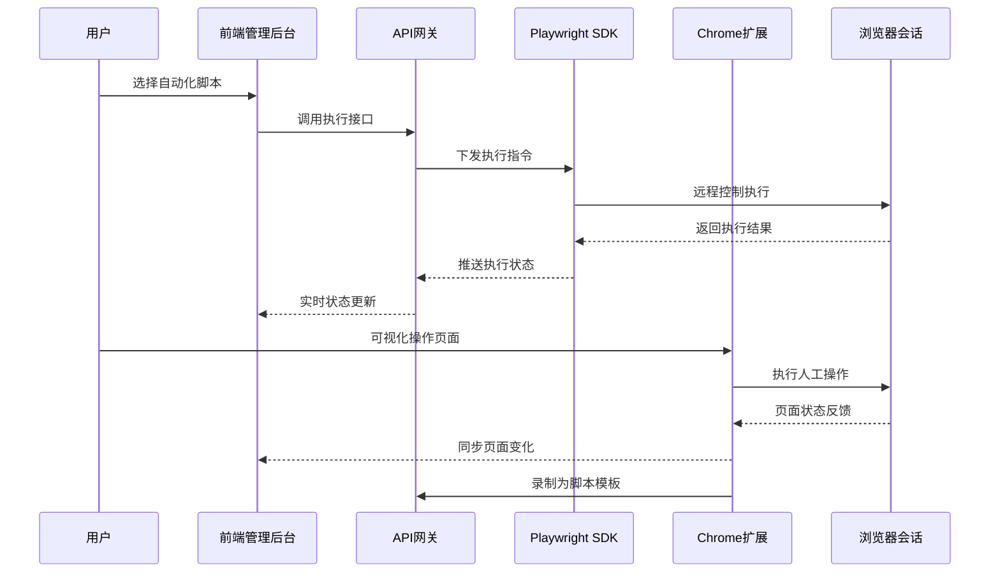

**图表来源**
- [project.md:335-342](file://project.md#L335-L342)
- [executor.py:316-318](file://CCC_RPA_API/app/services/executor.py#L316-L318)

#### 业务价值

- **灵活性**：支持批量自动化和人工精细操作
- **效率提升**：人工操作可转换为标准化脚本
- **质量保证**：人工复核与自动化执行相结合

#### 应用场景

- 复杂表单填写
- 人工审核流程
- 脚本调试和优化
- 业务规则验证

**章节来源**
- [project.md:90-91](file://project.md#L90-L91)
- [project.md:335-342](file://project.md#L335-L342)

### 私有化本地 AI Agent

#### 技术实现

AI Agent 采用本地部署架构，确保数据安全：

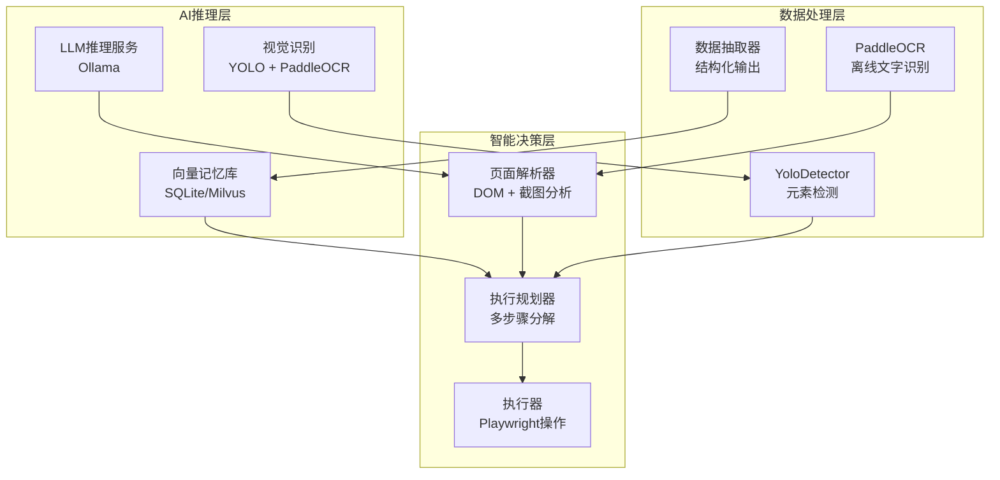

**图表来源**
- [project.md:383-412](file://project.md#L383-L412)

#### 业务价值

- **数据安全**：所有数据在本地处理，不泄露到云端
- **性能稳定**：本地推理响应速度快，不受网络影响
- **成本控制**：避免第三方 API 费用

#### 应用场景

- 自然语言指令解析
- 页面元素自动识别
- 结构化数据抽取
- 业务流程智能决策

**章节来源**
- [project.md:92-93](file://project.md#L92-L93)
- [project.md:383-412](file://project.md#L383-L412)

### 双部署兼容

#### 抜术实现

系统支持两种部署形态，满足不同环境需求：

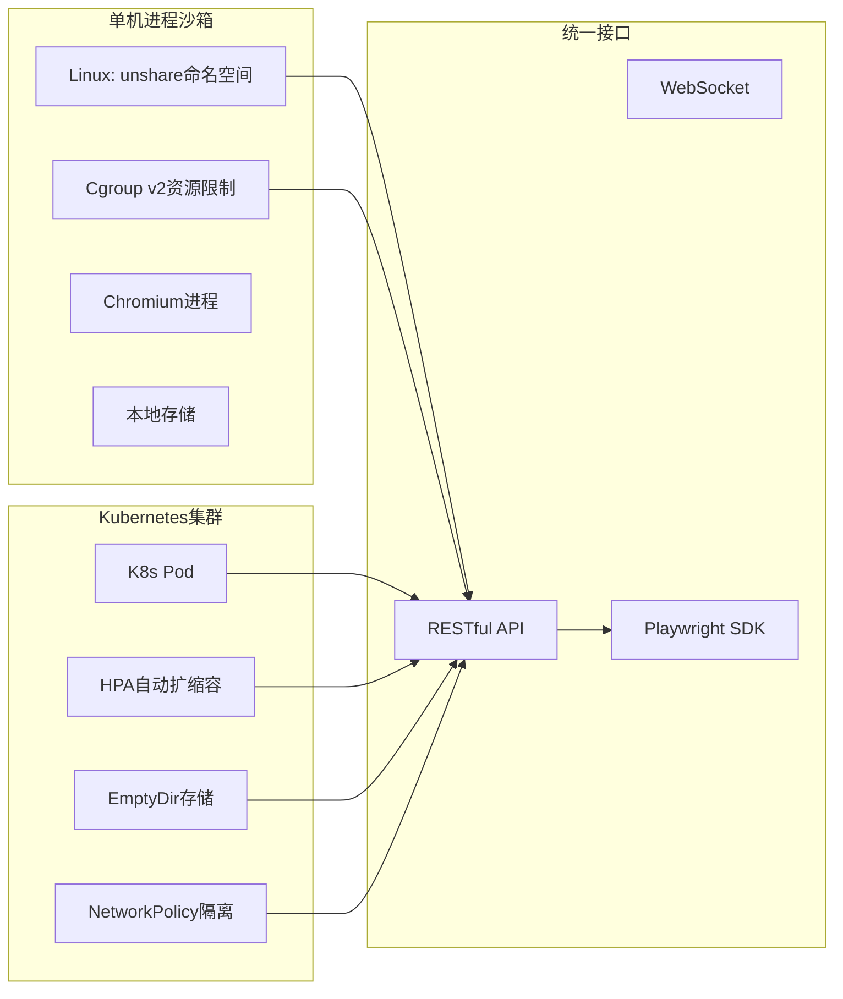

**图表来源**
- [project.md:189-208](file://project.md#L189-L208)

#### 业务价值

- **灵活部署**：支持从小规模测试到大规模生产的无缝迁移
- **成本优化**：根据实际需求选择最优部署方案
- **可靠性保障**：双形态部署降低单一故障风险

#### 应用场景

- 开发测试环境
- 生产部署环境
- 混合云部署
- 边缘计算场景

**章节来源**
- [project.md:94-95](file://project.md#L94-L95)
- [project.md:189-208](file://project.md#L189-L208)

### 商用完整能力

#### 技术实现

系统提供完整的商业级功能集合：

```mermaid
graph TB
subgraph "多租户管理"
Tenant[租户管理<br/>CRUD操作]
RBAC[四级RBAC权限<br/>角色权限控制]
Quota[并发配额<br/>会话数量限制]
end
subgraph "计费统计"
Metrics[指标统计<br/>运行时长/调用次数]
Billing[计费模块<br/>按租户维度]
Report[报表生成<br/>可视化展示]
end
subgraph "审计监控"
Audit[全链路审计<br/>操作日志留存]
Monitor[监控告警<br/>Prometheus+Grafana]
Log[ELK日志<br/>90天留存]
end
subgraph "数据安全"
Encrypt[AES-256加密<br/>会话快照存储]
Isolation[完全隔离<br/>文件/网络/进程]
Cleanup[自动清理<br/>销毁时数据清除]
end
Tenant --> RBAC
RBAC --> Quota
Metrics --> Billing
Billing --> Report
Audit --> Monitor
Monitor --> Log
Encrypt --> Isolation
Isolation --> Cleanup
```

**图表来源**
- [project.md:209-236](file://project.md#L209-L236)

#### 业务价值

- **合规性**：满足各种行业法规要求
- **可管理性**：完善的权限控制和审计机制
- **可扩展性**：支持大规模企业级部署

#### 应用场景

- 金融行业合规要求
- 政府部门监管需求
- 大型企业IT治理
- 多分支机构管理

**章节来源**
- [project.md:96-97](file://project.md#L96-L97)
- [project.md:209-236](file://project.md#L209-L236)

## 架构概览

系统整体架构采用分层设计，各层职责清晰，耦合度低：

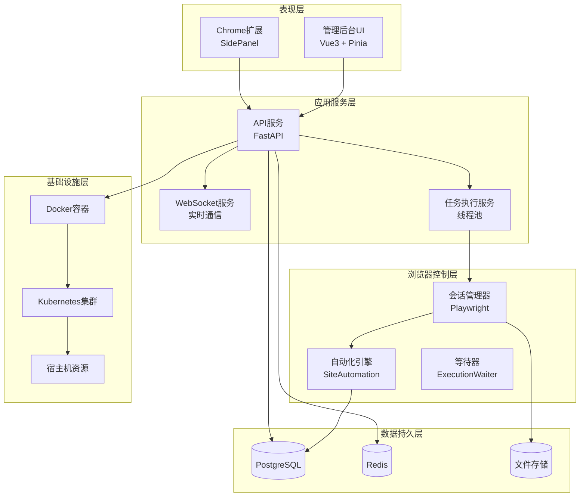

**图表来源**
- [main.py:12-27](file://CCC_RPA_API/app/main.py#L12-L27)
- [session_manager.py:10-28](file://CCC_RPA_API/app/browser/session_manager.py#L10-L28)
- [executor.py:17-20](file://CCC_RPA_API/app/services/executor.py#L17-L20)

**章节来源**
- [project.md:175-187](file://project.md#L175-L187)
- [main.py:12-27](file://CCC_RPA_API/app/main.py#L12-L27)

## 详细组件分析

### 会话管理系统

会话管理系统是整个系统的核心组件，负责浏览器会话的创建、管理和销毁：

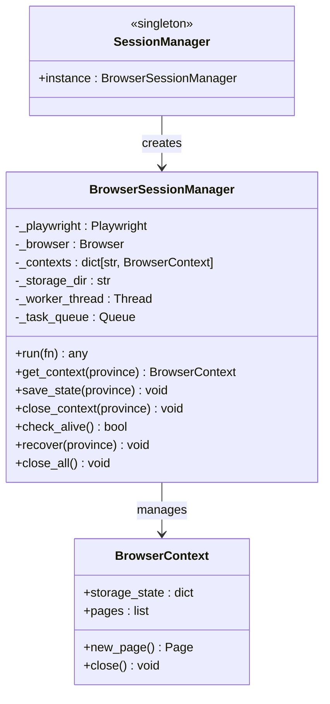

**图表来源**
- [session_manager.py:10-186](file://CCC_RPA_API/app/browser/session_manager.py#L10-L186)

#### 核心特性

- **专用工作线程**：所有 Playwright 操作在专用线程中执行，避免线程冲突
- **持久化存储**：支持会话状态持久化，断线重连后可恢复
- **上下文隔离**：按省份管理不同的浏览器上下文，确保数据隔离
- **自动恢复**：浏览器崩溃时自动恢复会话，保证任务连续性

**章节来源**
- [session_manager.py:10-186](file://CCC_RPA_API/app/browser/session_manager.py#L10-L186)

### 任务执行引擎

任务执行引擎负责协调各个组件完成复杂的自动化任务：

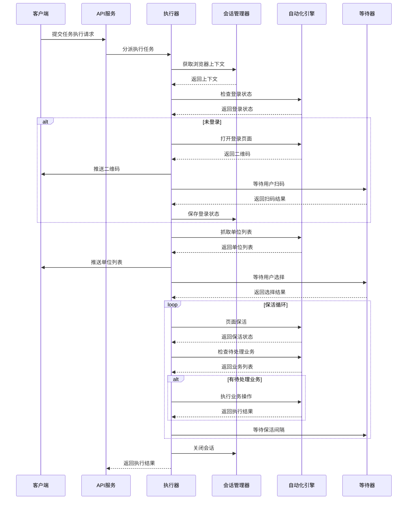

**图表来源**
- [executor.py:78-314](file://CCC_RPA_API/app/services/executor.py#L78-L314)

#### 核心特性

- **线程池管理**：使用线程池处理多个并发任务
- **异常恢复**：浏览器崩溃时自动恢复并重新执行
- **用户交互**：支持扫码登录和人工选择等交互操作
- **保活机制**：长时间保持页面活跃状态，等待业务触发

**章节来源**
- [executor.py:78-314](file://CCC_RPA_API/app/services/executor.py#L78-L314)

### WebSocket 实时通信

系统通过 WebSocket 提供实时状态更新和消息推送：

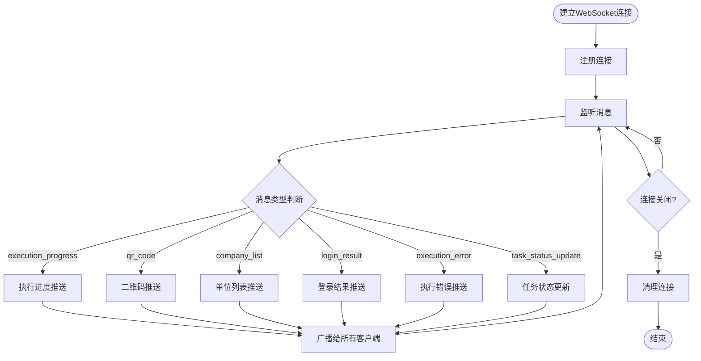

**图表来源**
- [manager.py:5-29](file://CCC_RPA_API/app/ws/manager.py#L5-L29)

#### 核心特性

- **广播机制**：支持向所有连接的客户端推送消息
- **连接管理**：自动处理断开连接和清理无效连接
- **消息路由**：根据消息类型进行相应的业务处理
- **实时反馈**：提供任务执行的实时状态更新

**章节来源**
- [manager.py:5-29](file://CCC_RPA_API/app/ws/manager.py#L5-L29)

## 依赖关系分析

系统各组件之间的依赖关系如下：

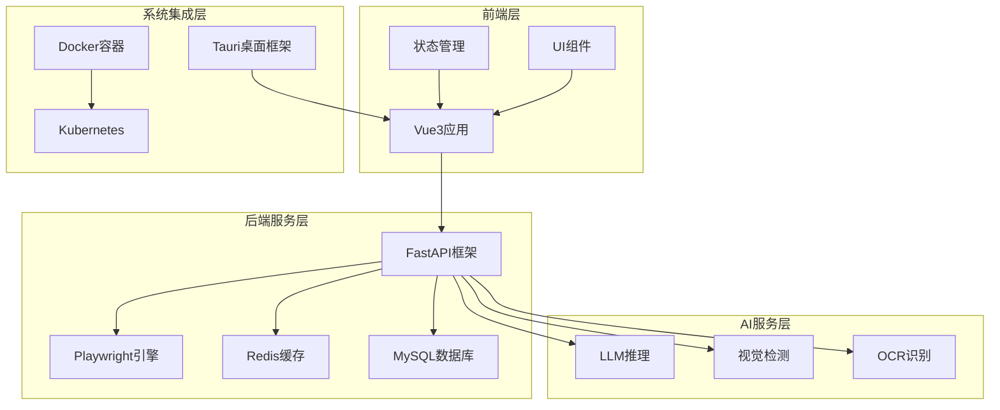

**图表来源**
- [main.ts:1-23](file://CCC-BrowserV4/frontend/src/main.ts#L1-L23)
- [main.py:1-127](file://CCC_RPA_API/app/main.py#L1-L127)
- [docker-compose.yml:1-21](file://CCC-BrowserV4/docker-compose.yml#L1-L21)

**章节来源**
- [main.ts:1-23](file://CCC-BrowserV4/frontend/src/main.ts#L1-L23)
- [main.py:1-127](file://CCC_RPA_API/app/main.py#L1-L127)
- [docker-compose.yml:1-21](file://CCC-BrowserV4/docker-compose.yml#L1-L21)

## 性能考虑

### 并发处理

系统采用多线程和异步处理机制来提高并发性能：

- **线程池管理**：使用 ThreadPoolExecutor 处理任务执行
- **异步WebSocket**：支持大量并发连接的实时通信
- **连接复用**：浏览器会话复用减少资源消耗

### 资源优化

- **内存限制**：设置严格的内存使用上限
- **CPU限制**：控制单会话CPU使用率
- **存储清理**：定期清理临时文件和缓存

### 网络优化

- **代理池管理**：独立代理IP确保网络隔离
- **连接池**：HTTP连接复用减少延迟
- **压缩传输**：WebSocket消息压缩传输

## 故障排除指南

### 常见问题及解决方案

#### 会话创建失败

**症状**：浏览器无法启动或创建会话超时

**排查步骤**：
1. 检查 Chromium 二进制文件完整性
2. 验证系统资源是否充足
3. 确认代理IP池可用性
4. 查看日志文件获取详细错误信息

**解决方案**：
- 重启会话管理服务
- 清理临时文件目录
- 检查防火墙设置
- 增加系统资源限制

#### 自动化执行异常

**症状**：页面元素无法定位或操作失败

**排查步骤**：
1. 检查页面加载状态
2. 验证元素选择器有效性
3. 确认页面结构变化
4. 查看截图获取更多信息

**解决方案**：
- 更新元素选择器策略
- 增加重试机制
- 实施降级处理方案
- 调整等待时间参数

#### WebSocket连接中断

**症状**：实时状态更新丢失或延迟

**排查步骤**：
1. 检查网络连接稳定性
2. 验证服务器负载情况
3. 确认客户端连接状态
4. 查看服务器日志

**解决方案**：
- 实现自动重连机制
- 优化心跳检测频率
- 增加连接池大小
- 调整超时参数设置

**章节来源**
- [project.md:641-657](file://project.md#L641-L657)

## 结论

商用级 AI 浏览器系统通过五个核心功能特性的有机结合，构建了一个功能完整、安全可靠的自动化平台。强隔离沙箱会话确保了数据安全和合规要求；双通路操控体系提供了灵活的操作方式；私有化本地 AI Agent 保证了数据安全和性能稳定；双部署兼容支持了多样化的部署需求；商用完整能力满足了企业级应用的各种要求。

这些特性相互配合，形成了强大的核心竞争力：

1. **安全性**：多维度隔离确保数据安全，符合行业合规要求
2. **灵活性**：双通路操控支持多种业务场景
3. **可靠性**：完善的异常处理和恢复机制
4. **可扩展性**：支持从单机到集群的多种部署形态
5. **智能化**：本地AI推理提供智能决策能力

通过持续的技术创新和架构优化，该系统能够为企业用户提供高效、安全、可靠的 AI 浏览器服务，助力数字化转型和智能化升级。