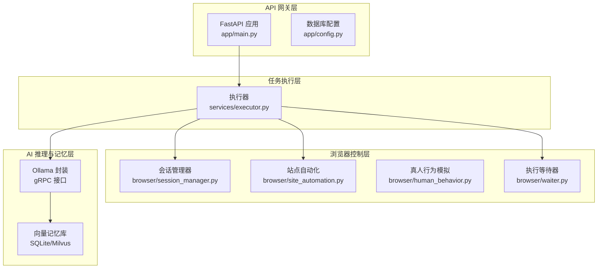
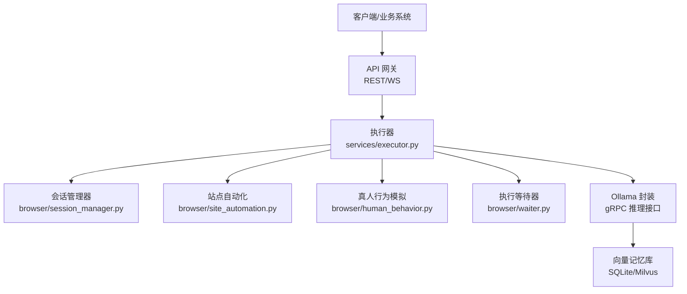
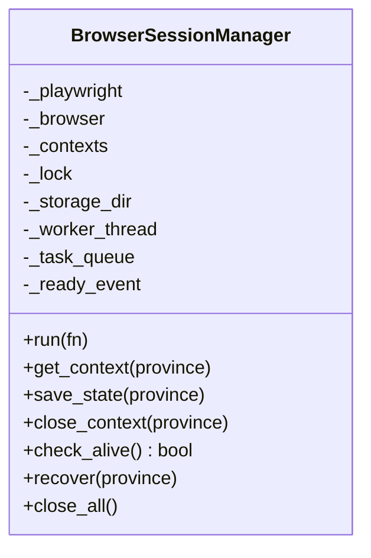
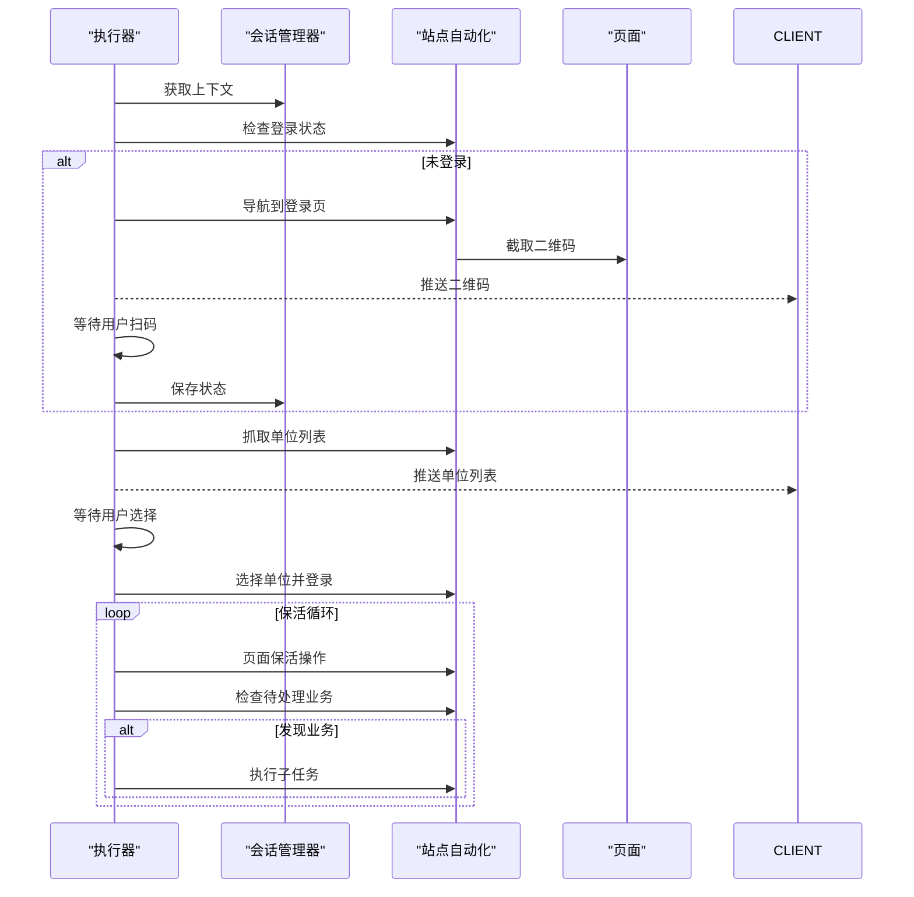
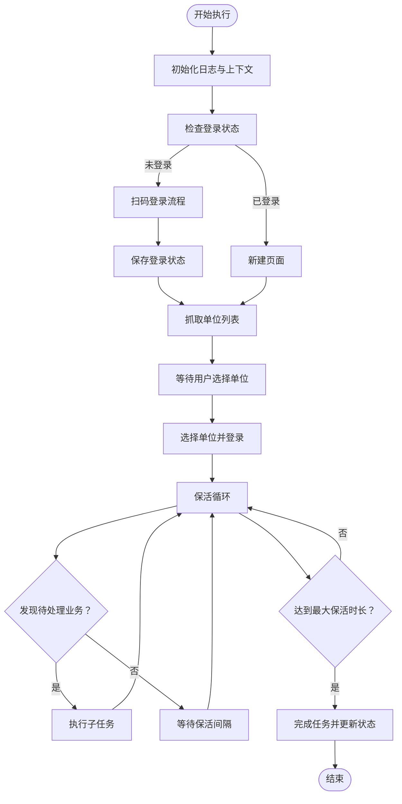
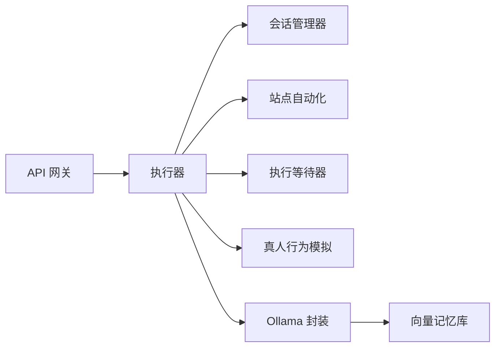

# Ollama LLM 推理服务

<cite>
**本文档引用的文件**
- [main.py](file://CCC_RPA_API/app/main.py)
- [config.py](file://CCC_RPA_API/app/config.py)
- [session_manager.py](file://CCC_RPA_API/app/browser/session_manager.py)
- [site_automation.py](file://CCC_RPA_API/app/browser/site_automation.py)
- [executor.py](file://CCC_RPA_API/app/services/executor.py)
- [human_behavior.py](file://CCC_RPA_API/app/browser/human_behavior.py)
- [waiter.py](file://CCC_RPA_API/app/browser/waiter.py)
- [project.md](file://project.md)
</cite>

## 目录
1. [简介](#简介)
2. [项目结构](#项目结构)
3. [核心组件](#核心组件)
4. [架构总览](#架构总览)
5. [详细组件分析](#详细组件分析)
6. [依赖关系分析](#依赖关系分析)
7. [性能考虑](#性能考虑)
8. [故障排查指南](#故障排查指南)
9. [结论](#结论)
10. [附录](#附录)

## 简介
本文件面向“Ollama LLM 推理服务”的设计与实现，聚焦以下目标：
- 基于 Ollama 封装标准化 gRPC 推理接口，支持 NVIDIA GPU 加速与纯 CPU 离线双模式；
- LLM 指令解析能力：接收自然语言浏览指令，结合页面 DOM 与截图拆解为多步骤标准化 Playwright 操作序列；
- 自适应流程决策：自动识别弹窗、验证码、页面跳转，动态调整后续步骤，支持单步骤失败自动重试；
- 会话级独立 AI 记忆上下文，租户之间记忆完全隔离；
- 提供性能优化建议与 GPU/CPU 模式切换最佳实践。

上述能力在项目需求文档中明确列为“AI 智能驱动微服务层”的核心能力，并与“页面视觉识别模块”“结构化数据抽取模块”“租户独立向量记忆库”协同工作，形成端到端的自然语言驱动浏览器自动化体系。

## 项目结构
本项目采用分层架构，核心围绕“会话调度与浏览器控制层”“AI 推理与记忆层”“业务执行与状态管理”三个维度组织代码。与 LLM 推理服务直接相关的模块包括：
- 会话与浏览器控制：BrowserSessionManager、SiteAutomation、HumanBehavior、ExecutionWaiter
- 任务执行编排：Executor（任务执行器）
- API 网关与配置：FastAPI 应用、数据库配置
- 需求与接口契约：项目需求文档（含 gRPC 接口规范）

**图表来源**
- [main.py:1-127](file://CCC_RPA_API/app/main.py#L1-L127)
- [config.py:1-22](file://CCC_RPA_API/app/config.py#L1-L22)
- [session_manager.py:1-186](file://CCC_RPA_API/app/browser/session_manager.py#L1-L186)
- [site_automation.py:1-743](file://CCC_RPA_API/app/browser/site_automation.py#L1-L743)
- [executor.py:1-319](file://CCC_RPA_API/app/services/executor.py#L1-L319)
- [human_behavior.py:1-86](file://CCC_RPA_API/app/browser/human_behavior.py#L1-L86)
- [waiter.py:1-84](file://CCC_RPA_API/app/browser/waiter.py#L1-L84)

**章节来源**
- [main.py:1-127](file://CCC_RPA_API/app/main.py#L1-L127)
- [config.py:1-22](file://CCC_RPA_API/app/config.py#L1-L22)
- [project.md:383-530](file://project.md#L383-L530)

## 核心组件
- 会话管理器（BrowserSessionManager）：按省份管理 Playwright 浏览器上下文，提供专用工作线程执行、上下文持久化、状态恢复与关闭等能力。
- 站点自动化（SiteAutomation）：针对特定站点的自动化流程封装，包含扫码登录、单位选择、页面保活、待处理业务检测与子任务执行等。
- 执行器（Executor）：任务执行的编排中枢，负责登录检查、二维码推送、用户交互等待、保活循环、业务触发与结果上报。
- 真人行为模拟（HumanBehavior）：模拟人类点击、输入、滚动与等待，降低被风控识别概率。
- 执行等待器（ExecutionWaiter）：基于线程事件的阻塞/取消/检查机制，支撑用户交互与取消信号传递。
- API 网关（FastAPI）：提供 REST/WS 接口，注册路由、CORS 配置、健康检查与 WebSocket 广播。
- 数据库配置（Settings）：提供数据库连接参数与 URL 构造。

**章节来源**
- [session_manager.py:10-186](file://CCC_RPA_API/app/browser/session_manager.py#L10-L186)
- [site_automation.py:16-743](file://CCC_RPA_API/app/browser/site_automation.py#L16-L743)
- [executor.py:78-319](file://CCC_RPA_API/app/services/executor.py#L78-L319)
- [human_behavior.py:12-86](file://CCC_RPA_API/app/browser/human_behavior.py#L12-L86)
- [waiter.py:7-84](file://CCC_RPA_API/app/browser/waiter.py#L7-L84)
- [main.py:12-127](file://CCC_RPA_API/app/main.py#L12-L127)
- [config.py:6-22](file://CCC_RPA_API/app/config.py#L6-L22)

## 架构总览
下图展示了“Ollama LLM 推理服务”在整体系统中的定位与交互关系：

**图表来源**
- [project.md:463-481](file://project.md#L463-L481)
- [executor.py:78-319](file://CCC_RPA_API/app/services/executor.py#L78-L319)
- [session_manager.py:10-186](file://CCC_RPA_API/app/browser/session_manager.py#L10-L186)
- [site_automation.py:16-743](file://CCC_RPA_API/app/browser/site_automation.py#L16-L743)
- [human_behavior.py:12-86](file://CCC_RPA_API/app/browser/human_behavior.py#L12-L86)
- [waiter.py:7-84](file://CCC_RPA_API/app/browser/waiter.py#L7-L84)

## 详细组件分析

### 会话管理器（BrowserSessionManager）
- 专用工作线程：启动 Playwright 与 Chromium，维护任务队列与执行事件，避免与 asyncio 事件循环冲突。
- 上下文管理：按省份维护 BrowserContext，支持 storage_state 持久化与恢复。
- 生命周期控制：提供 get_context、save_state、close_context、check_alive、recover、close_all 等方法。
- 线程安全：使用锁与队列保证多线程安全。

**图表来源**
- [session_manager.py:10-186](file://CCC_RPA_API/app/browser/session_manager.py#L10-L186)

**章节来源**
- [session_manager.py:30-96](file://CCC_RPA_API/app/browser/session_manager.py#L30-L96)
- [session_manager.py:98-186](file://CCC_RPA_API/app/browser/session_manager.py#L98-L186)

### 站点自动化（SiteAutomation）
- 登录流程：检查登录状态、导航到单位登录页、截取二维码、等待扫码成功。
- 单位选择：多策略匹配（文本、data-id、索引）与 JS 回退，确保稳定性。
- 页面保活：随机滚动、随机点击、随机等待、关闭意外弹窗，维持会话活跃。
- 待处理业务检测：通过徽章与关键词识别业务类型与数量。
- 子任务执行：占位实现，后续替换为实际自动化逻辑。

**图表来源**
- [executor.py:78-270](file://CCC_RPA_API/app/services/executor.py#L78-L270)
- [site_automation.py:38-540](file://CCC_RPA_API/app/browser/site_automation.py#L38-L540)

**章节来源**
- [site_automation.py:38-192](file://CCC_RPA_API/app/browser/site_automation.py#L38-L192)
- [site_automation.py:294-540](file://CCC_RPA_API/app/browser/site_automation.py#L294-L540)
- [site_automation.py:557-743](file://CCC_RPA_API/app/browser/site_automation.py#L557-L743)

### 执行器（Executor）
- 任务生命周期：初始化日志、获取上下文、检查登录、扫码登录、保存状态、抓取单位、等待选择、选择单位、保活循环、完成收尾。
- 会话恢复：在关键步骤前检查浏览器存活，异常时自动恢复并重新打开页面。
- 用户交互：通过 ExecutionWaiter 在独立线程中阻塞等待，避免阻塞 Playwright 工作线程。
- 广播通知：通过 WebSocket 向客户端推送进度、二维码、错误与状态更新。

**图表来源**
- [executor.py:78-270](file://CCC_RPA_API/app/services/executor.py#L78-L270)

**章节来源**
- [executor.py:78-319](file://CCC_RPA_API/app/services/executor.py#L78-L319)

### 真人行为模拟（HumanBehavior）
- 模拟点击：移动鼠标到元素中心附近，带随机偏移，随后点击，提升反检测能力。
- 模拟输入：逐字符输入，每个字符间随机延迟。
- 随机滚动：多次滚动，每次滚动距离随机，模拟真实浏览。
- 随机等待：模拟人类阅读等待时间。

**章节来源**
- [human_behavior.py:12-86](file://CCC_RPA_API/app/browser/human_behavior.py#L12-L86)

### 执行等待器（ExecutionWaiter）
- 等待与唤醒：基于 threading.Event 实现阻塞等待与唤醒，支持超时与取消。
- 非阻塞检查：在保活循环等场景中轮询检查取消信号。
- 资源清理：任务完成后清理事件与数据。

**章节来源**
- [waiter.py:7-84](file://CCC_RPA_API/app/browser/waiter.py#L7-L84)

### API 网关与配置
- FastAPI 应用：注册路由、CORS 配置、健康检查、WebSocket 广播。
- 数据库配置：提供 MySQL 连接参数与 URL 构造。

**章节来源**
- [main.py:12-127](file://CCC_RPA_API/app/main.py#L12-L127)
- [config.py:6-22](file://CCC_RPA_API/app/config.py#L6-L22)

## 依赖关系分析
- 执行器依赖会话管理器进行浏览器上下文获取与执行，依赖站点自动化进行页面操作，依赖等待器进行用户交互与取消信号处理。
- 会话管理器依赖 Playwright 启动 Chromium，提供线程安全的执行环境。
- 站点自动化依赖真人行为模拟以降低风控风险。
- API 网关为外部系统提供统一接入点，内部通过 gRPC 与 Ollama 推理服务交互。

**图表来源**
- [executor.py:13-15](file://CCC_RPA_API/app/services/executor.py#L13-L15)
- [session_manager.py:5-7](file://CCC_RPA_API/app/browser/session_manager.py#L5-L7)
- [site_automation.py:5](file://CCC_RPA_API/app/browser/site_automation.py#L5)
- [human_behavior.py:5](file://CCC_RPA_API/app/browser/human_behavior.py#L5)
- [main.py:2-7](file://CCC_RPA_API/app/main.py#L2-L7)

**章节来源**
- [executor.py:13-15](file://CCC_RPA_API/app/services/executor.py#L13-L15)
- [session_manager.py:5-7](file://CCC_RPA_API/app/browser/session_manager.py#L5-L7)
- [site_automation.py:5](file://CCC_RPA_API/app/browser/site_automation.py#L5)
- [human_behavior.py:5](file://CCC_RPA_API/app/browser/human_behavior.py#L5)
- [main.py:2-7](file://CCC_RPA_API/app/main.py#L2-L7)

## 性能考虑
- 线程模型优化
  - 使用专用 Playwright 工作线程执行浏览器操作，避免与 asyncio 事件循环冲突，减少阻塞风险。
  - 在独立线程中执行阻塞等待（如用户扫码），避免占用浏览器工作线程。
- 会话复用与持久化
  - 通过 storage_state 持久化上下文，减少重复登录开销；按省份隔离上下文，避免跨租户干扰。
- 操作节流与随机化
  - 使用真人行为模拟降低被风控概率，同时避免过于频繁的操作导致页面不稳定。
- 超时与恢复
  - 在关键步骤前检查浏览器存活，异常时自动恢复并重新打开页面，保障长时间运行稳定性。
- GPU/CPU 模式切换建议
  - 优先使用 NVIDIA GPU 加速以提升推理吞吐；在资源受限或离线环境下切换至纯 CPU 模式，适当降低并发与批大小。
  - 对于长会话保活场景，合理设置保活间隔与随机波动，平衡稳定性与资源消耗。

[本节为通用性能指导，不直接分析具体文件]

## 故障排查指南
- 浏览器会话异常
  - 现象：页面操作报错提示浏览器已关闭。
  - 处理：执行器会在关键步骤前检查浏览器存活，若异常则自动恢复并重新打开页面；同时记录检查点截图便于定位问题。
- 扫码登录超时
  - 现象：等待用户扫码超时或用户取消。
  - 处理：等待器支持超时与取消信号，执行器根据返回值决定后续流程。
- 单位选择失败
  - 现象：选择单位时找不到匹配元素。
  - 处理：站点自动化提供多策略匹配与 JS 回退方案；失败时保存截图便于调试。
- 保活循环中断
  - 现象：保活过程中收到取消信号或页面异常。
  - 处理：等待器提供非阻塞检查与取消机制，执行器在循环中定期检查并优雅退出。

**章节来源**
- [executor.py:42-70](file://CCC_RPA_API/app/services/executor.py#L42-L70)
- [executor.py:132-140](file://CCC_RPA_API/app/services/executor.py#L132-L140)
- [site_automation.py:38-540](file://CCC_RPA_API/app/browser/site_automation.py#L38-L540)
- [waiter.py:14-33](file://CCC_RPA_API/app/browser/waiter.py#L14-L33)

## 结论
本项目通过“会话管理器 + 站点自动化 + 执行器 + 真人行为模拟 + 执行等待器”的组合，构建了稳定可靠的浏览器自动化执行框架。在此基础上，Ollama LLM 推理服务以 gRPC 形式提供标准化接口，结合页面 DOM 与截图进行自然语言指令解析，实现多步骤 Playwright 操作序列的自动生成与执行。通过会话级独立记忆上下文与租户隔离策略，确保多租户场景下的安全性与稳定性。配合 GPU/CPU 模式的灵活切换与完善的性能优化措施，可在商用环境中实现高效、稳定的 AI 驱动浏览器自动化。

[本节为总结性内容，不直接分析具体文件]

## 附录
- 需求与接口契约要点
  - AI 推理 gRPC 方法：ParsePageTask、ExtractStructData、OCRImage。
  - 内部调度 gRPC 方法：AllocateSessionResource、DestroySession。
  - 会话接口：创建、关闭、执行脚本、下发 AI 指令、获取截图、实时推送日志。
- 性能指标要求
  - 会话创建耗时：集群 ≤3s，单机 ≤1s。
  - AI 单条自然语言指令推理响应：7B 本地模型 ≤1.5s。
  - 单集群稳定并发会话 ≥200，长期运行无持续内存泄漏。
  - API 网关单接口 QPS≥100，WebSocket 在线连接≥1000。

**章节来源**
- [project.md:445-530](file://project.md#L445-L530)
- [project.md:506-517](file://project.md#L506-L517)