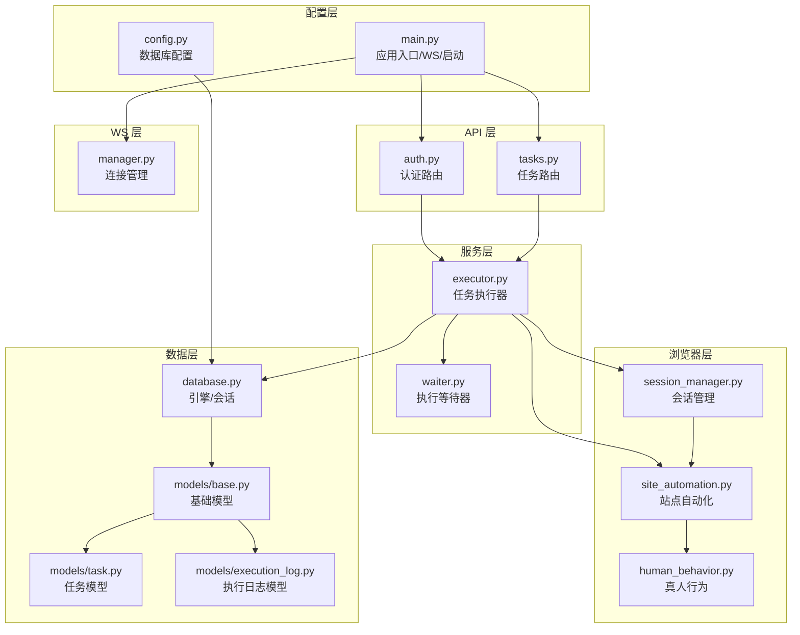
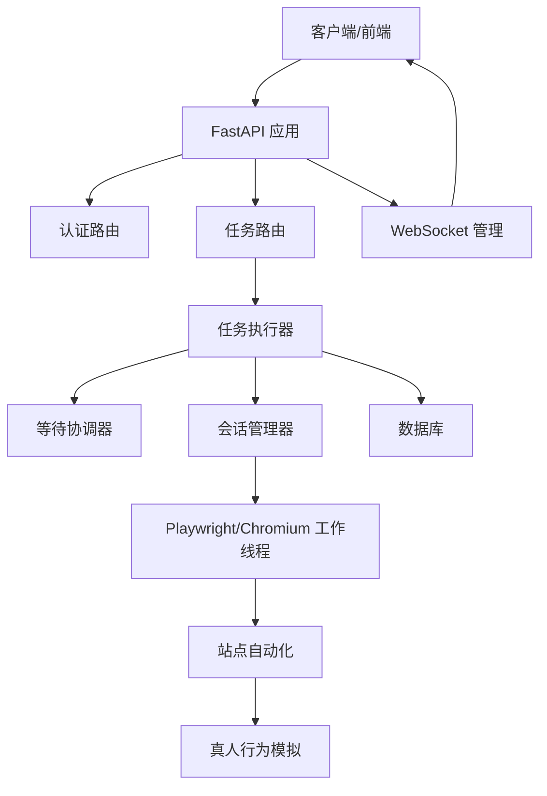
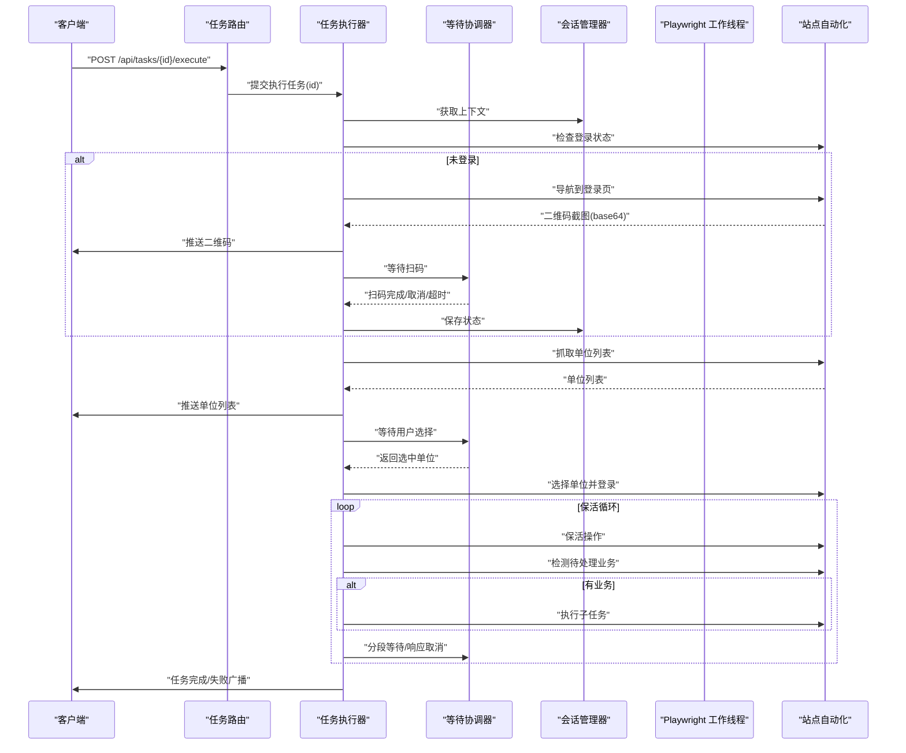
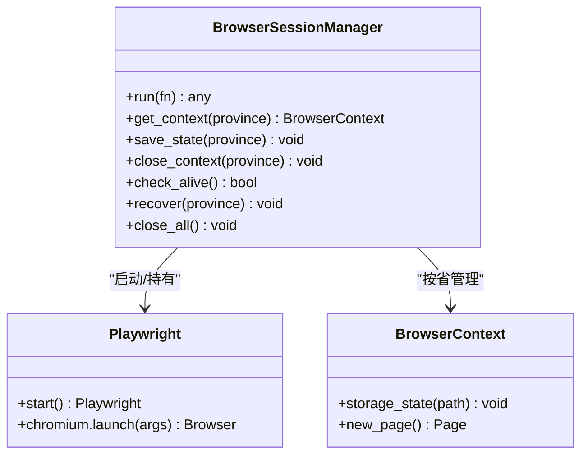
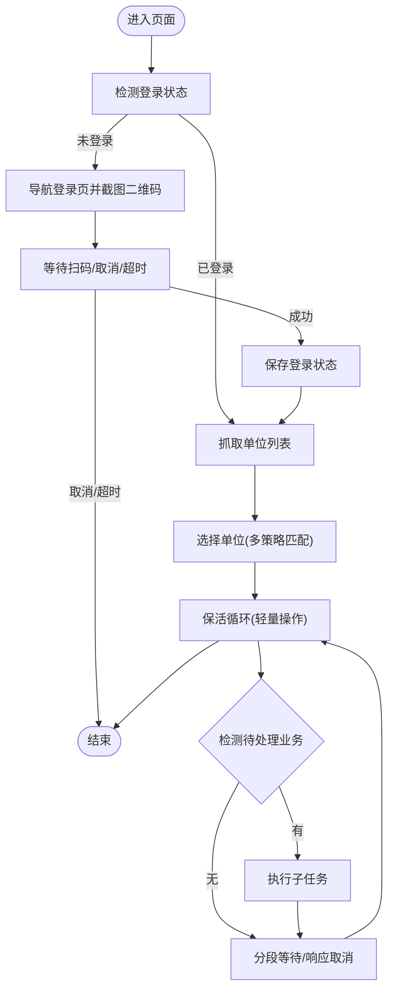
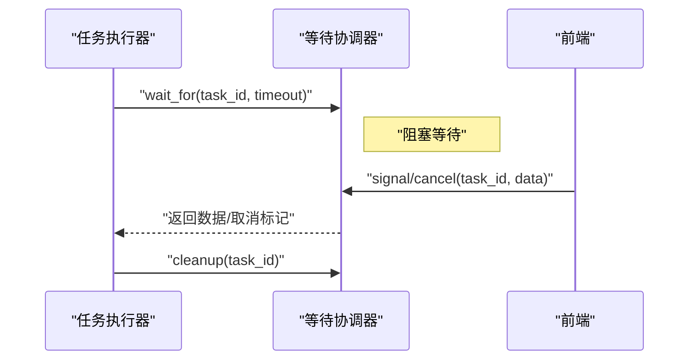
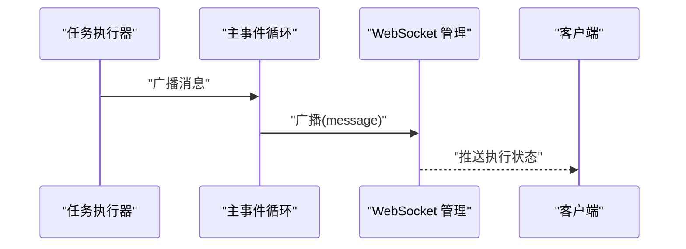
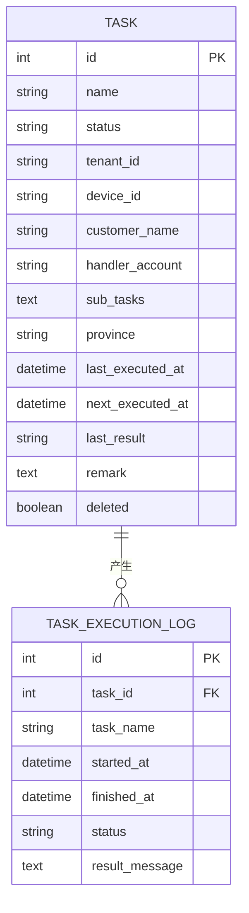
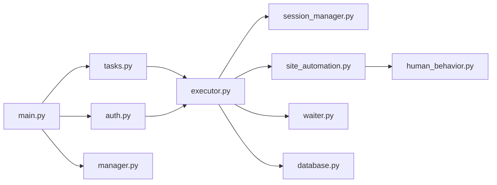

# 私有化本地 AI Agent

<cite>
**本文引用的文件**
- [main.py](file://CCC_RPA_API/app/main.py)
- [config.py](file://CCC_RPA_API/app/config.py)
- [database.py](file://CCC_RPA_API/app/database.py)
- [base.py](file://CCC_RPA_API/app/models/base.py)
- [task.py](file://CCC_RPA_API/app/models/task.py)
- [execution_log.py](file://CCC_RPA_API/app/models/execution_log.py)
- [executor.py](file://CCC_RPA_API/app/services/executor.py)
- [site_automation.py](file://CCC_RPA_API/app/browser/site_automation.py)
- [session_manager.py](file://CCC_RPA_API/app/browser/session_manager.py)
- [waiter.py](file://CCC_RPA_API/app/browser/waiter.py)
- [human_behavior.py](file://CCC_RPA_API/app/browser/human_behavior.py)
- [manager.py](file://CCC_RPA_API/app/ws/manager.py)
- [tasks.py](file://CCC_RPA_API/app/api/tasks.py)
- [auth.py](file://CCC_RPA_API/app/api/auth.py)
- [project.md](file://project.md)
</cite>

## 目录
1. [简介](#简介)
2. [项目结构](#项目结构)
3. [核心组件](#核心组件)
4. [架构总览](#架构总览)
5. [详细组件分析](#详细组件分析)
6. [依赖分析](#依赖分析)
7. [性能考虑](#性能考虑)
8. [故障排查指南](#故障排查指南)
9. [结论](#结论)
10. [附录](#附录)

## 简介
本项目围绕“私有化本地 AI Agent”目标，构建了以浏览器自动化为核心的 RPA 能力底座，并规划引入本地大模型（Ollama）、视觉识别（YOLOv8）、离线 OCR（PaddleOCR）与结构化抽取、向量记忆库等 AI 能力，形成完整的本地化智能代理体系。系统通过 FastAPI 提供 REST/WS 接口，Playwright 驱动 Chromium 实现站点自动化，配合任务调度、执行日志与租户隔离设计，支撑企业级合规与安全的自动化作业。

## 项目结构
后端采用 Python FastAPI，按领域分层组织：
- API 层：路由与请求/响应模型，负责对外暴露任务、认证、执行控制等接口
- 服务层：任务执行、业务编排与等待协调
- 浏览器层：Playwright 会话管理、站点自动化、真人行为模拟
- 数据层：SQLAlchemy ORM、MySQL 连接池与基础模型
- WS 层：WebSocket 连接管理与广播
- 配置层：数据库连接配置

图表来源
- [main.py:12-27](file://CCC_RPA_API/app/main.py#L12-L27)
- [config.py:6-22](file://CCC_RPA_API/app/config.py#L6-L22)
- [database.py:1-19](file://CCC_RPA_API/app/database.py#L1-L19)
- [base.py:7-11](file://CCC_RPA_API/app/models/base.py#L7-L11)
- [task.py:8-25](file://CCC_RPA_API/app/models/task.py#L8-L25)
- [execution_log.py:7-17](file://CCC_RPA_API/app/models/execution_log.py#L7-L17)
- [executor.py:17-33](file://CCC_RPA_API/app/services/executor.py#L17-L33)
- [site_automation.py:16-743](file://CCC_RPA_API/app/browser/site_automation.py#L16-L743)
- [session_manager.py:10-186](file://CCC_RPA_API/app/browser/session_manager.py#L10-L186)
- [waiter.py:7-84](file://CCC_RPA_API/app/browser/waiter.py#L7-L84)
- [human_behavior.py:12-86](file://CCC_RPA_API/app/browser/human_behavior.py#L12-L86)
- [manager.py:5-29](file://CCC_RPA_API/app/ws/manager.py#L5-L29)
- [tasks.py:10-76](file://CCC_RPA_API/app/api/tasks.py#L10-L76)
- [auth.py:7-24](file://CCC_RPA_API/app/api/auth.py#L7-L24)

章节来源
- [main.py:12-27](file://CCC_RPA_API/app/main.py#L12-L27)
- [config.py:6-22](file://CCC_RPA_API/app/config.py#L6-L22)
- [database.py:1-19](file://CCC_RPA_API/app/database.py#L1-19)
- [base.py:7-11](file://CCC_RPA_API/app/models/base.py#L7-L11)
- [task.py:8-25](file://CCC_RPA_API/app/models/task.py#L8-L25)
- [execution_log.py:7-17](file://CCC_RPA_API/app/models/execution_log.py#L7-L17)
- [executor.py:17-33](file://CCC_RPA_API/app/services/executor.py#L17-L33)
- [site_automation.py:16-743](file://CCC_RPA_API/app/browser/site_automation.py#L16-L743)
- [session_manager.py:10-186](file://CCC_RPA_API/app/browser/session_manager.py#L10-L186)
- [waiter.py:7-84](file://CCC_RPA_API/app/browser/waiter.py#L7-L84)
- [human_behavior.py:12-86](file://CCC_RPA_API/app/browser/human_behavior.py#L12-L86)
- [manager.py:5-29](file://CCC_RPA_API/app/ws/manager.py#L5-L29)
- [tasks.py:10-76](file://CCC_RPA_API/app/api/tasks.py#L10-L76)
- [auth.py:7-24](file://CCC_RPA_API/app/api/auth.py#L7-L24)

## 核心组件
- 应用入口与路由
  - FastAPI 应用注册认证、任务、租户、设备路由；配置 CORS；启动时创建数据库表与迁移字段；健康检查与 WebSocket 管理
- 数据层
  - MySQL 连接配置；SQLAlchemy 引擎与会话工厂；基础模型基类；任务与执行日志模型
- 任务执行器
  - 线程池执行任务逻辑；与浏览器会话管理交互；执行进度/错误广播；扫码登录、单位选择、保活循环、业务检测与执行
- 浏览器会话管理
  - 专用工作线程承载 Playwright/Chromium；按省区分上下文；持久化 storage_state；异常恢复与关闭
- 站点自动化
  - 登录状态检查、单位登录页导航、二维码截图、单位列表抓取、单位选择、保活与业务检测、子任务占位执行
- 等待协调
  - 基于 Event 的阻塞/非阻塞等待；支持取消与清理；用于扫码登录与单位选择阶段
- 真人行为模拟
  - 鼠标移动/点击、键盘输入、滚动、随机等待，降低被风控概率
- WebSocket 管理
  - 维护连接、广播消息，供前端实时接收执行状态

章节来源
- [main.py:12-27](file://CCC_RPA_API/app/main.py#L12-L27)
- [main.py:30-102](file://CCC_RPA_API/app/main.py#L30-L102)
- [config.py:6-22](file://CCC_RPA_API/app/config.py#L6-L22)
- [database.py:1-19](file://CCC_RPA_API/app/database.py#L1-L19)
- [base.py:7-11](file://CCC_RPA_API/app/models/base.py#L7-L11)
- [task.py:8-25](file://CCC_RPA_API/app/models/task.py#L8-L25)
- [execution_log.py:7-17](file://CCC_RPA_API/app/models/execution_log.py#L7-L17)
- [executor.py:17-33](file://CCC_RPA_API/app/services/executor.py#L17-L33)
- [executor.py:78-319](file://CCC_RPA_API/app/services/executor.py#L78-L319)
- [session_manager.py:10-186](file://CCC_RPA_API/app/browser/session_manager.py#L10-L186)
- [site_automation.py:16-743](file://CCC_RPA_API/app/browser/site_automation.py#L16-L743)
- [waiter.py:7-84](file://CCC_RPA_API/app/browser/waiter.py#L7-L84)
- [human_behavior.py:12-86](file://CCC_RPA_API/app/browser/human_behavior.py#L12-L86)
- [manager.py:5-29](file://CCC_RPA_API/app/ws/manager.py#L5-L29)

## 架构总览
系统采用“API 服务 + 专用浏览器工作线程”的异步执行架构，确保与 asyncio 事件循环兼容；任务执行器通过会话管理器在独立线程中运行 Playwright 操作，同时通过 WebSocket 实时反馈执行状态。

图表来源
- [main.py:12-27](file://CCC_RPA_API/app/main.py#L12-L27)
- [executor.py:17-33](file://CCC_RPA_API/app/services/executor.py#L17-L33)
- [session_manager.py:10-186](file://CCC_RPA_API/app/browser/session_manager.py#L10-L186)
- [site_automation.py:16-743](file://CCC_RPA_API/app/browser/site_automation.py#L16-L743)
- [waiter.py:7-84](file://CCC_RPA_API/app/browser/waiter.py#L7-L84)
- [manager.py:5-29](file://CCC_RPA_API/app/ws/manager.py#L5-L29)

## 详细组件分析

### 任务执行器（任务编排与执行）
- 职责
  - 在线程池中执行任务生命周期：初始化浏览器、检查登录、扫码登录、保存状态、获取单位列表、等待用户选择、选择单位、保活循环、业务检测与执行、收尾与日志记录
  - 通过 WebSocket 广播执行进度、二维码、错误与状态更新
  - 在独立线程中等待用户扫码/选择，避免阻塞浏览器工作线程
- 关键流程
  - 登录检查与扫码登录：导航到登录页、截图二维码、推送前端、等待用户扫码、保存状态
  - 单位选择：根据名称/ID/索引匹配策略点击单位并尝试点击登录按钮
  - 保活循环：在当前业务页面进行轻量保活，检测待处理业务并执行
- 错误处理
  - 浏览器异常恢复：检查存活、保存检查点截图、重建上下文与页面
  - 任务失败回滚：更新任务状态与日志，广播错误消息

图表来源
- [executor.py:78-319](file://CCC_RPA_API/app/services/executor.py#L78-L319)
- [site_automation.py:38-192](file://CCC_RPA_API/app/browser/site_automation.py#L38-L192)
- [site_automation.py:194-291](file://CCC_RPA_API/app/browser/site_automation.py#L194-L291)
- [site_automation.py:294-540](file://CCC_RPA_API/app/browser/site_automation.py#L294-L540)
- [site_automation.py:557-680](file://CCC_RPA_API/app/browser/site_automation.py#L557-L680)
- [waiter.py:14-32](file://CCC_RPA_API/app/browser/waiter.py#L14-L32)
- [session_manager.py:98-126](file://CCC_RPA_API/app/browser/session_manager.py#L98-L126)

章节来源
- [executor.py:78-319](file://CCC_RPA_API/app/services/executor.py#L78-L319)
- [site_automation.py:38-192](file://CCC_RPA_API/app/browser/site_automation.py#L38-L192)
- [site_automation.py:194-291](file://CCC_RPA_API/app/browser/site_automation.py#L194-L291)
- [site_automation.py:294-540](file://CCC_RPA_API/app/browser/site_automation.py#L294-L540)
- [site_automation.py:557-680](file://CCC_RPA_API/app/browser/site_automation.py#L557-L680)
- [waiter.py:14-32](file://CCC_RPA_API/app/browser/waiter.py#L14-L32)
- [session_manager.py:98-126](file://CCC_RPA_API/app/browser/session_manager.py#L98-L126)

### 浏览器会话管理（Playwright 工作线程）
- 职责
  - 启动专用工作线程与 Chromium；按省维护 BrowserContext；持久化 storage_state；异常恢复；关闭清理
- 设计要点
  - 任务队列 + Event 机制，保证线程安全与超时控制
  - storage_state 文件路径固定，跨进程复用登录态
  - 检测浏览器存活，异常时重建

图表来源
- [session_manager.py:10-186](file://CCC_RPA_API/app/browser/session_manager.py#L10-L186)

章节来源
- [session_manager.py:10-186](file://CCC_RPA_API/app/browser/session_manager.py#L10-L186)

### 站点自动化（页面行为与业务流程）
- 职责
  - 登录状态检查、登录页导航与二维码截图、单位列表抓取、单位选择与登录、保活与业务检测、子任务占位执行
- 适配策略
  - 多选择器降级策略、JS 回退匹配、文本关键词检测、意外弹窗自动关闭
- 保活策略
  - 随机滚动、鼠标移动、键盘 Tab、随机等待；不触发业务动作，避免页面跳转

图表来源
- [site_automation.py:38-192](file://CCC_RPA_API/app/browser/site_automation.py#L38-L192)
- [site_automation.py:194-291](file://CCC_RPA_API/app/browser/site_automation.py#L194-L291)
- [site_automation.py:294-540](file://CCC_RPA_API/app/browser/site_automation.py#L294-L540)
- [site_automation.py:557-680](file://CCC_RPA_API/app/browser/site_automation.py#L557-L680)

章节来源
- [site_automation.py:38-192](file://CCC_RPA_API/app/browser/site_automation.py#L38-L192)
- [site_automation.py:194-291](file://CCC_RPA_API/app/browser/site_automation.py#L194-L291)
- [site_automation.py:294-540](file://CCC_RPA_API/app/browser/site_automation.py#L294-L540)
- [site_automation.py:557-680](file://CCC_RPA_API/app/browser/site_automation.py#L557-L680)

### 等待协调器（阻塞/非阻塞等待）
- 职责
  - 为扫码登录与单位选择阶段提供阻塞等待；支持取消与清理；保活循环中非阻塞检查取消信号
- 机制
  - Event + 线程锁；数据存取与事件分离；注册检查事件用于保活循环

图表来源
- [waiter.py:14-32](file://CCC_RPA_API/app/browser/waiter.py#L14-L32)
- [waiter.py:56-69](file://CCC_RPA_API/app/browser/waiter.py#L56-L69)
- [waiter.py:79-84](file://CCC_RPA_API/app/browser/waiter.py#L79-L84)

章节来源
- [waiter.py:14-32](file://CCC_RPA_API/app/browser/waiter.py#L14-L32)
- [waiter.py:56-69](file://CCC_RPA_API/app/browser/waiter.py#L56-L69)
- [waiter.py:79-84](file://CCC_RPA_API/app/browser/waiter.py#L79-L84)

### WebSocket 管理（实时状态广播）
- 职责
  - 维护连接集合；广播消息；清理断开连接
- 与执行器协作
  - 执行器在工作线程中通过主事件循环安全广播执行进度、二维码、错误与状态更新

图表来源
- [executor.py:22-33](file://CCC_RPA_API/app/services/executor.py#L22-L33)
- [manager.py:17-26](file://CCC_RPA_API/app/ws/manager.py#L17-L26)

章节来源
- [executor.py:22-33](file://CCC_RPA_API/app/services/executor.py#L22-L33)
- [manager.py:17-26](file://CCC_RPA_API/app/ws/manager.py#L17-L26)

### 数据模型与持久化
- 基础模型
  - 统一 created_at/updated_at 字段
- 任务模型
  - 任务元数据、状态、租户/设备标识、省份、计划执行时间、备注、软删除
- 执行日志模型
  - 任务执行起止时间、状态、结果消息
- 数据库配置
  - 通过环境变量读取 MySQL 连接参数

图表来源
- [base.py:7-11](file://CCC_RPA_API/app/models/base.py#L7-L11)
- [task.py:8-25](file://CCC_RPA_API/app/models/task.py#L8-L25)
- [execution_log.py:7-17](file://CCC_RPA_API/app/models/execution_log.py#L7-L17)

章节来源
- [base.py:7-11](file://CCC_RPA_API/app/models/base.py#L7-L11)
- [task.py:8-25](file://CCC_RPA_API/app/models/task.py#L8-L25)
- [execution_log.py:7-17](file://CCC_RPA_API/app/models/execution_log.py#L7-L17)
- [config.py:6-22](file://CCC_RPA_API/app/config.py#L6-L22)
- [database.py:1-19](file://CCC_RPA_API/app/database.py#L1-L19)

### API 路由与认证
- 认证路由
  - 登录、登出、校验
- 任务路由
  - 列表、创建、查询、更新、删除、执行、日志查询、扫码完成、选择单位、取消执行
- 与等待协调器集成
  - 扫码完成与选择单位通过 signal 发送数据，取消执行通过 cancel

章节来源
- [auth.py:7-24](file://CCC_RPA_API/app/api/auth.py#L7-L24)
- [tasks.py:10-76](file://CCC_RPA_API/app/api/tasks.py#L10-L76)
- [waiter.py:34-54](file://CCC_RPA_API/app/browser/waiter.py#L34-L54)

## 依赖分析
- 组件耦合
  - 任务执行器强依赖会话管理器与站点自动化；等待协调器被任务执行器与 API 路由共同使用
  - 浏览器层与数据层通过会话管理器间接耦合
- 外部依赖
  - Playwright/Chromium、MySQL、WebSocket、FastAPI
- 循环依赖
  - 未发现直接循环依赖；各层职责清晰

图表来源
- [tasks.py:10-76](file://CCC_RPA_API/app/api/tasks.py#L10-L76)
- [auth.py:7-24](file://CCC_RPA_API/app/api/auth.py#L7-L24)
- [executor.py:17-33](file://CCC_RPA_API/app/services/executor.py#L17-L33)
- [session_manager.py:10-186](file://CCC_RPA_API/app/browser/session_manager.py#L10-L186)
- [site_automation.py:16-743](file://CCC_RPA_API/app/browser/site_automation.py#L16-L743)
- [waiter.py:7-84](file://CCC_RPA_API/app/browser/waiter.py#L7-L84)
- [database.py:1-19](file://CCC_RPA_API/app/database.py#L1-L19)
- [human_behavior.py:12-86](file://CCC_RPA_API/app/browser/human_behavior.py#L12-L86)
- [main.py:12-27](file://CCC_RPA_API/app/main.py#L12-L27)
- [manager.py:5-29](file://CCC_RPA_API/app/ws/manager.py#L5-L29)

章节来源
- [tasks.py:10-76](file://CCC_RPA_API/app/api/tasks.py#L10-L76)
- [auth.py:7-24](file://CCC_RPA_API/app/api/auth.py#L7-L24)
- [executor.py:17-33](file://CCC_RPA_API/app/services/executor.py#L17-L33)
- [session_manager.py:10-186](file://CCC_RPA_API/app/browser/session_manager.py#L10-L186)
- [site_automation.py:16-743](file://CCC_RPA_API/app/browser/site_automation.py#L16-L743)
- [waiter.py:7-84](file://CCC_RPA_API/app/browser/waiter.py#L7-L84)
- [database.py:1-19](file://CCC_RPA_API/app/database.py#L1-19)
- [human_behavior.py:12-86](file://CCC_RPA_API/app/browser/human_behavior.py#L12-L86)
- [main.py:12-27](file://CCC_RPA_API/app/main.py#L12-L27)
- [manager.py:5-29](file://CCC_RPA_API/app/ws/manager.py#L5-L29)

## 性能考虑
- 线程模型
  - 专用浏览器工作线程避免与 asyncio 冲突；线程池执行任务逻辑，减少阻塞
- I/O 与网络
  - 本地化部署，尽量减少外部网络依赖；二维码截图与状态持久化使用本地文件
- 超时与恢复
  - Playwright 操作超时保护；浏览器异常自动恢复；保活循环分段等待便于响应取消
- 数据库
  - 连接池配置与预热；迁移字段幂等处理；任务与日志模型索引优化

## 故障排查指南
- 浏览器异常
  - 现象：页面定位失败、元素不可见、浏览器关闭
  - 处理：检查存活状态，保存检查点截图，重建上下文与页面
- 登录失败
  - 现象：二维码未加载、扫码超时、登录页跳转失败
  - 处理：确认登录页导航策略、等待扫码、必要时降级截图
- 单位选择失败
  - 现象：CSS 选择器匹配不到、JS 回退失败
  - 处理：检查多策略匹配逻辑、保存失败截图、调整匹配权重
- 执行卡住
  - 现象：保活循环长时间无业务、等待超时
  - 处理：检查取消信号、分段等待、缩短等待轮询

章节来源
- [executor.py:42-70](file://CCC_RPA_API/app/services/executor.py#L42-L70)
- [site_automation.py:38-58](file://CCC_RPA_API/app/browser/site_automation.py#L38-L58)
- [site_automation.py:294-540](file://CCC_RPA_API/app/browser/site_automation.py#L294-L540)
- [waiter.py:14-32](file://CCC_RPA_API/app/browser/waiter.py#L14-L32)

## 结论
本项目以浏览器自动化为核心，结合专用线程模型与等待协调机制，实现了稳定的企业级 RPA 能力。面向未来，可在现有基础上接入本地大模型（Ollama）、视觉识别（YOLOv8）与离线 OCR（PaddleOCR）、结构化抽取与向量记忆库，形成完整的私有化本地 AI Agent 生态，满足合规、安全与高可用需求。

## 附录
- AI 能力规划与要求
  - LLM 自然语言解析：接收自然语言浏览指令，结合 DOM+截图拆解多步骤标准化 Playwright 操作序列，自适应流程决策，自动识别弹窗/验证码/页面跳转，动态调整后续步骤，支持单步骤失败自动重试
  - 视觉识别：YOLOv8 离线元素检测（按钮/输入框/提交控件/弹窗/验证码区域），标准化坐标输出；PaddleOCR 离线文字识别（页面全文/验证码字符）
  - 结构化数据抽取：接收 DOM、截图与自定义规则，输出标准 JSON（表格/商品/表单/订单）
  - 租户独立向量记忆库：单机 SQLite、集群 Milvus；会话销毁自动清理临时记忆，持久化记忆加密绑定租户 ID

章节来源
- [project.md:383-406](file://project.md#L383-L406)
- [project.md:407-411](file://project.md#L407-L411)