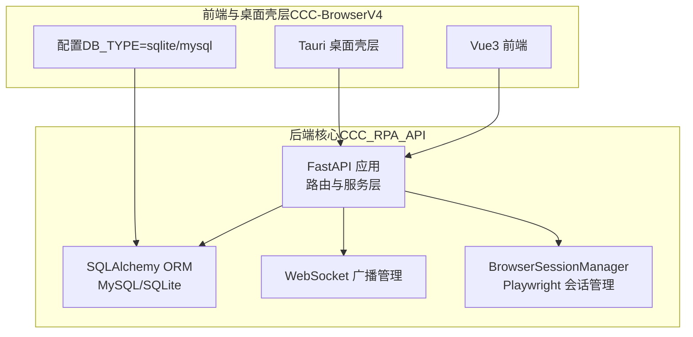
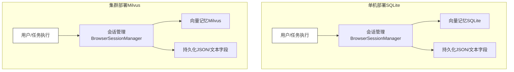
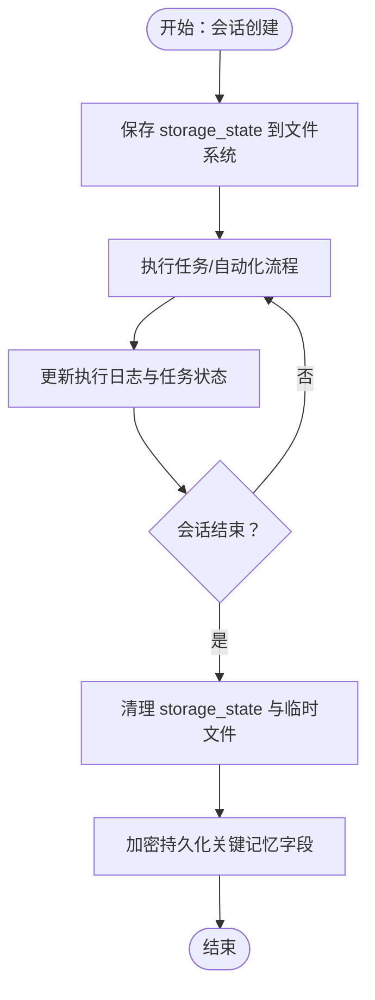
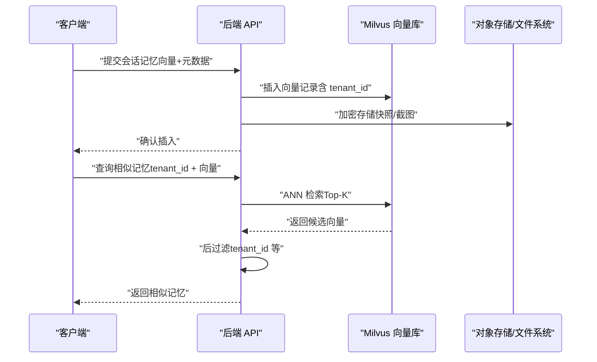
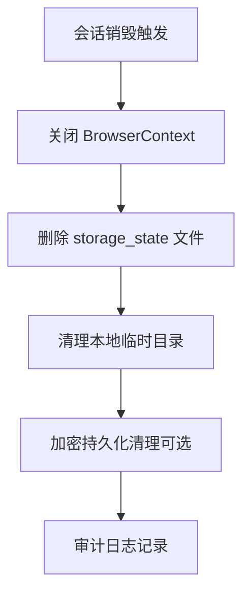
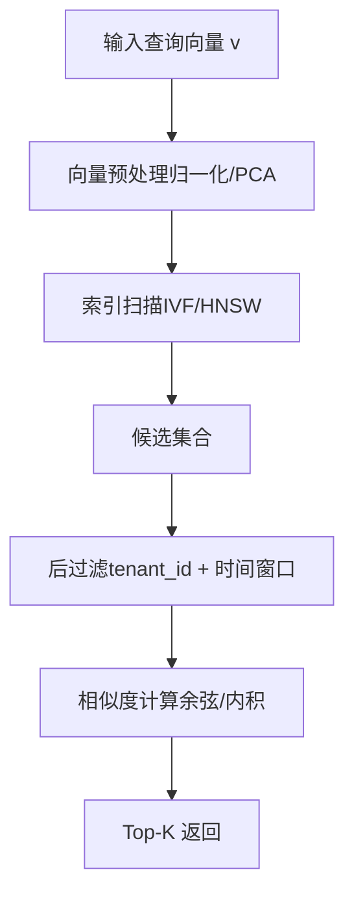
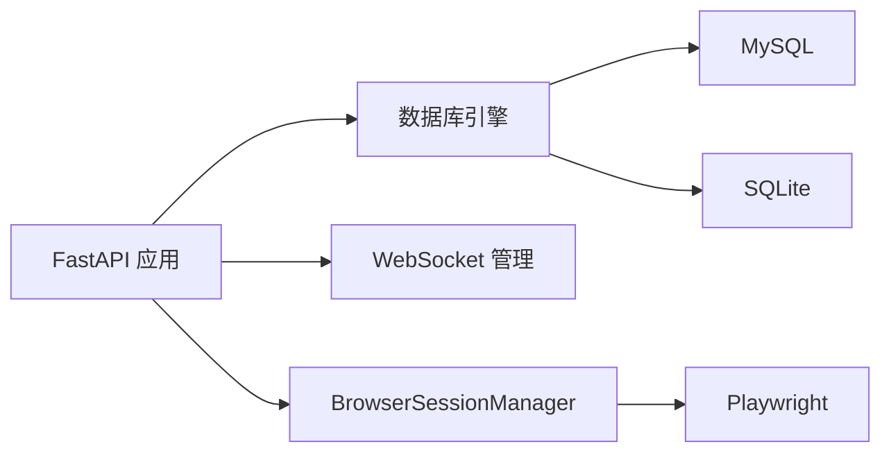

# 租户独立向量记忆库

<cite>
**本文引用的文件**
- [main.py](file://CCC_RPA_API/app/main.py)
- [config.py](file://CCC_RPA_API/app/config.py)
- [database.py](file://CCC_RPA_API/app/database.py)
- [base.py](file://CCC_RPA_API/app/models/base.py)
- [task.py](file://CCC_RPA_API/app/models/task.py)
- [execution_log.py](file://CCC_RPA_API/app/models/execution_log.py)
- [tenants.py](file://CCC_RPA_API/app/api/tenants.py)
- [site_automation.py](file://CCC_RPA_API/app/browser/site_automation.py)
- [session_manager.py](file://CCC_RPA_API/app/browser/session_manager.py)
- [project.md](file://project.md)
- [config.py](file://CCC-BrowserV4/backend/app/config.py)
</cite>

## 目录
1. [简介](#简介)
2. [项目结构](#项目结构)
3. [核心组件](#核心组件)
4. [架构总览](#架构总览)
5. [详细组件分析](#详细组件分析)
6. [依赖分析](#依赖分析)
7. [性能考虑](#性能考虑)
8. [故障排查指南](#故障排查指南)
9. [结论](#结论)
10. [附录](#附录)

## 简介
本文件围绕“租户独立向量记忆库”的设计与实现展开，结合现有代码库与项目文档，给出面向单机部署（SQLite）与集群部署（Milvus）两种场景下的技术方案对比，阐明会话销毁自动清理临时记忆、持久化记忆加密绑定租户ID的安全理念，并对向量记忆的存储结构、查询算法、相似度计算等核心技术进行深入解析。同时，提供性能优化与扩展性设计建议，帮助在多租户环境下实现安全、稳定、可扩展的记忆系统。

## 项目结构
- 后端核心（Python FastAPI + Playwright）位于 CCC_RPA_API，负责任务执行、会话管理、数据库交互与WebSocket广播。
- 前端与桌面壳层位于 CCC-BrowserV4，提供用户界面与设备标识管理。
- 项目文档 project.md 提供了整体架构、安全策略与数据存储规范，是本设计的重要依据。

图表来源
- [main.py:1-127](file://CCC_RPA_API/app/main.py#L1-L127)
- [config.py:1-22](file://CCC_RPA_API/app/config.py#L1-L22)
- [database.py:1-19](file://CCC_RPA_API/app/database.py#L1-L19)
- [config.py:1-52](file://CCC-BrowserV4/backend/app/config.py#L1-L52)

章节来源
- [main.py:1-127](file://CCC_RPA_API/app/main.py#L1-L127)
- [config.py:1-22](file://CCC_RPA_API/app/config.py#L1-L22)
- [database.py:1-19](file://CCC_RPA_API/app/database.py#L1-L19)
- [config.py:1-52](file://CCC-BrowserV4/backend/app/config.py#L1-L52)

## 核心组件
- 数据库与模型
  - 数据库连接与会话：MySQL（默认）与 SQLite（可选）。
  - 任务模型与执行日志模型承载会话记忆的持久化载体。
- 会话管理
  - BrowserSessionManager 使用 Playwright 在专用线程中管理按省份隔离的浏览器上下文，支持状态持久化与恢复。
- 租户管理
  - 租户列表接口与租户字段（tenant_id）贯穿任务与会话生命周期，确保数据隔离与安全。
- WebSocket 广播
  - 实时状态与日志推送，便于前端展示与用户交互。
- 项目文档支撑
  - 明确了 AES-256-CBC 加密存储、会话销毁递归清理、私有化本地部署等安全与合规要求。

章节来源
- [config.py:1-22](file://CCC_RPA_API/app/config.py#L1-L22)
- [database.py:1-19](file://CCC_RPA_API/app/database.py#L1-L19)
- [task.py:1-25](file://CCC_RPA_API/app/models/task.py#L1-L25)
- [execution_log.py:1-17](file://CCC_RPA_API/app/models/execution_log.py#L1-L17)
- [tenants.py:1-24](file://CCC_RPA_API/app/api/tenants.py#L1-L24)
- [session_manager.py:1-186](file://CCC_RPA_API/app/browser/session_manager.py#L1-L186)
- [project.md:925-1333](file://project.md#L925-L1333)

## 架构总览
下图展示了向量记忆库在单机与集群两种部署形态下的差异与共性：

图表来源
- [session_manager.py:1-186](file://CCC_RPA_API/app/browser/session_manager.py#L1-L186)
- [config.py:1-52](file://CCC-BrowserV4/backend/app/config.py#L1-L52)
- [project.md:925-1333](file://project.md#L925-L1333)

## 详细组件分析

### 单机部署：SQLite 存储单租户会话记忆
- 存储介质
  - 通过配置项 DB_TYPE 控制数据库类型，SQLite 适合单机与演示场景。
- 会话记忆载体
  - 任务模型与执行日志模型可作为会话记忆的持久化基础；结合 BrowserSessionManager 的 storage_state 持久化，形成“临时记忆 + 持久化记忆”的组合。
- 自动清理机制
  - 会话销毁时，应同步清理 storage_state 文件与相关临时数据，确保无残留。
- 安全设计
  - 结合项目文档的 AES-256-CBC 加密策略，对敏感会话快照与持久化字段进行加密存储。

图表来源
- [session_manager.py:128-144](file://CCC_RPA_API/app/browser/session_manager.py#L128-L144)
- [task.py:1-25](file://CCC_RPA_API/app/models/task.py#L1-L25)
- [execution_log.py:1-17](file://CCC_RPA_API/app/models/execution_log.py#L1-L17)
- [project.md:925-1333](file://project.md#L925-L1333)

章节来源
- [config.py:1-52](file://CCC-BrowserV4/backend/app/config.py#L1-L52)
- [session_manager.py:1-186](file://CCC_RPA_API/app/browser/session_manager.py#L1-L186)
- [task.py:1-25](file://CCC_RPA_API/app/models/task.py#L1-L25)
- [execution_log.py:1-17](file://CCC_RPA_API/app/models/execution_log.py#L1-L17)
- [project.md:925-1333](file://project.md#L925-L1333)

### 集群部署：Milvus 向量库
- 存储介质
  - Milvus 作为分布式向量数据库，支持高维向量索引与近似最近邻检索，适合大规模多租户场景。
- 向量记忆结构
  - 向量维度与字段设计需结合业务语义（如页面截图特征、DOM 结构向量化、OCR 文本嵌入等）。
  - 每条向量记录包含租户标识（tenant_id）、会话标识（session_id）、时间戳、向量向量、元数据（JSON）等。
- 查询与相似度
  - 使用 ANN 检索（如 IVF_FLAT、HNSW），相似度计算采用余弦距离或内积归一化后的欧氏距离。
  - 支持过滤查询（filter by tenant_id）与 Top-K 返回。
- 安全与隔离
  - 通过租户 ID 与命名空间隔离实现物理隔离；结合访问控制与加密传输保障数据安全。

图表来源
- [project.md:925-1333](file://project.md#L925-L1333)

章节来源
- [project.md:925-1333](file://project.md#L925-L1333)

### 会话销毁与自动清理
- 临时记忆清理
  - 会话销毁时，BrowserSessionManager 关闭上下文并清理 storage_state；同时清理本地临时文件与缓存。
- 持久化记忆加密
  - 对任务与日志中的敏感字段进行 AES-256-CBC 加密，密钥与租户绑定，确保跨会话不可复用。
- 递归清理策略
  - 清理范围覆盖 UserData、缓存、下载目录、扩展本地存储，杜绝账号与 Cookie 残留。

图表来源
- [session_manager.py:172-186](file://CCC_RPA_API/app/browser/session_manager.py#L172-L186)
- [project.md:925-1333](file://project.md#L925-L1333)

章节来源
- [session_manager.py:1-186](file://CCC_RPA_API/app/browser/session_manager.py#L1-L186)
- [project.md:925-1333](file://project.md#L925-L1333)

### 向量记忆存储结构、查询算法与相似度
- 存储结构
  - 向量字段：高维浮点数组（如 768/1024 维）。
  - 元数据字段：tenant_id、session_id、timestamp、page_type、task_id、source_url 等。
  - 索引字段：tenant_id、timestamp、page_type 等，支持高效过滤与排序。
- 查询算法
  - ANN 检索：IVF_FLAT/HNSW/PQ 等，平衡精度与性能。
  - 后过滤：先粗排再细筛，减少回表成本。
- 相似度计算
  - 余弦距离或内积归一化后的欧氏距离；向量预处理（归一化/PCA）提升稳定性。
- 安全与合规
  - 租户隔离：物理分桶/命名空间 + 访问控制。
  - 数据脱敏：敏感字段加密存储，最小化可见范围。

图表来源
- [project.md:925-1333](file://project.md#L925-L1333)

章节来源
- [project.md:925-1333](file://project.md#L925-L1333)

### 安全设计理念：加密与租户绑定
- 加密策略
  - 会话快照与敏感字段采用 AES-256-CBC 加密，密钥与租户绑定，实现“租户内可解密、跨租户不可解”。
- 访问控制
  - 通过租户 ID 与命名空间实现物理隔离，避免横向越权。
- 合规要求
  - 私有化本地部署，禁止调用第三方公有大模型 API；禁用全局共享磁盘缓存与预连接池，防止跨会话指纹泄露。

章节来源
- [project.md:925-1333](file://project.md#L925-L1333)

## 依赖分析
- 组件耦合
  - FastAPI 应用依赖数据库引擎与会话管理器；会话管理器依赖 Playwright；前端通过 WebSocket 与后端交互。
- 外部依赖
  - MySQL/SQLite、Milvus、Playwright、Cryptography（加密）等。
- 潜在风险
  - 数据库迁移与字段演进需谨慎；向量索引与查询参数需随业务增长动态调整。

图表来源
- [main.py:1-127](file://CCC_RPA_API/app/main.py#L1-L127)
- [database.py:1-19](file://CCC_RPA_API/app/database.py#L1-L19)
- [session_manager.py:1-186](file://CCC_RPA_API/app/browser/session_manager.py#L1-L186)

章节来源
- [main.py:1-127](file://CCC_RPA_API/app/main.py#L1-L127)
- [database.py:1-19](file://CCC_RPA_API/app/database.py#L1-L19)
- [session_manager.py:1-186](file://CCC_RPA_API/app/browser/session_manager.py#L1-L186)

## 性能考虑
- 单机 SQLite
  - 适用低并发与小规模数据；注意 I/O 与锁竞争；必要时拆分表或引入只读副本。
- 集群 Milvus
  - 索引选择：根据向量规模与延迟目标选择 IVF/HNSW/PQ；定期 rebuild 索引与 compact segment。
  - 查询优化：合理设置 nq、top_k、ef/nprobe；开启后过滤减少回表。
  - 存储与网络：对象存储与向量库分离，降低网络抖动影响。
- 会话与任务
  - 会话池化与复用，避免频繁创建销毁；批量化日志写入与异步持久化。
- 安全与性能平衡
  - 加密与压缩需评估 CPU 开销；对热点数据可采用透明加密（TDE）或硬件加速。

## 故障排查指南
- 会话初始化失败
  - 检查 Playwright 工作线程是否就绪；确认 storage_state 文件是否存在与可读。
- 数据库迁移异常
  - 核对 ALTER TABLE 语句与字段类型；确保事务一致性。
- 向量检索异常
  - 检查索引构建状态与数据导入进度；确认查询参数（nq/top_k/ef/nprobe）合理。
- 加密解密失败
  - 核对租户密钥与字段加密策略；确认密钥轮换与兼容性。

章节来源
- [session_manager.py:30-78](file://CCC_RPA_API/app/browser/session_manager.py#L30-L78)
- [main.py:41-86](file://CCC_RPA_API/app/main.py#L41-L86)
- [project.md:925-1333](file://project.md#L925-L1333)

## 结论
通过将租户 ID 与向量记忆深度绑定，结合会话销毁自动清理与 AES-256-CBC 加密策略，可在单机 SQLite 与集群 Milvus 两种部署形态下实现安全、可控、可扩展的向量记忆系统。在实际落地中，应根据业务规模与性能目标选择合适的索引与参数，并持续优化查询与存储策略以满足多租户场景下的高并发与高可用需求。

## 附录
- 术语
  - 向量记忆：以向量形式存储的会话经验与上下文，支持相似度检索。
  - 租户隔离：通过租户 ID 与命名空间实现物理与逻辑隔离。
  - ANN：近似最近邻检索，用于高维向量的快速相似度计算。
- 参考
  - 项目文档中关于安全、加密与会话销毁的规范与要求。