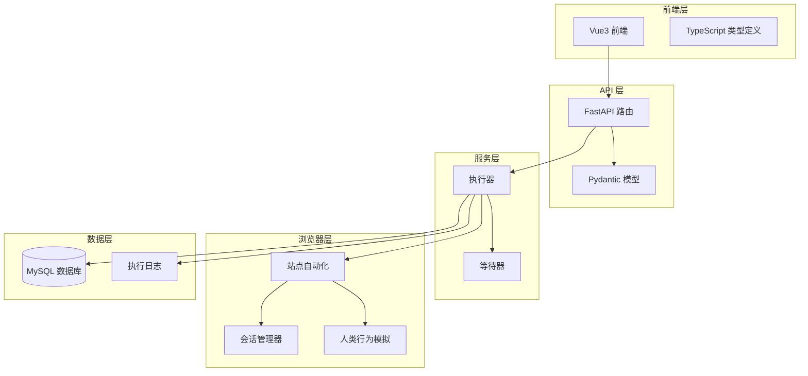
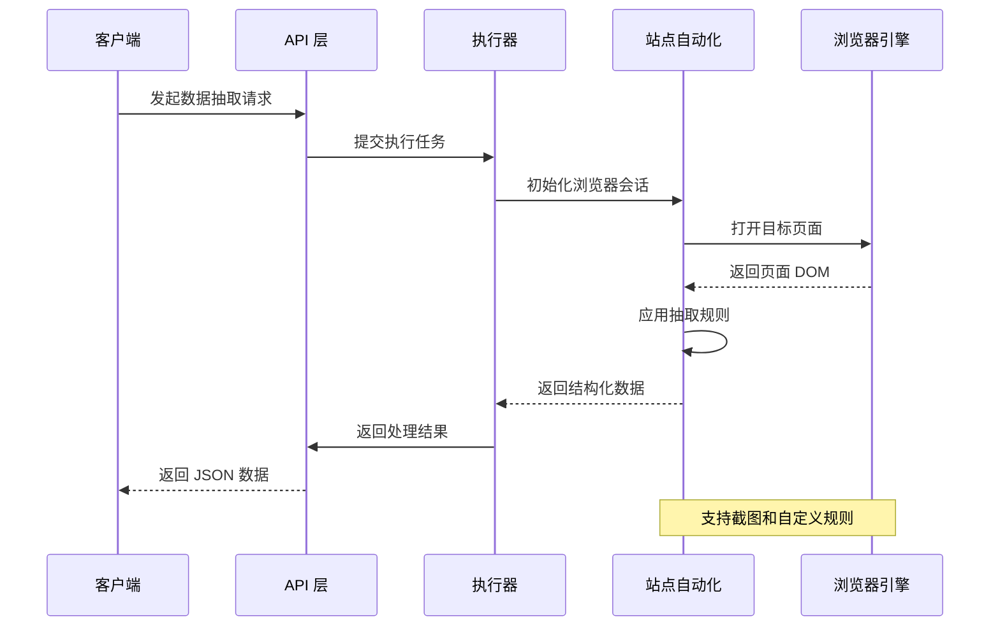
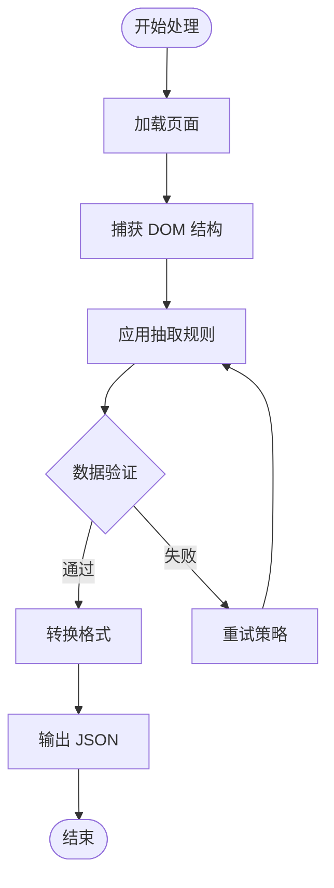
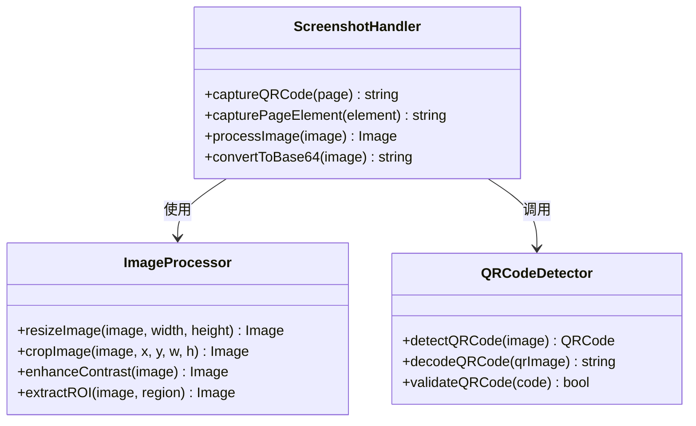
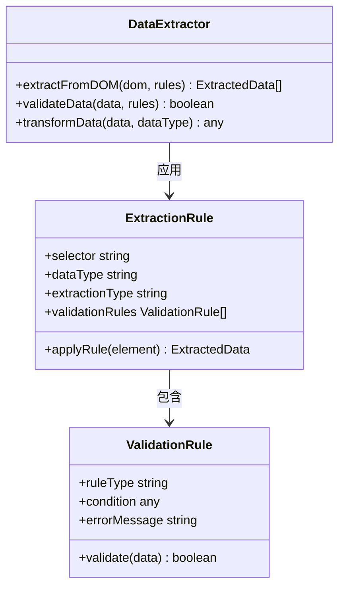
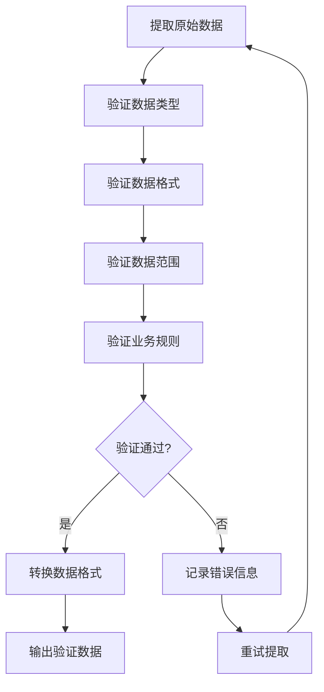
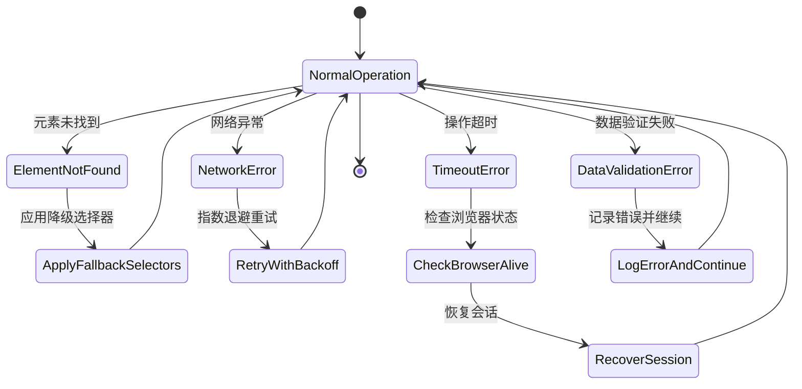
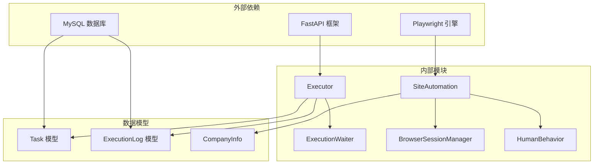

# 结构化数据抽取模块

<cite>
**本文档引用的文件**
- [site_automation.py](file://CCC_RPA_API/app/browser/site_automation.py)
- [executor.py](file://CCC_RPA_API/app/services/executor.py)
- [tasks.py](file://CCC_RPA_API/app/api/tasks.py)
- [execution.py](file://CCC_RPA_API/app/schemas/execution.py)
- [execution.ts](file://CCC-BrowserV4/frontend/src/types/execution.ts)
- [execution-log.ts](file://CCC-BrowserV4/frontend/src/types/execution-log.ts)
- [project.md](file://project.md)
</cite>

## 目录
1. [简介](#简介)
2. [项目结构](#项目结构)
3. [核心组件](#核心组件)
4. [架构概览](#架构概览)
5. [详细组件分析](#详细组件分析)
6. [依赖关系分析](#依赖关系分析)
7. [性能考虑](#性能考虑)
8. [故障排除指南](#故障排除指南)
9. [结论](#结论)

## 简介

结构化数据抽取模块是 CCC RPA 自动化平台的核心功能之一，专门用于从政府交通管理网站（122.gov.cn）的复杂页面中提取结构化数据。该模块基于 Playwright 浏览器引擎，实现了完整的数据抽取流水线，包括页面 DOM 接收、截图处理、自定义抽取规则应用，以及标准 JSON 结构化数据输出。

该模块主要处理以下类型的数据抽取：
- **表格数据**：从复杂的表格布局中提取结构化信息
- **商品信息**：从电商或商品展示页面提取产品详情
- **表单数据**：从各种表单界面提取用户输入和系统反馈
- **订单信息**：从订单管理系统中提取交易详情
- **单位列表**：从政府网站的组织架构页面提取单位信息

## 项目结构

结构化数据抽取模块位于 CCC_RPA_API 项目的浏览器自动化层中，采用分层架构设计：

**图表来源**
- [project.md:34-66](file://project.md#L34-L66)
- [project.md:264-306](file://project.md#L264-L306)

**章节来源**
- [project.md:159-260](file://project.md#L159-L260)

## 核心组件

### SiteAutomation 类
SiteAutomation 类是数据抽取的核心组件，提供了完整的页面自动化功能：

- **页面导航**：支持多种导航策略，包括直接导航和 JavaScript 回退
- **元素定位**：使用多级 CSS 选择器和降级策略确保元素定位的可靠性
- **数据提取**：实现智能的数据提取算法，支持多种页面布局
- **错误处理**：内置完善的错误检测和恢复机制

### 执行器（Executor）
执行器负责协调整个数据抽取流程，包括：
- **任务调度**：管理多线程执行环境
- **状态管理**：跟踪执行进度和状态变化
- **异常处理**：提供统一的错误处理和恢复策略

### 会话管理器
会话管理器确保浏览器会话的稳定性和安全性：
- **多省份隔离**：为每个省份维护独立的浏览器上下文
- **状态持久化**：支持浏览器状态的持久化和恢复
- **崩溃恢复**：自动检测和恢复浏览器崩溃

**章节来源**
- [site_automation.py:16-743](file://CCC_RPA_API/app/browser/site_automation.py#L16-L743)
- [executor.py:78-319](file://CCC_RPA_API/app/services/executor.py#L78-L319)

## 架构概览

结构化数据抽取模块采用五层架构设计，每层都有明确的职责分工：

**图表来源**
- [executor.py:78-278](file://CCC_RPA_API/app/services/executor.py#L78-L278)
- [site_automation.py:193-291](file://CCC_RPA_API/app/browser/site_automation.py#L193-L291)

### 数据流处理

模块采用流水线式的处理方式，每个阶段都有明确的输入输出：

1. **页面接收**：通过 Playwright 获取完整的页面 DOM
2. **规则应用**：根据配置的应用抽取规则处理数据
3. **数据验证**：验证提取数据的完整性和准确性
4. **格式转换**：将数据转换为标准 JSON 格式
5. **结果输出**：返回结构化的数据对象

**章节来源**
- [site_automation.py:193-291](file://CCC_RPA_API/app/browser/site_automation.py#L193-L291)
- [executor.py:152-195](file://CCC_RPA_API/app/services/executor.py#L152-L195)

## 详细组件分析

### 页面 DOM 处理

页面 DOM 处理是数据抽取的基础，SiteAutomation 类实现了多种 DOM 处理策略：

**图表来源**
- [site_automation.py:193-291](file://CCC_RPA_API/app/browser/site_automation.py#L193-L291)

#### DOM 元素定位策略

模块实现了多级降级策略来确保元素定位的可靠性：

1. **首选选择器**：针对特定页面结构的精确选择器
2. **通用选择器**：适用于多种页面布局的通用选择器
3. **表格选择器**：专门处理表格数据的特殊选择器
4. **卡片选择器**：处理卡片式布局的数据
5. **文本分析**：最后手段的文本解析策略

**章节来源**
- [site_automation.py:213-289](file://CCC_RPA_API/app/browser/site_automation.py#L213-L289)

### 截图处理机制

截图处理是数据抽取的重要辅助功能，提供了灵活的图像处理能力：

**图表来源**
- [site_automation.py:148-173](file://CCC_RPA_API/app/browser/site_automation.py#L148-L173)

#### 截图策略

模块提供了多种截图策略以适应不同的数据抽取场景：

1. **元素级截图**：只截取特定元素，提高处理效率
2. **页面级截图**：截取完整页面，用于调试和分析
3. **降级截图**：当元素截图失败时的备用方案
4. **调试截图**：保存关键节点的截图用于问题诊断

**章节来源**
- [site_automation.py:148-173](file://CCC_RPA_API/app/browser/site_automation.py#L148-L173)

### 自定义抽取规则

自定义抽取规则是模块的核心功能，支持灵活的数据抽取配置：

**图表来源**
- [site_automation.py:193-291](file://CCC_RPA_API/app/browser/site_automation.py#L193-L291)

#### 规则配置方式

抽取规则支持多种配置方式：

1. **CSS 选择器**：基于元素属性和层级关系的精确匹配
2. **正则表达式**：用于复杂文本模式的匹配
3. **数据类型定义**：指定期望的数据类型和格式
4. **验证规则**：确保提取数据的质量和完整性

**章节来源**
- [site_automation.py:193-291](file://CCC_RPA_API/app/browser/site_automation.py#L193-L291)

### 数据验证机制

数据验证机制确保提取数据的准确性和完整性：

**图表来源**
- [site_automation.py:242-255](file://CCC_RPA_API/app/browser/site_automation.py#L242-L255)

#### 验证策略

模块实现了多层次的数据验证策略：

1. **类型验证**：确保数据符合预期的数据类型
2. **格式验证**：验证数据格式的正确性
3. **范围验证**：检查数据是否在合理范围内
4. **业务验证**：应用特定的业务规则进行验证

**章节来源**
- [site_automation.py:242-255](file://CCC_RPA_API/app/browser/site_automation.py#L242-L255)

### 错误处理策略

错误处理策略确保系统在遇到异常情况时能够稳定运行：

**图表来源**
- [executor.py:42-69](file://CCC_RPA_API/app/services/executor.py#L42-L69)

#### 错误恢复机制

模块提供了完善的错误恢复机制：

1. **浏览器恢复**：自动检测和恢复浏览器崩溃
2. **会话恢复**：恢复被中断的浏览器会话
3. **任务重试**：支持有限次数的任务重试
4. **状态回滚**：在错误发生时回滚到安全状态

**章节来源**
- [executor.py:42-69](file://CCC_RPA_API/app/services/executor.py#L42-L69)

## 依赖关系分析

结构化数据抽取模块的依赖关系呈现清晰的层次化结构：

**图表来源**
- [project.md:104-149](file://project.md#L104-L149)
- [executor.py:13-15](file://CCC_RPA_API/app/services/executor.py#L13-L15)

### 组件耦合度分析

模块采用了低耦合的设计原则：

- **浏览器层与业务层分离**：浏览器自动化逻辑独立于业务逻辑
- **数据层抽象**：通过 SQLAlchemy 抽象数据库访问
- **接口定义清晰**：各组件间通过明确定义的接口进行交互
- **错误边界明确**：每个组件都有清晰的错误处理边界

**章节来源**
- [project.md:104-149](file://project.md#L104-L149)

## 性能考虑

结构化数据抽取模块在设计时充分考虑了性能优化：

### 并发处理
- **多线程执行**：使用 ThreadPoolExecutor 处理多个任务
- **异步通信**：通过 WebSocket 实现异步消息传递
- **资源池管理**：合理管理浏览器会话和数据库连接

### 内存优化
- **及时释放资源**：页面和元素使用后及时释放
- **内存监控**：定期检查内存使用情况
- **垃圾回收**：合理触发 Python 垃圾回收机制

### 网络优化
- **连接复用**：复用数据库和 HTTP 连接
- **批量操作**：支持批量数据处理
- **缓存策略**：合理使用缓存减少重复计算

## 故障排除指南

### 常见问题及解决方案

#### 页面元素未找到
**症状**：抽取规则无法定位到目标元素
**解决方案**：
1. 检查 CSS 选择器的准确性
2. 应用降级选择器策略
3. 验证页面结构是否发生变化
4. 使用调试截图分析页面状态

#### 数据提取失败
**症状**：虽然找到了元素但提取的数据不完整
**解决方案**：
1. 检查数据提取规则的复杂度
2. 验证数据格式转换逻辑
3. 添加数据验证规则
4. 实施重试机制

#### 浏览器会话异常
**症状**：浏览器意外关闭或页面加载失败
**解决方案**：
1. 检查浏览器崩溃日志
2. 实施会话恢复机制
3. 验证网络连接稳定性
4. 检查页面加载超时设置

**章节来源**
- [executor.py:286-311](file://CCC_RPA_API/app/services/executor.py#L286-L311)

### 调试技巧

1. **启用详细日志**：增加日志级别获取更多信息
2. **使用调试截图**：保存关键节点的页面截图
3. **监控资源使用**：定期检查内存和 CPU 使用情况
4. **单元测试**：为关键功能编写单元测试

## 结论

结构化数据抽取模块是一个高度成熟和可靠的系统，具备以下特点：

### 技术优势
- **鲁棒性强**：通过多级降级策略确保系统的稳定性
- **扩展性好**：模块化设计支持功能扩展和定制
- **性能优异**：多线程并发处理和优化的资源管理
- **易于维护**：清晰的架构和完善的错误处理机制

### 应用价值
- **自动化程度高**：减少了大量手工数据处理工作
- **准确性高**：通过多重验证确保数据质量
- **适应性强**：支持多种页面布局和数据格式
- **成本效益好**：显著降低了数据处理的人力成本

### 发展方向
随着模块的不断完善，未来可以在以下方面进一步提升：
- **AI 辅助抽取**：集成机器学习算法提高抽取准确性
- **实时处理**：支持实时数据流处理
- **云端部署**：提供云服务版本支持大规模并发
- **可视化配置**：提供图形化界面简化规则配置

该模块为 CCC RPA 自动化平台提供了强大的数据处理能力，是实现政府交通管理网站自动化的重要基础。