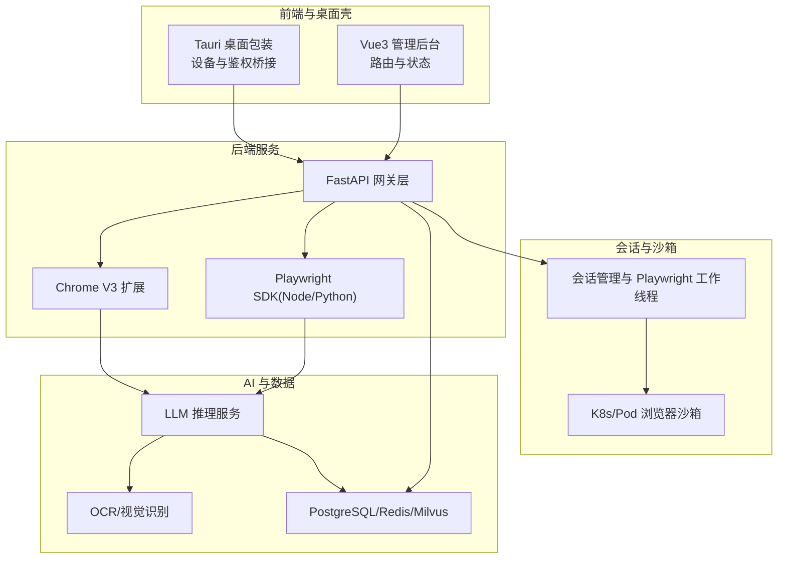
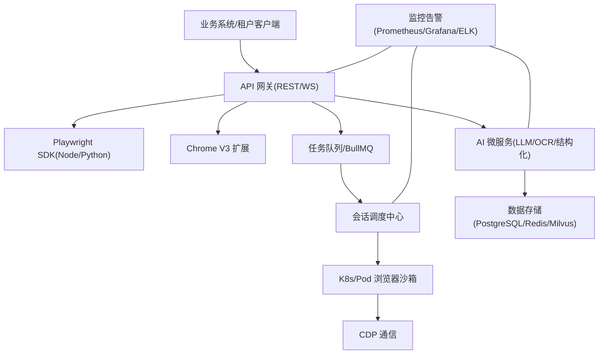
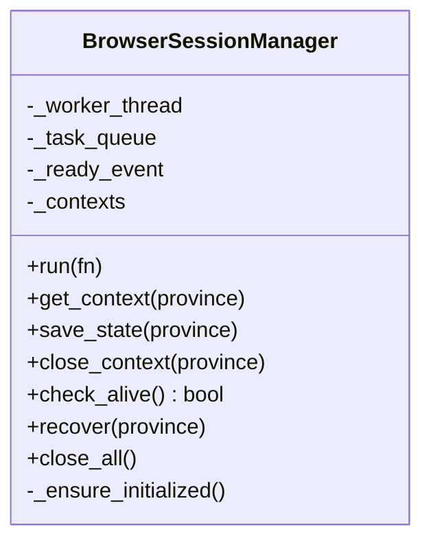
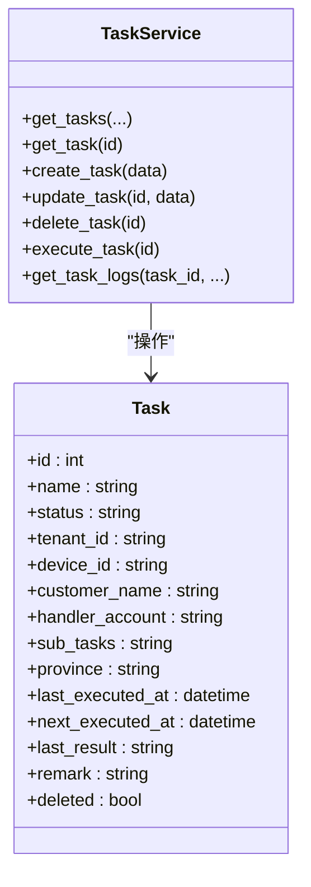
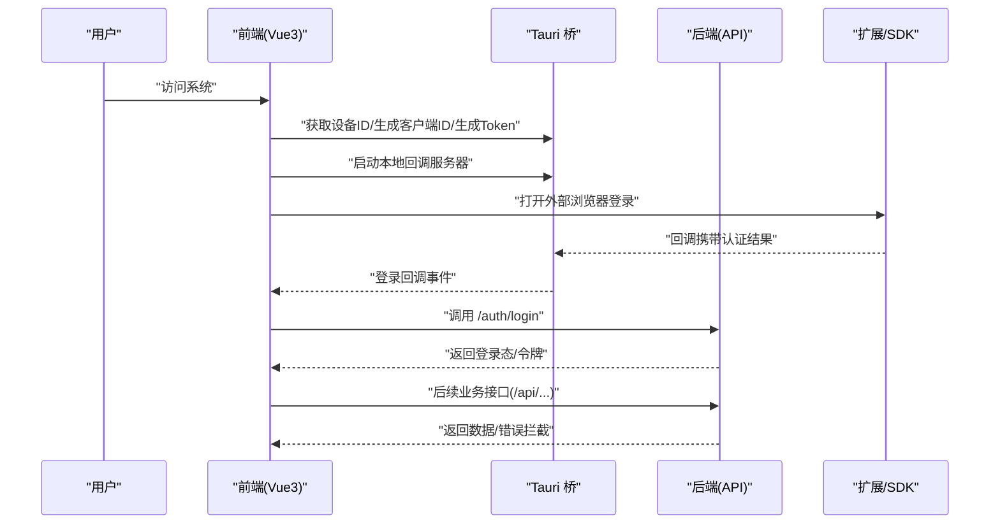
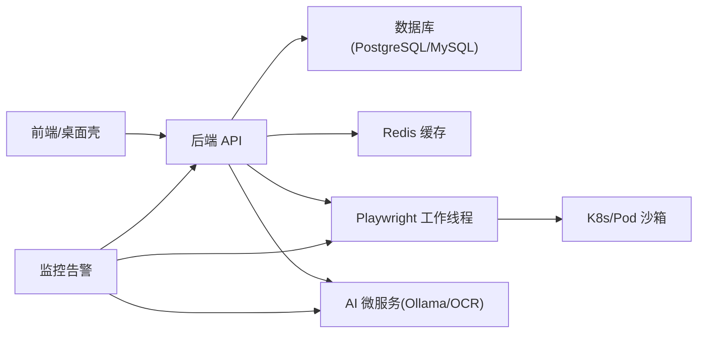

# 项目介绍与核心目标

<cite>
**本文引用的文件**
- [project.md](file://project.md)
- [README.md](file://CCC-BrowserV4/backend/README.md)
- [main.rs](file://CCC-BrowserV4/src-tauri/src/main.rs)
- [config.py](file://CCC_RPA_API/app/config.py)
- [base.py](file://CCC_RPA_API/app/models/base.py)
- [task.py](file://CCC_RPA_API/app/models/task.py)
- [tasks.py](file://CCC_RPA_API/app/api/tasks.py)
- [task.py](file://CCC_RPA_API/app/services/task.py)
- [index.ts](file://CCC-BrowserV4/frontend/src/router/index.ts)
- [auth.ts](file://CCC-BrowserV4/frontend/src/stores/auth.ts)
- [auth.ts](file://CCC-BrowserV4/frontend/src/api/auth.ts)
- [request.ts](file://CCC-BrowserV4/frontend/src/api/request.ts)
- [session_manager.py](file://CCC_RPA_API/app/browser/session_manager.py)
</cite>

## 目录
1. [引言](#引言)
2. [项目结构](#项目结构)
3. [核心组件](#核心组件)
4. [架构总览](#架构总览)
5. [详细组件分析](#详细组件分析)
6. [依赖关系分析](#依赖关系分析)
7. [性能考虑](#性能考虑)
8. [故障排查指南](#故障排查指南)
9. [结论](#结论)
10. [附录](#附录)

## 引言
本项目是面向商用场景的 AI 驱动型浏览器自动化系统，目标是以“强隔离沙箱会话 + 双通路操控体系 + 私有化本地 AI Agent”为核心技术优势，提供安全、可靠、可扩展的浏览器自动化解决方案。项目遵循统一的五层架构与三套团队并行开发模式，确保三套系统在接口、数据、功能与部署层面完全一致，具备交叉对标与互通替换的能力。

- 核心目标
  - 强隔离沙箱会话：容器/进程级隔离，多租户账号 Cookie、存储、网络 IP、浏览器指纹、插件实例完全隔离，规避网站风控账号关联。
  - 双通路操控体系：Playwright 远程脚本自动化批量控制与内置 Chrome V3 扩展可视化人工操作双向互通。
  - 私有化本地 AI Agent：支持自然语言指令自动执行页面操作、表单填写、弹窗自适应、验证码识别、结构化数据抽取。
  - 商用完整能力：多租户隔离、四级 RBAC 权限、会话并发配额、计费统计、全链路操作审计、数据加密存储、集群监控告警、故障自愈。

- 应用场景
  - 企业级 RPA 与数据采集：在复杂反爬环境中稳定执行网页自动化任务。
  - 多租户 SaaS 化浏览器即服务：为不同租户提供独立、安全、可控的浏览器运行环境。
  - 本地化 AI 辅助浏览：通过自然语言指令驱动页面交互，降低人工操作门槛。

- 商业价值
  - 安全合规：严格的隔离与加密策略满足企业安全基线要求。
  - 可靠稳定：完善的容错、自愈与监控体系保障生产级 SLA。
  - 易于扩展：模块化分层与统一接口契约便于二次开发与生态集成。

**章节来源**
- [project.md:84-96](file://project.md#L84-L96)

## 项目结构
项目采用“五层架构 + 三层开发团队模式”的组织方式：
- 五层架构（自上而下）：
  - 层5：网关与多租户业务管理层（API 网关、租户管理、RBAC、计费统计、Web 后台）
  - 层4：AI 智能驱动微服务层（LLM、视觉识别、OCR、结构化抽取、向量记忆）
  - 层3：双通路控制层（Playwright SDK、Chrome 扩展、任务队列、消息桥接）
  - 层2+层1：Chromium 沙箱会话集群层与基础设施隔离层（K8s/Pod、进程/容器隔离、CDP）
- 三层开发团队模式（Trae/Workbuddy/Codebuddy）：
  - 每套团队内部自建全套子 Agent，完成五层架构，三套系统接口、数据、功能规范 100% 统一，可交叉对标、互通替换。

**图表来源**
- [index.ts:1-63](file://CCC-BrowserV4/frontend/src/router/index.ts#L1-L63)
- [main.rs:1-29](file://CCC-BrowserV4/src-tauri/src/main.rs#L1-L29)
- [tasks.py:1-76](file://CCC_RPA_API/app/api/tasks.py#L1-L76)
- [session_manager.py:1-183](file://CCC_RPA_API/app/browser/session_manager.py#L1-L183)
- [project.md:173-187](file://project.md#L173-L187)

**章节来源**
- [project.md:173-187](file://project.md#L173-L187)
- [README.md:1-66](file://CCC-BrowserV4/backend/README.md#L1-L66)

## 核心组件
- 强隔离沙箱会话
  - 通过容器/进程级隔离、独立 UserData/缓存/下载目录、独立代理 IP、独立网络命名空间与指纹伪装，实现多租户账号 Cookie、存储、网络、浏览器指纹、插件实例完全隔离。
  - 支持单机进程沙箱与 K8s 容器集群两种部署形态，满足内部测试与生产商用的不同需求。
- 双通路操控体系
  - Playwright 远程脚本自动化：提供 Node/Python SDK，支持同步/异步任务、定时循环、任务优先级与实时日志推送。
  - Chrome V3 扩展可视化：包含 Service Worker、Content Script、SidePanel，支持人工操作录制为 Playwright 脚本、实时截图与日志展示。
  - 双通路消息桥接：人工操作与自动化脚本执行双向互通，扩展面板实时同步页面变化。
- 私有化本地 AI Agent
  - 基于 Ollama 的 LLM 推理服务，结合页面 DOM 与截图进行自然语言指令解析，自动识别弹窗/验证码并自适应调整后续步骤。
  - YOLO + PaddleOCR 离线视觉识别与 OCR，结构化数据抽取，会话独立向量记忆库。
- 多租户与权限体系
  - 四级 RBAC 角色：超级管理员、租户管理员、操作员、只读用户；统一租户管理、并发配额、计费统计与审计日志。
- 数据与监控
  - PostgreSQL/Redis/Milvus 统一数据层，AES 加密存储；Prometheus/Grafana/ELK 全链路监控与告警。

**章节来源**
- [project.md:277-309](file://project.md#L277-L309)
- [project.md:311-352](file://project.md#L311-L352)
- [project.md:383-412](file://project.md#L383-L412)
- [project.md:413-444](file://project.md#L413-L444)

## 架构总览
系统整体采用“前端/桌面壳 → API 网关 → 控制层/扩展 → 会话调度 → AI 微服务”的分层设计，强调隔离与互通：

**图表来源**
- [project.md:704-714](file://project.md#L704-L714)
- [tasks.py:1-76](file://CCC_RPA_API/app/api/tasks.py#L1-L76)
- [session_manager.py:1-183](file://CCC_RPA_API/app/browser/session_manager.py#L1-L183)

**章节来源**
- [project.md:704-714](file://project.md#L704-L714)

## 详细组件分析

### 组件A：会话管理与沙箱调度
- 职责
  - 在专用工作线程中管理 Playwright 浏览器实例，按“省份”维度维护 BrowserContext，持久化 storage_state。
  - 提供线程安全的任务提交与结果获取，支持上下文存活检测、恢复与关闭。
- 关键特性
  - 专用工作线程避免线程冲突；超时与异常处理；上下文失效自动重建；支持关闭所有上下文与浏览器。
- 与沙箱隔离的关系
  - 通过 storage_state 持久化与按上下文隔离，配合容器/进程级隔离，确保会话数据与状态不泄露。

**图表来源**
- [session_manager.py:1-183](file://CCC_RPA_API/app/browser/session_manager.py#L1-L183)

**章节来源**
- [session_manager.py:1-183](file://CCC_RPA_API/app/browser/session_manager.py#L1-L183)

### 组件B：任务与执行日志（后端 API/服务）
- 职责
  - 提供任务的增删改查、执行、日志查询等接口；通过服务层封装数据库操作与执行状态管理。
- 关键特性
  - 支持关键词/状态筛选、分页查询；执行任务时更新状态并提交到执行器；日志按任务维度分页查询。
- 数据模型
  - 任务模型包含名称、状态、租户/设备/客户/处理账户、子任务(JSON)、省/市、执行时间与结果、备注等字段。

**图表来源**
- [task.py:1-25](file://CCC_RPA_API/app/models/task.py#L1-L25)
- [task.py:44-157](file://CCC_RPA_API/app/services/task.py#L44-L157)

**章节来源**
- [tasks.py:1-76](file://CCC_RPA_API/app/api/tasks.py#L1-L76)
- [task.py:1-25](file://CCC_RPA_API/app/models/task.py#L1-L25)
- [task.py:44-157](file://CCC_RPA_API/app/services/task.py#L44-L157)

### 组件C：前端路由与鉴权（Vue3 + Tauri）
- 职责
  - Vue3 路由与页面布局；Pinia 状态管理；Tauri 桥接设备信息、鉴权令牌与登录回调；Axios 封装统一 API 请求。
- 关键特性
  - 路由守卫控制登录态；登录流程通过 Tauri 生成设备/客户端标识与 Token，启动本地回调服务器，打开外部浏览器完成认证后回传结果。
- 与后端协作
  - 前端通过 /api 基础路径调用后端 REST 接口，统一拦截错误并提示。

**图表来源**
- [auth.ts:1-67](file://CCC-BrowserV4/frontend/src/api/auth.ts#L1-L67)
- [auth.ts:1-79](file://CCC-BrowserV4/frontend/src/stores/auth.ts#L1-L79)
- [index.ts:1-63](file://CCC-BrowserV4/frontend/src/router/index.ts#L1-L63)
- [request.ts:1-18](file://CCC-BrowserV4/frontend/src/api/request.ts#L1-L18)
- [main.rs:1-29](file://CCC-BrowserV4/src-tauri/src/main.rs#L1-L29)

**章节来源**
- [index.ts:1-63](file://CCC-BrowserV4/frontend/src/router/index.ts#L1-L63)
- [auth.ts:1-79](file://CCC-BrowserV4/frontend/src/stores/auth.ts#L1-L79)
- [auth.ts:1-67](file://CCC-BrowserV4/frontend/src/api/auth.ts#L1-L67)
- [request.ts:1-18](file://CCC-BrowserV4/frontend/src/api/request.ts#L1-L18)
- [main.rs:1-29](file://CCC-BrowserV4/src-tauri/src/main.rs#L1-L29)

### 组件D：数据库配置与抽象基类
- 职责
  - 提供数据库连接配置（MySQL），以及 ORM 基类用于统一创建/更新时间戳。
- 关键特性
  - 通过 Pydantic Settings 管理环境变量；SQLAlchemy 基类统一字段与默认值。

**章节来源**
- [config.py:1-22](file://CCC_RPA_API/app/config.py#L1-L22)
- [base.py:1-11](file://CCC_RPA_API/app/models/base.py#L1-L11)

## 依赖关系分析
- 组件耦合与协作
  - 前端通过 /api 调用后端 REST 接口；后端任务服务与数据库交互；会话管理器负责 Playwright 生命周期；AI 微服务与数据存储解耦。
- 外部依赖
  - 容器编排（Docker/K8s）、数据库（MySQL/PG）、缓存（Redis）、监控（Prometheus/Grafana/ELK）、AI 推理（Ollama/YOLO/PaddleOCR）。
- 风险与约束
  - 强隔离与加密存储、TLS 通信、会话销毁递归清理、禁止共享全局缓存与磁盘缓存、AI 推理私有化本地部署。

**图表来源**
- [project.md:716-733](file://project.md#L716-L733)
- [config.py:1-22](file://CCC_RPA_API/app/config.py#L1-L22)
- [session_manager.py:1-183](file://CCC_RPA_API/app/browser/session_manager.py#L1-L183)

**章节来源**
- [project.md:716-733](file://project.md#L716-L733)
- [project.md:221-236](file://project.md#L221-L236)

## 性能考虑
- 会话创建与执行
  - 集群 K8s 环境会话创建耗时 ≤3s，单机进程模式 ≤1s；CDP 页面操作延迟 ≤200ms。
- 并发与吞吐
  - 单集群稳定并发会话 ≥200 个；API 网关单接口 QPS≥100，WebSocket 在线连接 ≥1000 路。
- AI 推理
  - 7B 本地模型单条自然语言指令推理响应 ≤1.5s；支持 GPU/CPU 双模式。
- 资源与稳定性
  - 单会话内存上限 1–2Gi、CPU 单核上限、最大标签数 10、最长存活 30min–24h；定时清理缓存与快照，避免持续内存泄漏。

**章节来源**
- [project.md:506-517](file://project.md#L506-L517)

## 故障排查指南
- 会话崩溃与隔离
  - 单会话崩溃不影响其他会话；自动销毁异常实例并上报异常；检查 Pod/进程资源使用与 CDP 连接状态。
- 网络与风控
  - 全维度随机指纹、抹平 CDP 特征、模拟真人轨迹、随机输入间隔；若仍被拦截，检查代理 IP 可用性与网络隔离。
- 数据与安全
  - 会话销毁后 UserData 目录递归清理；AES-256-CBC 加密存储；租户密钥独立；审计日志不可删除篡改。
- API 网关与队列
  - 网关多副本负载均衡、任务队列削峰限流、租户独立并发配额；出现拥堵时优先检查队列积压与限流配置。

**章节来源**
- [project.md:641-657](file://project.md#L641-L657)
- [project.md:518-531](file://project.md#L518-L531)

## 结论
本项目以“强隔离沙箱会话 + 双通路操控体系 + 私有化本地 AI Agent”为核心，构建了安全、可靠、可扩展的商用级 AI 浏览器自动化平台。通过三套团队并行开发与统一标准，确保系统在隔离、性能、安全与运维方面达到商用 SaaS 级别水平，能够有效解决网站风控账号关联问题，为企业提供稳定可控的浏览器自动化解决方案。

## 附录
- 三层开发团队模式（Trae/Workbuddy/Codebuddy）
  - 每套团队内部自建全套子 Agent，完成五层架构；三套系统接口、数据、功能规范 100% 统一，可交叉对标、互通替换。
- 统一接口契约
  - 对外 REST/WS API 网关、内部 gRPC 微服务通信、Chrome 扩展消息协议、CDP 与第三方对接标准。
- 非功能性需求
  - 性能、安全、可靠性、兼容性、可运维交付标准统一，满足商用 SaaS 要求。

**章节来源**
- [project.md:7-21](file://project.md#L7-L21)
- [project.md:445-503](file://project.md#L445-L503)
- [project.md:504-559](file://project.md#L504-L559)