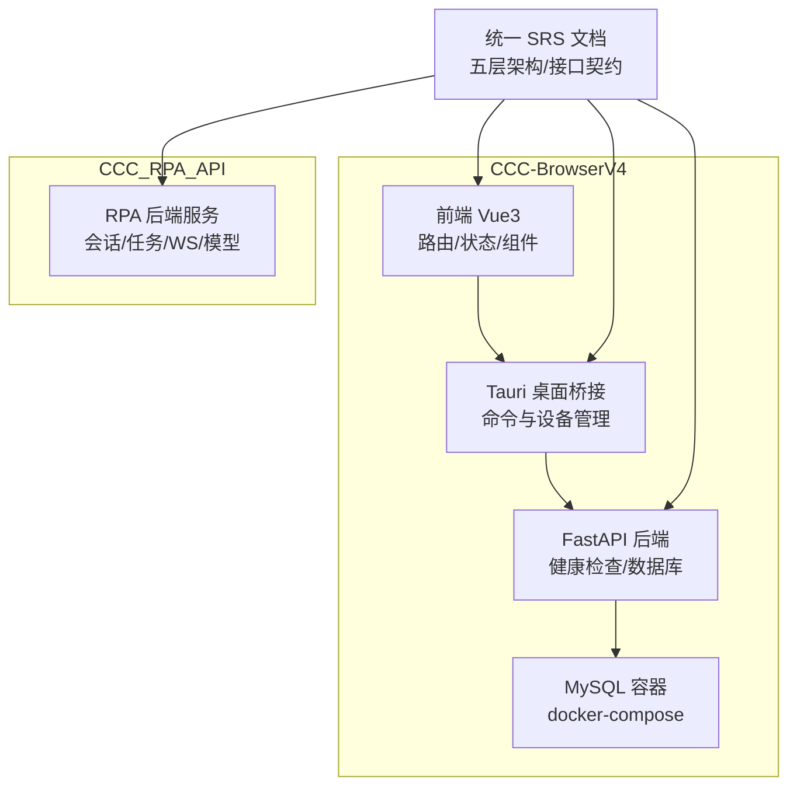
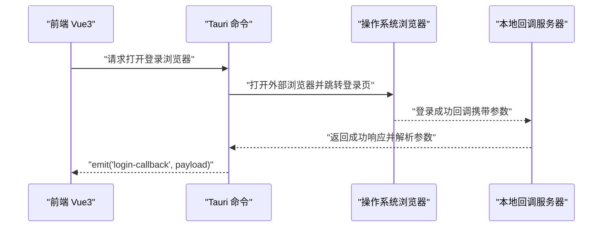
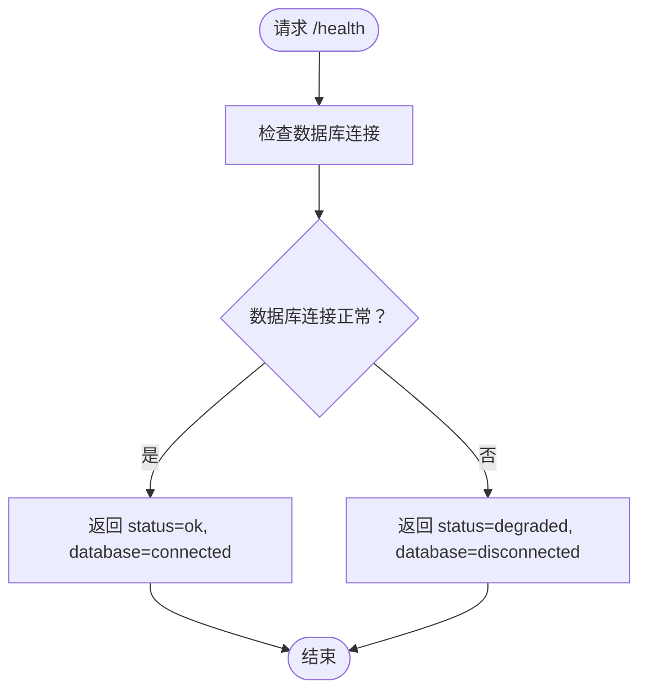
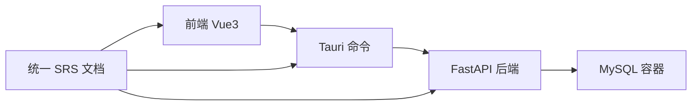

# 项目概述

<cite>
**本文引用的文件**
- [project.md](file://project.md)
- [docker-compose.yml](file://CCC-BrowserV4/docker-compose.yml)
- [backend/README.md](file://CCC-BrowserV4/backend/README.md)
- [main.ts](file://CCC-BrowserV4/frontend/src/main.ts)
- [main.rs](file://CCC-BrowserV4/src-tauri/src/main.rs)
- [commands.rs](file://CCC-BrowserV4/src-tauri/src/commands.rs)
- [health.py](file://CCC-BrowserV4/backend/app/api/health.py)
</cite>

## 目录
1. [引言](#引言)
2. [项目结构](#项目结构)
3. [核心组件](#核心组件)
4. [架构总览](#架构总览)
5. [详细组件分析](#详细组件分析)
6. [依赖关系分析](#依赖关系分析)
7. [性能考虑](#性能考虑)
8. [故障排查指南](#故障排查指南)
9. [结论](#结论)
10. [附录](#附录)

## 引言
本项目是面向商用场景的 AI 驱动型浏览器系统，目标是以 Chromium 内核为基础，提供强隔离沙箱会话、双通路操控体系（Playwright 远程脚本自动化与 Chrome V3 扩展可视化）、私有化本地 AI Agent 的完整能力，并支持单机进程沙箱与 Kubernetes 容器分布式集群两种部署形态。项目采用“三套独立全栈开发团队”的组织模式，每套团队内部自建完整的五层标准分层架构，确保三套系统在接口、数据、功能与规范上 100% 统一，可交叉对标与互通替换。

- 强隔离沙箱会话：容器/进程级隔离，多租户账号 Cookie、存储、网络 IP、浏览器指纹、插件实例完全隔离，规避网站风控账号关联。
- 双通路操控体系：Playwright 远程脚本自动化批量控制与内置 Chrome V3 扩展可视化人工操作双向互通。
- 私有化本地 AI Agent：支持自然语言指令自动执行页面操作、表单填写、弹窗自适应、验证码识别、结构化数据抽取。
- 双部署兼容：单机进程沙箱（内部测试）、K8s 容器分布式集群（商用生产环境）。
- 商用完整能力：多租户隔离、四级 RBAC 权限、会话并发配额、计费统计、全链路操作审计、数据加密存储、集群监控告警、故障自愈。

章节来源
- [project.md:84-96](file://project.md#L84-L96)

## 项目结构
仓库包含三个主要子项目与统一的需求与规范文档：
- CCC-BrowserV4：前端 Vue3 + Tauri 桌面应用 + FastAPI 后端 + MySQL 数据库存储，提供桌面端登录与本地回调、健康检查等能力。
- CCC_RPA_API：RPA 业务后端（FastAPI），包含浏览器会话管理、任务执行、SDK、WS 管理等模块，体现统一接口契约与业务层实现。
- project.md：统一的软件需求规格说明书（SRS），定义了五层架构、统一接口契约、非功能需求、数据层设计、开发周期与验收标准。



图表来源
- [main.ts:1-23](file://CCC-BrowserV4/frontend/src/main.ts#L1-L23)
- [main.rs:1-29](file://CCC-BrowserV4/src-tauri/src/main.rs#L1-L29)
- [commands.rs:1-92](file://CCC-BrowserV4/src-tauri/src/commands.rs#L1-L92)
- [health.py:1-18](file://CCC-BrowserV4/backend/app/api/health.py#L1-L18)
- [docker-compose.yml:1-21](file://CCC-BrowserV4/docker-compose.yml#L1-L21)
- [project.md:173-236](file://project.md#L173-L236)

章节来源
- [project.md:173-236](file://project.md#L173-L236)
- [backend/README.md:1-66](file://CCC-BrowserV4/backend/README.md#L1-L66)
- [docker-compose.yml:1-21](file://CCC-BrowserV4/docker-compose.yml#L1-L21)

## 核心组件
- 前端与桌面桥接（CCC-BrowserV4）
  - Vue3 应用入口与路由/状态管理集成，Element Plus UI 组件库接入。
  - Tauri 提供系统命令与设备信息持久化，支持打开外部浏览器、本地回调服务器、生成 token 等。
- 后端服务（CCC-BrowserV4）
  - FastAPI 提供健康检查接口，数据库连接状态检查，配合 MySQL 容器运行。
- 统一规范与业务后端（CCC_RPA_API）
  - RPA 业务后端体现统一接口契约与业务层能力，支撑会话管理、任务执行、WS 管理等。

章节来源
- [main.ts:1-23](file://CCC-BrowserV4/frontend/src/main.ts#L1-L23)
- [main.rs:1-29](file://CCC-BrowserV4/src-tauri/src/main.rs#L1-L29)
- [commands.rs:1-92](file://CCC-BrowserV4/src-tauri/src/commands.rs#L1-L92)
- [health.py:1-18](file://CCC-BrowserV4/backend/app/api/health.py#L1-L18)
- [backend/README.md:1-66](file://CCC-BrowserV4/backend/README.md#L1-L66)

## 架构总览
系统采用五层标准分层架构，自上而下为：
- 层 5：网关与多租户业务管理层（API 网关、租户管理、RBAC、计费统计、Web 后台、监控告警）
- 层 4：AI 智能驱动微服务层（LLM 决策引擎、YOLO+OCR、结构化抽取、会话独立向量记忆）
- 层 3：双通路控制层（Playwright 自动化脚本通路、Chrome V3 扩展可视化通路、任务队列、消息桥接）
- 层 2：Chromium 沙箱会话集群层（单会话 Pod/进程、独立 UserData、CDP、指纹伪装、代理绑定、调度中心）
- 层 1：基础设施隔离层（K8s 容器编排、Linux Namespace/Cgroup、资源硬限制、独立临时存储）

```mermaid
graph TB
Client["租户客户端/业务系统"]
GW["API 网关层5"]
CTRL["双通路控制层层3"]
SCHED["调度中心/会话集群层2+层1"]
AI["AI 微服务层4"]
Client --> GW
GW --> CTRL
CTRL --> SCHED
CTRL <- --> AI
SCHED --> GW
```

图表来源
- [project.md:175-187](file://project.md#L175-L187)

章节来源
- [project.md:175-187](file://project.md#L175-L187)

## 详细组件分析

### 组件 A：桌面端登录与本地回调（Tauri）
- 功能要点
  - 获取设备唯一标识（持久化存储）
  - 生成客户端标识与随机 token
  - 打开外部浏览器进行登录
  - 启动本地回调 HTTP 服务器，接收一次登录回调并通过事件通知前端
- 关键流程



图表来源
- [commands.rs:32-91](file://CCC-BrowserV4/src-tauri/src/commands.rs#L32-L91)

章节来源
- [main.ts:1-23](file://CCC-BrowserV4/frontend/src/main.ts#L1-L23)
- [main.rs:1-29](file://CCC-BrowserV4/src-tauri/src/main.rs#L1-L29)
- [commands.rs:1-92](file://CCC-BrowserV4/src-tauri/src/commands.rs#L1-L92)

### 组件 B：后端健康检查与数据库连接
- 功能要点
  - 提供 /health 接口，返回服务状态与数据库连接状态
  - 使用环境变量配置数据库连接（支持 MySQL/SQLite）
- 关键流程



图表来源
- [health.py:1-18](file://CCC-BrowserV4/backend/app/api/health.py#L1-L18)
- [backend/README.md:7-23](file://CCC-BrowserV4/backend/README.md#L7-L23)

章节来源
- [health.py:1-18](file://CCC-BrowserV4/backend/app/api/health.py#L1-L18)
- [backend/README.md:1-66](file://CCC-BrowserV4/backend/README.md#L1-L66)

### 组件 C：统一接口契约与部署形态
- 统一接口契约
  - 对外 RESTful/WS API 网关规范：统一根路径、鉴权头、核心接口清单
  - 内部 gRPC 微服务通信规范：AI 推理与调度中心两类服务方法
  - Chrome 扩展 ↔ 调度网关 WS 消息协议：统一 JSON 结构
  - 底层 CDP 与第三方对接标准：CDP 封装、代理池对接、Ollama 本地推理
- 两种标准化部署形态
  - 商用生产：K8s 容器分布式集群，Pod 级别强隔离、HPA 弹性扩缩容、NetworkPolicy 隔离
  - 内部测试：单机进程级沙箱（Linux unshare+cgroup、Windows Job 对象）

章节来源
- [project.md:445-502](file://project.md#L445-L502)
- [project.md:189-208](file://project.md#L189-L208)

### 组件 D：五层架构与开发模式
- 五层架构职责
  - 层 1+2：定制 Chromium 镜像、K8s Pod 编排、会话调度与生命周期管理、强隔离、资源硬限流、CDP 轻量化封装
  - 层 3：Playwright SDK、Chrome V3 扩展、任务队列、双通路消息桥接、统一 API 网关
  - 层 4：Ollama LLM、YOLO+OCR、结构化抽取、向量记忆库
  - 层 5：租户管理、RBAC、计费统计、Web 后台、监控告警
- 开发模式
  - 三套独立全栈团队，每套内部划分子 Agent A/B/C，全程自给自足，三套系统接口、数据、功能规范 100% 统一

章节来源
- [project.md:30-66](file://project.md#L30-L66)
- [project.md:113-137](file://project.md#L113-L137)

## 依赖关系分析
- 组件耦合与协作
  - 前端通过 Tauri 调用系统命令，实现登录与本地回调
  - 后端提供健康检查接口，依赖数据库连接状态
  - 统一 SRS 文档为前后端与业务后端提供接口与规范约束
- 外部依赖
  - MySQL 容器用于本地开发与测试
  - K8s 与容器编排用于生产部署（见统一规范）



图表来源
- [main.ts:1-23](file://CCC-BrowserV4/frontend/src/main.ts#L1-L23)
- [main.rs:1-29](file://CCC-BrowserV4/src-tauri/src/main.rs#L1-L29)
- [health.py:1-18](file://CCC-BrowserV4/backend/app/api/health.py#L1-L18)
- [docker-compose.yml:1-21](file://CCC-BrowserV4/docker-compose.yml#L1-L21)
- [project.md:445-502](file://project.md#L445-L502)

章节来源
- [docker-compose.yml:1-21](file://CCC-BrowserV4/docker-compose.yml#L1-L21)
- [backend/README.md:1-66](file://CCC-BrowserV4/backend/README.md#L1-L66)
- [project.md:445-502](file://project.md#L445-L502)

## 性能考虑
- 会话创建耗时：K8s 环境 ≤3s，单机进程模式 ≤1s
- AI 单条自然语言指令推理响应：7B 本地模型 ≤1.5s
- 单集群稳定并发会话：最低支持 200 个，长期运行无持续内存泄漏
- API 网关：单接口 QPS≥100，WebSocket 在线≥1000 路
- CDP 页面操作延迟：≤200ms

章节来源
- [project.md:504-516](file://project.md#L504-L516)

## 故障排查指南
- 数据库连接异常
  - 检查 .env 中数据库配置项（主机、端口、用户名、密码、数据库名）
  - 使用 docker-compose 启动 MySQL 容器并确认状态
- 登录回调未到达前端
  - 确认本地回调服务器已启动并监听随机端口
  - 检查回调参数解析与事件 emit 是否正确
- 健康检查返回降级
  - 检查数据库连接状态与容器日志
  - 确认后端服务已正确加载数据库配置

章节来源
- [backend/README.md:7-23](file://CCC-BrowserV4/backend/README.md#L7-L23)
- [docker-compose.yml:1-21](file://CCC-BrowserV4/docker-compose.yml#L1-L21)
- [commands.rs:44-91](file://CCC-BrowserV4/src-tauri/src/commands.rs#L44-L91)
- [health.py:1-18](file://CCC-BrowserV4/backend/app/api/health.py#L1-L18)

## 结论
本项目以统一的五层架构与严格的开发模式，构建了具备强隔离沙箱会话、双通路操控体系与私有化本地 AI Agent 的商用级 AI 浏览器系统。通过单机进程沙箱与 K8s 容器集群两种部署形态，满足内部测试与生产商用的不同需求；通过统一接口契约与规范，确保三套团队产出的系统可互通、可替换、可对标。建议在后续迭代中持续关注隔离边界验证、AI 推理性能优化与大规模并发下的稳定性保障。

## 附录
- 统一接口契约与部署形态详见统一 SRS 文档
- K8s 浏览器沙箱 Pod 模板与技术栈清单见附录

章节来源
- [project.md:694-782](file://project.md#L694-L782)