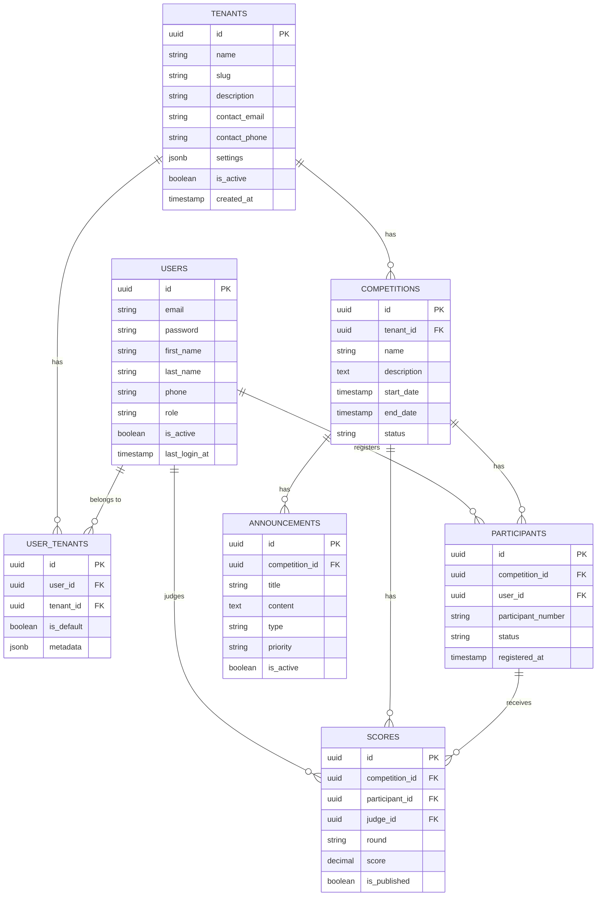

# QiYun AI System - 多租户数据库设计文档

## 概述

本文档描述 QiYun AI System（赛事管理平台）的多租户数据库设计，使用 PostgreSQL 的 Row-Level Security (RLS) 实现数据隔离。

## 技术栈

- **数据库**: PostgreSQL 14+
- **ORM**: TypeORM
- **数据隔离**: Row-Level Security (RLS)
- **租户识别**: `current_setting('app.current_tenant_id')`

## 多租户架构

### 隔离策略

采用 **Row-Level Security (RLS)** 策略：
- 所有业务表包含 `tenant_id` 字段
- PostgreSQL RLS 策略自动过滤数据
- 应用层设置会话变量 `app.current_tenant_id`
- 数据库层面强制数据隔离

### 优势

1. **安全性**: 数据库层面强制隔离，应用层绕过也无效
2. **性能**: RLS 策略使用索引优化，查询性能影响小
3. **简单性**: 应用代码无需手动添加 `WHERE tenant_id = ?` 条件
4. **灵活性**: 支持超级管理员跨租户查询

## 数据库 Schema

### 1. Tenants 表（租户/组织）

```sql
CREATE TABLE tenants (
  id UUID PRIMARY KEY DEFAULT uuid_generate_v4(),
  name VARCHAR(255) NOT NULL UNIQUE,
  slug VARCHAR(255) NOT NULL UNIQUE,
  description TEXT,
  contact_email VARCHAR(255),
  contact_phone VARCHAR(50),
  settings JSONB,
  is_active BOOLEAN DEFAULT true,
  created_at TIMESTAMP DEFAULT CURRENT_TIMESTAMP,
  updated_at TIMESTAMP DEFAULT CURRENT_TIMESTAMP
);
```

**说明**:
- 多租户的根表，每个租户代表一个赛事组织方
- `slug` 用于 URL 友好标识（如 `tech-competition-2024`）
- `settings` 存储租户特定配置（JSONB 格式）

### 2. Users 表（用户）

```sql
CREATE TABLE users (
  id UUID PRIMARY KEY DEFAULT uuid_generate_v4(),
  email VARCHAR(255) NOT NULL UNIQUE,
  password VARCHAR(255) NOT NULL,
  first_name VARCHAR(100) NOT NULL,
  last_name VARCHAR(100) NOT NULL,
  phone VARCHAR(50),
  avatar_url VARCHAR(255),
  role VARCHAR(50) DEFAULT 'participant',
  is_active BOOLEAN DEFAULT true,
  last_login_at TIMESTAMP,
  created_at TIMESTAMP DEFAULT CURRENT_TIMESTAMP,
  updated_at TIMESTAMP DEFAULT CURRENT_TIMESTAMP
);
```

**角色枚举**:
- `super_admin`: 超级管理员（跨租户）
- `tenant_admin`: 租户管理员
- `judge`: 裁判
- `participant`: 选手
- `audience`: 观众

### 3. UserTenants 表（用户-租户关联）

```sql
CREATE TABLE user_tenants (
  id UUID PRIMARY KEY DEFAULT uuid_generate_v4(),
  user_id UUID NOT NULL REFERENCES users(id),
  tenant_id UUID NOT NULL REFERENCES tenants(id),
  is_default BOOLEAN DEFAULT false,
  metadata JSONB,
  created_at TIMESTAMP DEFAULT CURRENT_TIMESTAMP,
  updated_at TIMESTAMP DEFAULT CURRENT_TIMESTAMP,
  UNIQUE(user_id, tenant_id)
);
```

**说明**:
- 多对多关系表，支持用户属于多个租户
- `is_default` 标记用户的默认租户
- `metadata` 存储用户在特定租户中的额外信息（如角色、权限）

### 4. Competitions 表（比赛）

```sql
CREATE TABLE competitions (
  id UUID PRIMARY KEY DEFAULT uuid_generate_v4(),
  tenant_id UUID NOT NULL REFERENCES tenants(id),
  name VARCHAR(255) NOT NULL,
  description TEXT,
  start_date TIMESTAMP NOT NULL,
  end_date TIMESTAMP NOT NULL,
  location VARCHAR(255),
  category VARCHAR(50),
  max_participants INT,
  registration_fee DECIMAL(5,2),
  status VARCHAR(50) DEFAULT 'draft',
  settings JSONB,
  is_active BOOLEAN DEFAULT true,
  created_at TIMESTAMP DEFAULT CURRENT_TIMESTAMP,
  updated_at TIMESTAMP DEFAULT CURRENT_TIMESTAMP
);
```

**状态枚举**:
- `draft`: 草稿
- `published`: 已发布
- `registration_open`: 报名开放
- `registration_closed`: 报名关闭
- `ongoing`: 进行中
- `completed`: 已完成
- `cancelled`: 已取消

### 5. Participants 表（选手/报名）

```sql
CREATE TABLE participants (
  id UUID PRIMARY KEY DEFAULT uuid_generate_v4(),
  competition_id UUID NOT NULL REFERENCES competitions(id),
  user_id UUID NOT NULL REFERENCES users(id),
  participant_number VARCHAR(100),
  team_name VARCHAR(255),
  registration_data JSONB,
  status VARCHAR(50) DEFAULT 'registered',
  notes TEXT,
  checked_in_at TIMESTAMP,
  registered_at TIMESTAMP DEFAULT CURRENT_TIMESTAMP,
  updated_at TIMESTAMP DEFAULT CURRENT_TIMESTAMP
);
```

**状态枚举**:
- `registered`: 已报名
- `approved`: 已审核通过
- `rejected`: 已拒绝
- `checked_in`: 已签到
- `withdrawn`: 已退出

### 6. Scores 表（成绩）

```sql
CREATE TABLE scores (
  id UUID PRIMARY KEY DEFAULT uuid_generate_v4(),
  competition_id UUID NOT NULL REFERENCES competitions(id),
  participant_id UUID NOT NULL REFERENCES participants(id),
  judge_id UUID NOT NULL REFERENCES users(id),
  round VARCHAR(50) NOT NULL,
  score DECIMAL(10,2) NOT NULL,
  rank VARCHAR(50),
  comments TEXT,
  is_published BOOLEAN DEFAULT false,
  published_at TIMESTAMP,
  created_at TIMESTAMP DEFAULT CURRENT_TIMESTAMP,
  updated_at TIMESTAMP DEFAULT CURRENT_TIMESTAMP
);
```

### 7. Announcements 表（公告）

```sql
CREATE TABLE announcements (
  id UUID PRIMARY KEY DEFAULT uuid_generate_v4(),
  competition_id UUID NOT NULL REFERENCES competitions(id),
  title VARCHAR(255) NOT NULL,
  content TEXT NOT NULL,
  type VARCHAR(50) DEFAULT 'general',
  priority VARCHAR(50) DEFAULT 'normal',
  is_active BOOLEAN DEFAULT true,
  published_at TIMESTAMP,
  expires_at TIMESTAMP,
  created_at TIMESTAMP DEFAULT CURRENT_TIMESTAMP,
  updated_at TIMESTAMP DEFAULT CURRENT_TIMESTAMP
);
```

**类型枚举**:
- `general`: 通用公告
- `rule_change`: 规则变更
- `schedule_change`: 赛程变更
- `result`: 成绩公布
- `emergency`: 紧急通知

**优先级枚举**:
- `low`: 低
- `normal`: 普通
- `high`: 高
- `urgent`: 紧急

## Row-Level Security (RLS) 策略

### 启用 RLS

```sql
ALTER TABLE competitions ENABLE ROW LEVEL SECURITY;
ALTER TABLE participants ENABLE ROW LEVEL SECURITY;
ALTER TABLE scores ENABLE ROW LEVEL SECURITY;
ALTER TABLE announcements ENABLE ROW LEVEL SECURITY;
```

### RLS 策略示例

```sql
-- 用户只能访问其租户的比赛
CREATE POLICY competitions_tenant_policy ON competitions
  FOR ALL
  TO authenticated
  USING (
    tenant_id::text = current_setting('app.current_tenant_id', true)
    OR current_setting('app.current_user_role', true) = 'super_admin'
  );
```

### 设置租户上下文

```sql
-- 在应用层设置会话变量
SELECT set_tenant_context('tenant-uuid', 'user-uuid', 'tenant_admin');

-- 查询时自动应用 RLS 策略
SELECT * FROM competitions; -- 只返回当前租户的比赛

-- 清除上下文
SELECT clear_tenant_context();
```

## ER 图



## 索引策略

### 性能优化索引

```sql
-- Tenants
CREATE INDEX idx_tenants_slug ON tenants(slug);
CREATE INDEX idx_tenants_is_active ON tenants(is_active);

-- Users
CREATE INDEX idx_users_email ON users(email);
CREATE INDEX idx_users_role ON users(role);

-- UserTenants
CREATE INDEX idx_user_tenants_user_id ON user_tenants(user_id);
CREATE INDEX idx_user_tenants_tenant_id ON user_tenants(tenant_id);

-- Competitions
CREATE INDEX idx_competitions_tenant_id ON competitions(tenant_id);
CREATE INDEX idx_competitions_status ON competitions(status);
CREATE INDEX idx_competitions_start_date ON competitions(start_date);

-- Participants
CREATE INDEX idx_participants_competition_id ON participants(competition_id);
CREATE INDEX idx_participants_user_id ON participants(user_id);
CREATE INDEX idx_participants_status ON participants(status);

-- Scores
CREATE INDEX idx_scores_competition_id ON scores(competition_id);
CREATE INDEX idx_scores_participant_id ON scores(participant_id);
CREATE INDEX idx_scores_is_published ON scores(is_published);

-- Announcements
CREATE INDEX idx_announcements_competition_id ON announcements(competition_id);
CREATE INDEX idx_announcements_is_active ON announcements(is_active);
```

## 验证脚本

见 `src/scripts/verify-rls.sql` 和 `src/scripts/test-rls.ts`。

## 迁移文件

见 `src/migrations/` 目录（TypeORM 自动生成）。

## 最佳实践

1. **始终设置租户上下文**: 每个请求开始前调用 `set_tenant_context()`
2. **使用事务**: 多表操作使用事务保证一致性
3. **索引优化**: 所有 `tenant_id` 字段都必须有索引
4. **定期清理**: 定期清理过期数据和日志
5. **备份策略**: 每天全量备份，每小时增量备份

## 文件清单

- `src/entities/*.entity.ts` - TypeORM 实体定义
- `src/scripts/rls-policies.sql` - RLS 策略 SQL 脚本
- `src/migrations/` - TypeORM 迁移文件
- `src/scripts/verify-rls.sql` - RLS 验证脚本
- `docs/database-schema.md` - 本文档

## 作者

AI Browser SaaS Platform Team

## 更新日期

2026-06-18
